# Internet Explorer EPM 沙盒跳出漏洞的分析（CVE-2014-6350）

2014/12/04 9:42 | [blast](http://drops.wooyun.org/author/blast "由 blast 发布") | [漏洞分析](http://drops.wooyun.org/category/papers "查看 漏洞分析 中的全部文章") | 占个座先 | 捐赠作者

## 0x00 前言

* * *

作者: James Forshaw

原文: [链接](http://googleprojectzero.blogspot.gr/2014/12/internet-explorer-epm-sandbox-escape.html)

这个月微软修复了 3 个不同的 IE 增强保护模式 EPM 的沙盒跳出漏洞，这些漏洞由我（原作者，下同）在 8 月披露。沙盒是 Project Zero（我也参加了）中最主要的关注点所在，而且这也是攻击者是否能实施一个远程代码攻击的关键点所在。

三个 BUG 都在 MS14-065 中修复了，你可以在 [here](https://code.google.com/p/google-security-research/issues/detail?id=95) [here](https://code.google.com/p/google-security-research/issues/detail?id=97) [here](https://code.google.com/p/google-security-research/issues/detail?id=99) 读到文章内容。

CVE-2014-6350 也许是最有趣的内容了，不是因为 BUG 很特别，而是因为要利用这个 BUG 时，使用的技术点比较非常规。它是一个读任意内存的漏洞，但是通过 COM 宿主展现出了一个潜在的攻击方式。这个博文就要深入的介绍一下如何才能实施这个漏洞。

## 0x01 这次的漏洞是什么？

* * *

漏洞源于增强保护模式下的 IE 代理进程的权限问题。这个漏洞并不会影响到旧的保护模式，原因我稍后介绍。EPM 沙盒中运行着不可信的 Tab 进程，因为在 Tab 进程里运行着网页内容。而代理进程则负责在 Tab 进程需要的时候给它们提供必要的权限。Tab 和代理进程通过基于 IPC 通信的 DCOM 来交互。

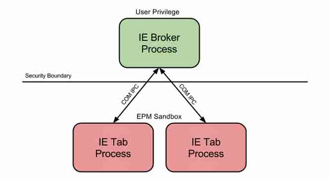

知道 Windows 访问检查是如何工作之后，我们应该可以确定你想要从 EPM 沙盒中的打开代理进程时要获得哪些权限。在 AppContainer 中代码的访问检查比 Windows 用的一套机制更复杂一些。除了通常的访问检查之外，还有两个独立的用于计算 DACL 可以提供最大的权限的额外检查。第一个检查是普通针对 Token 中用户和组 SID 的，第二个是基于 Compability SID 的检查。这两组权限进行按位和运算之后（*译注：取交集）就是可以给用户的最大权限（这里忽略了 ACE 因为它跟这个讨论并无关系）。

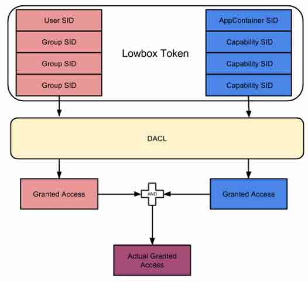

让我们看看代理进程的 DACL，下面是一个简化表单，第一次的访问检查将匹配当前用户的 SID，也就是说会给予完全控制（红色标记处），第二次检测则会匹配 IE 的 Compability SID（蓝色标记处），这两个权限取并集之后，则是只有“读、查询”的权限了。事实上这次微软修复的就是读内存的权限。

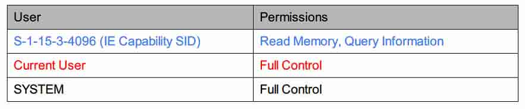

我们可以调用 OpenProcess 来把代理进程的 PID 传入，并且请求 PROCESS_VM_READ 权限，这样内核会返回给沙盒内进程一个句柄。通过这个句柄就可以用 ReadProcessMemory 来读取代理进程的任意内存。 不过这个函数会正确处理读无效的内存的操作，所以不会有任何崩溃。

```
BOOL ReadMem(DWORD ppid, LPVOID addr, LPVOID result, SIZE_T size) {
    HANDLE hProcess = OpenProcess(PROCESS_VM_READ,
                                      FALSE,
                                      ppid);
    BOOL ret = FALSE;

    if(hProcess) {
        ret = ReadProcessMemory(hProcess,
                 addr,
                 result,
                 size,
                 NULL);
        CloseHandle(hProcess);
    }

    return ret;
}

```

但是如果你是 Win64 位系统的话，从 32 位的 Tab 进程中执行此漏洞的话，事情会变的有一些复杂，因为此时 Wow64（*译注：64 位子系统）会登场，你不能直接使用 ReadProcessMemory 来读取 64 位的代理进程的内存。但是你可以使用一些例如 wow64ext 的模块来绕过这个限制，但是现在我们暂时不管它。

稍等，看一下 PM，为什么这里不会有问题呢？在 PM 中只会做一个访问检查，所以我们可以获得完全控制，但是因为微软 Vista 之后引入的强制健壮性检查（IL）特性，我们无法这么做。当一个进程试图打开另一个进程的时候，内核会首先比较访问者的 IL 和目标进程的系统 ACL。如果访问进程的 IL 比目标进程标记的健壮级别还要低，那么访问权限会被限制成一个可用权限的一个很小的子集（例如 PROCESS_QUERY_LIMITED_INFORMATION）。这将会阻止 PROCESS_VM_READ 或者更危险的权限，哪怕 DACL 已经检查了都是如此。

好的，所以让我们在 Process Explorer 中看看这个处于 EPM 沙盒中运行的程序，我们可以清楚的看到它的 Token 是处于低健壮级别的（下图选中部分）。

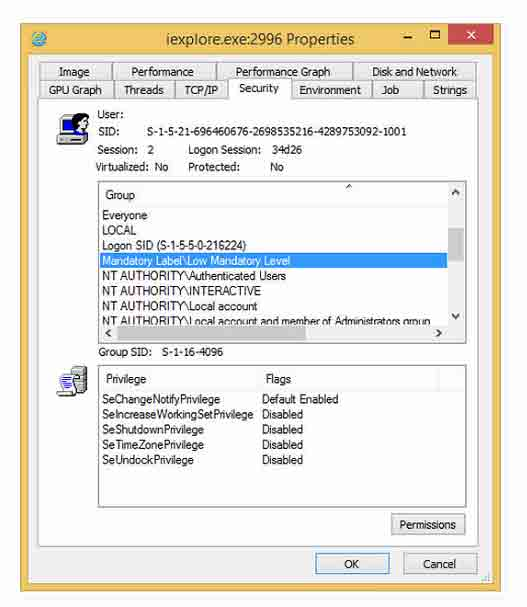

但是奇怪的是，AppContainer 访问检查看起来像是忽略了中以下级别的任何资源。如果一个资源通过了 DACL 检查，那么它就会无视 IL 而被授予权限。这看起来像是对包括文件、注册表键的任何安全资源都有效。我不知道这个为什么要这么设计，但是看起来像是一个弱点之处，如果这里 IL 正确检查了也就没有这事儿了。

## 0x02 实施漏洞

* * *

Google 事件追踪（https://code.google.com/p/google-security-research/issues/detail?id=97）提供原始的 PoC 提供了一个通过代理的 IPC 接口来读取系统任意文件的思路。通过读取各进程的 HMAC key，然后 PoC 因此伪造了一个有效的 Token，然后通过 CShDocVwBroker::GetFileHandle 来打开文件。这个对 EPM 很有用，因为 AppContainer 会阻止读取任意文件。但是，再怎么说，这个也就只是一个读取，而不是写入。理想情况我们应该能完全脱离 Sandbox，而不是只是泄露一些文件的内容。

看起来是一个困难的工作，但是事实上还有更多的使用各进程秘密值(per-process secrets)的方式来让自己变的更安全的技术。一个技术就是我最爱的 Windows COM（说笑的）。而且最终，只要我们能泄露宿主进程的内容，就有一个可以在许多进程中引入远程 COM 服务来执行代码的方式。

## COM 线程模型，套间和接口封送处理（Marshaling）

* * *

COM 被 Windows 的多个组件使用，比如 Explorer Shell，或者本地的权限服务，例如 BITS。每个用例都有不同的要求和限制，例如 UI 需要所有的代码都在一个线程里面跑，否则操作系统会很不爽（*译注：程序员也不爽）。另一方面，一个功能类则可能是完全的线程安全的。为了支持这些需求，COM 支持了一组线程模型，这个就解轻了程序员头上的担子（*译注：并没有多少）。

套间中的一个对象定义了对象中的方法是如何被调用的。有两类套间：1、单线程套间（STA）和多线程套间（MTA）（译注：STA 的特点是套间内永远只有一个线程运行，具体参阅《COM 本质论》，MTA 则如字面意思）。当考虑到这些套间是如何被调用时，我们需要定义调用者和对象的关系。因此，我们将调用者的方法称为“客户端”，对象为“服务端”。

客户端的套间由传递给 CoInitializeEx(使用 CoInitialize 则默认为 STA)的 flag 来决定。服务端的套间依赖于 Windows 注册表中 COM 对象的线程模型定义。可以有如下 3 个设置：Free（多线程），Apartment（单线程）、Both。如果客户端和服务端有兼容的套间（仅仅当服务端的对象支持两个线程模型时），那么调用该对象的函数调用就会通过对象的虚函数表直接解引用到对应的函数上。但是，在 STA 调用 MTA 或者 MTA 调用 STA 时我们需要通过某些方式来代理调用，COM 通过封送处理来处理此类操作。我们可以总结成下表。

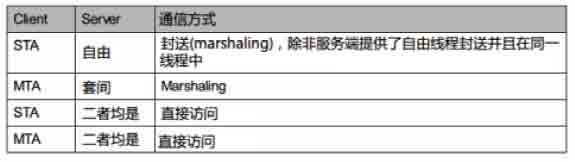

封送通过进程的序列化方法来调用服务端对象。这在 STA 中尤其重要，因为 STA 里所有东西的调用都必须在一个线程里面完成。通常这个是由 Windows 消息循环来完成，如果你的程序没有窗口或者消息循环，STA 会为你创建一个（*译注：通过“隐藏的窗口”）。当一个客户端调用一个不兼容的套间中的对象时，它其实是调用一个特别的代理（*译注：proxy，不是上方的 broker）对象。这个代理对象知道每个不通的 COM 接口和方法，包括什么方法需要什么参数。

代理接受到参数之后，会把他们通过内建的 COM 封送代码把它们序列化，然后送到服务端。服务端侧通过一个调用来反封送参数，然后调用合适的方法。任何返回值都会通过同样的方法发送到客户端。

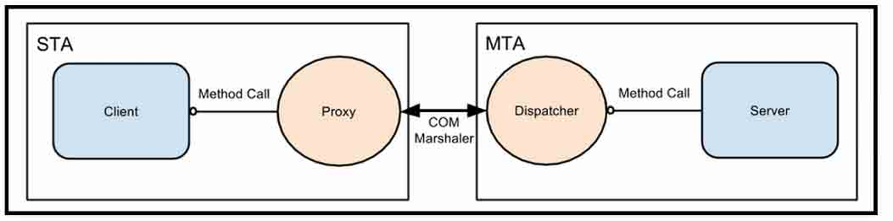

结果是，这个模型在进程内执行的就像使用 DCOM 做进程间操作一样好。同样的代理封送技术和派发（dispatcher）可以用在进程或者计算机间。仅有的不同是封送的参数的传送，他不再通过单个进程的进程内操作，而是通过本地 RPC、命名管道甚至基于客户端和服务端的位置，使用 TCP 去做。

## 自由线程封送者（free-threaded marshaler）

* * *

好吧，这就是如何在内存里泄露信息的漏洞？要理解这些，我需要再介绍一个称作“附限制线程封送模型”（FTM）的东西，这个是和之前的表格相关的。STA 客户端调用一个兼容多线程的服务端时，看起来客户端通过这个代理-封送的过程来做通信是很费效能的。为啥他不直接调用对象？这个就是 FTM 要解决的问题。

当 COM 对象从一个不兼容的套间引用中实例化时，它必需向调用者返回一个对象的引用。这个和普通的 call 时是用的同样的封送方法。事实上，这个机制同样适用于调用对象的方法时，参数中带 COM 对象的情况。使用这个机制传递引用的封送者建立了一个独特的数据流叫 OBJREF。这个数据流包含有所有的客户端需要的，能建立一个代理对象并联系服务端的信息。这个实例是 COM 对象的“按引用传递”文法。OBJREF 的例子如下：

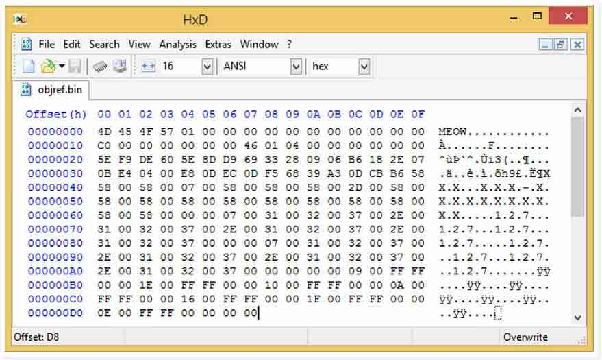

在一些场景下，尽管可以通过值传递内容，比如中止代理。当原始的客户端套间中指定对象的所有的代码都需要重新构造时，OBJREF 流可以使用按值传递文法传递。当解封送者重新构造对象时，它会创建并初始化原始对象的一个全新拷贝，而不是获取代理。一个对象可以通过 IMarshal 接口实现它自己的按值传递文法。

通过 FRM 使用的这个特性可以用来“欺骗”操作系统。即通过传递一个 OBJREF 中的已经在内存中序列化的对象，而不是传递原始对象数据的指针。当解封送时，这个指针会被反序列化并且返回给调用者。它表现得就像是一个“伪造的代理”，而且可以允许直接向原始对象发送请求。

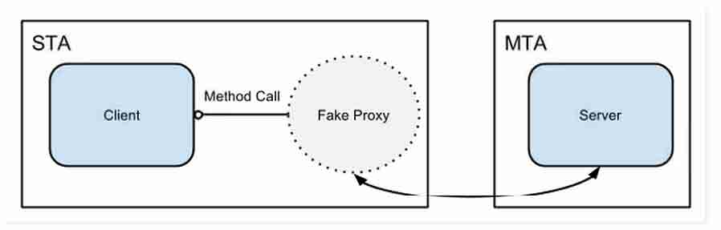

现在如果你觉得不舒服的话也是可以理解的。因为封送与 DCOM 有一些不同的地方，那么进程内 COM 就是一个重大的安全漏洞吗？很幸运，不是这样的。FTM 不仅会发送指针值，还会确保封送的数据的反封送操作仅仅会在同一个进程内执行。它通过生成一个按进程的 16 字节随机值，并且把他附在序列化数据之后。当反序列化时 FTM 会检查这个值，看看是不是当前进程保存的这个值。如果两个值不一样，它会拒绝反序列化。这个操作的前提是攻击者无法猜测或者破解这个值，因此在这个前提下 FTM 不会反封送任何它觉得不对的指针。但是这个威胁模型在我们可以读取任意内存时其实并没有用，所以我们才有了这么一个漏洞。

FTM 的这个实现是通过 combase.dll 的 CStaticMarshaler 类来完成的。在 win7 下则是 ole32.dll 的 CFreeMalshaler 类。看看 CstaticMarshaler::UnmarshallInterface 的代码，大致如下：

```
HRESULT CStaticMarshaler::UnmarshalInterface(IStream* pStm,
                                            REFIID riid, 
                                            void** ppv) {
 DWORD mshlflags;
 BYTE  secret[16];
 ULONGLONG pv;

 if (!CStaticMarshaler::_fSecretInit) {
     return E_UNEXPECTED;
 }

 pStm->Read(&mshlflags, sizeof(mshlflags));
 pStm->Read(&pv, sizeof(p));
 pStm->Read(secret, sizeof(secret));

 if (SecureCompareBuffer(secret, CStaticMarshaler::_SecretBlock)) {
     *ppv = (void*)pv;

     if ((mshlflags == MSHLFLAGS_TABLESTRONG) 
     || (mshlflags == MSHLFLAGS_TABLEWEAK)) {
         ((IUnknown*)*ppv)->AddRef();
     }

     return S_OK;
 } else {
     return E_UNEXPECTED;
 } 
}

```

注意这个方法会检测秘密值（secret）是否已经初始化，这可以阻止攻击者使用一个未初始化的秘密值（也即 0）。还有需要注意的是需要使用一个安全的字符比较函数以免受到针对秘密值检查的时差攻击。事实上这是一个非向后移植的修复。在 win7 上，字符串比较使用的是 repe cmdsd 指令，这个并不是线性时间的比较（*译注：指非原子操作）。因此在 win7 上你也许可以一次旁路时差攻击，虽然我觉得这个肯定巨费事。

最后这个结构看起来像是：

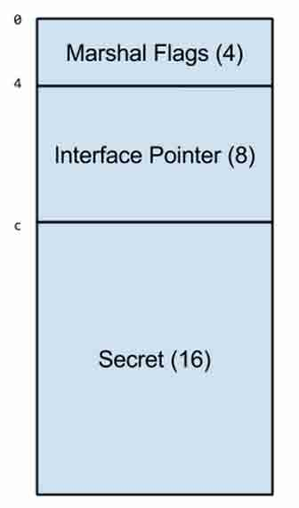

为了执行我们的代码，我们需要在我们的 com 对象中调用 IMarshal 接口。特别是我们需要执行两个函数，Imarshal::GetUnmarshalClass，当重构建代码的时候，会用到它返回要使用的 COM 对象的 CLSID。IMarshal::MarshalInterface，用来为漏洞打包合适的指针值。简单的例子如下：

```
GUID CLSID_FreeThreadedMarshaller = 
{ 0x0000033A, 0x0000, 0x0000, 
{ 0xC0, 0x00, 0x00, 0x00, 0x00, 0x00, 0x00, 0x46, } };

HRESULT STDMETHODCALLTYPE CFakeObject::GetUnmarshalClass(
REFIID riid,
void *pv,
DWORD dwDestContext,
void *pvDestContext,
DWORD mshlflags,
CLSID *pCid)
{
memcpy(pCid, &CLSID_FreeThreadedMarshaller, 
sizeof(CLSID_FreeThreadedMarshaller));

return S_OK;
}

HRESULT STDMETHODCALLTYPE CFakeObject::MarshalInterface(
       IStream *pStm,
       REFIID riid,
       void *pv,
       DWORD dwDestContext,
       void *pvDestContext,
       DWORD mshlflags)
{
  pStm->Write(&_mshlflags, sizeof(_mshlflags), NULL);
  pStm->Write(&_pv, sizeof(_pv), NULL);
  pStm->Write(&_secret, sizeof(_secret), NULL);

  return S_OK;
}

```

够简单了吧，我们看看怎么用它。

## 0x03 脱离沙盒

* * *

有了上面这些背景知识，也是时间脱离沙盒了。为了让代码脱离沙箱，在代理进程中执行，有三个我们需要做的事情：

1.  获取中介进程中 FTM 各进程秘密值。

2.  构建一个假虚表和假对象指针。

3.  封送一个对象到代理进程以执行代码。

## 获取各进程秘密值

* * *

这个很简单，我们知道这个值存在内存的位置，因为 combase.dll 在沙盒进程和代理进程中的加载地址是一样的。尽管 Vista 之后引入了 ASLR，系统 DLL 只是在启动之后会随机化一次，因此 combase.dll 会在每个进程的同一个地方被载入。这是 Windows 的 ASLR 的弱点，特别是对本地提权而言就更是如此了。但是如果你从普通的 IE 操作中读取这个值的话你会发现一个问题：

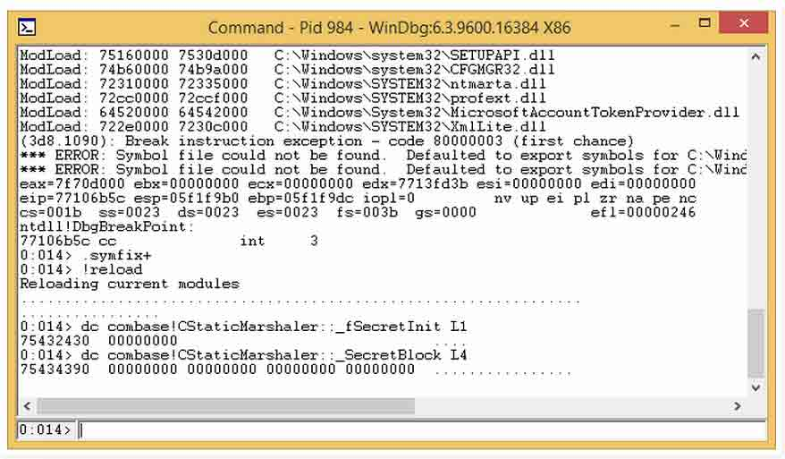

很不幸 FTM 还没初始化，这意味着再着急我们都利用不了。我们该怎么让它在沙盒进程中初始化起来呢？我们只需要让中介进程做更多的 COM 操作，特别是一些会引入 FTM 的操作。

我们可以使用打开/保存对话框，这个对话框是在 Explorer Shell 中实现的（shell32.dll），当然它是使用了 COM 的。而且它还是一个 UI，因此他肯定会使用一个 STA，但是会使用自由线程对象最终也会使用 FTM。所以让我们试试看，手动打开一个对话框看看效果。

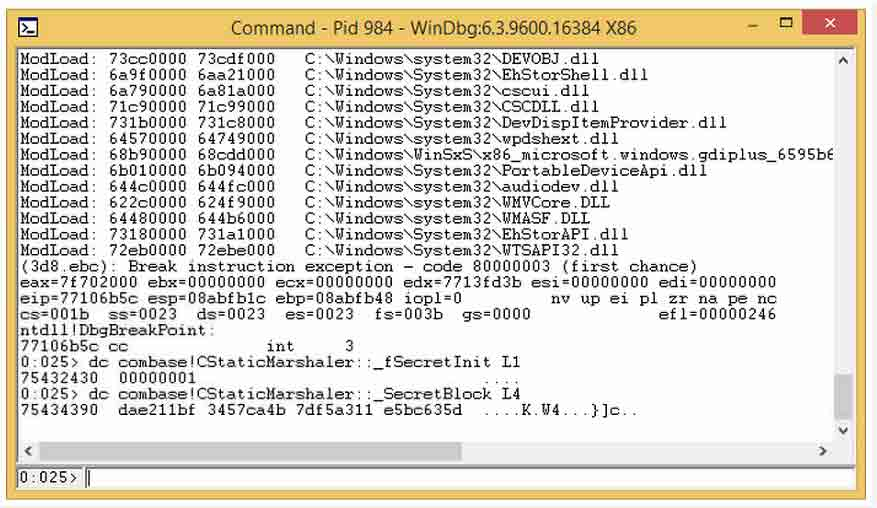

干得不错。选择它的实际理由是因为我们可以使用 IEShowSaveFileDialog API 来在沙盒进程中启动这个对话框（这个 API 通常由多个代理调用实现）。显然这个会显示一些 UI 出来，但是并不重要，因为对话框显示的时候,FTM 已经初始化过了，用户已经没啥要做的了。

现在我们可以硬编码一些 combase.dll 的偏移。当然你也可以动态的在沙盒进程中初始化 FTM 然后通过内存搜索找到它的位置。

## 构建假的虚表

* * *

下一个挑战是让我们的假虚表进入代理进程。因为我们可以读取到代理进程的内存，所以我们可以确定的使用代理进程的 API 做一些例如堆淹没（heap flooding）的操作，但是有没有更简单的方法？IE 代理进程和沙盒进程有一个共享的内存节，他们用它来传递设置和信息。这些节对沙盒进程来说有部分是可写入的，因此我们需要做的是找到对应的中介进程的映射，然后修改成我们想要的内容。在这个的例子里，使用了\Sessions\X\BaseNamed\Objects\URLZones_user （X 是 Session ID，user 是用户名），虽然它映射到了代理进程，对沙盒程序也是可写入的，但是还需要一些东西。

我们不需要暴力的去找这个节，我们需要使用 PROCESS_QUERY_INFORMATION 权限打开进程，然后使用 VirtualQueryEx 来枚举所有映射的内存节，因为它会返回大小，所以我们可以快速的跳过没映射的区域。然后我们可以找一个写入区域的保护值（*译注：canary value，用于检测缓冲区溢出的值）来确定释放地址。

```
DWORD_PTR FindSharedSection(LPBYTE section, HANDLE hProcess)
{
  // No point starting at lowest value
  LPBYTE curr = (LPBYTE)0x10000;
  LPBYTE max = (LPBYTE)0x7FFF0000;

  memcpy(&section[0], "ABCD", 4);

  while (curr < max)
  {
    MEMORY_BASIC_INFORMATION basicInfo = { 0 };
    if (VirtualQueryEx(hProcess, curr,
               &basicInfo, sizeof(basicInfo)))
    {
       if ((basicInfo.State == MEM_COMMIT)
          && (basicInfo.Type == MEM_MAPPED)
          && (basicInfo.RegionSize == 4096))
       {
          CHAR buf[4] = { 0 };
          SIZE_T read_len = 0;

          ReadProcessMemory(hProcess, (LPBYTE)basicInfo.BaseAddress, 
                            buf, 4, &read_len);

          if (memcmp(buf, "ABCD", 4) == 0)
          {
             return (DWORD_PTR)basicInfo.BaseAddress;
          }
        }

        curr = (LPBYTE)basicInfo.BaseAddress + basicInfo.RegionSize;
     }
     else
     {
        break;
     }
  }

  return 0;
}

```

决定了需要在共享内存的哪里创建虚表和假对象之后，我们应该怎么调用这个虚表？你可能会想到使用一个 ROP 链（*译注：返回导向），但是显然我们不需要这么做。因为所有的 COM 调用都使用 stdcall，所以所有参数都放在了栈上，所以我们可以几乎通过 this 指针来调用所有的东西。

有一个用攻击方式是使用类似 LoadLibraryW 的函数，然后构建一个会加载指向相对路径 DLL 的假对象。因为虚表指针并没有任何 NULLCHAR（这个导致了在 64 位系统上难以使用这个方式去攻击），因此我们可以把它（虚表）从路径中移除，这会导致它加载那个库。为了解决这个问题，我们可以把低 16 位设置成任何随机值，而且因为高 16 位并不在我们掌控之中，所以它几乎不会以 0 结束，因为 Windows 的空页保护禁止分配低 64KB 的地址。最后我们的假对象看起来像是：

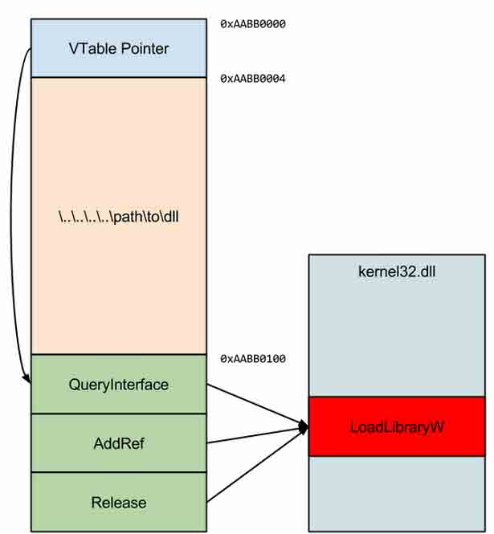

当然，如果你查看它 IUnknown 接口的定义，你会发现这个对象的虚表中仅仅 AddRef 和 Release 有正确的 signature。如果代理进程在对象上调用 QueryInterface 的话，这时候 signature 肯定是不正确的。在 64 位系统上因为传参的方式不同，这个倒没啥问题。但是在 32 位系统上这个却会导致栈无法对齐，这不是我想要的结果。但是其实并没事，如果这是一个问题的话肯定有解决方案，或者干脆在代理进程中调用 ExitProcess 就好了。但是，注入一个对象时，我们要选择一个合适的方式，如果对象可能完全不会调用它，也就不会出现这个问题了。这就是我们接下来要做的。

## 封送一个对象到代理进程

* * *

最终也是一个简单的点，因为沙盒中使用的代理进程的所有接口都使用 COM，因此我们需要做的就是找到一个只调用 IUnknown 的指针，然后把我们的假封送对象给它。为了达到这个目的，我发现你可以请求 Shell Document View 的 IEBrokerAttach 接口，它只有如下一个函数原型：

> HRESULT AttachIEFrameToBroker(IUnknown* pFrame);

为了让我们的指针到达中介进程之前做的更完美，我们会预设好一个 frame，因此当不带 pFrame 对象时调用这个方法会立刻失败。因此我们并不需要担心会有 QueryInterface 会被调用，我们的漏洞代码会在这个函数被调用之前就被执行，所以我们并不关心 QueryInterface 导致的问题。

所以，我们通过调用这个方法来创建我们的假对象。这将导致 COM 开始封送我们的代码到 OBJREF 对象中。最终在 IPC 通道的另一头，也就是 COM 开始反封送的地方停止。这将调用 FTM 的 UnmarshalInterface 方法，而且我们已经成功的找到了秘密值，因此我们可以愉快的解包我们的假对象指针。最终，这个方法会调用对象上的 AddRef，这时我们也可以传递 mshlflags 到 MSHLFLAGS_TABLESTRONG。这将调用 LoadLibraryW，而且它的“路径”参数是我们的假对象，这将随机加载一个 DLL 到代理进程中。所有需要做的就是弹一个 calc，现在任务完成。

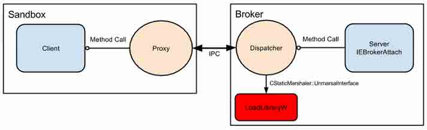

最终，真实的服务断函数会被调用，但是会立刻返回一个错误。一个漂亮的沙盒跳出，尽管它需要大量的代码来支持。

## 0x04 演讲结束

* * *

所以我在原来的事件追踪（https://code.google.com/p/google-security-research/issues/detail?id=97）中添加了一个新的 PoC，这可以在 32 位 Windows 8.1 系统上执行攻击（显然你不能打 MS14-065 补丁）。在 64 位 Windows 8.1 上它执行的不是太好，因为中介进程是 64 位的，尽管 Tab 进程可能还是 32 位的。如果你想让他在 64 位上运行，你需要再试一试，但是因为你可以控制 RIP，所以并不是什么太难的事情。如果你想要在最新的机器上试验，PoC 中也有一个工具，SetProcessDACL，这可以修改一个程序的 DACL，给它重新加一个带读权限的 IE Compability SID。

希望这个可以给你一些对待类似漏洞的解决方法。还有，不要因为这个抱怨 COM，因为这个跟它没啥关系。这只是用来演示一个相对无害的内存任意读取最终如何打破层层防守演变成任意代码执行和权限提升的例子。

版权声明：未经授权禁止转载 [blast](http://drops.wooyun.org/author/blast "由 blast 发布")@[乌云知识库](http://drops.wooyun.org)

分享到：

### 相关日志

*   [XSS 和字符集的那些事儿](http://drops.wooyun.org/papers/1327)
*   [Python 编写 shellcode 注入程序](http://drops.wooyun.org/tips/4413)
*   [雅虎某分站的 XSS 导致雅虎邮箱沦陷](http://drops.wooyun.org/papers/1024)
*   [Python 编写简易木马程序](http://drops.wooyun.org/papers/4751)
*   [DVWA 中学习 PHP 常见漏洞及修复方法](http://drops.wooyun.org/papers/483)
*   [Google DNS 劫持背后的技术分析](http://drops.wooyun.org/papers/1207)