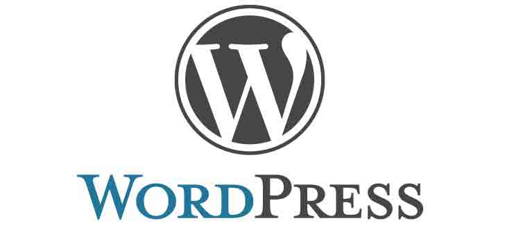

# WordPress 更新至 3.8.2 修复多个漏洞

2014/04/11 17:46 | [News](http://drops.wooyun.org/author/news "由 News 发布") | [web 安全](http://drops.wooyun.org/category/web "查看 web 安全 中的全部文章"), [业界资讯](http://drops.wooyun.org/category/news "查看 业界资讯 中的全部文章") | 占个座先 | 捐赠作者



在被 OpenSSL 刷屏的时候，WordPress 更新。

WordPress 3.8.2 现在已经提供下载，最新的版本更新了几个重要的安全问题，所以推荐更新。

WordPress 3.8.2 修复的一个重要漏洞是 cookie 伪造漏洞（[CVE -2014- 0166](http://web.nvd.nist.gov/view/vuln/detail?vulnId=CVE-2014-0166)）。该漏洞可以被攻击者利用通过伪造身份验证 Cookie，登陆网站。该漏洞是由 WordPress 的安全团队成员[Jon Cave](http://joncave.co.uk/)发现。

第二个漏洞是权限提升（CVE -2014- 0165）漏洞，可以使投稿人角色发布文章。

还有[后台注入漏洞](https://security.dxw.com/advisories/sqli-in-wordpress-3-6-1/)，以及在上传文件处使用第三方库导致的 xss 漏洞。

注入漏洞修改代码：[`core.trac.wordpress.org/changeset/27917`](https://core.trac.wordpress.org/changeset/27917)

是一个二次注入。

cookie 伪造修复 wp-includes/pluggable.php 文件中：

[`github.com/WordPress/WordPress/commit/7f001bfe242580eb18f98e2889aad4ab1b33301b`](https://github.com/WordPress/WordPress/commit/7f001bfe242580eb18f98e2889aad4ab1b33301b)

```
    $key = wp_hash($username . $pass_frag . '|' . $expiration, $scheme);
    $hash = hash_hmac('md5', $username . '|' . $expiration, $key);

 -  if ( $hmac != $hash ) {
 +  if ( hash_hmac( 'md5', $hmac, $key ) !== hash_hmac( 'md5', $hash, $key ) ) {

```

版权声明：未经授权禁止转载 [News](http://drops.wooyun.org/author/news "由 News 发布")@[乌云知识库](http://drops.wooyun.org)

分享到：

### 相关日志

*   [WordPress 3.8.2 cookie 伪造漏洞再分析](http://drops.wooyun.org/papers/1409)
*   [一起针对国内企业 OA 系统精心策划的大规模钓鱼攻击事件](http://drops.wooyun.org/tips/2562)
*   [Angry Birds 和广告系统泄露个人信息——FireEye 对 Angry Birds 的分析](http://drops.wooyun.org/news/1408)
*   [Wordpress 3.8.2 补丁分析 HMAC timing attack](http://drops.wooyun.org/papers/1404)
*   [Top 10 Security Risks for 2014](http://drops.wooyun.org/news/2731)
*   [网络安全威胁周报——第 201411 期](http://drops.wooyun.org/news/1195)