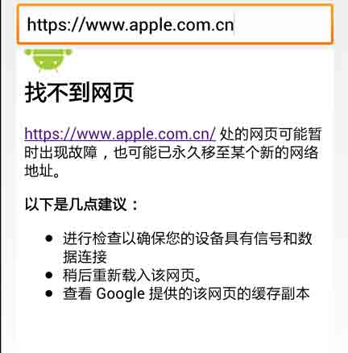
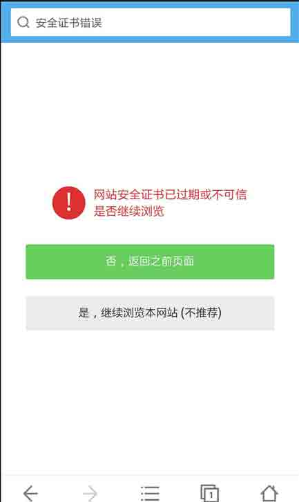
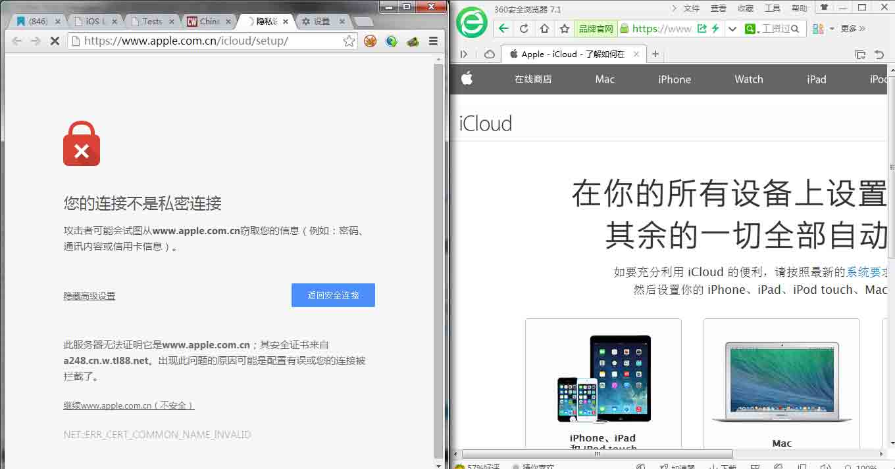
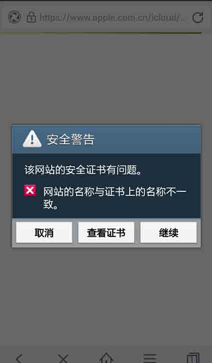
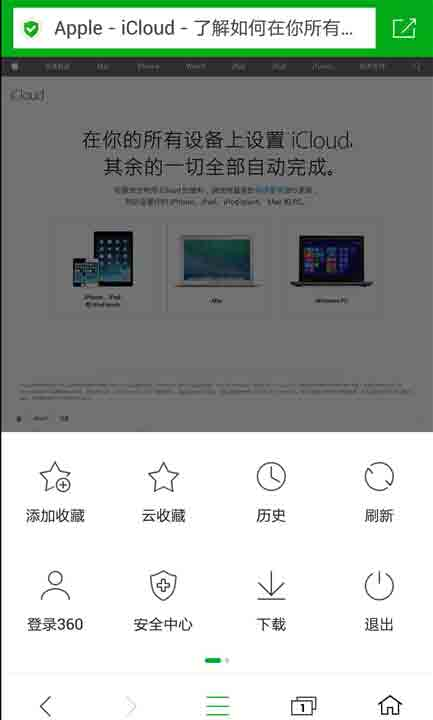
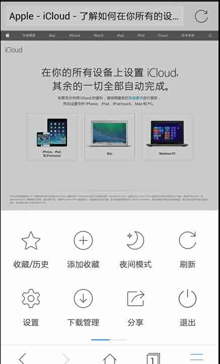
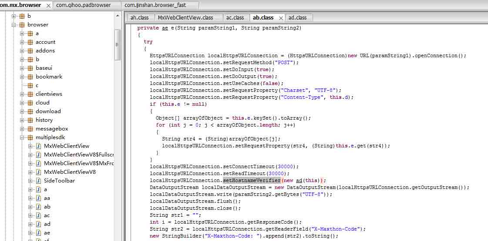
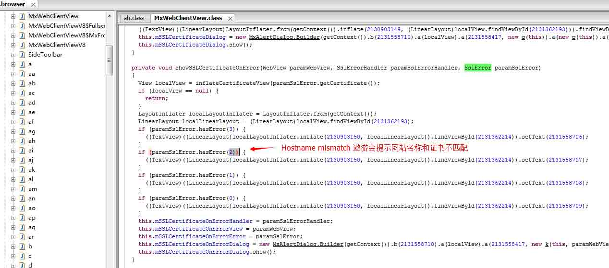
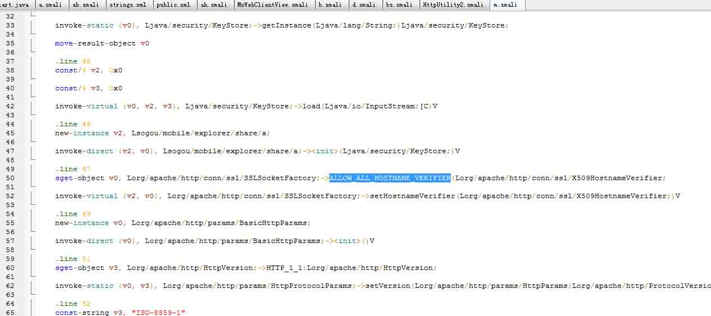

# Android 证书信任问题与大表哥

2014/10/23 12:14 | [瘦蛟舞](http://drops.wooyun.org/author/瘦蛟舞 "由 瘦蛟舞 发布")   | [技术分享](http://drops.wooyun.org/category/tips "查看 技术分享 中的全部文章"), [移动安全](http://drops.wooyun.org/category/mobile "查看 移动安全 中的全部文章")  | 占个座先  | 捐赠作者

## 0x00 起因

* * *

1、近期 icloud.com、yahoo.com、apple.com 遭遇到大规模劫持

[WooYun: Yahoo 雅虎在国内访问遭遇 SSL 中间人攻击（被替换为自签名证书）](http://www.wooyun.org/bugs/wooyun-2014-080117)

2、乌云平台、CVE 都收到大量有关 Android APP 信任所有证书的漏洞

[WooYun: 国内绝大部分 Android APP 存在信任所有证书漏洞](http://www.wooyun.org/bugs/wooyun-2014-079358)

3、老外写有关大表哥的文章中提到 MITM 时 360 浏览器不提示证书错误

[`www.computerworld.com/article/2836084/chinese-big-brother-launches-nationwide-attack-on-icloud.html`](http://www.computerworld.com/article/2836084/chinese-big-brother-launches-nationwide-attack-on-icloud.html)

之前信任证书问题一直都有被提到，但是普遍不受大家重视，因为这个漏洞是利用是需要场景的：MITM（中间人攻击 Man-in-the-middle attack）。一般情况下 MITM 相对其他攻击是比较少见的，如果有良好的上网习惯如不接入不受信任的网络，那就更少可能受此类攻击了。但是近期发生的 MITM 据传是在核心骨干网 BGP 上做了改动所以劫持范围非常之广，真是防不胜防呀，你被劫持了么？

## 0x01 科普

* * *

**https&&ssl**

为了提高网站的安全性，一般会在比较敏感的部分页面采用 https 传输，比如注册、登录、控制台等。像 Gmail、网银、icloud 等则全部采用 https 传输。https/ssl 主要起到两个作用：网站认证、内容加密传输和数据一致性。经 CA 签发的证书才起到认证可信的作用，所有有效证书均可以起到加密传输的作用。

**数字证书**

主要在互联网上的用于身份验证的用途。 安全站点在获得 CA（Certificate Authority 数字证书认证机构）认证后，获得一个数字证书，以此来标识其合法身份的真实性。数字证书主要分为服务器证书和客户端证书。服务器证书（SSL 证书）用来进行身份验证和通信的加密，客户端证书主要用于身份验证和电子签名。找 CA 申请证书是要收费的。

**自签名证书**

非 CA 颁发的证书，通过自签名的方式得到的证书。通常 Web 浏览器会显示一个对话框，询问您是否希望信任一个自签名证书。这个是不用花钱的。

**中间人攻击**

是指攻击者与通讯的两端分别创建独立的联系，并交换其所收到的数据，使通讯的两端认为他们正在通过一个私密的连接与对方直接对话，但事实上整个会话都被攻击者完全控制。在中间人攻击中，攻击者可以拦截通讯双方的通话并插入新的内容。在许多情况下这是很简单的。

## 0x02 分析

* * *

如果自己简单的实现 android webview 加载网页，如果直接访问可信证书的站点是可以正常显示，但是如果访问自签名的证书的站点就会显示 notfound 的页面。(写本文时 apple.com 以及 apple.com.cn 处于劫持状态)



logcat 会输出网页显示不安全的内容

```
Web Console:The page displayed insecure content! 
```

功能健全的手机浏览器访问自签名证书的站点会如下提醒



在 PC 端如果访问自签名证书的站点则会出现如下图左侧的提醒



为解决`javax.net.ssl.SSLPeerUnverifiedException: No peer certificate`的异常，开发者往往会采用以下的错误解决方案。如此是浏览器应用采用此类解决方案，那么风险就更大了。

覆盖 google 默认的证书检查机制

```
class bv
  implements X509TrustManager
{
  bv(bu parambu) {}

  public void checkClientTrusted(X509Certificate[] paramArrayOfX509Certificate, String paramString) {// Do nothing -> accept any certificates}

  public void checkServerTrusted(X509Certificate[] paramArrayOfX509Certificate, String paramString) {// Do nothing -> accept any certificates}

  public X509Certificate[] getAcceptedIssuers()
  {
    return null;
  }
}

```

信任所有主机名

```
public static HttpClient getNewHttpClient() {  
    try {  
        //获得密匙库
        KeyStore trustStore = KeyStore.getInstance(KeyStore.getDefaultType());  
        trustStore.load(null, null);  

        SSLSocketFactory sf = new SSLSocketFactoryEx(trustStore); 
        //信任所有主机名 
        sf.setHostnameVerifier(SSLSocketFactory.ALLOW_ALL_HOSTNAME_VERIFIER);  

        HttpParams params = new BasicHttpParams();  
        HttpProtocolParams.setVersion(params, HttpVersion.HTTP_1_1);  
        HttpProtocolParams.setContentCharset(params, HTTP.UTF_8);  

        SchemeRegistry registry = new SchemeRegistry();  
        registry.register(new Scheme("http", PlainSocketFactory.getSocketFactory(), 80));  
        registry.register(new Scheme("https", sf, 443));  

        ClientConnectionManager ccm = new ThreadSafeClientConnManager(params, registry);  

        return new DefaultHttpClient(ccm, params);  
    } catch (Exception e) {  
        return new DefaultHttpClient();  
    }  
}  

```

empty HostnameVerifier

```
HostnameVerifier hv = new HostnameVerifier() {
@Override
public boolean verify(String hostname, SSLSession session) {
// Always return true -> Accespt any host names
return true;
}
};

```

其实早在 14 年 2 月[窃听风暴： Android 平台 https 嗅探劫持漏洞](http://drops.wooyun.org/papers/959)文中就有提到 android 平台的 app 因为覆盖 google 默认的证书检查机制（X509TrustManager）之后没有对证书进行应有的安全性检查，直接接受了所有异常的 https 证书，不提醒用户存在安全风险，也不终止这次危险的连接。文中对证书域名检查（HostnameVerifier）部分没有细说。

上文有提到 PC 版的 360 浏览器访问被劫持网站居然没有证书错误提示，让人很不敢相信。加上最近 android app 证书问题频发，猜想是否有可能一些手机浏览器也会有此类漏洞了。测试过程中发现 360 手机浏览器、和搜狗浏览器存在此风险。

百度和遨游轻松检测出证书异常




而 360 和搜狗直接加载进入了被劫持的网站。





反编译查看遨游浏览器的代码，针对证书异常做了处理





而搜狗浏览器则是做了证书信任所有主机名不当处理



关键字：checkServerTrusted、setHostnameVerifier、ALLOW_ALL_HOSTNAME_VERIFIER、X509TrustManager、onReceivedSslError

## 0x03 对比

* * *

对主流手机浏览器进行了横向对比，测试对象包括：firefox、chrome、UC 浏览器、搜狗浏览器、百度浏览器、360 安全浏览器、欧鹏浏览器、遨游云浏览器、猎豹浏览器。

测试方法：手机访问[`example.com/`](https://example.com/),观察是否有安全提醒。

未做提醒直接加载网页：360 安全浏览器、猎豹浏览器、搜狗浏览器

正常做出安全提醒：firefox、chrome、UC 浏览器、百度浏览器、欧鹏浏览器、遨游云浏览器

## 0x04 建议

* * *

开发者：

1、非浏览器 app，有钱申请 ca 证书没钱在客户端中添加证书,切勿信任所有证书。

2、浏览器 app，严格按照客户端校验服务器证书流程处理:

*   查看证书是否过期
*   CA 是否可靠
*   CA 的公钥能否正确解开服务器证书的 CA 数字签名，即证书的签名值
*   服务器证书上的域名是否和服务器的实际域名相匹配

3、建议使用 setHostnameVerifier(SSLSocketFactory.STRICT_HOSTNAME_VERIFIER)

用户：使用安全性较好的 app

## 0x05 参考

* * *

[`drops.wooyun.org/tips/2775`](http://drops.wooyun.org/tips/2775 "http://drops.wooyun.org/tips/2775")

[`drops.wooyun.org/papers/959`](http://drops.wooyun.org/papers/959 "http://drops.wooyun.org/papers/959")

[`developer.android.com/reference/javax/net/ssl/HttpsURLConnection.html`](http://developer.android.com/reference/javax/net/ssl/HttpsURLConnection.html "http://developer.android.com/reference/javax/net/ssl/HttpsURLConnection.html")

[`developer.android.com/reference/javax/net/ssl/X509TrustManager.html`](http://developer.android.com/reference/javax/net/ssl/X509TrustManager.html)

[`developer.android.com/training/articles/security-ssl.html`](http://developer.android.com/training/articles/security-ssl.html)

[`developer.android.com/reference/org/apache/http/conn/ssl/SSLSocketFactory.html`](http://developer.android.com/reference/org/apache/http/conn/ssl/SSLSocketFactory.html)

版权声明：未经授权禁止转载 [瘦蛟舞](http://drops.wooyun.org/author/瘦蛟舞 "由 瘦蛟舞 发布")@[乌云知识库](http://drops.wooyun.org)

分享到：碎银子打赏，作者好攒钱娶媳妇：


### 相关日志

*   [一次 app 抓包引发的 Android 分析（续）](http://drops.wooyun.org/tips/2986)
*   [Android Broadcast Security](http://drops.wooyun.org/tips/4393)
*   [Android Activtity Security](http://drops.wooyun.org/tips/3936)
*   [Android Logcat Security](http://drops.wooyun.org/tips/3812)
*   [APK 签名校验绕过](http://drops.wooyun.org/mobile/4296)
*   [Android Content Provider Security](http://drops.wooyun.org/tips/4314)