# Burp Suite 使用介绍（一） 

2014/05/01 19:54 | [小乐天](http://drops.wooyun.org/author/小乐天 "由 小乐天 发布") | [工具收集](http://drops.wooyun.org/category/tools "查看 工具收集 中的全部文章") | 占个座先 | 捐赠作者

## Getting Started

* * *

Burp Suite 是用于攻击 web 应用程序的集成平台。它包含了许多工具，并为这些工具设计了许多接口，以促进加快攻击应用程序的过程。所有的工具都共享一个能处理并显示 HTTP 消息，持久性，认证，代理，日志，警报的一个强大的可扩展的框架。本文主要介绍它的以下特点：

```
1.Target(目标)——显示目标目录结构的的一个功能
2.Proxy(代理)——拦截 HTTP/S 的代理服务器，作为一个在浏览器和目标应用程序之间的中间人，允许你拦截，查看，修改在两个方向上的原始数据流。
3.Spider(蜘蛛)——应用智能感应的网络爬虫，它能完整的枚举应用程序的内容和功能。
4.Scanner(扫描器)——高级工具，执行后，它能自动地发现 web 应用程序的安全漏洞。
5.Intruder(入侵)——一个定制的高度可配置的工具，对 web 应用程序进行自动化攻击，如：枚举标识符，收集有用的数据，以及使用 fuzzing 技术探测常规漏洞。
6.Repeater(中继器)——一个靠手动操作来触发单独的 HTTP 请求，并分析应用程序响应的工具。
7.Sequencer(会话)——用来分析那些不可预知的应用程序会话令牌和重要数据项的随机性的工具。
8.Decoder(解码器)——进行手动执行或对应用程序数据者智能解码编码的工具。
9.Comparer(对比)——通常是通过一些相关的请求和响应得到两项数据的一个可视化的“差异”。
10.Extender(扩展)——可以让你加载 Burp Suite 的扩展，使用你自己的或第三方代码来扩展 Burp Suit 的功能。
11.Options(设置)——对 Burp Suite 的一些设置 
```

## 测试工作流程

Burp 支持手动的 Web 应用程序测试的活动。它可以让你有效地结合手动和自动化技术，使您可以完全控制所有的 BurpSuite 执行的行动，并提供有关您所测试的应用程序的详细信息和分析。 让我们一起来看看 Burp Suite 的测试流程过程吧。 如下图

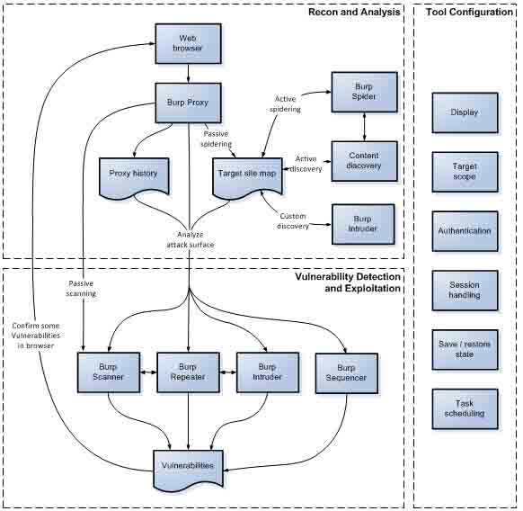

## 简要分析

代理工具可以说是 Burp Suite 测试流程的一个心脏，它可以让你通过浏览器来浏览应用程序来捕获所有相关信息，并让您轻松地开始进一步行动，在一个典型的测试中，侦察和分析阶段包括以下任务：

手动映射应用程序-使用浏览器通过 BurpSuite 代理工作，手动映射应用程序通过以下链接，提交表单，并通过多步骤的过程加强。这个过程将填充代理的历史和目标站点地图与所有请求的内容，通过被动蜘蛛将添加到站点地图，可以从应用程序的响应来推断任何进一步的内容(通过链接、表单等)。也可以请求任何未经请求的站点(在站点地图中以灰色显示的)，并使用浏览器请求这些。

在必要是执行自动映射-您可以使用 BurpSuite 自动映射过程中的各种方法。可以进行自动蜘蛛爬行，要求在站点地图未经请求的站点。请务必在使用这个工具之前，检查所有的蜘蛛爬行设置。

使用内容查找功能发现，可以让您浏览或蜘蛛爬行可见的内容链接以进一步的操作。

使用 BurpSuite Intruder(入侵者)通过共同文件和目录列表执行自定义的发现，循环，并确定命中。

注意，在执行任何自动操作之前，可能有必要更新的 BurpSuite 的配置的各个方面，诸如目标的范围和会话处理。

分析应用程序的攻击面 - 映射应用程序的过程中填入代理服务器的历史和目标站点地图与所有的 BurpSuite 已抓获有关应用程序的信息。这两个库中包含的功能来帮助您分析它们所包含的信息，并评估受攻击面的应用程序公开。此外，您可以使用 BurpSuite 的目标分析器报告的攻击面的程度和不同类型的应用程序使用的 URL 。

接下来主要介绍下 BurpSuite 的各个功能吧。先介绍 Proxy 功能，因为 Proxy 起到一个心脏功能，所有的应用都基于 Proxy 的代理功能。

## Burp Suite 功能按钮键翻译对照

|  
###         导航栏

 |              |              |              |
|       Burp      |       BurpSuite      |       save state wizard      |       保存状态向导      |
|       restore state      |       恢复状态      |       Remember setting      |       记住设置      |
|       restore defaults      |       恢复默认      |       Intruder      |       入侵者      |
|       Start attack      |       开始攻击(爆破)      |       Actively scan defined insertion points      |       定义主动扫描插入点      |
|       Repeater      |       中继器      |       New tab behavior      |       新标签的行为      |
|       Automatic payload positions      |       自动负载位置      |       config predefined payload lists      |       配置预定义的有效载荷清单      |
|       Update content-length      |       更新内容长度      |       unpack gzip/deflate      |       解压 gzip/放弃      |
|       Follow redirections      |       跟随重定向      |       process cookies in redirections      |       在重定向过程中的 cookies      |
|       View      |       视图      |       Action      |       行为      |
|  
###         功能项

 |              |              |              |
|       Target      |       目标      |       Proxy      |       代理      |
|       Spider      |       蜘蛛      |       Scanner      |       扫描      |
|       Intruder      |       入侵者      |       Repeater      |       中继器      |
|       Sequencer      |       定序器      |       Decoder      |       解码器      |
|       Comparer      |       比较器      |       Extender      |       扩展      |
|       Options      |       设置      |       Detach      |       分离      |
|       Filter      |       过滤器      |       SiteMap      |       网站地图      |
|       Scope      |       范围      |       Filter by request type      |       通过请求过滤      |
|       Intercept      |       拦截      |       response Modification      |       响应修改      |
|       match and replace      |       匹配和替换      |       ssl pass through      |       SSL 通过      |
|       Miscellaneous      |       杂项      |       spider status      |       蜘蛛状态      |
|       crawler settings      |       履带式设置      |       passive spidering      |       被动蜘蛛      |
|       form submission      |       表单提交      |       application login      |       应用程序登录      |
|       spider engine      |       蜘蛛引擎      |       scan queue      |       扫描队列      |
|       live scanning      |       现场扫描      |       live active scanning      |       现场主动扫描      |
|       live passive scanning      |       现场被动扫描      |       attack insertion points      |       攻击插入点      |
|       active scanning optimization      |       主动扫描优化      |       active scanning areas      |       主动扫描区域      |
|       passive scanning areas      |       被动扫描区域      |       Payload      |       有效载荷      |
|       payload processing      |       有效载荷处理      |       select live capture request      |       选择现场捕获请求      |
|       token location within response      |       内响应令牌的位置      |       live capture options      |       实时捕捉选项      |
|       Manual load      |       手动加载      |       Analyze now      |       现在分析      |
|       Platform authentication      |       平台认证      |       Upstream proxy servers      |       上游代理服务器      |
|       Grep Extrack      |       提取      |              |              |

## Proxy 功能

* * *

Burp Proxy 相当于 BurpSuite 的心脏，通过拦截，查看和修改所有的请求和响应您的浏览器与目标 Web 服务器之间传递。 下面了解有关 BurpProxy：

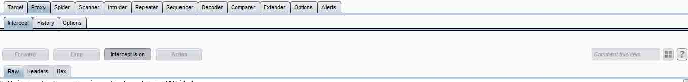

## Using BurpProxy http、https

### http

设置代理的方法：以 http ie 为例：

```
工具>>Internet 选项>>连接>>局域网>>勾选代理服务器填写地址 127.0.0.1 端口 8080 
```

这里端口可以随便定义但是要跟 burp 的监听端口要一致然后保存再到 Proxy 的 Options 中添加 add

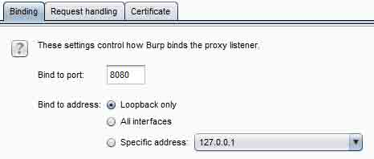

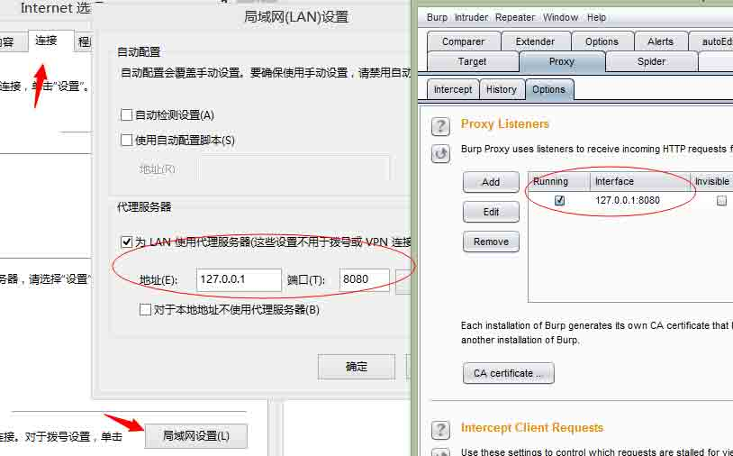

这样 http 协议的监听就可以了,当 intercept is on 表示开启拦截功能，反之

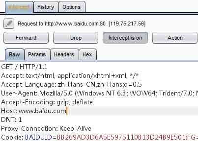

这样就代表拦截成功，我们可以右击 send to Repeater 去修改数据再发送，也可以右击改变提交请求方式(change request method)比如 get 或者 post 等功能

### https

```
1.以管理员权限运行 ie 浏览器
2.像 http 那样配置好代理 
3.在地址栏访问 https 地址，单击继续 
4.点击错误证书在这个地址栏 
5.点击查看证书 
6.在证书路径选项卡点击 PortSwigger CA,然后再点击查看证书 
7.在常规选项卡里点击安装证书 
8.在证书导入向导中，选择“将所有的证书放入下列存储区” 
9.点击浏览 
10.以当前用户或者本机计算机都可以 
11.点击 ok 完成导入 
12.重启 ie（不需要以管理员权限运行） 其它浏览器差不多具体请查看官网 
```

[`portswigger.net/burp/Help/proxy_options_installingCAcert.html`](http://portswigger.net/burp/Help/proxy_options_installingCAcert.html)

### Intercept

用于显示和修改 HTTP 请求和响应，通过你的浏览器和 Web 服务器之间。在 BurpProxy 的选项中，您可以配置拦截规则来确定请求是什么和响应被拦截(例如，范围内的项目，与特定文件扩展名，项目要求与参数，等)。 该面板还包含以下控制：

#### Forward

当你编辑信息之后，发送信息到服务器或浏览器

#### Drop

当你不想要发送这次信息可以点击 drop 放弃这个拦截信息

#### Interception is on/off

这个按钮用来切换和关闭所有拦截。如果按钮显示 Interception is On，表示请求和响应将被拦截或自动转发根据配置的拦截规则配置代理选项。如果按钮显示 Interception is off 则显示拦截之后的所有信息将自动转发。

#### Action

说明一个菜单可用的动作行为操作可以有哪些操作功能。

#### Comment field

为请求或响应添加注释，以便更容易在 History 选项卡中识别它们。


#### Highlight

为请求或响应添加颜色，可以在 history 选项卡和截获中更容易发现。


#### History

代理历史认为每个请求和响应。通过代理可以记录全部请求和响应。您可以过滤和注释这个信息来帮助管理它，并使用代理的历史来测试流程。History(代理历史)总在更新，即使你把 Interception turned off(拦截关闭)，允许浏览不中断的同时还监测应用流量的关键细节。

#### History Table

表中显示已通过代理 HTTP 消息的所有请求，并且可以查看完整的你所做的任何修改和截获的信息的请求和响应。 表中包含以下字段：

`# (请求索引号)、Host(主机)、Method(请求方式)、URL(请求地址)、Params(参数)、Edited(编辑)、Status(状态)、Length(响应字节长度)、MIME type(响应的 MLME 类型)、Extension(地址文件扩展名)、Title(页面标题)、Comment(注释)、SSL、IP(目标 IP 地址)、Cookies、Time(发出请求时间)、Listener port(监听端口)`。

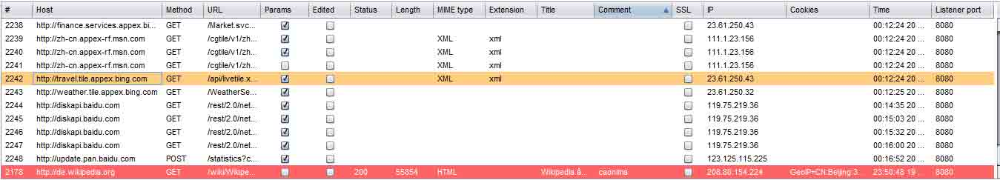

您可以通过单击任何列标题进行升序或降序排列。如果您在表中双击选择一个项目地址，会显示出一个详细的请求和响应的窗口。或者右击选择 `Show new history window`

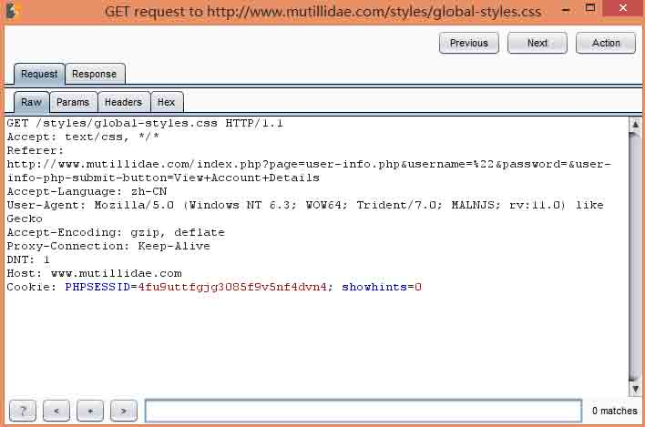

### Display Filter

Proxy histroy 有一个可以用来在视图中隐藏某些内容的功能，以使其更易于分析和你感兴趣的工作内容的显示过滤。 History Table 上方的过滤栏描述了当前的显示过滤器。点击过滤器栏打开要编辑的过滤器选项。该过滤器可以基于以下属性进行配置：

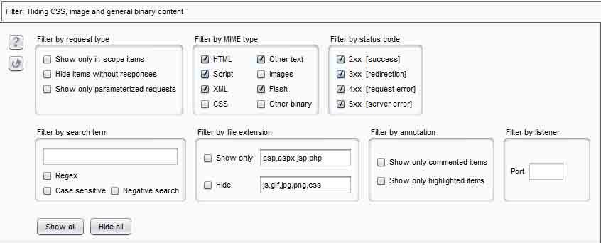

#### Request type

Show only in-scope items--勾选则显示在范围内的项目，反之。

#### MIME type

您可以设定是否显示或隐藏包含各种不同的 MIME 类型，如 HTML，CSS 或图像的响应。

#### Status code

您可以设定是否要显示或隐藏各种 HTTP 状态码响应。

#### Search term

您可以过滤对反应是否不包含指定的搜索词。您可以设定搜索词是否是一个文字字符串或正则表达式，以及是否区分大小写。如果您选择了“Negative search (消极搜索)”选项，然后不匹配的搜索词唯一的项目将被显示。

#### File extension

您可以设定是否要显示或隐藏指定的文件扩展名的项目。

#### Annotation

您可以设定是否显示使用用户提供的评论或仅亮点项目。

#### Listener

你可以只显示特定的监听端口上接收的项目。测试访问控制时可能有用。 如果设置一个过滤器，隐藏一些项目，这些都没有被删除，只是隐藏起来，如果你取消设置相关的过滤器将再次出现。这意味着您可以使用筛选器来帮助您系统地研究了大量代理的历史来理解各种不同的请求显示。

### Annotations

您可以通过添加注释和批注亮点代理历史记录项。这可能是有用的描述不同要求的目的，并标记了进一步查看。 两种方式添加亮点： 1)使用在最左边的表列中的下拉菜单中突出显示单个项目。 2)可以突出显示使用上下文菜单中的“亮点”项目的一个或多个选定的项目。 两种方法添加注释： 1)双击相关条目，注释列中，添加或编辑就地评论。 2)发表评论使用上下文菜单中的“添加注释”项目的一个或多个选定的项目。 除了以上两种，您也可以注释项目，它们出现在拦截选项卡，这些都将自动出现在历史记录表。 当您已经注明想要的请求，您可以使用列排序和显示过滤器后迅速找到这些项目。

### Options

设置代理监听、请求和响应，拦截反应，匹配和替换，ssl 等。

### Proxy Listeners

代理侦听器是侦听从您的浏览器传入的连接本地 HTTP 代理服务器。它允许您监视和拦截所有的请求和响应，并且位于 BurpProxy 的工作流的心脏。默认情况下，Burp 默认监听 12.0.0.1 地址，端口 8080。要使用这个监听器，你需要配置你的浏览器使用 127.0.0.1:8080 作为代理服务器。此默认监听器是必需的测试几乎所有的基于浏览器的所有 Web 应用程序。

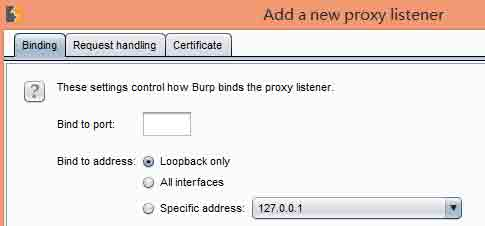

#### 1)Binding

这些设置控制 Burp 怎么代理监听器绑定到本地网络接口：

```
Bind to port---这是将被打开侦听传入连接的本地接口上的端口。你将需要使用一个没有被绑定被其他应用程序的闲置端口。
Bind to address---这是 Burp 绑定到本地接口的 IP 地址。 
```

您可以绑定到刚刚 127.0.0.1 接口或所有接口，或任何特定的本地 IP 地址。

注意：如果监听器绑定到所有接口或特定的非 loopback 接口，那么其他计算机可能无法连接到该侦听器。这可能使他们发起出站连接，从您的 IP 地址发起，并以访问代理服务器历史的内容，其中可能包含敏感数据，如登录凭据。你应该只启用此当你位于一个受信任的网络上。

BurpSuite 让您创建多个代理服务器的侦听器，并提供了丰富的控制自己的行为的配置选项。你可能偶尔需要进行测试时不寻常的应用，或与一些非基于浏览器的 HTTP 客户端进行合作，利用这些选项。

#### 2)Request Handling

这些设置包括选项来控制是否 BurpSuite 重定向通过此侦听器接收到的请求：

**Redirect to host** - 如果配置了这个选项，Burp 会在每次请求转发到指定的主机，而不必受限于浏览器所请求的目标。需要注意的是，如果你正使用该选项，则可能需要配置匹配/替换规则重写的主机头中的请求，如果服务器中，您重定向请求预期，不同于由浏览器发送一个主机头。

**Redirect to port** - 如果配置了这个选项，Burp 会在每次请求转发到指定的端口，而不必受限于浏览器所请求的目标。

**Force use of SSL** - 如果配置了这个选项，Burp 会使用 HTTPS 在所有向外的连接，即使传入的请求中使用普通的 HTTP。您可以使用此选项，在与 SSL 相关的响应修改选项结合，开展 sslstrip 般的攻击使用 Burp，其中，强制执行 HTTPS 的应用程序可以降级为普通的 HTTP 的受害用户的流量在不知不觉中通过 BurpProxy 代理。

注意：每一个重定向选项都可以单独使用。因此，例如，可以将所有请求重定向到一个特定的主机，同时保留原来的端口和协议在每个原始请求中使用。隐形 BurpProxy 的支持允许非代理感知客户端直接连接到监听。

#### 3)Certificate

这些设置控制呈现给客户端的 SSL 服务器的 SSL 证书。使用这些选项可以解决一些使用拦截代理时出现的 SSL 问题：

```
你可以消除您的浏览器的 SSL 警报，并需要建立 SSL 例外。 
凡网页加载来自其他域的 SSL 保护的项目，您可以确保这些均可由浏览器加载，而不需要先手动接受每个引用的域代理的 SSL 证书。 
您可以与拒绝连接到服务器，如果接收到无效的 SSL 证书胖客户端应用程序的工作。 
```

下列选项可用：

**Use a self-signed certificate**---||-一个简单的自签名 SSL 证书提交给您的浏览器，它总是导致 SSL 警告。

**Generate CA-signed per-host certificate**---||-这是默认选项。安装后，BurpSuite 创造了一个独特的自签名的证书颁发机构（CA）证书，并将此计算机上使用，每次 BurpSuite 运行。当你的浏览器发出 SSL 连接到指定的主机，Burp 产生该主机，通过 CA 证书签名的 SSL 证书。您可以安装 BurpSuite 的 CA 证书作为在浏览器中受信任的根，从而使每个主机的证书被接受，没有任何警报。您还可以导出其他工具或 Burp 的其他实例使用 CA 证书。

**Generate a CA-signed certificate with a specific hostname**---||这类似于前面的选项;然而，Burp 会产生一个单一的主机证书与每一个 SSL 连接使用，使用您指定的主机名。在进行无形的代理时，此选项有时是必要的，因为客户端没有发送连接请求，因此 Burp 不能确定 SSL 协议所需的主机名。你也可以安装 BurpSuite 的 CA 证书作为受信任的根。

**Use a custom certificate**---||-此选项使您可以加载一个特定的证书（在 PKCS＃12 格式）呈现给你的浏览器。如果应用程序使用它需要特定的服务器证书（例如一个给定序列号或证书链）的客户端应该使用这个选项。

#### 4)Exporting and Importing the CA Certificate

您可以导出您安装特定的 CA 证书在其他工具或 BurpSuite 的其他情况下使用，并且可以导入证书 Burp 在当前实例使用。 您可以选择要导出的证书只（用于导入到您的浏览器或其他设备的信任），或者你可以同时导出的证书及其私钥。

注意：您不应该透露的私钥证书给任何不可信的一方。拥有你的证书和密钥的恶意攻击者可能可以，即使你不使用 Burp 拦截浏览器的 HTTPS 流量。

您也可以仅通过访问 http://burp/cert 在浏览器中导出证书。它使 HTTPS 请求您的浏览器相同的证书，但在一些移动设备上安装时，设备通过一个 URL 来下载它是有帮助的。

### Interception Options

设置控制哪些请求和响应都停滞用于查看和编辑在拦截选项卡。单独的设置将应用到请求和响应。

在“Intercept”复选框确定是否有讯息拦截。如果它被选中，然后 Burp 应用配置的规则对每个消息，以确定它是否应该被拦截。

个别规则可以激活或停用对每个规则的左边的复选框。规则可以被添加，编辑，删除，或使用按钮重新排序。规则可以在消息，包括域名， IP 地址，协议， HTTP 方法， URL，文件扩展名，参数，cookie ，头/主体内容，状态代码，MIME 类型， HTML 页面标题和代理的几乎任何属性进行配置侦听端口。您可以配置规则来只拦截项目的网址是目标范围之内的。可以使用正则表达式对定义复杂的匹配条件。

规则按顺序处理，并且使用布尔运算符 AND 和 OR 组合。这些都与处理简单的“从左到右”的逻辑，其中每个算子的范围，如下所示：（所有规则之前累积的结果）和/或（当前规则的结果）所有活动的规则在每封邮件进行处理，并最终活动规则应用后的结果确定消息是否被拦截或转发的背景。“自动更新内容长度”复选框控件时，这已被用户修改是否 Burp 自动更新消息的 Content-Length 头。使用这个选项通常是必不可少的，当 HTTP 主体已被修改。

如果有需求，可以在请求结束时自动修复丢失或多余的新行。如果编辑请求不包含标题下面一个空行，Burp 会添加此。如果与含有 URL 编码参数的身体的编辑请求包含任何换行符在身体的末端，Burp 就会删除这些。这个选项可以是有用的纠正，而手动编辑在拦截视图的要求，以避免发出无效的请求向服务器发出的错误。

### Response Modification

设置用于执行自动响应的修改。您可以使用这些选项通过自动重写应用程序响应的 HTML 来完成各种任务。 下列选项在数据删除客户端控件可能是有用的：

```
显示隐藏的表单字段。 （有一个子选项，以突出强调取消隐藏栏在屏幕上，便于识别。 ）
启用已禁用的表单域
删除输入字段长度限制
删除的 JavaScript 表单验证 
```

下列选项可用于禁止客户端逻辑用于测试目的（注意，这些特征并非设计用来作为 NoScript 的的方式进行安全防御）有用：

```
删除所有的 JavaScript。
删除<object>标记。 
```

下列选项可用于提供对受害用户的流量在不知不觉中被通过 BurpSuite 代理 sslstrip 般的攻击。您可以在与听者选项强制 SSL 的传出请求，以有效地从用户的连接剥离 SSL 一起使用这些：

```
转换 HTTPS 为 HTTP 的链接。
删除 cookie 安全标志。 
```

### Match and Replace

用于自动替换请求和响应通过代理的部分。对于每一个 HTTP 消息，已启用的匹配和替换规则依次执行，以及任何适用的替代品制成。规则可以分别被定义为请求和响应，对于消息头和身体，并且还特别为只请求的第一行。每个规则可以指定一个文字字符串或正则表达式来匹配，和一个字符串来替换它。对于邮件头，如果匹配条件，整个头和替换字符串匹配留空，然后头被删除。如果指定一个空的匹配表达式，然后替换字符串将被添加为一个新的头。有可协助常见任务的各种缺省规则 - 这些都是默认为禁用。 匹配多行区域。您可以使用标准的正则表达式语法来匹配邮件正文的多行区域。

在替换字符串，组可以使用其次为索引$引用。所以下面的替换字符串将包含被匹配在上述正则表达式，该标记的名称：

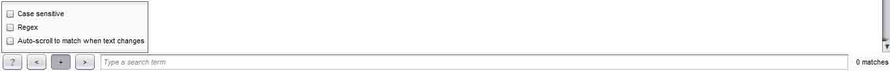

### SSL Pass Through

用于指定目标 Web 服务器为其 Burp 会直接通过 SSL 连接。关于通过这些连接的请求或响应任何细节将在代理拦截视图或历史。

通过 SSL 连接传递可以在这情况下是不能直接消除了客户端的 SSL 错误是非常有用 - 例如，在执行 SSL 证书钉扎的移动应用程序。如果应用程序访问多个域，或使用 HTTP 和 HTTPS 连接的混合，然后通过 SSL 连接到特定问题的主机仍然可以让您以正常方式使用 Burp 其他交通工作。

如果启用该选项来自动添加客户端 SSL 协商失败的项目，然后 BurpSuite 会在客户端失败的 SSL 协议检测（例如，由于不承认 BurpSuite 的 CA 证书），并会自动将相关的服务器添加到 SSL 通通过列表。

### Miscellaneous

控制 Burp 代理的行为的一些具体细节。下列选项可用：

**Use HTTP/1.0 in requests to server** - 该选项控制 BurpSuite 代理是否强制在请求目标服务器的 HTTP 1.0 版。默认设置是使用任何的 HTTP 版本所使用的浏览器。然而，一些遗留服务器或应用程序可能需要 1.0 版本才能正常工作。

**Use HTTP/1.0 in responses to client** - 目前所有的浏览器都支持这两个版本 1.0 和 HTTP 1.1 。从 1.0 版本开始已经减少了一些功能，迫使使用 1.0 版本有时会很有用，以控制浏览器的行为的各个方面，例如防止企图执行 HTTP 流水线。

**Set response header “Connection:close”** - 这个选项也可能是有用的，以防止 HTTP 流水线在某些情况下。

**Unpack gzip / deflate in requests** - 某些应用程序（通常是那些使用自定义客户端组件） ，压缩在请求消息体。该选项控制 BurpProxy 是否自动解压缩压缩请求主体。请注意，某些应用程序可能被破坏，如果他们期望的压缩体和压缩已通过 Burp 被删除。

**Unpack gzip / deflate in responses** - 大多数浏览器接受的 gzip 和响应紧缩压缩的内容。该选项控制 BurpSuite 代理是否自动解压缩压缩响应机构。请注意，您可以经常防止服务器试图通过删除请求（可能使用 BurpProxy 的匹配和替换功能）的 Accept-Encoding 头压缩的响应。 Disable web interface at http://burp - 如果你不得不配置你的听众接受无保护的接口上的连接，并希望阻止他人接触到 Burp 浏览器控件，此选项可能有用。

**Suppress Burp error messages** - 当某些错误时，默认情况下 BurpSuite 返回有意义的错误信息到浏览器。如果你想在隐身模式下运行 Burp，履行人在这方面的中间人攻击的受害者用户，那么它可能是有用的抑制这些错误信息来掩盖一个事实，即 Burp 是参与。

**Disable logging to history and site map** - 此选项可以防止 Burp 从记录任何请求到代理服务器的历史或目标站点地图。如果您使用的是 Burp 代理对于一些特定用途，如身份验证到上游服务器或进行匹配和替换操作，并且要避免产生内存和存储开销采伐牵扯它可能是有用的。

**Enable interception at startup**- 此选项可让您设定是否在 Burp 时启动代理截获应该启用。您可以选择始终启用拦截，始终禁用拦截，或者从 Burp 上次关闭恢复设置。

## Target 功能

目标工具包含了 SiteMap，用你的目标应用程序的详细信息。它可以让你定义哪些对象在范围上为你目前的工作，也可以让你手动测试漏洞的过程。

### Using Burp Target

在地址栏输入 www.baidu.com，如图

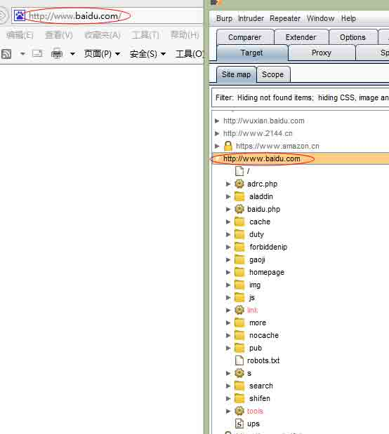

这样看起来 site map 是不是很乱，则可以右击 add to scope，然后点击 Filter 勾选 Show only in-scope items，此时你再回头看 Site map 就只有百度一个地址了，这里 filter 可以过滤一些参数，show all 显示全部，hide 隐藏所有，如果勾选了表示不过滤

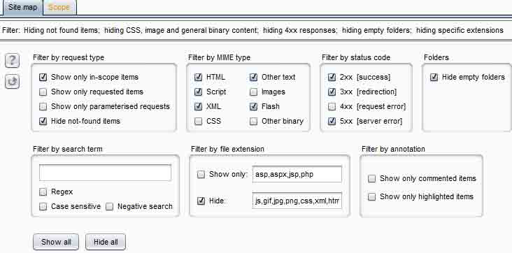

针对地址右击显示当前可以做的一些动作操作等功能。左图 针对文件右击显示当前可以做一些动作操作等功能。右图

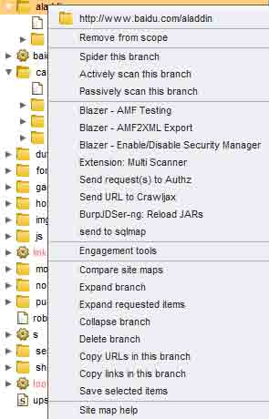

### 2)Scope

这个主要是配合 Site map 做一些过滤的功能，如图：

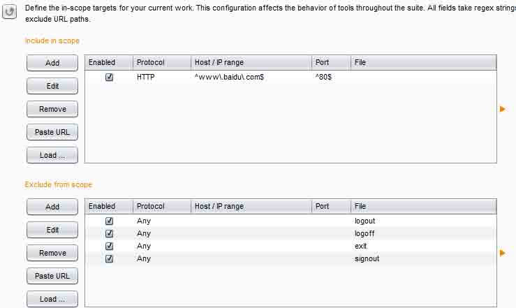

Include in scope 就是扫描地址或者拦截历史记录里右击有个 add to scope 就是添加到这了，也可以自己手动添加。

Target 分为 site map 和 scope 两个选项卡

#### SiteMap

中心 Site Map 汇总所有的信息 Burp 已经收集到的有关地址。你可以过滤并标注此信息，以帮助管理它，也可以使用 SiteMap 来手动测试工作流程。

#### Target Information

SiteMap 会在目标中以树形和表形式显示，并且还可以查看完整的请求和响应。树视图包含内容的分层表示，随着细分为地址，目录，文件和参数化请求的 URL 。您还可以扩大有趣的分支才能看到进一步的细节。如果您选择树的一个或多个部分，在所有子分支所选择的项目和项目都显示在表视图。

该表视图显示有关每个项目（URL ， HTTP 状态代码，网页标题等）的关键细节。您可以根据任意列进行排序表（单击列标题来循环升序排序，降序排序，和未排序） 。如果您在表中选择一个项目，请求和响应（如适用）该项目显示在请求/响应窗格。这包含了请求和响应的 HTTP 报文的编辑器，提供每封邮件的详细分析。

站点地图汇总所有的信息 BurpSuite 已经收集到的有关申请。这包括：

```
所有这一切都通过代理服务器直接请求的资源。
已推断出通过分析响应代理请求的任何物品（前提是你没有禁用被动 Spider） 。
内容使用 Spider 或内容发现功能查找。
由用户手动添加的任何项目，从其它工具的输出。 
```

已请求在 SiteMap 中的项目会显示为黑色。尚未被请求的项目显示为灰色。默认情况下（与被动蜘蛛(passviely scan this host)启用） ，当你开始浏览一个典型的应用，大量的内容将显示为灰色之前，你甚至得到尽可能要求，因为 BurpSuite 发现在您所请求的内容链接到它。您可以删除不感兴趣的地址

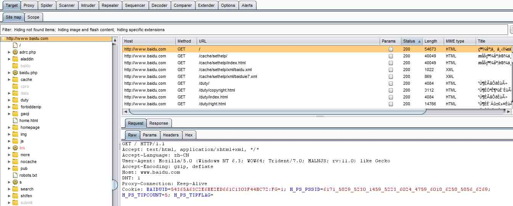

#### Display Filter

Sitemap 可以用来隐藏某些内容从视图中，以使其更易于分析和对你感兴趣的工作内容的显示过滤器 Sitemap 上方的过滤栏描述了当前的显示过滤器。点击过滤器栏打开要编辑的过滤器选项。该过滤器可以基于以下属性进行配置：

Request type 你可以只显示在范围内的项目，只能与反应项目，或者带参数的请求。 MIME type 您可以设定是否显示或隐藏包含各种不同的 MIME 类型，如 HTML，CSS 或图像的响应。 Status code 您可以设定是否要显示或隐藏各种 HTTP 状态码响应。 Search term 您可以过滤对反应是否不包含指定的搜索词。您可以设定搜索词是否是一个文字字符串或正则表达式，以及是否区分大小写。如果您选择了“消极搜索”选项，然后不匹配的搜索词唯一的项目将被显示。 File extension 您可以设定是否要显示或隐藏指定的文件扩展名的项目。 Annotation 您可以设定是否显示使用用户提供的评论或仅亮点项目。

#### Annotations

通过添加注释和批注亮点代理历史记录项。这可能是有用的描述不同要求的目的，并标记了进一步查看。

您可以通过添加注释和批注亮点代理历史记录项。这可能是有用的描述不同要求的目的，并标记了进一步查看。

两种方式添加亮点：

```
1)使用在最左边的表列中的下拉菜单中突出显示单个项目。
2)可以突出显示使用上下文菜单中的“亮点”项目的一个或多个选定的项目。
两种方法添加注释：
3)双击相关条目，注释列中，添加或编辑就地评论。
4)发表评论使用上下文菜单中的“添加注释”项目的一个或多个选定的项目。 
```

除了以上两种，您也可以注释项目，它们出现在拦截选项卡，这些都将自动出现在历史记录表。 当您已经注明想要的请求，您可以使用列排序和显示过滤器后迅速找到这些项目。

#### Scope

Target scope 设置，可以从 SiteMap 中添加也可以手动添加扫描范围到 Scope。你可以在 Target SiteMap 和 Proxy history 上设置只显示在范围内的项目。并且可以设置代理拦截只有在范围内的请求和响应。Spider 会扫描在范围内的地址。专业版还可以设置自动启动在范围内项目的漏洞扫描。您可以配置 Intruder 和 Repeater 跟随重定向到任何在范围内的网址。发送 Burp 目标以适当的方式执行行动，只针对你感兴趣并愿意攻击项目。

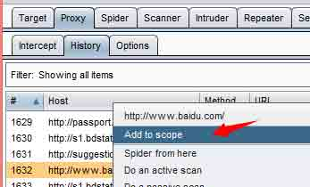

范围定义使用的 URL 匹配规则两个表 - 一个“包括(include)”列表和“exclude(排除)”列表中。Burp 根据一个 URL 地址来决定，如果它是目标范围之内，这将被视为是在范围上如果 URL 匹配至少一个“include”在内的规则，不符合“exclude”规则。这样能够定义特定的主机和目录为大致范围内，且距离该范围特定的子目录或文件（如注销或行政职能）排除。

## Spider 功能

Burp Spider 是一个映射 web 应用程序的工具。它使用多种智能技术对一个应用程序的内容和功能进行全面的清查。 通过跟踪 HTML 和 JavaScript 以及提交的表单中的超链接来映射目标应用程序，它还使用了一些其他的线索，如目录列表，资源类型的注释，以及 robots.txt 文件。 结果会在站点地图中以树和表的形式显示出来，提供了一个清楚并非常详细的目标应用程序 视图。能使你清楚地了解到一个 web 应用程序是怎样工作的，让你避免进行大量 的手动任务而浪费时间，在跟踪链接，提交表单，精简 HTNL 源代码。可以快速地确人应 用程序的潜在的脆弱功能，还允许你指定特定的漏洞，如 SQL 注入，路径遍历。

### Using Burp Spider

要对应用程序使用 Burp Spider 需要两个简单的步骤：

```
1 使用 Burp Proxy 配置为你浏览器的代理服务器，浏览目标应用程序(为了节省时间，你可 以关闭代理拦截)。 
2 到站点地图的”target”选项上，选中目标应用程序驻留的主机和目录。选择上下文菜单的” spider this host/branch”选项。 
```

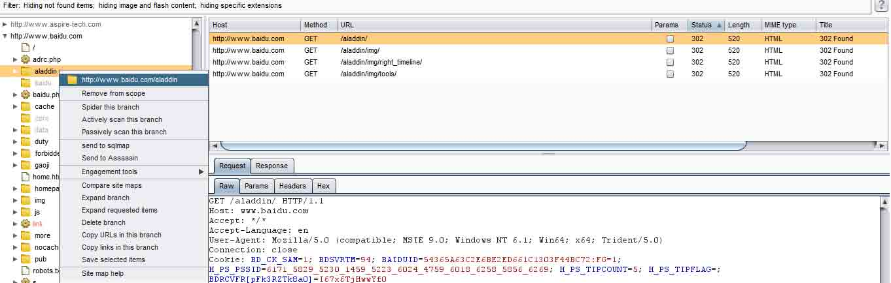

你也可以在任何 Burp 工具的任意请求或响应上使用上下文菜单上选择” spider this item”。当你发送一个站点地图的分支来 spidering，Spider 会首先检查这个分支是否在定义好的 spidering 的范围内。如果不是，Burp 会提示你是否把相关的 URL 添加到范围里。然后，Burp 开始 spidering，并执行下面的操作：

在分支上，请求那些已被发现的还没被请求过的 URL。 在分支上，提交那些已被发现但提交 URL 错误的表单。 重复请求分支上的先前收到的状态码为 304 的项，为检索到一个应用程序的新(未进入缓存)副本。 对所有的检索到内容进行解析以确认新的 URL 和表单。 只有发现新内容就递归地重复这些步骤。 继续在所有的范围区域内 spidering，直到没有新内容为止。

注意 Spider 会跟踪任何在当前定义的 spidering 范围内的 URL 链接。如果你定义了一个 范围比较大的目标，并且你只选择了其中的一个分支来 spidering，这时 Spider 会跟踪所有进入到这个比较大的范围内的链接，于是也就不在原来的分支上 spider。为了确保 Spider 只在指定分支内的请求上，你应该在开始时，就把 spidering 范围配置为只在这个分支上。

你应该小心地使用 Burp Spider。在它的默认设置上，Spider 会在 spidering 范围内使用 默认输入值，自动地提交任意表格，并且会请求许多平常用户在只使用一个浏览器不会发出 的请求。如果在你定义范围的 URL 是用来执行敏感操作的，这些操作都会被带到应用程序 上。在你完全地开始自动探索内容之前，使用浏览器对应用程序进行一些手动的映射，是非常可取的。

### Control tab

这个选项是用来开始和停止 Burp Spider，监视它的进度，以及定义 spidering 的范围。

#### Spider Status

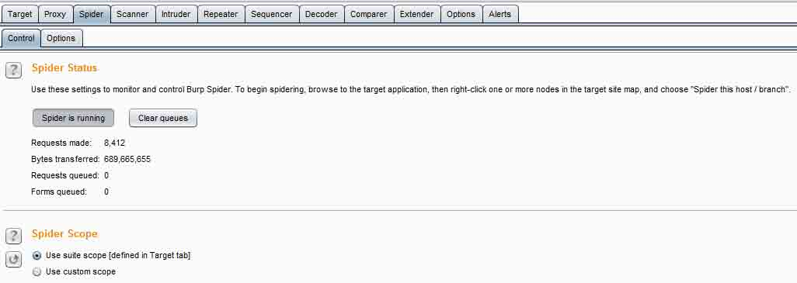

#### 1)Spider running

这个是用来开始和停止 Spider。Spider 停止后，它自己不会产生请求，但它会 继续处理通过 Burp Proxy 的响应，并且在 spidering 范围内的新发现的项都会送入请求队列 里，当 Spider 重新启动时，再来请求。这里显示的一些 Spider 进度的指标，让你能看到剩余的内容和工作量的大小。

#### 2)Clear queues

如果你想改变你工作的优先权，你可以完全地清除当前队列的项目，来让其他 的项目加入队列。注意如果被清除的项目如果还在范围内并且 Spider 的分析器发现有新的 链接到这个项目，那么它们还会加入队列。

#### Spider Scope

在这个面板里，你能精确地定义 Spider 的请求范围。最好的方法通常是使用一套广泛的目标范围，默认情况下，蜘蛛会使用该范围。如果您需要定义不同范围的蜘蛛使用，然后选择“Use custom scope(使用自定义范围)”。进一步的配置面板会出现在相同的方式套件范围的目标范围内面板的功能。如果你使用自定义范围并向 Spider 发送不在范围内 的项，则 Burp 会自动更新这个自定义的范围而不是 Suite 范围。

#### Options tab

这个选项里包含了许多控制 Burp Spider 动作的选项，如下描述。这些设置在 spider 启 动后还可以修改的，并且这修改对先前的结果也是有效的。例如，如果增加了最大链接深度， 在以前的最大链接深度外的链接如果满足现在的条件，也会加入到请求队列里。

#### Crawler Settings


#### 1)check robots.txt

如果这个选项被选中，Burp Spider 会要求和处理 robots.txt 文件，提取内容链接。这个文件是由机器人排除协议控制的蜘蛛状制剂在互联网上的行为。请注意，注意 Burp Spider 不会确认 robots 排除协议。Burp Spider 会列举出目标应用程序的所有内容，请求所有在范围 内的 robots.txt 条目。

#### 2)detect custom "not found" responses

HTTP 协议需要向 Web 服务器返回 404 状态码，如果一个请求的资源不存在。然而，许多 Web 应用程序返回使用不同的状态代码定制为“not found”的网页。如果是这种情况，则使用该选项可以防止误报的网站内容的映射。Burp Spider 从每个域请求不存在的资源，编制指纹与诊断“not found”响应其它请求检测定制“not found”的回应。

#### 3)ignore links to non-text content

常常需要推断出在 HTML 上下文里链接到特殊资源的 MIME 类型。例如，带有 IMG 标记的 URL 会返回图像；那些带有 SCRIPT 标记的会返回 JavaScript。 如果这个选项被选中，Spider 不会请求在这个上下文出现的出现的非文本资源。使用这个选 项，会减少 spidering 时间，降低忽略掉感兴趣内容的风险。

#### 4)request the root of all directories 如果这个选项被选中，Burp Spider 会请求所有已确认的目标 范围内的 web 目录，除了那些目录里的文件。如果在这个目标站点上目录索引是可用的， 这选项将是非常的有用。

#### 5)make a non-parameterised request to each dynamic page

如果这个选项被选中，Burp Spider 会对在范围内的所有执行动作的 URL 进行无参数的 GET 请求。如果期待的参数没有被接收， 动态页面会有不同的响应，这个选项就能成功地探测出添加的站点内容和功能。

#### 6)maximum link depth

这是 Burp Suite 在种子 URL 里的浏览”hops”的最大数。0 表示让 Burp Suite 只请求种子 URL。如果指定的数值非常大，将会对范围内的链接进行无限期的有效跟踪。将此选项设置为一个合理的数字可以帮助防止循环 Spider 在某些种类的动态生成的内容。

#### 7)Maximum parameterized requests per URL

请求该蜘蛛用不同的参数相同的基本 URL 的最大数目。将此选项设置为一个合理的数字可以帮助避免爬行“无限”的内容，如在 URL 中的日期参数的日历应用程序。

## Passive Spidering(被动扫描)

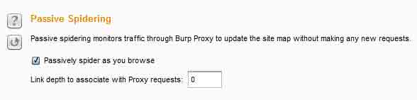

#### 1)passively spider as you browse

如果这个选项被选中，Burp Suite 会被动地处理所有通过 Burp Proxy 的 HTTP 请求，来确认访问页面上的链接和表格。使用这个选项能让 Burp Spider 建立一个包含应用程序内容的详细画面，甚至此时你仅仅使用浏览器浏览了内容的一个子集，因为所有被访问内容链接到内容都会自动地添加到 Suite 的站点地图上。

#### 2)link depth to associate with proxy requests

这个选项控制着与通过 Burp Proxy 访问的 web 页面 有关的” link depth”。为了防止 Burp Spider 跟踪这个页面里的所有链接，要设置一个比上面 选项卡里的” maximum link depth”值还高的一个值。

### Form Submission

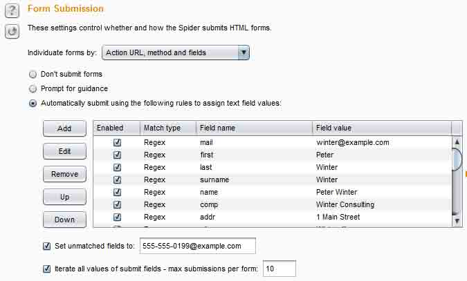

#### 1)individuate forms

这个选项是配置个性化的标准(执行 URL，方法，区域，值)。当 Burp Spider 处理这些表格时，它会检查这些标准以确认表格是否是新的。旧的表格不会加入到提交序列。

#### 2)Don’t submit

如果选中这个，Burp Spider 不会提交任何表单。

#### 3)prompt for guidance

如果选中这个，在你提交每一个确认的表单前，Burp Suite 都会为你指示引导。这允许你根据需要在输入域中填写自定义的数据，以及选项提交到服务器的哪一个 区域，以及是否遍历整个区域。

#### 4)automatically submit

如果选中，Burp Spider 通过使用定义的规则来填写输入域的文本值来自动地提交范围内的表单。每一条规则让你指定一个简单的文本或者正则表达式来匹配表单字段名，并提交那些表单名匹配的字段值。可以为任意不匹配的字段指定默认值。

在应用程序通常需要对所有输入域都是有效格式的数据的地方，如果你想通过登记表单 和相似功能自动地 spider，则这个选项会非常有用。在自动地把表单数据提交到广阔范围内 的应用程序时，Burp 使用一组非常成功的规则。当然，如果你遇到有自己需要提交的特定 值的表单字段名时，你可以修改这些或者添加自己的规则。你要小心地使用这个选项，因为 提交了表单里的虚假值有时会导致一些不希望看到操作。

许多表单包含了多个提交元素，这些会对应用程序进行不同的操作，和发现不同的内容。 你可以配置 Spider 重复通过表单里提交元素的值，向每个表单提交多次，次数低于配置的 最大值。

### Application Login

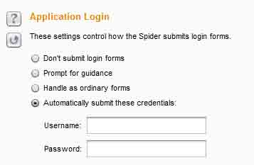

登陆表单在应用程序中扮演一个特殊角色，并且你常常会让 Burp 用和处理平常表单不 一样的方式来处理这个表单。使用这个配置，你可以告诉 Spider 在遇到一个表单执行下面 4 种不同操作的一种：

```
1.如果你没有证书，或者关注 Spidering 的敏感保护功能，Burp 可以忽略登陆表单。
2.Burp 能交互地为你提示引导，使你能够指定证书。这时默认设置项。
3.Burp 通过你配置的信息和自动填充规则，用处理其他表单的方式来处理登陆表单。
4.在遇到的每个登陆表单时，Burp 能自动地提交特定的证书。 
```

在最后一种情况下，任何时间 Burp 遇到一个包含密码域的表单，会提交你配置的密码到密码域，提交你配置用户名到最像用户名的字段域。如果你有应用程序的证书，想让 Spider 为你处理登陆，通常情况下这是最好的选项

### Spider Engine

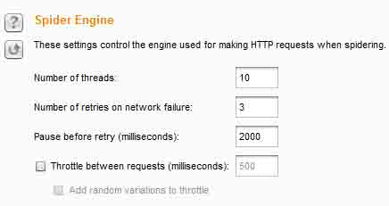

这些设置控制用于 Spidering 时发出 HTTP 请求的引擎。下列选项可用：

```
1)Number of threads----此选项控制并发请求进程数。
2)Number of retries on network failure----如果出现连接错误或其他网络问题，BurpSuite 会放弃和移动之前重试的请求指定的次数。测试时间歇性网络故障是常见的，所以最好是在发生故障时重试该请求了好几次。
3)Pause before retry----当重试失败的请求，BurpSuite 会等待指定的时间（以毫秒为单位）以下，然后重试失败。如果服务器被宕掉、繁忙或间歇性的问题发生，最好是等待很短的时间，然后重试。
4)Throttle between requests----BurpSuite 可以在每次请求之前等待一个指定的延迟（以毫秒为单位）。此选项很有用，以避免超载应用程序，或者是更隐蔽。
5)Add random variations to throttle----此选项可以通过降低您的要求的时序模式进一步增加隐身。 
```

### Request Headers

这些设置控制由蜘蛛发出的 HTTP 请求中使用的请求头。您可以配置头蜘蛛在请求中使用的自定义列表。这可能是有用的，以满足各个应用程序的特定要求 - 例如，测试设计用于移动设备的应用程序时，以模拟预期的用户代理。

以下选项也可用：

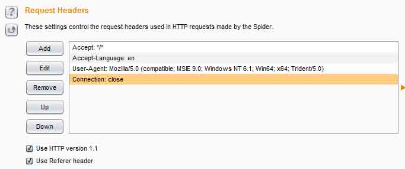

```
1)Use HTTP version 1.1----如果选中，Spider 会使用 HTTP1.1 版在其请求;否则，它会使用 1.0 版。

2)Use Referer header----如果选中，Spider 会要求从另一个页面链接到任何项目时提交相关 Referer 头。此选项很有用更加紧密地模拟将通过您的浏览器发出的请求，并且还可能需要浏览一些应用程序验证 Referer 头。 
```

## Scanner 功能

### Using Burp Scanner

分以下几个步骤来简单使用 Scanner 1.设置好代理之后在地址栏输入你要抓取的地址，并且要在 Proxy 里把拦截关了，随后切换到 Scanner 的 Results 就可以看到地址已经在开始扫描咯

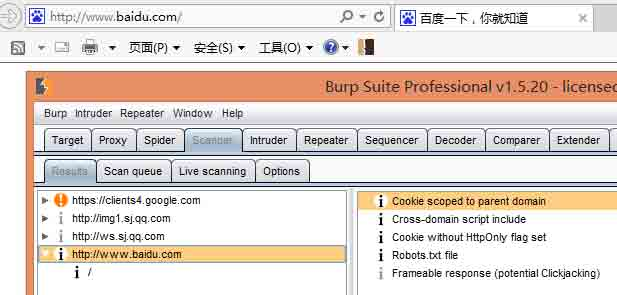

2.对地址右击还可以导出报告，


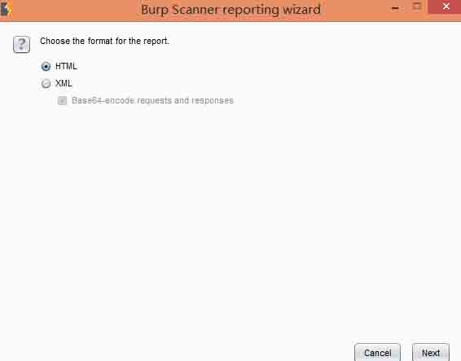

Html 或者 xml 随便你以什么格式的，然后一直下一步下一步到如下图选择保存文件到哪

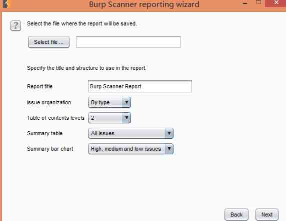

我们打开看看，是不是很漂亮呢

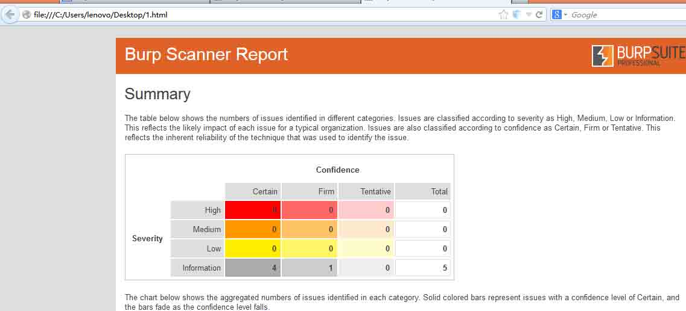

3.如果扫描出漏洞了我们还可以直接在这针对某个漏洞进行查看，如果想测试的话可以发送到 Repeater 进行测试哦

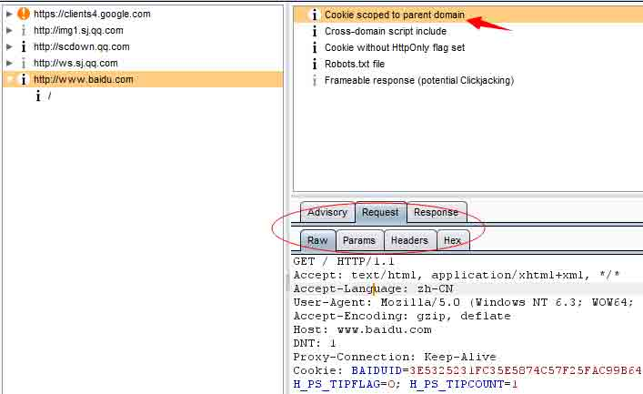

### Results

结果选项卡包含所有的扫描仪已确定，从主动和被动扫描的问题。以一种树型图显示应用程序的内容，其中的问题已经被发现，使用 URL 分解成域，目录和文件的层次表示。如果您选择一个或多个部分的分支，所有选定的项目将扫描的问题都列出来，用组合在一起的相同类型的问题。您还可以扩大这些问题汇总查看所有的每种类型的个别问题。 如果您选择的问题那么将显示相应的详情，包括：

```
1)自定义的漏洞，咨询内容包括：
问题类型及其整治的标准描述。
中适用于该问题，并影响其修复任何特定的功能的描述。
2)完整的请求和响应都是依据报告了该问题。在适用的情况，是相关的识别和再现问题的请求和响应的部分在请求和响应消息的编辑器中突出显示。 
```

通常情况下，测试并验证一个问题最快的方法是使用发送到 Repeater。另外，对于 GET 请求，您可以复制此 URL，并将其粘贴到浏览器中。然后，您可以重新发出请求。 Burp 扫描报告描述，每一个问题都会给出严重程度（高，中，低，资讯）和置信度（肯定的，坚定的，暂定）的评级。当一个问题一直使用一种技术，本质上是不太可靠（如 SQL 盲注）确定，Burp 会让你意识到这一点，通过丢弃的置信水平存在一定不足。这些额定值应始终被解释为指示性的，你应该根据你的应用程序的功能和业务方面的知识进行审查。

这个问题已经上市，你可以用它来执行以下操作的上下文菜单：如图所示

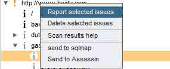

### Report selected issues

启动 BurpSuite Scanner 的报告向导，生成的选定问题的正式报告。 Set severity - 这让你重新分配问题的严重程度。您可以设置严重程度高，中，低，或信息。您还可以标记问题作为假阳性。

### Delect selected issues

删除选定问题。请注意，如果你删除了一个问题，Burp 重新发现了同样的问题（例如，如果你重新扫描了同样的要求），那么问题将再次报告。相反，如果你是一个假阳性标记的问题，那么这将不会发生。因此，最适合用于清理扫描结果移除你不感兴趣。对于内部的功能不需要您的问题仍然工作在主机或路径删除的问题，您应该使用假阳性的选项。

### Scan Queue

Active Scanning(主动扫描)过程通常包括发送大量请求到服务器为所扫描的每个基本的请求，这可能是一个耗时的过程。当您发送的主动扫描请求，这些被添加到活动扫描队列，它们被依次处理。如图

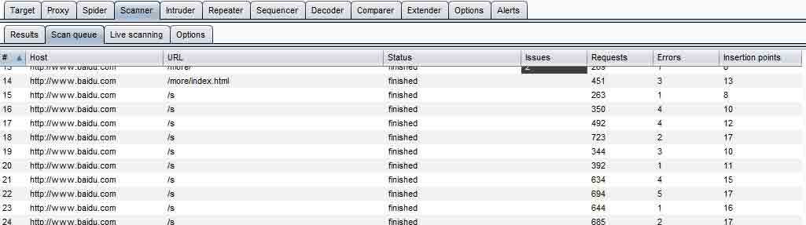

扫描队列中显示每个项目的详细信息如下：

```
1)索引号的项目，反映该项目的添加顺序。
2)目的地协议，主机和 URL 。
3)该项目的当前状态，包括完成百分比。
4)项目扫描问题的数量（这是根据所附的最严重问题的重要性和彩色化） 。
5)在扫描项目的请求数量进行。
注意 这不是插入点的数量的线性函数 - 观察应用程序行为的反馈到后续攻击的请求，仅仅因为它会为一个测试仪。
6)网络错误的数目遇到的问题。
7)为项目创建的插入点的数量。 
```

这些信息可以让您轻松地监控个别扫描项目的进度。如果您发现某些扫描进度过于缓慢，可以理解的原因，如大量的插入点，缓慢的应用响应，网络错误等给定这些信息，你就可以采取行动来优化你的扫描，通过改变配置为插入点时，扫描引擎，或正在测试的主动扫描区域。

你可以双击任何项目在扫描队列显示，到目前为止发现的问题，并查看了基本请求和响应的项目。您可以使用扫描队列的上下文菜单来执行各种操作来控制扫描过程。确切的可用选项取决于所选的项目（S ）的状态，并包括：如下图所示

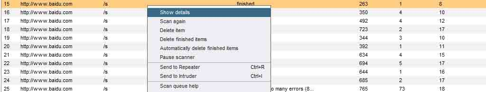

### Show details

这将打开显示到目前为止发现的问题的一个窗口，与底座请求和响应的项目。

### Scan again

此复制所选择的项目（S ） ，并将这些队列的末尾。

### Delete item(S)

这将永久地从队列中删除选定的项目（S ） 。

### Delect finished items

这永久删除那些已经完成了队列中的任何项目。

### Automatically delete finished items

这是否切换扫描器会自动从队列为他们完成删除项目。

### Pause/resume scanner

这可以暂停和恢复激活扫描仪。如果任何扫描正在进行时，扫描会暂停，而挂起的扫描请求完成后，通常会有一个短暂的延迟。

### Send to

这些选项用于所选项目的基本请求发送到其它 Burp(Repeater、Intruder)工具。

### Live Scanning

实时扫描可让您决定哪些内容通过使用浏览器的目标应用，通过 BurpProxy 服务器进行扫描。您可以实时主动扫描设定 live active scanning 和 live passive 两种扫描模式。如图

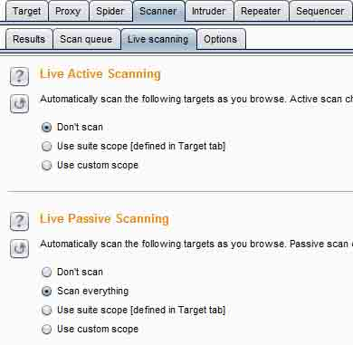

### Live active scanning

执行现场主动扫描，请执行以下步骤：

```
1)配置与目标的细节，你要主动扫描现场主动扫描设置。如果你已经配置了一套全范围的目标为你目前的工作，那么你可以简单地通知 Burp 主动扫描落在该范围内的每个请求。或者，您可以使用 URL 匹配规则定义自定义范围。 
2)各地通过 BurpProxy 通常的方式应用浏览。这将有效地展示 Burp 要扫描的应用功能。对于每一个独特的所在范围的要求，你通过你的浏览器，Burp 会排队主动扫描请求，并将努力走在后台找到漏洞为您服务。 
```

### Live Passive Scanning

现场演示被动扫描，请执行以下步骤：

```
1)配置具有您要被动地扫描目标的细节 live passive scanning。默认情况下，Burp 执行所有请求的被动扫描，但你可以限制扫描目标范围，或者使用 URL 匹配规则的自定义范围。 
2)通过 BurpProxy 通常的方式应用浏览。这将有效地展示 Burp 你要扫描的应用功能。 
```

### Options

此选项卡包含 Burp 扫描选项进行攻击的插入点，主动扫描引擎，主动扫描优化，主动扫描区和被动扫描区域。

### Attack Insertion Points

这些设置控制扫描仪的地方“插入点(insertion points)”到被发送的主动扫描每个基本要求。插入点攻击将被放置，探测漏洞请求中的位置。每个定义的插入点单独扫描。 BurpSuite 为您提供细粒度地控制放置插入点，以及这些选项仔细配置会让您量身定制您的扫描到您的目标应用程序的性质。插入点的配置也代表你的扫描速度和全面性之间进行权衡。

注：除了让 Burp 自动指定插入点，就可以完全自定义这些，这样你就可以在你想要攻击的地方放在任意一个位置。要使用此功能，将请求发送给 Intruder，用 payload positions 标签来定义通常的方式各插入点的开始和结束，并选择入侵者菜单选项“积极定义扫描插入点” 。您也可以指定以编程方式使用 Burp 扩展的自定义插入点位置。

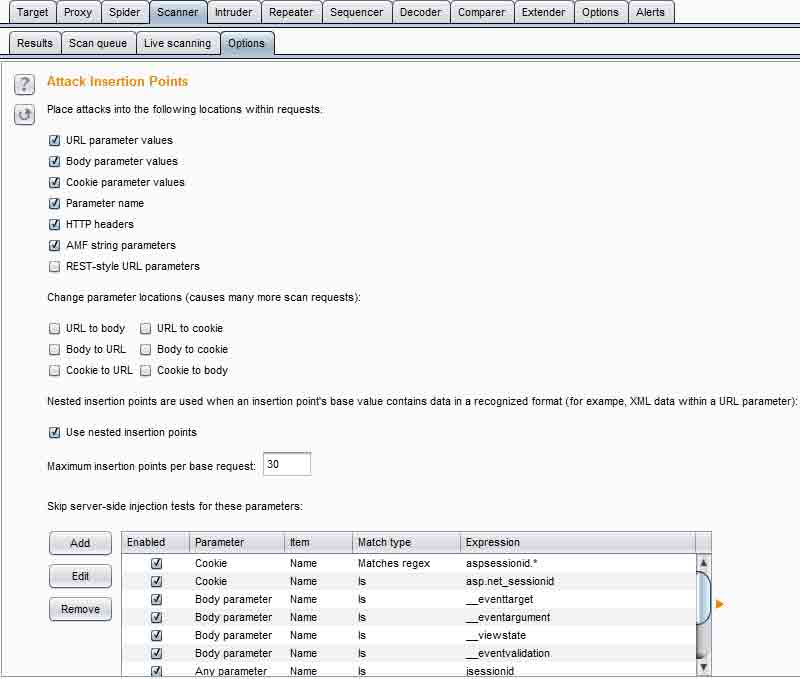

#### 1)Insertion Point Locations

这些设定可让您选择，其中插入点应放在请求中的位置的类型：

```
URLparameter values - URL 查询字符串中标准的参数值。
Body parameter values - 在邮件正文中，包括标准形式生成的参数参数值，属性的多重编码的参数，如上传的文件名， XML 参数值和属性，和 JSON 值。
Cookieparameter values - 的 HTTP Cookie 的值。
Parameter name - 任意添加的参数的名称。 URL 参数总是被添加，并且机身参数也加入到 POST 请求。测试一个附加的参数名称通常可以检测到被错过，如果只是参数值进行了测试异常的错误。
HTTPheaders - 在引用页和用户代理标头的值。测试这些插入点通常可以检测如 SQL 注入或跨站脚本持续在日志记录功能的问题。
AMF string parameters- 内 AMF 编码的邮件的任何字符串数据的值。
REST-style URL parameters - URL 的文件路径部分中的所有目录和文件名令牌的值。测试每一个插入点可以并处显著开销，如果你相信应用程序使用这些位置传送参数数据，才应使用。 
```

#### 2)Change Parameter Locations

允许您配置扫描仪将一些类型的插入点到其他地点的请求中，除了测试他们在原来的位置。例如，您可以将每个 URL 参数到邮件正文中，并重新测试它。或者你可以移动身体的每个参数到一个 cookie ，然后重新测试它。

用这种移动参数方式往往可以绕过防过滤器。许多应用程序和应用程序防火墙执行每个参数输入验证假设每个参数是它的预期位置的要求之内。移动参数到不同的位置可以回避这个验证。当应用程序代码后检索参数来实现其主要的逻辑，它可能会使用一个 API，它是不可知的，以参数的位置。如果是这样，那么移动的参数可能可以使用输入，通常会在处理之前被过滤，以达到易受攻击的代码路径。

下列选项可用于更改参数的位置：

```
URL to body
URL to cookie
Body to URL
Body to cookie
Cookie to URL
Cookie to body 
```

#### 3)Nested Insertion Points

嵌套的插入时，会使用一个插入点的基值包含可识别的格式的数据。 例如，一个 URL 参数可能包含 Base64 编码数据，并且将解码后的值可能又包含 JSON 或 XML 数据。与使用启用嵌套插入点的选项，Burp 会为输入在每个嵌套级别中的每个单独的项目适合的插入点。 Spider 仅包含常规的请求参数请求时使用此选项不征收费用，但允许 Burp 达到更复杂的应用，数据是在不同的格式封装的攻击面。

#### 4)Maximum Insertion Points Per Request

无论你的设置选择，对于单个请求插入点的数目，一般视乎该请求的功能，如参数的数目。偶尔，请求可以包含的参数（几百或更多）数量。如果 Burp 执行的每个参数进行完全扫描，扫描会花费过多的时间量完成。 此设置允许您设置的，将每个基本要求生成插入点的数量的限制，从而防止您的扫描由偏快转为停滞，如果他们遇到含参数庞大的数字请求。在其中插入点的数量是由这个限制缩减的情况下，在有效扫描队列中的项目的条目将显示被跳过的插入点的数量，使您能够手动检查基本要求，并决定是否值得执行完全扫描其所有可能的插入点。

#### 5)Skipping Parameters

设定让您指定请求参数的 Burp 应该跳过某些测试。有跳过服务器端注入测试（如 SQL 注入）和跳过所有检查单独的列表。 服务器端注入测试是比较费时的，因为 Burp 发送多个请求探测服务器上的各种盲目的漏洞。如果您认为出现请求中的某些参数不容易（例如，内置仅由平台或 Web 服务器中使用的参数） ，你可以告诉 Burp 不能测试这些。 （用于测试客户端蝽象跨站点脚本涉及更少的开销，因为测试每个参数规定最小的开销在扫描期间，如果该参数不容易。 ） 如果一个参数是由您不希望测试一个应用程序组件来处理，或者修改一个参数是已知的导致应用程序不稳定跳过所有的测试可能是有用的。 列表中的每个项目指定参数类型，该项目要匹配（名称或值） ，匹配类型（文本字符串或正则表达式） ，表达式匹配。 你可以通过它们的位置（斜线分隔）的 URL 路径中标识的 REST 参数。要做到这一点，从参数下拉，“姓名”，从项目下拉“ REST 参数” ，并指定您希望从测试中排除的 URL 路径中的位置的索引号（从 1 开始） 。您还可以通过值来指定 REST 参数。

### Active Scanning Engine

控制用来做主动扫描时发出 HTTP 请求的引擎。下列选项可用：

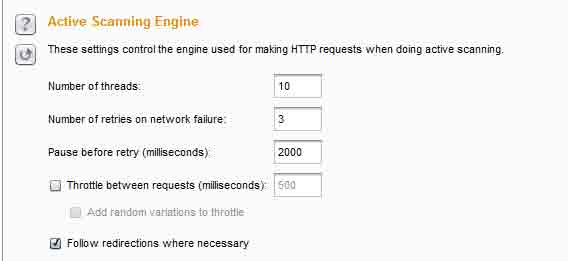

```
1)Number of threads - 控制并发请求数。
2)Number of retries on network failure - 如果出现连接错误或其他网络问题，Burp 会放弃和移动之前重试的请求指定的次数。测试时间歇性网络故障是常见的，所以最好是在发生故障时重试该请求了好几次。
3)Pause before retry - 当重试失败的请求，Burp 会等待指定的时间（以毫秒为单位）以下，然后重试失败。如果服务器宕机，繁忙，或间歇性的问题发生，最好是等待很短的时间，然后重试。 
```

**Throttle between requests** - 在每次请求之前等待一个指定的延迟（以毫秒为单位）。此选项很有用，以避免超载应用程序，或者是更隐蔽。

**Add random variations to throttle** - 通过降低您的要求的时序模式进一步增加隐身。

**Follow redirections where necessary**- 有些漏洞只能通过下面的重定向进行检测（例如，在一条错误消息，跨站点脚本这是只有下列一个重定向后退还）。因为某些应用程序的问题重定向到包含您所提交的参数值的第三方网址，BurpSuite 保护您免受无意中攻击的第三方应用程序，不按照刚刚收取任何重定向。如果所扫描的要求是明确的目标范围之内（即您使用的是目标范围，以控制哪些被扫描的），然后 BurpSuite 只会跟随重定向是指同一范围内。如果所扫描的要求不在范围内（即你已经手动发起超出范围的请求的扫描），BurpSuite 只会跟随重定向其中（a）是在同一台主机/端口的请求被扫描;及（b）没有明确涵盖的范围排除规则（如“logout.aspx”）。

小心使用这些选项可让您微调扫描引擎，根据不同应用对性能的影响，并在自己的处理能力和带宽。如果您发现该扫描仪运行缓慢，但应用程序表现良好和你自己的 CPU 利用率很低，可以增加线程数，让您的扫描进行得更快。如果您发现连接错误发生，该应用程序正在放缓，或者说自己的电脑被锁定了，你应该减少线程数，也许增加网络故障和重试之间的间隔重试的次数。如果应用程序的功能是这样的：在一个基地的要求执行的操作干扰其他请求返回的响应，你应考虑减少线程数为 1，以确保只有一个单碱基请求被扫描的时间。

### Active Scanning Optimization

主动扫描逻辑的行为，以反映扫描的目的和目标应用程序的性质。例如，您可以选择更容易发现问题，在一个大型应用程序的快速扫描;或者您可以执行更慢全面扫描，以发现更难，而且需要更多的扫描请求，以检测问题。

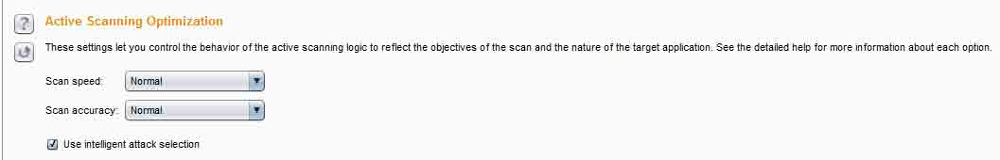

下列选项可用：

**Scan speed(扫描速度)** - 该选项决定彻底的某些扫描检查，怎么会检查是否有漏洞时。 “Fast(快速)”设置使更少的请求，并检查一些漏洞更少的推导。在“Thorough(彻底)”的设置使更多的请求，并检查更多的衍生类型的漏洞。 “Normal(正常)”设定为中途在两者之间，并且代表速度和完整性之间的适当折衷对于许多应用。

**Scan accuracy(扫描精度)** - 此选项决定的证据表明，扫描仪会报告某些类型的漏洞之前，要求的金额。可以只使用“blind(盲)”的技术，其中，Burp 推断可能存在基于某些观察到的行为，如时间延迟或一个差分响应的一个漏洞被检测到的一些问题。因为这些观察到的行为的发生原因，无论如何，在没有相关联的漏洞的影响，该技术本身更容易出现假阳性比其他技术，例如在观察错误消息。试图减少误报，BurpSuite 重复某些测试了一些，当一个假定的问题，推断时间，尝试建立提交的输入和观察到的行为之间有可靠的相关性。的准确性选项用于控制 BurpSuite 会多少次重试这些测试。在“Minimize false negatives(最小化假阴性)”的设置进行重试较少，因此更可能报告假阳性的问题，但也不太可能会错过由于不一致的应用程序行为的真正问题。在“Minimize false positives(最小化误报)”设置进行更多的试，所以是不太可能报告假阳性的问题，但可能会因此错误地错过了一些真正的问题，因为有些重试请求可能只是碰巧不返回结果是测试。 “Normal(正常)”设置为中途两者之间，并代表之间的假阳性和假阴性的问题合适的权衡对于许多应用。

**Use intelligent attack selection(使用智能进攻选择)** - 此选项使通过省略出现无关紧要给每个插入点参数的基值支票扫描更有效率。例如，如果一个参数值包含不正常出现在文件名中的字符，BurpSuite 会跳过文件路径遍历检查此参数。使用这个选项，可以加快扫描件，具有相对低的存在缺少实际的漏洞的风险。

### Active Scanning Areas

定义哪些是主动扫描过程中进行检查。是检查以下类别可供选择：

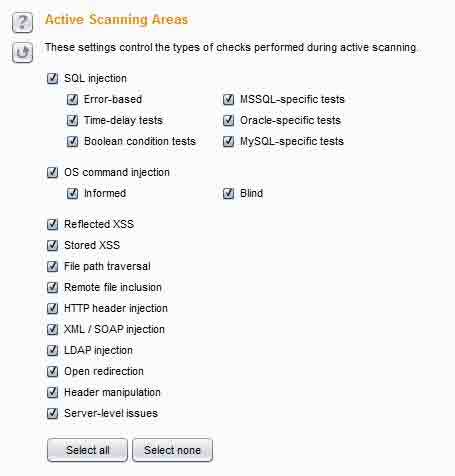

```
SQL injection(SQL 注入) - 这有子选项，以使不同的测试技术（误差为基础，延时测试，布尔条件测试） ，并且也使检查特定于单个数据库类型（ MSSQL ，Oracle 和 MySQL 的） 。
OS command injection(操作系统命令注入) - 这有子选项，以使不同的测试技术.。
Reflected XSS(反映了跨站点脚本)
Stored XSS(存储的跨站点脚本)
File path traversal(文件路径遍历)
HTTP header injection(HTTP 头注入)
XML/SOAP injection(XML / SOAP 注射)
LDAP injection(LDAP 注入)
Open redirection(开放重定向)
Header manipulation(头操纵)
Server-level issues 服务器级的问题 
```

所执行的每个检查增加的请求的数目，以及每个扫描的总时间。您可以打开或关闭个别检查根据您的应用程序的技术知识。例如，如果你知道某个应用程序不使用任何 LDAP ，您可以关闭 LDAP 注入测试。如果你知道哪个后端数据库的应用程序使用，你可以关闭 SQL 注入检测特定于其他类型的数据库。您也可以选择性地启用基于你如何严格要求你的扫描是检查。例如，您可以配置 BurpSuite 做应用程序的快速一次过，只为 XSS 和 SQL 注入的网址和参数检查，每漏洞类型更全面的测试在每一个插入点之前。

### Passive Scanning Areas

自定义的请求和响应的各个方面在被动扫描检查。下列选项可用：

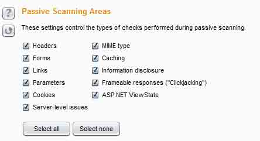

```
Headers--头 
Forms--表格 
Links--链接 
Parameters--参数 
Cookie 
MIME 类型 
Caching 缓存 
Information disclosure--信息披露 
Frameable responses--耐燃反应（“点击劫持”） 
ASP.NET 的 ViewState 
需要注意的是被动扫描不会派出自己的任何要求，和每个被动强加检查您的计算机上一个微不足道的处理负荷。不过，你可以禁用检查各个领域，如果你根本就不关心他们，不希望他们出现在扫描结果。 
```

## Intruder

Burp intruder 是一个强大的工具，用于自动对 Web 应用程序自定义的攻击。它可以用来自动执行所有类型的任务您的测试过程中可能出现的。

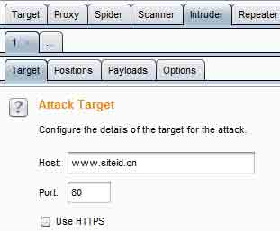

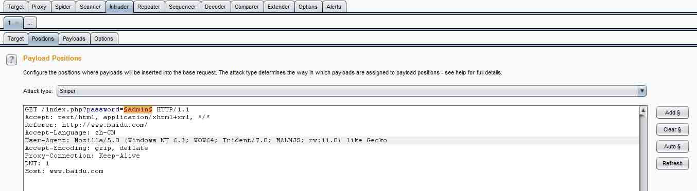

要开始去了解 BurpSuite Intruder，执行以下步骤：

```
1)首先，确保 Burp 安装并运行，并且您已配置您的浏览器与 Burp 工作。
2)如果你还没有这样做的话，浏览周围的一些目标应用程序，来填充的应用程序的内容和功能的详细信息 Burp 的 SiteMap。在这样做之前，要加快速度，进入代理服务器选项卡，然后截取子标签，并关闭代理拦截（如果按钮显示为“Intercept is On”，然后点击它来截取状态切换为关闭） 。
3)转到 Proxy 选项卡，并在 History 选项卡。发现一个有趣的前瞻性要求，您的目标应用程序，包含了一些参数。选择这个单一的请求，然后从上下文菜单中选择“Send to intruder” 。
4)转到 Intruder 标签。Burp Intruder 可以让你同时配置多个攻击。您 Send to Intruder 的每个请求在自己的攻击选项卡中打开，而这些都是顺序编号的默认。您可以双击标签头重命名选项卡，拖动标签来重新排序，并且还关闭和打开新的标签页。
5)为您发送请求建立的 Intruder 选项卡，看看 Target 和 Positions 选项卡。这些已经自动填入您发送的请求的细节。
6)Burp Intruder 本质工作，采取了基本模板的要求（你送到那里的那个） ，通过一些 payloads 的循环，将这些 payloads 送入定义的 Positions，基本要求范围内，并发出每个结果的要求。位置标签用于配置，其中有效载荷将被插入到基本要求的位置。你可以看到，BurpSuite 一直在你想用来放置有效载荷自动进行猜测。默认情况下，有效载荷放入所有的请求参数和 cookie 的值。每对有效载荷标记定义了一个有效载荷的位置，并且可以从基体的要求，这将被替换的有效载荷的内容，当该 payload position 用于括一些文本。有关进一步详情，请参阅 Payload Markers 的帮助。
7)旁边的请求编辑器中的按钮可以被用于添加和清除有效载荷的标志。试着增加 payload position 在新的地点请求中，并删除其他标志物，并看到效果了。当你理解了 payload positions 是如何工作的，请单击“Auto§ ”按钮恢复到 BurpSuite 为您配置的默认 payload positions。如果你修改了请求本身的文本，可以重复步骤 3 创建与它的原始请求一个新的 Intruder 的攻击选项卡。 
```


```
8)转到 Payloads 选项卡。这使您可以定义将要放入已定义的有效载荷仓的有效载荷。保持默认设置（使用有效载荷的“Simple list” ） ，并添加一些测试字符串到列表中。您可以通过输入到“Enter a new item”框中，单击“add”，输入自己的字符串。或者您可以使用“add from file”下拉菜单，然后选择“Fuzzing-quick”，从内置的负载串[专业版]列表中。
9)现在，您已经配置了最低限度的选项来发动攻击。转到 Intruder 菜单，然后选择“Start attack” 。
10)在包含在结果选项卡一个新的窗口中打开攻击。结果表包含已经取得，与各关键细节，如所使用的有效载荷， HTTP 状态码，响应长度等，您可以在表中选择任何项目，以查看完整的请求和响应每个请求的条目。您还可以对表进行排序通过单击列标题，并使用过滤器栏过滤表中的内容。这些特征以相同的方式工作，作为 Proxy history。
11)这次袭击窗口包含其他标签，显示被用于当前攻击的配置。您可以修改大部分这种配置的攻击已经开始。转到选项选项卡，向下滚动到“ grep-match” ，并勾选“标志的结果与项目相匹配的响应这些表达式” 。这将导致 Intruder 检查响应匹配列表中的每个表达式项目和标志的火柴。默认情况下，列表显示 fuzzing 时是很有用的一些常见的错误字符串，但可以配置，如果你想自己的字符串。返回 result 选项卡，看到 Intruder 增加了对每个项目列在列表中，而这些包含复选框，指示表达式是否被发现在每一个响应。如果你是幸运的，你的基本模糊测试可能引发一个错误的存在在一些回应的错误消息。
12)现在，在表中选择任何项目，并期待在该项目的响应。发现在反应（如网页标题，或错误消息）一个有趣的字符串。右键单击该项目在表中，然后从上下文菜单中选择“Define extrace grep from response” 。在对话框中，选择响应的有趣字符串，然后单击“确定” 。结果表中现在包含一个新的列，其提取这一段文字从每个响应（其可以是不同的在每一种情况下） 。您可以使用此功能来定位在大型攻击有趣的数据与成千上万的反应。请注意，您还可以配置“extrace grep ”项目中的选项选项卡，在此之前前或在攻击期间。
13)在结果表中选择任一项目，并打开上下文菜单。选择“Send to Repeater” ，然后转到 Repeater 选项卡。你会看到所选的请求已被复制到 Repeater 工具，进行进一步的测试。许多其他有用的选项是可用的上下文菜单中。有关发送 BurpSuite 工具之间的项目，使整体测试工作流程的详细信息。
14)您可以使用“Save”菜单在结果窗口中都救不结果表或整个攻击。你可以加载结果表到其他工具或电子表格程序。您可以通过在主 Burp 的 UI Intruder 菜单重新加载保存的攻击。
15)这些步骤只介绍一个简单的用例 Intruder，对于 Fuzzing 的要求有一些标准的攻击字符串和用 grep 搜索中的错误消息。您可以使用 Intruder 许多不同类型的攻击，有许多不同的 payloads 和攻击选项。 
```

### Using Burp Intruder

for example 这里我本地搭建一个环境，爆破一个 php 大马，如果是一句话就把 get 改成 post，如果是 php 一句话，就在下面加上 php 这行代码，如图

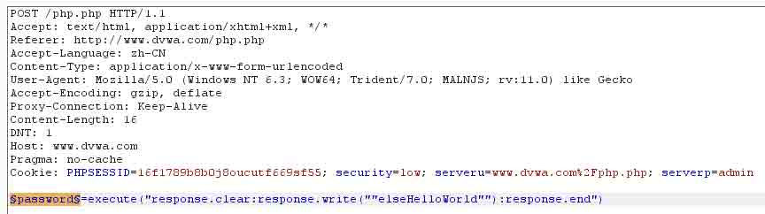

```
asp     password=execute("response.clear:response.write(""passwordright""):response.end")
php     password=execute("response.clear:response.write(""elseHelloWorld""):response.end")
aspx    password=execute("response.clear:response.write(""elseHelloWorld""):response.end")。 
```

一般步骤如下

1.代理好服务器地址，然后访问这个大马地址

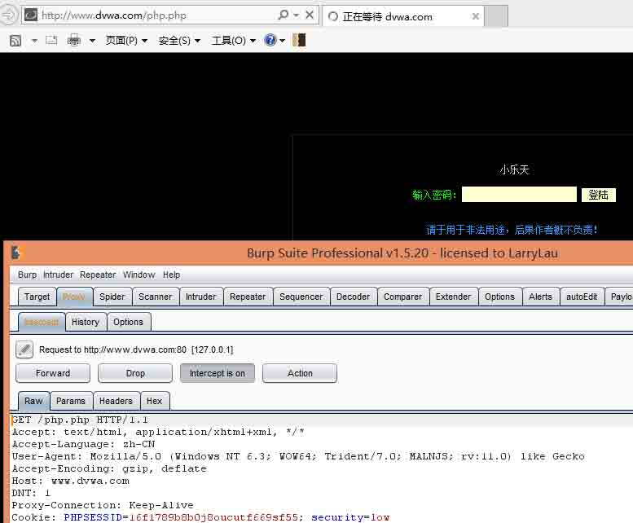

2.随后点击 forward,并且在大马页面随便输入什么，burp 拦截了数据之后发送到 repeater

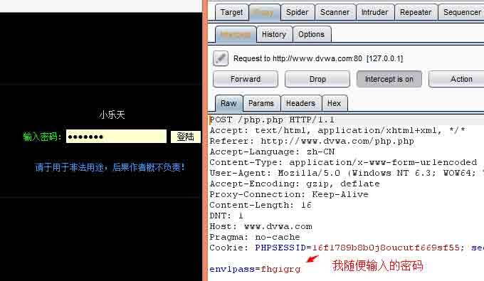

3.切换到 repeater 选项卡中，点击 go 按钮，找出一些反馈的错误信息，当然如果不要也可以，这里找错误信息是方便爆破成功了之后便于发现，我这个马反馈的是中文错误信息，显示是乱码就不写了，我们可以通过爆破成功了之后看字节数。 4.接下来就是发送到 intruder，target 一般都不需要管，已经自动填好了，然后选择 positions

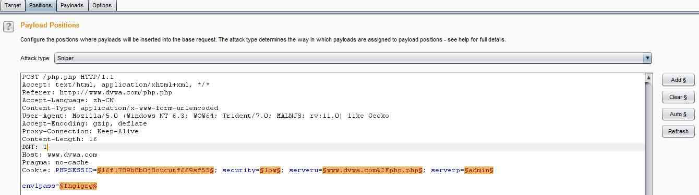

先点击 Clear$，选择密码地地方点击 add$。

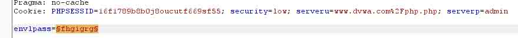

5.切换到 payloads 设置 payload type，选择我们自己的字典

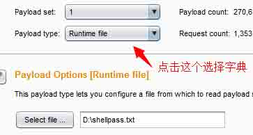

6.切换到 options 去设置进程数和失败之后重试次数、过滤结果

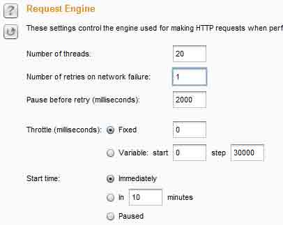

一般我都会把 Grep-Match 清理掉，省得干扰。

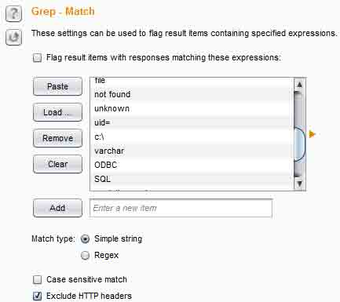

7.接下来点击 intruder 下的 start attack 就开始爆破了，密码 admin，我是根据 length 来判断跟其他的不同


附赠一个 webshell 字典：[shellpassword.txt.zip](http://static.wooyun.org/20141017/2014101711121696735.zip)

### Target

用于配置目标服务器进行攻击的详细信息。所需的选项有： Host(主机) - 这是目标服务器的 IP 地址或主机名。 Port(端口) - 这是 HTTP / S 服务的端口号。 Use HTTPS(使用 HTTPS)，这指定的 SSL 是否应该被使用。 配置这些细节最简单的方法是选择你要攻击中 BurpSuite 的任何地方的请求，并选择上下文菜单中的“Send to intruder”选项。这将发送选定的请求，在 intruder 一个新的选项卡，将自动填充的目标和位置选项卡。

### Positions

用于配置 request temlate 的攻击，和 payloads markers、attack type 一起。

### Request Template

主要请求编辑器是用来定义从所有攻击请求都将被导出的请求模板。对于每一个攻击的请求，BurpSuite 接受请求的模板，并把一个或多个有效载荷送入由有效载荷标记定义的位置。 成立请求模板的最简单的方法是选择你要攻击中 BurpSuite 的任何地方的请求，并选择上下文菜单中的“Send to intruder”选项。这将发送选定的请求，在 intruder 的选项卡，将自动填充的 Target 和 Positions 选项卡。

### Payload Markers

有效载荷的标记是使用§字符，并且功能如下放置：

```
1)每对标记指定一个有效载荷的位置。
2)一对标记物可以从它们之间任选的模板要求附上一些文字。
3)当一个有效载荷的位置被分配了一个有效载荷，无论是标记和任何包含的文本将被替换为有效载荷。
4)当一个有效载荷的位置不具有分配的有效载荷，该标记将被删除，但是所包含的文本保持不变。 
```

为了使配置更加简单，Intruder 会自动突出显示每对有效载荷的标记和任何它们之间包含的文本。

您可以手动或自动做有效载荷标记。当您从 BurpSuite 别处发送一个请求到 Intruder，Intruder 猜测你可能要放置有效载荷，并设置相应的有效载荷标记。您可以修改使用按钮的默认有效载荷标记旁边的请求模板编辑器：

Add§ - 如果没有文本被选中，该插入一个有效载荷标记在光标位置。如果您已经选择了一些文字，一对标记插入封闭选定的文本。 Clear§ - 这将删除所有的位置标记，无论是从整个模板或模板的选定部分。 Auto§ - 自动放置有效载荷标记。包括价值：

```
1)URL 查询字符串参数
2)车身参数
3)曲奇饼
4)多重参数属性（例如，在文件上传的文件名）
5)XML 数据和元素属性
6)JSON 参数 
```

您可以配置自动负载位置是否将更换或追加到现有的参数值，通过入侵者菜单上的选项。需要注意的是，如果一个子部分的要求，但不是整个消息体，包含格式化数据使用 XML 或 JSON ，可以自动通过这种结构中的位置的有效载荷手动选择格式化数据的准确块，并使用“自动”按钮在其定位的有效载荷。这是有用的，例如，当一个多参数的值包含在 XML 或 JSON 格式数据。

```
刷新 - 这将刷新请求模板编辑器的语法彩色化，如果必要的。
清除 - 这会删除整个请求模板。 
```

注意：您也可以使用入侵者的有效载荷仓的 UI 通过 BurpSuite 扫描仪配置自定义插入点主动扫描。要做到这一点，配置请求模板和有效载荷在标记内入侵者通常的方式，然后选择从入侵者菜单中的“主动扫描定义插入点” 。

### Attack type

Burp Intruder 支持各种攻击类型 - 这些决定在何种负载分配给有效载荷仓的方式。攻击类型可以使用请求模板编辑器上方的下拉菜单进行选择。以下攻击类型可供选择：

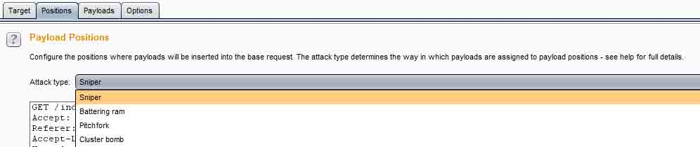

Sniper(狙击手) - 这将使用一套单一的 payloads。它的目标依次在每个有效载荷的位置，并把每个有效载荷送入依次那个位置。这不是针对一个给定的请求的位置不受影响 - 位置标记被移除，并在它们之间出现在模板中任何封闭文本保持不变。这种攻击类型为个别模糊测试的一些请求参数常见的漏洞非常有用。在攻击中生成的请求的总数是位置的数目和在有效载荷中设定的有效载荷的数量的乘积。

Battering ram(撞击物) - 使用一组 payload。通过迭代的有效载荷方式，并将相同的 payloads 再一次填充到所有已定义的有效载荷仓。当其中一个攻击需要相同的输入将被插入在多个地方在请求中（例如，一个 Cookie 中的用户名和 cookie 参数）对这种攻击类型是非常有用的。在攻击中生成的请求的总数是有效载荷的有效载荷中设定的数目。

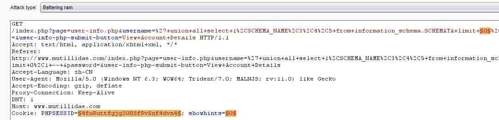


例如生成一组数字 1-9，则就是 1-1 ，2-2，3-3 这种形式 Pitchfork(相交叉) - 这将使用多个 payloads 集。有对每个定义的位置（最多 20 个）不同的有效载荷组。通过设置所有有效载荷的攻击迭代的方式，并将一个有效载荷到每个定义的位置。

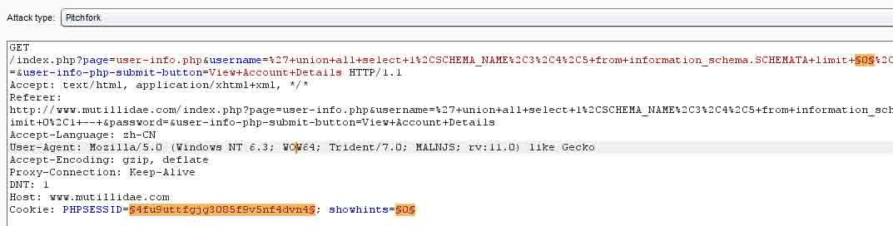

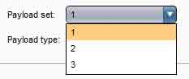

例如设置多个，每个 payload 设置一个字典，则就是 1-1-1，2-2-2，3-3-3 这种形式

换句话说，第一个请求将放置第一个有效载荷的 Payload set 1 到 Positions 1 ，并从有效载荷中的第一个 Payload set 2 到 Positons 2 ;第二个请求将放置第二个 Payload set 1 到 Positions 1 ，并从 payload 中的第二个 Payload set 2 到 Postions2 ，等在那里的攻击需要不同但相关的输入进行插在多个地方，这种攻击类型是有用的请求（例如，用户名中的一个参数，和对应于该用户名中的另一个参数已知的 ID 号） 。在攻击中生成的请求的总数是有效载荷中的最小有效载荷组的数目。

Cluster bomb(集束炸弹) - 使用多个 Payload sets。有对每个定义的 Positions（最多 20 个）设置不同的 payload set。通过每个有效载荷的攻击迭代依次设置，使有效载荷组合的所有排列进行测试。

例如设置三个字典都是 10 个数，则总共有 1000 总匹配的模式

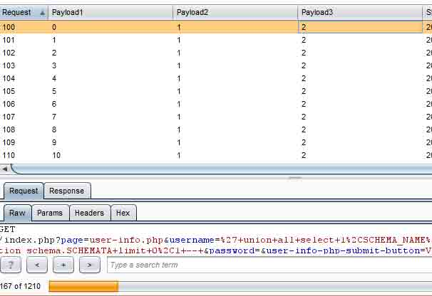

也就是说，如果有两个有效载荷的位置，则该攻击将放置第一个有效载荷从 payload set 2 到 Positions 2 ，并通过在有效负载的所有 payload set 1 中的 positions 1 ;然后它将第二个有效载荷从载荷设置 2 到位置 2 ，并通过有效载荷全部载入循环设置 1 到位置 1 。其中一个攻击需要不同的和无关的或未知输入要在多个地方插入这种类型的攻击是非常有用的在请求中（例如猜测凭证，在一个参数的用户名，并且在另一个参数密码时） 。在攻击中生成的请求的总数是在所有定义的有效载荷的有效载荷集的数目的乘积 - 这可能是非常大的。

## Payloads

### Types

Burp Intruder 包含以下几种 attack type:

```
Simple list--简单字典
Runtime file--运行文件
Custom iterator--自定义迭代器
Character substitution--字符替换 
```

此负载类型允许您配置一个字符串列表，并应用各种字符替换到每个项目。这可能是在密码猜测攻击非常有用，用来产生在字典中的单词常见的变化。 用户界面允许您配置了一些字符替换。当执行攻击，有效载荷类型工程通过逐一配置的列表项。对于每个项目，它产生一个数的有效载荷，根据所定义的取代基包括取代的字符的所有排列。例如，默认替换规则（其中包括 e>3 且 t>7），该项目“peter”将产生以下的有效载荷：

```
peter
p3ter
pe7er
p37er
pet3r
p3t3r
pe73r
p373r 
```

Case modification--此负载类型允许您配置一个字符串列表，并应用各种情况下修改每个项目。这可能是密码猜测攻击非常有用，用来产生在字典中的单词的情况下的变化。 可以选择以下的情况下修改规则：

```
No change - 这个项目可以用不被修改。 
To lower case- 在该项目的所有字母转换为小写。 
To upper case - 在该项目的所有字母转换为大写。 
To Propername - 在该项目的第一个字母转换为大写，以及随后的字母转换为小写。 
To ProperName - 在该项目的第一个字母转换为大写，以及随后的字母都不会改变。 
```

例如：

```
Peter Wiener
peter wiener
PETER WIENER
Peter wiener 
```

选项：

```
Recursive grep--递归 grep
Illegal Unicode--非法的 Unicode
Character blocks--字符块
Numbers--数字
Dates--日期
Brute forcer--暴力
Null payloads--空的有效负载
Character frobber--性格 frobber
Bit flipper--位翻转
Username generator--用户名生成器
ECB block shuffler--欧洲央行座洗牌
Extension-generated--扩展生成
Copy other payload--复制其它有效负载 
```

### Processing

由配置的有效载荷类型生成的有效载荷可以使用各种有效载荷的处理规则和有效负载编码可以进一步操纵。

#### 1)Payload Processing Rules

在它被使用之前可以定义规则来对每个有效载荷执行各种处理任务。该定义的规则按顺序执行，并且可以打开和关闭，以帮助调试与配置的任何问题。有效载荷的处理规则是有用的在多种情况下，你需要生成不同寻常的有效载荷，或者需要在一个更广泛的结构或在使用前编码方案包的有效载荷可达。

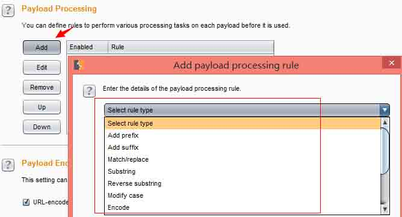

```
Add prefix - 添加一个文字前缀
Add suffix - 添加一个文字后缀
Match/replace - 将替换匹配特定正则表达式的有效载荷的任何部位，用一个文字字符串表示。
Substring - 提取的有效载荷的子部分中，从指定的偏移量（0-索引）和至所指定的长度开始。
Reverse substring - 对于子规则来说，最终的偏移量指定的有效载荷的末尾向后计数，并且长度从端部向后偏移计数。
Modify case - 这个修改了的有效载荷的情况下，如果适用的话。同样的选项作为的情况下修改有效载荷类型。
Encode - URL，HTML，Base64 的，ASCII 码或十六进制字符串构建各种平台：采用不同的计划，该编码的有效载荷。
Hash - hash
Add raw payload - 这之前或之后，在当前处理的值增加了原始负载值。它可以是有用的，例如，如果你需要提交相同的有效载荷在 raw 和哈希表。
Skip raw payload - 将检查是否当前处理的值匹配指定的正则表达式，如果是这样，跳过有效载荷和移动到下一个。这可能是有用的，例如，如果知道一个参数值必须有一个最小长度和要跳过的一个列表，比这更短的长度的任何值。
Invoke Burp extension - 调用一个 Burp exxtension(扩展)来处理负载。扩展名必须已注册入侵者有效载荷处理器。您可以从已注册的当前加载的扩展可用的处理器列表中选择所需的处理器。 
```

是规则的以下类型：

#### 2)Payload Encoding

你可以配置哪些有效载荷中的字符应该是 URL 编码的 HTTP 请求中的安全传输。任何已配置的 URL 编码最后应用，任何有效载荷处理规则执行之后。 这是推荐使用此设置进行最终 URL 编码，而不是一个有效载荷处理规则，因为可以用来有效载荷的 grep 选项来检查响应为呼应有效载荷的最终 URL 编码应用之前。...

### Optins

此选项卡包含了 request headers，request engine，attack results ，grep match，grep_extrack，grep payloads 和 redirections。你可以发动攻击之前，在主要 Intruder 的 UI 上编辑这些选项，大部分设置也可以在攻击时对已在运行的窗口进行修改。

#### Request Headers

这些设置控制在攻击 Intruder(入侵者)是否更新配置请求头。请注意，您可以完全控制请求头通过在 Payload positions(有效载荷位置)标签的要求范围内。这些选项可以用来更新每个请求的报头的方式，通常是有帮助的。

下列选项可用：

Update Content-length header(更新 Content-Length 头) - 此选项使 Intruder(入侵者)添加或更新的 Content-Length 头的每个请求，与该特定请求的 HTTP 体的长度正确的值。此功能通常用于该插入可变长度的有效载荷送入模板的 HTTP 请求的主体的攻击至关重要。如果未指定正确的值，则目标服务器可能会返回一个错误，可能不完全响应请求，或者可能无限期地等待在请求继续接收数据。

Set Connection:close(设置连接：关闭) - 此选项使 Intruder(入侵者)添加或更新连接头的值为“close(关闭)” 。在某些情况下（当服务器本身并不返回一个有效的 Content-Length 或 Transfer-Encoding 头） ，这个选项可以让攻击更快速地执行。

#### Request Engine

设置控制用于发出 HTTP 请求中的 Intruder(入侵者)攻击的 Engine(引擎)。下列选项可用：

```
Number of threads(执行进程数) - [专业版]该选项控制并发请求数的攻击。
Number of retries on network failure(网络故障的重试次数) - 如果出现连接错误或其他网络问题，Burp 会放弃和移动之前重试的请求指定的次数。测试时间歇性网络故障是常见的，所以最好是在发生故障时重试该请求了好几次。
Pause before retry(重试前暂停) - 当重试失败的请求，Burp 会等待指定的时间（以毫秒为单位） ，然后重试失败以下。如果服务器被宕机，繁忙，或间歇性的问题发生，最好是等待很短的时间，然后重试。
Throttle between requests(请求之间的节流) - Burp 可以在每次请求之前等待一个指定的延迟（以毫秒为单位） 。此选项很有用，以避免超载应用程序，或者是更隐蔽。或者，您可以配置一个可变延迟（与给定的初始值和增量） 。这个选项可以是有用的测试应用程序执行的会话超时时间间隔。
Start time(开始时间) - 此选项允许您配置攻击立即启动，或在指定的延迟后，或开始处于暂停状态。如果攻击被配置，将在未来的某个时刻以供将来使用被执行，或保存这些替代品可能是有用的。 
```

小心使用这些选项可让您微调攻击引擎，这取决于对应用程序性能的影响，并在自己的处理能力和带宽。如果您发现该攻击运行缓慢，但应用程序表现良好和你自己的 CPU 利用率很低，可以增加线程数，使你的攻击进行得更快。如果您发现连接错误发生，该应用程序正在放缓，或者说自己的电脑被锁定了，你应该减少线程数，也许增加网络故障和重试之间的间隔重试的次数。

#### Attack Results

这些设置控制哪些信息被捕获的攻击效果。下列选项可用：

```
Store requests/responses(存储请求/响应) - 这些选项确定攻击是否会保存单个请求和响应的内容。保存请求和响应占用磁盘空间，在你的临时目录中，但可以让您在攻击期间在众目睽睽这些，如果有必要重复单个请求，并将其发送到其他 Burp 工具。
Make unmodified baseline request(未修改的基本请求) - 如果选择此选项，那么除了配置的攻击请求，Burp 会发出模板请求设置为基值，所有有效载荷的位置。此请求将在结果表显示为项目＃ 0 。使用此选项很有用，提供一个用来比较的攻击响应基地的响应。
Use denial-of-service mode(使用拒绝服务的模式) - 如果选择此选项，那么攻击会发出请求，如正常，但不会等待处理从服务器收到任何答复。只要发出的每个请求， TCP 连接将被关闭。这个功能可以被用来执行拒绝服务的应用层对脆弱的应用程序的攻击，通过重复发送该启动高负荷任务的服务器上，同时避免通过举办开放套接字等待服务器响应锁定了本地资源的请求。
Store full payloads(保存完整的有效载荷) - 如果选择此选项，Burp 将存储全部有效载荷值的结果。此选项会占用额外的内存，但如果你想在运行时执行某些操作，如修改 payload grep setting(有效负载值设置)，或重新发出请求与修改请求模板可能需要。 
```

#### Grep-Match

设置可用于包含在响应中指定的表达式标志结果的项目。对于配置列表中的每个项目，Burp 会添加一个包含一个复选框，指出项目是否被发现在每个响应的新成果列。然后，您可以到组排序此列（通过单击列标题）匹配的结果相加。

使用此选项可以是非常强大的，帮助分析大套的成绩，并迅速找出有趣的项目。例如，在口令猜测攻击，扫描短语，如“password incorrect(密码不正确)”或“login successful(登录成功)”，可以找到成功登录;在测试 SQL 注入漏洞，扫描含有“ ODBC ” ， “error(错误)”等消息可以识别易受攻击的参数。

除了表达式匹配的列表，下列选项可用：

```
Match(匹配类型) - 指定的表达式是否是简单的字符串或 regular expressions(正则表达式)。
Case sensitive match(区分大小写的匹配) - 指定检查表达式是否应区分大小写。
Exclude HTTP headers(不包括 HTTP 头) - 指定的 HTTP 响应头是否应被排除在检查。 
```

#### Grep-Extrack

可以被用来 Extrack(提取)从反应有用的信息进入攻击结果的表。对于配置列表中的每个项目，Burp 会添加一个包含提取该项目的文本的新成果列。然后，您可以排序此列（通过单击列标题）命令所提取的数据。例如我要匹配

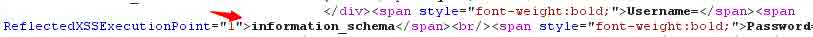

information_schema 这个表。则可以这样写，都是需要匹配唯一的那种，也可以使用正则，前提是你会写正则。在乌云社区有人提起过当时怎么匹配手机号，就可以从这里提取。

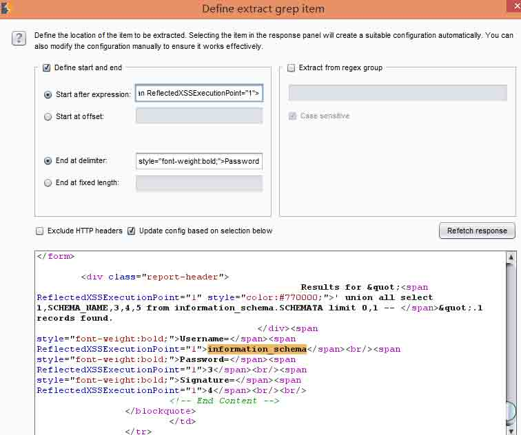

#### Grep-Payloads

设置可用于含有所提交的有效载荷的反射标志的结果项。如果启用该选项，Burp 会添加一个包含一个复选框，指示当前负载的值是否被发现在每个响应的新成果列。 （如果使用一个以上的有效载荷，单独的列将每个有效载荷集加。 ）

此功能可以在检测跨站点脚本和其他应对注入漏洞，它可以出现在用户输入动态地插入到应用程序的响应是有用的。

下列选项可用：

```
Case sensitive match(区分大小写的匹配) - 指定检查 payload(负载)是否应区分大小写。
Exclude HTTP headers(不包括 HTTP 头) - 这指定的 HTTP 响应头是否应被排除在检查。
Match against pre-URL-encoded payloads(对预 URL 编码的有效载荷匹配) - 这是正常的配置 Inturder(入侵者)请求中 URL 编码的有效载荷。然而，这些通常是由应用程序解码，回荡在他们的原始形式。您可以使用此选项，以用于有效载荷 Burp 检查反应在他们的预编码形式。 
```

#### Redirections

控制 Burp 在进行攻击时如何处理重定向。它往往是要遵循重定向来实现你的攻击目标。例如，在一个口令猜测攻击，每一次尝试的结果可能只能通过下面的重定向显示。模糊测试的时候，相关的反馈可能只出现在最初的重定向响应后返回的错误消息。

下列选项可用： Follow redirections(跟随重定向) - 控制重定向都遵循的目标。下列选项可用：

```
1)Never(从来没有) - 入侵者不会遵循任何重定向。
2)On-site only(现场唯一的) - 入侵者只会跟随重定向到同一个网页“网站” ，即使用相同的主机，端口和协议的是在原始请求使用的 URL 。
3)In-scope only(调查范围内的唯一) - Intruder 只会跟随重定向到该套件范围的目标范围之内的 URL 。
4)Always(总是) - Intruder 将遵循重定向到任何任何 URL 。您应使用此选项时应谨慎 - 偶尔， Web 应用程序在中继重定向到第三方的请求参数，并按照重定向你可能会不小心攻击。 
```

Process cookies in redirections(过程中的 Cookie 重定向) - 如果选择此选项，然后在重定向响应设置任何 cookies 将被当重定向目标之后重新提交。例如，如果你正在尝试暴力破解登录的挑战就可能是必要的，它总是返回一个重定向到一个页面显示登录的结果，和一个新的会话响应每个登录尝试创建。

Burp 会跟进到 10 链重定向，如果必要的。在结果表中的列将显示重定向是否其次为每个单独的结果，以及完整的请求和响应中的重定向链存储与每个结果的项目。重定向的类型 Burp 会处理（ 3xx 的状态码，刷新头，等）配置在一套全重定向选项。

注意重定向： 在某些情况下，可能需要下面的重定向时只使用一个单线程的攻击。出现这种情况时，应用程序存储会话中的初始请求的结果，并提供重定向响应时检索此。

自动下重定向有时可能会造成问题 - 例如，如果应用程序响应一个重定向到注销页面的一些恶意的请求，那么下面的重定向可能会导致您的会话被终止时，它原本不会这么做。

### Attacks

当你配置完你的攻击设置时，你需要 launch the attacks(发起攻击)，analyze the results(分析结果)，有时修改攻击配置，与您的测试工作流程链接，或进行其他操作。

#### Launching an Attack

攻击可以通过两种方式启动：

```
1)您可以配置 Target(目标)，Positions(位置)，Payloads(有效载荷)和 Options(选项卡)的攻击设置，然后选择从 Intruder(入侵者)菜单“Start attack(开始攻击)”。 
2)您可以通过从 Intruder menu(入侵者菜单)中选择“previously saved attack(打开保存的攻击)”打开以前保存的攻击。 
```

在单独的窗口中每次攻击会打开。该窗口显示攻击为它们生成的结果，使您能够修改攻击配置实时，并与您的测试工作流程链接，或进行其他操作。

#### Result Tab

在结果选项卡包含在攻击发出的每个请求的全部细节。你可以过滤并标注此信息来帮助分析它，并使用它来驱动您的测试工作流程。

#### 1)Results Table

Results Table 显示已在 attack 中所有的请求和响应的详细信息。根据不同的攻击配置，表可能包含以下几列，其中一些是默认隐藏的，可以使用 Columns 菜单 中取消隐藏：

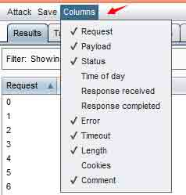

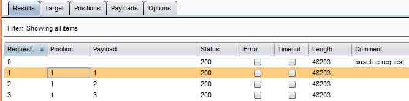

request 请求数 Position 有效载荷位置编号 Payload 有效载荷 Status http 状态 Error 请求错误 Timeout 超时 Length 字节数 Comment 注释

#### 2)Display Filter

结果选项卡，可以用来隐藏某些内容从视图中，以使其更易于分析和对你感兴趣的工作内容显示过滤在结果表中。点击过滤器栏打开要编辑的过滤器选项。该过滤器可以基于以下属性进行配置：

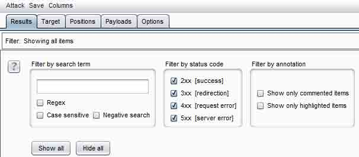

```
Search term(检索词) - [专业版]您可以筛选反应是否不包含指定的搜索词。您可以设定搜索词是否是一个文字字符串或正则表达式，以及是否区分大小写。如果您选择了“negative search(消极搜索)”选项，然后不匹配的搜索词唯一的项目将被显示。
Status code(状态代码) - 您可以配置是否要显示或隐藏各种 HTTP 状态码响应。
Annotation(注释) - 您可以设定是否显示使用用户提供的评论或只重点项目。在结果表中显示的内容实际上是一个视图到基础数据库，并显示过滤器控制什么是包含在该视图。如果设置一个过滤器，隐藏一些项目，这些都没有被删除，只是隐藏起来，如果你取消设置相关的过滤器将再次出现。这意味着您可以使用筛选器来帮助您系统地研究一个大的结果集（例如，从模糊测试包含许多参数的要求）来理解各种不同的有趣的响应出现。 
```

### Attack configuration Tabs

在结果选项卡中，攻击窗口包含每个从它目前的攻击是基于主界面的配置选项卡中的克隆。这使您能够查看和修改攻击配置，同时进攻正在进行中。有关进一步详情，请参阅各配置选项卡的帮助：目标职位有效载荷选项当修改一个跑动进攻的配置，以下几点值得关注：攻击结构的某些部分是基本的攻击（如攻击类型和有效载荷类型）的结构，并且攻击已经开始之后不能改变。改变配置的某些部分攻击正在运行时，可能会有意想不到的效果。

例如，如果您使用的是数量的有效载荷和编辑字段中，然后更改才会生效，因为每个键被按下;如果你最初从删除数字字段中，那么攻击可能会突然完成，因为要字段现在包含一个较小的数字。我们强烈建议您暂停修改它们的配置运行前的攻击。

### Result Menus

结果视图包含几个菜单命令与控制的攻击，并进行其他操作。这些将在下面说明。

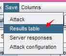

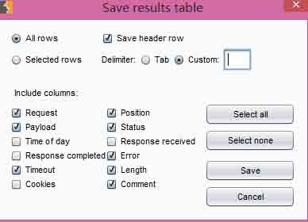

#### 1)Attack Menu(攻击菜单)

包含的命令 pause(暂停)，resume(继续)或 repeat(重复)攻击。

#### 2）Save Menu(保存菜单)

```
attack - 这是用来保存当前攻击的副本，包括结果。保存的文件可以使用从主 Burp 的 UI Intruder 菜单中的“打开保存的攻击”选项来重新加载。
Results table - 这是用于对结果表保存为一个文本文件。你可以选择保存的所有行，或仅选定的行。您也可以选择要包括的列，列分隔符。此功能是有用的导出结果到电子表格中，以便进一步分析，或用于保存单个列（如使用提取的 grep 函数挖掘数据），以用作用于随后的攻击或其它工具的输入文件。
Server responses - 这是用于保存收到的所有请求的全部应答。这些既可以被保存在单独的文件中（顺序编号）或串行级联的序列转换成一个单一的文件。
Attack configuration - 这是用来保存当前正在执行攻击的配置（而不是结果）。您可以重新使用从主 Burp 的 UI Intruder 菜单中的“加载配置攻击”选项，攻击配置。 
```

#### 3)Columns Menu(列菜单)

这使您可以选择哪些可用的列是可见的攻击结果表。

版权声明：未经授权禁止转载 [小乐天](http://drops.wooyun.org/author/小乐天 "由 小乐天 发布")@[乌云知识库](http://drops.wooyun.org)

分享到：

### 相关日志

*   [Burp Suite 使用介绍（二）](http://drops.wooyun.org/tools/1629)
*   [使用 SQLMAP 对网站和数据库进行 SQL 注入攻击](http://drops.wooyun.org/tips/2113)
*   [InsightScan:Python 多线程 Ping/端口扫描 + HTTP 服务/APP 探测，可生成 Hydra 用的 IP 列表](http://drops.wooyun.org/tools/427)
*   [Burp Suite 使用介绍（三）](http://drops.wooyun.org/tips/2247)
*   [Burp Suite 使用介绍（四）](http://drops.wooyun.org/tips/2504)
*   [对 *nix WEB 服务器的一个隐藏威胁](http://drops.wooyun.org/tips/2646)