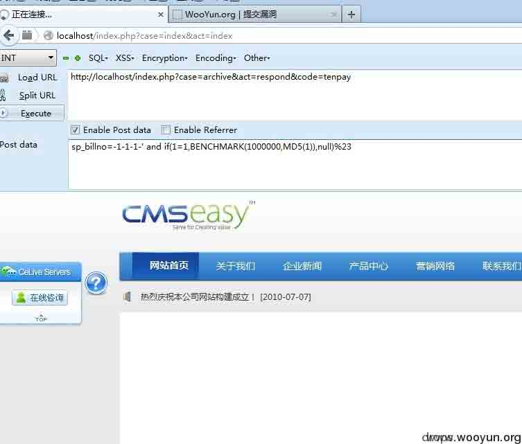
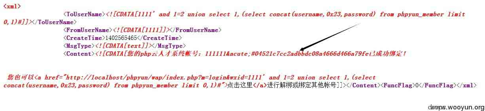

# 第三方接口 黑客怎么爱你都不嫌多

2014/08/14 11:29 | [小飞](http://drops.wooyun.org/author/小飞 "由 小飞 发布") | [技术分享](http://drops.wooyun.org/category/tips "查看 技术分享 中的全部文章"), [漏洞分析](http://drops.wooyun.org/category/papers "查看 漏洞分析 中的全部文章") | 占个座先 | 捐赠作者

## 0x01 写在前面

* * *

本文总结了乌云主站最近提交的 由于第三方接口程序导致的高危漏洞 本文实例都是使用率高，且在近期爆出漏洞的 API，具有一定现实意义

在程序中嵌入第三方程序，可以追溯到 discuz！。后来的各种 SNS 程序，CMS，BBS 都纷纷效仿，他们或由官方 或由站长自己添加了各种插件和 api，一方面 这些脚本增加了用户体验，然而在黑客眼中，实则是增大了入侵几率。

各种接口的添加，一般是在整站程序开发周期之后，那么开发全局观的不同步是显而易见的后果，简而言之，前期种种过滤和安全防护，可能由于后期开发对第三方插件盲目的信任，被彻底绕过，导致漏洞形成。

## 0x02  实例分析

* * *

### 看看那些厂商都是怎么被出卖的

**第一弹 Alipay 支付插件那碎一地的节操**

```
影响程序：Ecshop，Dedecms，Cmseasy ...  
lib\plugins\pay\alipay.php 
```

我们看看 cmseasy 怎么被自己人干掉的吧 在 alipay.php 中 自己定义的数据库函数在 rec_update 中

```
public function rec_update($row , $where){ ... 省略无关代码 ...
            $sql="UPDATE `".$this->tablename."` SET ".$sqlud." WHERE ".$where; //漏洞出在这里 一只裸体的$where
            return $this->simpledb->execute($sql);
        }

```

可以看到 where 是没有单引号的，我们看看 where 从哪里能传进来。

```
public static function changeorders($id,$orderlog) {
        //file_put_contents('logs.txt', $id);
        $where=array();
        $where['id']=$id;
        $where['status']=4;
        //$where['orderlog']=serialize($orderlog);
        $update=orders::getInstance()->rec_update($where,$id);
        if($update<1) {
            exit('改变订单状态出错，请联系管理员');
        }
    }

```

继续追踪 changeorders

```
function respond() {
        if (!empty($_POST)) {
            foreach($_POST as $key =>$data) {
                $_GET[$key] = $data;
            }
        }
        $payment  = pay::get_payment($_GET['code']);
        $seller_email = rawurldecode($_GET['seller_email']);
        $order_sn = str_replace($_GET['subject'],'',$_GET['out_trade_no']);
        $order_sn = trim($order_sn);
                         ....省略....
            pay::changeorders($order_sn,$_GET);

```

看到没$order_sn 没有过滤 注入于是产生了 由于没有显示点 延时注入即可。

**第二弹 Tenpay 支付插件也疯狂**

```
lib\plugins\pay\tenpay.php 
```

阿里巴巴那么疯狂，BAT 的三弟腾讯怎么能示弱？  组队坑厂商什么的最有爱了~ 由于 Cmseasy 最信任插件了。。所以又是他受伤。。。

```
class tenpay {
......
    function respond() {
        require_once ("tenpay/PayResponseHandler.class.php");
        $resHandler = new PayResponseHandler();
        $sp_billno = $resHandler->getParameter("sp_billno"); //腾讯的函数,类似于$_GET['sp_billno']或者$_POST['sp_billno']

//上面谈到 GET 不受过滤影响，本地问价内包含 POST，GET 提交都可，但是注入的话必须提交 POST，因为 GET 是 URL 码.
//sp_lillno=sp_billno=-1-1-../../../demo 包含根目录的 demo.php

        preg_match_all("/-(.*)-(.*)-(.*)/isu",$sp_billno,$oidout);
        $paytype = $where['pay_code'] = $oidout[3][0];
        include_once ROOT.'/lib/plugins/pay/'.$paytype.'.php';//匹配上面正则就行，包含之，触发，但是实在找不到能截断的 PHP 文件了,所以鸡肋了。
        $pay = pay::getInstance()->getrows($where); //SQL 注入，跟进 0x02
    ......

}

```

看到 where 没？ 难道又是一只裸体动物？ 答案是 NO 这次是 Cmseasy 本身代码和 API 共同狼狈为奸 看 getrows

```
function getrow($condition,$order='1 desc',$cols='*') {
        $this->condition($condition); //OMG 跟进,又是这个函数
        return $this->rec_select_one($condition,'*',$order);
    }

function condition(&$condition) {
        if (isset($condition) &amp;&amp;is_array($condition)) {
            $_condition=array();
            foreach ($condition as $key=>$value) {
                $value=str_replace("'","\'",$value);//问题函数在这里 MARK
                $_condition[]="`$key`='$value'";
            }
            $condition=implode(' and ',$_condition);
        }
        ......
    }

```

试想一下，当我们 POST 提交`'evalsql` 由于 gpc 作用 会变成 `\'evalsql` 经过刚刚 mark 的那一行代码 就变成了 `\\'evalsql` 单引号被解救了 - -

所以卖队友成功



**第三弹 腾讯连弹 换个姿势咱们继续卖队友**

微信 sdk 接口（weixin.php） 影响程序：数不清，这个太多了点，从大到小

挑个超级典型的对象 PHPYUN
/*phpyun 的全局过滤堪称典范 所有特殊字符入库一律被替换成&acute 再加上 360wscan 铜墙铁壁的防御
那么壮士 yun 是不是革命成功？ 错！ 汪精卫 weixin 笑而不语。。。*/
这里引入一个古老而又粗暴的漏洞 XML 实体注入，也许下一篇 drop 文就是这个的科普

```
//weixin/model/index.class.php  
private function responseMsg()
    {
        $postStr = $GLOBALS["HTTP_RAW_POST_DATA"];
        if (!empty($postStr)){
                $postObj = simplexml_load_string($postStr, 'SimpleXMLElement', LIBXML_NOCDATA);
                $fromUsername = $postObj->FromUserName;
                $toUsername = $postObj->ToUserName;
                $keyword = trim($postObj->Content);
                $time = time();
                $textTpl = "<xml>
                            <ToUserName><![CDATA[%s]]></ToUserName>
                            <FromUserName><![CDATA[%s]]></FromUserName>
                            <CreateTime>%s</CreateTime>
                            <MsgType><![CDATA[%s]]></MsgType>
                            <Content><![CDATA[%s]]></Content>
                            <FuncFlag>0</FuncFlag>
                            </xml>";

                if(!empty( $keyword ))
                {
                    $msgType = "text";
                    $contentStr = "Welcome to wechat world!";
                    $resultStr = sprintf($textTpl, $fromUsername, $toUsername, $time, $msgType, $contentStr);
                    echo $resultStr;
                }else{
                    echo "Input something...";
                }
        }else {
            echo "";
            exit;
        }
    }

```

首先介绍下

`$GLOBALS["HTTP_RAW_POST_DATA"]`这个变量是讲 POST 提交来的数据原封不动的接收 比如 POST a=1

`$GLOBALS["HTTP_RAW_POST_DATA"]` 就是“a=1” 不受 gpc 360wscan 的影响 然后接收到$postStr 之后 又没有处理 于是乎...

```
if($MsgType=='event')
              {
                $MsgEvent = $postObj->Event;
                if ($MsgEvent=='subscribe')
                {
                    $centerStr = "<Content><![CDATA[欢迎您关注".iconv('gbk','utf-8',$this->config['sy_webname'])."！\n 1：您可以直接回复关键字如【销售】、【南京 销售】、【南京 销售 XX 公司】查找您想要的职位\n 绑定您的账户体验更多精彩功能\n 感谢您的关注！]]></Content>";
                    $this->MsgType = 'text';
                }elseif ($MsgEvent=='CLICK')
                {
                    $EventKey = $postObj->EventKey;
                    if($EventKey=='我的帐号'){
                        $centerStr = $this->bindUser($fromUsername);

```

传进 bindUser 之后 最终到达

```
isBind private function isBind($wxid='')
    {
        if($wxid)
        {
            $User = $this->obj->DB_select_once("member","`wxid`='".$wxid."'","`uid`,`username`");

```

wxid 就是一开始 POST 来的数据里面的参数 注入赤果果的产生



微信团队开发这个 API 的时候，其实是验证了来源的
验证了 signature（签名）
验证的条件是 检查 signature 是否非空 非空 非空...

## 0x03 卷尾语

* * *

这样的第三方插件 应该成为程序员或者白帽子重点检查对象，原因如上 0x02 这货们如同后门一般有魅力...
一般来讲 造成此类漏洞的原因有两种
一，双方相互信任 (你不打单引号，咱不过滤，好基友一起死)
二，签名未设置或者验证
为各位客官提供点思路

版权声明：未经授权禁止转载 [小飞](http://drops.wooyun.org/author/小飞 "由 小飞 发布")@[乌云知识库](http://drops.wooyun.org)

分享到：

### 相关日志

*   [反向代理的有趣用法](http://drops.wooyun.org/tips/509)
*   [Drupal – pre Auth SQL Injection Vulnerability](http://drops.wooyun.org/papers/3197)
*   [RansomWeb:一种新兴的 web 安全威胁](http://drops.wooyun.org/papers/4834)
*   [利用 insert，update 和 delete 注入获取数据](http://drops.wooyun.org/tips/2078)
*   [WordPress < 3.6.1 PHP 对象注入漏洞](http://drops.wooyun.org/papers/596)
*   [DedeCMS 最新通杀注入(buy_action.php)漏洞分析](http://drops.wooyun.org/papers/979)