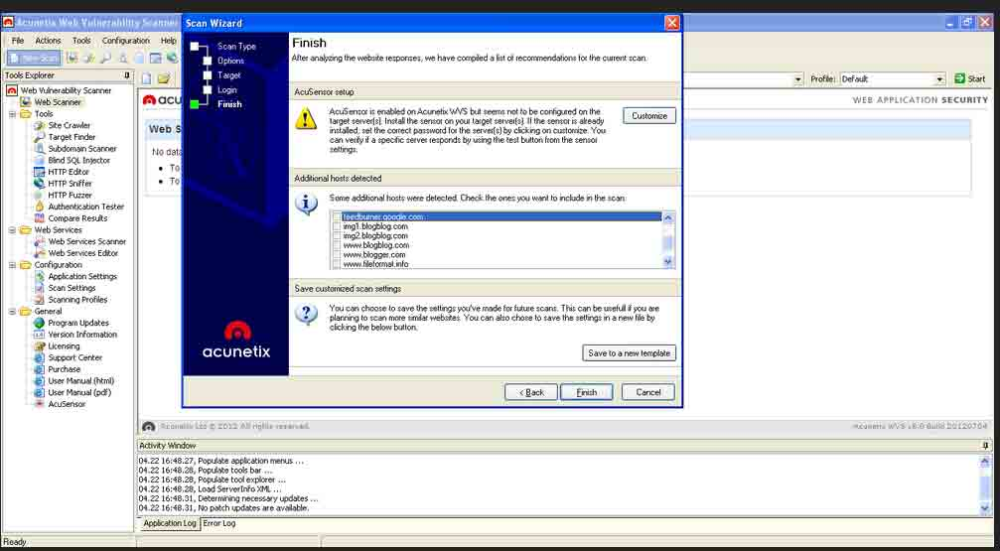
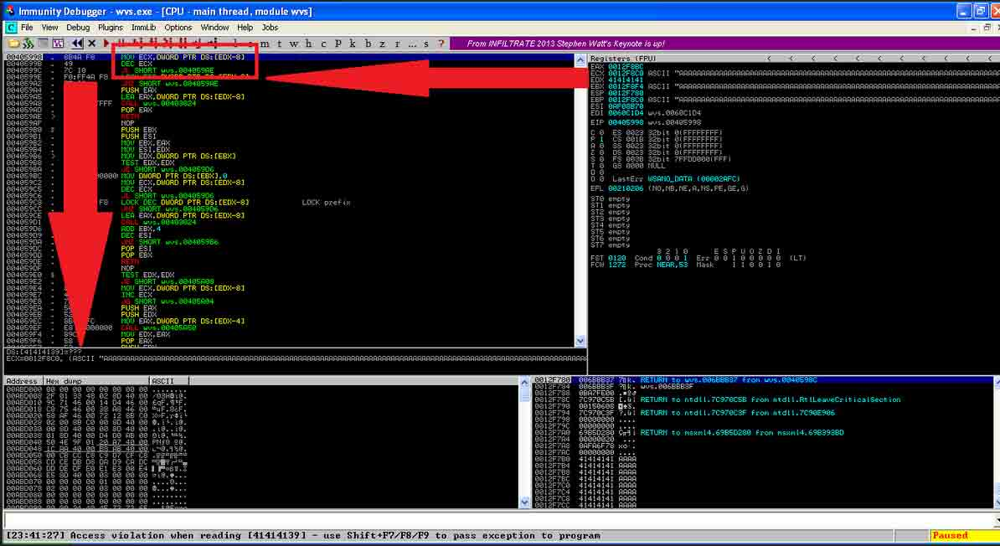
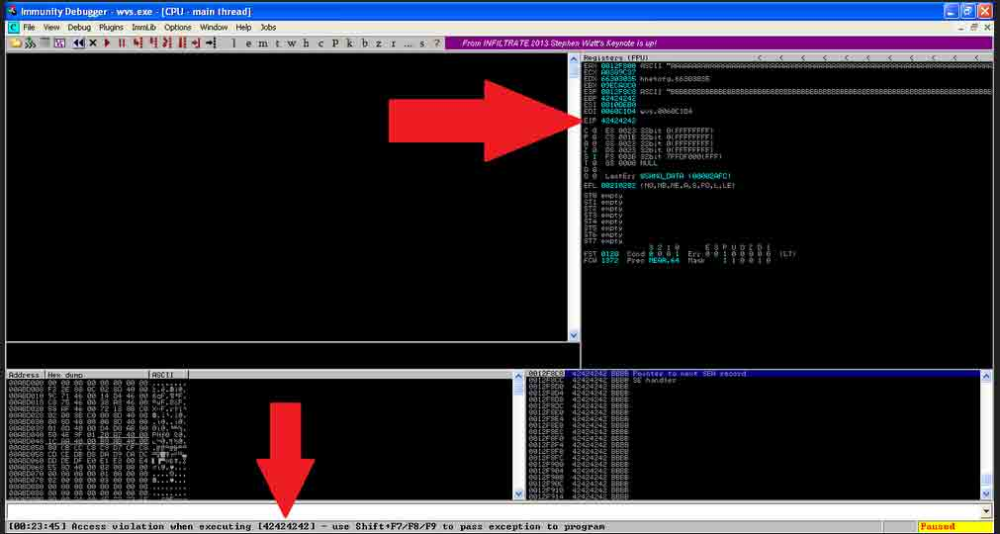
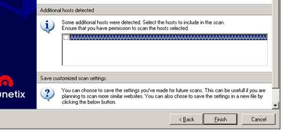
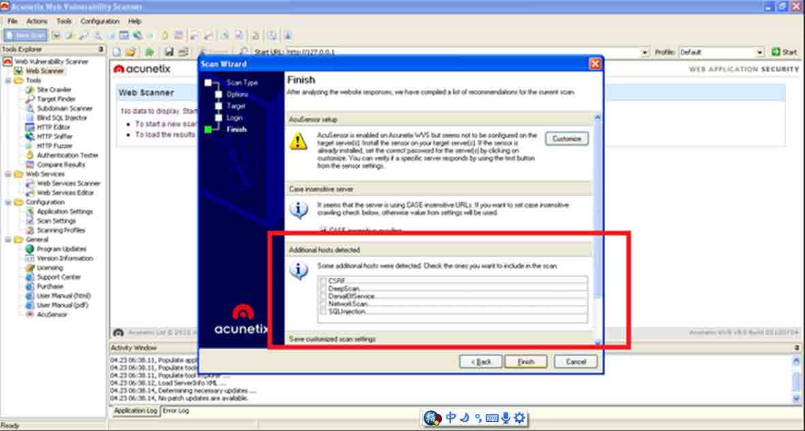
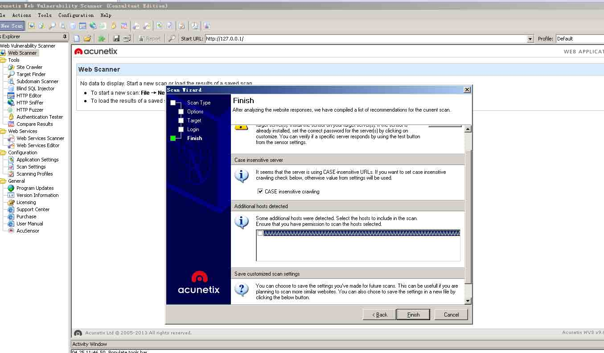

# 漏扫工具 AWVS 命令执行

2014/04/26 13:06 | [livers](http://drops.wooyun.org/author/livers "由 livers 发布") | [二进制安全](http://drops.wooyun.org/category/binary "查看 二进制安全 中的全部文章"), [漏洞分析](http://drops.wooyun.org/category/papers "查看 漏洞分析 中的全部文章") | 占个座先 | 捐赠作者

From: http://an7isec.blogspot.co.il/2014/04/pown-noobs-acunetix-0day.html

## 0x00 概述

* * *

几个星期前，作者曾发表了关于 WINRAR 0DAY（文件名欺骗）的文章。得到了大量人的关注和询问，所以这次又放出一个 0day (最热门的漏扫工具 wvs)。作者 POC 测试版本为： ACUNETIX 8 (build 20120704) 貌似是老外用的非常多版本。作者意图想让攻击者在使用 wvs 按下扫描键前三思而后行（这个才是真正的主动防护吧：）。

## 0x01 漏洞分析

* * *

ACUNETIX 是一款强大的漏扫工具，很多新手喜欢用这个工具进行扫描。

在扫描初始化阶段，会有这样一个附加选项，如下图



这一点让作者产生了兴趣，通过分析得出 wvs 在解析 http response 时，提取一些资源请求 类似:

```

<a href=http://externalSource.com/ ></a>
Etc...

```

作者又进一步分析了这个过程，惊奇的发现当某个外部域名长度超过 268 字节，wvs 就会 crash,作者开始尝试构造>=268 字节长度的域名： 首先测试 如下

```
<A href= "http://AAAAAAAAAAAAAAAAAAAAAAAAAAAAAAAAAAAAAAAAAAAAAAAAAAAAAAAAAAAAAAAAAAAAAAAAAAAAAAAAAAAAAAAAAAAAAAAAAAAAAAAAAAAAAAAAAAAAAAAAAAAAAAAAAAAAAAAAAAAAAAAAAAAAAAAAAAAAAAAAAAAAAAAAAAAAAAAAAAAAAAAAAAAAAAAAAAAAAAAAAAAAAAAAAAAAAAAAAAAAAAAAAAAAAAAAAAAAAAAAAAAAAAAAAAAAAAAAAAAAAAAAAAA"> 
```

用 Immunity Debugger（OD 是这工具的母板）附加挂载到 wvs 访问网站： Edx 被 0x41(A)覆盖 ，然后取数据段内存越权访问崩溃了：



作者本打算利用 SHE 溢出执行 shellcode 但是比较麻烦。

这里有个难点：

因为是 url 字串所以避免 url 的编码类似

```
0x22 ("), 0x23 (#), 0x24 ($), 0x25 (%), 0x5C (), 0x2F (/) 
```

所以，这里的 shellcode 不仅要是 ascii，还要去除被 URL 编码的字符，也因为如此很难绕过 SHE 保护。

作者提出的思路，利用前面可控制的 EDX 构造一个可读的地址，同时要注意构造的 edx 地址要加 8H

```
MOVE ECX, DWORD PTR DS: [EDX-8];

```

Edx 必须满足下列两个条件：

```
1.[edx]可读
2.是 ASCII 符合并且没有被 URL 转义的符号 
```

最终利用了 0x663030XX 对应 ascii 值 f005。

前面精确测试出 URL 在 268 字节时溢出（不包括 http://），溢出点就是 269 这里（500f 开始）。

```
 
```

用 wvs 扫描



Ret 之后，看到 eip 被覆盖 BBBB 0x42424242。

这里就选择 shellcode 存放位置 ，eax 是 call 函数时的参数，就只有 268 字节的 A，esp 当前栈顶指针指向着后面的 B 明显选择 esp（因为够大 ascii 编码 268 字节的 shellcode 很紧张的） 能控制到 eip,也找好了 shellcode 存放空间。

再者就是找 jmp esp 以前都是用公开的通用地址，这里需要 ascii 字符且不被 url 编码的，作者用的系统 sxs.dll 的 0x7e79515d，ascii 编码`]Qy~` 组合起来整个 poc 就是

```
 
```

最后，用 metasploit 的 Alphanumeric Shell 模块生成了一个纯 ascii 且没有被 url 编码的弹 calc.exe 的 shellcode ,你也可以试试用 mst 生成其他的 shellcode 玩玩，选取的地址[edx]和 wvs（没有开启 dep 的编译选项），所以绕过 dep 防护。

```
 
```

## 0x02 利用

* * *

作者这里搞的非常好玩，因为这个点必须要用 wvs 人选择下面这个才会有效。



So,作者很猥琐构造了一些很诱惑的外部域名

```
“SQLINJECTION” 
“XSS” 
“CSRF” 
And so on…

<html>


</html> 
```

如下图：



## 0x03 总结

* * *

我测试 Wvs8.0 build 20120704 版本是可以成功弹出 calc 的。

后面评论有人说 wvs8.0 更新的版本也存在这个问题，我这里测试下列版本：

Wvs8.0 20130416 版本 Wvs9 各个版本

都不存在此问题。



作者给出的 [exp 下载](http://static.wooyun.org/20141017/2014101715304818610.zip)。

版权声明：未经授权禁止转载 [livers](http://drops.wooyun.org/author/livers "由 livers 发布")@[乌云知识库](http://drops.wooyun.org)

分享到：

### 相关日志

*   [逆向基础（三）](http://drops.wooyun.org/tips/1963)
*   [逆向基础（四）](http://drops.wooyun.org/tips/2046)
*   [逆向基础（五）](http://drops.wooyun.org/tips/2112)
*   [逆向基础（十二）](http://drops.wooyun.org/tips/3167)
*   [逆向基础（十一）](http://drops.wooyun.org/tips/2812)
*   [逆向基础（八）](http://drops.wooyun.org/tips/2451)