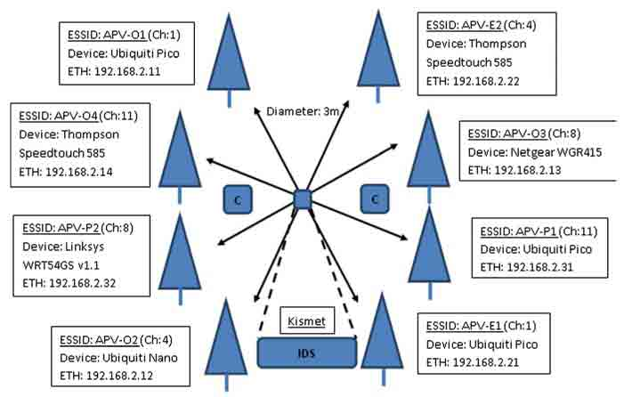

# 一种被命名为 Chameleon 的病毒可以通过 WiFi 相互之间传播

2014/02/28 11:23 | [News](http://drops.wooyun.org/author/news "由 News 发布") | [业界资讯](http://drops.wooyun.org/category/news "查看 业界资讯 中的全部文章") | 占个座先 | 捐赠作者


你知道计算机病毒可以直接在 WiFi 之间传播吗，在英国利物浦大学的安全研究人员已经证明了这种 WiFi 病毒，可以像人类感冒一样在计算机网络之间传播。

这种病毒是找到热点的固件漏洞，然后替换成病毒版本的固件，然后通过无线网络感染其他存在固件漏洞的热点。

Chameleon 病毒能够在 WiFi 当中自我繁殖并且不影响热点的正常运行。

此病毒能够识别无密码的 WiFi，然后进行尝试入侵，最有可能在咖啡厅或者机场提供开放式 WiFi 的地方进行传播。

具体工作流程如下：

```
1\. 检测附近的所有 WiFi 信号。
2\. 绕过 WiFi 加密密码。
3\. 绕过密码进入管理员界面。
4\. 识别系统设置。
5\. 替换固件为价值病毒的固件。
6\. 导入原来的系统设置。
7\. 开始传播，并回到流程 1。 
```

在贝尔法斯特与伦敦做了此项实验。

这项实验报告发表在此处：[`jis.eurasipjournals.com/content/pdf/1687-417X-2013-2.pdf`](http://jis.eurasipjournals.com/content/pdf/1687-417X-2013-2.pdf)



版权声明：未经授权禁止转载 [News](http://drops.wooyun.org/author/news "由 News 发布")@[乌云知识库](http://drops.wooyun.org)

分享到：

### 相关日志

*   [从丝绸之路到安全运维（Operational Security）与风险控制（Risk Management） 上集](http://drops.wooyun.org/news/674)
*   [Wordpress 3.8.2 补丁分析 HMAC timing attack](http://drops.wooyun.org/papers/1404)
*   [CVE 2015-0235: GNU glibc gethostbyname 缓冲区溢出漏洞](http://drops.wooyun.org/papers/4780)
*   [上传文件的陷阱](http://drops.wooyun.org/tips/2031)
*   [【.NET 小科普之一】数据库信息在哪儿](http://drops.wooyun.org/tips/975)
*   [论黑产黑阔如何安全地转移赃款/洗钱？](http://drops.wooyun.org/news/2450)