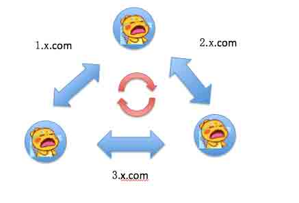

# CDN 流量放大攻击思路

2013/10/16 18:41 | [囧思九千](http://drops.wooyun.org/author/囧思九千 "由 囧思九千 发布") | [漏洞分析](http://drops.wooyun.org/category/papers "查看 漏洞分析 中的全部文章"), [运维安全](http://drops.wooyun.org/category/%e8%bf%90%e7%bb%b4%e5%ae%89%e5%85%a8 "查看 运维安全 中的全部文章") | 占个座先 | 捐赠作者

## 0x00 背景

* * *

大家好，我们是[OpenCDN 团队](http://ocdn.me)，专注于 CDN 技术的开发和研究。

首先，为了对 CDN 进行攻击，我们必须清楚 CDN 的工作原理，这里我们再来简单介绍一下 CDN 的工作模型。


CDN 的全称是 Content Delivery Network（内容分发网络），通过在网络各处的加速节点服务器来为网站抵挡恶意流量，把正常流量进行转发。用简单点的话来说，CDN 一般有三个作用

```
1\. 跨运营商加速：我们自己的网站常常只属于一个运营商(比如：电信)，而加速节点遍布每家运营商，于是和网站不同运营商（比如：联通）的用户访问起来就不会那么慢了。
2\. 缓存加速：很多的静态资源以及一部分页面更新都是比较慢的（比如首页），这个时候 CDN 就会根据浏览器的 max-age 和 last-modified 值以及管理员的预设值来进行缓存，于是很多流量 CDN 节点就不会每次都来向网站请求，CDN 节点可以直接自作主张地将命中的缓存内容返回。  
3\. 恶意流量过滤：这是 CDN 非常重要的一个作用，也是很多网站会用 CDN 的原因，因为 CDN 能为我们抵挡攻击大流量攻击、普通的攻击（比如注入等），只有正常流量才会转发给网站。 
```

这里还要说明几个名词：

```
源站：我们自己的那个网站就被称为是源站。 
反向代理：CDN 节点向源站请求数据的方式就叫反向代理，也就是上文所说的转发。 
回源：CDN 节点向源站请求数据的行为就叫做回源。 
```

## 0x01 探究之旅

* * *

我们在做 OpenCDN 测试的时候，遇到了一些小问题。发现一个没有人访问的网站居然会有流量，并且有着惊人的访问次数。


我们的 OpenCDN 有 2 分钟一次的反向代理检测，但是这次数加起来也就区区的 720 次，而这 400 万的访问次数是哪里冒出来的？然后我们查看了日志，发现单个域名的日志到达了 58G 之多，而将其打开之后发现 X-Forwarded-For 字段中（X-Forwarded-For 机制是通过一层代理后记录一个 IP，让源站在使用 CDN 后能够获得真实的访客 IP 而不是 CDN 节点 IP）充斥着大量有的 IP，而且都是本服务器 IP。我们瞬间明白了什么，然后去管理端上验证了一下，果不其然地，我们一不小心把源站 IP 设成了 CDN 节点的 IP，不过当时我们并没有发现。于是这么大的流量也好解释了，由于 2 分钟一次的检测触发 CDN 节点的回源，而这个站点的源站是 CDN 节点本身，于是 CDN 就开始不断自身反向代理死循环，这样一个请求就被无限地放大了。当超时或者 HEADER 太大（就是 X-Forwarded-For 字段导致 HEADER 溢出）的时候，请求会被丢弃。

```
把站点的源站 IP 设为 CDN 节点本身，能够让 CDN 节点进行自我的反向代理死循环，然后放大流量。 
```

貌似有点意思，小伙伴们于是马上就行动起来了，进行了实验。

我们在安全宝上成功地将源站 IP 设置成了某个为我们加速的 CDN 节点 IP，然后在美帝的一台小 vps 上开 webbench 用 2000 个线程去打这个这个站点（无论是哪个 CDN 节点收到请求，请求最终都会汇聚到那个无辜的被设源站的 CDN 节点），不过实验结果并不理想，节点没有宕机，通过 IP 反查找到一台和我们公用一个 CDN 节点的网站，通过这个 CDN 节点反向代理访问那个网站，出现了卡顿和打不开情况，仅此而已。由于没法采集到安全宝的这个节点的性能数据，我们也没法对我们的攻击做出评估。而且我们这个实验缺少了一个对照组，到底是因为死循环把流量放大导致 CDN 节点卡顿，还是这个 2000 线程本身就能把 CDN 节点打卡。

于是我们总结了一下，猜想这种节点反向代理自身的攻击手法可能可以适用于这样的场景

```
你想要攻击某个 CDN 节点，但是如果打 404 页面消耗不了太多，而如果打 CDN 中的某个站点，因为流量会穿透过去，可能还没有把 CDN 节点打掉，背后的站点早被穿透死了。这个时候，如果让节点进行自身反向代理死循环，他就会把所有的流量给吃进去，并且没法吐出来，这个时候可以产生一定量的流量杠杆效应，可以使得 CDN 节点出现异常。 
```

不过话说回来，这种攻击的防御方式也异常简单，只要在设置源站 IP 的时候，不让设置 CDN 节点 IP 就行了，只要在网站前端交互输入的时候加点验证就行了。

我们考虑到我们没法对不是我们的 CDN 节点的带宽上限，性能上限有个很好的评估，黑盒式的摸索可能带来不了什么，于是我们拿我们自己的 CDN 节点开刀。

同时我们继续对这个思路进行探索。我们发现，既然一个节点能死循环，那两个节点怎么样？结果是肯定的，并且产生了质的变化。我们假设了这样的一个场景

```
我们的 opencdn.cc 在甲 CDN 服务商注册服务，并且在乙 CDN 服务商注册服务，然后我们得到甲 CDN 服务商的一个 CDN 加速节点 1.1.1.1，然后又得到乙 CDN 服务商的一个 CDN 加速节点 2.2.2.2。 然后聪明的你一定已经猜到了。我们把在甲 CDN 服务商设置源站为乙的加速节点 2.2.2.2，在乙 CDN 服务商设置源站为甲的加速节点 1.1.1.1，然后甲会问乙去索取源站，乙又来问甲索取源站，于是 1.1.1.1 和 2.2.2.2 就很开心地并且不停地交流了起来~ 
```


于是我们也进行了实验。这次我们采用 POST 包进行测试。


用 POST 包的原因有两个

```
1.CDN 节点是会有缓存机制的，刚刚你请求的地址命中缓存，那么就直接返回，不会成为死循环了，而 POST 包则有一个很好的特性，绝对回源，一点也不含糊。
2.POST 包可以扩大体积，在同等连接数的情况下让效应更加明显。 
```

我们本次测试发送 500 个 POST 包，每个体积大概为 10k 左右。然后总共发送的流量为 5M。

然后让我们来看下两个节点的反应


不过似乎到了带宽上限。因为我们手中的机器毕竟也不是很给力。

然后让我们来看下这 500 个 POST 包产生的效果

```
58.215.139.124
RX bytes:5473847154 (5.0 GiB) TX bytes:17106340685 (15.9 GiB)
RX bytes:6014294496 (5.6 GiB) TX bytes:17717990777 (16.5 GiB)
流入 540447342(515MB) 流出 611650092(583MB)
112.65.231.233
RX bytes:5583125549 (5.1 GiB) TX bytes:5022744608 (4.6 GiB)
RX bytes:6133578284 (5.7 GiB) TX bytes:5649798353 (5.2 GiB)
流入 550452735(524MB) 流出 627053745(598MB) 
```

我们拿最小的进行测算吧，大概把流量扩大了 100 倍左右，然后如果把流入流出加起来就是扩大了 200 倍左右。

这一种攻击方式和前一种相比有两个优点

```
1.CDN 服务商不能把源站 IP 做限制来防御，因为他无法知道别家的 CDN 节点 IP。
2.能借刀杀人，可以用一家 CDN 服务商的 CDN 节点来打另外一家 CDN 服务商。 
```

然后我们还进行了一些联想，一个站点可以把两个节点陷入死循环，如果把更多的节点来进来呢？

我们可以这样。让多个 CDN 节点和一个 CDN 节点死循环，把中间的 CDN 节点带宽耗尽。


我们还可以这样。让三个 CDN 节点死循环，如果有做流量上的流入流出探测限制，这样能保证流入流出不为一个 IP。



毕竟在 CDN 服务商添加一个域名的代价是很小的（免费），我们可以用一个一个域名将节点串起来，然后啪一下开始流量死循环震荡。

好了，让我们用四个字总结一下这次的漏洞的特点：借力打力。

## 0x02 防御方法

* * *

那么如何来防御这种以及可能演化出来的攻击呢？

```
1\. 禁止把源站 IP 设为 CDN 节点本身（这是必须的）。
2\. 限制每个站点的带宽。  
3\. 对请求超时的源站做一定限制。  
4\. 通过 X-Forwarded-For 来进行限制，超过多少层自动丢弃。 
```

以及 CDN 节点已经存在的一系列的软硬防都可以让一部分的攻击流量无法成型，自然也无法形成死循环震荡。

本文仅为一种 CDN 流量放大攻击的思路，只是做过一些小规模的实验，也欢迎大牛们进行验证。如有不足之处或者逻辑上的错误还请提出，谢谢您的阅读。

by OpenCDN 成员 [囧思八千](http://weibo.com/jelope) [Twwy.net](http://twwy.net)

版权声明：未经授权禁止转载 [囧思九千](http://drops.wooyun.org/author/囧思九千 "由 囧思九千 发布")@[乌云知识库](http://drops.wooyun.org)

分享到：

### 相关日志

*   [某 EXCEL 漏洞样本 shellcode 分析](http://drops.wooyun.org/papers/4339)
*   [NTP 反射型 DDos 攻击 FAQ/补遗](http://drops.wooyun.org/papers/955)
*   [Google DNS 劫持背后的技术分析](http://drops.wooyun.org/papers/1207)
*   [IIS7.5 安全配置研究](http://drops.wooyun.org/papers/1019)
*   [关于 OpenSSL“心脏出血”漏洞的分析](http://drops.wooyun.org/papers/1381)
*   [Openssl 多个安全补丁简易分析危害及修复方案](http://drops.wooyun.org/papers/2185)