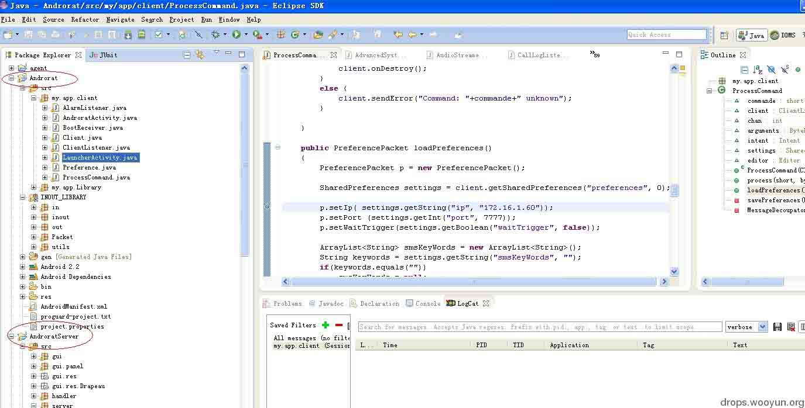
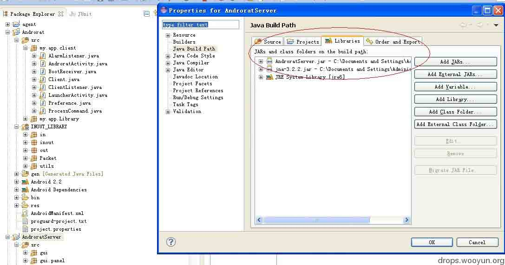
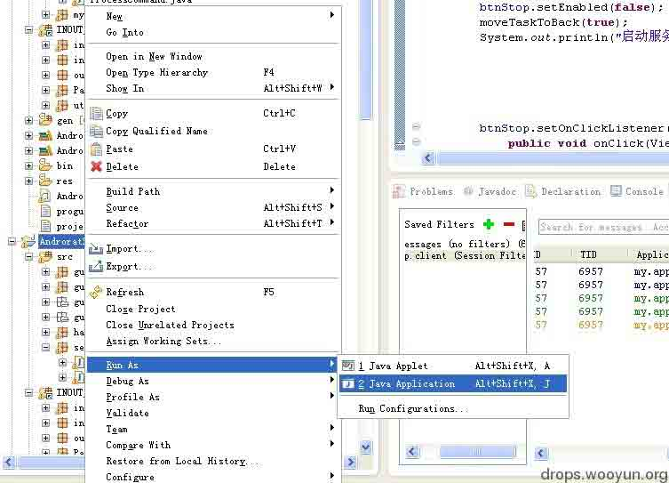
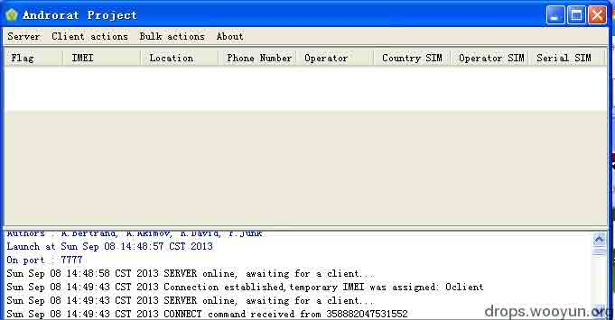
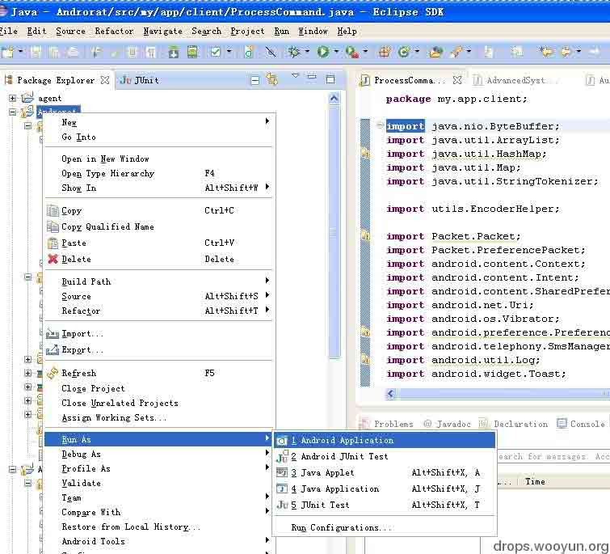
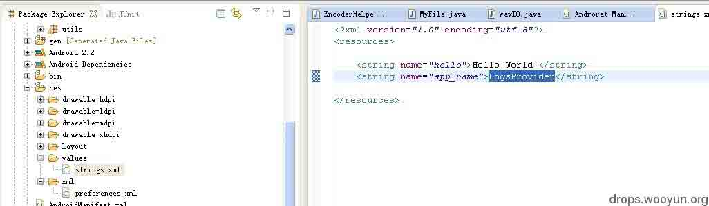
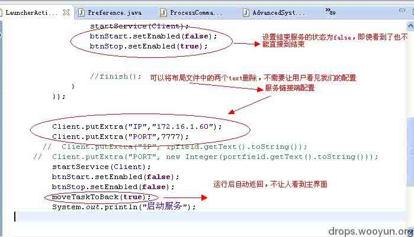
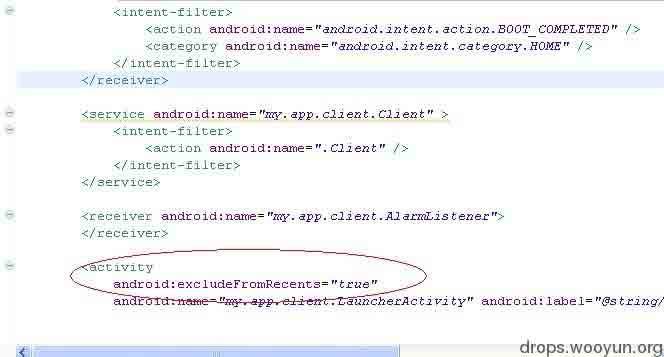
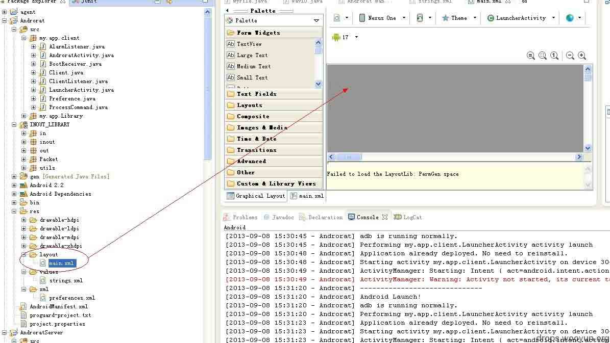
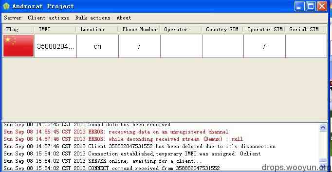

# 如何玩转 andriod 远控（androrat）

2013/09/09 13:47 | [╰╃清風](http://drops.wooyun.org/author/╰╃清風 "由 ╰╃清風 发布") | [技术分享](http://drops.wooyun.org/category/tips "查看 技术分享 中的全部文章"), [移动安全](http://drops.wooyun.org/category/mobile "查看 移动安全 中的全部文章") | 占个座先 | 捐赠作者

[关于 WebView 中接口隐患与手机挂马利用](http://drops.wooyun.org/papers/548)的引深

看我是怎样改造 Android 远程控制工具 AndroRat

```
1.修改布局界面
2.配置默认远程 ip 和端口
3.LauncherActivity 修改为运行后自动开启服务并自动返回到主界面
4.修改 xml 让程序不显示在最新使用的程序 
```

## 0x00 搭建 andriod 环境

* * *

对于小白来说，首先需要的开发环境是必须

```
1.eclipse
2.jdk
3.sdk 
```

安装配置好后就将我们的 AndroRat 工程导入 eclipse 中

导入完成后看见 2 个工程如图：



刚导入进来时肯定会编译报错，这时需将 2 个 jra 包引用进来 如图：

  

其他报错如 import 缺少对应包可到[`www.findjar.com/index.x`](http://www.findjar.com/index.x)查找并引用

编译错误解决完成后就会出现黄色感叹号，这个时候 2 个工程就可以运行了。

## 0x01 安装 androrat

* * *

先运行我们的服务端开启监听 默认 config.txt 配置端口



运行成功后出现服务端如下：



接着运行客户端，使用 usb 链接我们的手机安装 app 查看



安装好后应用列表会有一个叫 LogsProvider 的应用，可以在如下文件里修改 name



接着修改 LauncherActivity.class 代码让程序默认情动并运行后自动 black



Manifest 修改，使其不在 home 最近应用里显示



布局文件位置，可以自定义修改布局



adb 安装运行客户端后，服务端如图，-手机安装程序后会自动返回到桌面，长按 home 也看不到该程序。



此时整个程序可以使用了，功能挺多的就不列举了

## 0x02 引申思考

* * *

1.如把修改 app 写成服务，监听短信指定代码开启端口 （老外都这样干的）

2.andriod 里的 gps 功能和拍照功能有 bug 这可是两个亮点功能，擦

3.实现程序的自动编写，屏蔽扫描杀软，自我复制和感染文件（这还是留个大牛们研究）

[`url.cn/Ke7wxT`](http://url.cn/Ke7wxT)微云源码分享地址

版权声明：未经授权禁止转载 [╰╃清風](http://drops.wooyun.org/author/╰╃清風 "由 ╰╃清風 发布")@[乌云知识库](http://drops.wooyun.org)

分享到：碎银子打赏，作者好攒钱娶媳妇：


### 相关日志

*   [Android Content Provider Security](http://drops.wooyun.org/tips/4314)
*   [Android Activtity Security](http://drops.wooyun.org/tips/3936)
*   [Android Broadcast Security](http://drops.wooyun.org/tips/4393)
*   [Android App Injection&&Drozer; Use](http://drops.wooyun.org/tips/2997)
*   [Android UXSS 阶段性小结及自动化测试](http://drops.wooyun.org/tools/3186)
*   [一只 android 短信控制马的简单分析](http://drops.wooyun.org/papers/3030)