# 逆向基础（三）

2014/05/15 17:23 | [Reverse Engineering](http://drops.wooyun.org/author/reverse-engineering "由 Reverse Engineering 发布") | [二进制安全](http://drops.wooyun.org/category/binary "查看 二进制安全 中的全部文章"), [技术分享](http://drops.wooyun.org/category/tips "查看 技术分享 中的全部文章") | 占个座先 | 捐赠作者

## CHAPER7

* * *

## 访问传递参数

现在我们来看函数调用者通过栈把参数传递到被调用函数。被调用函数是如何访问这些参数呢？

```
#include <stdio.h>
int f (int a, int b, int c)
{
        return a*b+c;
};
int main() 
{
        printf ("%d
", f(1, 2, 3));
        return 0; 
};

```

## 7.1 X86

### 7.1.1 MSVC

如下为相应的反汇编代码（MSVC 2010 Express）

Listing 7.2 MSVC 2010 Express

```
_TEXT   SEGMENT
_a$ = 8                                  ; size = 4
_b$ = 12                                 ; size = 4
_c$ = 16                                 ; size = 4
_f      PROC
        push ebp
        mov ebp, esp
        mov eax, DWORD PTR _a$[ebp]
        imul eax, DWORD PTR _b$[ebp]
        add eax, DWORD PTR _c$[ebp]
        pop ebp
        ret 0
_f      ENDP

_main   PROC
        push ebp
        mov ebp, esp
        push 3 ; 3rd argument
        push 2 ; 2nd argument
        push 1 ; 1st argument
        call _f
        add esp, 12
        push eax
        push OFFSET $SG2463 ; ’%d’, 0aH, 00H
        call _printf
        add esp, 8
        ; return 0
        xor eax, eax
        pop ebp
        ret 0
_main ENDP

```

我们可以看到函数 main()中 3 个数字被圧栈，然后函数 f(int, int, int)被调用。函数 f()内部访问参数时使用了像 _ a$=8 的宏，同样，在函数内部访问局部变量也使用了类似的形式，不同的是访问参数时偏移值（为正值）。因此 EBP 寄存器的值加上宏 _a$的值指向压栈参数。

`_a$[ebp]`的值被存储在寄存器 eax 中，IMUL 指令执行后，eax 的值为 eax 与`_b$[ebp]`的乘积，然后 eax 与`_c$[ebp]`的值相加并将和放入 eax 寄存器中,之后返回 eax 的值。返回值作为 printf()的参数。

### 7.1.2 MSVC+OllyDbg

我们在 OllyDbg 中观察，跟踪到函数 f()使用第一个参数的位置，可以看到寄存器 EBP 指向栈底，图中使用红色箭头标识。栈帧中第一个被保存的是 EBP 的值，第二个是返回地址（RA），第三个是参数 1，接下来是参数 2，以此类推。因此，当我们访问第一个参数时 EBP 应该加 8（2 个 32-bit 字节宽度）。

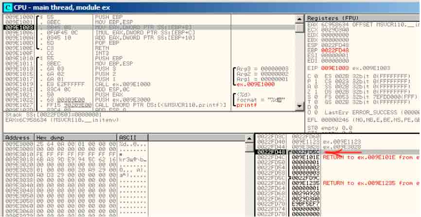

Figure 7.1: OllyDbg: 函数 f()内部

### 7.1.3 GCC

使用 GCC4.4.1 编译后在 IDA 中查看

Listing 7.3: GCC 4.4.1

```
            public f
f           proc near

arg_0       = dword ptr 8
arg_4       = dword ptr 0Ch
arg_8       = dword ptr 10h

            push    ebp
            mov     ebp, esp
            mov     eax, [ebp+arg_0]  ; 1st argument
            imul    eax, [ebp+arg_4]  ; 2nd argument
            add     eax, [ebp+arg_8]  ; 3rd argument
            pop     ebp
            retn
f           endp

            public main
main        proc near

var_10      = dword ptr -10h
var_C       = dword ptr -0Ch
var_8       = dword ptr -8

            push    ebp
            mov     ebp, esp
            and     esp, 0FFFFFFF0h
            sub     esp, 10h
            mov     [esp+10h+var_8], 3  ; 3rd argument
            mov     [esp+10h+var_C], 2  ; 2nd argument
            mov     [esp+10h+var_10], 1  ; 1st argument
            call    f
            mov     edx, offset aD ; "%d
"
            mov     [esp+10h+var_C], eax
            mov     [esp+10h+var_10], edx
            call    _printf
            mov     eax, 0
            leave
            retn
main    endp

```

几乎相同的结果。

执行两个函数后栈指针 ESP 并没有显示恢复，因为倒数第二个指令 LEAVE（B.6.2）会自动恢复栈指针。

## 7.2 X64

x86-64 架构下有点不同，函数参数（4 或 6）使用寄存器传递，被调用函数通过访问寄存器来访问传递进来的参数。

### 7.2.1 MSVC

MSVC 优化后：

Listing 7.4: MSVC 2012 /Ox x64

```
$SG2997     DB      ’%d’, 0aH, 00H

main        PROC
            sub     rsp, 40
            mov     edx, 2
            lea     r8d, QWORD PTR [rdx+1]  ; R8D=3
            lea     ecx, QWORD PTR [rdx-1]  ; ECX=1
            call    f
            lea     rcx, OFFSET FLAT:$SG2997  ; ’%d’
            mov     edx, eax
            call    printf
            xor     eax, eax
            add     rsp, 40
            ret     0
main        ENDP

f           PROC
            ; ECX - 1st argument
            ; EDX - 2nd argument
            ; R8D - 3rd argument
            imul    ecx, edx
            lea     eax, DWORD PTR [r8+rcx]
            ret     0
f           ENDP

```

我们可以看到函数 f()直接使用寄存器来操作参数，LEA 指令用来做加法，编译器认为使用 LEA 比使用 ADD 指令要更快。在 mian()中也使用了 LEA 指令，编译器认为使用 LEA 比使用 MOV 指令效率更高。

我们来看看 MSVC 没有优化的情况：

Listing 7.5: MSVC 2012 x64

```
f           proc near

; shadow space:
arg_0       = dword ptr 8
arg_8       = dword ptr 10h
arg_10      = dword ptr 18h

            ; ECX - 1st argument
            ; EDX - 2nd argument
            ; R8D - 3rd argument
            mov     [rsp+arg_10], r8d
            mov     [rsp+arg_8], edx
            mov     [rsp+arg_0], ecx
            mov     eax, [rsp+arg_0]
            imul    eax, [rsp+arg_8]
            add     eax, [rsp+arg_10]
            retn
f endp

main        proc    near
            sub     rsp, 28h
            mov     r8d, 3 ; 3rd argument
            mov     edx, 2 ; 2nd argument
            mov     ecx, 1 ; 1st argument
            call    f
            mov     edx, eax
            lea     rcx, $SG2931 ; "%d
"
            call    printf

            ; return 0
            xor     eax, eax
            add     rsp, 28h
            retn
main        endp

```

这里从寄存器传递进来的 3 个参数因为某种情况又被保存到栈里。这就是所谓的“shadow space”2：每个 Win64 通常（不是必需）会保存所有 4 个寄存器的值。这样做由两个原因：1）为输入参数分配所有寄存器（即使是 4 个）太浪费，所以要通过堆栈来访问；2）每次中断下来调试器总是能够定位函数参数 3。

调用者负责在栈中分配“shadow space”。

### 7.2.2 GCC

GCC 优化后的代码：

Listing 7.6: GCC 4.4.6 -O3 x64

```
f:
        ; EDI - 1st argument
        ; ESI - 2nd argument
        ; EDX - 3rd argument
        imul    esi, edi
        lea     eax, [rdx+rsi]
        ret

main:
        sub     rsp, 8
        mov     edx, 3
        mov     esi, 2
        mov     edi, 1
        call    f
        mov     edi, OFFSET FLAT:.LC0 ; "%d
"
        mov     esi, eax
        xor     eax, eax ; number of vector registers passed
        call    printf
        xor     eax, eax
        add     rsp, 8
        ret

```

GCC 无优化代码：

Listing 7.7: GCC 4.4.6 x64

```
f:
        ; EDI - 1st argument
        ; ESI - 2nd argument
        ; EDX - 3rd argument
        push    rbp
        mov     rbp, rsp
        mov     DWORD PTR [rbp-4], edi
        mov     DWORD PTR [rbp-8], esi
        mov     DWORD PTR [rbp-12], edx
        mov     eax, DWORD PTR [rbp-4]
        imul    eax, DWORD PTR [rbp-8]
        add     eax, DWORD PTR [rbp-12]
        leave
        ret

main:
        push    rbp
        mov     rbp, rsp
        mov     edx, 3
        mov     esi, 2
        mov     edi, 1
        call    f
        mov     edx, eax
        mov     eax, OFFSET FLAT:.LC0 ; "%d
"
        mov     esi, edx
        mov     rdi, rax
        mov     eax, 0 ; number of vector registers passed
        call    printf
        mov     eax, 0
        leave
        ret

```

System V *NIX [21]没有“shadow space”，但被调用者可能会保存参数，这也是造成寄存器短缺的原因。

### 7.2.3 GCC: uint64_t instead int

我们例子使用的是 32 位 int，寄存器也为 32 位寄存器（前缀为 E-）。

为处理 64 位数值内部会自动调整为 64 位寄存器：

```
#include <stdio.h>
#include <stdint.h>

uint64_t f (uint64_t a, uint64_t b, uint64_t c)
{
    return a*b+c;
};
int main()
{
    printf ("%lld
", f(0x1122334455667788,0x1111111122222222,0x3333333344444444));
    return 0;
};

```

Listing 7.8: GCC 4.4.6 -O3 x64

```
f       proc near
        imul    rsi, rdi
        lea     rax, [rdx+rsi]
        retn
f       endp

main    proc near
        sub     rsp, 8
        mov     rdx, 3333333344444444h ; 3rd argument
        mov     rsi, 1111111122222222h ; 2nd argument
        mov     rdi, 1122334455667788h ; 1st argument
        call    f
        mov     edi, offset format ; "%lld
"
        mov     rsi, rax
        xor     eax, eax ; number of vector registers passed
        call    _printf
        xor     eax, eax
        add     rsp, 8
        retn
main    endp

```

代码非常相似，只是使用了 64 位寄存器（前缀为 R）。

## 7.3 ARM

### 7.3.1 未优化的 Keil + ARM mode

```
.text:000000A4 00 30 A0 E1              MOV     R3, R0
.text:000000A8 93 21 20 E0              MLA     R0, R3, R1, R2
.text:000000AC 1E FF 2F E1              BX      LR
...
.text:000000B0             main
.text:000000B0 10 40 2D E9              STMFD   SP!, {R4,LR}
.text:000000B4 03 20 A0 E3              MOV     R2, #3
.text:000000B8 02 10 A0 E3              MOV     R1, #2
.text:000000BC 01 00 A0 E3              MOV     R0, #1
.text:000000C0 F7 FF FF EB              BL      f
.text:000000C4 00 40 A0 E1              MOV     R4, R0
.text:000000C8 04 10 A0 E1              MOV     R1, R4
.text:000000CC 5A 0F 8F E2              ADR     R0, aD_0  ; "%d
"
.text:000000D0 E3 18 00 EB              BL      __2printf
.text:000000D4 00 00 A0 E3              MOV     R0, #0
.text:000000D8 10 80 BD E8              LDMFD   SP!, {R4,PC}

```

main()函数里调用了另外两个函数，3 个值被传递到 f();

正如前面提到的，ARM 通常使用前四个寄存器（R0-R4）传递前四个值。

f()函数使用了前三个寄存器（R0-R2）作为参数。

MLA (Multiply Accumulate)指令将 R3 寄存器和 R1 寄存器的值相乘，然后再将乘积与 R2 寄存器的值相加将结果存入 R0，函数返回 R0。

一条指令完成乘法和加法 4，如果不包括 SIMD 新的 FMA 指令 5，通常 x86 下没有这样的指令。

第一条指令 MOV R3,R0，看起来冗余是因为该代码是非优化的。

BX 指令返回到 LR 寄存器存储的地址，处理器根据状态模式从 Thumb 状态转换到 ARM 状态，或者反之。函数 f()可以被 ARM 代码或者 Thumb 代码调用，如果是 Thumb 代码调用 BX 将返回到调用函数并切换到 Thumb 模式，或者反之。

### 7.3.2 Optimizing Keil + ARM mode

```
.text:00000098            f
.text:00000098 91 20 20 E0                MLA R0, R1, R0, R2
.text:0000009C 1E FF 2F E1                BX  LR

```

这里 f()编译时使用完全优化模式(-O3),MOV 指令被优化，现在 MLA 使用所有输入寄存器并将结果置入 R0 寄存器。

### 7.3.3 Optimizing Keil + thumb mode

```
.text:0000005E 48 43                  MULS R0, R1
.text:00000060 80 18                  ADDS R0, R0, R2
.text:00000062 70 47                  BX   LR

```

Thumb 模式下没有 MLA 指令，编译器做了两次间接处理，MULS 指令使 R0 寄存器的值与 R1 寄存器的值相乘并将结果存入 R0。ADDS 指令将 R0 与 R2 的值相加并将结果存入 R0。

## Chapter 8

* * *

## 一个或者多个字的返回值

X86 架构下通常返回 EAX 寄存器的值，如果是单字节 char，则只使用 EAX 的低 8 位 AL。如果返回 float 类型则使用 FPU 寄存器 ST(0)。ARM 架构下通常返回寄存器 R0。

假如 main()函数的返回值是 void 而不是 int 会怎么样？

通常启动函数调用 main()为：

```
push envp
push argv
push argc
call main
push eax
call exit

```

换句话说为

```
exit(main(argc,argv,envp));

```

如果 main()声明为 void 类型并且函数没有明确返回状态值，通常在 main()结束时 EAX 寄存器的值被返回，然后作为 exit()的参数。大多数情况下函数返回的是随机值。这种情况下程序的退出代码为伪随机的。

我们看一个实例，注意 main()是 void 类型：

```
#include <stdio.h>
void main()
{
    printf ("Hello, world!
");
};

```

我们在 linux 下编译。

GCC 4.8.1 会使用 puts()替代 printf()（看前面章节 2.3.3），没有关系，因为 puts()会返回打印的字符数，就行 printf()一样。请注意，main()结束时 EAX 寄存器的值是非 0 的，这意味着 main()结束时保留 puts()返回时 EAX 的值。

Listing 8.1: GCC 4.8.1

```
.LC0:
        .string "Hello, world!"
main:
        push    ebp
        mov     ebp, esp
        and     esp, -16
        sub     esp, 16
        mov     DWORD PTR [esp], OFFSET FLAT:.LC0
        call    puts
        leave
        ret

```

我们写 bash 脚本来看退出状态：

Listing 8.2: tst.sh

```
#!/bin/sh
./hello_world
echo $?

```

运行：

```
$ tst.sh
Hello, world!
14

```

14 为打印的字符数。

回到返回值是 EAX 寄存器值的事实，这也就是为什么老的 C 编译器不能够创建返回信息无法拟合到一个寄存器（通常是 int 型）的函数。如果必须这样，应该通过指针来传递。现在可以这样，比如返回整个结构体，这种情况应该避免。如果必须要返回大的结构体，调用者必须开辟存储空间，并通过第一个参数传递指针，整个过程对程序是透明的。像手动通过第一个参数传递指针一样，只是编译器隐藏了这个过程。

小例子：

```
struct s
{
    int a;
    int b;
    int c;
};

struct s get_some_values (int a)
{
    struct s rt;
    rt.a=a+1;
    rt.b=a+2;
    rt.c=a+3;

    return rt;
};

```

…我们可以得到(MSVC 2010 /Ox):

```
$T3853 = 8                  ; size = 4
_a$ = 12                    ; size = 4
?get_some_values@@YA?AUs@@H@Z PROC      ; get_some_values
    mov     ecx, DWORD PTR _a$[esp-4]
    mov     eax, DWORD PTR $T3853[esp-4]
    lea     edx, DWORD PTR [ecx+1]
    mov     DWORD PTR [eax], edx
    lea     edx, DWORD PTR [ecx+2]
    add     ecx, 3
    mov     DWORD PTR [eax+4], edx
    mov     DWORD PTR [eax+8], ecx
    ret     0
?get_some_values@@YA?AUs@@H@Z ENDP      ; get_some_values

```

内部变量传递指针到结构体的宏为$T3853。

这个例子可以用 C99 语言扩展来重写：

```
struct s
{
    int a;
    int b;
    int c;
};

struct s get_some_values (int a)
{
    return (struct s){.a=a+1, .b=a+2, .c=a+3};
};

```

Listing 8.3: GCC 4.8.1

```
_get_some_values proc near

ptr_to_struct   = dword ptr 4
a               = dword ptr 8
                mov     edx, [esp+a]
                mov     eax, [esp+ptr_to_struct]
                lea     ecx, [edx+1]
                mov     [eax], ecx
                lea     ecx, [edx+2]
                add     edx, 3
                mov     [eax+4], ecx
                mov     [eax+8], edx
                retn
_get_some_values endp

```

我们可以看到，函数仅仅填充调用者申请的结构体空间的相应字段。因此没有性能缺陷。

## Chapter 9

* * *

## 指针

指针通常被用作函数返回值(recall scanf() case (6)).例如，当函数返回两个值时。

## 9.1 Global variables example

```
#include <stdio.h>

void f1 (int x, int y, int *sum, int *product)
{
    *sum=x+y;
    *product=x*y;
};

int sum, product;

void main()
{
    f1(123, 456, &sum, &product);
    printf ("sum=%d, product=%d
", sum, product);
};

```

编译后

Listing 9.1: Optimizing MSVC 2010 (/Ox /Ob0)

```
COMM        _product:DWORD
COMM        _sum:DWORD
$SG2803 DB              ’sum=%d, product=%d’, 0aH, 00H

_x$ = 8                                     ; size = 4
_y$ = 12                                    ; size = 4
_sum$ = 16                                  ; size = 4
_product$ = 20                              ; size = 4
_f1         PROC
            mov     ecx, DWORD PTR _y$[esp-4]
            mov     eax, DWORD PTR _x$[esp-4]
            lea     edx, DWORD PTR [eax+ecx]
            imul    eax, ecx
            mov     ecx, DWORD PTR _product$[esp-4]
            push    esi
            mov     esi, DWORD PTR _sum$[esp]
            mov     DWORD PTR [esi], edx
            mov     DWORD PTR [ecx], eax
            pop     esi
            ret     0
_f1         ENDP

_main       PROC
            push    OFFSET _product
            push    OFFSET _sum
            push    456                     ; 000001c8H
            push    123                     ; 0000007bH
            call    _f1
            mov     eax, DWORD PTR _product
            mov     ecx, DWORD PTR _sum
            push    eax
            push    ecx
            push    OFFSET $SG2803
            call    DWORD PTR __imp__printf
            add     esp, 28                 ; 0000001cH
            xor     eax, eax
            ret     0
_main   ENDP

```

让我们在 OD 中查看：图 9.1。首先全局变量地址被传递进 f1()。我们在堆栈元素点击“数据窗口跟随”，可以看到数据段上分配两个变量的空间。这些变量被置 0，因为未初始化数据（BSS1）在程序运行之前被清理为 0。这些变量属于数据段，我们按 Alt+M 可以查看内存映射 fig. 9.5.

让我们跟踪（F7）到 f1()fig. 9.2.在堆栈中为 456 (0x1C8) 和 123 (0x7B)，接着是两个全局变量的地址。

让我们跟踪到 f1()结尾，可以看到两个全局变量存放了计算结果。

现在两个全局变量的值被加载到寄存器传递给 printf(): fig. 9.4.

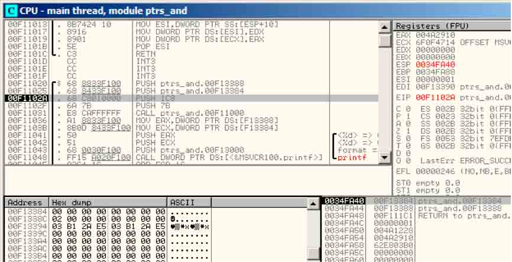

Figure 9.1: OllyDbg: 全局变量地址被传递进 f1()

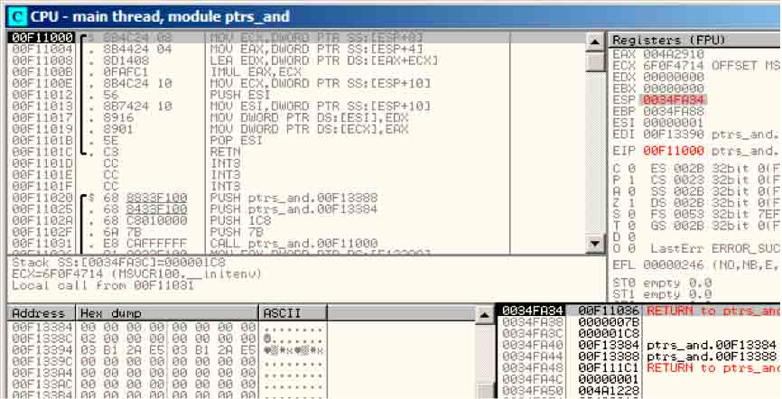

Figure 9.2: OllyDbg: f1()开始

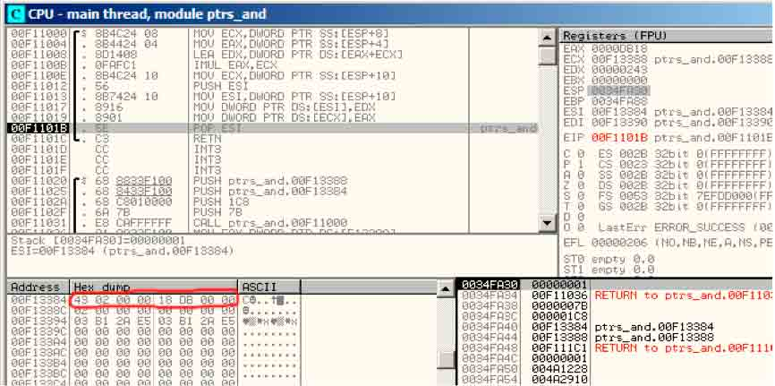

Figure 9.3: OllyDbg: f1()完成


Figure 9.4: OllyDbg: 全局变量被传递进 printf()

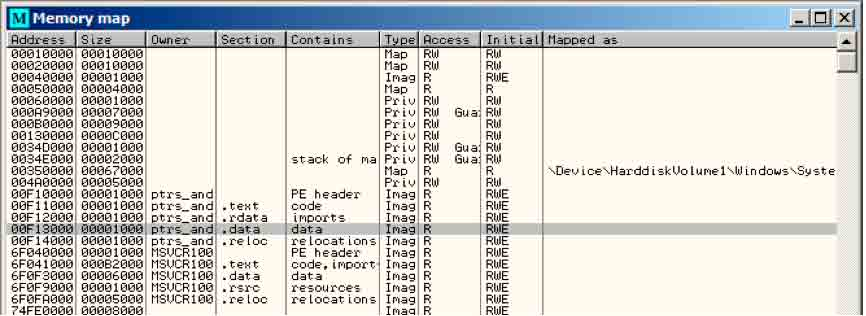

Figure 9.5: OllyDbg: memory map

## 9.2 Local variables example

让我们修改一下例子：

Listing 9.2: 局部变量

```
void main()
{
    int sum, product; // now variables are here

    f1(123, 456, &sum, &product);
    printf ("sum=%d, product=%d
", sum, product);
};

```

f1()函数代码没有改变。仅仅 main()代码作了修改。

Listing 9.3: Optimizing MSVC 2010 (/Ox /Ob0)

```
_product$ = -8              ; size = 4
_sum$ = -4                  ; size = 4
_main   PROC
; Line 10
        sub     esp, 8
; Line 13
        lea     eax, DWORD PTR _product$[esp+8]
        push    eax
        lea     ecx, DWORD PTR _sum$[esp+12]
        push    ecx
        push    456         ; 000001c8H
        push    123         ; 0000007bH
        call    _f1
; Line 14
        mov     edx, DWORD PTR _product$[esp+24]
        mov     eax, DWORD PTR _sum$[esp+24]
        push    edx
        push    eax
        push    OFFSET $SG2803
        call    DWORD PTR __imp__printf
; Line 15
        xor     eax, eax
        add     esp, 36     ; 00000024H
        ret     0

```

我们在 OD 中查看，局部变量地址在堆栈中是 0x35FCF4 和 0x35FCF8。我们可以看到是如何圧栈的 fig. 9.6.

f1()开始的时候，随机栈地址为 0x35FCF4 和 0x35FCF8 fig. 9.7.

f1()完成时结果 0xDB18 和 0x243 存放在地址 0x35FCF4 和 0x35FCF8。

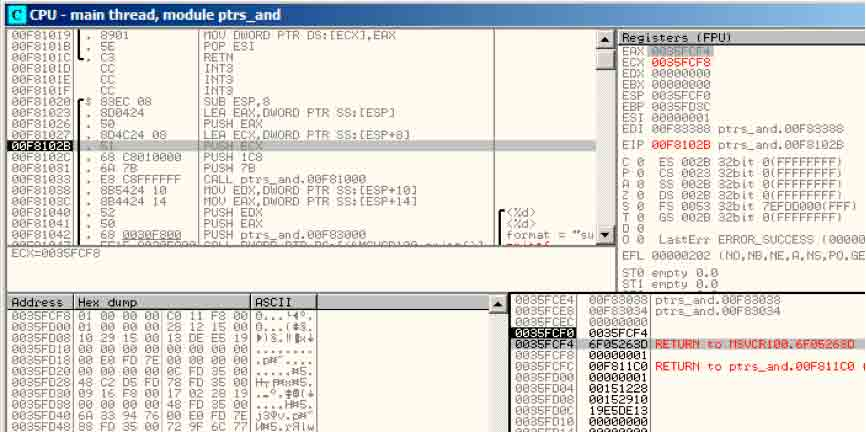

Figure 9.6: OllyDbg: 局部变量地址被圧栈


Figure 9.7: OllyDbg: f1()starting

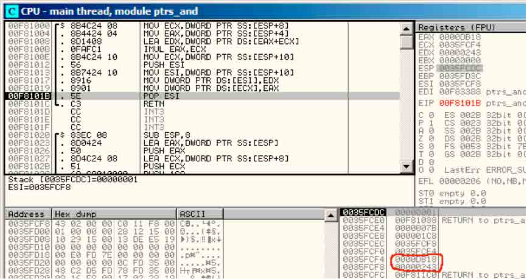

Figure 9.8: OllyDbg: f1()finished

## 9.3 小结

f1()可以返回结果到内存的任何地方，这是指针的本质和特性。顺便提一下，C++引用的工作方式和这个类似。详情阅读相关内容（33）。

## Chapter 10

* * *

## 条件跳转

现在我们来了解条件跳转。

```
#include <stdio.h>

void f_signed (int a, int b)
{
    if (a>b)
        printf ("a>b
");
    if (a==b)
        printf ("a==b
");
    if (a<b)
        printf ("a<b
");
};

void f_unsigned (unsigned int a, unsigned int b)
{
    if (a>b)
        printf ("a>b
");
    if (a==b)
        printf ("a==b
");
    if (a<b)
        printf ("a<b
");
};

int main()
{
    f_signed(1, 2);
    f_unsigned(1, 2);
    return 0;
};

```

## 10.1 x86

### 10.1.1 x86 + MSVC

f_signed() 函数:

Listing 10.1: 非优化 MSVC 2010

```
_a$ = 8
_b$ = 12
_f_signed   PROC
        push    ebp
        mov     ebp, esp
        mov     eax, DWORD PTR _a$[ebp]
        cmp     eax, DWORD PTR _b$[ebp]
        jle     SHORT $LN3@f_signed
        push    OFFSET $SG737       ; ’a>b’
        call    _printf
        add     esp, 4
$LN3@f_signed:
        mov     ecx, DWORD PTR _a$[ebp]
        cmp     ecx, DWORD PTR _b$[ebp]
        jne     SHORT $LN2@f_signed
        push    OFFSET $SG739       ; ’a==b’
        call    _printf
        add     esp, 4
$LN2@f_signed:
        mov     edx, DWORD PTR _a$[ebp]
        cmp     edx, DWORD PTR _b$[ebp]
        jge     SHORT $LN4@f_signed
        push    OFFSET $SG741       ; ’a<b’
        call    _printf
        add     esp, 4
        $LN4@f_signed:
        pop     ebp
        ret     0
_f_signed   ENDP

```

第一个指令 JLE 意味如果小于等于则跳转。换句话说，第二个操作数大于或者等于第一个操作数，控制流将传递到指定地址或者标签。否则（第二个操作数小于第一个操作数）第一个 printf()将被调用。第二个检测 JNE：如果不相等则跳转。如果两个操作数相等控制流则不变。第三个检测 JGE：大于等于跳转，当第一个操作数大于或者等于第二个操作数时跳转。如果三种情况都没有发生则无 printf()被调用，事实上，如果没有特殊干预，这种情况几乎不会发生。

f_unsigned()函数类似，只是 JBE 和 JAE 替代了 JLE 和 JGE，我们来看 f_unsigned()函数

Listing 10.2: GCC

```
_a$ = 8                                 ; size = 4
_b$ = 12                                ; size = 4
_f_unsigned     PROC
        push    ebp
        mov     ebp, esp
        mov     eax, DWORD PTR _a$[ebp]
        cmp     eax, DWORD PTR _b$[ebp]
        jbe     SHORT $LN3@f_unsigned
        push    OFFSET $SG2761 ; ’a>b’
        call    _printf
        add     esp, 4
$LN3@f_unsigned:
        mov     ecx, DWORD PTR _a$[ebp]
        cmp     ecx, DWORD PTR _b$[ebp]
        jne     SHORT $LN2@f_unsigned
        push    OFFSET $SG2763 ; ’a==b’
        call    _printf
        add     esp, 4
$LN2@f_unsigned:
        mov     edx, DWORD PTR _a$[ebp]
        cmp     edx, DWORD PTR _b$[ebp]
        jae     SHORT $LN4@f_unsigned
        push    OFFSET $SG2765 ; ’a<b’
        call    _printf
        add     esp, 4
$LN4@f_unsigned:
        pop     ebp
        ret     0
_f_unsigned     ENDP

```

几乎是相同的，不同的是：JBE-小于等于跳转和 JAE-大于等于跳转。这些指令(JA/JAE/JBE/JBE)不同于 JG/JGE/JL/JLE，它们使用无符号值。

我们也可以看到有符号值的表示(35)。因此我们看 JG/JL 代替 JA/JBE 的用法或者相反，我们几乎可以确定变量的有符号或者无符号类型。

main()函数没有什么新的内容：

Listing 10.3: main()

```
_main   PROC
        push    ebp
        mov     ebp, esp
        push    2
        push    1
        call    _f_signed
        add     esp, 8
        push    2
        push    1
        call    _f_unsigned
        add     esp, 8
        xor     eax, eax
        pop     ebp
        ret     0
_main   ENDP

```

### 10.1.2 x86 + MSVC + OllyDbg

我们在 OD 里允许例子来查看标志寄存器。我们从 f_unsigned()函数开始。CMP 执行了三次，每次的参数都相同，所以标志位也相同。

第一次比较的结果：fig. 10.1.标志位：C=1, P=1, A=1, Z=0, S=1, T=0, D=0, O=0.标志位名称为 OD 对其的简称。

当 CF=1 or ZF=1 时 JBE 将被触发，此时将跳转。

接下来的条件跳转：fig. 10.2.当 ZF=0（zero flag）时 JNZ 则被触发

第三个条件跳转：fig. 10.3.我们可以发现[14](http://static.wooyun.org/20141017/2014101711184580126_png.jpg)当 CF=0 (carry flag)时，JNB 将被触发。在该例中条件不为真，所以第三个 printf()将被执行。


Figure 10.1: OllyDbg: f_unsigned(): 第一个条件跳转


Figure 10.2: OllyDbg: f_unsigned(): 第二个条件跳转

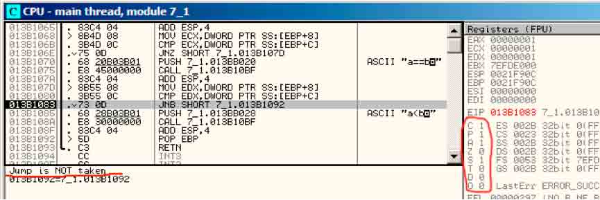

Figure 10.3: OllyDbg: f_unsigned(): 第三个条件跳转

现在我们在 OD 中看 f_signed()函数使用有符号值。

可以看到标志寄存器：C=1, P=1, A=1, Z=0, S=1, T=0, D=0, O=0.

第一种条件跳转 JLE 将被触发 fig. 10.4.我们可以发现[14](http://static.wooyun.org/20141017/2014101711184580126_png.jpg)，当 ZF=1 or SF≠OF。该例中 SF≠OF，所以跳转将被触发。

下一个条件跳转将被触发：如果 ZF=0 (zero flag): fig. 10.5.

第三个条件跳转将不会被触发，因为仅有 SF=OF，该例中不为真: fig. 10.6.

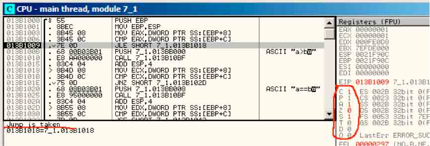

Figure 10.4: OllyDbg: f_signed(): 第一个条件跳转


Figure 10.5: OllyDbg: f_signed(): 第二个条件跳转


Figure 10.6: OllyDbg: f_signed(): 第三个条件跳转

### 10.1.3 x86 + MSVC + Hiew

我们可以修改这个可执行文件，使其无论输入的什么值 f_unsigned()函数都会打印“a==b”。

在 Hiew 中查看：fig. 10.7.

我们要完成以下 3 个任务：

```
1\. 使第一个跳转一直被触发；
2\. 使第二个跳转从不被触发；
3\. 使第三个跳转一直被触发。 
```

我们需要使代码流进入第二个 printf()，这样才一直打印“a==b”。

三个指令（或字节）应该被修改：

```
1\. 第一个跳转修改为 JMP，但跳转偏移值不变。
2\. 第二个跳转有时可能被触发，我们修改跳转偏移值为 0 后，无论何种情况，程序总是跳向下一条指令。跳转地址等于跳转偏移值加上下一条指令地址，当跳转偏移值为 0 时，跳转地址就为下一条指令地址，所以无论如何下一条指令总被执行。
3\. 第三个跳转我们也修改为 JMP，这样跳转总被触发。 
```

修改后：fig. 10.8.

如果忘了这些跳转，printf()可能会被多次调用，这种行为可能是我们不需要的。

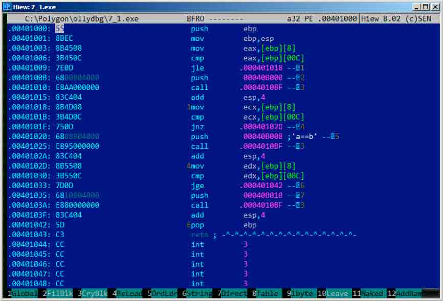

Figure 10.7: Hiew: f_unsigned() 函数

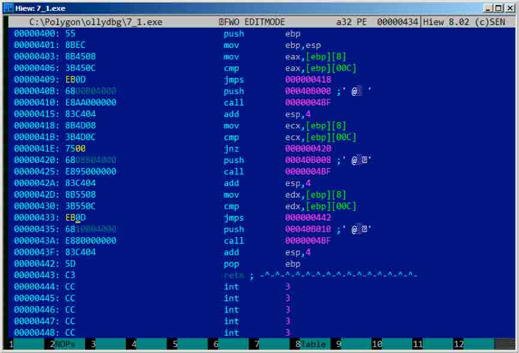

Figure 10.8: Hiew:我们修改 f_unsigned() 函数

### 10.1.4 Non-optimizing GCC

GCC 4.4.1 非优化状态产生的代码几乎一样，只是用 puts() (2.3.3) 替代 printf()。

### 10.1.5 Optimizing GCC

细心的读者可能会问，为什么要多次执行 CMP，如果标志寄存器每次都相同呢？可能 MSVC 不会做这样的优化，但是 GCC 4.8.1 可以做这样的深度优化：

Listing 10.4: GCC 4.8.1 f_signed()

```
f_signed:
        mov     eax, DWORD PTR [esp+8]
        cmp     DWORD PTR [esp+4], eax
        jg      .L6
        je      .L7
        jge     .L1
        mov     DWORD PTR [esp+4], OFFSET FLAT:.LC2 ; "a<b"
        jmp     puts
.L6:
        mov     DWORD PTR [esp+4], OFFSET FLAT:.LC0 ; "a>b"
        jmp     puts
.L1:
        rep     ret
.L7:
        mov     DWORD PTR [esp+4], OFFSET FLAT:.LC1 ; "a==b"
        jmp     puts

```

我们可以看到 JMP puts 替代了 CALL puts/RETN。稍后我们介绍这种情况 11.1.1.。

不用说，这种类型的 x86 代码是很少见的。MSVC2012 似乎不会这样做。其他情况下，汇编程序能意识到此类使用。如果你在其它地方看到此类代码，更可能是手工构造的。

f_unsigned()函数代码：

Listing 10.5: GCC 4.8.1 f_unsigned()

```
f_unsigned:
        push    esi
        push    ebx
        sub     esp, 20
        mov     esi, DWORD PTR [esp+32]
        mov     ebx, DWORD PTR [esp+36]
        cmp     esi, ebx
        ja      .L13
        cmp     esi, ebx ; instruction may be removed
        je      .L14
.L10:
        jb      .L15
        add     esp, 20
        pop     ebx
        pop     esi
        ret
.L15:
        mov     DWORD PTR [esp+32], OFFSET FLAT:.LC2 ; "a<b"
        add     esp, 20
        pop     ebx
        pop     esi
        jmp     puts
.L13:
        mov     DWORD PTR [esp], OFFSET FLAT:.LC0 ; "a>b"
        call    puts
        cmp     esi, ebx
        jne     .L10
.L14:
        mov     DWORD PTR [esp+32], OFFSET FLAT:.LC1 ; "a==b"
        add     esp, 20
        pop     ebx
        pop     esi
        jmp     puts

```

因此，GCC 4.8.1 的优化算法并不总是完美的。

## 10.2 ARM

### 10.2.1 Keil + ARM mode 优化后

Listing 10.6: Optimizing Keil + ARM mode

```
.text:000000B8                          EXPORT f_signed
.text:000000B8              f_signed                ; CODE XREF: main+C
.text:000000B8 70 40 2D E9              STMFD   SP!, {R4-R6,LR}
.text:000000BC 01 40 A0 E1              MOV     R4, R1
.text:000000C0 04 00 50 E1              CMP     R0, R4
.text:000000C4 00 50 A0 E1              MOV     R5, R0
.text:000000C8 1A 0E 8F C2              ADRGT   R0, aAB ; "a>b
"
.text:000000CC A1 18 00 CB              BLGT    __2printf
.text:000000D0 04 00 55 E1              CMP     R5, R4
.text:000000D4 67 0F 8F 02              ADREQ   R0, aAB_0 ; "a==b
"
.text:000000D8 9E 18 00 0B              BLEQ    __2printf
.text:000000DC 04 00 55 E1              CMP     R5, R4
.text:000000E0 70 80 BD A8              LDMGEFD SP!, {R4-R6,PC}
.text:000000E4 70 40 BD E8              LDMFD   SP!, {R4-R6,LR}
.text:000000E8 19 0E 8F E2              ADR     R0, aAB_1 ; "a<b
"
.text:000000EC 99 18 00 EA              B       __2printf
.text:000000EC              ; End of function f_signed

```

ARM 下很多指令只有某些标志位被设置时才会被执行。比如做数值比较时。

举个例子，ADD 实施上是 ADDAL，这里的 AL 是 Always，即总被执行。判定谓词是 32 位 ARM 指令的高 4 位（条件域）。无条件跳转的 B 指令其实是有条件的，就行其它任何条件跳转一样，只是条件域为 AL，这意味着总是被执行，忽略标志位。

ADRGT 指令就像和 ADR 一样，只是该指令前面为 CMP 指令，并且只有前面数值大于另一个数值时（Greater Than）时才被执行。

接下来的 BLGT 行为和 BL 一样，只有比较结果符合条件才能出发（Greater Than）。ADRGT 把字符串“a>b
”的地址写入 R0，然后 BLGT 调用 printf()。因此，这些指令都带有 GT 后缀，只有当 R0（a 值）大于 R4（b 值）时指令才会被执行。

然后我们看 ADREQ 和 BLEQ，这些指令动作和 ADR 及 BL 一样，只有当两个操作数对比后相等时才会被执行。这些指令前面是 CMP（因为 printf()调用可能会修改状态标识）。 然后我们看 LDMGEFD，该指令行为和 LDMFD 指令一样 1，仅仅当第一个值大于等于另一个值时（Greater Than），指令才会被执行。

“LDMGEFD SP!, {R4-R6,PC}”恢复寄存器并返回，只是当 a>=b 时才被触发，这样之后函数才执行完成。但是如果 a<b，触发条件不成立是将执行下一条指令 LDMFD SP!, {R4-R6,LR}，该指令保存 R4-R6 寄存器，使用 LR 而不是 PC，函数并不返回。最后两条指令是执行 printf()（5.3.2）。

f_unsigned 与此一样只是使用对应的指令为 ADRHI, BLHI 及 LDMCSFD，判断谓词（HI = Unsigned higher, CS = Carry Set (greater than or equal)）请类比之前的说明，另外就是函数内部使用无符号数值。

我们来看一下 main()函数：

Listing 10.7: main()

```
.text:00000128                              EXPORT main
.text:00000128          main
.text:00000128 10 40 2D E9                  STMFD SP!, {R4,LR}
.text:0000012C 02 10 A0 E3                  MOV R1, #2
.text:00000130 01 00 A0 E3                  MOV R0, #1
.text:00000134 DF FF FF EB                  BL f_signed
.text:00000138 02 10 A0 E3                  MOV R1, #2
.text:0000013C 01 00 A0 E3                  MOV R0, #1
.text:00000140 EA FF FF EB                  BL f_unsigned
.text:00000144 00 00 A0 E3                  MOV R0, #0
.text:00000148 10 80 BD E8                  LDMFD SP!, {R4,PC}
.text:00000148          ; End of function main

```

这就是 ARM 模式如何避免使用条件跳转。

这样做有什么好处呢？因为 ARM 使用精简指令集（RISC）。简言之，处理器流水线技术受到跳转的影响，这也是分支预测重要的原因。程序使用的条件或者无条件跳转越少越好，使用断言指令可以减少条件跳转的使用次数。

x86 没有这也的功能，通过使用 CMP 设置相应的标志位来触发指令。

### 10.2.2 Optimizing Keil + thumb mode

Listing 10.8: Optimizing Keil + thumb mode

```
.text:00000072      f_signed                        ; CODE XREF: main+6
.text:00000072 70 B5                PUSH    {R4-R6,LR}
.text:00000074 0C 00                MOVS    R4, R1
.text:00000076 05 00                MOVS    R5, R0
.text:00000078 A0 42                CMP     R0, R4
.text:0000007A 02 DD                BLE     loc_82
.text:0000007C A4 A0                ADR     R0, aAB         ; "a>b
"
.text:0000007E 06 F0 B7 F8          BL      __2printf
.text:00000082
.text:00000082      loc_82                      ; CODE XREF: f_signed+8
.text:00000082 A5 42                CMP     R5, R4
.text:00000084 02 D1                BNE     loc_8C
.text:00000086 A4 A0                ADR     R0, aAB_0   ; "a==b
"
.text:00000088 06 F0 B2 F8          BL      __2printf
.text:0000008C
.text:0000008C      loc_8C                      ; CODE XREF: f_signed+12
.text:0000008C A5 42                CMP     R5, R4
.text:0000008E 02 DA                BGE     locret_96
.text:00000090 A3 A0                ADR     R0, aAB_1   ; "a<b
"
.text:00000092 06 F0 AD F8          BL      __2printf
.text:00000096
.text:00000096      locret_96                   ; CODE XREF: f_signed+1C
.text:00000096 70 BD                POP     {R4-R6,PC}
.text:00000096      ; End of function f_signed

```

仅仅 Thumb 模式下的 B 指令可能需要条件代码辅助，所以 thumb 代码看起来更普通一些。

BLE 通常是条件跳转小于或等于（Less than or Equal），BNE—不等于（Not Equal），BGE—大于或等于（Greater than or Equal）。

f_unsigned 函数是同样的，只是使用的指令用来处理无符号数值：BLS (Unsigned lower or same) 和 BCS (Carry Set (Greater than or equal)).

版权声明：未经授权禁止转载 [Reverse Engineering](http://drops.wooyun.org/author/reverse-engineering "由 Reverse Engineering 发布")@[乌云知识库](http://drops.wooyun.org)

分享到：

### 相关日志

*   [逆向基础（十二）](http://drops.wooyun.org/tips/3167)
*   [逆向基础（六）](http://drops.wooyun.org/tips/2177)
*   [逆向基础（四）](http://drops.wooyun.org/tips/2046)
*   [逆向基础（二）](http://drops.wooyun.org/tips/1931)
*   [逆向基础（八）](http://drops.wooyun.org/tips/2451)
*   [逆向基础（五）](http://drops.wooyun.org/tips/2112)