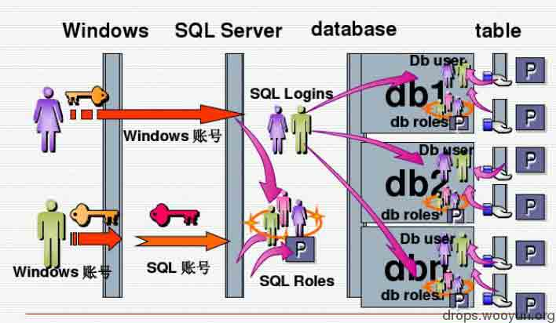

# SQL SERVER 2008 安全配置

2014/05/10 16:43 | [zhangsan](http://drops.wooyun.org/author/zhangsan "由 zhangsan 发布") | [技术分享](http://drops.wooyun.org/category/tips "查看 技术分享 中的全部文章"), [运维安全](http://drops.wooyun.org/category/%e8%bf%90%e7%bb%b4%e5%ae%89%e5%85%a8 "查看 运维安全 中的全部文章") | 占个座先 | 捐赠作者

## 0x00 sql server 2008 权限介绍

* * *

在访问 sql server 2008 的过程中，大致验证流程如下图：



当登录操作一个数据库的时候，会经过三次验证：

```
1\. 操作系统的验证
2\. SQL SERVER 登录名的验证
3\. 数据库用户名的验证 
```

当使用 windows 身份认证模式的时候，使用的 windows 账号会通过操作系统的验证，然后以 sysadmin 的服务器角色通过 SQL SERVER 的验证，在访问一个具体的数据库的时候又以其映射的 dbo 用户名登录相应的数据库。

当使用 SQL SERVER 身份认证模式的时候，首先会使用类似于 IIS 中的匿名账号来通过 windows 验证，然后以其对应的服务器角色来通过 SQL SERVER 的验证，在访问一个具体数据库的时候以其映射的数据库用户名来登录相应的数据库。

操作系统层面：在 windows 方式验证的过程中，由所使用的 windows 账号。使用 sql 账号验证的时候，应该是使用了一个类似于 iis 中的匿名账号来通过 windows 验证的。

**SQL SERVER 层面：**由 sql server 的登录用户的权限来控制，具体的权限由对应的**服务器角色**来决定。

(SA 是 SQL SERVER 的一个登录用户名，而不是数据库的用户名)

数据库层面：由数据库的用户名的权限来控制，具体可以通过选择不同的数据库角色或者自定义权限来实现。

（SQL SERVER 的登录用户名 SA 通过映射数据库的用户名来访问数据库内容 ）

所以在 SQL SERVER 中，对权限起决定性作用的就是服务器登录名角色和数据库用户名角色。

## 0x01 sql server 2008 服务器角色及数据库角色

* * *

固定服务器角色

（登录 SQL SERVER 登录用户的权限角色，如 SA 默认拥有 sysadmin 角色权限）

```
Dbcreator：这个服务器角色的成员可以创建、更改、删除和还原任何数据库。
Diskadmin：这个服务器角色用于管理磁盘文件，比如镜像数据库和添加备份设备。Processadmin：SQL Server 2008 能够多任务化，也就是说可以通过执行多个进程做多个事件。
Securityadmin：这个服务器角色的成员将管理登录名及其属性。他们可以授权、拒绝和撤销服务器级权限。也可以授权、拒绝和撤销数据库级权限。另外，它们可以重置 SQL Server 2008 登录名的密码。
Serveradmin：这个服务器角色的成员可以更改服务器范围的配置选项和关闭服务器。Setupadmin：为需要管理链接服务器和控制启动的存储过程的用户而设计。这个角色的成员能添加到 setupadmin，能增加、删除和配置链接服务器，并能控制启动过程。
Sysadmin：这个服务器角色的成员有权在 SQL Server 2008 中执行任何任务。
Public: 有两大特点，第一，初始状态时没有权限；第二，所有的数据库用户都是它的成员。
固定数据库角色：
（数据库用户权限）
微软提供了 9 个内置的角色，以便于在数据库级别授予用户特殊的权限集合。
db_owner: 该角色的用户可以在数据库中执行任何操作。
db_accessadmin: 该角色的成员可以从数据库中增加或者删除用户。
db_backupopperator: 该角色的成员允许备份数据库。
db_datareader: 该角色的成员允许从任何表读取任何数据。
db_datawriter: 该角色的成员允许往任何表写入数据。
db_ddladmin：该角色的成员允许在数据库中增加、修改或者删除任何对象（即可以执行任何 DDL 语句）。
db_denydatareader: 该角色的成员被拒绝查看数据库中的任何数据，但是他们仍然可以通过存储过程来查看。
db_denydatawriter: 像 db_denydatareader 角色，该角色的成员被拒绝修改数据库中的任何数据，但是他们仍然可以通过存储过程来修改。
db_securityadmin: 该角色的成员可以更改数据库中的权限和角色。
public：在 SQL Server 2008 中每个数据库用户都属于 public 数据库角色。当尚未对某个用户授予或者拒绝对安全对象的特定权限时，这该用户将据称授予该安全对象的 public 角色的权限，这个数据库角色不能被删除。 
```

## 0x02 安全配置方案

* * *

### 1\. 限制可以访问数据库的 IP

一般可以通过安全策略里面的 ipsec 或者 windows 防火墙来限制。

### 2\. 修改数据库的访问端口

可以在 SQL SERVER 配置管理器修改访问端口为不常见端口来防止一般性扫描

### 3\. 修改日志审核策略

将登录审核修改为“开启登录成功和失败的日志”，这样方便数据库被入侵之后，对日志的查看。

### 4\. 对 SA 账户的处理

如使用混合身份验证模式，建议禁用掉 SA 账户，否则设置非常强的 SA 密码。

### 5\. 网站使用的数据库账号

对于每一个网站新建一个登陆用户并关联一个数据库用户，设置强密码，给予服务器角色为：PUBLIC，给予对应的数据库角色为：db_owner（需更加安全的保护对应数据库的数据需要调节更加严格的权限，此处给予的为此数据库的最高权限，若此账号泄露，此数据库中的数据不保，配合后续配置不影响服务器安全）

### 6\. 数据库服务运行账号

数据库需要往磁盘写文件，或者通过存储过程执行命令的权限由数据库服务器的运行账户权限决定，使用 NETWORK SERVICE 账户来运行数据库服务器是较安全的。

### 7\. 磁盘权限的合理配置

合理配置数据库运行，账户在磁盘上的权限，一定不要随意给写权限，特别是网站目录及数据库存储目录以外的位置，这样即使是 SA 也不能往磁盘写文件。

### 8\. 危险存储过程的处理

由于在 sql server 2008 中 sp_dropextendedproc 不能删除系统扩展存储过程，所以直接禁用常见危险存储过程。具体可根据实际情况来操作，因为有些存储过程是正常需要的。对于一般账户而言，根本没有执行这些高危存储过程的权限，而对于 SA 账户来说，以上所有的操作都是可恢复的，个人觉得 SA 账户被入侵之后的关键控制点在于合理配置数据库服务运行账号的权限。

## 0x03 常见入侵分析及防御

* * *

### 1\. 数据库 0day

zhangsan 认为，升级吧！

### 2\. 网站被入侵获取到普通服务器权限的账号

如果网站被入侵（类似 SQL 注入），很显然其对应的账号的数据库的数据肯定是不保了。普通账号（只给 PUBLIC 的账户）是无法执行系统命令的，可能的方式是通过备份数据库来达到写马的操作，防御的最好方法是严格控制数据库运行账号对磁盘的写权限

### 3\. SA 账户被入侵

SA 账户被入侵后，一般会通过开启 xp_cmdshell 存储过程来执行系统命令。但是如果配置的数据库服务运行账号 NETWORK SERVICE，它能够执行的系统命令也就有限了，甚至可以取消 NETWORK SERVICE 对于 cmd.exe 的执行权限。还有就是需要合理配置 NETWORK SERVICE 的磁盘写入权限。

## 0x04 常见操作介绍

* * *

### 1\. 开启 xp_cmdshell

```
EXEC sp_configure 'show advanced options', 1;
go
RECONFIGURE;
GO
EXEC sp_configure 'xp_cmdshell', 1;
go
RECONFIGURE;
GO 
```

### 2\. 使用 xp_cmdshell 执行系统命令的操作

```
exec xp_cmdshell 'whoami' 
```

（如果该存储过程可以执行说明可能已经被入侵）

### 3\. 高危存储过程处理

常见危险存储过程：

```
xp_cmdshell
xp_delete_file
xp_regread
xp_regwrite
xp_dirtree 
```

由于在 sql server 2008 中 sp_dropextendedproc 不会删除系统扩展存储过程，故直接禁用即可

```
EXEC sp_configure 'show advanced options', 0;
EXEC sp_configure 'xp_cmdshell', 0; 
```

求指正，求指教！

版权声明：未经授权禁止转载 [zhangsan](http://drops.wooyun.org/author/zhangsan "由 zhangsan 发布")@[乌云知识库](http://drops.wooyun.org)

分享到：

### 相关日志

*   [IIS7.5 安全配置研究](http://drops.wooyun.org/papers/1019)
*   [Oracle 安全配置](http://drops.wooyun.org/%e8%bf%90%e7%bb%b4%e5%ae%89%e5%85%a8/2547)
*   [False SQL Injection and Advanced Blind SQL Injection](http://drops.wooyun.org/tips/4322)
*   [DNS 域传送信息泄露](http://drops.wooyun.org/papers/64)
*   [DNS 泛解析与内容投毒，XSS 漏洞以及证书验证的那些事](http://drops.wooyun.org/tips/1354)
*   [metasploit 渗透测试笔记(内网渗透篇)](http://drops.wooyun.org/tips/2746)