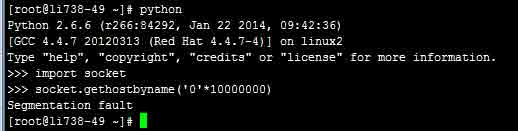
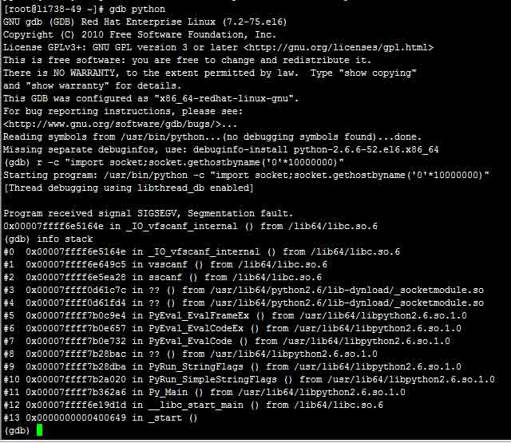
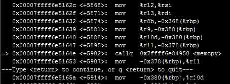
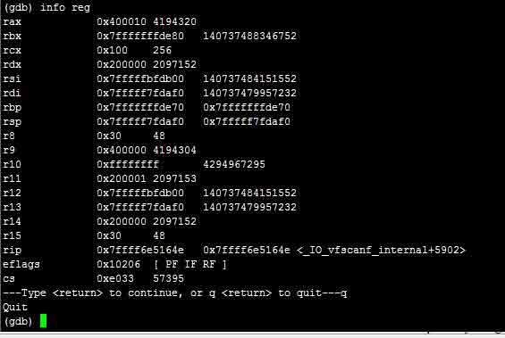
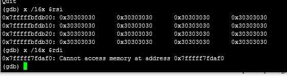
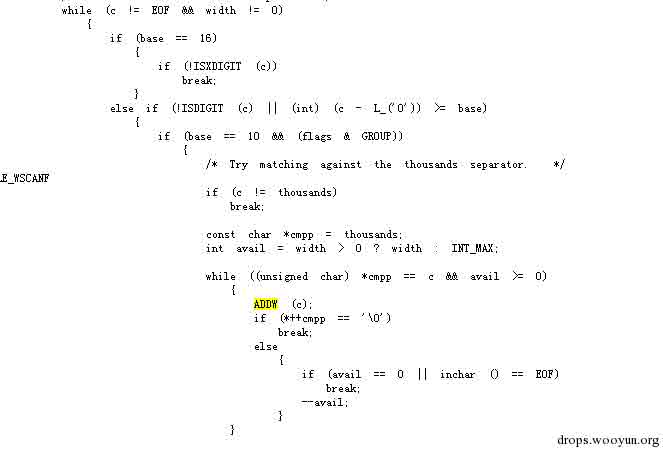
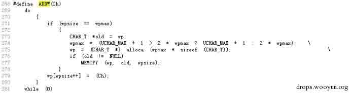
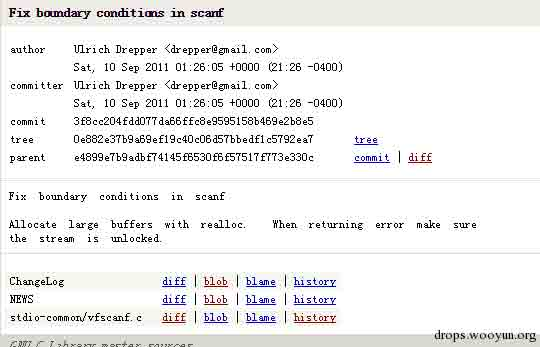
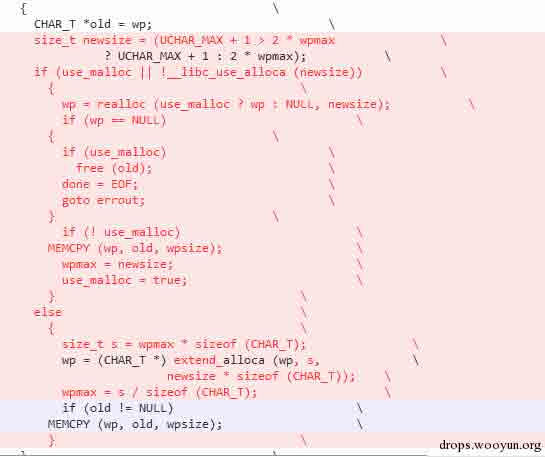

# 由 Ghost 漏洞引发的“血案”

2015/02/03 22:18 | [阿里云安全](http://drops.wooyun.org/author/阿里云安全 "由 阿里云安全 发布") | [二进制安全](http://drops.wooyun.org/category/binary "查看 二进制安全 中的全部文章"), [漏洞分析](http://drops.wooyun.org/category/papers "查看 漏洞分析 中的全部文章") | 占个座先 | 捐赠作者

## 0x00 背景

* * *

最近某安全公司发现的 glibc gethostbyname buffer overflow 漏洞，该漏洞被命名为 ghost，其原因是 glibc 的 Gethostbyname 函数在处理传入的畸形域名信息作解析时导致堆溢出，众多网络应用依赖 glibc 模块的将受到影响，现已经确认受影响的版本是 glibc 2.2<=version<=2.17，但是在我们的安全研究人员在测试时触发了另一个有意思的格式串漏洞，让我们来看看具体过程。

## 0x01 分析细节

* * *

测试环境 ubuntu glibc 2.12 python 2.6.6

当我们的研究人员在执行 python 如下代码时发现程序崩溃

```
import socket
socket.gethostbyname('0'*10000000)

```




让我们看看漏洞触发流程，上 gdb 看看



通过查看异常信息点发现，异常发生在如下代码处



在 memcpy 函数进行内存拷贝时出错



通过分析发现，rdx 是拷贝长度，rsi 是源缓冲区，rdi 是目的缓冲区，通过分析发现 rsi 是我们传入的数据，而 rdi 这个地址不能访问，所以 memcpy 函数进行拷贝操作时将会出现写入目的地址空间失败，通过分析发现这个地址未初始化，最终导致程序 crash.



我们通过分析发现 python 语句

```
Import socket
Socket.gethostbyname(‘0’*10000000)

```

将会调用 sscanf 格式转换字符串’0’*10000000 成整形数据“%d.%d.%d.%d”，我们通过分析 glibc 里面的源代码 stdio-common/vfscanf.c 发现，将会如下处理



关键问题发生在宏 ADDW，如下代码是 glibc 2.12



这里代码的作用是把我们传入的字串循环拷贝到栈上面去，alloca 函数是开辟栈空间，我们知道默认情况下 Linux 的栈空间是 8MB，当我们传入的参数超长时，会导致栈空间耗尽，导致内存写上溢，当我们写入不可预知的未映射的内存时导致程序崩溃. 通过搜索发现这个格式串漏洞在 2.15 版被修复



补丁代码如下:



补丁代码的处理逻辑是把传入的数据复制到堆内存里面去而不是在栈空间里面。 https://sourceware.org/bugzilla/show_bug.cgi?id=13138

## 0x02 漏洞利用

* * *

该格式串漏洞很难利用，拷贝到的目的地址不可预测并且很难控制。

## 0x03 结论 & 引用

* * *

该漏洞会造成远程 crash，赶紧升级 glibc 吧。

感谢阿里安全研究团队和漏洞分析团队的努力

引用:

https://sourceware.org/git/?p=glibc.git;a=commit;f=stdio-common/vfscanf.c;h=3f8cc204fdd077da66ffc8e9595158b469e2b8e5

https://sourceware.org/git/?p=glibc.git;a=blob;f=stdio-common/vfscanf.c;h=7356eeb3626665a0524bbf1be37398ea22e05d7e;hb=6164128f1ca84eea240b66f977054e16b94b3c86

http://seclists.org/fulldisclosure/2015/Jan/111

source:http://blog.sina.com.cn/s/blog_e8e60bc00102vhz7.html

版权声明：未经授权禁止转载 [阿里云安全](http://drops.wooyun.org/author/阿里云安全 "由 阿里云安全 发布")@[乌云知识库](http://drops.wooyun.org)

分享到：

### 相关日志

*   [64 位 Linux 下的栈溢出](http://drops.wooyun.org/tips/2288)
*   [CVE-2014-4113 漏洞利用过程分析](http://drops.wooyun.org/papers/3331)
*   [Easy RM to MP3 Converter(2.7.3.700)栈溢出漏洞调试笔记](http://drops.wooyun.org/papers/3178)
*   [uctf-杂项题目分析](http://drops.wooyun.org/tips/3349)
*   [做个试验：简单的缓冲区溢出](http://drops.wooyun.org/papers/1421)
*   [MS15-002 telnet 服务缓冲区溢出漏洞分析与 POC 构造](http://drops.wooyun.org/papers/4621)