# Linux 下基于内存分析的 Rootkit 检测方法

2015/01/23 9:52 | 路人甲 | [技术分享](http://drops.wooyun.org/category/tips "查看 技术分享 中的全部文章") | 占个座先 | 捐赠作者

## 0x00 引言

* * *

某 Linux 服务器发现异常现象如下图，确定被植入 Rootkit，但运维人员使用常规 Rootkit 检测方法无效，对此情况我们还可以做什么？

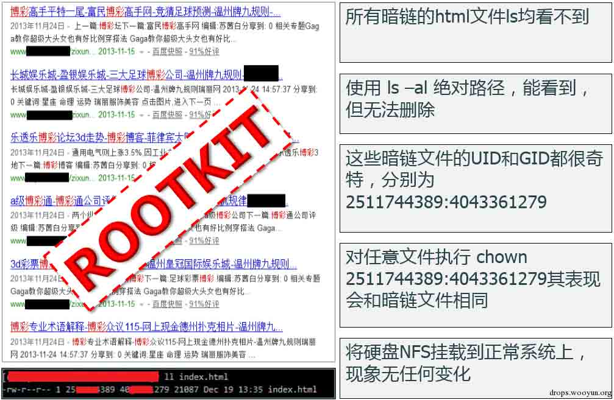

图 1 被植入 Rootkit 的 Linux 服务器

所有暗链的 html 文件 ls 均看不到。

使用 ls -al 绝对路径，能看到，但无法删除。

这些暗链的 uid 和 gid 都很奇特 分别为 2511744398:4043361279 。

对任意文件执行 chown 2511744398:4043361279 其表现会和暗链文件相同。

将硬盘 nfs 挂载到正常系统上，现象无任何变化。

## 0x01 Rootkit 实现方式和检测方法

* * *

一般来说，Rootkit 检测方式有以下几种：

```
1.  可信任 Shell——使用静态编译的二进制文件：lsof、stat、strace、last、……
2.  检测工具和脚本：rkhunter, chkrootkit, OSSEC
3.  LiveCD——DEFT、Second Look、 Helix
4.  动态分析和调试：使用 gdb 根据 System.map 和 vmlinuz image 分析/proc/kcore
5.  直接调试裸设备：debugFS 
```

在分析这几种检测方法的优劣之前，我们先通过图 2 了解一下 Linux Rootkit 的一般实现原理

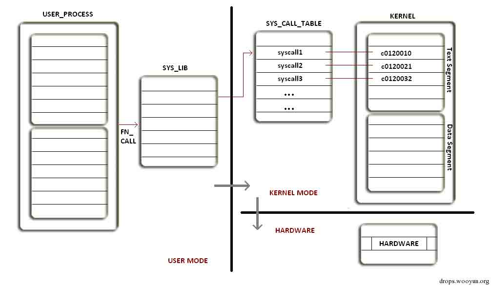

图 2 Linux 中系统命令执行的一般流程

在 Ring3 层（用户空间）工作的系统命令/应用程序实现某些基础功能时会调用系统.so 文件注 1。而这些.so 文件实现的基本功能，如文件读写则是通过读取 Ring0 层（内核空间）的 Syscall Table 注 2(系统调用表)中相应 Syscall(系统调用)作用到硬件，最终完成文件读写的。

那么如果中了 Rootkit，这个流程会发生什么变化呢？下面通过图 3 来了解一下。

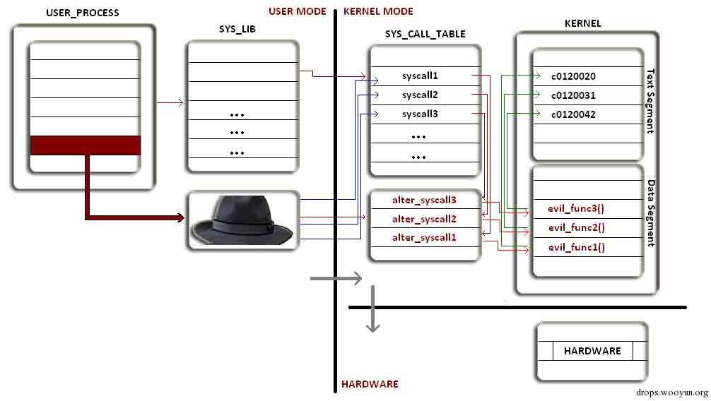

图 3 Rootkit 的一般执行流程

Rootkit 篡改了 Syscall Table 中 Syscall 的内存地址，导致程序读取修改过的 Syscall 地址而执行了恶意的函数从而实现其特殊功能和目的。

上图仅仅是列举了一种典型的 Rootkit 工作流程，通过修改程序读取 Syscall 的不同环节可以产生不同类型的 Rootkit，我们简单罗列一下。

Rootkit 部分实现方式：

```
1.  拦截中断-重定向 sys_call_table，修改 IDT
2.  劫持系统调用-修改 sys_call_table
3.  inline hook-修改 sys_call，插入 jmp 指令 
```

这部分不是本文的重点，不再赘述。了解了 Rootkit 实现原理，我们再回过来对比一下常规 Rootkit 检测方式的优劣。

对于使用静态编译的二进制文件的检测方式，如果 Rootkit 修改了 Syscall，那么这种方法产生的输出也是不可靠的，我们无法看到任何被 Rootkit 隐藏的东西。

那么如果使用 Rootkit 检测工具呢，我们简单分析一下 rkhunter 的检测原理。

在 rkhunter 脚本文件中，scanrootkit 函数部分代码如下：

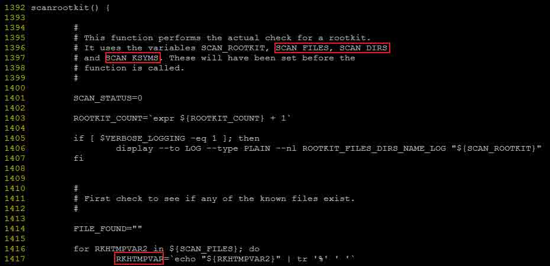

图 4 rkhunter 中的 scanrootkit 函数

注：其安装脚本中定义了以下两个变量

```
RKHTMPVAR="${RKHINST_SIG_DIR}"
RKHINST_SIG_DIR="${RKHINST_DB_DIR}/signatures"

```

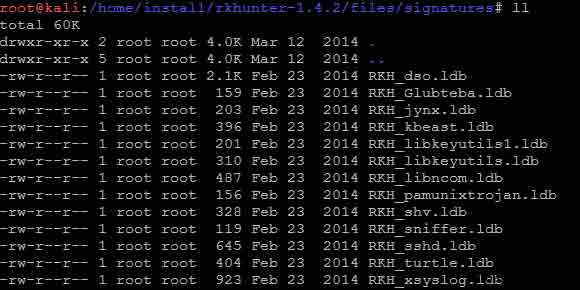

图 5 Signatures 目录中的文件列表——Rootkit 签名列表

从上面这段代码我们可以看出 rkhunter 扫描 Rootkit 调用了 3 个重要的变量：SCAN_FILES, SCAN_DIRS，SCAN_KSYMS，用于每种 Rootkit 的检查。

下面的四幅图分别是 Adore 和 KBeast 两个 Rootkit 检测的具体代码。

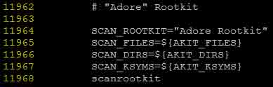

图 6 rkhunter 中经典 Rootkit Adore 的检测流程

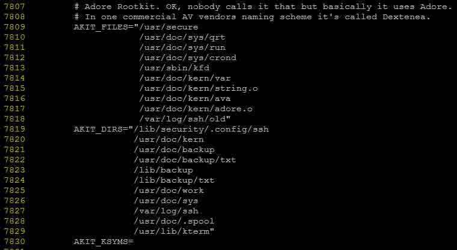

图 7 rkhunter 中检测 Adore 的文件和目录的清单

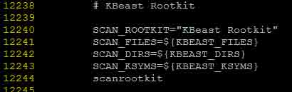

图 8 rkhunter 中 Rootkit KBeast 的检测流程

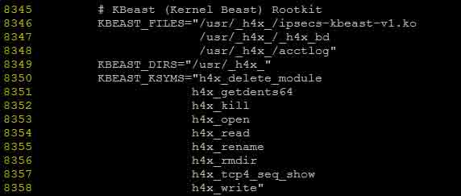

图 9 rkhunter 中检测 KBeast 的文件和目录的清单

根据以上分析，我们可以看出 rkhunter 仅仅是检查已知 Rootkit 组件默认安装路径上是否存在相应文件，并比对文件签名（signature）。这种检测方式显然过于粗糙，对修改过的/新的 Rootkit 基本无能为力。

而另一款流行的 Rootkit 检测工具 chkrootkit，其 LKM Rootkit 检测模块源文件为 chkproc.c，最后更新日期为 2006.1.11 日。检测原理与 rkhunter 大致相似，也主要基于签名检测并将 ps 命令的输出同/proc 目录作比对。在它的 FAQ 中 Q2 的回答也印证了我们的结论。

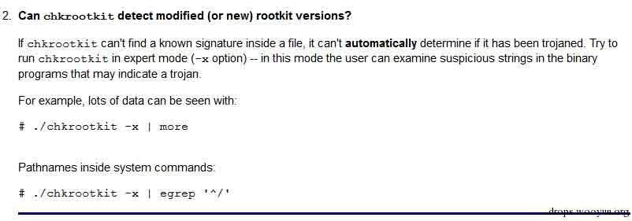

图 10 chkrootkit 的 FAQ 之 Q2

分析了常见的 Rootkit 检测工具的实现原理，我们再看一下使用 LiveCD 检测这种方式有哪些局限性。

使用 LiveCD 意味着使用一纯净的光盘操作系统挂载原有存储对可疑文件做静态分析/逆向，以便了解 Rootkit 执行逻辑，依赖的 so/ko 文件有哪些，加载的配置文件是什么。那么，如果事先没有找到一些 Rootkit 的相关文件，直接对整个文件系统做逐一排查，无疑是一个繁冗的过程。而且，这种方式的使用前提是应急响应人员必须能物理接触服务器，这对托管在机房的环境很不方便。实际上，使用 LiveCD 在 Rootkit 清除或司法取证环节上更为常见，而不是其前置环节。

根据以上分析，我们简单总结一下 Rootkit 检测方式的效果，见下表.

Rootkit 检测方式对比

| 检测方式 | 局限/缺陷 |
| --- | --- |
| 使用静态编译的二进制文件 | 工作在用户空间，对 Ring0 层的 Rootkit 无效。 |
| 工具 rkhunter,chkrootkit | 扫描已知 Rootkit 特征，比对文件指纹，检查/proc/modules，效果极为有限。 |
| LiveCD:DEFT | Rootkit 活动进程和网络连接等无法看到，只能静态分析。 |
| GDB 动态分析调试 | 调试分析/proc/kcore，门槛略高，较复杂。不适合应急响应。 |
| DebugFS 裸设备直接读写 | 不依赖内核模块，繁琐复杂，仅适合实验室分析。 |

既然常规的 Rootkit 检测方法有这样那样的缺陷，那有没有更好的检测方式呢?

下面我们详细介绍一下基于内存分析 Rootkit 检测方法。

## 0x02 基于内存检测和分析 Rootkit

* * *

Rootkit 难以被检测，主要是因为其高度的隐匿特性，一般表现在进程、端口、内核模块和文件等方面的隐藏。但无论怎样隐藏，内存中一定有这些方面的蛛丝马迹，如果我们能正常 dump 物理内存，并通过 debug symbols.和 kernel`s data structure 来解析内存文件，那么就可以对系统当时的活动状态有一个真实的“描绘”，再将其和直接在系统执行命令输出的“虚假”结果做对比，找出可疑的方面。下面简述一下部分原理。

## 1\. 基于内存分析检测进程

* * *

在 Linux 系统中查看进程一般执行的是 ps –aux 命令，其实质是通过读取/proc/pid/来获取进程信息的。而在内核的 task_struct 注 3(进程结构体)中，也同样包含进程 pid、 创建时间、映像路径等信息。也就是说每个进程的相关信息都可以通过其对应 task_struct 内存地址获取。而且，每个 task_struct 通过 next_task 和 prev_task 串起成为一个双向链表，可通过 for_each_task 宏来遍历进程。基于这个原理我们可以先找到 PID 为 0 的 init_task symobol（祖先进程）的内存地址，再进行遍历就能模拟出 ps 的效果。部分细节可参考下图。

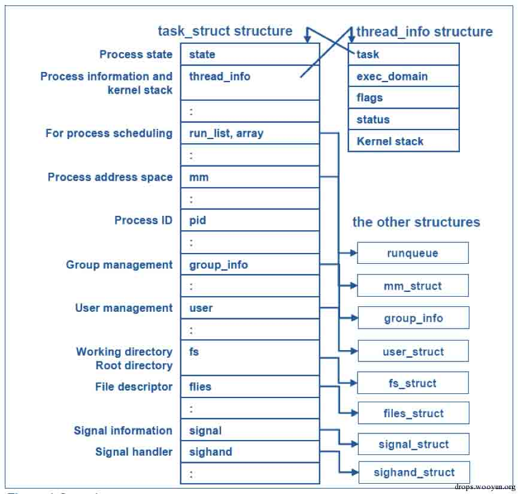

图 11 内核中的 task_struct

此外，Linux 内核中有一个东西叫 PID Hash Chain，如图 12 所示，它是一个指针数组,每个元素指向一组 pid 的 task_struct 链表中的元素 ，能够让内核快速的根据 pid 找到对应的进程。所以分析 pid_hash 也能用来检测隐藏进程和获取相应进程信息,并且效率更高。

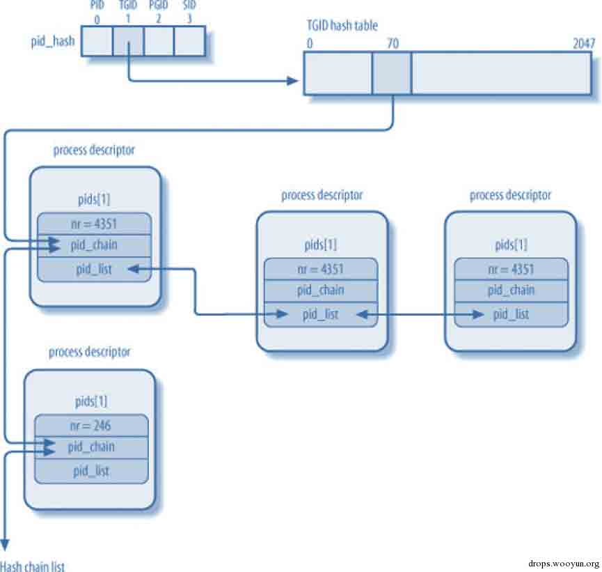

图 12 内核中的 PID Hash Chain

## 2\. 基于内存分析 Process Memory Maps（进程映射）

* * *

在 task_struct 中，mm_struct 注 4 描述了一个进程的整个虚拟地址空间，进程映射主要存储在一个 vm_area_struct 的结构变量 mm_rb 注 5 和 mmap 中，大致结构如下图所示

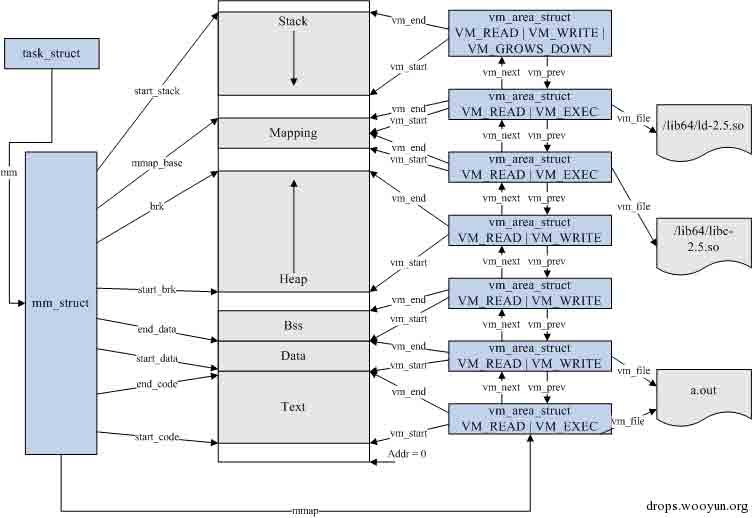

图 13 mm_struct(内存描述符)的结构

每一个 vm_area_struct 节点详细记录了 VMA（virtual memory area）的相关属性，比如 vm_start（起始地址）、vm_end（结束地址）、vm_flags（访问权限）以及对应的 vm_file（映射文件）。从内存中我们得到信息就相当于获得了/proc/ <pid>/maps 的内容。</pid>

## 3\. 基于内存分析检测网络连接和打开的文件(lsof)

* * *

Linux 中的 lsof（List Open Files）实质是读取/proc/pid/文件夹中的信息。而这些信息通过 task_struct 也能获取。

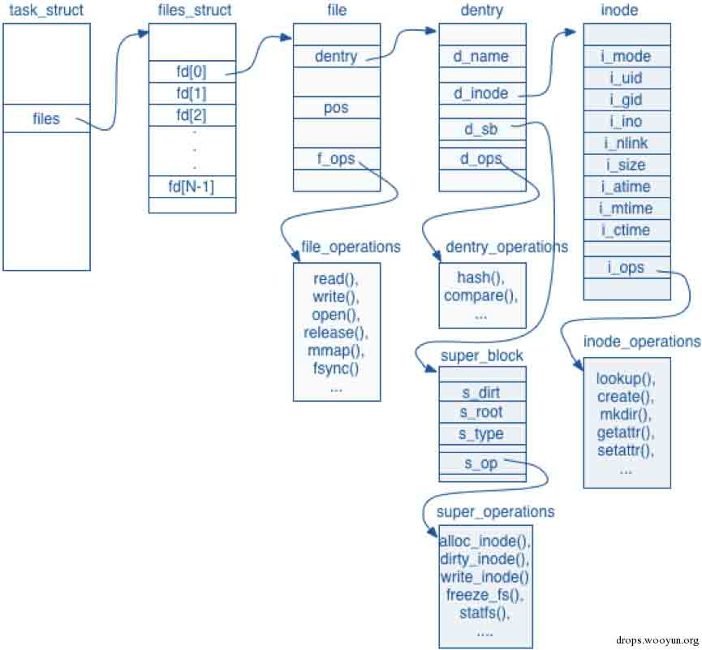

图 14 内核中的 task_struct 细节

task_struct 的 structure（数据结构）中 files 指向 files_struct(文件结构体),用于表示当前进程打开的文件表。其 structure 中有一个 fd_array(文件描述符数组)，数组中的每个元素 fd（File Descriptor 文件描述符），都代表一个进程打开的文件。而每个 File Descriptor 的 structure 中又包含了目录项 dentry，文件操作 f_ops 等等。这些足以让我们找到每个进程打开的文件。

另，当某个文件的 f_op structure 成员是 socket_file_ops 或者其 dentry.d_op 为 sockfs_dentry_operations 时，则可以将其转为为相应的 inet_sock structure，最终得到相应的网络信息。

## 4\. 基于内存分析检测 bash_history

* * *

后渗透测试阶段，攻击者常使用 history –c 命令来清空未保存进.bash_history 文件的命令历史。而在 Rootkit 中，通过配置 HISTSIZE = 0 或将 HISTFILE = /dev/null 也是一种常见的隐藏命令历史的方法。对于后者，由于 bash 进程的 history 也记录在相应的 MMAP 中（其对应的宏定义为 HISTORY_USE_MMAP 注 6），通过 history_list()函数相应的 mmap 数据也可以还原其历史记录。

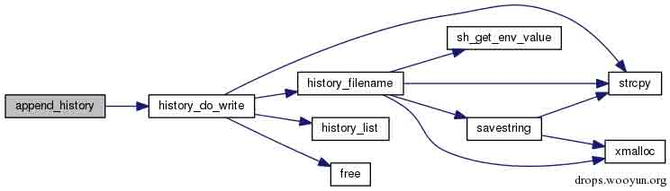

图 15 bash 4.0 源码 histfile.c 文件中 history_do_write 函数功能图示.

## 5\. 基于内存分析检测内核模块

* * *

通过遍历 module list 上所有的 struct module 来检查 Rootkit 是一种代替 lsmod 命令的的方法。但是如果 Rootkit 把自己的 LKM 从 module list 摘除，但仍加载在内存中，这种方法就不起作用了。

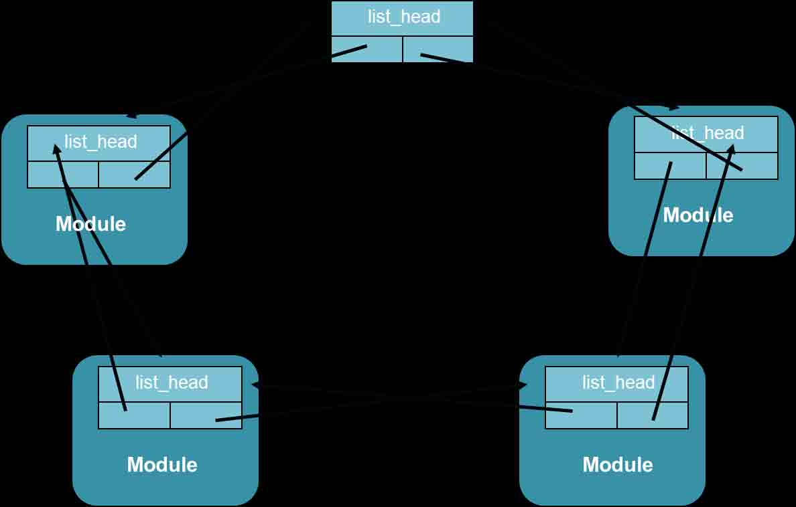

图 16 内核中 Kernel Module List

不过，Rootkit 很难在/sys/module/目录中隐藏，所以我们仍可通过遍历 Sysfs 文件系统来检查隐藏的内核模块。

## 6\. 基于内存分析检测 process credentials

* * *

在 2.6.29 内核的以前版本，Rootkit 可以将用户态的进程通过设置其 effective user ID 和 effective group ID 为 0（root）进行特权提升。而在后面的版本中，kernel 引入了'cred' structure。为此，Rootkit 与时俱进，通过设置同某个 root 权限进程一样的'cred' structure 来应对这种改进。所以通过检查所有进程的'cred' structure 能更好的发现活动的 Rootkit。

## 7\. 基于内存分析检测 Rootkit 的流程

* * *

限于篇幅，本文不再介绍更多的原理和细节，简单总结一下这种方法的的大致流程。

```
1 制作目标 Linux 服务器的 profile 
2 Dump 完整的物理内存 
3 使用 profile 解析内存映像文件，输出系统信息 
```

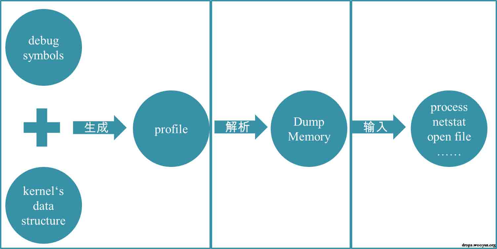

图 17 基于内存分析检测 Rootkit 原理示意图

## 0x03 总结与实践

* * *

基于内存分析检测 Rootkit 的方法比对常规的检测方法有较大的优势，但它不是万能的，如果被 Bootkit 之类的高级 Rootkit 干扰，Dump 的物理内存不正确或不完整，后面的步骤就是空中阁楼。另外也要确保制作 Profile 时需要的 System.map 没有被篡改或者直接使用同一内核版本号的 Linux 发行版中的文件来替代。

通过内存分析检测 Rootkit 的工具目前不是很多，各有优劣。司法取证领域的开源工具 Volatility 是这方面的佼佼者，推荐各位同仁使用并贡献代码。对内存检测分析技术感兴趣的同学，欢迎和我交流讨论。EOF

## 0x04 附注

* * *

```
注 1：Linux 中的 so（shared object）文件近似于 Windows 下的 dll（dynamic link library）文件，均用来提供函数和资源。
注 2：Syscall Table 一般可以通过查看/boot/System.map 文件来获取其内容
注 3： Process Descriptor：To manage processes, the kernel must have a clear picture of what each process is doing. It must know, for instance, the process's priority, whether it is running on a CPU or blocked on an event, what address space has been assigned to it, which files it is allowed to address, and so on. This is the role of the process descriptor — a task_struct type structure whose fields contain all the information related to a single process.
注 4：mm_struct 概要了相应程序所使用的内存信息，比如所有段（segment）、各个主要段的始末位置、使用常驻内存的总大小等等，一般称之为 memory descriptor（内存描述符）
注 5：mm_rb：Red black tree of mappings.
注 6：HISTORY_USE_MMAP 定义见 bash-4.0-src/lib/readline/histfile.c 475 行，具体可参见 http://sourcecodebrowser.com/bash/4.0/histfile_8c_source.html. 
```

## 0x05 参考文献

* * *

http://www.rootkitanalytics.com/kernelland/linux-kernel-rootkit.php https://media.blackhat.com/bh-us-11/Case/BH_US_11_Case_Linux_Slides.pdf https://www.safaribooksonline.com/library/view/understanding-the-linux/0596005652/ch03s02.html http://www.wowotech.net/linux/19.html http://www.lenky.info/archives/2012/04/1424 http://code.google.com/p/volatility/

版权声明：未经授权禁止转载 路人甲@[乌云知识库](http://drops.wooyun.org)

分享到：

### 相关日志

*   [PHP 中的内存破坏漏洞利用（CVE-2014-8142 和 CVE-2015-0231）（连载之第一篇）](http://drops.wooyun.org/papers/4864)
*   [HCTF writeup(web)](http://drops.wooyun.org/tips/4070)
*   [JBoss 安全问题总结](http://drops.wooyun.org/papers/178)
*   [从内存中窃取未加密的 SSH-agent 密钥](http://drops.wooyun.org/tips/2719)
*   [分享信息安全工作小记](http://drops.wooyun.org/tips/2945)
*   [当失控的预装行为以非正当手段伸向行货机时 _ 北京鼎开预装刷机数据统计 apk（rom 固化版）分析](http://drops.wooyun.org/tips/1169)