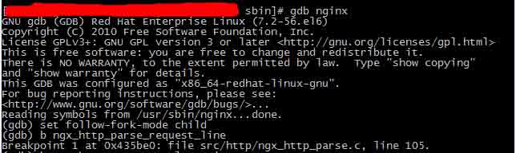
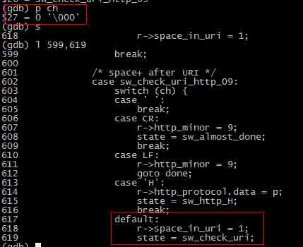
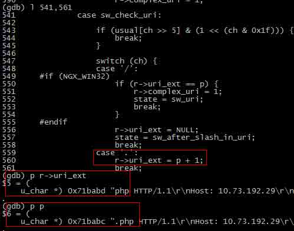
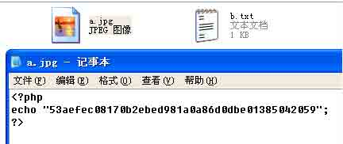
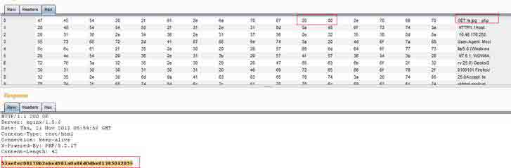

# CVE-2013-4547 Nginx 解析漏洞深入利用及分析

2014/05/19 11:12 | [百度安全中心](http://drops.wooyun.org/author/百度安全中心 "由 百度安全中心 发布") | [技术分享](http://drops.wooyun.org/category/tips "查看 技术分享 中的全部文章") | 占个座先 | 捐赠作者

## 0x00 背景

* * *

Nginx 历史上曾出现过多次解析漏洞，比如 80sec 发现的解析漏洞，以及后缀名后直接添加%00 截断导致代码执行的解析漏洞。

但是在 2013 年底，nginx 再次爆出漏洞（CVE-2013-4547），此漏洞可导致目录跨越及代码执行，其影响版本为：nginx 0.8.41 – 1.5.6，范围较广。

为了更深入的了解漏洞产生的原因，笔者根据官方补丁（[`nginx.org/download/patch.2013.space.txt`](http://nginx.org/download/patch.2013.space.txt)），对此漏洞进行了进一步的分析，

## 0x01 漏洞朔源

* * *

1.从官方补丁可以看出 nginx 在 ngx_http_parse_request_line 函数处做了代码 patch，下载 nginx 源代码，定位其补丁文件为 ngx_http_parse.c，函数 ngx_http_parse_request_line 中，分别位于代码段：

由此可定位本次漏洞需要分析的点，启用 gdb 调试，将 break 点设置为 ngx_http_parse_request_line，

并且 watch 变量 state 和 p，因为此函数为状态机，state 为状态值，p 为指针所指文志，这将是漏洞触发的关键点。

调试过程中需要跟踪 nginx 的 worker 子进程，所以需要设置 setfollow-fork-mode child，并且在相应的地方设置断点，



图-1 跟进子进程

2.分别发送正常和攻击语句进行测试：

正常语句：

```
http://127.0.0.1/a.jpg 
```

攻击语句：

```
http://127.0.0.1/a.jpg（非编码空格）\0.php 
```

使用正常语句一直 s 或 n 跟踪，会发现在对 url 的解析过程中，当路径中存在’.’或 url 存在’\0’会有如下处理：

```
case sw_check_uri:      
   ……
       case '.': 
           r->complex_uri = 1;  //此作为 flag 会判断使用 ngx_http_parse_complex_uri 方法，对路径修复
           state = sw_uri; 
           break;    
casesw_check_uri:    
   ……
        case '\0':   //当遇到\0 是，将会判断为非法字符
           return NGX_HTTP_PARSE_INVALID_REQUEST;   

```

但是在检查 uri 中有空格则会进入到`sw_check_uri_http_09`的逻辑中，那么当我们发送攻击代码的时候，执行流程将如下：



图-2 \0 未触发异常

再回到`sw_check_uri`状态，此时后面的字符串为.php，而“.”将被为是 uri 的扩展名的分隔符



图-3 取后缀名错误

最终导致 nginx 认为此次请求的后缀名为 php，通过配置，会传给 fastcgi 进行处理，而 fastcgi 在查找文件的时候被\0 截断，最终取到”a.jpg(非编码空格)”文件（注：Linux 下 php-fpm 默认限制的后缀名为 php，如未取消限制，访问将出现 access denied。测试想要查看执行结果，需修改 php-fpm.conf 中的 security.limit_extensions 为空，即允许任意后缀名文件作为 php 解析。）

跨越

```
location /protected / {deny all;} 
```

的规则的原理与此类似，均为状态机中判断出现混乱，从导致而可以跨越到 protected 目录中，访问默认不可访问到的文件。

由此可知，常规利用中如果想触发代码执行，条件为可上传带空格的文件到服务器，并且服务器存储的时候也需要保留空格，而大多数情况下，web 应用在处理上传文件时，都会将文件重命名，通过应用自身添加后缀，或者对后缀名去掉特殊字符后，做类型判断。

以上因素都导致此漏洞被认为是鸡肋漏洞，难以利用，而被人们所忽略。

## 0x02 windows 下的 RCE

* * *

此问题在 windows 的攻击场景中，则从小汽车变身为变形金刚。

首先，我们了解一下 windows 读取文件时的特点，即文件系统 api 创建文件名或查找文件名时，默认会去掉文件名后的空格，再执行操作，参见示例代码，目录下放置 a.txt 不带空格:

```
#include "stdafx.h"
#include<windows.h>

int _tmain(int argc, _TCHAR* argv[])
{
     HANDLE hFile =CreateFile(L"a.txt ",GENERIC_WRITE|GENERIC_READ, 0, //注意 a.txt 后有一个空格                    
              NULL,                  
              OPEN_EXISTING,          // 打开存在的文件
              FILE_ATTRIBUTE_NORMAL,   
              NULL);

     if (hFile ==INVALID_HANDLE_VALUE)
    {
      printf("openfailed!");
    }
     else
     {
      printf("fileopened");
     }

     CloseHandle(hFile);
     return 0;
}

```

通过此代码可知道，即使我们传入参数是”a.txt ”带空格，最后访问到却确是”a.txt”不带空格

此时的攻击过程为：

```
1.上传任意文件（不需要带空格文件），
2.http://127.0.0.1/a.jpg(非编码空格)\0.php 
```



图-4 文件 a.jpg



图-5 漏洞利用

成功将 a.jpg 文件当作 php 代码执行，达到了攻击成功的目的。

通过 windows 的此特性，使 CVE-2013-4547 在 windows+nginx 的环境中的危害无限扩大，即在 windows 下，只要普通用户能上传文件，则可利用本次漏洞，导致代码执行，并进一步入侵服务器。

并且在普通站长中使用 windows 做为操作系统的数量甚广，CVE-2013-4547 在 windows 的场景下将进行华丽的变身。

from:[`sec.baidu.com/index.php?research/detail/id/19`](http://sec.baidu.com/index.php?research/detail/id/19)

版权声明：未经授权禁止转载 [百度安全中心](http://drops.wooyun.org/author/百度安全中心 "由 百度安全中心 发布")@[乌云知识库](http://drops.wooyun.org)

分享到：

### 相关日志

*   [逆向基础（四）](http://drops.wooyun.org/tips/2046)
*   [Shodan 搜索引擎介绍](http://drops.wooyun.org/tips/2469)
*   [Nginx 安全配置研究](http://drops.wooyun.org/tips/1323)
*   [DiscuzX 系列命令执行分析公开（三连弹）](http://drops.wooyun.org/papers/4611)
*   [CoolShell 解密游戏的 WriteUp](http://drops.wooyun.org/tips/2730)
*   [BCTF Writeup](http://drops.wooyun.org/papers/1071)