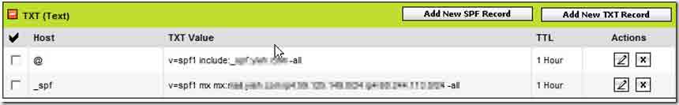
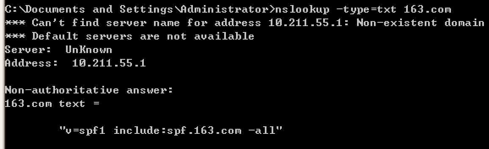
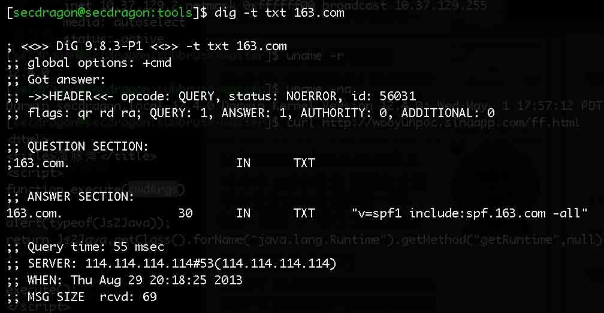

# 邮箱伪造详解

2013/08/29 20:20 | [瞌睡龙](http://drops.wooyun.org/author/瞌睡龙 "由 瞌睡龙 发布") | [漏洞分析](http://drops.wooyun.org/category/papers "查看 漏洞分析 中的全部文章"), [运维安全](http://drops.wooyun.org/category/%e8%bf%90%e7%bb%b4%e5%ae%89%e5%85%a8 "查看 运维安全 中的全部文章") | 占个座先 | 捐赠作者

## 0x00 背景

* * *

邮箱伪造技术，可被用来做钓鱼攻击。

即伪造管理员或者 IT 运维部等邮箱发邮件，获取信任使对方打开附带的木马文件或者回复想要获取的敏感资料等。

## 0x01 细节

* * *

SMTP 协议中,允许发件人伪造绝大多数的发件人特征信息。

这就导致了可以伪造别人发送邮件。

来看一下乌云上的案例：

[WooYun: ifeng exchange 伪造源地址漏洞](http://www.wooyun.org/bugs/wooyun-2011-02290)

[WooYun: 腾讯邮箱服务器允许源地址欺骗漏洞](http://www.wooyun.org/bugs/wooyun-2011-03257)

[WooYun: qq 邮箱伪造发件地址，容易被钓鱼利用](http://www.wooyun.org/bugs/wooyun-2011-03388)

网上还有个网站比较方便直接发送伪造邮件的：

[`emkei.cz/`](http://emkei.cz/)

## 0x02 防御

* * *

为了防止邮箱伪造，就出现了 SPF。

SPF(或是 Sender ID)是 Sender Policy Framework 的缩写。

当你定义了你域名的 SPF 记录后，接收邮件方会根据你的 SPF 记录来判断连接过来的 IP 地址是否被包含在 SPF 记录里面，如果在，则认为是一封正确的邮件，否则则认为是一封伪造的邮件。现在绝大部份反垃圾邮件系统都支持 SPF 过滤，这种过滤一般不会有误判，除非是邮件系统管理员自己把 SPF 记录配置错误或遗漏.

至于 domain key 则是由 Yahoo 所提出的。必需配合软件和加密技术，比较麻烦。目前使用的也不多。 Google 目前所谓的支援 domainkey 也只是在寄信的时候加入，免得被 yahoo 退信，本身并没有要求寄件者要有 domainkey。

正确设置后邮件头一般显示如下：

```
Received-SPF: pass (google.com: domain of wordpress@your_domain.com designates 72.47.192.112 as permitted sender) client-ip=72.47.192.112;
Authentication-Results: mx.google.com; spf=pass (google.com: domain of wordpress@your_domain.com designates 72.47.192.112 as permitted sender) smtp.mail=wordpress@your_domain.com 
```

关于 SPF 是否有设定的必要？一般认为有加上 SPF 比较好，怕万一碰到哪个收件服务器有采用 SenderID 机制来过滤信件的话就有用处了。

如何增加 SPF 记录，非常简单，在 DNS 里面添加 TXT 记录即可，可以使用下面两个 SPF 生成检查工具：

[`www.microsoft.com/mscorp/safety/content/technologies/senderid/wizard/default.aspx`](http://www.microsoft.com/mscorp/safety/content/technologies/senderid/wizard/default.aspx)

[`old.openspf.org/wizard.html`](http://old.openspf.org/wizard.html)



```
a 你域名的 A 记录，一般选择 yes，因为他有可能发出邮件，比如我上面提到的 Wordpress 的回信。
mx 一般也是 yes，MX 服务器会有退信等。
ptr 选择 no，官方建议的。
inlude 如果有可能通过一个 isp 来发信，isp 有自己的 SPF 记录，则填入这个 isp 的域名。比如你使用 Google Apps，应该增加 include:google.com 记录，因为你的邮件时从 Google 服务器发出去的。
ip4： 你还有没有其他的 ip 发信？可能你的 smtp 服务器是独立出来的，那么就填入你的 IP 地址或者网段。
~all: 意思是除了上面的，其他的都不认可。当然是 yes 了。 
```

查看 SPF 记录的方法

Windows 下进入 DOS 模式后用以下命令

```
nslookup -type=txt 域名 
```



Unix 操作系统下用：

```
# dig -t txt 域名 
```



**Tags:** [邮箱](http://drops.wooyun.org/tag/%e9%82%ae%e7%ae%b1)

版权声明：未经授权禁止转载 [瞌睡龙](http://drops.wooyun.org/author/瞌睡龙 "由 瞌睡龙 发布")@[乌云知识库](http://drops.wooyun.org)

分享到：碎银子打赏，作者好攒钱娶媳妇：


### 相关日志

*   [DNS 泛解析与内容投毒，XSS 漏洞以及证书验证的那些事](http://drops.wooyun.org/tips/1354)
*   [DNS 域传送信息泄露](http://drops.wooyun.org/papers/64)
*   [撞库扫号防范](http://drops.wooyun.org/tips/2830)
*   [老外的一份渗透测试报告](http://drops.wooyun.org/papers/576)
*   [电商网站的安全性](http://drops.wooyun.org/papers/741)
*   [从乌云看运维安全那点事儿](http://drops.wooyun.org/papers/410)