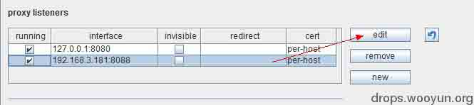
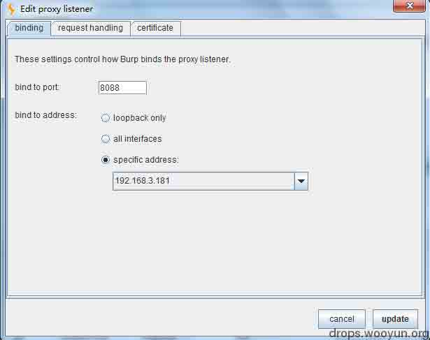
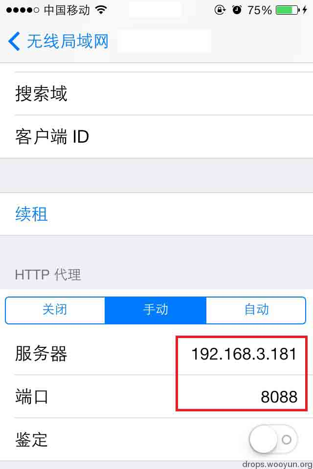

# 小谈移动 APP 安全

2013/11/26 16:27 | [zzR](http://drops.wooyun.org/author/zzR "由 zzR 发布")   | [技术分享](http://drops.wooyun.org/category/tips "查看 技术分享 中的全部文章")  | 占个座先  | 捐赠作者

## 0x00 背景

* * *

随着移动互联的扩张，移动 APP 承载了更多企业的终端梦。“用户手机安装 APP 以后，企业即埋下一颗种子，可持续与用户保持联系。”  种子是种下了，可要是它本身就是个[特洛伊木马]呢?试想你在某某知名 APP 平台下载安装一款知名 APP，深更半夜突然响起了[THE PHANTOM OF THE OPERA]那会是怎样的一种情景！

通过这近一个月来的观察和实验，斗胆在这里简单介绍一下手机移动 APP 安全测试方法、工具和一些容易产生安全问题的点。（此处仅就 IOS 版本 APP 进行说明）

## 0x01 细节

* * *

1.工具：PC、手机；软件：burpsuite/fiddler、sqlmap 等

2.代理设置：首先将你的 PC 和手机置于同一局域网，在 PC 上打开 burpsuite ，proxy 选项 proxy-listeners

new/edit 一下吧

在下拉列表中能够找到 PC 本机 IP，同时可以自定义端口，此处设置了 8088。

手机端，连接 WIFI 后，网络属性设置代理，写上上图 IP 地址和端口号

此时您的 PC 端 burpsuite 就设置完成。

3.接下来就是找到你感兴趣的 APP 对他们进行友情测试了。测试过程中，有几个安全点我在之前提交的报告中也都提到了，WEB 端存在的问题在移动端同样存在（小伙伴们可针对 OWASP TOP 10 有针对性进行测试，其他此处不尽详表），只是现在 WEB 前端重兵把守，兵强马壮，而移动端尚未得到足够的重视，相对薄弱，应者那句世界名言，我们何不找找小道前行？

说的这里，提几个比较具有代表性（易发现易批量应用，对隐私数据影响大）的安全关注点：

由于缺乏对移动端安全防护，并且未对 APP 客户端用户数据做过滤导致 SQL 注入等一系列问题（跨站／ＣＳＲＦ什么的那就不说了）

[WooYun: 乐视网 App 端 Sql 注入 Num 1](http://www.wooyun.org/bugs/wooyun-2013-042356)

模糊的用户权鉴往往造成各式各样的越权操作，用户隐私数据得不到安全保障；不安全的数据传输过程，敏感数据篡改（登陆、支付）

[WooYun: 乐视网 2200 万用户任意用户登录](http://www.wooyun.org/bugs/wooyun-2013-041489)

[WooYun: 中粮我买网 APP 越权操作缺陷 04（删除/修改任意用户信息）](http://www.wooyun.org/bugs/wooyun-2013-041079)

应用设计存在逻辑缺陷导致的跨界

[WooYun: 百度某应用设计缺陷可直接浏览企业内部关键系统甚至渗透](http://www.wooyun.org/bugs/wooyun-2013-020065)

移动云端系统载体自身存在缺陷，导致服务器沦陷。如 app 云端存在远程命令执行漏洞、任意文件上传 getshell 等

[WooYun: 凡客某站远程命令执行](http://www.wooyun.org/bugs/wooyun-2013-041652)

移动安全平台、推广平台存在安全缺陷导致海量 APP 可被操纵，恶意 APP 侵害移动用户。

[WooYun: 乐视网某主站站控制不严可传播恶意 app 感染手机端](http://www.wooyun.org/bugs/wooyun-2013-036910)

[WooYun: 联想 1#某站权限控制不严导致预装恶意 App 流毒](http://www.wooyun.org/bugs/wooyun-2013-040266)

以上方法针对少量 APP 测试还是挺实用的，这个月测试下来，就如一位皂友所说，发现这些问题是比较繁琐，但是出现的问题概率比较大。所以问题还是挺好找的。当我孜孜不倦升级的时候@xsser 给俺一个非常不错的建议用于批量检测：在本地搭建 http 代理记录 APP 访问日志，然后 sqlmap 批量扫这些去重的日志！很赞！

## 0x02 总结

* * *

各厂商在 APP 程序开发的过程中严格执行开发安全处置流程同时将 WEB 应用防线扩至移动端！

各 APP 应用、推广平台加强自身安全防范，升级安全基线，确保平台之安全可靠，要知道，你们可承载着万千互联网企业的中国梦-0-
最后，各大厂商、平台抱好你们的 APP 了，皂友们要来啦！

版权声明：未经授权禁止转载 [zzR](http://drops.wooyun.org/author/zzR "由 zzR 发布")@[乌云知识库](http://drops.wooyun.org)

分享到：

### 相关日志

*   [header 的安全配置指南](http://drops.wooyun.org/tips/1166)
*   [LDAP 注入与防御剖析](http://drops.wooyun.org/tips/967)
*   [无声杯 xss 挑战赛 writeup](http://drops.wooyun.org/tips/2671)
*   [SSLStrip 的未来 —— HTTPS 前端劫持](http://drops.wooyun.org/tips/3199)
*   [Android App Injection&&Drozer; Use](http://drops.wooyun.org/tips/2997)
*   [web 扫描爬虫优化](http://drops.wooyun.org/tips/3831)