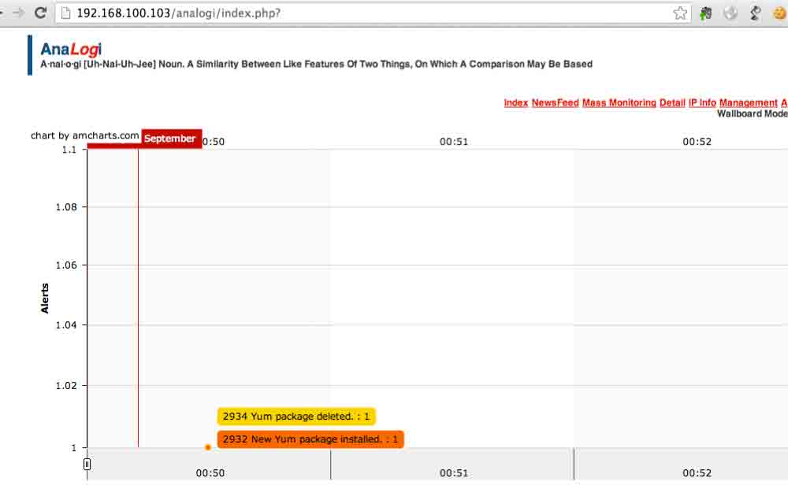

# OSSEC 学习教程一

2013/09/24 11:55 | [只抽红梅](http://drops.wooyun.org/author/只抽红梅 "由 只抽红梅 发布") | [技术分享](http://drops.wooyun.org/category/tips "查看 技术分享 中的全部文章") | 占个座先 | 捐赠作者

## 简介

* * *

写在前面的话，网上能够找到一些关于 ossec 方面的资料，虽然很少，但是总比没有强，不过在实际的使用过程中还是会碰到许多稀奇古怪的问题。整理整理我的使用过程，就当做一篇笔记吧。

PS：本文填了很多坑。

OSSEC 是一款开源的基于主机的入侵检测系统，可以简称为 HIDS。它具备日志分析，文件完整性检查，策略监控，rootkit 检测，实时报警以及联动响应等功能。它支持多种操作系统：Linux、Windows、MacOS、Solaris、HP-UX、AIX。属于企业安全之利器。

详细的介绍和文档可以参考官网网站：

[`www.ossec.net/`](http://www.ossec.net/)

## 环境

* * *

本文中的环境极其简单，两台 CentOS 6.4 虚拟机。

服务端

```
计算机名：ossec-server
IP 地址：192.168.100.103 
```

客户端

```
计算机名：ossec-agent
IP 地址：192.168.100.104 
```

## 准备

* * *

我们以一个全新的 CentOS 6.2 为基础的操作系统为例实际讲述如何进行安装。

首先我们安装需要用到的关联库和软件，由于我们最终是需要把日志导入到 MySQL 中进行分析，以及需要通过 web 程序对报警结果进行展示，同时需要把本机当做 SMTP，所以需要在本机安装 MySQL、Apache 和 sendmail 服务。在当前的终端中执行如下命令：

```
[root@ossec-server ~]# yum install wget gcc make mysql mysql-server mysql-devel httpd php php-mysql sendmail 
```

启动 httpd、mysql、sendmail 服务

```
[root@ossec-server ~]# /etc/init.d/httpd start
[root@ossec-server ~]# /etc/init.d/mysqld start
[root@ossec-server ~]# /etc/init.d/sendmail start 
```

下面创建数据库以方便我们下面的安装配置，连接到本机的 MySQL，然后执行如下命令：

```
[root@ossec-server ~]# mysql -uroot -p
mysql> create database ossec;
mysql> grant INSERT,SELECT,UPDATE,CREATE,DELETE,EXECUTE on ossec.* to ossec@localhost;
mysql> set password for ossec@localhost=PASSWORD('ossec');
mysql> flush privileges;
mysql> exit 
```

大概的环境已经准备的差不多了，下面就进入到实际安装过程。

## 安装 OSSEC 服务端

* * *

首先通过官网的链接下载当前的最新稳定版本 2.7 的服务端包，同时解压。

```
[root@ossec-server ~]# wget http://www.ossec.net/files/ossec-hids-2.7.tar.gz
[root@ossec-server ~]# tar zxf ossec-hids-2.7.tar.gz
[root@ossec-server ~]# cd ossec-hids-2.7 
```

为了使 OSSEC 支持 MySQL，需要在安装前执行 make setdb 命令，如下

```
[root@ossec-server ~]# cd src; make setdb; cd .. 
```

看到如下的信息说明可以正常支持 MySQL：

```
Info: Compiled with MySQL support. 
```

下面进入安装步骤，执行 install.sh 脚本，同时按照下面的信息进行填写，红色部门是我们需要输入的，其余部分按回车继续即可：

```
[root@ossec-server ossec-hids-2.7]# ./install.sh

  ** Para instalação em português, escolha [br].
  ** 要使用中文进行安装, 请选择 [cn].
  ** Fur eine deutsche Installation wohlen Sie [de].
  ** Για εγκατάσταση στα Ελληνικά, επιλέξτε [el].
  ** For installation in English, choose [en].
  ** Para instalar en Español , eliga [es].
  ** Pour une installation en français, choisissez [fr]
  ** A Magyar nyelvű telepítéshez válassza [hu].
  ** Per l'installazione in Italiano, scegli [it].
  ** 日本語でインストールします．選択して下さい．[jp].
  ** Voor installatie in het Nederlands, kies [nl].
  ** Aby instalować w języku Polskim, wybierz .
  ** Для инструкций по установке на русском ,введите [ru].
  ** Za instalaciju na srpskom, izaberi [sr].
  ** Türkçe kurulum için seçin [tr].
  (en/br/cn/de/el/es/fr/hu/it/jp/nl/pl/ru/sr/tr) [en]: cn
 OSSEC HIDS v2.7 安装脚本 - http://www.ossec.net 
```

您将开始 OSSEC HIDS 的安装.
请确认在您的机器上已经正确安装了 C 编译器.
如果您有任何疑问或建议,请给 dcid@ossec.net (或 daniel.cid@gmail.com) 发邮件.

*   系统类型: Linux ossec 2.6.32-358.el6.x86_64
*   用户: root
*   主机: ossec

    -- 按 ENTER 继续或 Ctrl-C 退出. --

1- 您希望哪一种安装 (server, agent, local or help)? **server**

*   选择了 Server 类型的安装.

2- 正在初始化安装环境.

*   请选择 OSSEC HIDS 的安装路径 [/var/ossec]: **/opt/ossec**

    *   OSSEC HIDS 将安装在  /opt/ossec .

3- 正在配置 OSSEC HIDS.

3.1- 您希望收到 e-mail 告警吗? (y/n) [y]:
   - 请输入您的 e-mail 地址? **ossec.test@gmail.com**

*   我们找到您的 SMTP 服务器为: alt1.gmail-smtp-in.l.google.com.
*   您希望使用它吗? (y/n) [y]: n

*   请输入您的 SMTP 服务器 IP 或主机名 ? **127.0.0.1**

    3.2- 您希望运行系统完整性检测模块吗? (y/n) [y]:

*   系统完整性检测模块将被部署.

    3.3- 您希望运行 rootkit 检测吗? (y/n) [y]:

*   rootkit 检测将被部署.

    3.4- 关联响应允许您在分析已接收事件的基础上执行一个
       已定义的命令.
       例如,你可以阻止某个 IP 地址的访问或禁止某个用户的访问权限.
       更多的信息,您可以访问:

    http://www.ossec.net/en/manual.html#active-response

*   您希望开启联动(active response)功能吗? (y/n) [y]:

    *   关联响应已开启
*   默认情况下, 我们开启了主机拒绝和防火墙拒绝两种响应.
    第一种情况将添加一个主机到 /etc/hosts.deny.
    第二种情况将在 iptables(linux)或 ipfilter(Solaris,
    FreeBSD 或 NetBSD）中拒绝该主机的访问.

*   该功能可以用以阻止 SSHD 暴力攻击, 端口扫描和其他
    一些形式的攻击. 同样你也可以将他们添加到其他地方,
    例如将他们添加为 snort 的事件.

*   您希望开启防火墙联动(firewall-drop)功能吗? (y/n) [y]:

    *   防火墙联动(firewall-drop)当事件级别 >= 6 时被启动
*   联动功能默认的白名单是:

    *   8.8.8.8
*   您希望添加更多的 IP 到白名单吗? (y/n)? [n]: y

*   请输入 IP (用空格进行分隔): **192.168.100.103**

    3.5- 您希望接收远程机器 syslog 吗 (port 514 udp)? (y/n) [y]:

*   远程机器 syslog 将被接收.

    3.6- 设置配置文件以分析一下日志:
    -- /var/log/messages
    -- /var/log/secure
    -- /var/log/maillog

    -如果你希望监控其他文件, 只需要在配置文件 ossec.conf 中
    添加新的一项.
    任何关于配置的疑问您都可以在 http://www.ossec.net 找到答案.

    --- 按 ENTER 以继续 ---

5- 正在安装系统
- 正在运行 Makefile
INFO: Little endian set.
…………省略编译输出…………

*   系统类型是  Redhat Linux.

    *   修改启动脚本使 OSSEC HIDS 在系统启动时自动运行

    *   已正确完成系统配置.

    *   要启动 OSSEC HIDS:
                /opt/ossec/bin/ossec-control start

    *   要停止 OSSEC HIDS:
                /opt/ossec/bin/ossec-control stop

    *   要查看或修改系统配置,请编辑  /opt/ossec/etc/ossec.conf

    感谢使用 OSSEC HIDS.
    如果您有任何疑问,建议或您找到任何 bug,
    请通过　contact@ossec.net 或邮件列表 ossec-list@ossec.net 联系我们.
    ( http://www.ossec.net/en/mailing_lists.html ).

    您可以在　http://www.ossec.net 获得更多信息

    --- 请按　ENTER 结束安装 (下面可能有更多信息). ---

直到碰到上面内容，说明安装完成。

## OSSEC 服务端配置

* * *

上面只是安装好了 OSSEC 服务端，下面则是为了配置服务端，使其工作正常。执行下面命令启用数据库支持：

```
[root@ossec-server ossec-hids-2.7]# /opt/ossec/bin/ossec-control enable database 
```

然后导入 MySQL 表结构到 MySQL 中：

```
[root@ossec-server ossec-hids-2.7]# mysql -uossec -p ossec < ./src/os_dbd/mysql.schema 
```

修改部分配置文件的权限，否则会启动服务失败：

```
[root@ossec-server ossec-hids-2.7]# chmod u+w /opt/ossec/etc/ossec.conf 
```

然后我们编辑 ossec.conf 文件，在 ossec_config 中添加 MySQL 配置：

```
<ossec_config>
    <database_output>
        <hostname>192.168.100.103</hostname>
        <username>ossec</username>
        <password>ossec</password>
        <database>ossec</database>
        <type>mysql</type>
    </database_output>
</ossec_config> 
```

由于我们在前面的安装过程中支持接受远程机器的 syslog，所以我们还需要对 ossec.conf 文件中的 syslog 部分进行配置，修改 ossec.conf 文件，按照下面的内容进行修改，把我们网段可以全添加进去：

```
<remote>
    <connection>syslog</connection>
    <allowed-ips>192.168.0.0/16</allowed-ips>
  </remote> 
```

在实际的实验过程中启动 ossec 服务端必须先添加一个客户端，否则直接启动服务端是会失败的，通过如下命令查看日志会发现如下错误：

```
[root@ossec-server logs]# cat /opt/ossec/logs/ossec.log

2013/09/23 23:43:15 ossec-analysisd(1210): ERROR: Queue '/queue/alerts/ar' not accessible: 'Connection refused'.
2013/09/23 23:43:15 ossec-analysisd(1301): ERROR: Unable to connect to active response queue. 
```

在服务器上添加客户端，执行如下命令，按照提示进行输入，红色部分是我们输入的：

```
[root@ossec-server logs]# /opt/ossec/bin/manage_agents

   ****************************************
   * OSSEC HIDS v2.7 Agent manager.     *
   * The following options are available: *
   ****************************************
      (A)dd an agent (A).
      (E)xtract key for an agent (E).
      (L)ist already added agents (L).
      (R)emove an agent (R).
      (Q)uit. 
```

Choose your action: A,E,L,R or Q: **A**

*   Adding a new agent (use '\q' to return to the main menu).
    Please provide the following:

    *   A name for the new agent: **ossec-agent**
    *   The IP Address of the new agent: **192.168.100.104**
    *   An ID for the new agent[001]:
        Agent information:
        ID:001
        Name:ossec-agent
        IP Address:192.168.100.104

    Confirm adding it?(y/n): **y**
    Agent added.

然后程序会重新进入到第一次的界面，如下，我们导出刚才添加的那个 agent 的 key，用于后面的客户端连接到服务端：

```
****************************************
   * OSSEC HIDS v2.7 Agent manager.     *
   * The following options are available: *
   ****************************************
      (A)dd an agent (A).
      (E)xtract key for an agent (E).
      (L)ist already added agents (L).
      (R)emove an agent (R).
      (Q)uit. 
```

Choose your action: A,E,L,R or Q: **E**

Available agents:
      ID: 001, Name: ossec-agent, IP: 192.168.100.104
   Provide the ID of the agent to extract the key (or '\q' to quit): **001**

Agent key information for '001' is:
   MDAxIG9zc2VjLWFnZW50IDE5Mi4xNjguMTAwLjEwNCAzZWJmZWMzZmRlYzE2ODgzZmEyMzc0NWI5MWMyZDlmNmIyNDViZDMxNjBkZGRiM2FlMTk4NDA3ODNiNDFhYzYz

** Press ENTER to return to the main menu.

到现在就可以启动我们的 ossec 服务端了。

```
# /opt/ossec/bin/ossec-control start 
```

或者执行

```
# /etc/init.d/ossec start 
```

## 安装 OSSEC 客户端

* * *

由于我们本身客户端也是 Linux 服务器，而 ossec 的服务端和客户端是同一个安装包，所以在客户端上下载安装包，并且解压安装，如下。

```
[root@ossec-server ~]# wget http://www.ossec.net/files/ossec-hids-2.7.tar.gz
[root@ossec-server ~]# tar zxf ossec-hids-2.7.tar.gz
[root@ossec-server ~]# cd ossec-hids-2.7
[root@ossec-server ~]# ./install.sh 
```

** Para instalação em português, escolha [br].
  ** 要使用中文进行安装, 请选择 [cn].
  ** Fur eine deutsche Installation wohlen Sie [de].
  ** Για εγκατάσταση στα Ελληνικά, επιλέξτε [el].
  ** For installation in English, choose [en].
  ** Para instalar en Español , eliga [es].
  ** Pour une installation en français, choisissez [fr]
  ** A Magyar nyelvű telepítéshez válassza [hu].
  ** Per l'installazione in Italiano, scegli [it].
  ** 日本語でインストールします．選択して下さい．[jp].
  ** Voor installatie in het Nederlands, kies [nl].
  ** Aby instalować w języku Polskim, wybierz .
  ** Для инструкций по установке на русском ,введите [ru].
  ** Za instalaciju na srpskom, izaberi [sr].
  ** Türkçe kurulum için seçin [tr].
  (en/br/cn/de/el/es/fr/hu/it/jp/nl/pl/ru/sr/tr) [en]: **cn**
OSSEC HIDS v2.7 安装脚本 - http://www.ossec.net

您将开始 OSSEC HIDS 的安装.
请确认在您的机器上已经正确安装了 C 编译器.
如果您有任何疑问或建议,请给 dcid@ossec.net (或 daniel.cid@gmail.com) 发邮件.

*   系统类型: Linux ossec-agent 2.6.18-164.el5
*   用户: root
*   主机: ossec-agent

    -- 按 ENTER 继续或 Ctrl-C 退出. --

1- 您希望哪一种安装 (server, agent, local or help)? **agent**

*   选择了 Agent(client) 类型的安装.

2- 正在初始化安装环境.

*   请选择 OSSEC HIDS 的安装路径 [/var/ossec]: **/opt/ossec**

    *   OSSEC HIDS 将安装在  /opt/ossec .

3- 正在配置 OSSEC HIDS.

3.1- 请输入 OSSEC HIDS 服务器的 IP 地址或主机名: **192.168.100.103**

*   添加服务器 IP  192.168.100.103

    3.2- 您希望运行系统完整性检测模块吗? (y/n) [y]:

*   系统完整性检测模块将被部署.

    3.3- 您希望运行 rootkit 检测吗? (y/n) [y]:

*   rootkit 检测将被部署.

    3.4 - 您希望开启联动(active response)功能吗? (y/n) [y]:

    3.5- 设置配置文件以分析一下日志:
    -- /var/log/messages
    -- /var/log/secure
    -- /var/log/xferlog
    -- /var/log/maillog
    -- /var/log/httpd/error_log (apache log)
    -- /var/log/httpd/access_log (apache log)

    -如果你希望监控其他文件, 只需要在配置文件 ossec.conf 中
    添加新的一项.
    任何关于配置的疑问您都可以在 http://www.ossec.net 找到答案.

    --- 按 ENTER 以继续 ---

5- 正在安装系统
- 正在运行 Makefile
INFO: Little endian set.

…………省略编译输出…………

*   系统类型是  Redhat Linux.
*   修改启动脚本使 OSSEC HIDS 在系统启动时自动运行

*   已正确完成系统配置.

*   要启动 OSSEC HIDS:
                /opt/ossec/bin/ossec-control start

*   要停止 OSSEC HIDS:
                /opt/ossec/bin/ossec-control stop

*   要查看或修改系统配置,请编辑  /opt/ossec/etc/ossec.conf

    感谢使用 OSSEC HIDS.
    如果您有任何疑问,建议或您找到任何 bug,
    请通过　contact@ossec.net 或邮件列表 ossec-list@ossec.net 联系我们.
    ( http://www.ossec.net/en/mailing_lists.html ).

    您可以在　http://www.ossec.net 获得更多信息

    --- 请按　ENTER 结束安装 (下面可能有更多信息). ---

*   您必须首先将该代理添加到服务器端以使他们能够相互通信.
    这样做了以后,您可以运行'manage_agents'工具导入
    服务器端产生的认证密匙.
    /opt/ossec/bin/manage_agents

    详细信息请参考:

    http://www.ossec.net/en/manual.html#ma

## 配置 OSSEC 客户端

* * *

其实配置 ossec 客户端就是把刚才由服务端生成的 key，在客户端中导入，执行如下命令
[root@ossec-agent ossec-hids-2.7]# /opt/ossec/bin/manage_agents

```
****************************************
* OSSEC HIDS v2.7 Agent manager.     *
* The following options are available: *
****************************************
   (I)mport key from the server (I).
   (Q)uit. 
```

Choose your action: I or Q: **I**

*   Provide the Key generated by the server.
*   The best approach is to cut and paste it.
    *** OBS: Do not include spaces or new lines.

Paste it here (or '\q' to quit): **MDAxIG9zc2VjLWFnZW50IDE5Mi4xNjguMTAwLjEwNCAzZWJmZWMzZmRlYzE2ODgzZmEyMzc0NWI5MWMyZDlmNmIyNDViZDMxNjBkZGRiM2FlMTk4NDA3ODNiNDFhYzYz**

Agent information:
   ID:001
   Name:ossec-agent
   IP Address:192.168.100.104

Confirm adding it?(y/n): y
Added.
** Press ENTER to return to the main menu.

最后启动客户端

```
[root@ossec-agent ossec-hids-2.7]# /opt/ossec/bin/ossec-control start 
```

或者执行

```
[root@ossec-agent ossec-hids-2.7]# /etc/init.d/ossec start 
```

## 安装 web 界面

* * *

上面我们安装了 ossec 的服务端，并且为 ossec 添加了一个客户端，非常简单的一个环境，环境是搭建好了，可是目前这个环境如果我们要分析 ossec 的报警信息就太麻烦了，所以我们安装第三方的 web 界面用来显示报警信息。

```
[root@ossec-server ~]# wget https://github.com/ECSC/analogi/archive/master.zip
[root@ossec-server ~]# unzip master
[root@ossec-server ~]# mv analogi-master/ /var/www/html/analogi
[root@ossec-server ~]# cd /var/www/html/
[root@ossec-server html]# chown -R apache.apache analogi/
[root@ossec-server html]# cd analogi/
[root@ossec-server analogi]# cp db_ossec.php.new db_ossec.php 
```

编辑 db_ossec.php 文件，修改 MySQL 的配置信息:

```
define ('DB_USER_O', 'ossec');
define ('DB_PASSWORD_O', 'ossec');
define ('DB_HOST_O', '127.0.0.1');
define ('DB_NAME_O', 'ossec'); 
```

修改 apache 配置，增加虚拟目录，

```
[root@ossec-server ~]# vim /etc/httpd/conf.d/analogi.conf 
```

添加如下内容

```
Alias /analogi /var/www/html/analogi
<Directory /var/www/html/analogi>
    Order deny,allow
    Deny from all
    Allow from 192.168.0.0/16
</Directory> 
```

然后重新启动 Apache

```
[root@ossec-server ~]# /etc/init.d/httpd restart 
```

然后访问就可以了。

[`192.168.100.103/analogi/`](http://192.168.100.103/analogi/)



## 最后

* * *

上面是整个安装和配置步骤，要想让 ossec 发挥更大的作用，还需要针对实际的环境进行配置修改和规则的调整和编写。在以后的我们会更多关注 OSSEC 在实际应用中的经验。

版权声明：未经授权禁止转载 [只抽红梅](http://drops.wooyun.org/author/只抽红梅 "由 只抽红梅 发布")@[乌云知识库](http://drops.wooyun.org)

分享到：

### 相关日志

*   [CentOS 6.2 下安装基于 Suricata + Barnyard 2 + Base 的⼊侵检测系统](http://drops.wooyun.org/tips/413)
*   [搭建基于 Suricata+Barnyard2+Base 的 IDS 前端 Snorby](http://drops.wooyun.org/papers/653)
*   [Zmap 详细用户手册和 DDOS 的可行性](http://drops.wooyun.org/tools/515)
*   [One git command may cause you hacked(CVE-2014-9390)](http://drops.wooyun.org/papers/4386)
*   [SCTF-WriteUp](http://drops.wooyun.org/tips/4243)
*   [Mysql Trigger](http://drops.wooyun.org/tips/3435)