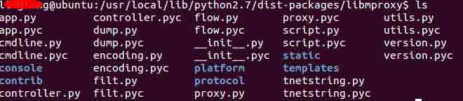
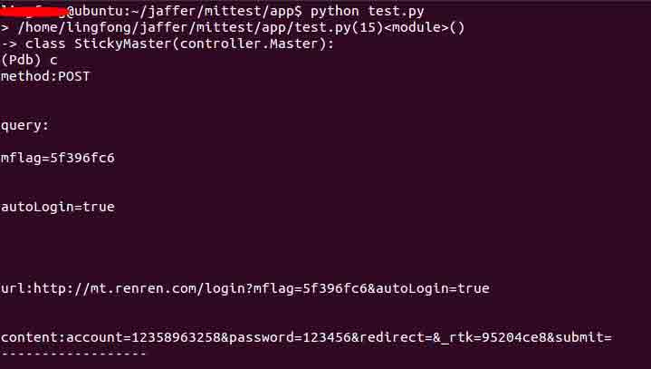

# mitmproxy 中 libmproxy 简单介绍

2014/09/24 17:42 | [jaffer](http://drops.wooyun.org/author/jaffer "由 jaffer 发布") | [工具收集](http://drops.wooyun.org/category/tools "查看 工具收集 中的全部文章"), [技术分享](http://drops.wooyun.org/category/tips "查看 技术分享 中的全部文章") | 占个座先 | 捐赠作者

## 0x00 简介

* * *

Mitmproxy 是一个基于 python 的中间人代理的框架。做过渗透测试的肯定很熟悉工具 burpsuite 或 Fiddler，这些工具能够拦截并修改 http 或 https 的数据包，对于分析数据包交互的应用来说是非常有用的。但是这些工具都是整套给我们做好了。比如如果想自己定制一套这样的工具，添加一些自己需要的功能的话，那么我想，mitmproxy 将是一个比较好的选择，因为它提供了一个可供用户调用的库 libmproxy（注意该库目前只支持 linux 系统）。

用过 kali 系统的，对于 mitmproxy 应该不会陌生，因为这个工具已经内嵌到了 kali 系统里面了。如果你是在普通的 linux 系统，那么就需要自己手动安装这个工具。

Mitmproxy 项目主页：[`mitmproxy.org/`](http://mitmproxy.org/)（需要翻墙）

Github：[`github.com/mitmproxy/mitmproxy`](https://github.com/mitmproxy/mitmproxy)

安装以及简单使用：[`sec.chinabyte.com/412/12771912.shtml`](http://sec.chinabyte.com/412/12771912.shtml)

## 0x01 libmproxy 介绍

* * *

一旦用户安装上了 mitmproxy，那么，在 python 的 dist-packages 目录下就会有一个 libmproxy 的目录。点击进去，如下图所示。



有很多文件，里面最关键的一个文件就是 flow.py。里面有从客户端请求的类 Request，也有从服务器返回的可以操作的类 Response。并且都实现了一些方法可以调用请求或回复的数据，包括请求 url，header，body，content 等。具体如下：

Request 的一些方法：

```
get_query():得到请求的 url 的参数，被存放成了字典。
set_query(odict):设置请求的 url 参数，参数是字典。
get_url():请求的 url。
set_url(url):设置 url 的域。
get_cookies():得到请求的 cookie。
headers：请求的 header 的字典。
content：请求的内容，如果请求时 post，那么 content 就是指代 post 的参数。
Response 的一些方法如下：
Headers：返回的 header 的字典。
Code：返回数据包的状态，比如 200,301 之类的状态。
Httpversion：http 版本。 
```

有了上面这些简单的方法，只要我们会 python，就可以写一些简单的程序，比如过滤一些数据，只是提取一些有特定格式的数据包等。

## 0x02 一个简单的实例

* * *

下面就来写一个这样的程序：抓取含有 password 或 passwd 这样字段的数据包，将这个数据包打印出来。

那么分析一下，可能出现 passwd 或 password 的位置，第一，是 url 参数，这个我们可以通过 get_url()这个方法获取，第二个就是 content，如果请求数据报文是通过 post 提交，那么就需要在 content 里面找到。好了，分析好了，那么就剩下写代码了。Mitmproxy 官网有一个小程序，我们可以借鉴，下面是一个借鉴 mitmproxy 官网的代码的简易的实现。

```
#!/usr/bin/env python
#coding=utf-8
"""
author:jaffer
time:2014-9-3 19:33
"""
from libmproxy import controller, proxy
import os
import pdb
class StickyMaster(controller.Master):
    def __init__(self, server):
        controller.Master.__init__(self, server)
    def run(self):
        try:
            return controller.Master.run(self)
        except KeyboardInterrupt:
            self.shutdown()

    def findword(self,msg):
        stringword1 = 'passwd'
        stringword2 = 'password'
        content = msg.content
        querystring = msg.get_query()
        #在 url 参数中查找
        for eachp in querystring:
            if eachp[1].find(stringword1) != -1 or eachp[1].find(stringword2) != -1:
                return 1
        #在 content 中寻找
        if content.find(stringword1) != -1 or content.find(stringword2) != -1:
            return 1
        return 0

    def handle_request(self, msg):
        flag = self.findword(msg)
        if flag == 1:
            str = msg.get_query()
            con = msg.content
            url = msg.get_url()
            m = msg.method
            print 'method:' + m
            print '\n'
            print 'query:\n'
            for eachp in str:
                print eachp[0] + '=' + eachp[1]
                print '\n'
            print '\n'
            print 'url:' + url
            print '\n'
            print 'content:' + con
            print '------------------\n'
        msg.reply()        

    def handle_response(self, msg):
        msg.reply()

config = proxy.ProxyConfig(
    cacert = os.path.expanduser("~/.mitmproxy/mitmproxy-ca.pem")
)
server = proxy.ProxyServer(config, 8000)
m = StickyMaster(server)
m.run()

```

我使用手机端浏览器，登录人人网，使用上述代码截获数据包如图：



## 0x04 后记

* * *

Mitmproxy 提供的 libmproxy 很是强大方便，对于自己需要自己定制的程序代码有帮助，当然上面只是一个简单的实现，还有更多的功能需要更多的挖掘，libmproxy 下面的那些内容可以继续学习。

版权声明：未经授权禁止转载 [jaffer](http://drops.wooyun.org/author/jaffer "由 jaffer 发布")@[乌云知识库](http://drops.wooyun.org)

分享到：

### 相关日志

*   [SVN 安装配置及安全注意事项](http://drops.wooyun.org/tips/352)
*   [跑 wordpress 用户密码脚本](http://drops.wooyun.org/tools/601)
*   [Android UXSS 阶段性小结及自动化测试](http://drops.wooyun.org/tools/3186)
*   [charles 使用教程指南](http://drops.wooyun.org/tips/2423)
*   [metasploit 渗透测试笔记(内网渗透篇)](http://drops.wooyun.org/tips/2746)
*   [迭代暴力破解域名工具](http://drops.wooyun.org/tools/950)