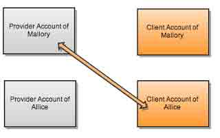
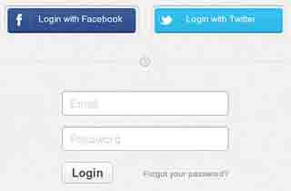
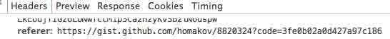
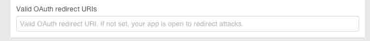
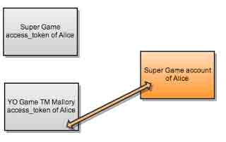

# OAuth 安全指南

2014/05/17 16:42 | [∑-TEAM](http://drops.wooyun.org/author/∑-TEAM "由 ∑-TEAM 发布") | [web 安全](http://drops.wooyun.org/category/web "查看 web 安全 中的全部文章"), [漏洞分析](http://drops.wooyun.org/category/papers "查看 漏洞分析 中的全部文章") | 占个座先 | 捐赠作者

from:http://www.oauthsecurity.com/

## 0x00 前言

* * *

这篇文章讲了 OAuth 和 OpenID 容易出现漏洞的一些地方。不管是程序员还是黑客，阅读它都会对你大有裨益。

就 OAuth 本身而言有一套很严谨的结构，但是很多开发者在部署 AOuth 的时候因为疏忽产生很多安全隐患，这些隐患如果被攻击者利用，是很难防御的。

现在很多大网站，都存在 OAuth 安全隐患，我写这篇文章的原因也是希望大家意识到由 OAuth 配置不当所引发的安全问题，和警示开发人员要小心处理关于 OAuth 的问题。

这篇文章并没有阐释 OAuth 的具体工作流程，想了解的话可以看他们的官网。

此文建议配合另外一个文章来看，包括乌云上很多实际案例：[《OAuth 2.0 安全案例回顾》](http://drops.wooyun.org/papers/598)

## 0x01 Authorization Code flow

* * *

### 1\. 通过绑定攻击者的账号进行账户劫持

这是一种比较常见的攻击手法，其实就是一种 CSRF 攻击。

平台返回 code 到事先设定好的回调 url，`SITE/oauth/callback?code=CODE`，之后客户端把 code 连同 client credentials 和 redirect_uri 一起提交换取 access_token。

如果客户端没有部署 state 这个参数来防止 CSRF 攻击，那么我们就可以通过 CSRF 轻易地把我们提供的账号和受害者的账号绑定。



如下图所示，很多网站都提供使用社交账户登录的功能。




**防范方法**：在把用户的数据提交给提供者网站的时候，附带一个随机数，在连接返回时，沿着这个随机数是否改变。

**State fixation bug:(state 可变漏洞)**：在 omniauth 中一些遗留代码会导致 state 被修改，它使用 /connect?state=user_supplied 代替了随机数。 一些开发者把 state 拿来做其他的用途，导致他失去了防止 CSRF 的功能，一个工整的解决方式可以用 JSON Web Token as state。

### 2\. 使用会话固化攻击进行账户劫持

在会话固化攻击中，攻击者会初始化一个合法的会话，然后诱使用户在这个会话上完成后续操作，从而达到攻击的目的。

如果我们访问一个用户绑定的链接，比如/user/auth/facebook，这个链接通常会返回 一个附带用户信息的 url，其中 uid 代表了攻击者的 id 最终这个 id 将和受害者用户绑定。

**修复**: 确认每一条绑定社交用户的链接都拥有合法的 csrf_token,最好使用 post 代替 get。

Facebook 驳回了这个 CSRF 漏洞的修复建议，很多库中仍包含这一漏洞。所以不要奢望平台方总是能给与你可靠的数据。

### 3\. 通过 authorization code 泄露来劫持数据

OAuth 的文档清楚的写出了，平台方应该检查 redirect_uri 是否被篡改。但我们通常懒得去检查它。

这使得很多平台方在这里产生了安全隐患，Foursquare (reported), VK (report, in Russian), Github (could be used to leak tokens to private repos)

攻击的方式很简单，寻找一个 XSS 漏洞，搞糟一个链接把 redirect_uri 修改为你自己的地址。当受害者访问这个链接时，就会把 leaking_page?code=CODE 发送到你的指定地址。



这样你就可以使用这个泄露的授权码，在真实的 redirect_uri 上面登录受害者的用户了。

**修复方法：**可变的 redirect_uri 的确会产生风险，如果你非要用它，在 access_token 创建的时候验证它是否被篡改。

## 0x02 Implicit flow

* * *

### 1\. redirect 可控引起的 access_token/signed_request 泄露

这个漏洞被媒体称之为"covert redirect" ，但是这并不是一个新的漏洞。

利用它的前提是需要有一个可以修改的 redirect，之后吧 response_type 替换为 token 或者是 signed_request。302 重定向会附带#后的信息，而攻击者只需要通过 js 截取即可。

**修补方式：**在 app setting 中建立 redirect_uri 白名单。



### 2\. 通过收集用户 access_token 进行账户劫持

这个漏洞也被称为 One Token to Rule Them All.它通常发生在，手机和客户端 app 上。

当用户吧一个 ring 提交到一个他想登陆的网站时，一个恶意的网站管理员就可以通过这个 ring 登陆这个用户正在使用的其他网站。



**修补方式：**在接受用户提交的 access_token 之前，检查他是否符合 client_id。

## 0x03 Extra

* * *

### 1\. client credentials 泄露

client credentials 其实并没有那么重要，你所能做的就是取得 auth code，然后手动得到一个 access_token。

使用静态 redirect_uri，可以防止这种安全隐患。

### 2\. 会话固化攻击 (OAuth1.0)

OAuth1.0 和 OAuth2.0 的主要区别就是向平台传输参数的方式不同。在 1.0 中，客户把所有参数传递给平台，然后直接得到 access_token。所以你可以诱使用户访问 provider?request_token=TOKEN 在授权完成后用户会被重定向到 client/callback?request_token=SAME_TOKEN 如果这个 TOKEN 是我们事先生成的，那么我们就可以复用这个 TOKEN.

这不是一个服务端的 bug，通常它被用来钓鱼，比如这个案例([FYI, Paypal express checkout has this bug](http://homakov.blogspot.com/2014/01/token-fixation-in-paypal.html))

### 3\. 中继平台

有些平台本身在其他平台获取账号，同时也为其他用户提供服务。通常他们都需要将 url 重定向到第三方网站，token 在这样的链条中很容易泄露

```
Facebook -> Middleware Provider -> Client's callback 
```

而且这个问题基本无法修复。

facebook 的解决方法是在 callback url 后面加上#*=* 防止其夹带数据。

### 4\. 绕过 redirect_uri 认证的一些技巧

如果允许设置子目录，下面是一些目录遍历的技巧

```
/old/path/../../new/path
/old/path/%2e%2e/%2e%2e/new/path
/old/path/%252e%252e/%252e%252e/new/path
/new/path///../../old/path/
/old/path/.%0a./.%0d./new/path (For Rails, because it strips \n\d\0) 
```

### 5\. 重放攻击

code 经过 get 传输的时候会存在于 log 文件中，平台应该在使用或者过期之后删除它们。

版权声明：未经授权禁止转载 [∑-TEAM](http://drops.wooyun.org/author/∑-TEAM "由 ∑-TEAM 发布")@[乌云知识库](http://drops.wooyun.org)

分享到：

### 相关日志

*   [OAuth 2.0 安全案例回顾](http://drops.wooyun.org/papers/598)
*   [一种新的攻击方法——Java-Web-Expression-Language-Injection](http://drops.wooyun.org/tips/2494)
*   [WordPress 3.5.1 远程代码执行 EXP](http://drops.wooyun.org/papers/785)
*   [RansomWeb:一种新兴的 web 安全威胁](http://drops.wooyun.org/papers/4834)
*   [Duo Security 研究人员对 PayPal 双重验证的绕过](http://drops.wooyun.org/papers/2502)
*   [DedeCMS 最新通杀注入(buy_action.php)漏洞分析](http://drops.wooyun.org/papers/979)