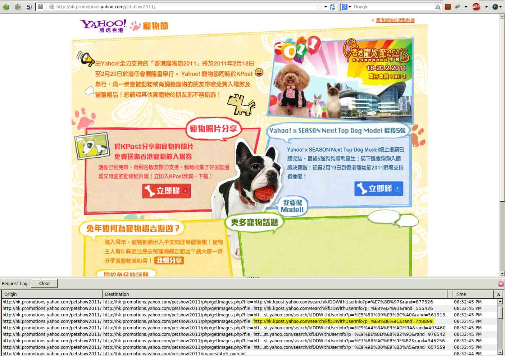

# 雅虎某分站的 XSS 导致雅虎邮箱沦陷

2014/03/09 11:17 | [mramydnei](http://drops.wooyun.org/author/mramydnei "由 mramydnei 发布") | [web 安全](http://drops.wooyun.org/category/web "查看 web 安全 中的全部文章"), [漏洞分析](http://drops.wooyun.org/category/papers "查看 漏洞分析 中的全部文章") | 占个座先 | 捐赠作者

## 0x00 前言

* * *

很多时候我们会因为一个活动或者一些其它的原因建立一些临时的站点。但是糟糕的是一旦这一切过去后我们会忘了关闭它。就像我在 http://hk.promotions.yahoo.com 上发现的这个漏洞一样，那些临时站点往往成为我们强大安全体系中的软肋。

## 0x01 初探

* * *

让我们看看我在雅虎香港的这个子站上发现的一些有趣的东西：



就如同你从请求日志中当中所看到的， 有些东西正在尝试跨域请求其它域名下的数据。

```
http://hk.promotions.yahoo.com/petshow2011/php/getImages.php?file=<url> 
```

跨域代理对于挖洞的人来说，就像是金矿般的存在。我们总能从它身上找到一些漏洞，这一个也不例外。不得不说，我们很幸运。因为这里并没有用白名单来限制 URL 所指向的域名。而且这个代理居然没有在 Response 上设置 content-type。这意味着？嗯，我们找到了一个 XSS。


但这个 XSS 并不能让我兴奋起来。因为它只不过是一个在几乎可以看作是静态网站上的 XSS。换句话来说，它根本就没有任何价值。

## 0x02 变废为宝

* * *

那我们如何才能让它变得有用呢？还记得 content-type 的事情吧？嗯，一个没有设置 content-type 的 response 意味着我们可以控制整个 response 的内容。那我们为什么不试着搞一个 swf 呢？这样就意味着我们在 hk.promotions.yahoo.com 域下拥有一个完全可控的 swf 文件。也许有人会问为什么 swf 会比 HTML 更有用呢？其实我很想说是因为“爱情”，但实际上是因为 crossdomain.xml。因为 flash 可以在 crossdomain.xml 允许的前提下进行一些跨域的通讯，那么接下来我们只要在找到一些设置上不太安全的 crossdomain.xml 就可以搞一些有趣的事情了。在经过一些列的检测后我把目标锁定在了下面的三个域名里。

finance.yahoo.com:

```
<cross-domain-policy>  
    <allow-access-from domain="*.yahoo.com"/>  
    <allow-access-from domain="us.js2.yimg.com"/>  
    <allow-access-from domain="*.yimg.com"/>  
</cross-domain-policy>  

```

www.flickr.com:

```
<cross-domain-policy>  
    <allow-access-from domain="*.yahoo.com"/>  
    <allow-access-from domain="l.yimg.com"/>  
    <allow-access-from domain="d.yimg.com"/>  
    <allow-access-from domain="s.yimg.com"/>  
    <site-control permitted-cross-domain-policies="master-only"/>  
</cross-domain-policy>  

```

ca-mg5.mail.yahoo.com 不过似乎这个比前两个更加有趣一些

```
<cross-domain-policy>  
    <allow-access-from domain="*.yahoo.com" secure="false"/>  
    <allow-access-from domain="l.yimg.com" secure="false"/>  
    <allow-access-from domain="s.yimg.com" secure="false"/>  
</cross-domain-policy>  

```

如果你把注意力放在这个 secure=flase 上面，我想你应该没白这个设置会允许我们通过 HTTP 的方式来访问一些只允许通过 HTTPS 来访问的资源。详情可以参见：“Using false in an HTTPS policy file is not recommended because this compromises the security offered by HTTPS.”

现在一切都已经很明了了。我们可以借助我们构造的 swf 文件来和 ca-mg5.mail.yahoo.com 进行通讯。使用工具[SWF<->JS XHR proxy](https://github.com/borisreitman/CrossXHR)，让我们尝试着来搞点邮件吧！我们先尝试通过这个 swf 里的 JavaScript 来发送一些跨域的请求：


看上去一些都很顺利。我们可以从 response 中看到收获的 auth tokens 和一些个人信息。然而借助其中的一个 token 我们可以列出邮件的列表


进一步我们可以通过使用这些 message id 来阅读邮件的内容


当然，因为我们可以读取那些具有 CSRF tokens 的页面，所以我们也可以试着删除一些邮件或者以当前用户的身份来发送邮件。当然可能更加有趣的是我们可以控制所有绑定了这个邮箱的帐号，重置那些帐号的密码并偷偷的删除那些重置邮件。

## 0x03 最后

* * *

作为修复方案，雅虎安全团队选择删除了这个站点。不得不说这也是个不错选择。但是关于 crossdomain.xml，他们表示并不会对齐进行任何的修改。也许业务的紧密度和业务线的长度在某些时候并不能让我们做一些变动。但这仍然是个需要被解决的问题。

PS:yahoo 为此漏洞支付了作者 3000 刀！~

from:[`blog.saynotolinux.com/2014/03/01/yahoos-pet-show-of-horrors-abusing-a-crossdomain-proxy-to-leak-a-users-email/`](http://blog.saynotolinux.com/2014/03/01/yahoos-pet-show-of-horrors-abusing-a-crossdomain-proxy-to-leak-a-users-email/)

版权声明：未经授权禁止转载 [mramydnei](http://drops.wooyun.org/author/mramydnei "由 mramydnei 发布")@[乌云知识库](http://drops.wooyun.org)

分享到：

### 相关日志

*   [Flash 安全的一些总结](http://drops.wooyun.org/tips/153)
*   [Codeigniter 利用加密 Key（密钥）的对象注入漏洞](http://drops.wooyun.org/papers/1449)
*   [利用 HTTP host 头攻击的技术](http://drops.wooyun.org/papers/1383)
*   [Web 前端攻防](http://drops.wooyun.org/tips/2686)
*   [Browser Security-基本概念](http://drops.wooyun.org/papers/146)
*   [SSLStrip 的未来 —— HTTPS 前端劫持](http://drops.wooyun.org/tips/3199)