# APK 签名校验绕过

2014/12/11 10:41 | [3xpl0it](http://drops.wooyun.org/author/3xpl0it "由 3xpl0it 发布") | [移动安全](http://drops.wooyun.org/category/mobile "查看 移动安全 中的全部文章") | 占个座先 | 捐赠作者

## 0x01 Android 签名机制

* * *

将 APK 重命名为 zip 文件，然后可以看到有个 META-INF 的文件夹，里面有三个文件，分别名为 MANIFEST.MF、CERT.SF 和 CERT.RSA，这些就是使用 signapk.jar 生成的签名文件。

1、 MANIFEST.MF 文件：

程序遍历 update.apk 包中的所有文件(entry)，对非文件夹非签名文件的文件，逐个生成 SHA1 的数字签名信息，再用 Base64 进行编码。具体代码见这个方法：

```
private static Manifest addDigestsToManifest(JarFile jar)

```

关键代码是

```
for (JarEntry entry: byName.values()) {
     String name = entry.getName();
     if (!entry.isDirectory() && !name.equals(JarFile.MANIFEST_NAME) &&
         !name.equals(CERT_SF_NAME) && !name.equals(CERT_RSA_NAME) &&
         (stripPattern == null ||!stripPattern.matcher(name).matches())){
         InputStream data = jar.getInputStream(entry);
         while ((num = data.read(buffer)) > 0) {
         md.update(buffer, 0, num);
       }
       Attributes attr = null;
       if (input != null) attr = input.getAttributes(name);
       attr = attr != null ? new Attributes(attr) : new Attributes();
       attr.putValue("SHA1-Digest", base64.encode(md.digest()));
       output.getEntries().put(name, attr);
    }
}

```

之后将生成的签名写入 MANIFEST.MF 文件。关键代码如下：

```
Manifest manifest = addDigestsToManifest(inputJar);
je = new JarEntry(JarFile.MANIFEST_NAME);
je.setTime(timestamp);
outputJar.putNextEntry(je);
manifest.write(outputJar);

```

2、 生成 CERT.SF 文件：

对前一步生成的 Manifest，使用 SHA1-RSA 算法，用私钥进行签名。关键代码如下：

```
Signature signature = Signature.getInstance("SHA1withRSA");
signature.initSign(privateKey);
je = new JarEntry(CERT_SF_NAME);
je.setTime(timestamp);
outputJar.putNextEntry(je);
writeSignatureFile(manifest,
new SignatureOutputStream(outputJar, signature));

```

3、 生成 CERT.RSA 文件：

生成 MANIFEST.MF 没有使用密钥信息，生成 CERT.SF 文件使用了私钥文件。那么我们可以很容易猜测到，CERT.RSA 文件的生成肯定和公钥相关。 CERT.RSA 文件中保存了公钥、所采用的加密算法等信息。核心代码如下：

```
je = new JarEntry(CERT_RSA_NAME);
je.setTime(timestamp);
outputJar.putNextEntry(je);
writeSignatureBlock(signature, publicKey, outputJar);

```

在程序中获取 APK 的签名时，通过 signature 方法进行获取，如下：

```
packageInfo = manager.getPackageInfo(pkgname,PackageManager.GET_SIGNATURES);
signatures = packageInfo.signatures;
for (Signature signature : signatures) {
    builder.append(signature.toCharsString());
}
signature = builder.toString();

```

所以一般的程序就是在代码中通过判断 signature 的值，来判断 APK 是否被重新打包过。

## 0x02 签名绕过方式

* * *

在讲签名绕过的方式前，需要先明确 DEX 校验和签名校验：

1.将 apk 以压缩包的形式打开删除原签名后，再签名，安装能够正常打开，但是用 IDE（即 apk 改之理，会自动反编译 dex）工具二次打包，却出现非正常情况的，如：闪退/弹出非正版提示框。可以确定是 dex 文件的校验

2、将 apk 以压缩包的形式打开删除原签名再签名，安装之后打开异常的，则基本可以断定是签名检验。如果在断网的情况下同样是会出现异常，则是本地的签名检验；如果首先出现的是提示网络没有连接，则是服务器端的签名校验.

## 2.1.Java 层校验

获取签名信息和验证的方法都写在 android 的 java 层。实例如下：

1、使用 APKIDE 反编译 APK，不做任何操作，然后直接回编译，安装后运行,提示如下：


2、在 APKIDE 中搜索 signatures(或者搜索错误提示),定位到签名验证的代码处。

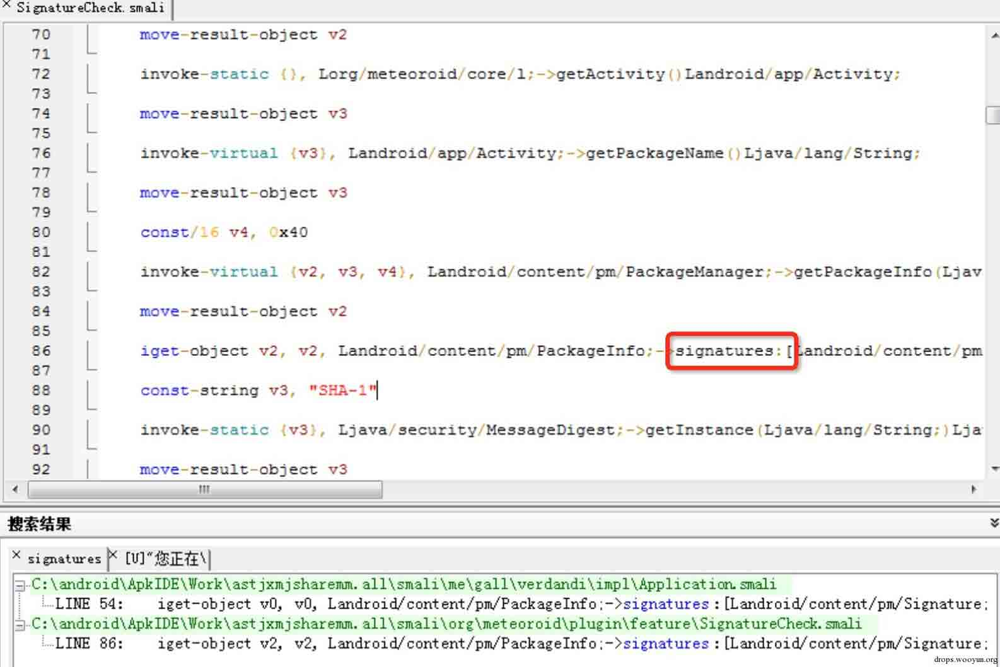

3、此处就是获取签名的，然后找程序判断签名的地方，进行修改，如下图，if-nez 是进行判断的地方，将 ne 修改为 eq。即 if-eqz v2, :cond_0。则程序就可以绕过本地的签名交易。


## 2.2.NDK 校验

将关键代码放到 so 中，在底层获取签名信息并验证。因为获取和验证的方法都封闭在更安全的 so 库里面，能够起到一定意义上的保护作用。实例如下：

1、使用 APKIDE 反编译 APK，不做任何操作，然后直接回编译，安装后运行,程序直接退出，无任何提示。

2、在 APKIDE 中搜索 signatures(或者搜索错误提示),定位到签名验证的代码处。

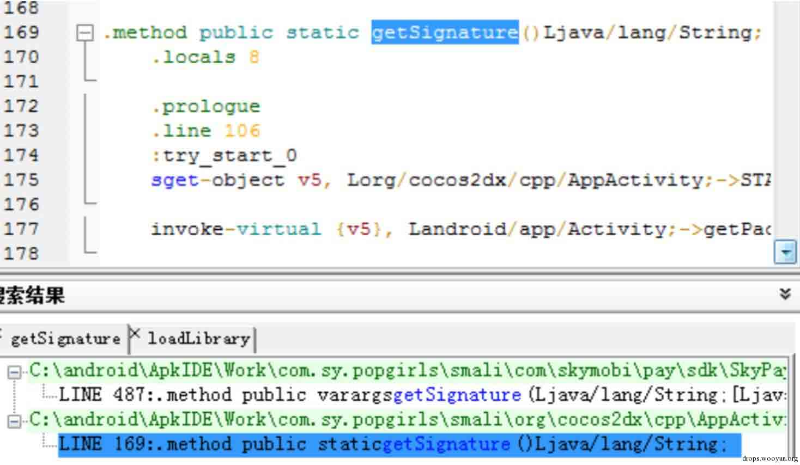

3、使⽤用 JD-GUI 打开 AppActivity，可以看到,此处是获取包名,然后进⾏行 MD5 计算。


4.在程序中搜索 getSignature,发现并没有调⽤用此函数的地⽅方,猜测在 so⽂文件中,搜索 loadLibrary。

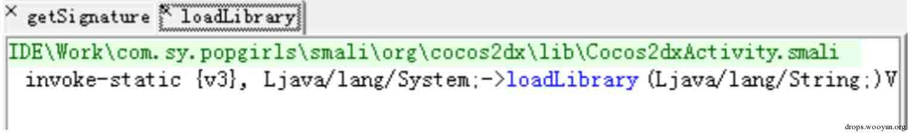

5.在代码中可以查找,可以找到调⽤用的是 libcocos2dcpp.so

6.使⽤用 IDA 打开 libcocos2dcpp.so,然后搜索 getSiganture,找到调⽤用此函数的地方。

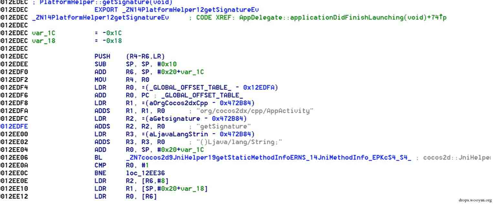

从代码中可以看到,此函数调⽤用了 org.cocos2dx.cpp.AppActivity.getSignature

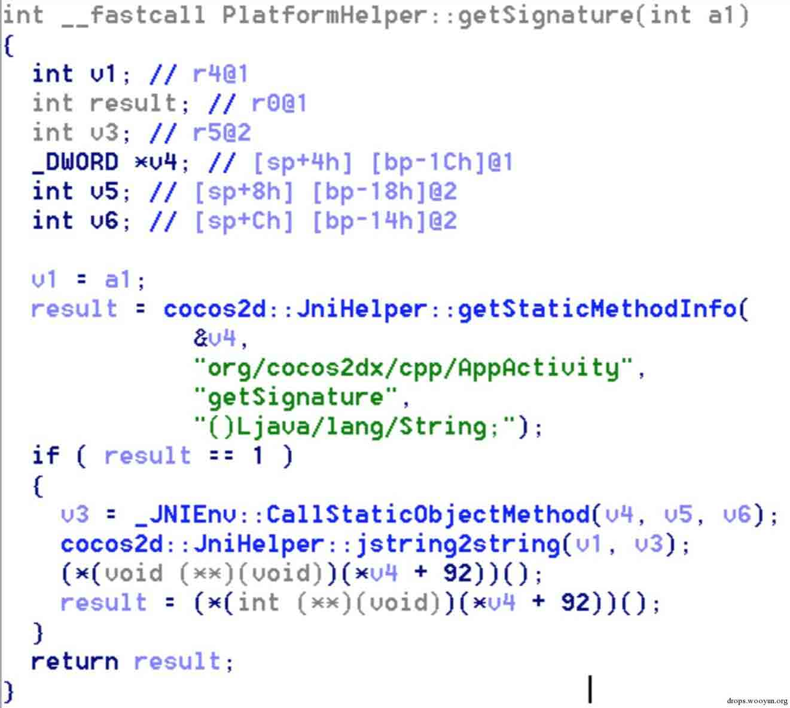

7、查看 F5 代码,发现此函数是判断签名的函数,然后我们双击此函数的调⽤者,部分代码如下。

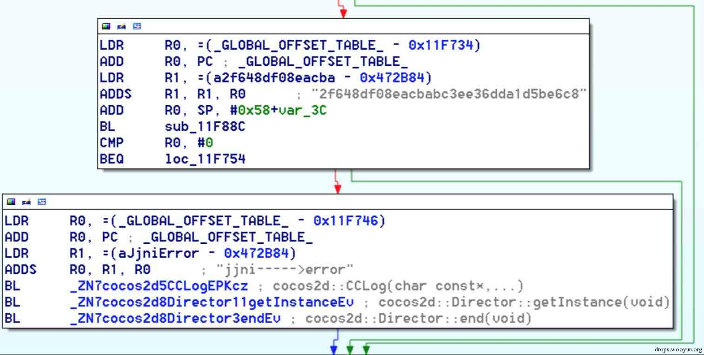

8、从上图可以看出,只需要修改 BEQ loc_11F754,让其不跳转到 jjni——>error,就可以绕过签名校验。 查看 HEX,使⽤010editor 跳到 0011F73E,修改 D0 为 D1。成功绕过签名校验。

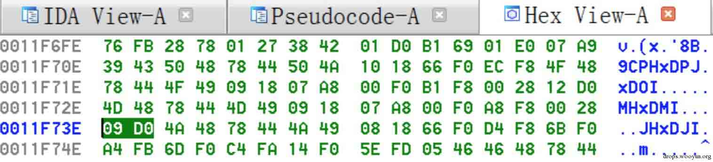

## 2.3.服务器验证

在 android 的 java 层获取签名信息，上传服务器在服务端进行签名然后返回验证结果。

如下图，网络验证时，如果网络没连接，一般都会提示错误。


既然是网络验证，肯定要把验证信息发送到服务端，然后进行验证，先看个简单的实例，下次会有个难度大的。

1、手机配置好抓包，然后抓包。第一种图是正常的 APK 的时候的数据包，第二个图是反编译的 APK 的数据包，通过对比，发现 cookie 中的 public_key 不一样，那么我们替换一下，发现可以正常使用 APK 的功能了。

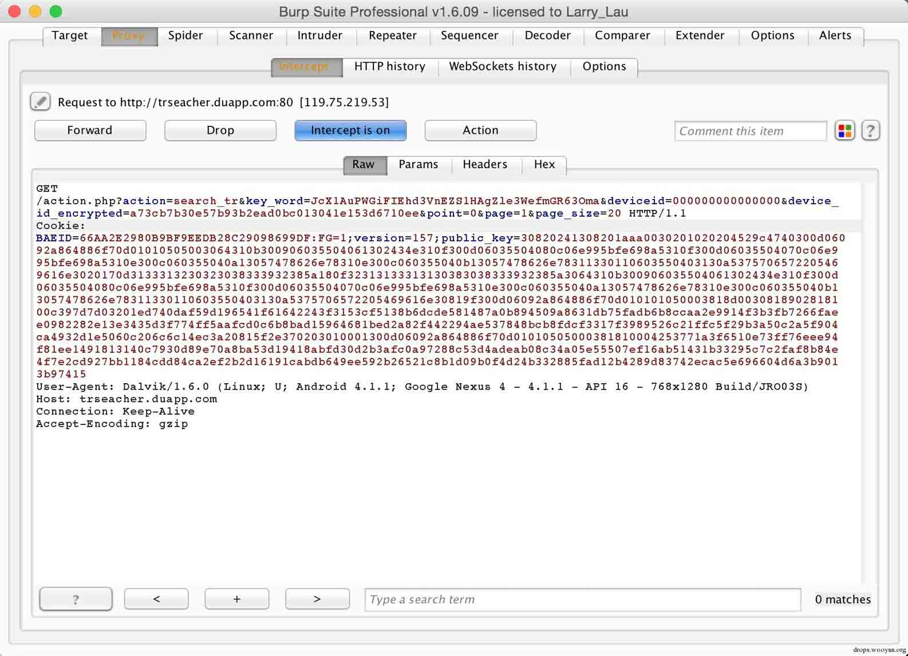

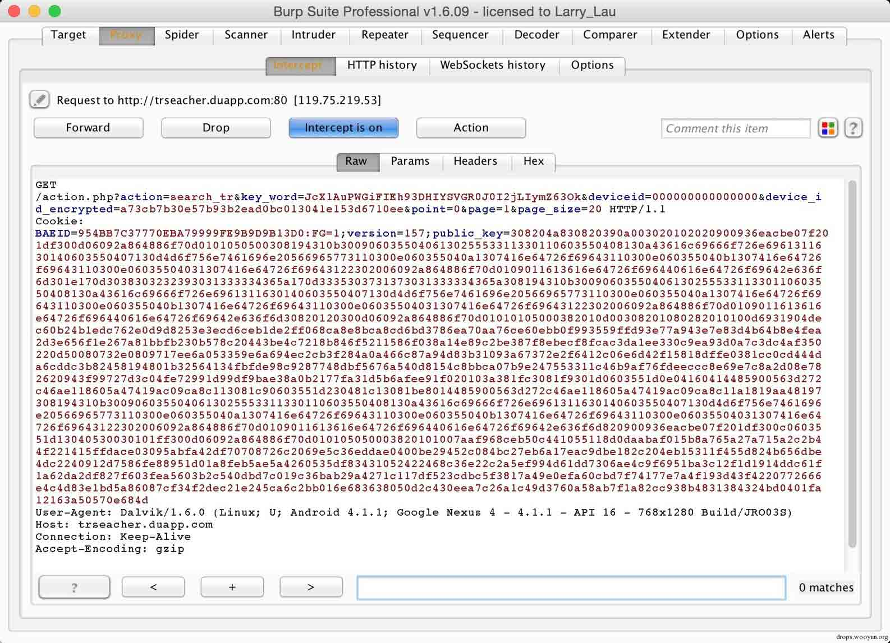

2、将正确的 public_key 添加到 APK 中。打开反编译的代码，搜索 signatures，定位到签名的代码。

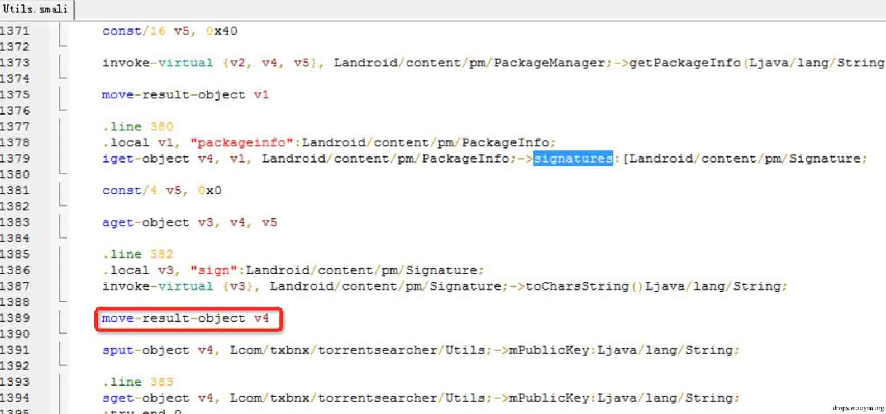

可以看到，代码将 signatures 的值传递到 V4 中，然后传递到 Utils->mPublicKey 函数中，于是我们将正确的 public_key 传给 V4。

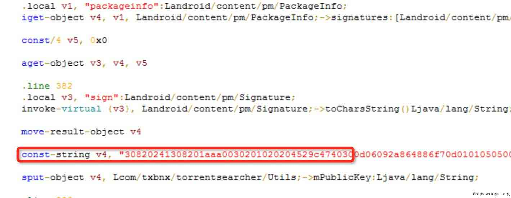

然后重新打包，重新安装就可以了。

## 0x03.总结

* * *

java 层的校验很容易就可以破解掉，在 so 层实现校验相对来说分析会更难点，而网络验证，如果仅仅是字符串的比较，那么也很容易破解掉。

码子码的太累了。。

后面还有几篇正在写的文章，包括 so 分析等等。

摘抄： http://www.blogjava.net/zh-weir/archive/2011/07/19/354663.html

版权声明：未经授权禁止转载 [3xpl0it](http://drops.wooyun.org/author/3xpl0it "由 3xpl0it 发布")@[乌云知识库](http://drops.wooyun.org)

分享到：碎银子打赏，作者好攒钱娶媳妇：


### 相关日志

*   [一次 app 抓包引发的 Android 分析（续）](http://drops.wooyun.org/tips/2986)
*   [Android 证书信任问题与大表哥](http://drops.wooyun.org/tips/3296)
*   [CoolPad backdoor CoolReaper](http://drops.wooyun.org/tips/4342)
*   [XDS: Cross-Device Scripting Attacks](http://drops.wooyun.org/papers/1472)
*   [Android Broadcast Security](http://drops.wooyun.org/tips/4393)
*   [Android UXSS 阶段性小结及自动化测试](http://drops.wooyun.org/tools/3186)