# 配置 ModSecurity 防火墙与 OWASP 规则

2014/07/22 11:01 | (等 TA 回来) | [web 安全](http://drops.wooyun.org/category/web "查看 web 安全 中的全部文章"), [技术分享](http://drops.wooyun.org/category/tips "查看 技术分享 中的全部文章") | 占个座先 | 捐赠作者

**from:http://resources.infosecinstitute.com/configuring-modsecurity-firewall-owasp-rules/**

## 0x00 背景

* * *

ModSecurity 是一个免费、开源的 Apache 模块，可以充当 Web 应用防火墙（WAF）。ModSecurity 是一个入侵探测与阻止的引擎.它主要是用于 Web 应用程序所以也可以叫做 Web 应用程序防火墙.ModSecurity 的目的是为增强 Web 应用程序的安全性和保护 Web 应用程序避免遭受来自已知与未知的攻击.

OWASP 是一个安全社区，开发和维护着一套免费的应用程序保护规则，这就是所谓 OWASP 的 ModSecurity 的核心规则集（即 CRS）。我们可以通过 ModSecurity 手工创建安全过滤器、定义攻击并实现主动的安全输入验证.

所以，在这篇文章中，我们将配置 ModSecurity 防火墙与 OWASP 的核心规则集。我们也将学习如何可以根据我们的需要自定义 OWASP 的核心规则集或创建自己的定制规则.

## 0x01 安装过程

* * *

本文是在 Centos 环境中安装和配置的，步骤如下：

**第 1 步**

以 root 用户身份登录到您的服务器，登录之后我们在安装 ModSecurity 之前需要安装一些依赖包，可以通过以下的命令安装：

```
yum install gcc make libxml2 libxml2-devel httpd-devel pcre-devel curl-devel –y 
```

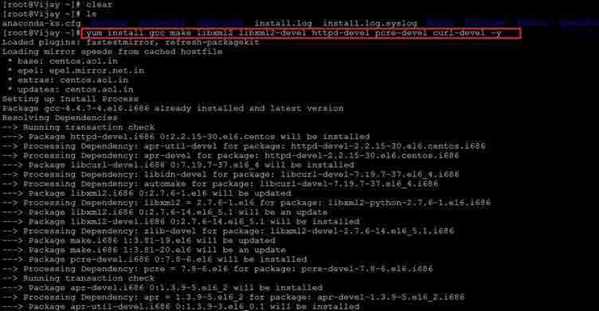

**第 2 步**
安装依赖包后，我们将安装 ModSecurity。我们可以通过运行以下命令进行安装：

```
yum install mod_security –y 
```

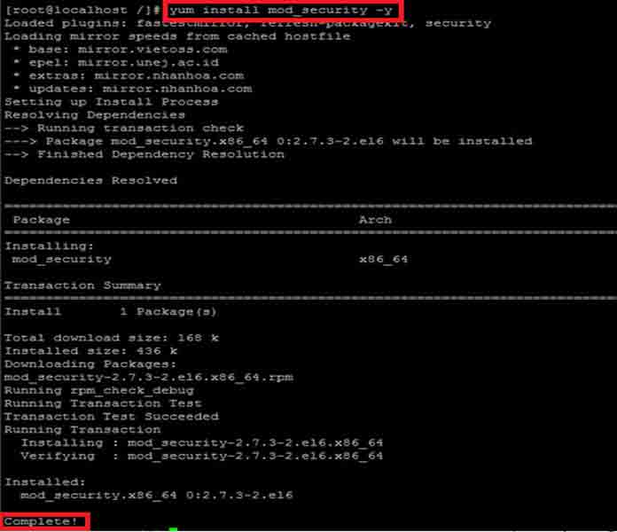

现在 ModSecurity 已经成功地安装在系统中。

**第 3 步**

ModSecurity 安装后，我们需要重新启动 Apache 服务器。我们可以通过下面的命令重启 Apache 服务器：

```
Services httpd restart 
```

或

```
在/etc/init.d/httpd restart 
```

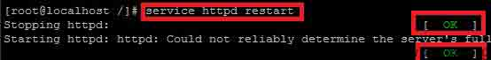

现在，我们已经成功地在服务器中安装了 ModSecurity，下一个步骤是下载和配置 OWASP 的 ModSecurity 规则。所以，我们必须将当前工作目录切换到/etc/httpd 的。这可以通过 cd 命令来完成。

```
cd /etc/httpd. 
```

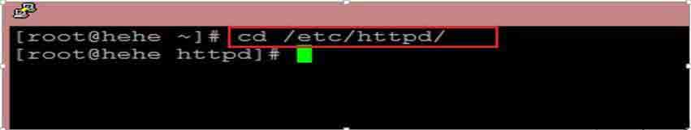

**第 4 步**

正如我们在文章的前面所提到的，我们的 ModSecurity 安装是不完美的，但我们需要增加我们的规则集。这可以通过 Github 的网站来完成。Github 上是一个开源的平台，让许多开发人员分享他们的项目和应用程序。通过 git 命令使用 clone 选项，可以下载 Github 服务器上的任何内容。因此，我们将导入预定义的 OWASP 的 ModSecurity 规则到我们的服务器。我们可以通过下面的命令做到这一点。

```
git clone https://github.com/SpiderLabs/owasp-modsecurity-crs.git 
```

("https://github.com/SpiderLabs/owasp-modsecurity-crs.git")

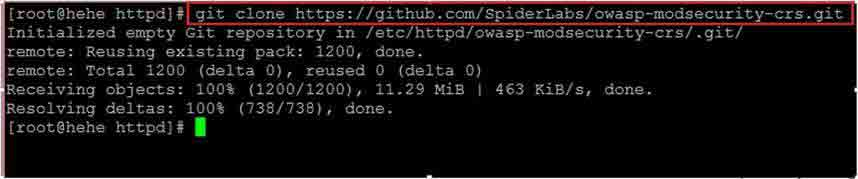

执行该命令后，OWASP 的 ModSecurity 规则将在 OWASP-MODSecurity-src 目录下保存。可以通过 ls 命令如下进行查看。

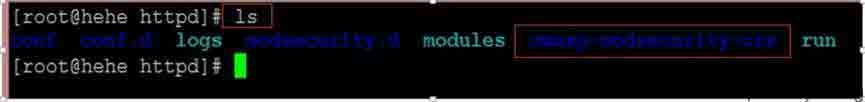

现在，我们必须重新命名 OWASP-MODSecurity-src 文件夹到 ModScurity-CRS。这可以通过 mv 命令来完成。

```
mv owasp-modsecurity-crs modsecurity-crs 
```

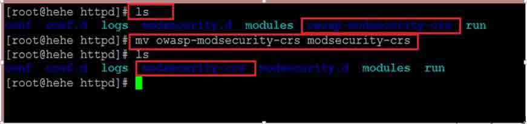

 我们可以通过运行 ls 命令验证。

**第 5 步**

我们必须将工作目录更改为 mod security-crs。这可以通过 cd 命令来完成。

```
cd modsecurity-crs 
```

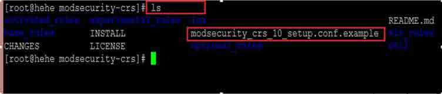

`Modsecurity_crs_10_setup.conf`是 ModSecurity 工作的主配置文件。默认情况下，它带有.example 扩展名。要初始化 ModSecurity，我们要重命名此文件。我们可以用 mv 命令重命名。

```
mv modsecurity_crs_10_setup.conf.example modsecurity_crs_10_setup.conf 
```

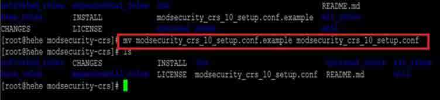

之后，我们要在 Apache 的配置文件中添加模块。要装入新的 ModSecurity 模块，编辑 Apache 的配置文件/etc/httpd/conf/httpd.conf。我们需要在终端中输入以下命令。

```
vi /etc/httpd/conf/httpd.conf 
```

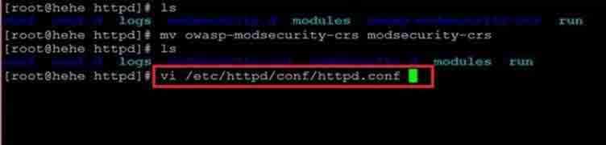

复制/粘贴以下内容到文件的末尾并保存文件。

```
<IfModule security2_module> 

Include modsecurity-crs/modsecurity_crs_10_config.conf

Include modsecurity-crs/base_rules/*.conf
</IfModule> 
```

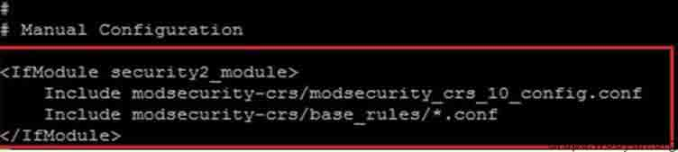

我们将重新启动 Apache 服务器。

**第 7 步**

现在的 ModSecurity 已经成功配置了 OWASP 的规则，但能够按照我们的选择让它工作，我们将不得不作出一个新的配置文件与我们自己的规则，这就是所谓的白名单文件。通过这个文件，我们就可以控制整个防火墙，创建自己的 ModSecurity 规则。我们将在 modsecurity.d 目录中创建的。打开/通过下面的命令来创建这个文件。

```
vi /etc/httpd/modsecuirty.d/whitelist.conf 
```


复制下面的规则并保存到该文件中。

```
#Whitelist file to control ModSec 

<IfModule mod_security2.c> 
SecRuleEngine On 
SecRequestBodyAccess On  
SecResponseBodyAccess On 

SecDataDir /tmp 

</IfModule> 
```

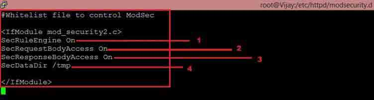

现在，我们保存文件并重新启动 Apache 服务器。下面对各行的意义进行说明。

## 0x02 配置说明

* * *

**1.SecRuleEngine**

是接受来自 ModSecurity-CRS 目录下的所有规则的安全规则引擎。因此，我们可以根据需求设置不同的规则。要设置不同的规则有以下几种。

**SecRuleEngine On**： 将在服务器上激活 ModSecurity 防火墙。它会检测并阻止该服务器上的任何恶意攻击。

**SecRuleEngine Detection Only**： 如果这个规则是在 whitelist.conf 文件中设置的，它只会检测到所有的攻击，并根据攻击产生错误，但它不会在服务器上阻止任何东西。

**SecRuleEngine Off:**： 这将在服务器上上停用 ModSecurity 的防火墙。

**2.SecRequestBodyAccess**： 它会告诉 ModSecurity 是否会检查请求。它起着非常重要的作用，当一个 Web 应用程序配置方式中，所有的数据在 POST 请求中。它只有两个参数，ON 或 OFF。我们可以根据需求设置。

**3.SecResponseBodyAccess**： 在 whiltelist.conf 文件，如果此参数设置为 ON，然后 ModeSecurity 可以分析服务器响应，并做适当处理。它也有只有两个参数，ON 和 Off。我们可以根据求要进行设置。

**4.SetDataDirectory**： 在本文中，我们定义的 ModSecurity 的工作目录。该目录将作为 ModSecurity 的临时目录使用。

ModSecurity 现在已经成功配置了 OWASP 的规则。现在，我们将测试对一些最常见的 Web 应用攻击。将测试 ModSecurity 是否挡住了攻击。

为了做到这一点，我们将尝试在一个存在存储性 xss 漏洞的网站上进行测试，我们已经配置 ModSecurity。在一个网站中最常见的 XSS 漏洞的位置将是搜索框，用户可以在网站上搜索任何东西。如果恶意用户试图在搜索框中注入 Java 脚本或 HTML 脚本，它会在浏览器中执行。我们可以在搜索框中输入 。在正常情况下（当我们的服务器上的没有任何类型的应用程序防火墙），它会在网站显示一个弹窗上本。

如果在服务器上已经平配置 ModSecurity，服务器会根据配置阻止 XSS 攻击，以及生成错误日志。

我们可以检查 ModSecurity 的错误日志文件。

在/var/logs/httpd/error_logs
我们可以通过下面的命令来检查文件的最后更新的行。

```
tail –f /var/logs/httpd/error_logs 
```


ModSecurity 核心规则集（CRS）提供以下类别的保户来防止攻击。

```
•HTTP Protection （HTTP 防御） - HTTP 协议和本地定义使用的 detectsviolations 策略。 
•Real-time Blacklist Lookups（实时黑名单查询） -利用第三方 IP 信誉。 
•HTTP Denial of Service Protections（HTTP 的拒绝服务保护） -防御 HTTP 的洪水攻击和 HTTP  
Dos 攻击。  
•Common Web Attacks Protection（常见的 Web 攻击防护） -检测常见的 Web 应用程序的安全攻击。  
•Automation Detection（自动化检测） -检测机器人，爬虫，扫描仪和其他表面恶意活动。  
•Integration with AV Scanning for File Uploads（文件上传防病毒扫描） -检测通过 Web 应用程序上传的恶意文件。  
•Tracking Sensitive Data（跟踪敏感数据） -信用卡通道的使用，并阻止泄漏。  
•Trojan Protection（木马防护） -检测访问木马。  
•Identification of Application Defects （应用程序缺陷的鉴定）-应用程序的错误配置警报。  
•Error Detection and Hiding（错误检测和隐藏） -伪装服务器发送错误消息。 
```

## 0x03 参考文章:

* * *

https://www.owasp.org/index.php/Category:OWASP_ModSecurity_Core_Rule_Set_Project

http://spiderlabs.github.io/owasp-modsecurity-crs/

http://www.modsecurity.org/demo/crs-demo.html

http://www.atomicorp.com/wiki/index.php/Mod_security

https://github.com/SpiderLabs/owasp-modsecurity-crs

https://www.owasp.org/index.php?title=Projects/OWASP_ModSecurity_Core_Rule_Set_Project/Releases/ModSecurity_2.0.6/Assessment&setlang=es

版权声明：未经授权禁止转载 (等 TA 回来)@[乌云知识库](http://drops.wooyun.org)

分享到：

### 相关日志

*   [InsightScan:Python 多线程 Ping/端口扫描 + HTTP 服务/APP 探测，可生成 Hydra 用的 IP 列表](http://drops.wooyun.org/tools/427)
*   [Shell Injection & Command Injection](http://drops.wooyun.org/papers/1018)
*   [PHP 漏洞挖掘思路+实例 第二章](http://drops.wooyun.org/tips/858)
*   [Codeigniter 利用加密 Key（密钥）的对象注入漏洞](http://drops.wooyun.org/papers/1449)
*   [Drupal – pre Auth SQL Injection Vulnerability](http://drops.wooyun.org/papers/3197)
*   [Flash 安全的一些总结](http://drops.wooyun.org/tips/153)