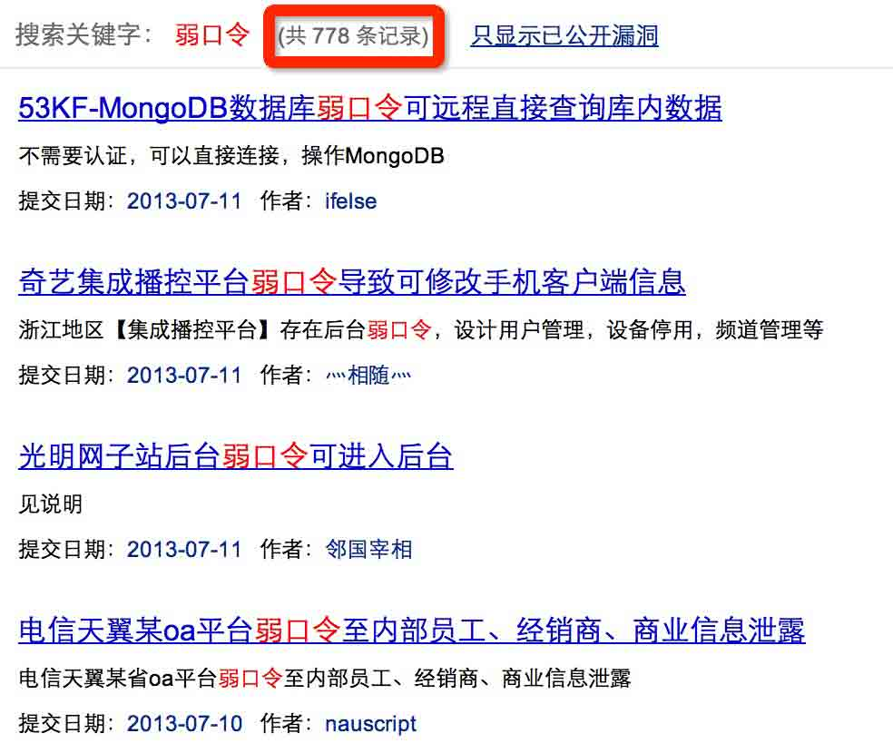

# 浅谈互联网中弱口令的危害

2013/07/12 17:07 | [瞌睡龙](http://drops.wooyun.org/author/瞌睡龙 "由 瞌睡龙 发布") | [漏洞分析](http://drops.wooyun.org/category/papers "查看 漏洞分析 中的全部文章"), [运维安全](http://drops.wooyun.org/category/%e8%bf%90%e7%bb%b4%e5%ae%89%e5%85%a8 "查看 运维安全 中的全部文章") | 占个座先 | 捐赠作者

### 0x00 什么是弱口令

* * *

弱口令(weak password) 没有严格和准确的定义，通常认为容易被别人（他们有可能对你很了解）猜测到或被破解工具破解的口令均为弱口令。

弱口令指的是仅包含简单数字和字母的口令，例如“123”、“abc”等，因为这样的口令很容易被别人破解，从而使用户的互联网账号受到他人控制，因此不推荐用户使用。

### 0x01 为什么会产生弱口令

* * *

这个应该是与个人习惯相关与意识相关，为了避免忘记密码，使用一个非常容易记住的密码，或者是直接采用系统的默认密码等。

相关的安全意识不够，总认为不会有人会猜到我这个弱口令的。

### 0x02 弱口令的危害

* * *

在当今很多地方以用户名(帐号)和口令作为鉴权的世界，口令的重要性就可想而知了。

口令就相当于进入家门的钥匙，当他人有一把可以进入你家的钥匙，想想你的安全、你的财物、你的隐私。

因为弱口令很容易被他人猜到或破解，所以如果你使用弱口令，就像把家门钥匙放在家门口的垫子下面，是非常危险的。

那么互联网上到底存在多少弱口令或默认密码呢？

截止到写此文章开始，乌云提交平台上弱口令相关漏洞已经多达 778 个，除了泄露数据以外，其中不少可以利用弱口令而获取服务器权限。



这里上报的漏洞，大部分仅仅是后台管理，运维服务器等弱口令。

那么网民的个人账号呢？

从 11 年 CSDN 明文密码泄露后，相继几个大互联网企业用户数据泄露。

由于非常多的网民互联网上账号密码通用，导致一家数据泄露，网民在互联网上的其他账号也受到牵连。

作者认为你的密码在表面上不是弱口令，但是已经被其他人获知，也可归属为弱口令范围了。

再看一下乌云上的案例：

[WooYun: 豆瓣网帐号暴力破解漏洞，测试 1 万，成功 391 个](http://www.wooyun.org/bugs/wooyun-2012-014427)

[WooYun: 猫扑验证码设计缺陷，扫号 10 万，成功破解 782 个](http://www.wooyun.org/bugs/wooyun-2012-014224)

[WooYun: 1 号店暴力破解，测试 1 万帐号，成功破解 125 个](http://www.wooyun.org/bugs/wooyun-2012-014186)

看完你应该知道，事情过了这么久，在多家互联网厂商通知用户修改密码的情况下，仍然有很多用户没有修改常用密码。

### 0x03 解决办法

* * *

针对后台或者网络管理员的弱口令比较好解决，强制对所有的管理系统账号密码强度必须达到一定的级别。

不可在使用简单的 admin、123456 等弱密码了。附赠一个常用密码的列表，供各位自行搜索自己常用的弱口令是否在里面（禁止用作非法用途）。

弱口令 top100：

```
123456789
a123456
123456
a123456789
1234567890
woaini1314
qq123456
abc123456
123456a
123456789a
147258369
zxcvbnm
987654321
12345678910
abc123
qq123456789
123456789.
7708801314520
woaini
5201314520
q123456
123456abc
1233211234567
123123123
123456.
0123456789
asd123456
aa123456
135792468
q123456789
abcd123456
12345678900
woaini520
woaini123
zxcvbnm123
1111111111111111
w123456
aini1314
abc123456789
111111
woaini521
qwertyuiop
1314520520
1234567891
qwe123456
asd123
000000
1472583690
1357924680
789456123
123456789abc
z123456
1234567899
aaa123456
abcd1234
www123456
123456789q
123abc
qwe123
w123456789
7894561230
123456qq
zxc123456
123456789qq
1111111111
111111111
0000000000000000
1234567891234567
qazwsxedc
qwerty
123456..
zxc123
asdfghjkl
0000000000
1234554321
123456q
123456aa
9876543210
110120119
qaz123456
qq5201314
123698745
5201314
000000000
as123456
123123
5841314520
z123456789
52013145201314
a123123
caonima
a5201314
wang123456
abcd123
123456789..
woaini1314520
123456asd
aa123456789
741852963
a12345678 
```

而针对泄露的数据库，导致网民通用的互联网账号都被盗的情况，除了教导网民修改常用密码，网站密码尽量不通用之外。

互联网企业也可做一些技术上的限制，防止批量验证账号的行为。

例如统一登录接口，频繁登陆错误触发验证码，单位时间内验证的过多封杀 ip 等等多个维度做限制。

相信很多互联网企业安全人员已经与批量撞号来获取用户价值的人搏斗很久了:) 加油~！

**Tags:** [弱口令](http://drops.wooyun.org/tag/%e5%bc%b1%e5%8f%a3%e4%bb%a4)

版权声明：未经授权禁止转载 [瞌睡龙](http://drops.wooyun.org/author/瞌睡龙 "由 瞌睡龙 发布")@[乌云知识库](http://drops.wooyun.org)

分享到：碎银子打赏，作者好攒钱娶媳妇：


### 相关日志

*   [snmp 弱口令引起的信息泄漏](http://drops.wooyun.org/tips/409)
*   [加盐 hash 保存密码的正确方式](http://drops.wooyun.org/papers/1066)
*   [邮箱伪造详解](http://drops.wooyun.org/papers/534)
*   [从乌云看运维安全那点事儿](http://drops.wooyun.org/papers/410)
*   [电商网站的安全性](http://drops.wooyun.org/papers/741)
*   [Memcache 安全配置](http://drops.wooyun.org/papers/865)