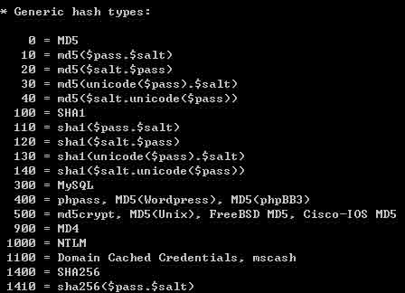
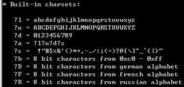

# GPU 破解神器 Hashcat 使用简介

2013/09/30 20:13 | [ccSec](http://drops.wooyun.org/author/ccSec "由 ccSec 发布") | [工具收集](http://drops.wooyun.org/category/tools "查看 工具收集 中的全部文章") | 占个座先 | 捐赠作者

## 0x00 背景

* * *

目前 GPU 的速度越来越快，使用 GPU 超强的运算速度进行暴力密码破解也大大提高了成功率，曾经看到老外用 26 块显卡组成的分布式破解神器让我羡慕不已。要说目前最好的 GPU 破解 HASH 的软件，非 HashCat 莫属了。下面我就为大家具体介绍一下 HashCat 系列软件。

## 0x01 所需硬件及系统平台

* * *

HashCat 系列软件在硬件上支持使用 CPU、NVIDIA GPU、ATI GPU 来进行密码破解。在操作系统上支持 Windows、Linux 平台，并且需要安装官方指定版本的显卡驱动程序，如果驱动程序版本不对，可能导致程序无法运行。

如果要搭建多 GPU 破解平台的话，最好是使用 Linux 系统来运行 HashCat 系列软件，因为在 windows 下，系统最多只能识别 4 张显卡。并且，Linux 下的 VisualCL 技术（关于如何搭建 VisualCL 环境，请参考官方文档[`hashcat.net/wiki/doku.php?id=vcl_cluster_howto`](http://hashcat.net/wiki/doku.php?id=vcl_cluster_howto)），可以轻松的将几台机器连接起来，进行分布式破解作业。 在破解速度上，ATI GPU 破解速度最快，使用单张 HD7970 破解 MD5 可达到 9000M/s 的速度，其次为 NVIDIA 显卡，同等级显卡 GTX690 破解速度大约为 ATI 显卡的三分之一，速度最慢的是使用 CPU 进行破解。

## 0x02 HashCat 软件简介

* * *

HashCat 主要分为三个版本：Hashcat、oclHashcat-plus、oclHashcat-lite。这三个版本的主要区别是：HashCat 只支持 CPU 破解。oclHashcat-plus 支持使用 GPU 破解多个 HASH，并且支持的算法高达 77 种。oclHashcat-lite 只支持使用 GPU 对单个 HASH 进行破解，支持的 HASH 种类仅有 32 种，但是对算法进行了优化，可以达到 GPU 破解的最高速度。如果只有单个密文进行破解的话，推荐使用 oclHashCat-lite。

目前最新的软件版本为 HashCat v0.46、oclHashcat-plus v0.15、oclHashcat-lite v0.15。但是经过一段时间的测试，发现有时候版本越高，速度越慢。所以推荐在使用没有问题的情况下，无需升级到最新版本。根据测试，oclHashcat-lite v0.10 的运算速度比 v0.15 的运算速度快 20%，所以单个密文破解还是推荐使用 oclHashcat-lite v0.10。

## 0x03 HashCat 软件使用

* * *

HashCat 系列软件拥有十分灵活的破解方式，可以满足绝大多数的破解需求，下面我就为大家简单介绍一下。

### 1.指定 HASH 类型

在 HashCat 中--hash-type ?参数可以指定要破解的 HASH 类型，运行 hashcat 主程序加上--help 参数，在`* Generic hash types:`中可以看到各种 HASH 类型的代号，如图所示：  

不同版本的 HashCat 所支持的 hash 类型有所不同，如果没有指定--hash-type 参数，那么程序默认为 MD5 类型。

### 2.指定破解模式

在 HashCat 中`--attack-mode ?`参数可以可以指定破解模式，软件一共支持 5 种破解模式，分别为

```
0 Straight（字典破解）
1 Combination（组合破解）
3 Brute-force（掩码暴力破解）
6 Hybrid dict + mask（混合字典+掩码）
7 Hybrid mask + dict（混合掩码+字典） 
```

下面为大家介绍两个最常用的破解方式：字典破解和掩码暴力破解。

#### 使用字典破解 MD5：

```
oclHashcat-plus64.exe --hash-type 0 --attack-mode 0 {HASH 文件} [字典 1] [字典 2] [字典 3]… 
```

如：

```
oclHashcat-plus64.exe --hash-type 0 --attack-mode 0 d:md5.txt d:dict1.txt d:dict2.txt 
```

字典破解由于受到磁盘和内存速度的影响，速度无法达到 GPU 的最大运算速度，基本上一个 5GB 的字典，对于 MD5 破解来说 10 分钟内可以跑完。

#### 使用掩码暴力破解 SHA1：

```
oclHashcat-plus64.exe --hash-type 100 --attack-mode 3 {HASH 文件} [掩码] 
```

#### {掩码的设置}

对于掩码，这边需要稍微做一个说明。Hashcat 默认的掩码一共有 9 种，如图所示：



?l 表示 a-z，?u 表示 A-Z，?d 表示 0-9，?a 表示键盘上所有的特殊字符，?s 表示键盘上所有的可见字符，?h 表示 8bit 0xc0-0xff 的十六进制，?D 表示 8bit 的德语字符，?F 表示 8bit 的法语字符，?R 表示 8bit 的俄语字符。

那么有同学可能会问了，如果我要用掩码表示小写+数字怎么办呢？这就需要用到自定义字符集这个参数了。软件支持用户最多定义 4 组字符集，分别用

```
--custom-charset1 [chars]
--custom-charset2 [chars]
--custom-charset3 [chars]
--custom-charset4 [chars] 
```

来表示，在掩码中用?1、?2、?3、?4 来表示。

比如说我要设置自定义字符集 1 为小写+数字，那么就加上

```
-- custom-charset1 ?l?d 
```

如果要设置自定义字符集 2 为 abcd1234，那么就加上

```
--custom-charset2 abcd1234 
```

如果要破解 8 位的小写+数字，那么需要设置自定义字符集 1 为

```
--custom-charset1 ?l?d 
```

设置掩码为?1?1?1?1?1?1?1?1。 如果已知密码的第一位为数字，长度为 8 位，后几位为大写+小写，那么需要设置自定义字符集 1 为

```
--custom-charset1 ?l?u 
```

设置掩码为?d?1?1?1?1?1?1?1。

#### {掩码的长度}

对于已知长度的密码，可以使用固定长度的掩码进行破解。比如要破解 11 位数字，就可以这样写掩码?d?d?d?d?d?d?d?d?d?d?d。

对于想要破解一些未知长度的密码，希望软件在一定长度范围内进行尝试的，可以使用--increment 参数，并且使用--increment-min ?定义最短长度，使用--increment-max ?定义最大长度。比如要尝试 6-8 位小写字母，可以这样写

```
--increment --increment-min 6 --increment-max 8 ?l?l?l?l?l?l?l?l 
```

#### {举例}

破解 8-11 位数字+小写

```
oclHashcat-plus64.exe --hash-type 100 --attack-mode 3 --increment --increment-min 8 --increment-max 11 --custom-charset1 ?l?d d:sha1.txt ?1?1?1?1?1?1?1?1?1?1?1 
```

## 0x04 HashCat 参数优化

* * *

HashCat 本身考虑到系统资源的分配，默认参数下并没有最大化的来使用硬件资源。如果我们想要让破解速度最大化，就需要对一些参数进行配置。

### 1.Workload tuning 负载调优。

该参数支持的值有 1,8,40,80,160

```
--gpu-accel 160 
```

可以让 GPU 发挥最大性能。

### 2.Gpu loops 负载微调

该参数支持的值的范围是 8-1024（有些算法只支持到 1000）。

```
--gpu-loops 1024 
```

可以让 GPU 发挥最大性能。

### 3.Segment size 字典缓存大小

该参数是设置内存缓存的大小，作用是将字典放入内存缓存以加快字典破解速度，默认为 32MB，可以根据自身内存情况进行设置，当然是越大越好 XD。

```
--segment-size 512 
```

可以提高大字典破解的速度。

## 0x05 结束语

* * *

本文只是简单介绍 HashCat 的一些常见用法，希望能够让大家更快的学会 HashCat 的使用。本人刚接触 Hashcat 不久，如果文章有什么缺点或不足也希望大家能够及时提出，在使用过程当中有什么疑问可以跟帖提问。如果想要更加详细的了解 HashCat，请大家参阅官方文档：[`hashcat.net/wiki/`](http://hashcat.net/wiki/)。

版权声明：未经授权禁止转载 [ccSec](http://drops.wooyun.org/author/ccSec "由 ccSec 发布")@[乌云知识库](http://drops.wooyun.org)

分享到：

### 相关日志

*   [Wordpress 3.8.2 补丁分析 HMAC timing attack](http://drops.wooyun.org/papers/1404)
*   [从内存中窃取未加密的 SSH-agent 密钥](http://drops.wooyun.org/tips/2719)
*   [Zmap 详细用户手册和 DDOS 的可行性](http://drops.wooyun.org/tools/515)
*   [逆向基础（三）](http://drops.wooyun.org/tips/1963)
*   [逆向基础（四）](http://drops.wooyun.org/tips/2046)
*   [使用 sqlmap 中 tamper 脚本绕过 waf](http://drops.wooyun.org/tools/4760)