# Windows 内核提权漏洞 CVE-2014-4113 分析报告

2014/10/23 16:48 | [百度安全攻防实验室](http://drops.wooyun.org/author/百度安全攻防实验室 "由 百度安全攻防实验室 发布") | [漏洞分析](http://drops.wooyun.org/category/papers "查看 漏洞分析 中的全部文章") | 占个座先 | 捐赠作者

## 0x00 漏洞背景

* * *

近日 CrowdStrike 团队发现 Win64bit2008 R2 服务器系统上存在可疑攻击行为，并捕获到相关样本。百度安全攻防实验室根据外界放出的 poc 进行了研究，漏洞成因和利用细节如下。 此类提权漏洞曾经出现在 2011 年的 8 个 CVE 中(CVE-2011-1878~CVE-2011-1885)，由挪威安全公司 Norman 的内核漏洞达人 TarjeiMandt(@kernelpool)报告的（微软公告编号 MS11-054），其相关的细节未被公开。 2013 年，MJ0011 曾经因分析蓝屏崩溃 dump 文件，重现了此类漏洞并编写了 poc 和分析文章。

此次漏洞 poc 运行后的截图如下：

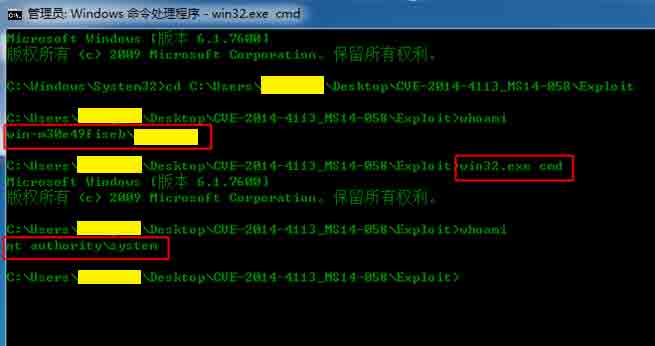

以普通用户权限运行 poc 成功后，一个 system 权限的 cmd 进程被创建出来，说明提权成功，已从普通用户权限提升到了系统 system 最高权限。

## 0x01 漏洞分析

* * *

漏洞主要发生在 win32k!xxxTrackPopupMenuEx 函数中，该函数用于弹出一个菜单，是同步的，也就是说只有等菜单弹出并选择之后才返回的，漏洞发生的根本原因在于可以让该函数执行过程中中断一次并执行 ring3 代码再返回继续执行;

以下是来自 win32k!xxxTrackPopupMenuEx 函数中部分代码：

1.经过一系列的初始化工作后，调用 win32k!xxxMNLoop 进入菜单循环等待选择：

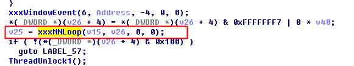

2.跟进 win32k!xxxMNLoop ,win32k!xxxMNLoop 在进入真正的 while 循环之前会调用 win32k!xxxHandleMenuMessages :

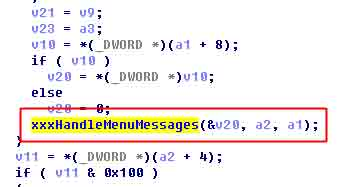

3.继续跟进 win32k!xxxHandleMenuMessages ,其会事先调用 win32k!xxxMNFindWindowFromPoint 来得到菜单窗口对象指针 ptagWND，之后再调用 win32k!xxxSendMessage 给菜单窗口发送消息：

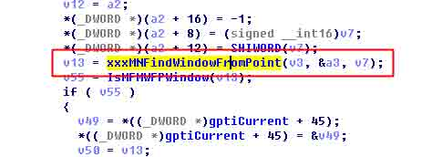

4.继续跟进 win32k!MNFindWindowFromPoint，其会调用 win32k!xxxSendMessage 给句柄窗口发送消息来确定菜单窗口坐标，可以看到消息值为：0x1EB(MN_FINDWINDOWFROMPOINT)

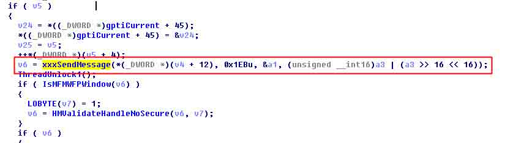

5.POC 在应用层安装了一个 WH_WNDPROC 钩子，将这个消息（MN_FINDWINDOWFROMPOINT）给拦截下来，并在其窗口处理线程上下文中调用了 EndMenu 让菜单窗口销毁，下面是样本中的应用层代码：

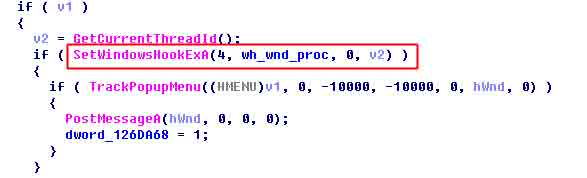

Wh_wnd_proc:


Wnd_proc_long:

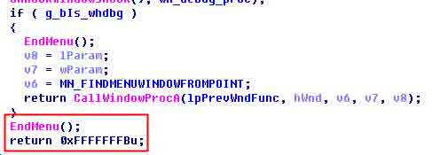

之所以在钩子函数还要多一步通过 SetWindowLong 设置窗口函数，在窗口函数里再调用 EndMenu 是因为得在窗口处理函数线程的上下文空间中调用 EndMenu 才有意义(每个窗口都有与之关联的 pti--tagTHREADINFO).

6.可以看到，由于 win32k!xxxSendMessage 是异步的，调用完应用层代码（即菜单窗口已经销毁）返回到 win32k!xxxMNFindWindowFromPoint, 此时由于失败，win32k!xxxMNFindWindowFromPoint 返回 0xFFFFFFFB, 回到 win32k!xxxHandleMenuMessages

7.回到 win32k!xxxHandleMenuMessages 之后，问题来了，原因就在于其在检查 win32k!xxxMNFindWindowFromPoint 函数的返回值 ptagWnd 的合法性时的不严谨，便直接调用 win32k!xxxSendMessage(ptagWnd …….);

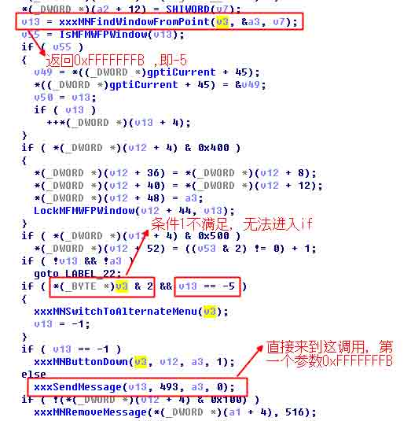

8.由于调用 xxxSendMessage(ptagWnd ,….)的参数 ptagWnd 为 0xFFFFFFFB, 在函数内会取 tagWND.lpfnWndProc 字段，并调用该函数，该字段的偏移为: 0x60 , 即地址 0Xfffffffb+0x60=0x5B,所有在样本中事先申请了 0 页面内存，并向 0x5B 处写入了 shellcode 地址，从而实现了 exploit.

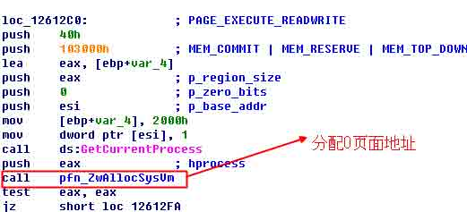


至此，上面就是整个漏洞的流程分析了。

9.最后给出一份直观的流程图：

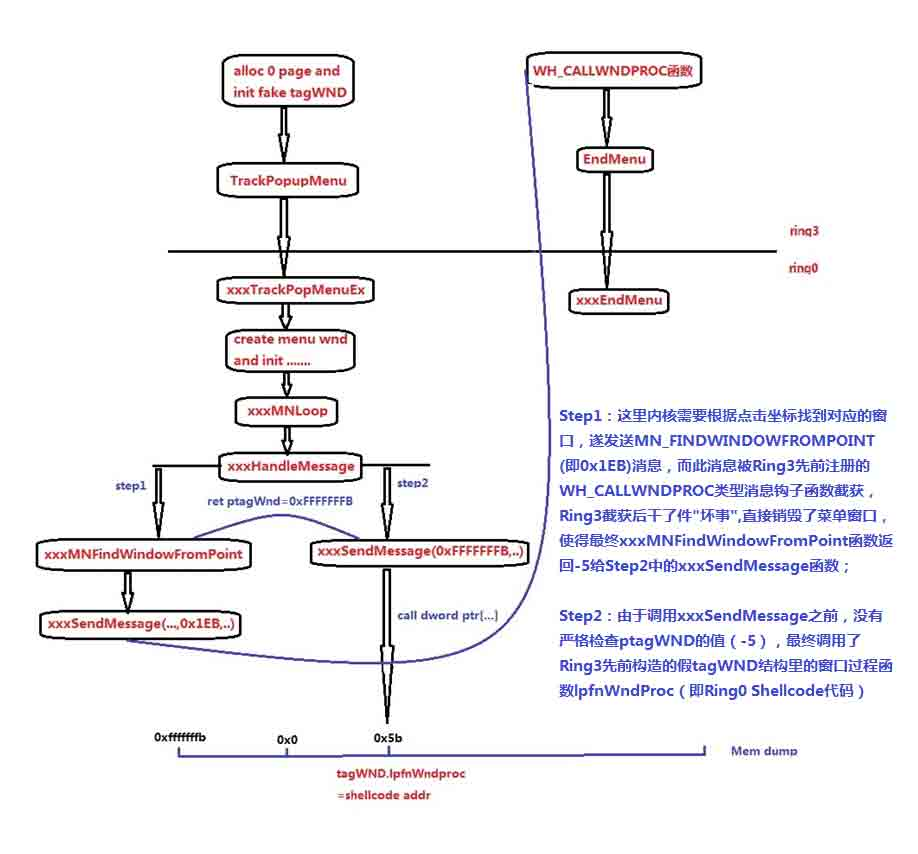

下面通过调试来重现整个情景；

0x02 漏洞重现与调试

* * *

1.应用层与内核层同时进行调试，内核层下条件断点

```
win32k!xxxFindWindowFromPoint :
bpwin32k!xxxFindWindowFromPoint ".if poi(poi(poi(fs:0x124)+0x50)+0xb4) = 0x130 {} .else {gc}"  ----0x130 为进程 ID 
```

应用层单步到分配 0 页面构造 Fake TagWnd 时，查看 0 页面：


2.应用层继续单步到 call TrackPopMenu 时.

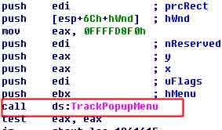

1.应用层 F8 单步步过 call TrackPopMenu 时, 内核层 win32k!xxxFindWindowFromPoint 断下，可以看到其调用栈如下

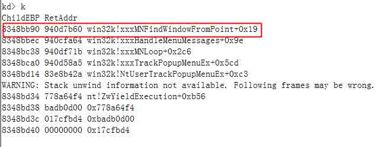

2.win32k!xxxFindWindowFromPoint 单步到调用 xxxSendMessage(MN_FINDWINDOWFROMPOINT)时,并在应用层的窗口函数 Wnd_proc_long 下断点：

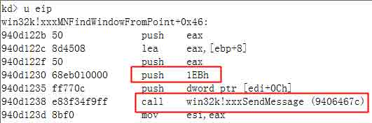

3.F10 步过 call xxxSendMessage 时，应用层 Wnd_proc_long 断下：

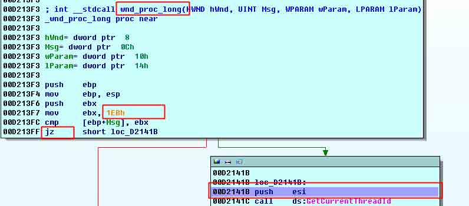

如果是 0x1EB(MN_FINDWINDOWFROMPOINT)消息，则进入到如下：

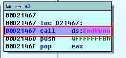

4.回到内核层单步从 xxxMNFindWindowFromPoint 返回到 xxxHandleMenuMessages，此时：

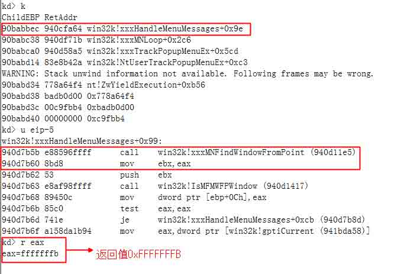

5.xxxHandleMessages 继续执行，单步到调用 xxxSendMessage()时：窗口对象 ptagWnd 为 xxxMNFindWindowFromPoint()返回值：0xFFFFFFFB :


6.此时查看 patgWnd -00xFFFFFFFB:


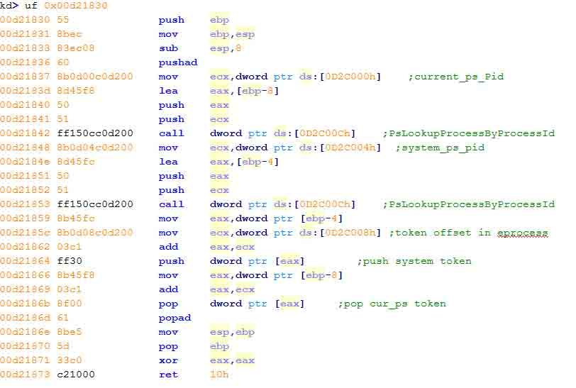

7.下断点“ba r4 0x5c“ ,”bp 0x00d21830” , g 运行 ,来到断点处：

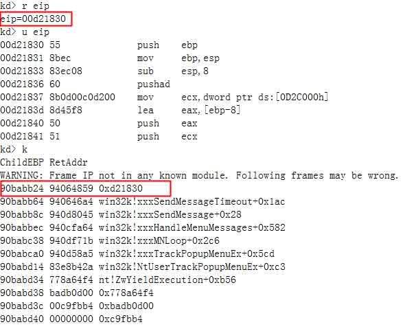

至此可看到，ShellCode 已执行成功~~~~~;

## 0x03 参考链接

* * *

1.  [crowdstrike 《CrowdStrike Discovers Use of 64-bit Zero-Day Privilege Escalation Exploit (CVE-2014-4113) by Hurricane Panda》](http://blog.crowdstrike.com/crowdstrike-discovers-use-64-bit-zero-day-privilege-escalation-exploit-cve-2014-4113-hurricane-panda/)
2.  [微软 《Microsoft 安全公告 MS14-058 - 严重》](https://technet.microsoft.com/zh-CN/library/security/ms14-058.aspx)
3.  [MJ0011 《从 Dump 到 POC 系列一:Win32k 内核提权漏洞分析》](http://blogs.360.cn/blog/dump-to-poc-to-win32k-kernel-privilege-escalation-vulnerability/)

版权声明：未经授权禁止转载 [百度安全攻防实验室](http://drops.wooyun.org/author/百度安全攻防实验室 "由 百度安全攻防实验室 发布")@[乌云知识库](http://drops.wooyun.org)

分享到：

### 相关日志

*   [CVE-2014-0038 内核漏洞原理与本地提权利用代码实现分析](http://drops.wooyun.org/papers/3795)
*   [Exploiting “BadIRET” vulnerability (CVE-2014-9322, Linux kernel privilege escalation)](http://drops.wooyun.org/papers/4860)
*   [Trying to hack Redis via HTTP requests](http://drops.wooyun.org/papers/3062)
*   [理解 php 对象注入](http://drops.wooyun.org/papers/4820)
*   [Python Pickle 反序列化带来的安全问题](http://drops.wooyun.org/papers/66)
*   [WordPress 3.5.1 远程代码执行 EXP](http://drops.wooyun.org/papers/785)