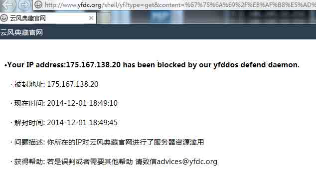
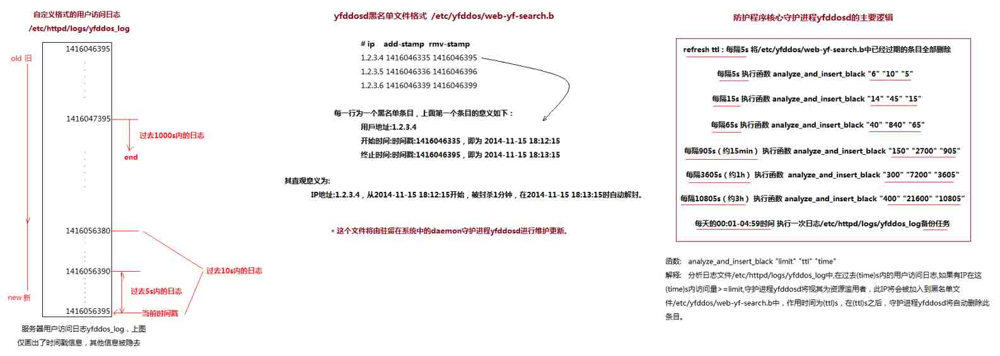
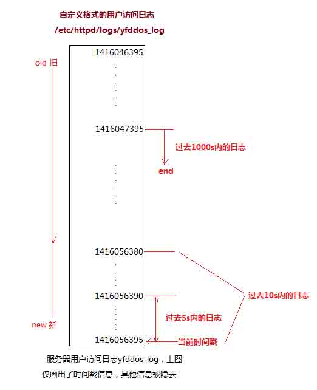
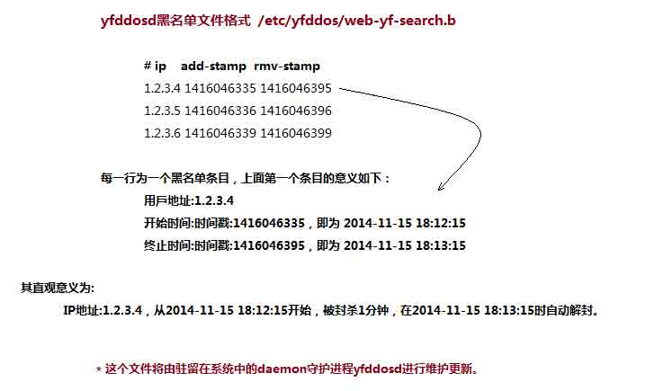
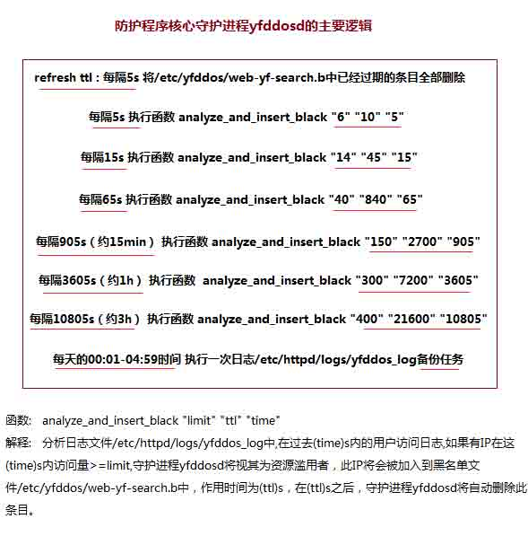

# 应对 CC 攻击的自动防御系统——原理与实现

2014/12/03 11:03 | [燕云](http://drops.wooyun.org/author/燕云 "由 燕云 发布") | [运维安全](http://drops.wooyun.org/category/%e8%bf%90%e7%bb%b4%e5%ae%89%e5%85%a8 "查看 运维安全 中的全部文章") | 占个座先 | 捐赠作者

## 0x00 系统效果

* * *

此 DDOS 应用层防御系统已经部署在了[`www.yfdc.org`](http://www.yfdc.org "http://www.yfdc.org")网站上(如果访问失败,请直接访问位于国内的服务器[`121.42.45.55`](http://121.42.45.55 "http://121.42.45.55")进行在线测试)。

此防御系统位于应用层，可以有效防止非法用户对服务器资源的滥用:

```
只要是发送高频率地、应用层请求以实现大量消耗系统资源的攻击方式，皆可有效防御。 
```

其实现的基本思想是:

```
定期分析所有访问用户在过去各个时间段内的请求频率，将频率高于指定阈值的用户判定为资源滥用者，将其封杀一段时间，时效过后，防御系统自动将其解封。 
```

**在线效果测试:**

进入[`www.yfdc.org`](http://www.yfdc.org "http://www.yfdc.org") -> 点击右上侧**在线查询**，此时将会进入`/shell/yf`域内，`/shell/yf`是一个用`bash scripts`写的动态`web-cgi`程序，用户每一次提交信息，此程序将会执行一些服务器端的查询操作，然后将数据处理后返回到客户端。

为了防止非法用户高频率地访问这个程序，而影响到其他正常用户的访问，故需要进行一些保护措施。

最终效果:



`被封信息页面`

```
在/shell/yf 域内，按住 F5 不放，一直刷新，几秒后松开，就能看到被封信息和解封时间。
只要某个用户对/shell/yf 的访问超过了正常的频率，服务将会对这个用户关闭一段时间，期满后自动解封。 
```

## 0x01 系统原理

* * *

`操作系统: CentOS 6.5 x86_64` `开发语言: Bash Shell Scripts` `Web 服务器: Apache Httpd`



`(此图为系统结构的鸟瞰图 可存至本地后放大查看)`

## 2.1 自定义日志:/etc/httpd/logs/yfddos_log

* * *



`(自定义日志文件的格式)`

在 httpd.conf 的日志参数中，加入如下两行：

```
LogFormat "%a \"%U\" %{local}p %D %{%s}t " yfddos
CustomLog logs/yfddos_log yfddos 
```

我们接下来重点分析日志文件/etc/httpd/logs/yfddos_log.

`LogFormat "%a \"%U\" %{local}p %D %{%s}t " yfddos`

解释:

```
%a -> 用户的 IP
%U -> 请求的 URL 地址，但并不包含 query string（The URL path requested, not including any query string.）
%{local}p -> 用户请求的服务器端口（一般为 80）
%D -> 这个请求共消耗了服务器多少微秒（The time taken to serve the request, in microseconds.）
%{%s}t -> 服务器收到这个请求时，时间戳的值（seconds since 1970-01-01 00:00:00 UTC） 
```

例子:

```
192.168.31.1 "/shell/yf" 80 118231 1417164313 
```

译为:`IP 为 192.168.31.1 的主机,在时间戳为 1417164313 的时候，访问了/shell/yf，并由服务器的 80 端口向其提供服务，共耗时 118231 微秒`

或为:`IP 为 192.168.31.1 的主机,在 2014-11-28 16:45:13 的时候，访问了/shell/yf，并由服务器的 80 端口向其提供服务，共耗时 0.118231 秒`

至于为什么不使用 httpd.conf 中官方定义的日志，原因如下:

```
- 用户访问日志的一条记录可大约控制在 60Bytes 以内，数据量小，便于后期分析，官方定义的日志太过臃肿，影响分析速度
- 使用时间戳标志时间，便于后期分析，官方定义的日志时间参数为常规的表达方式，不便于直接进行处理
- httpd 的日志系统本身就是从旧到新进行排序记录的，所以/etc/httpd/logs/yfddos_log 日志条目的时间戳，亦为从小到大进行排序的，数据记录更加鲜明 
```

## 2.2 yfddosd 黑名单文件格式

* * *



`黑名单文件格式`

yfddosd 黑名单文件/etc/yfddos/web-yf-search.b 格式如下:

```
# ip    add-stamp  rmv-stamp
1.2.3.4 1416046335 1416046395
1.2.3.5 1416046336 1416046396
1.2.3.6 1416046339 1416046399 
```

每一行为一个黑名单条目，上面第一个条目的意义为：

```
IP 地址  :1.2.3.4
开始时间:时间戳 1416046335，即 2014-11-15 18:12:15
终止时间:时间戳 1416046395，即 2014-11-15 18:13:15 
```

直观意义为:

`IP 地址:1.2.3.4，从 2014-11-15 18:12:15 开始，被封杀 1 分钟，在 2014-11-15 18:13:15 时自动解封。`

这个文件将由驻留在系统中的 daemon 守护进程 yfddosd 进行维护更新。

## 2.3 守护进程 yfddosd:防御系统的逻辑核心

* * *



`守护进程的原理图`

守护进程 yfddosd 是整个 CC 防御系统的核心，而`function analyze_and_insert_black()`则是 yfddosd 的核心。

yfddosd 的配置参数:

```
yfddos_blackfilePath='/etc/yfddos/web-yf-search.b'
yfddos_accesslogPath='/etc/httpd/logs/yfddos_log'

function analyze_and_insert_black() { 
  # analyze_and_insert_black() :
  #   $1:max frequency(seems as abuse if above that) $2:blackip-ttl,time to live,unit is seconds (s) 
  #   $3:the access log ${3} seconds before will be analyzed to generate the abuse ip lists that we will block
  # example : analyze_and_insert_black "limit" "ttl" "time"
  # example : analyze_and_insert_black "4" "10" "5"
  # 分析在过去 5s 内的用户访问日志 如果有人在这 5s 内访问量>=4 系统将视其为资源滥用者 将其加入服务黑名单
  # 一条黑名单的作用时间为 10s 即在 10s 之后 系统自动删除此黑名单条目 服务则继续向其开放
  # global vars:
  # stamp logtmpfile yfddos_blackfilePath
  # ......
} 
```

函数`analyze_and_insert_black`有三个输入参数：

例子: `analyze_and_insert_black "4" "10" "5"`

```
解释: 分析日志文件/etc/httpd/logs/yfddos_log 中,在过去 5s 内的用户访问日志,如果有 IP 在这 5s 内访问量>=4,守护进程 yfddosd 将视其为资源滥用者，
    然后将这个 IP 加入到黑名单文件/etc/yfddos/web-yf-search.b 中，此条黑名单的作用时间为 10s，在 10s 之后，守护进程 yfddosd 将删除此黑名单条目。 
```

例子: `analyze_and_insert_black "150" "2700" "905"`

```
解释: 分析日志文件/etc/httpd/logs/yfddos_log 中,在过去 905s 内的用户访问日志,如果有 IP 在这 905s 内访问量>=150,守护进程 yfddosd 将视其为资源滥用者，
    然后将这个 IP 加入到黑名单文件/etc/yfddos/web-yf-search.b 中，此条黑名单的作用时间为 2700s，在 2700s 之后，守护进程 yfddosd 将删除此黑名单条目。 
```

简记为: `analyze_and_insert_black "limit" "ttl" "time"`

```
解释: 分析日志文件/etc/httpd/logs/yfddos_log 中,在过去(time)s 内的用户访问日志,如果有 IP 在这(time)s 内访问量>=limit,守护进程 yfddosd 将视其为资源滥用者，
    然后此 IP 将会被加入到黑名单文件/etc/yfddos/web-yf-search.b 中，作用时间为(ttl)s，在(ttl)s 之后，守护进程 yfddosd 将自动删除此条目。 
```

从上述中可看出，守护进程 yfddosd 至少需要完成如下三个任务:

*   分析日志文件/etc/httpd/logs/yfddos_log 中指定时间内的用户访问记录
*   将资源滥用者的 IP 加入文件/etc/yfddos/web-yf-search.b，并设置封杀 TTL 参数值
*   将/etc/yfddos/web-yf-search.b 中已经过期的条目全部及时删除

守护进程`yfddosd`是如何实现上面三个逻辑的:

*   分析日志文件/etc/httpd/logs/yfddos_log 中指定时间内的用户访问记录:

    ```
    (1) 取出/etc/httpd/logs/yfddos_log 中过去 time 秒的访问日志数据，使用二分法将这一操作的时间复杂度压缩到 K*log2(N)以内，
        其中 N 为/etc/httpd/logs/yfddos_log 中日志总行数，K 为一次测试的耗时量，一般为 1ms 以内，即如有 1048576 条访问记录，这一操作将仅需要 20*1ms
    (2) 使用正则 RE 对这些数据进行二次处理，过滤出所有访问指定 URL 的用户 IP(这个 URL 为想要防御的 http 服务 url，例如在 http://www.yfdc.org 系统中，
        所防御的就是/shell/yf,这个服务向访问者提供信息的 search 与 get 服务)，再次使用 sort 与 uniq 对这些 IP 进行处理，以统计出每个 IP 的访问次数并进行高低排序 
    ```

*   将资源滥用者的 IP 加入文件/etc/yfddos/web-yf-search.b，并设置封杀 TTL 参数值

    ```
    将所有访问次数超过阈值 limit 的 IP 更新到黑名单文件/etc/yfddos/web-yf-search.b 中,每个黑名单条目的封杀时间为 ttl 秒 
    ```

*   将/etc/yfddos/web-yf-search.b 中已经过期的条目全部及时删除

    ```
    遍历/etc/yfddos/web-yf-search.b 中所有黑名单条目，结合当前时间戳，将所有已经过期的条目一一删去 
    ```

下面是守护进程 yfddosd 状态机的伪代码:(略去了一些处理细节)

```
#init and FSM start work...
counter=0
while true
do
  sleep 5
  counter=counter+1
  delete obsolete items #将/etc/yfddos/web-yf-search.b 中已经过期的条目全部删除
  if # every 5 seconds : 5s
  then
    analyze_and_insert_black "6" "10" "5"
    # 分析在过去 5s 内访问的用户 如果有人其访问量大于等于 6 系统将视其为资源滥用者 
    # 遂将其加入服务黑名单 其作用时间为 10s 在 10s 之后 daemon 进程自动删除这个 ip 黑名单条目
  fi
  if #every 5*3 seconds : 15s 
  then
    analyze_and_insert_black "14" "45" "15"
  fi
  if #every 5*3*4+5 seconds : 65s
  then
    analyze_and_insert_black "40" "840" "65"
  fi
  if #every 5*3*4*3*5+5 seconds : 905s : 15min
  then
    analyze_and_insert_black "150" "2700" "905"
  fi
  if #every 5*3*4*3*5*4+5 seconds : 3605s : 1h
  then
    analyze_and_insert_black "300" "7200" "3605"
  fi
  if #every 5*3*4*3*5*4*3+5 seconds : 10805s : 3h
  then
    analyze_and_insert_black "400" "21600" "10805"
    if #在每天的 00:01-04:59 时间区间 一天仅执行一次
    then
        #备份日志 
    fi
  fi
done 
```

防御者应斟酌调整每个检测时间点的参数值(封杀时间 ttl 与判定阈值 limit)，以调节系统应对 CC 攻击到来时的反应时间。

## 0x02 源代码

* * *

```
##################################### vim /usr/local/bin/yfddosd.sh :
##################################### nohup bash /usr/local/bin/yfddosd.sh &>"/etc/yfddos/""yfddosd-log-`date +%Y-%m-%d`" & 
##################################### yfddos daemon
mkdir /etc/yfddos
yfddos_blackfilePath='/etc/yfddos/web-yf-search.b'
yfddos_accesslogPath='/etc/httpd/logs/yfddos_log'

### refresh tll
logtmpfile=`mktemp`
stamp=`date +%s`
touch "$yfddos_blackfilePath"
if grep -Po '[0-9]+\.[0-9]+\.[0-9]+\.[0-9]+' "$yfddos_blackfilePath" &>/dev/null
then
  cat "$yfddos_blackfilePath" | while read i
  do
    deadstamp=`echo "$i" | grep -Po '[0-9]+$'` 
    if [ "$stamp" -le "$deadstamp" ]
    then
      echo "$i" >>"$logtmpfile"
    fi
  done
fi
chmod o+r "$logtmpfile"
mv -f "$logtmpfile" "$yfddos_blackfilePath"
if ! grep -Po '[0-9]+\.[0-9]+\.[0-9]+\.[0-9]+' "$yfddos_blackfilePath" &>/dev/null
then
  echo '255.255.255.255 0 0' >> "$yfddos_blackfilePath"
fi

function analyze_and_insert_black() { 
  # analyze_and_insert_black() :
  #   $1:max frequency(seems as abuse if above that) $2:blackip-ttl,time to live,unit is seconds (s) 
  #   $3:the access log ${3} seconds before will be analyzed to generate the abuse ip lists that we will block
  # example : analyze_and_insert_black "limit" "ttl" "time"
  # example : analyze_and_insert_black "4" "10" "5"
  # 分析在过去 5s 内的用户访问日志 如果有人在这 5s 内访问量>=4 系统将视其为资源滥用者 将其加入服务黑名单
  # 一条黑名单的作用时间为 10s 即在 10s 之后 系统自动删除此黑名单条目 服务则继续向其开放
  # global vars:
  # stamp logtmpfile yfddos_blackfilePath
  local threshold="$1"
  local ttl="$2"
  local stamp_pre="$3"
  local i=0
  local num=""
  local fre=0
  local ip=0
  local localbuf=0
  local linenum=0
  local deadstamp=0
  stamp_pre="$((stamp-stamp_pre))"

  #二分查找初始化
  local temp=0
  local yf_x='1'
  local yf_y=`cat "$logtmpfile" | wc -l`
  if [ "$yf_y" -le "1" ]
  then 
    yf_y=1
  fi
  local yf_I=$(((yf_x+yf_y)/2))

  temp=`cat "$logtmpfile" | wc -l`
  if [ "$temp" -gt "0" ]
  then
    temp=`sed -n '$p' "$logtmpfile" | grep -Po '[0-9]+ $'`
    if [ "$temp" -lt "$stamp_pre" ]
    then
      num=""
    else  
      while true #使用二分查找的方法 快速地分析访问日志
      do
        temp=`sed -n "${yf_x}p" "$logtmpfile" | grep -Po '[0-9]+ $'`
        if [ "$temp" -ge "$stamp_pre" ]
        then
          break
        fi
        if [ "$((yf_y-yf_x))" -le "1" ]
        then
          yf_x="$yf_y"
          break
        fi
        temp=`sed -n "${yf_I}p" "$logtmpfile" | grep -Po '[0-9]+ $'`
        if [ "$temp" -lt "$stamp_pre" ]
        then
          yf_x="$yf_I"
          yf_y="$yf_y"
          yf_I="$(((yf_x+yf_y)/2))"
          continue
        fi
        yf_x="$yf_x"
        yf_y="$yf_I"
        yf_I="$(((yf_x+yf_y)/2))"  
        continue
      done
      temp=`sed -n "${yf_x}p" "$logtmpfile" | grep -Po '[0-9]+ $'`
      if [ "$temp" -ge "$stamp_pre" ]
      then
        num="$yf_x"
      else
        num=""
      fi
    fi  

    if [ -n "$num" ]
    then
      sed -n "${num},\$p" "$logtmpfile" | grep -Po '^[0-9]+\.[0-9]+\.[0-9]+\.[0-9]+' | sort -n | uniq -c | sort -rn | while read i
      do
        fre=`echo "$i" | grep -Po '[0-9]+' | head -1`
        ip=`echo "$i" | grep -Po '[0-9]+\.[0-9]+\.[0-9]+\.[0-9]+' `
        if [ "$fre" -ge "$threshold" ]
        then #insert illegal ips : cat "$yfddos_blackfilePath"
          # ip    add-stamp  rmv-stamp
          #1.2.3.4 1416046335 1416046395
          temp=`grep -Pn "${ip//./\\.} " "$yfddos_blackfilePath"`
          if [ -n "$temp" ]
          then
            linenum=`echo "$temp" | grep -Po '^[0-9]+' | head -1`
            deadstamp=`echo "$temp" | grep -Po '[0-9]+$' | sort -rn | head -1 `  
            if [ "$((stamp+ttl))" -gt "$deadstamp" ]
            then
              sed -i "${linenum}s/.*/${ip} ${stamp} $((stamp+ttl))/g" "$yfddos_blackfilePath"
            fi
          else
            sed -i "\$a ${ip} ${stamp} $((stamp+ttl))" "$yfddos_blackfilePath"
          fi 
        else
          break
        fi
      done
    fi

  fi
}

#init and yfddosd's FSM start work...
counter=0

while true
do
  sleep 5
  counter=$((counter+1))
  echo -n `date +%Y-%m-%d\ %H:%M:%S`" ""counter ${counter}:"`cat /proc/uptime | grep -Po '[0-9\.]+' | head -1`"  "
  echo -n "refresh tll:"`cat /proc/uptime | grep -Po '[0-9\.]+' | head -1`"  "
  ### refresh tll
    #refresh ttl: analyze file: "$yfddos_blackfilePath" if some items'ttl has been reach the date , we will remove it and open service to the ip had been banned before.
      #insert illegal ips : cat "$yfddos_blackfilePath"
      # ip    add-stamp  rmv-stamp
      #1.2.3.4 1416046335 1416046395
    #sed -i "/^.* $((stamp-5))$/d;/^.* $((stamp-4))$/d;/^.* $((stamp-3))$/d;/^.* $((stamp-2))$/d;/^.* $((stamp-1))$/d;/^.* $((stamp))$/d;/^$/d" "$yfddos_blackfilePath"  
  logtmpfile=`mktemp`
  stamp=`date +%s`
  touch "$yfddos_blackfilePath"
  if grep -Po '[0-9]+\.[0-9]+\.[0-9]+\.[0-9]+' "$yfddos_blackfilePath" &>/dev/null
  then
    cat "$yfddos_blackfilePath" | while read i
    do
      deadstamp=`echo "$i" | grep -Po '[0-9]+$'` 
      if [ "$stamp" -le "$deadstamp" ]
      then
        echo "$i" >>"$logtmpfile"
      fi
    done
  fi
  chmod o+r "$logtmpfile"
  mv -f "$logtmpfile" "$yfddos_blackfilePath"
  if ! grep -Po '[0-9]+\.[0-9]+\.[0-9]+\.[0-9]+' "$yfddos_blackfilePath" &>/dev/null
  then
    echo '255.255.255.255 0 0' >> "$yfddos_blackfilePath"
  fi

  logtmpfile=`mktemp`
  stamp=`date +%s`
  cat "$yfddos_accesslogPath" | grep -P ' "/shell/yf" ' >"$logtmpfile"
  if true # every 5 seconds : 5s
  then
    echo -n "analyze_and_insert_black 6 10 5:"`cat /proc/uptime | grep -Po '[0-9\.]+' | head -1`"  "
    #analyze yfddos log : analyze_and_insert_black() $1:max frequency(seems as abuse if above that) $2:blackip-ttl $3:the access log ${3} seconds before will be analyzed to generate the abuse ips that we will block
    analyze_and_insert_black "6" "10" "5"
    # 分析在过去 5s 内访问的用户 如果有人其访问量大于等于 6 系统将视其为资源滥用者 遂将其加入服务黑名单 其作用时间为 10s 在 10s 之后 daemon 进程自动删除这个 ip 黑名单条目
  fi
  if [ "$((counter%(3)))" -eq "0" ] #every 5*3 seconds : 15s 
  then
    echo -n "analyze_and_insert_black 14 45 15:"`cat /proc/uptime | grep -Po '[0-9\.]+' | head -1`"  "    
  # example : analyze_and_insert_black "limit" "ttl" "time"
    analyze_and_insert_black "10" "45" "15"
  fi
  if [ "$((counter%(3*4+1)))" -eq "0" ] #every 5*3*4+5 seconds : 65s
  then
    echo -n "analyze_and_insert_black 40 840 65:"`cat /proc/uptime | grep -Po '[0-9\.]+' | head -1`"  "
  # example : analyze_and_insert_black "limit" "ttl" "time"
    analyze_and_insert_black "25" "840" "65"
  fi
  if [ "$((counter%(3*4*3*5+1)))" -eq "0" ] #every 5*3*4*3*5+5 seconds : 905s : 15min
  then
    echo -n "analyze_and_insert_black 150 2700 905:"`cat /proc/uptime | grep -Po '[0-9\.]+' | head -1`"  "
  # example : analyze_and_insert_black "limit" "ttl" "time"
    analyze_and_insert_black "150" "2700" "905"
  fi
  if [ "$((counter%(3*4*3*5*4+1)))" -eq "0" ] #every 5*3*4*3*5*4+5 seconds : 3605s : 1h
  then
    echo -n "analyze_and_insert_black 300 7200 3605:"`cat /proc/uptime | grep -Po '[0-9\.]+' | head -1`"  "
  # example : analyze_and_insert_black "limit" "ttl" "time"
    analyze_and_insert_black "300" "7200" "3605"
  fi
  if [ "$((counter%(3*4*3*5*4*3+1)))" -eq "0" ] #every 5*3*4*3*5*4*3+5 seconds : 10805s : 3h
  then
    echo -n "analyze_and_insert_black 400 21600 10805:"`cat /proc/uptime | grep -Po '[0-9\.]+' | head -1`"  "
  # example : analyze_and_insert_black "limit" "ttl" "time"
    analyze_and_insert_black "400" "21600" "10805"
    #### "${yfddos_accesslogPath}" backup : 在每天的 00:01-04:59 时间区间内 备份日志一次
    if [ "`date +%H`" -le "5" ] && ! [ -f "${yfddos_accesslogPath}-`date +%Y-%m-%d`" ]
    then
      service httpd stop
      mv "${yfddos_accesslogPath}" "${yfddos_accesslogPath}-`date +%Y-%m-%d`"
      service httpd start
    fi
  fi
  rm -fr "$logtmpfile"
  echo "sleep:"`cat /proc/uptime | grep -Po '[0-9\.]+' | head -1`"  "
done

```

版权声明：未经授权禁止转载 [燕云](http://drops.wooyun.org/author/燕云 "由 燕云 发布")@[乌云知识库](http://drops.wooyun.org)

分享到：

### 相关日志

*   [2014 年澳大利亚信息安全挑战 CySCA CTF 官方 write up Crypto 篇](http://drops.wooyun.org/tips/2618)
*   [Apache 安全配置](http://drops.wooyun.org/%e8%bf%90%e7%bb%b4%e5%ae%89%e5%85%a8/2727)
*   [Openssl 多个安全补丁简易分析危害及修复方案](http://drops.wooyun.org/papers/2185)
*   [批量网站 DNS 区域传送漏洞检测——bash shell 实现](http://drops.wooyun.org/tips/2014)
*   [Dionaea 低交互式蜜罐部署详解](http://drops.wooyun.org/tips/640)
*   [header 的安全配置指南](http://drops.wooyun.org/tips/1166)