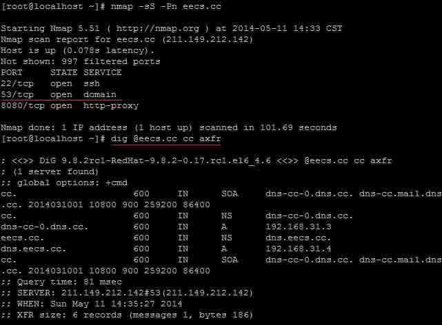
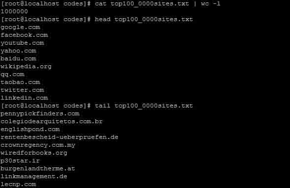

# 批量网站 DNS 区域传送漏洞检测——bash shell 实现

2014/05/21 12:18 | [燕云](http://drops.wooyun.org/author/燕云 "由 燕云 发布") | [技术分享](http://drops.wooyun.org/category/tips "查看 技术分享 中的全部文章"), [运维安全](http://drops.wooyun.org/category/%e8%bf%90%e7%bb%b4%e5%ae%89%e5%85%a8 "查看 运维安全 中的全部文章") | 占个座先 | 捐赠作者

## 0x00 背景

* * *

下面图中的 eecs.cc 为笔者自建的一台具有私有根的 DNS 服务器，且对外开放了区域传送权限，故有结果：cc 区域传送成功。该图只是一个实验验证，下面文章正式开始！



## 0x01 寻找域名

* * *

从互联网上寻找全球 Top1000Web 站点列表。

搜寻，发现 [`www.domainvader.com/website/top-sites.php`](http://www.domainvader.com/website/top-sites.php) 站点有需要的信息。

处理过程如下：

```
·此处共计 1000 个统计页面，每个页面有 1000 个站点信息，故依次抓取这 1000 个 html 文档； 
·使用 grep 结合正则表达式从这 1000 个文档之中过滤出我们需要的域名，共计 1000000 个。 
```

代码如下：

其中，grab.sh 的参数 threads 意思为并发 GET 进程数，视双方通讯链路状态而定，默认为 1，如果链路很好，可适当提高，但不宜过高，以防 GET 请求超时。 

grab.sh：

```
#!/bin/bash
declare x
declare threads=1
# process concurrency
declare mod

for x in `seq 1 1000`
do
  echo "http://www.domainvader.com/website/top-${x}000-sites.php"
  time GET "http://www.domainvader.com/website/top-${x}000-sites.php" > $x.html &
  mod=$(( x%threads ))
  if [ "$mod" -eq "0" ]
  then
    wait
  fi
done

```

translate.sh：

```
#!/bin/bash

declare x
declare l

if [ -r "top100_0000sites.txt" ]
then
  rm -f top100_0000sites.txt
fi

touch top100_0000sites.txt

for x in `seq 1 1000`
do
  echo "analyzing ${x}.html..."
# check if readable
  if ! [ -r "${x}.html" ]
  then
    echo "file ${x}.html doesn't exist or aren't readable :("
    echo "file top100_0000sites.txt collect total `cat top100_0000sites.txt | wc -l` websites"
    exit 1
  fi
  l=`grep -Eo --color 'target="_blank">(http://([A-Za-z0-9_-]+)(\.([A-Za-z0-9_-])+)+)' ${x}.html | wc -l` 
# check content if been entirely grabbed
  if [ "$l" -ne "1000" ]
  then
    echo "file ${x}.html's content is not entire :( please check"
    echo "file top100_0000sites.txt collect total `cat top100_0000sites.txt | wc -l` websites"
    exit 1
  fi
  grep -Eo --color 'target="_blank">(http://([A-Za-z0-9_-]+)(\.([A-Za-z0-9_-])+)+)' ${x}.html | grep -Eo --color '(([A-Za-z0-9_-]+)(\.([A-Za-z0-9_-])+)+)$' >> top100_0000sites.txt
done
  echo "done :)"
  echo "file top100_0000sites.txt collect total `cat top100_0000sites.txt | wc -l` websites" 

```

最终效果图：



## 0x02 DNS 区域传送权限自动检测

* * *

有如下命题：

    if dig @${ns} ${d} axfr | grep -E --color 'IN[[:space:]]+A|IN[[:space:]]+NS' &>/dev/null

    then 

      echo "nice! a hole"

    fi

上述命题是整个检测程序的核心所在，这个命题是成立的。

dns_transfer_check.sh 代码如下：

其中，threads 为并发数，默认设置为 40，由于一个域名很可能对应多个 ns，观察得到实际并发数大概为 threads*3 ，domainFileList 为参与检测的域名列表文件，可自定义之。

```
#!/bin/bash

declare d
declare s=0
declare ns_str
declare ns
declare mod
declare threads=40
# process concurrency
declare domainFileList="top100_0000sites.txt"

for d in `cat $domainFileList`
do
  s=$(( s+1  ))
  echo "${s} : ${d}"
  ns_str=`dig -t ns ${d} | grep -E --color 'IN.*NS.*[[:space:]]([A-Za-z0-9_-]+)(\.([A-Za-z0-9_-])+)+\.' | awk  '{print $5}' | grep -Eo --color '([A-Za-z0-9_-]+)(\.([A-Za-z0-9_-])+)+'`
  for ns in $ns_str
  do
    echo $ns
    if dig @${ns} ${d} axfr | grep -E --color 'IN[[:space:]]+A|IN[[:space:]]+NS' &>/dev/null ; then echo "nice! transfer done! :) rank: $s  domain: $d  ns: $ns  ---->" ; fi & 
  done
  mod=$(( s%threads ))
  if [ "$mod" -eq 0 ] 
  then
    wait
  fi
done

```

程序结束。

```
# nohup bash dns_transfer_check.sh &>log &

```

运行一夜之后，扫描到了前 19212 个站点，然后使用 grep、awk、sed 等工具处理之，得到满意结果。

[WooYun: 全球 Top1000Websites 中存在 DNS 区域传送漏洞的网站列表](http://www.wooyun.org/bugs/wooyun-2014-061403)

[dns_domain_check.zip](http://static.wooyun.org/20141017/2014101714082995862.zip)

这是所有资料的链接。重点是 dns_transfer_check.sh 与域名列表，读者可按照自己的需要自定义参数使用。

除了 world_top1000000，还包含了 china_top500 与 china_top1344_entertainment 站点列表 :) 

希望这篇文章能帮助大家！

版权声明：未经授权禁止转载 [燕云](http://drops.wooyun.org/author/燕云 "由 燕云 发布")@[乌云知识库](http://drops.wooyun.org)

分享到：

### 相关日志

*   [PHP 绕过 open_basedir 列目录的研究](http://drops.wooyun.org/tips/3978)
*   [Shell Injection & Command Injection](http://drops.wooyun.org/papers/1018)
*   [应对 CC 攻击的自动防御系统——原理与实现](http://drops.wooyun.org/%e8%bf%90%e7%bb%b4%e5%ae%89%e5%85%a8/4151)
*   [DNS 泛解析与内容投毒，XSS 漏洞以及证书验证的那些事](http://drops.wooyun.org/tips/1354)
*   [MongoDB 安全配置](http://drops.wooyun.org/%e8%bf%90%e7%bb%b4%e5%ae%89%e5%85%a8/2470)
*   [通过 dns 进行文件下载](http://drops.wooyun.org/tools/1344)