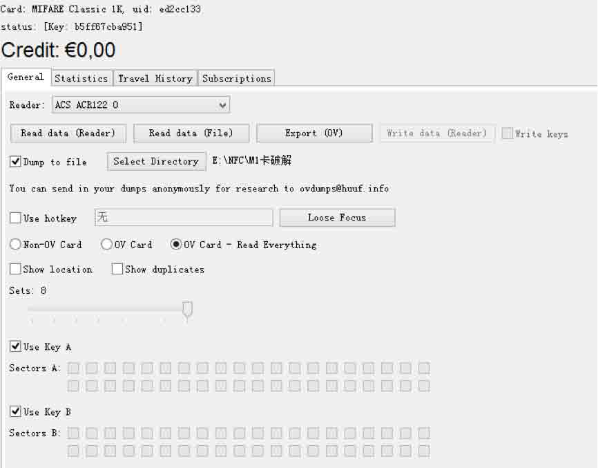
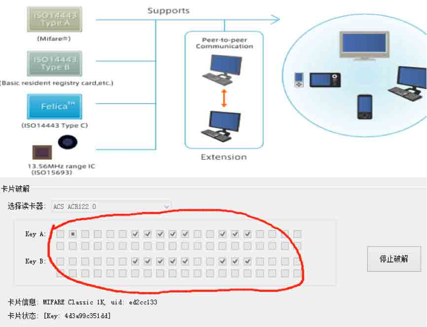
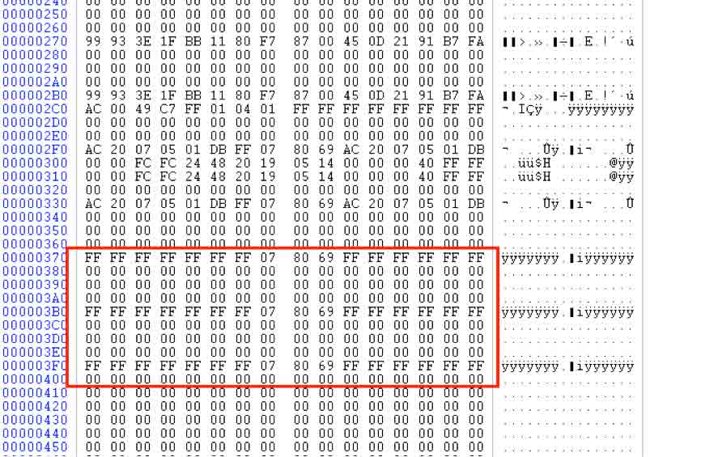
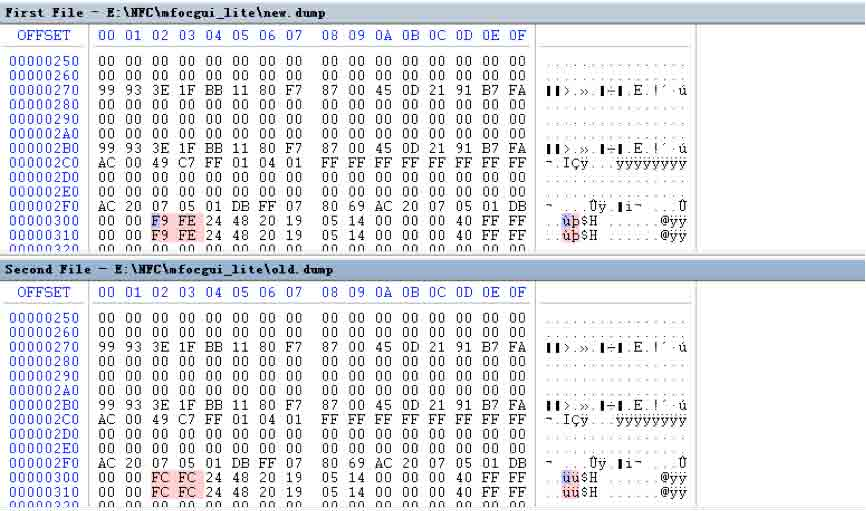
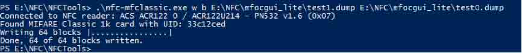
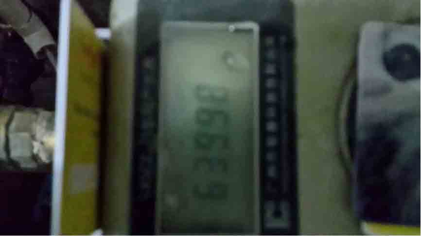
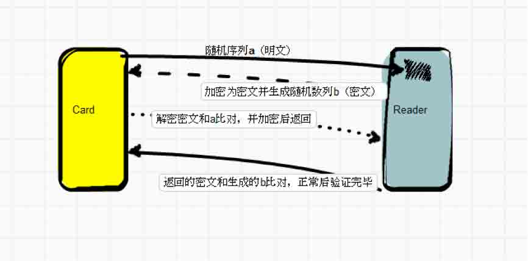

# RFID 入坑初探——Mifare Classic card 破解（一）

2014/05/25 14:29 | [redrain 有节操](http://drops.wooyun.org/author/redrain 有节操 "由 redrain 有节操 发布") | [技术分享](http://drops.wooyun.org/category/tips "查看 技术分享 中的全部文章") | 占个座先 | 捐赠作者

## 0x00 前言

* * *

之前一直想要玩无线安全，旺财大牛说门槛低（哪里低啦=。=web 狗表示我很笨啊，汪汪），于是乎入手了 ACR122u，想从 NFC 开始入坑，就有了这篇文章，先普及下基本知识。

Mifare Classic card 提供 1k-4k 的容量，我们经常见到的是 Mifare Classic 1k(S50)，也就是所谓的 M1 卡。M1 卡有从 0 到 15 共 16 个扇区，并且每个扇区都有独立的密码，每个扇区配备了从 0 到 3 共 4 个段，每个段可以保存 16 字节的内容，反正从 0 开始数 就对了（和数组下标为 0 开始一样）。

每个扇区的第 4 段呢是用来保存 KeyA，KeyB 和控制位的，每张卡还有一个唯一标识的 UID 号，具体的卡结构大家可以百度一下看看。

我们本文的研究对象就是这玩意儿，谷歌告诉我们，这种卡类的攻击方式大概分为这么几种：

### 1）暴力破解

爆破对于 M1 卡的破解来说比较有效，因为 M1 卡是被动卡，需要读卡器来供能，切断供能后卡的临时数据就丢失了，也就是说不会存在输入过多错误密码后造成的锁死之类的情况
FFFFFFFFFFFF、A0B0C0D0E0F0 等等都是 M1 白卡的默认密码，所以当我们使用 mfoc 这样的工具来爆破的时候基本上都是用这些默认密码来填充剩余扇区的密码。

### 2）重放攻击

刚刚我们说了 M1 卡是被动卡，当它被供能的时候会产生随机数列，切断供能后数据不会保存，再次供能又会产生一模一样的数列，然后就可以控制切断，再次供能的时间计算出这个数列，进行重放攻击来达到修改数据的目的。

### 3）克隆卡片（卡复制）

M1 卡的扇区可以保存数据，所以大部分的卡片会选择加密扇区后保存数据，我们可以用 uid 卡来进行复制，每张 M1 卡在 0 扇区第 1 段都有一个唯一标识，而且是保护无法修改的，uid 卡就是没有设定 0 扇区保护的卡，所以你可以随意的修改你想要的 uid，这样我们就可以克隆出一张连 uid 都相同的卡片了。（但是要注意不要把 00 扇区弄 坏，之前测试的时候就未知原因写坏了 00 扇区无法读入了）。

### 4）嗅探攻击

这里要用到 PM3 这个神器，在卡和机器数据交换的时候嗅探数据，进行攻击，利用 XOR 算 key 工具就可以把扇区的密钥计算出来（穷逼表示根本买不起）。

## 0x01 细节

* * *

科普结束，接下来以一个实例来讲解以下破解 M1 卡的姿势（笔者才开始入坑，如有不对，请大牛斧正）。

关于暴力破解，我们此处用到这么几个东西，ACR122u，mfoc，libnfc。

其中 ACR122u 作为硬件供能，读写的作用，mfoc 用来爆破，libnfc 用来写入数据。



可以看到读出了我们的卡类型，下方的 keyA keyB 就是要我们破解的地方，当然，也可以使用另外一个简化版本，更粗暴简单一些，百度 M1 卡服务程序即可。



稍等片刻后就发现上下各 16 个勾勾都打上了，说明成功爆破了，成功后会在当前目录下生成一个 dump 文件，这样，这张卡的数据就被完全 dump 下来了，得到 dumpfile1 但是只有 1k 的大小，在 win 下操作的时候需要用到一个 fixdump 的工具来填充剩余部分

```
fixdump dumpfile1 
```

即可修复，大小为 4k，然后我们去消费一下这张卡（让你要修改的区域的数据改变）



其中前 6 个字节和后 6 个字节的 FF FF FF FF FF FF 即为秘钥，中间的几位 FF 07 80 69 即为控制位。

再次 dump 数据 dumpfile2 并修复

```
fixdump dumpfile2 
```

就此，我们有了两个样本，然后做 hex diff，linux 下直接用 diff，win 下可以使用 hexcmp2



diff 后发现了数据变动的区域。

本文只修改简单的金龙卡水卡功能，所以取样两次后就可以轻松找到数据所在的扇区，如果是做比较复杂的修改那么取样可能得多次，比如做门禁攻击啥的。

可以看到这个扇区内的一些数值，末端的 40，FF 啥的都是存放数值的地址，我们不用管它，在 M1 卡中本来要进行一次的取反和倒序存入，但是可能本屌的渣学校的卡居然直接进行 16 进制换算为 10 进制后就是水卡金额数目。。。

这里多说两句，一般情况下，数据存入是倒序的，比如 F9 FE，其实真实数据是 FE F9，然后换算为 2 进制进行取反再换算为 10 进制，有可能还会遇到数据的加密，我们再解密后就可以得到存入的数值了。

图中是我成功修改了最大数值后的，金额为 640.00 元，hex 为 fa 00，做测试的时候笔者太高估了学校，多次猜测其换算的算法，取样了 20 来次后脑洞开了，直接通过 10 进制转换 16 进制。。。居然就是那么简单！F9 FE 为 63998 小数点请忽视。

然后使用 libnfc 来写入数据

```
.
fc-mfclassic.exe w b dumpfile_new dumpfile_old 
```



至此，破解差不多就那么完成了（单纯指做数据修改的目的，不包括解决什么后患啊之类的情况）。

最后上一张成功改写后的测试图。



破解时长共 3 个小时（来回取样浪费了不少时间）。

关于验证漏洞攻击，在前面科普的时候说过，每个扇区都有独立的密码，在通常情况下，有些存储关键数据（比如饭卡里的钱）的扇区会更改密码，比如，某张卡里的第 4 扇区存着钱，更改了默认密码，但是其他扇区并没有更改默认密码，那么我们怎么通过其他扇区来操作第 4 扇区呢，这里就会用到验证漏洞攻击，也就是 nested authentication 攻击，通常会在我们知道 16 个扇区中任意一个扇区密码来破解其他扇区的时候使用。

首先我们知道，M1 卡的算法是个对等加密算法，读卡器中也保存着同样的密码，也是用同样的算法加密，当卡和机器交互的时候，读卡器首先验证 0 扇区的密码，卡给读卡器以明文方式发送一个随机序列 a（明文），然后读卡器通过跟加密，同时自己产生一个加密的随机序列 b(密文)返回，卡用自己的密码解密之后，解密出来的序列如果是自己之前发送的 a，则认为正确，然后通过自己加密算法加密读卡器生成的随机序列发送给读卡器，读卡器解密之后，如果跟 自己之前发送的随机数 b 相同，则认为验证通过，之后所有的数据都通过此算法加密传输。



在整个过程中，只有 a 是明文，之后的都是密文，card 发送一个 a 给读卡器之后，读卡器用错误的密码加密之后发送给 card，card 肯定解密错误，然后验证中断
但是，我们知道其他扇区的的密码，验证的时候，使用这个扇区验证成功之后，后面所有的数据交互都是密文，读其他扇区数据的时候，也是 card 首先发送随机数 a，这个 a 是个加密的数据，之前说的每个扇区的密码是独立的，那么加密实际上就是通过 card 这个扇区的密码相关的算法加密的 a，这个数据中就包含了这个扇区的密码信息，所以我们才能 够通过算法漏洞继续分析出扇区的密码是什么。

也就是因为这个原理，在验证漏洞的时候才必须要知道至少一个其他扇区的密码。

## 0x02 总结

* * *

对于才入坑的朋友来说，爆破是最简单粗暴的办法，交给程序自动化进行即可（有可能接下来一篇或者下下一篇写根据重放攻击进行破解的）。

其次，主要进行的工作就是多次的取样和反复 diff，体力活加脑力活。

预告，等闲下来继续研究一下 mfoc 的其他破解功能，比如重放之类的，或者完全破解校园卡的其他功能（因为是联网的，所以目测得我顺手拿下后勤系统吧）

版权声明：未经授权禁止转载 [redrain 有节操](http://drops.wooyun.org/author/redrain 有节操 "由 redrain 有节操 发布")@[乌云知识库](http://drops.wooyun.org)

分享到：

### 相关日志

*   [RFID 之 M1 卡数据分析](http://drops.wooyun.org/tips/3168)
*   [无线应用安全剖析](http://drops.wooyun.org/wireless/4295)
*   [Linux PAM&&PAM;后门](http://drops.wooyun.org/tips/1288)
*   [PHP 后门新玩法：一款猥琐的 PHP 后门分析](http://drops.wooyun.org/papers/1215)
*   [逆向基础（六）](http://drops.wooyun.org/tips/2177)
*   [Linux 被 DDOS&CC 攻击解决实例](http://drops.wooyun.org/tips/2457)