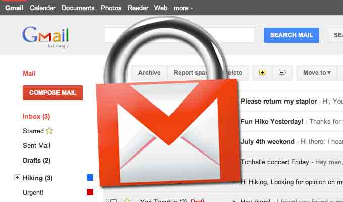

# Google 对 Gmail 的所有通信进行 SSL 加密

2014/03/21 15:30 | [News](http://drops.wooyun.org/author/news "由 News 发布") | [业界资讯](http://drops.wooyun.org/category/news "查看 业界资讯 中的全部文章") | 占个座先 | 捐赠作者

恐怕没有其他公司能够像 Google 一样对 NSA 获取数据的手法更为了解的了，Google 在最近的几个月对其基础架构做了一系列的改变，使得其他人更难获取到用户的隐私数据，其中最大的一个变化就是本周四开始 Gmail 服务通信将全面转为 HTTPS，强制 Gmail 的所有连接使用 SSL 加密。

谷歌也对所有的数据中心之间的通信加密，这将会使 NSA 在内想要获取用户数据更加困难。

Gmail 安全负责人 Nicolas Lidzborski 在博客中写道：“从今天开始，你使用 Gmail 收发邮件时，将都会使用 HTTPS 加密，这个变化意味着没有人可以监听你的邮件。”

“此外，你所有发的每一封邮件在传输过程中为 100%加密的，这意味着你的邮件不仅在你与 Gmail 服务直接是加密的，同时在 Google 的数据中心直接也是加密的。”

Google 是在去年爆出 NSA 可以获取邮件以及其他数据之前就已经开始进行数据中心的加密传输了，那次事件也让 Google 的安全工程师很愤怒，加快了加密数据中心通信的进程。

四年前，Gmail 开启 HTTPS 只是一个选项，可由用户选择是否开启。可能很多用户并没有注意到，现在，已经没有这个选项了，所有的 Gmail 通信都将被加密。

版权声明：未经授权禁止转载 [News](http://drops.wooyun.org/author/news "由 News 发布")@[乌云知识库](http://drops.wooyun.org)

分享到：

### 相关日志

*   [浏览器安全策略说之内容安全策略 CSP](http://drops.wooyun.org/tips/1439)
*   [Linux PAM&&PAM;后门](http://drops.wooyun.org/tips/1288)
*   [XSS 和字符集的那些事儿](http://drops.wooyun.org/papers/1327)
*   [Burp Suite 使用介绍（二）](http://drops.wooyun.org/tools/1629)
*   [软件漏洞分析技巧分享](http://drops.wooyun.org/tips/1261)
*   [一起针对国内企业 OA 系统精心策划的大规模钓鱼攻击事件](http://drops.wooyun.org/tips/2562)