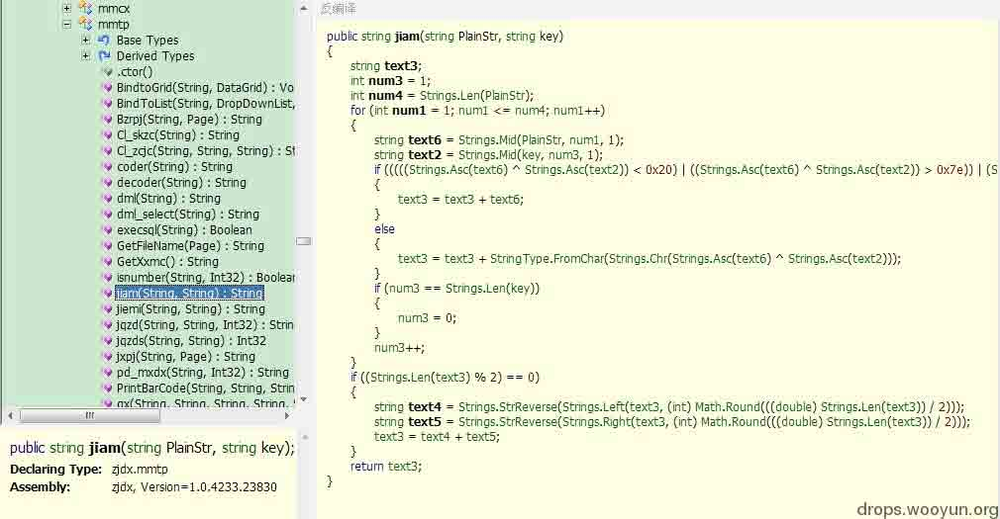
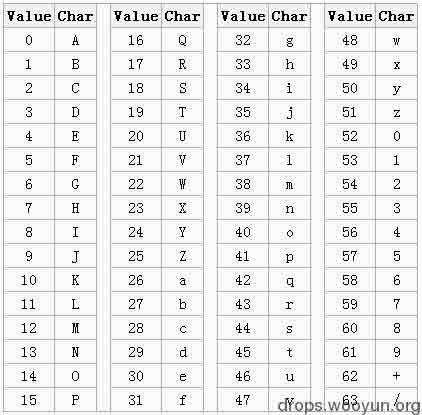
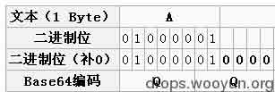

# 由“正方”jiam、jiemi 之逆向思及 Base64 之逆编码表

2014/01/06 11:02 | [RedFree](http://drops.wooyun.org/author/RedFree "由 RedFree 发布") | [技术分享](http://drops.wooyun.org/category/tips "查看 技术分享 中的全部文章") | 占个座先 | 捐赠作者

申明：本文旨在技术交流，并不针对“正方”（新版正方教务系统密码处理方式也换了，只是用这个做个引子而已……）！本文并没有什么深度，仅探讨已知明文、密文和算法的情况下逆向得 Key 的可能！

## 0x00 背景

* * *

经常遇到基友求助类似 Base64 编码的解码(先不说是不是 Base64,下文会做说明)。如：p6FDpXlnQ1tHlLZK+NvA1hwfeND8NdXt1q6whqP6WODTEBP4UzzjnDQ== 这个很像 Base64 编码吧，但你用标准 Base64 去解码得到的结果明显不是想要的(这个有 N 多可能)。

## 0x01 编解码

* * *

且从编码、解码说起吧，最简单的编码（为什么不叫加密、解密呢？看你用它干什么了……）是将字符映射，例如：

```
a=e
b=f
c=g
……
v=z
w=a
x=b
y=c
z=d 
```

这只是个例子，还有数字、特殊字符等没写进去呢。当然你也可以用没有规律的映射方式去编码。这样的编码如果用于加密密码的话会有什么缺陷呢？
假定某人已经拥有了几组明文和对应的密文，那么他可以用手上的这几组明文和密文寻找规律来还原映射关系，然后再由这个映射关系轻松破解其它密文。

由此，我们将可还原明文的加密算法分为如下几类(为什么要密文可还原？还是让厂商来回答吧！)：

```
① 如：bcdef=fghij   cdefg=ghijk…… 这样的加密不需要工具，目测到规律然后还原。  
② 略复杂一点的加密算法，密文找不到规律，可以防止用户的破解。但是如果加密解密算法侧漏了，那样所有用户的密码都会惨遭破解！  
③ 复杂的加密算法，使用自定义 Key 加密明文，也就是说密码是明文和 Key 的某种运算之后生成的。这种算法有个优点，就算算法侧漏，没有 Key 也是无法解密的(下面开始讨论)。类似：pass=encode(str,key); str=decode(pass,key) 。  
④ 更复杂的算法……(待补充) 
```

## 0x02 再议“正方”之 jiam、jiemi

* * *

为什么是再议呢？因为正方教务系统的“加密”、“解密”运作方式早已被讨论 N 多次了，网上甚至可以找到此算法的 N 多版本(可自行 Baidu、Google)。
两个典型的场景是：

```
① 有多组密文，已知几组密文对应的明文和加密算法，但是由于无法获得加密所使用的 Key，无法解密其它密文。
② 由系统某缺陷可以获得加密后的密文（当然明文是自己的密码这个是可控的），获得了别人的密文后由于无 Key，无法解密。 
```

为了研究此算法尝试逆得 Key，我决定再写个 VB 版的。由于事先已从网上查知算法位于/bin/zjdx.dll 中，所以找起来就简单了，网上找得一份“源码”使用 Reflector 载入 zjdx.dll，由登录页 Default2 跟进到 jiam 方法如图：



源码如下(已写上注释)：

```
public string jiam(string PlainStr, string key)
{
      string text3;
      int num3 = 1;
      int num4 = Strings.Len(PlainStr);//取密码明文长度
      for (int num1 = 1; num1 <= num4; num1++)
      {
            string text6 = Strings.Mid(PlainStr, num1, 1);//从第一位开始每一次循环取密码中的下一个字符
            string text2 = Strings.Mid(key, num3, 1);
            if (((((Strings.Asc(text6) ^ Strings.Asc(text2)) < 0x20) | ((Strings.Asc(text6) ^ Strings.Asc(text2)) > 0x7e)) | (Strings.Asc(text6) < 0)) | (Strings.Asc(text6) > 0xff))//将明文中截到的某位字符的 ASSCII 码和 Key 中截到的某位字符的 ASSCII 码进行异或运算，若结果是不可打印字符的 ASSCII 码则临时字串直接加上明文中截到的这个字符
            {
                  text3 = text3 + text6;
            }
            else//若异或后的结果是可打印字符的 ASSCII 码(33-126)，则临时字串加上 ASSCII 码是异或结果的字符
            {
                  text3 = text3 + StringType.FromChar(Strings.Chr(Strings.Asc(text6) ^ Strings.Asc(text2)));
            }
            if (num3 == Strings.Len(key))//假如 Key 中截到的字符用到最后一位了，则从头开始使用 Key
            {
                  num3 = 0;
            }
            num3++;
      }
      if ((Strings.Len(text3) % 2) == 0)//假如最后的临时结果字符长度是偶数个，那么最终结果=反转字符的前半部分+反转字符的后半部分
      {
            string text4 = Strings.StrReverse(Strings.Left(text3, (int) Math.Round(((double) Strings.Len(text3)) / 2)));
            string text5 = Strings.StrReverse(Strings.Right(text3, (int) Math.Round(((double) Strings.Len(text3)) / 2)));
            text3 = text4 + text5;
      }
      return text3;//返回最终结果
} 
```

可见 jiami 函数中传入了两个参数，其中 PlainStr 为要加密的明文，key 为加密使用的 key。此函数逻辑如注释。

关于异或运算请参见：http://technet.microsoft.com/zh-cn/subscriptions/csw1x2a6(v=vs.80).aspx

为了方便于理解下文，作如此解释：三个数 a,b,c 假如(a xor b=c)那么(a xor b xor a=b),(a xor b xor b=a)。

ASSCII 码对照表请参见：http://www.96yx.com/tool/ASC2.htm 33-126 为可打印字符。

至此，已完全清晰了 jiam 的逻辑，将此函数移植于 VB 程序，代码如下：

```
Public Function jiam(ByVal PlainStr As String, ByVal key As String) As String
        Dim strChar, KeyChar, NewStr As String
        Dim Pos As Integer
        Dim i, intLen As Integer
        Dim Side1, Side2 As String
        Pos = 1
        For i = 1 To Len(PlainStr)
            strChar = Mid(PlainStr, i, 1)
            KeyChar = Mid(key, Pos, 1)
            If ((Asc(strChar) Xor Asc(KeyChar)) < 32) Or ((Asc(strChar) Xor Asc(KeyChar)) > 126) Or (Asc(strChar) < 0) Or (Asc(strChar) > 255) Then
                NewStr = NewStr & strChar
            Else
                NewStr = NewStr & Chr(Asc(strChar) Xor Asc(KeyChar))
            End If
            If Pos = Len(key) Then Pos = 0
            Pos = Pos + 1
        Next
        If Len(NewStr) Mod 2 = 0 Then
            Side1 = StrReverse(Left(NewStr, CInt((Len(NewStr) / 2))))
            Side2 = StrReverse(Right(NewStr, CInt((Len(NewStr) / 2))))
            NewStr = Side1 & Side2
        End If
        jiam = NewStr
    End Function 
```

那么如果已知 Key 的情况下，要解密该如何书写解密的代码呢？

在 zjdx.dll 中反编译得到的解密函数如下：

```
public string jiemi(string PlainStr, string key)
{
      string text3;
      int num2 = 1;
      if ((Strings.Len(PlainStr) % 2) == 0)
      {
            string text4 = Strings.StrReverse(Strings.Left(PlainStr, (int) Math.Round(((double) Strings.Len(PlainStr)) / 2)));
            string text5 = Strings.StrReverse(Strings.Right(PlainStr, (int) Math.Round(((double) Strings.Len(PlainStr)) / 2)));
            PlainStr = text4 + text5;
      }
      int num3 = Strings.Len(PlainStr);
      for (int num1 = 1; num1 <= num3; num1++)
      {
            string text6 = Strings.Mid(PlainStr, num1, 1);
            string text2 = Strings.Mid(key, num2, 1);
            if (((((Strings.Asc(text6) ^ Strings.Asc(text2)) < 0x20) | ((Strings.Asc(text6) ^ Strings.Asc(text2)) > 0x7e)) | (Strings.Asc(text6) < 0)) | (Strings.Asc(text6) > 0xff))
            {
                  text3 = text3 + text6;
            }
            else
            {
                  text3 = text3 + StringType.FromChar(Strings.Chr(Strings.Asc(text6) ^ Strings.Asc(text2)));
            }
            if (num2 == Strings.Len(key))
            {
                  num2 = 0;
            }
            num2++;
      }
      return text3;
} 
```

其实不需要这个函数，稍懂编程的人便可根据加密函数写出对应的解密函数。

解密逻辑：

+--判断密文长度是否是偶数|下一步
|是(重组密文) 否|下一步
|一位位截得密码和 key 的某位异或|下一步
|根据异或结果组合字符|下一步
+最终结果|

根据此逻辑书写的 VB 代码如下：

```
Public Function jiemi(ByVal PlainStr As String, ByVal key As String) As String
        Dim strChar, KeyChar, NewStr As String
        Dim Pos As Integer
        Dim i As Integer
        Dim Side1 As String
        Dim Side2 As String
        Pos = 1
        If Len(PlainStr) Mod 2 = 0 Then
            Side1 = StrReverse(Left(PlainStr, CInt((Len(PlainStr) / 2)))) '反转明文密码最左边一半的字符
            Side2 = StrReverse(Right(PlainStr, CInt((Len(PlainStr) / 2)))) '反转明文密码最右边一半的字符
            PlainStr = Side1 & Side2
        End If
        For i = 1 To Len(PlainStr)
            strChar = Mid(PlainStr, i, 1) '一个一个处理 plainstr 中的字符
            KeyChar = Mid(key, Pos, 1) '循环使用 key 中的字符
            If ((Asc(strChar) Xor Asc(KeyChar)) < 32) Or ((Asc(strChar) Xor Asc(KeyChar)) > 126) Or (Asc(strChar) < 0) Or (Asc(strChar) > 255) Then
                NewStr = NewStr & strChar
            Else
                NewStr = NewStr & Chr(Asc(strChar) Xor Asc(KeyChar))
            End If
            If Pos = Len(key) Then Pos = 0
            Pos = Pos + 1
        Next
        jiemi = NewStr
    End Function 
```

现在加密和解密的函数都已完全写出来了，由此得到了两个公式：jiam(明文,key)=密文    jiemi(密文,key)=明文

但是在上面的场景是已知明文和密文，有没有可能运算得到 Key 呢：GetKey(明文,密文)=key ？

答案是肯定的，因为由 jiam()函数得知：明文和密文的长度一定相等。由于已知异或运算的法则如此：明文(异或)循环 key=密文、{明文(异或)key}(异或)明文=循环 Key，所以密文(异或)明文=循环 Key。

根据此逻辑书写 VB 代码如下：

```
Public Function GetKey(ByVal PlainStr As String, ByVal Pass As String) As String
        Dim strChar, KeyChar, NewStr As String
        Dim Pos As Integer
        Dim i As Integer
        Dim Side1 As String
        Dim Side2 As String
        Pos = 1
        If Len(PlainStr) Mod 2 = 0 Then
            Side1 = StrReverse(Left(PlainStr, CInt((Len(PlainStr) / 2)))) '反转明文密码最左边一半的字符
            Side2 = StrReverse(Right(PlainStr, CInt((Len(PlainStr) / 2)))) '反转明文密码最右边一半的字符
            PlainStr = Side1 & Side2
        End If
        For i = 1 To Len(PlainStr)
            strChar = Mid(PlainStr, i, 1) '一个一个处理 plainstr 中的字符
            KeyChar = Mid(Pass, Pos, 1) '循环使用 pass 中的字符
            If strChar = KeyChar Then
                NewStr = NewStr & "*"
            Else
                NewStr = NewStr & Chr(Asc(strChar) Xor Asc(KeyChar))
            End If
            Pos = Pos + 1
        Next
        GetKey = NewStr
End Function 
```

到这里，我们遇到了一个问题，那就是密文中的有些字符并没有经过异或运算而直接加入到了结果之中，也就是 Key 在某此字符处并没有起作用，所以在这些地方无法逆出相应的 Key 字符。那该怎么办呢？前面我们已经提到了，我们有几组明文和密码的对照，所以可以通过 N 组逆运算来确定最终的 Key(当然如果密码足够长也可以达到此效果，因为 key 的长度是一定的[一直在循环使用])，未参与运算部分的 key 用*号来代替(如果 Key 中有*号呢，就用其它符号代替呗！)

测试了几组对照的明文密文，得到如下 key,

```
A***l*36*j*
Ac**lf****w
A*xy*f*65*w
Acxy*f3**j*
…… 
```

最终可以确定 key 值为：Acxylf365jw

## 0x03 反观 Base64 编码

* * *

看一看类似的可以编码且可还原原码的 Base64 编码吧!

Base64 的介绍请看：http://zh.wikipedia.org/zh-cn/Base64

Base64 的逻辑是：字符串>>每个字符的 8 位二进制连接>>每 6 位转换为十进制对应编码表连接转换后字符；如果要编码的字节数不能被 3 整除，最后会多出 1 个或 2 个字节，那么可以使用下面的方法进行处理：先使用 0 字节值在末尾补足，使其能够被 3 整除，然后再进行 base64 的编码。在编码后的 base64 文本后加上一个或两个'='号，代表补足的字节数。

由于 6 位二进制最大为 111111 即 63 最小为 000000 所以编码表中共有 64 个字符。

Base 标准编码表：



示例：




A   QQ==
BC  QkM=

正常情况下 Base64 的编码表是：ABCDEFGHIJKLMNOPQRSTUVWXYZabcdefghijklmnopqrstuvwxyz0123456789+/=，但如果将编码表中的字符换其它顺序排一下结果又是什么样子呢？

我使用了这个编码表(等同于 key)：abcdefghijklmnopqrstuvwxyz0123456789+/=ABCDEFGHIJKLMNOPQRSTUVWXYZ，编码字符：I Love You!

得到字符串：ssbm1Qz/if/I3se=，但使用标准编码表解码得到：ƦՌȞǀ 几个“乱码”……  那么在已知编码前字符和编码后字符但编码表不知的情况下能不能根据数组对照来确定编码表呢？

答案也是肯定的：首先根据明文和密文的长度来确定使用的有没有可能是 Base64 编码(详情 Baidu、Google)，然后再将明文转换为 8 位二进制每 6 位再转为十进制。

假如我们有明文：11CA467C5B1C3C0AB1D6C8A81104CC868CDC0A91 和密文：mtfdqtq2n0m1qJfdm0mWquiXrdzdoee4mteWnendody4q0rdmee5mq==那确定编码表的过程如下：

### Step1:明文转为 8 位二进制：

00110001001100010100001101000001001101000011011000110111010000110011010101000010001100010100001100110011010000110011000001000001010000100011000101000100001101100100001100111000010000010011100000110001001100010011000000110100010000110100001100111000001101100011100001000011010001000100001100110000010000010011100100110001

### Step2:每 6 位二进制数转为十进制(我以|分割便于查看)：

12|19|5|3|16|19|16|54|13|52|12|53|16|35|5|3|12|52|12|48|16|20|8|49|17|3|25|3|14|4|4|56|12|19|4|48|13|4|13|3|14|3|24|56|16|52|17|3|12|4|4|57|12|16|

### Step3 对应加密后字串：

mtfdqtq2n0m1qJfdm0mWquiXrdzdoee4mteWnendody4q0rdmee5mq==

得到 m 在编码表中的位置是 12，t 在编码表中的位置是 19，f 在编码表中的位置是 5……(因后面的 m 都是 12，t 都是 19……，所以可以确定这是换了编码表的 Base64)。在使用了多组明文和密文对照之后得到了变异的编码表：abcdefghijklmnopqrstuvwxyzABCDEFGHIJKLMNOPQRSTUVWXYZ0123456789+/=
至此成功完成了编码表的逆算。

对于一次 Base64 编码的的运算可以通过几组对照的明、密文轻松逆得编码表，假如是两次使用同编码表的 Base64 编码，还有没有可能得到编码表呢？

可以做如下分析：(简单的举例，因第一个字符编码后不受后面字符的影响，所以下面分析的是每一次编码后的第一个字符)

第一次编码后字符空间位于编码表的 8 位至 31 位(可打印字符的 ASSCII 码为 32-126)

```
……
Bin(A)= 01000001  Base64(A)=编码表中第 16 位
Bin(E)= 01000101  Base64(E)=编码表中第 17 位
Bin(I)= 01001001  Base64(I)=编码表中第 18 位
Bin(M)= 01001101  Base64(M)=编码表中第 19 位
Bin(Q)= 01010001  Base64(Q)=编码表中第 20 位
Bin(U)= 01010101  Base64(U)=编码表中第 21 位
Bin(Y)= 01011001  Base64(Y)=编码表中第 22 位
…… 
```

由于第一次编码后字符范围一定在下面这些字符范围中：

```
abcdefghijklmnopqrstuvwxyzABCDEFGHIJKLMNOPQRSTUVWXYZ0123456789+/= 
```

其中 ASSCII 码最小的为”43” 最大的为”122”

所以二次编码后字符空间位于编码表的第 10 位至 30 位。

由于二次编码的结果是知道的，所以可以用多组密文来确定编码表位于 10-30 之间的所有字符(但顺序是不知道的)。

```
……
Base64(Base64(A))= Base64(编码表中第 16 位的字符)
Base64(Base64(E))= Base64(编码表中第 17 位的字符)
Base64(Base64(I))= Base64(编码表中第 18 位的字符)
…… 
```

这样编码表 10-30 位所有字符的 Base 编码结果都知道了(结果字符还位于 10 至 30 位之间)

由此得到了一个 21 元的方程(如果解的出来那么编码表中的一部分字符的位置就确定了，不过还没有尝试能不能解出来……)

可见如果经过了二次编码，要还原编码表还是很困难的(大牛支招吧！)

## 0x04 反思

* * *

本文只尝试了从首字符去还原二次编码的 Base64 编码表，是不是有其它方法能很轻易的还原编码表呢？

对于类似 edcode(str,key)一次加密得到的密文且已知算法(密码可还原)的情况下，是不是都可以通过明文和密文逆到 key 呢？

版权声明：未经授权禁止转载 [RedFree](http://drops.wooyun.org/author/RedFree "由 RedFree 发布")@[乌云知识库](http://drops.wooyun.org)

分享到：

### 相关日志

*   [PHP 安全编码](http://drops.wooyun.org/tips/135)
*   [生物特征识别之指纹识别，伪造，指纹设备缺陷设计](http://drops.wooyun.org/tips/2140)
*   [JAVA 逆向&反混淆-追查 Burpsuite 的破解原理](http://drops.wooyun.org/tips/2689)
*   [MS15-002 telnet 服务缓冲区溢出漏洞分析与 POC 构造](http://drops.wooyun.org/papers/4621)
*   [Android Activtity Security](http://drops.wooyun.org/tips/3936)
*   [webgame 中常见安全问题、防御方式与挽救措施](http://drops.wooyun.org/papers/2677)