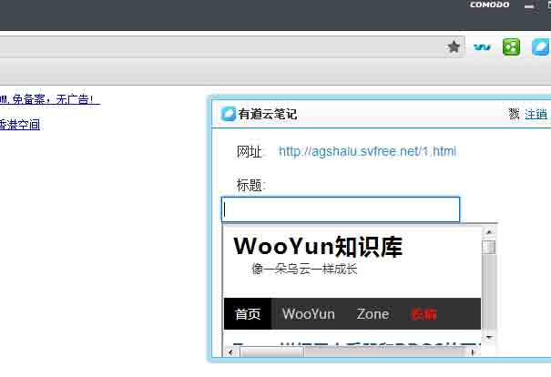
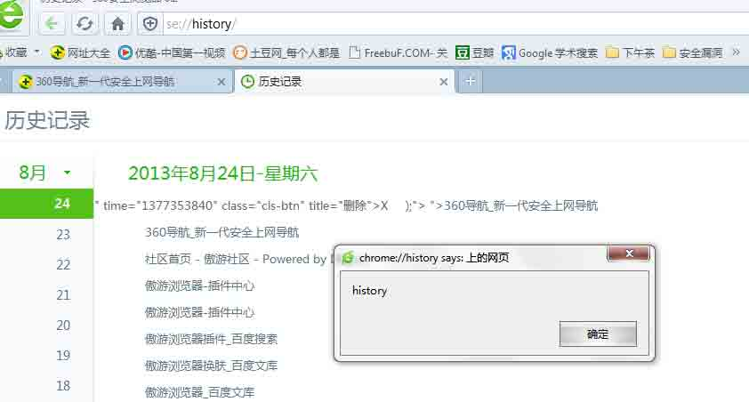
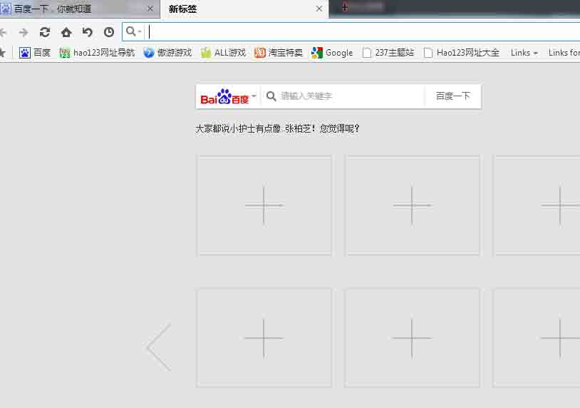
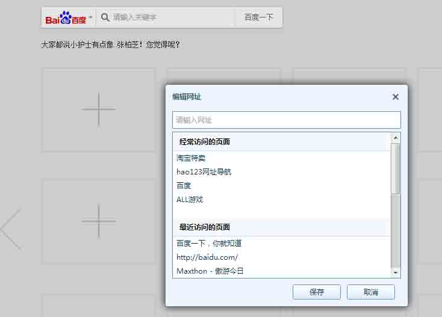
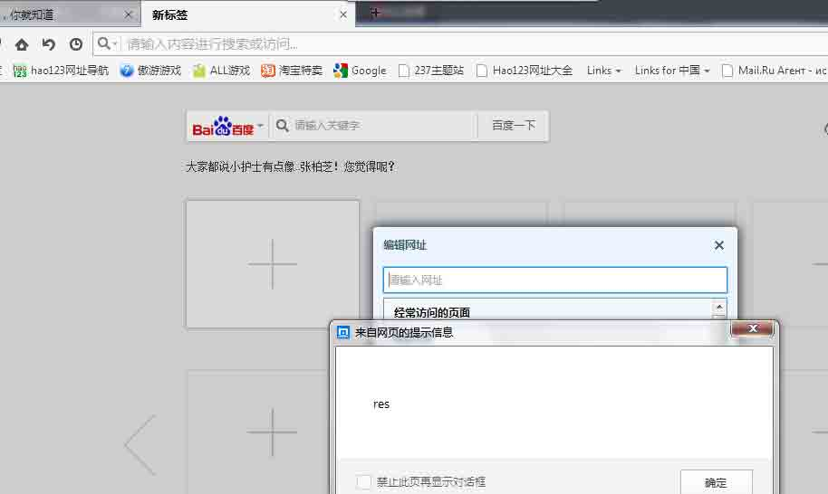
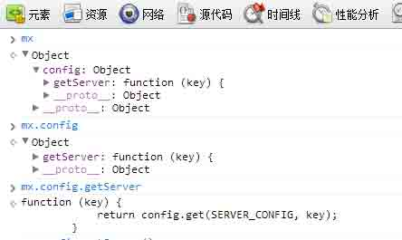

# 浏览器安全（一）

2013/08/28 15:03 | [杀戮](http://drops.wooyun.org/author/杀戮 "由 杀戮 发布") | [web 安全](http://drops.wooyun.org/category/web "查看 web 安全 中的全部文章"), [漏洞分析](http://drops.wooyun.org/category/papers "查看 漏洞分析 中的全部文章") | 占个座先 | 捐赠作者

## 0x00 背景

* * *

嗯，长短短要求我写一篇关于浏览器安全的文章，所以我出现了，求大神不吐槽，本人渣技术。

这篇文章很多地方借鉴了黑哥 Kcon 和于旸 hitcon 的 PPT。

## 0x01 简介

* * *

如何看待浏览器安全，总之就是战场大小的问题。有多少功能，就有多少攻击面。缓冲区溢出什么的是高富帅的东西，好好当屌丝，别看了。

什么是功能，比如为了用户体验加上的功能，比如历史记录，浏览器插件，调试器..........比如浏览器本身功能导致的问题，CSS 所能达到的伪造，高权限的 DOM，地址栏的各种协议等等。

## 0x02 如何学习

* * *

如何学习这方面的知识，说实在的，浏览器安全比较冷门，别指望有坑货会为这方面写书。只能丢一些链接出来：

[`code.google.com/p/browsersec/`](http://code.google.com/p/browsersec/)

[`www.unicode.org/reports/tr36/`](http://www.unicode.org/reports/tr36/)

[`ha.ckers.org/weird/`](http://ha.ckers.org/weird/)

[`kotowicz.net/absolute/`](http://kotowicz.net/absolute/)

主要的还是看自己的猥琐程度，只要能达到看见妹纸能往 XSS 方面联想那你就无往不利了。

## 0x03 基础

* * *

### 攻击面：

#### 浏览器本身

危险的 DOM 操作 SUCH AS [WooYun: 关于 IE 页面欺骗漏洞](http://www.wooyun.org/bugs/wooyun-2013-022437)

CSS 的伪造 SUCH AS 通过 CSS 伪装状态栏等。。

地址栏的协议 SUCH AS [WooYun: Safari location 污染漏洞](http://www.wooyun.org/bugs/wooyun-2013-016895)

#### 扩展功能

插件安全 SUCH AS [WooYun: 傲游浏览器本地域突破（浏览器插件风险）](http://www.wooyun.org/bugs/wooyun-2013-022263)

历史记录 SUCH AS [WooYun: 猎豹浏览器存储 xss(本地域权限)](http://www.wooyun.org/bugs/wooyun-2013-028185)

扩展功能 等等....................

### 漏洞利用

#### 命令执行：

特权 API : [WooYun: 360 安全浏览器远程代码执行漏洞](http://www.wooyun.org/bugs/wooyun-2010-020)

缓冲区溢出: [`www.2cto.com/Article/201308/238149.html`](http://www.2cto.com/Article/201308/238149.html) 充数的 不要在意

#### 信息探测：

探测历史记录

本地文件

## 0x04 找到奶糖

* * *

浏览器的本质是为了方便用户浏览网页，所以我们的攻击代码最终都是存在与网页上的，我们要攻击一个浏览器，要看浏览器如何处理我们的代码，火狐的 firebug 曾经爆出过浏览器命令执行， 漏洞的成因就是 firebug 提取网页内容时过滤不严谨，导致可以再特权区域调用特权 API 执行代码。

Such As : Chrome

我们先确定一个突破点，我们把注意力放在谷歌插件上。

我们确定一个插件，我们已经发现它对网页内容进行提取。



插件提取了 title 和 Url 我们构造一个页面

POC:

```
"><iframe src=http://drops.wooyun.org ></iframe><a

```



很早的时候谷歌就意识到了插件的安全问题并且加了防范，所以在这个特权区域执行 js 比较困难。这里只是打个比方，说明下浏览器处理网页内容造成的危害。

比如历史记录造成的问题。

Such As: 360 浏览器

输入网址

```
http://hao.360.cn/#"><script>alert(document.domain);</script> 
```

查看历史记录


同样也是对网页内容的抓取，同时还有很多地方存在安全问题，比如调试器。


哥几个高抬贵手啊，我这个还有点用，就不说内容了。

## 0x05 奶糖和琥珀

* * *

如何找到漏洞，要注意的是注意浏览器中的每一个点。

一般命令执行的方式

```
确定特权域 --> 寻找特权域的 XSS --> 查看可调用的 API --> 编写 exp --> 攻击 
```

这个流程我们来走一遍

打个比方说，我们要攻击傲游浏览器。

确定特权域



这是一个傲游的特权区域，我们先确定这个页面对网页进行怎么样的抓取。



我们点一下 加号 可以看到这些 ，我们可以判定 它对我们经常访问的 title 进行了提取。

假设它并没有对 title 进行过滤。我们构造网页

POC:

```
<title><script>alert(document.domain);</script></title>

```



现在我们简单查看下有什么高权限的 API 可以调用。



通过审查这些 API 我们可以抽取出高权限的 API 来进行攻击。

## 0x06 有过的漏洞？

* * *

– CVE-2002-0189

– CVE-2002-1187

– CVE-2002-1688

– CVE-2003-1328(MS03-004)

– CVE-2005-0054(MS05-014)

– CVE-2006-3643(MS06-044)

## 0x07 结尾

* * *

嗯。。。。其实还有一些要点，第二篇再说吧，好累 睡觉去了，改天我要捅死短短。

**Tags:** [浏览器](http://drops.wooyun.org/tag/%e6%b5%8f%e8%a7%88%e5%99%a8)

版权声明：未经授权禁止转载 [杀戮](http://drops.wooyun.org/author/杀戮 "由 杀戮 发布")@[乌云知识库](http://drops.wooyun.org)

分享到：

### 相关日志

*   [Browser Security-基本概念](http://drops.wooyun.org/papers/146)
*   [Browser Security-css、javascript](http://drops.wooyun.org/tips/150)
*   [Browser Security-超文本标记语言（HTML）](http://drops.wooyun.org/tips/147)
*   [Browser Security-同源策略、伪 URL 的域](http://drops.wooyun.org/tips/151)
*   [详解 XMLHttpRequest 的跨域资源共享](http://drops.wooyun.org/tips/188)
*   [MS15-002 telnet 服务缓冲区溢出漏洞分析与 POC 构造](http://drops.wooyun.org/papers/4621)