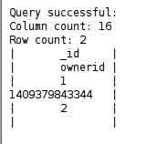
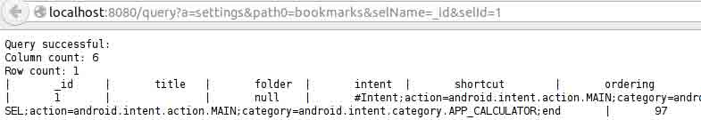

关于手机>连续点击多次版本号，即可开启开发者模式) 4) Window 下安装 drozer 5) 安装完 drozer 后在其目录下把 agent.apk 安装到手机 6) WebCon..." /> <link title="WooYun 知识库 » Android App Injection&amp;&amp;Drozer Use 评论 Feed" rel="alternate" href="http://drops.wooyun.org/tips/2997/feed" type="application/rss+xml" class="calibre47"> <link title="The FLARE On Challenge 题解" rel="prev" href="http://drops.wooyun.org/tips/2988" class="calibre47"> <link title="编写基于 PHP 扩展库的后门" rel="next" href="http://drops.wooyun.org/tips/3003" class="calibre47"> <link rel="canonical" href="http://drops.wooyun.org/tips/2997" class="calibre47"> <link rel="shortlink" href="http://drops.wooyun.org/?p=2997" class="calibre47">

# Android App Injection&&Drozer; Use

2014/09/16 18:07 | [小乐天](http://drops.wooyun.org/author/小乐天 "由 小乐天 发布") | [技术分享](http://drops.wooyun.org/category/tips "查看 技术分享 中的全部文章"), [移动安全](http://drops.wooyun.org/category/mobile "查看 移动安全 中的全部文章") | 占个座先 | 捐赠作者

## 0x01 准备工作

* * *

测试环境：

1) 手机 root 权限

2) Adb.exe

3) 手机 usb 连接开启 debug 模式(在设置>关于手机>连续点击多次版本号，即可开启开发者模式)

4) Window 下安装[drozer](https://www.mwrinfosecurity.com/products/drozer/community-edition/)

5) 安装完 drozer 后在其目录下把 agent.apk 安装到手机

6) [WebContentResolver.apk](https://labs.mwrinfosecurity.com/system/assets/116/original/WebContentResolver.zip)

7) 附带测试案例使用 app [sieve](https://www.mwrinfosecurity.com/system/assets/380/original/sieve.apk)

## 0x02 drozer 安装与使用

* * *

**安装**

1) windows 安装 下载：

https://www.mwrinfosecurity.com/products/drozer/community-edition/

在 Android 设备中安装 agent.apk：

```
>adb install agent.apk

```

或者直接连接 USB 把文件移动到内存卡中安装

2) *inux 安装（Debian/Mac）

```
$ wget http://pypi.python.org/packages/2.7/s/setuptools/setuptools-0.6c11-py2.7.egg
$ sh setuptools-0.6c11-py2.7.egg
$ easy_install --allow-hosts pypi.python.org protobuf
$ easy_install twisted==10.2.0
$ easy_install twisted ./drozer-2.3.0-py2.7.egg
$ drozer        //运行测试

```

下面介绍三种方法运行

1) USB 方式

```
>adb forward tcp:31415 tcp:31415        //adb 目录下运行次命令
选择 drozer>Embedded Server>Enabled
>drozer.bat console connect     //在 PC 端 drozer 目录下运行此命令

```

2) Wifi 方式

```
>drozer.bat console connect --server 192.168.1.12:31415  //在 PC 端执行 192.168.1.12 为 android 端 ip 和端口

```

3) Infrastructure Mode 这种模式涉及到三个通信方，drozer server、drozer agent（Android 设备中）与 drozer console。

其中 server 与 agent，server 与 console 需要网络互通。这种模式的好处是你不需要知道 android 设备的 ip，

agent 与 console 的 ip 段可以隔离的，并且可以支持一个 server 对应多个设备的操作。

```
>drozer.bat server start

```

在 Android 设备上新建一个 New Endpoint，修改配置 Host 为 PC server 端 ip,并且启用 Endpoint

```
>drozer console connect --server 192.168.1.2:31415      //192.168.1.2 为 server 端 ip 和端口

```

**使用**

```
> list  //列出目前可用的模块，也可以使用 ls
> help app.activity.forintent       //查看指定模块的帮助信息
> run app.package.list      //列出 android 设备中安装的 app
> run app.package.info -a com.android.browser       //查看指定 app 的基本信息
> run app.activity.info -a com.android.browser      //列出 app 中的 activity 组件
> run app.activity.start --action android.intent.action.VIEW --data-uri  http://www.google.com  //开启一个 activity，例如运行浏览器打开谷歌页面
> run scanner.provider.finduris -a com.sina.weibo       //查找可以读取的 Content Provider
> run  app.provider.query content://settings/secure --selection "name='adb_enabled'"    //读取指定 Content Provider 内容
> run scanner.misc.writablefiles --privileged /data/data/com.sina.weibo     //列出指定文件路径里全局可写/可读的文件
> run shell.start       //shell 操作
> run tools.setup.busybox       //安装 busybox
> list auxiliary        //通过 web 的方式查看 content provider 组件的相关内容
> help auxiliary.webcontentresolver     //webcontentresolver 帮助
> run auxiliary.webcontentresolver      //执行在浏览器中以 http://localhost:8080 即可访问
以 sieve 示例
> run app.package.list -f sieve         //查找 sieve 应用程序
> run app.package.info -a com.mwr.example.sieve         //显示 app.package.info 命令包的基本信息
> run app.package.attacksurface com.mwr.example.sieve   //确定攻击面
> run app.activity.info -a com.mwr.example.sieve         //获取 activity 信息
> run app.activity.start --component com.mwr.example.sieve com.mwr.example.sieve.PWList     //启动 pwlist
> run app.provider.info -a com.mwr.example.sieve        //提供商信息
> run scanner.provider.finduris -a com.mwr.example.sieve        //扫描所有能访问地址 
>run app.provider.query content://com.mwr.example.sieve.DBContentProvider/Passwords/--vertical  //查看 DBContentProvider/Passwords 这条可执行地址
> run app.provider.query content://com.mwr.example.sieve.DBContentProvider/Passwords/ --projection "'"   //检测注入
> run app.provider.read content://com.mwr.example.sieve.FileBackupProvider/etc/hosts    //查看读权限数据
> run app.provider.download content://com.mwr.example.sieve.FileBackupProvider/data/data/com.mwr.example.sieve/databases/database.db /home/user/database.db //下载数据
> run scanner.provider.injection -a com.mwr.example.sieve       //扫描注入地址
> run scanner.provider.traversal -a com.mwr.example.sieve
> run app.service.info -a com.mwr.example.sieve         //查看服务 
```

## 0x03 Android App Injection

1) 首先用 drozer 扫描 Android 应用可注入的 Url

```
Dz > run scanner.provider.injection

```



2) 启动 WebContentResolver.apk 应用程序，Web 界面访问 url 格式如下

http://localhost:8080/query?a=providers&path0=Parameter1&path1=Parameter2&pathn=parametern&selName=column&selId=id



解释： providers：为 content://后第一个参数比如 records Parameter1：为第二个参数 operations Parameter2..parametern：为后门的依次类推的参数，如果后面有这么多参数 Column：表字段例如上面字段<_id> Id：为字段数据

注意：格式必须是这样，selName、selId 这两个参数第二个单词是大写的。

3) 在 PC 端运行 adb

```
>adb forward tcp:8080 tcp:8080  //此时在地址栏输入 http://localhost:8080 即可访问 Web 界面

```

4) 以 content://settings/bookmarks/为例，在地址栏输入

```
http://localhost:8080/query?a=settings&path0=bookmarks&selName=_id&selId=1 
```


5) 自动化结合 SQLMAP


## 0x04 总结&&解决方案

* * *

总结：虽然很多小伙说直接用文件管理进去查看数据库更方便，我也不多说什么，就像上次看到一帖子为了查看 wifi 密码写了一大篇的，直接进去数据库看不就是了，我能呵呵一句么。 避免这个漏洞方法只需要指定标志读取权限和限制写入权限。如果我们不想共享存储第三方应用程序记录,另一个解决方案可以消除 provider 或将其设置为 false。

## 0x05 参考：

* * *

*   https://labs.mwrinfosecurity.com/blog/2011/12/02/how-to-find-android-0day-in-no-time/

版权声明：未经授权禁止转载 [小乐天](http://drops.wooyun.org/author/小乐天 "由 小乐天 发布")@[乌云知识库](http://drops.wooyun.org)

分享到：

### 相关日志

*   [Android Broadcast Security](http://drops.wooyun.org/tips/4393)
*   [Android Activtity Security](http://drops.wooyun.org/tips/3936)
*   [Android Content Provider Security](http://drops.wooyun.org/tips/4314)
*   [Android uncovers master-key 漏洞分析](http://drops.wooyun.org/papers/219)
*   [一只 android 短信控制马的简单分析](http://drops.wooyun.org/papers/3030)
*   [安卓 Bug 17356824 BroadcastAnywhere 漏洞分析](http://drops.wooyun.org/papers/3912)