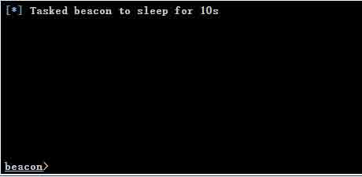

# Cobalt Strike 之团队服务器的搭建与 DNS 通讯演示

2014/04/25 12:07 | [luom](http://drops.wooyun.org/author/luom "由 luom 发布") | [工具收集](http://drops.wooyun.org/category/tools "查看 工具收集 中的全部文章") | 占个座先 | 捐赠作者

## 0x00 背景

* * *

Cobalt Strike 一款以 metasploit 为基础的 GUI 的框框架式渗透工具，Armitage 的商业版，集成了端口发、服务扫描，自动化溢出，多模式端口监听，win exe 木马生成，win dll 木马生成，java 木马生成，office 宏病毒生成，木马捆绑，mac os 木马生成，钓鱼攻击包括：站点克隆，目标信息获取，java 执行，游览器自动攻击等等。

Cobalt Strike 官网为 [Cobalt Strike](http://www.advancedpentest.com) 程序只不接受大天朝的下载，各位自行想办法。[作者博客](http://blog.strategiccyber.com) 有很多好东西，推荐大家收藏。

Cobalt Strike 在 1.45 和以前是可以连接本机 windows 的 metasploit 的，在后来就不被支持了，必须要求连接远程 linux 的 metasploit。

Cobalt Strike 还有个强大的功能就是他的团体服务器功能，它能让多个攻击者同时连接到团体服务器上，共享攻击资源与目标信息和 sessions。

这篇文章就给大家分享下我大家团体服务器的方法（我的不一定是最好的，参考下就行了）

## 0x01 搭建

* * *

### 1.服务器

服务器强烈建议大家选择 ubuntu 的，内存 1G 以上，带宽 8M 以上，虽然在 Centos 上也帮朋友成功搭建过，但是很不推荐，稳定性和维护性都没有用 ubuntu 好。

### 2.安装 metasploit

metasploit 有 3 个版本 专业版，社区版，和 git 上面的版本，当然大家用社区版就行了，专业版的功能比起社区版要多，但是要给钱，只能免费使用一段时间，以前找到的无限免费使用专业版也被官方封锁了，git 上的版本适合高级安装的用户，具体可以自己去玩玩。

下载安装好社区版的 metasploit 后接下来就是要激活第一次访问 metasploit 的 web 管理页面必须是 localhost，这好似规定死的，我这里有两种方法 1.给服务器开启 VNC，然后上去激活（不推荐）2.连接 ssh 的时候开启 socks5 然后游览器设置下就可以访问了。

还有一中快捷的安装方式就是上传 Cobalt Strike 搭服务器，在里面有个 quick-msf-setup 的脚本，它可以帮你快熟部署团体服务器环境，不过我不喜欢这种方式，我比较喜欢折腾，嘿嘿。

### 3.部署 Cobalt Strike

将下载好的 Cobalt Strike 上传到服务器，解包后会有这些文件


Cobalt Strike 是 JAVA 写的，服务器还得有 JAVA 环境，这里我们没必要去下载 JAVA 来安装，metasploit 已经有了 JAVA 环境，我们只需要配置下环境变量就行了
打开 root 目录下的.bashrc 文件，建议先备份，在最下面添加：

```
#JAVA

export JAVA_HOME=/opt/metasploit/java 
```

    export PATH=$JAVA_HOME/bin:$JRE_HOME/bin:$PATH

然后在执行

```
source .bashrc

```

最后看看是否成功


回到 Cobalt Strike 目录

执行./teamserver 服务器 IP 连接密码


启动的过程中会有很多警告，不用理会它，大概几分钟后出现这个就 OK 了


这里不要关闭，然后本机启动 Cobalt Strike 连接测试

```
地址是:192.168.10.62
端口是:55553
用户名是:msf
密码是:luom  (也就是我们刚才设置的) 
```


点击连接，会弹出一个服务器认证，确认，然后弹出设置你昵称（Cobalt Strike 是可以在线聊天的）


回到 SSH 你可以看到各种日志，但是这个一关闭团队服务器也就关闭了，这里我们可以把他置于后台来运行

```
nohup ./teamserver 192.168.10.62 luom &

```

这样就可以了，这个目录下会生成一个 nohup.out 的文件，这个是程序运行的日志文件
注：
在启动 Cobalt Strike 的时候报错 如下


这个原因是你的内存使用超过%50 无法启动 java 虚拟机。

在结束 Cobalt Strike 的时候也要同时结束所有 msfrpcd 进程，不要下次启动会启动不了的。

## 0x02 实例之 Cobalt Strike 通过 DNS 控制目标

* * *

通过 DNS 来控制目标和渗透好处不多说把，大家都知道，不开端口，能绕过大部分防火墙，隐蔽性好等等。Cobalt Strike 有个 beacons 的功能，它可以通过 DNS,HTTP,SMB 来传输数据，下面我以 DNS 为例演示下。

### 1\. 域名设置

首先我们的有个域名，并且创建一条 A 记录指向我们的 metasploit 服务器，记住不要用 CDN 什么的


然后再创建 2 个或 3 个 ns 记录指向刚才创建的 A 记录


这样我们就可以通过 dns 找到我们的 metasploit 服务器了

### 2\. Cobalt Strike 设置

在 Cobalt Strike 中我们添加一个 listener


HOST 填写的是 metasplit 服务的 IP，在点击 Save 的时候会要求填写你的 NS 记录，这里写入我们刚才创建的 3 个


监听我们设置好了，接下来创建一个木马测试下。

### 3\. 木马生成

在`attack->packages`中找到 windows 木马生成


Listener 选择我们刚才创建的(有两个，选择有 DNS 的那个)，输出的有 exe，带服务的 EXE，dll 等。（我测试过连接方式以 DNS 生成的 DLL 木马能过掉很大一部分杀毒软件）

我们把生成的 DNS.EXE 放到虚拟机中运行。

运行前的端口情况


运行后的端口情况


没有开新的端口，在来抓包看看


走的是 DNS。

回到 Cobalt Strike 打开 beacons 管理器发现有一个服务端响应了我们


右键是管理菜单，选择 sleep 设置相应的时间，然后选择 interact 来到操作界面



首先来设置的是传输的模式，有 dns、dns-txt，http,smb 四种，我们这里用的是 DNS 就在 dns、dns-txt 中选择把，前者传送的数据小后者传送的数据多
这里我设置为 `mode dns-txt`（这里可以用 TAB 补齐命令的）


键入 help 可以看到支持的命令

```
Command                   Description
    -------                   -----------
    bypassuac                 Spawn a session in a high integrity process
    cd                        Change directory
    checkin                   Call home and post data
    clear                     Clear beacon queue
    download                  Download a file
    execute                   Execute a program on target
    exit                      Terminate the beacon session
    getsystem                 Attempt to get SYSTEM
    getuid                    Get User ID
    help                      Help menu
    inject                    Spawn a session in a specific process
    keylogger start           Start the keystroke logger
    keylogger stop            Stop the keystroke logger
    message                   Display a message to user on desktop
    meterpreter               Spawn a Meterpreter session
    link                      Connect to a Beacon peer over SMB
    mode dns                  Use DNS A as data channel (DNS beacon only)
    mode dns-txt              Use DNS TXT as data channel (DNS beacon only)
    mode http                 Use HTTP as data channel
    mode smb                  Use SMB peer-to-peer communication
    rev2self                  Revert to original token
    shell                     Execute a command via cmd.exe
    sleep                     Set beacon sleep time
    socks                     Start SOCKS4a server to relay traffic
    socks stop                Stop SOCKS4a server
    spawn                     Spawn a session 
    spawnto                   Set executable to spawn processes into
    steal_token               Steal access token from a process
    task                      Download and execute a file from a URL
    timestomp                 Apply timestamps from one file to another
    unlink                    Disconnect from parent Beacon
upload                    Upload a file 
```

这里就演示几个常用的命令把

```
Getuid  获取当前用户 
```


Execute  运行可执行程序（不能执行 shell 命令）

```
Shell  执行 shell 命令 
```


```
Meterpreter  返回一个 meterpreter 会话 
```

剩下的命令就等大家自己去看吧。

这东西好处在于比较对控制目标主机比较隐蔽，缺点在每次的命令我返回结果比较慢，在过防火墙方面还是不错的。

版权声明：未经授权禁止转载 [luom](http://drops.wooyun.org/author/luom "由 luom 发布")@[乌云知识库](http://drops.wooyun.org)

分享到：

### 相关日志

*   [密码管理利器：Linux – KeePassX](http://drops.wooyun.org/tools/1013)
*   [迭代暴力破解域名工具](http://drops.wooyun.org/tools/950)
*   [Burp Suite 使用介绍（三）](http://drops.wooyun.org/tips/2247)
*   [通过 dns 进行文件下载](http://drops.wooyun.org/tools/1344)
*   [Shodan 搜索引擎介绍](http://drops.wooyun.org/tips/2469)
*   [说说 RCE 那些事儿](http://drops.wooyun.org/tools/3786)