# 攻击 JavaWeb 应用[1]-JavaEE 基础

2013/07/04 18:46 | [iswin](http://drops.wooyun.org/author/iswin "由 iswin 发布") | [web 安全](http://drops.wooyun.org/category/web "查看 web 安全 中的全部文章"), [技术分享](http://drops.wooyun.org/category/tips "查看 技术分享 中的全部文章") | 占个座先 | 捐赠作者

### 0x00 JavaEE 基础

* * *

JSP: 全名为 java server page，其根本是一个简化的[Servlet](http://baike.baidu.com/view/25169.htm)。

Servlet：Servlet 是一种服务器端的 Java 应用程序，可以生成动态的 Web 页面。

JavaEE: JavaEE 是 J2EE 新的名称。改名目的是让大家清楚 J2EE 只是 Java 企业应用。

什么叫 Jsp 什么叫 Java 我真的非常让大家搞清楚！拜托别一上来就来一句：“前几天我搞了一个 jsp 的服务器，可难吭了。”。

请大家分清楚什么是 jsp 什么是 JavaEE! Java 平台结构图：

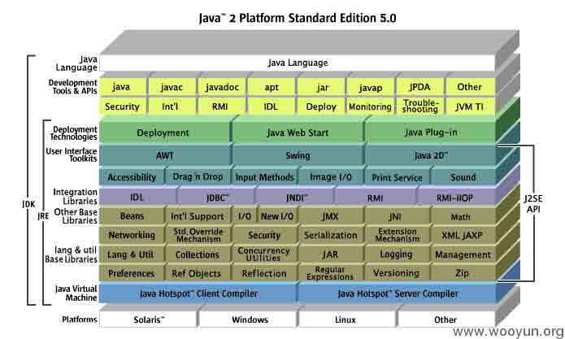

可以看到 Java 平台非常的庞大，而开发者的分化为：

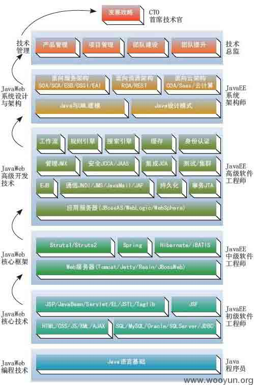

列举这两个图的原因就是让你知道你看到的 JSP 不过是冰山一角，Jsp 技术不过是 Java 初级开发人员必备的技术而已。

我今天要讲的就是 Java 树的最下面的两层了，也是初级工程师需要掌握的东西。

Web 请求与相应简要的流程：


这是一个典型的就是客户端发送一个 HTTP 请求到服务器端，服务器端接收到请求并处理、响应的一个过程。

如果请求的是 JSP，tomcat 会把我们的 JSP 编译成 Servlet 也就是一个普通的 Java 类。

其实 JSP 是 Servlet 的一种特殊形式，每个 JSP 页面就是一个 Servlet 实例。Servlet 又是一个普通的 Java 类它编译后就是一个普通的 class 文件。

这是一个普通的 jsp 脚本页面，因为我只用 JSP 来作为展示层仅仅做了简单的后端数据的页面展示：

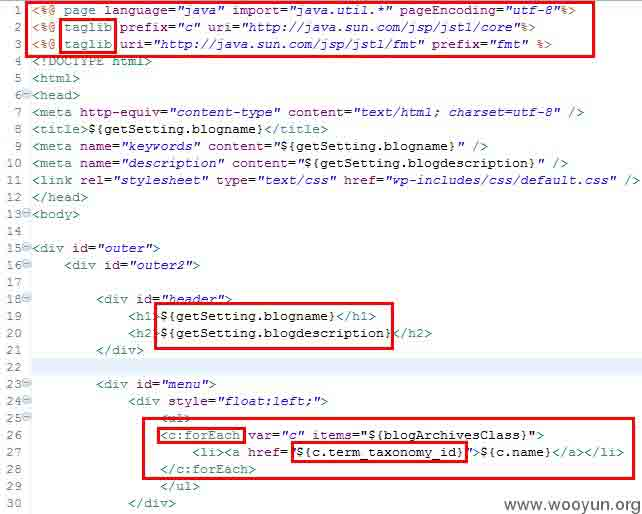

上图可以非常清晰的看到通常的 Jsp 在项目中的地位并不如我们大多数人所想的那么重要，甚至是可有可无！因为我们完全可以用其他的东西来代替 JSP 作为前端展示层。 我们来看一下这个页面编译成 class 后是什么样子：

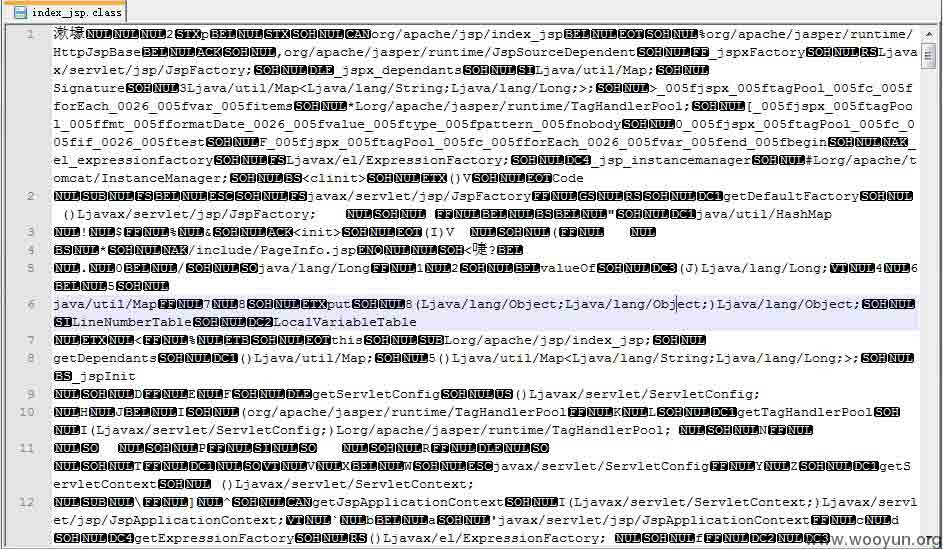

你会发现你根本就看不懂这个 class 文件，因为这是字节码文件我们根本就没法看。通过我们的 TOMCAT 编译后他编程了一个 Java 类文件保存在 Tomcat 的 work 目录下。

文件目录：`C:\apache-tomcat-7.0.34\work\Catalina\localhost\你的项目名\org\apache\jsp`

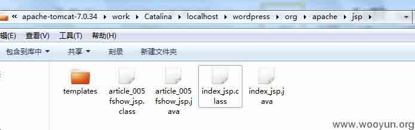

我们只要打开 index_jsp.java 或者用 jd-gui（Java 反编译工具）打开就行了：


有人说这是 Servlet 吗？当然了。

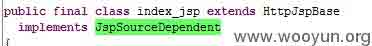

继承 HttpJspBase 类，该类其实是个 HttpServlet 的子类(jasper 是 tomcat 的 jsp engine)。

Jsp 有着比 Servlet 更加优越的展现，很多初学 PHP 的人恐怕很难把视图和逻辑分开吧。比如之前在写 PHPSQL 注入测试的 DEMO：

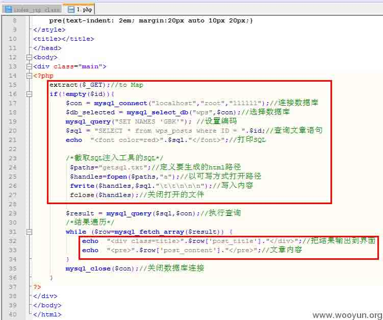 

这代码看起来似乎没有什么大的问题，也能正确的跑起来啊会有什么问题呢？原因很简单这属于典型的展现和业务逻辑没有分开！这和写得烂的 Servlet 差不多！

说了这么多，很多人会觉得 Servlet 很抽象。我们还是连创建一个 Servlet 吧：

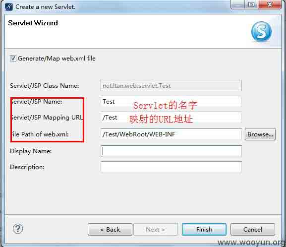

创建成功后会自动的往 web.xml 里面写入：

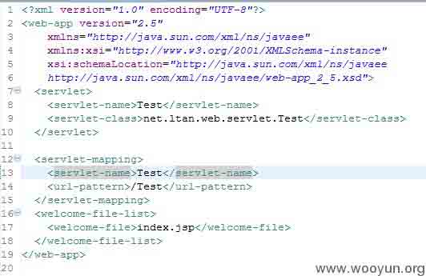

其实就是一个映射的 URL 和一个处理映射的类的路径。而我们自动生成的 Java 类精简后大致是这个样子：

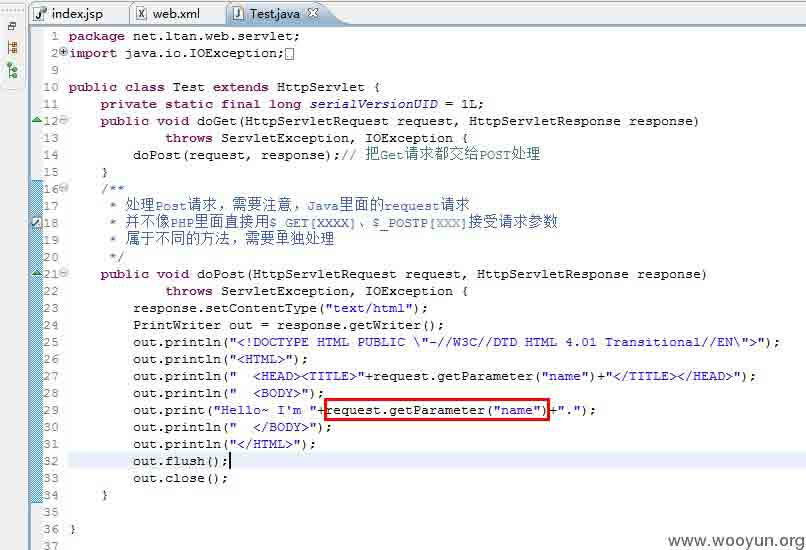

请求响应输出内容：

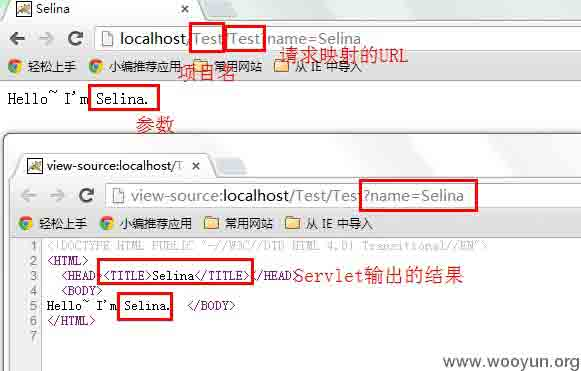

熟悉 PHP 的大神们这里就不做解释了哦。了解了 Jsp、Servlet 我们再来非常简单的看一下 JavaWeb 应用是怎样跑起来的。

加载 web.xml 的配置然后从配置里面获取各种信息为 WEB 应用启动准备。

#### 科普：`C:\apache-tomcat-7.0.34\webapps`下默认是部署的 Web 项目。webapps 下的文件夹就是你的项目名了，而项目下的 WebRoot 一般就是网站的根目录了，WebRoot 下的文件夹 WEB-INF 默认是不让 Web 访问的，一般存在配置泄漏多半是 nginx 配置没有过滤掉这个目录。


快速定位数据库连接信息：

大家可能都非常关心数据库连接一般都配置在什么地方呢？

答案普遍是：`C:\apache-tomcat-7.0.34\webapps\wordpress\WEB-INF`下的`***.xml`

大多数的 Spring 框架都是配置在 applicationContext 里面的：

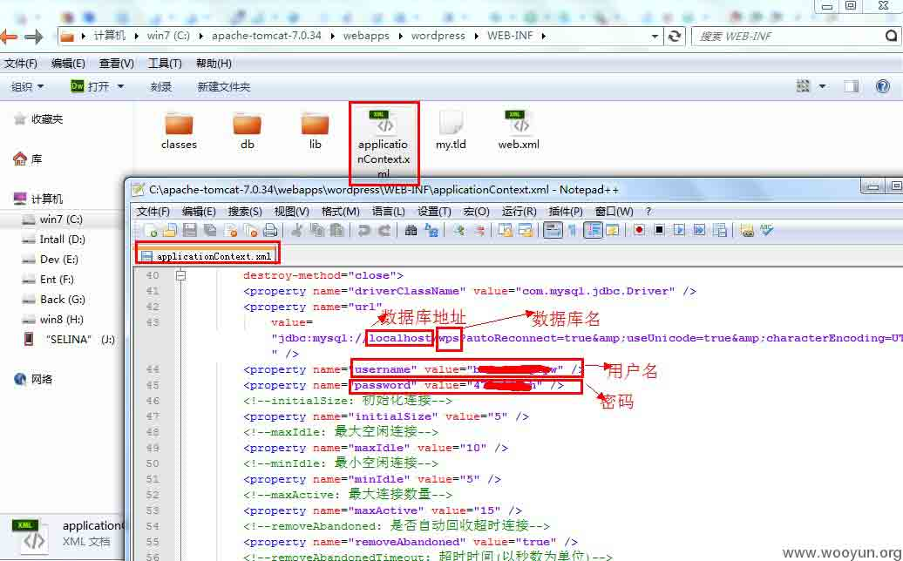

如果用到 Hibernate 框架那么：`WebRoot\WEB-INF\classes\hibernate.cfg.xml`

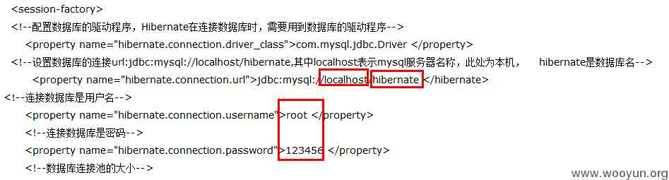

还有一种变态的配置方式就是直接卸载源代码里面:

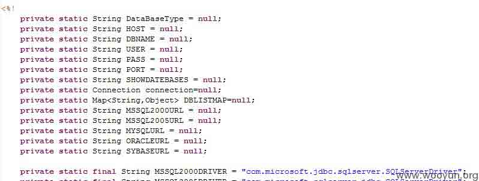

Tomcat 的数据源（其他的服务器大同小异）：

目录：`C:\apache-tomcat-7.0.34\conf\context.xml、server.xml`

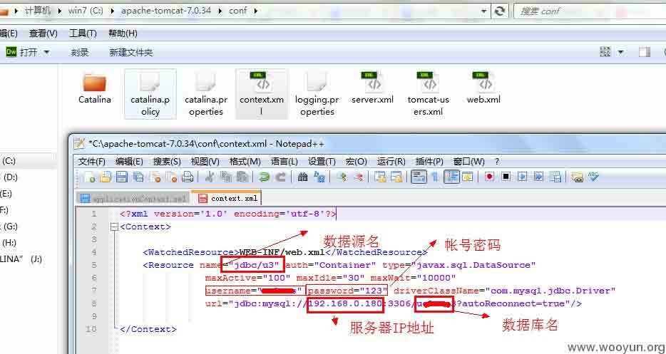

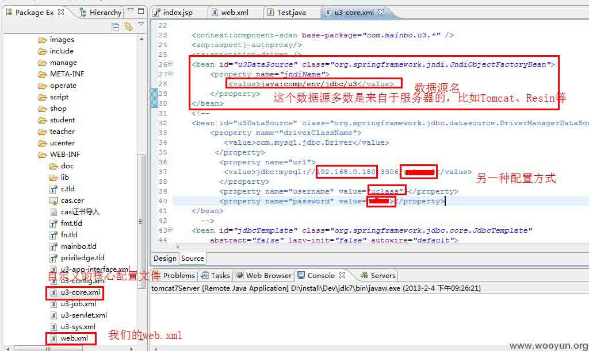

Resin 数据源：

路径：`D:\installDev\resin-pro-4.0.28conf\resin.conf(resin 3.x 是 resin.xml)`

其他的配置方式诸如读取如 JEECMS 读取的就是**.properties**配置文件，这种方式非常的常见：

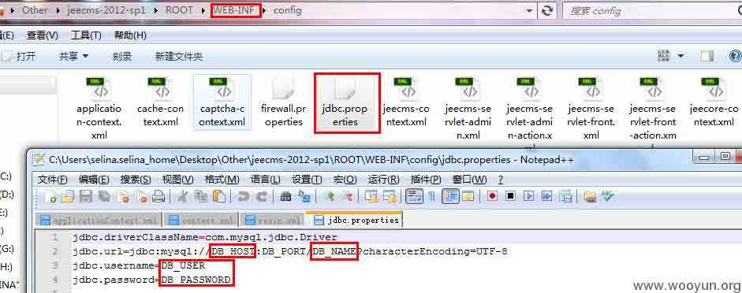

### 0x01 Tomcat 基础

* * *


没错,这就是 TOM 猫。楼主跟这只猫打交道已经有好几年了,在 Java 应用当中 TOMCAT 运用的非常的广泛。

TOM 猫是一个 Web 应用服务器,也是 Servlet 容器。

Apache+Tomcat 做负载均衡:

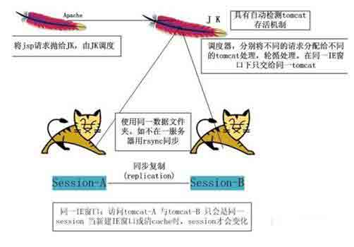

#### Tomcat 快速定位到网站目录：

如何快速的找到 tomcat 的安装路径:

```
1、不管是谁都应该明白的是不管 apache 还是 tomcat 安装的路径都是随意的，所以找不到路径也是非常正常的。
2、在你的/etc/httpd/conf/httpd.conf 里面会有一个 LoadModule jk_module 配置用于集成 tomcat 然后找到 JkWorkersFile 也就是 tomcat 的配置，找到.properties 的路径。httpd 里面也有可能会配置路径如果没有找到那就去 apache2\conf\extra\httpd-vhosts 看下有没有配置域名绑定。  
3、在第二步的时候找到了 properties 配置文件并读取，找到 workers.tomcat_home 也就是 tomcat 的配置路径了。  
4、得到 tomcat 的路径你还没有成功，域名的具体配置是在 conf 下的 server.xml。  
5、读取 server.xml 不出意外你就可以找到网站的目录了。  
6、如果第五步没有找到那么去 webapps 目录下 ROOT 瞧瞧默认不配置的话网站是部署在 ROOT 下的。  
7、这一点是附加的科普知识爱听则听：数据库如果启用的 tomcat 有可能会采用 tomcat 的数据源配置未见为 conf 下的 context.xml、server.xml。如果网站有域名绑定那么你可以试下 ping 域名然后带上端口访问。有可能会出现 tomcat 的登录界面。tomcat 默认是没有配置用户登录的，所以当 tomcat-users.xml 下没有相关的用户配置就别在这里浪费时间了。  
8、如果配置未找到那么到网站目录下的 WEB-INF 目录和其下的 classes 目录下找下对应的 properties、xml（一般都是 properties）。  
9、如果你够蛋疼可以读取 WEB.XML 下的 classess 内的源码。  
10、祝你好运。 
```

#### apache 快速定位到网站目录：

普通的域名绑定：

直接添加到`confhttpd.conf、confextrahttpd-vhosts.conf`

#### Resin 快速定位到网站目录:

在 resin 的 conf 下的 resin.conf(resin3.x)和 resin.xml(resin4.x)

Resin apache 负载均衡配置(从我以前的文章中节选的)

APACHE RESIN 做负载均衡,Resin 用来做 JAVAWEB 的支持,APACHE 用于处理静态

和 PHP 请求,RESIN 的速度飞快,RESIN 和 apache 的配合应该是非常完美的吧。

域名解析:

apache 的 httpd.conf:

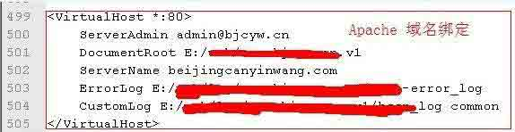

需要修改:Include conf/extra/httpd-vhosts.conf(一定要把前面的#除掉,否则配置不起作用)

普通的域名绑定:

直接添加到 httpd.conf

```
<VirtualHost *:80>
    ServerAdmin admin@bjcyw.cn
    DocumentRoot E:/XXXX/XXX
    ServerName beijingcanyinwang.com
    ErrorLog E:/XXXX/XXX/bssn-error_log
    CustomLog E:/XXXX/XXX/bssn_log common 
</VirtualHost> 
```

二级域名绑定,需要修改:

```
E:\install\apache2\conf\extra\httpd-vhosts.conf 
```

如:

```
<VirtualHost *:80>
    DocumentRoot E:/XXXXXXX/XXX
    ServerName bbs.beijingcanyinwang.com 
    DirectoryIndex index.html index.php index.htm
</VirtualHost> 
```

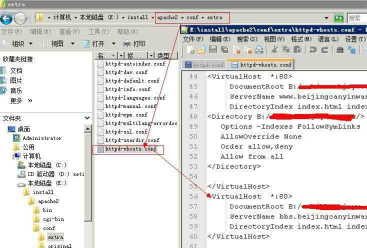

Resin 的

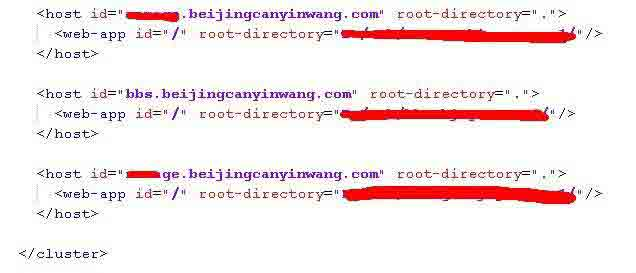

请求处理:

```
<LocationMatch (.*?).jsp>
SetHandler caucho-request 
</LocationMatch>
<LocationMatch (.*?).action> 
SetHandler caucho-request 
</LocationMatch>
<LocationMatch union-resin-stat-davic> 
SetHandler caucho-request 
</LocationMatch>
<LocationMatch stat> 
SetHandler caucho-request 
</LocationMatch> 
<LocationMatch load>
SetHandler caucho-request 
</LocationMatch> 
<LocationMatch vote> 
SetHandler caucho-request 
</LocationMatch> 
```

APACHE 添加对 Resin 的支持:


```
LoadModule caucho_module "E:/install/resin-pro-3.1.12/win32/apache-2.2/mod_caucho. dll" 
```

然后在末尾加上:

```
<IfModule mod_caucho.c> 
ResinConfigServer localhost 6800 
CauchoStatus yes
</IfModule> 
```

只有就能让 apache 找到 resin 了。

PHP 支持问题:

resin 默认是支持 PHP 的测试 4.0.29 的时候就算你把 PHP 解析的 servlet 配置删了一样解析 PHP,无奈换成了 resin 3.1 在注释掉 PHP 的 servlet 配置就无压力了。


整合成功后:

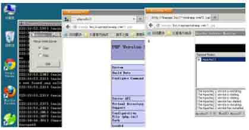

**Tags:** [java 安全](http://drops.wooyun.org/tag/java%e5%ae%89%e5%85%a8)

版权声明：未经授权禁止转载 [iswin](http://drops.wooyun.org/author/iswin "由 iswin 发布")@[乌云知识库](http://drops.wooyun.org)

分享到：

### 相关日志

*   [攻击 JavaWeb 应用[2]-CS 交互安全](http://drops.wooyun.org/tips/164)
*   [Java 安全模型介绍](http://drops.wooyun.org/tips/53)
*   [攻击 JavaWeb 应用[7]-Server 篇[1]](http://drops.wooyun.org/tips/604)
*   [.user.ini 文件构成的 PHP 后门](http://drops.wooyun.org/tips/3424)
*   [sqlmap 用户手册[续]](http://drops.wooyun.org/tips/401)
*   [2014 年澳大利亚信息安全挑战 CySCA CTF 官方 write up Web 篇](http://drops.wooyun.org/tips/2444)